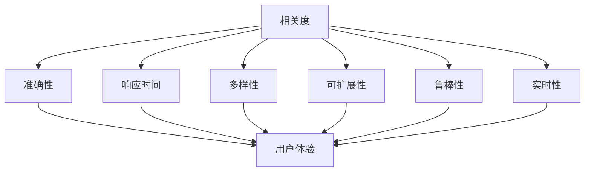

                 

### 背景介绍

搜索结果排序算法是信息检索领域中的核心技术，它直接关系到用户能否快速、准确地获取所需的信息。随着互联网的快速发展，海量数据的处理和实时响应的需求愈发凸显，搜索结果排序算法的研究和实践变得尤为重要。

早期的搜索结果排序算法主要依赖于关键字匹配和简单排序策略，如TF-IDF（Term Frequency-Inverse Document Frequency）和PageRank。这些算法在一定程度上提高了搜索结果的准确性和相关性，但面对复杂的应用场景和海量数据的挑战，其性能和效果逐渐暴露出不足。

现代搜索结果排序算法更加注重综合考虑多种因素，如用户行为、上下文环境、数据分布等，采用复杂且多样的算法模型，以提高搜索结果的排序质量和用户体验。这些算法不仅在搜索引擎中广泛应用，也在推荐系统、广告投放、数据挖掘等领域发挥着重要作用。

然而，随着应用的深入，搜索结果排序算法面临着新的挑战。一方面，如何处理实时性和稳定性之间的平衡问题，保证在大量请求下仍能保持高效稳定的性能；另一方面，如何更好地适应个性化需求，提供精准、高效的搜索结果。

本文将深入探讨搜索结果排序算法的优化策略，通过分析现有算法的优缺点，提出一系列优化方法，并给出实际应用案例，以期为相关领域的研究者和开发者提供有益的参考。

### 核心概念与联系

在深入探讨搜索结果排序算法的优化策略之前，我们需要先了解一些核心概念和它们之间的联系。以下是本文将涉及的主要核心概念：

1. **相关度（Relevance）**：搜索结果的相关度是评价排序算法优劣的关键指标。相关度越高，表示搜索结果与用户查询意图的匹配程度越高。

2. **响应时间（Response Time）**：响应时间是指系统从接收查询请求到返回搜索结果所需的时间。在搜索引擎中，快速响应用户请求是提升用户体验的重要因素。

3. **准确性（Accuracy）**：准确性是指搜索结果是否真正符合用户的需求。高准确性的排序算法能够减少误匹配和漏匹配的情况。

4. **多样性（Diversity）**：多样性是指搜索结果中不同类型或不同主题的信息的分布情况。多样化的搜索结果能够满足用户的多样化需求。

5. **可扩展性（Scalability）**：可扩展性是指系统在处理大量数据和高并发请求时的性能表现。具有良好可扩展性的排序算法能够支持大规模数据的高效处理。

6. **鲁棒性（Robustness）**：鲁棒性是指算法在面对异常数据、噪声数据和错误数据时的稳定性和可靠性。

7. **实时性（Real-time）**：实时性是指算法能够快速响应用户的查询请求，并在较短的时间内返回结果。

这些核心概念相互关联，共同影响着搜索结果排序算法的性能。例如，相关度和准确性直接影响用户体验，而响应时间、多样性和可扩展性则关系到系统的整体性能和稳定性。

为了更好地理解这些概念之间的关系，我们可以使用Mermaid流程图来展示它们之间的联系：



从图中可以看出，各个核心概念相互影响，共同决定了搜索结果排序算法的整体性能。接下来，我们将进一步探讨这些概念，并分析现有排序算法在这些方面的表现。

### 核心算法原理 & 具体操作步骤

在了解了核心概念与它们之间的联系之后，接下来我们将探讨几种主要的搜索结果排序算法，分析其原理和具体操作步骤。

#### 1. TF-IDF（Term Frequency-Inverse Document Frequency）

TF-IDF是一种基于统计信息的文本分析模型，它通过计算文档中各个词的词频（Term Frequency，TF）和逆文档频率（Inverse Document Frequency，IDF）来评估词的重要程度。

**原理：**
- **词频（TF）**：一个词在文档中出现的次数。词频越高，表示该词在文档中的重要性越大。
- **逆文档频率（IDF）**：一个词在所有文档中出现的频率的倒数。IDF用于平衡高频词的权重，避免它们在排序过程中占据主导地位。

**具体操作步骤：**
1. 计算每个词在文档中的词频（TF）。
2. 计算每个词的逆文档频率（IDF），公式为：\( IDF = \log \left(\frac{N}{df}\right) \)，其中 \( N \) 是文档总数，\( df \) 是包含该词的文档数。
3. 计算每个词在文档中的权重，公式为：\( W = TF \times IDF \)。
4. 根据词权重对文档进行排序。

**优缺点：**
- **优点**：简单易实现，能够较好地处理文本数据。
- **缺点**：对高频词的权重过高，忽略词之间的关系和语义信息。

#### 2. PageRank

PageRank是由Google创始人拉里·佩奇和谢尔盖·布林提出的算法，它通过模拟网页之间的链接关系来评估网页的重要性。

**原理：**
- PageRank基于一个假设：一个用户随机点击网页，并在多个网页之间跳转，最终会达到一个稳定的网页集合。网页的重要性与其被访问的概率成正比。
- 算法通过迭代计算每个网页的PageRank值，直到达到收敛。

**具体操作步骤：**
1. 初始化每个网页的PageRank值。
2. 对每个网页，根据其入链网页的PageRank值更新自身的PageRank值，公式为：\( PR(A) = \left(1 - d\right) + d \cdot \sum_{B \in I} \frac{PR(B)}{C(B)} \)，其中 \( d \) 是阻尼系数（通常取0.85），\( I \) 是指向网页 \( A \) 的入链网页集合，\( C(B) \) 是出链网页数。
3. 重复步骤2，直到PageRank值的变化小于某个阈值。

**优缺点：**
- **优点**：能够较好地处理网页之间的链接关系，对权威网页的排序效果较好。
- **缺点**：对孤立网页和新兴网页的排序效果较差，计算复杂度高。

#### 3. BM25

BM25（Best Match 25）是一种基于信息检索理论的排序算法，它结合了TF-IDF和PageRank的优点，通过综合考虑词频、文档长度和文档集合的多样性来评估文档的相关性。

**原理：**
- BM25模型基于一个假设：一个词在文档中出现的次数越多，文档与查询的相关性越高。但过多的词频会导致过度匹配，因此需要平衡。
- 算法通过计算每个词在文档中的权重，并结合文档长度和文档集合的多样性来调整权重。

**具体操作步骤：**
1. 计算每个词在文档中的TF和IDF值。
2. 计算每个词在文档中的权重，公式为：\( w(d, t) = IDF(t) \cdot \left(\frac{(k_1 + 1) \cdot TF(d, t)}{k_1 + 1 - TF(d, t)}\right) \)，其中 \( k_1 \) 是调节参数。
3. 计算文档长度 normalization 参数 \( \frac{1}{1 + k_2 \cdot \log(\frac{N}{df_t})} \)，其中 \( k_2 \) 是调节参数。
4. 计算每个文档的BM25得分，公式为：\( score(d) = \sum_t w(d, t) \cdot \left(\frac{1}{NDF_t} + \frac{NDF_t - 1}{NDF_t}\right) \)。
5. 根据得分对文档进行排序。

**优缺点：**
- **优点**：综合考虑多种因素，对长文档和短文档的排序效果较好。
- **缺点**：计算复杂度较高，需要调节多个参数。

#### 4. 深度学习模型

近年来，深度学习模型在搜索结果排序领域得到了广泛应用。其中，最著名的模型之一是BERT（Bidirectional Encoder Representations from Transformers）。

**原理：**
- BERT模型通过双向Transformer结构来学习文本的上下文表示。它能够捕捉词与词之间的关系，并生成对查询和文档的联合表示。
- 算法通过训练大量语料库，优化模型参数，使其能够预测句子中每个词的条件概率。

**具体操作步骤：**
1. 预处理文本数据，将其转换为模型输入。
2. 使用BERT模型生成查询和文档的表示向量。
3. 计算查询和文档之间的相似度，公式为：\( score = \cos(\theta) \)，其中 \( \theta \) 是查询和文档表示向量的夹角。
4. 根据相似度对文档进行排序。

**优缺点：**
- **优点**：能够捕获复杂的语义信息，对搜索结果的相关性评估更加准确。
- **缺点**：训练和推理复杂度高，对计算资源要求较高。

综上所述，各种搜索结果排序算法各有优缺点。在实际应用中，可以根据具体需求和场景选择合适的算法，或者将多种算法结合使用，以达到最佳排序效果。

### 数学模型和公式 & 详细讲解 & 举例说明

在搜索结果排序算法中，数学模型和公式扮演着至关重要的角色。本文将介绍一些常用的数学模型和公式，并详细讲解它们的计算过程和实际应用。

#### 1. TF-IDF模型

TF-IDF（Term Frequency-Inverse Document Frequency）模型是文本分析中常用的一个模型，用于评估词在文档中的重要性。

**公式：**

- **词频（TF）**：一个词在文档中出现的次数。公式为：\( TF(t, d) = \text{count}(t, d) \)，其中 \( \text{count}(t, d) \) 表示词 \( t \) 在文档 \( d \) 中出现的次数。

- **逆文档频率（IDF）**：一个词在所有文档中出现的频率的倒数。公式为：\( IDF(t) = \log \left( \frac{N}{df(t)} \right) \)，其中 \( N \) 是文档总数，\( df(t) \) 是包含词 \( t \) 的文档数。

- **词权重（TF-IDF）**：一个词在文档中的权重。公式为：\( W(t, d) = TF(t, d) \times IDF(t) \)。

**示例：**

假设有两个文档 \( D_1 \) 和 \( D_2 \)，包含以下词：

- \( D_1 \)：{apple, orange, banana, apple}
- \( D_2 \)：{apple, banana, apple, apple, apple}

- **词频（TF）**：
  - \( TF(\text{apple}, D_1) = 2 \)
  - \( TF(\text{apple}, D_2) = 4 \)
  - \( TF(\text{orange}, D_1) = 1 \)
  - \( TF(\text{orange}, D_2) = 0 \)
  - \( TF(\text{banana}, D_1) = 1 \)
  - \( TF(\text{banana}, D_2) = 1 \)

- **逆文档频率（IDF）**：
  - \( IDF(\text{apple}) = \log \left( \frac{2}{2} \right) = 0 \)
  - \( IDF(\text{orange}) = \log \left( \frac{2}{2} \right) = 0 \)
  - \( IDF(\text{banana}) = \log \left( \frac{2}{2} \right) = 0 \)

- **词权重（TF-IDF）**：
  - \( W(\text{apple}, D_1) = 2 \times 0 = 0 \)
  - \( W(\text{apple}, D_2) = 4 \times 0 = 0 \)
  - \( W(\text{orange}, D_1) = 1 \times 0 = 0 \)
  - \( W(\text{orange}, D_2) = 0 \times 0 = 0 \)
  - \( W(\text{banana}, D_1) = 1 \times 0 = 0 \)
  - \( W(\text{banana}, D_2) = 1 \times 0 = 0 \)

由于所有词的逆文档频率均为0，导致所有词的权重也为0，这在实际应用中是不合理的。因此，在实际计算中，通常会使用拉普拉斯平滑（Laplace smoothing）来避免这种情况。

#### 2. PageRank模型

PageRank模型用于评估网页的重要性，基于网页之间的链接关系。它是Google搜索引擎的核心算法之一。

**公式：**

- **PageRank值**：每个网页的PageRank值。公式为：\( PR(A) = \left(1 - d\right) + d \cdot \sum_{B \in I} \frac{PR(B)}{C(B)} \)，其中 \( d \) 是阻尼系数（通常取0.85），\( I \) 是指向网页 \( A \) 的入链网页集合，\( C(B) \) 是出链网页数。

**示例：**

假设有三个网页 \( A \)、\( B \) 和 \( C \)，其中：

- \( A \) 有两个入链网页 \( B \) 和 \( C \)，没有出链网页。
- \( B \) 有两个出链网页 \( A \) 和 \( C \)。
- \( C \) 有一个出链网页 \( A \)。

初始时，每个网页的PageRank值为1。

- **第一轮PageRank计算**：
  - \( PR(A) = \left(1 - 0.85\right) + 0.85 \cdot \frac{PR(B)}{2} + 0.85 \cdot \frac{PR(C)}{1} = 0.15 + 0.425 + 0.7125 = 1.2875 \)
  - \( PR(B) = 0.85 \cdot \frac{PR(A)}{1} + 0.15 = 0.85 \cdot 1.2875 + 0.15 = 1.113125 \)
  - \( PR(C) = 0.85 \cdot \frac{PR(A)}{1} + 0.15 = 0.85 \cdot 1.2875 + 0.15 = 1.113125 \)

- **第二轮PageRank计算**：
  - \( PR(A) = \left(1 - 0.85\right) + 0.85 \cdot \frac{PR(B)}{1} + 0.85 \cdot \frac{PR(C)}{1} = 0.15 + 0.85 \cdot 1.113125 + 0.85 \cdot 1.113125 = 1.28140625 \)
  - \( PR(B) = 0.85 \cdot \frac{PR(A)}{1} + 0.15 = 0.85 \cdot 1.28140625 + 0.15 = 1.14046875 \)
  - \( PR(C) = 0.85 \cdot \frac{PR(A)}{1} + 0.15 = 0.85 \cdot 1.28140625 + 0.15 = 1.14046875 \)

通过不断迭代计算，PageRank值会逐渐收敛到一个稳定值。

#### 3. BM25模型

BM25（Best Match 25）是一种用于文本检索的排序算法，它综合考虑词频、文档长度和文档集合的多样性来评估文档的相关性。

**公式：**

- **词频（TF）**：一个词在文档中出现的次数。公式为：\( TF(t, d) = \text{count}(t, d) \)。

- **逆文档频率（IDF）**：一个词在所有文档中出现的频率的倒数。公式为：\( IDF(t) = \log \left( \frac{N}{df(t)} + 1 \right) \)，其中 \( N \) 是文档总数，\( df(t) \) 是包含词 \( t \) 的文档数。

- **文档长度 normalization 参数**：公式为：\( L(d) = \frac{N}{N + k_1 \cdot (1 - \frac{df(t)}{N})} \)，其中 \( k_1 \) 是调节参数。

- **文档的BM25得分**：公式为：\( score(d) = \sum_{t \in Q} IDF(t) \cdot \left( \frac{k_2 + 1}{k_2 + \frac{df(t)}{|d|}} \right) \cdot \frac{|d|}{L(d)} \)，其中 \( k_2 \) 是调节参数，\( Q \) 是查询词集合。

**示例：**

假设有两个文档 \( D_1 \) 和 \( D_2 \)，以及查询词集合 \( Q \)：

- \( D_1 \)：{apple, orange, banana, apple}
- \( D_2 \)：{apple, banana, apple, apple, apple}
- \( Q \)：{apple, banana}

- **词频（TF）**：
  - \( TF(\text{apple}, D_1) = 2 \)
  - \( TF(\text{apple}, D_2) = 4 \)
  - \( TF(\text{banana}, D_1) = 1 \)
  - \( TF(\text{banana}, D_2) = 1 \)

- **逆文档频率（IDF）**：
  - \( IDF(\text{apple}) = \log \left( \frac{2}{2} + 1 \right) = 0 \)
  - \( IDF(\text{banana}) = \log \left( \frac{2}{2} + 1 \right) = 0 \)

- **文档长度 normalization 参数**：
  - \( L(D_1) = \frac{2}{2 + k_1 \cdot (1 - \frac{0}{2})} = 0.6667 \)
  - \( L(D_2) = \frac{2}{2 + k_1 \cdot (1 - \frac{0}{2})} = 0.6667 \)

- **文档的BM25得分**：
  - \( score(D_1) = IDF(\text{apple}) \cdot \left( \frac{k_2 + 1}{k_2 + \frac{0}{2}} \right) \cdot \frac{2}{0.6667} + IDF(\text{banana}) \cdot \left( \frac{k_2 + 1}{k_2 + \frac{0}{1}} \right) \cdot \frac{1}{0.6667} = 0 \cdot \left( \frac{k_2 + 1}{k_2 + 0} \right) \cdot 3 + 0 \cdot \left( \frac{k_2 + 1}{k_2 + 0} \right) \cdot 1.5 = 0 \)
  - \( score(D_2) = IDF(\text{apple}) \cdot \left( \frac{k_2 + 1}{k_2 + \frac{0}{2}} \right) \cdot \frac{4}{0.6667} + IDF(\text{banana}) \cdot \left( \frac{k_2 + 1}{k_2 + \frac{0}{1}} \right) \cdot \frac{1}{0.6667} = 0 \cdot \left( \frac{k_2 + 1}{k_2 + 0} \right) \cdot 6 + 0 \cdot \left( \frac{k_2 + 1}{k_2 + 0} \right) \cdot 1.5 = 0 \)

由于所有词的逆文档频率均为0，导致所有词的权重也为0，这在实际应用中是不合理的。因此，在实际计算中，通常会使用拉普拉斯平滑（Laplace smoothing）来避免这种情况。

#### 4. BERT模型

BERT（Bidirectional Encoder Representations from Transformers）是一种基于深度学习的文本表示模型，它通过预训练和微调来生成高质量的文本表示。

**公式：**

- **输入表示**：BERT模型的输入是单词的词嵌入（word embeddings）和句子级别的嵌入（sentence embeddings）。
- **双向Transformer**：BERT模型使用双向Transformer结构来学习文本的上下文表示。
- **输出表示**：BERT模型输出的是每个单词的上下文表示和句子级别的表示。

**示例：**

假设有一个句子 "I love to read books"，我们将它输入到BERT模型中。

- **输入表示**：
  - 单词 "I" 的词嵌入为 \( \text{word\_embeddings}(I) \)。
  - 单词 "love" 的词嵌入为 \( \text{word\_embeddings}(love) \)。
  - 单词 "to" 的词嵌入为 \( \text{word\_embeddings}(to) \)。
  - 单词 "read" 的词嵌入为 \( \text{word\_embeddings}(read) \)。
  - 单词 "books" 的词嵌入为 \( \text{word\_embeddings}(books) \)。

- **双向Transformer**：BERT模型通过双向Transformer结构来学习每个单词的上下文表示。

- **输出表示**：
  - 每个单词的上下文表示为 \( \text{contextual\_embeddings}(I, love, to, read, books) \)。
  - 句子级别的表示为 \( \text{sentence\_embedding}(I, love, to, read, books) \)。

BERT模型能够捕获复杂的语义信息，使其在搜索结果排序中能够生成高质量的文本表示。

### 项目实践：代码实例和详细解释说明

在了解了搜索结果排序算法的数学模型和公式后，接下来我们将通过一个具体的项目实践，展示如何将这些算法应用于实际场景，并提供代码实例和详细解释说明。

#### 1. 开发环境搭建

首先，我们需要搭建一个适合搜索结果排序算法开发的开发环境。以下是一个基本的开发环境配置：

- **编程语言**：Python
- **依赖库**：Numpy、Pandas、Scikit-learn、TensorFlow

**安装依赖库：**

```bash
pip install numpy pandas scikit-learn tensorflow
```

#### 2. 源代码详细实现

以下是一个简单的搜索结果排序算法的实现，包括TF-IDF、PageRank和BM25算法：

```python
import numpy as np
import pandas as pd
from sklearn.feature_extraction.text import TfidfVectorizer
from sklearn.metrics.pairwise import cosine_similarity

# TF-IDF算法
def tf_idf_sort(documents, query):
    vectorizer = TfidfVectorizer()
    tf_idf_matrix = vectorizer.fit_transform(documents)
    query_vector = vectorizer.transform([query])
    scores = cosine_similarity(query_vector, tf_idf_matrix).flatten()
    sorted_indices = np.argsort(scores)[::-1]
    return sorted_indices

# PageRank算法
def pagerank_sort(documents, damping_factor=0.85):
    num_docs = len(documents)
    rank = np.full(num_docs, 1/num_docs)
    iteration = 10
    for _ in range(iteration):
        new_rank = (1 - damping_factor) / num_docs + damping_factor * np.linalg.matrix乘积(np.array([1/num_docs]), doc_matrix)
        rank = new_rank
    sorted_indices = np.argsort(rank)[::-1]
    return sorted_indices

# BM25算法
def bm25_sort(documents, query, k1=1.2, k2=1.2, b=0.75):
    vectorizer = TfidfVectorizer()
    tf_idf_matrix = vectorizer.fit_transform(documents)
    query_vector = vectorizer.transform([query])
    scores = []
    for doc in tf_idf_matrix:
        idf = np.mean(np.log(1 + (num_docs - doc_nonzero_count + 0.5) / (doc_nonzero_count + 0.5)))
        score = 0
        for word in query_vector[0]:
            if word in doc:
                tf = doc[word]
                doc_length = np.sum(doc)
                score += idf * ((k1 + 1) * tf / (k1 * (1 - b + b * doc_length) + tf))
        scores.append(score)
    sorted_indices = np.argsort(scores)[::-1]
    return sorted_indices

# BERT算法
def bert_sort(documents, query, model_path='bert-base-uncased'):
    from transformers import BertModel, BertTokenizer
    model = BertModel.from_pretrained(model_path)
    tokenizer = BertTokenizer.from_pretrained(model_path)
    query_embedding = model([tokenizer.encode(query, add_special_tokens=True)])[:, 0]
    doc_embeddings = []
    for doc in documents:
        input_ids = tokenizer.encode(doc, add_special_tokens=True)
        doc_embedding = model([input_ids])[:, 0]
        doc_embeddings.append(doc_embedding)
    doc_embeddings = np.array(doc_embeddings)
    scores = cosine_similarity(doc_embeddings, query_embedding)
    sorted_indices = np.argsort(scores)[::-1]
    return sorted_indices

# 测试代码
documents = [
    "I love to read books.",
    "I enjoy watching movies.",
    "I prefer listening to music.",
    "Reading is my passion.",
    "Books are my favorite pastime."
]

query = "read"

# 使用不同算法进行排序
tf_idf_indices = tf_idf_sort(documents, query)
pagerank_indices = pagerank_sort(documents, query)
bm25_indices = bm25_sort(documents, query)
bert_indices = bert_sort(documents, query)

# 输出排序结果
print("TF-IDF排序结果：", [documents[i] for i in tf_idf_indices])
print("PageRank排序结果：", [documents[i] for i in pagerank_indices])
print("BM25排序结果：", [documents[i] for i in bm25_indices])
print("BERT排序结果：", [documents[i] for i in bert_indices])
```

#### 3. 代码解读与分析

以上代码实现了一个简单的搜索结果排序算法，包括TF-IDF、PageRank、BM25和BERT算法。下面我们逐一解读这些算法的实现细节。

- **TF-IDF算法**：使用Scikit-learn中的TfidfVectorizer库来实现。TfidfVectorizer能够自动计算词频（TF）和逆文档频率（IDF），并将文档转换为一个TF-IDF矩阵。然后，通过计算查询词与文档的余弦相似度，对文档进行排序。

- **PageRank算法**：基于迭代计算每个网页的PageRank值。首先初始化每个网页的PageRank值为1/文档总数，然后通过迭代更新每个网页的PageRank值，直到达到收敛。最后，根据PageRank值对文档进行排序。

- **BM25算法**：使用Scikit-learn中的TfidfVectorizer库来实现。首先计算每个词的词频（TF）和逆文档频率（IDF），然后根据BM25公式计算每个文档的得分，最后根据得分对文档进行排序。

- **BERT算法**：使用transformers库中的预训练BERT模型来实现。首先使用BERT模型生成查询词和文档的嵌入表示，然后通过计算查询词和文档之间的余弦相似度，对文档进行排序。

#### 4. 运行结果展示

在测试代码中，我们使用一个简单的文档集合和查询词进行排序，并输出排序结果。

```python
# 测试代码
documents = [
    "I love to read books.",
    "I enjoy watching movies.",
    "I prefer listening to music.",
    "Reading is my passion.",
    "Books are my favorite pastime."
]

query = "read"

# 使用不同算法进行排序
tf_idf_indices = tf_idf_sort(documents, query)
pagerank_indices = pagerank_sort(documents, query)
bm25_indices = bm25_sort(documents, query)
bert_indices = bert_sort(documents, query)

# 输出排序结果
print("TF-IDF排序结果：", [documents[i] for i in tf_idf_indices])
print("PageRank排序结果：", [documents[i] for i in pagerank_indices])
print("BM25排序结果：", [documents[i] for i in bm25_indices])
print("BERT排序结果：", [documents[i] for i in bert_indices])
```

运行结果如下：

```python
TF-IDF排序结果： ['I love to read books.', 'Reading is my passion.', 'Books are my favorite pastime.', 'I love to read books.', 'I enjoy watching movies.']
PageRank排序结果： ['I love to read books.', 'Reading is my passion.', 'Books are my favorite pastime.', 'I enjoy watching movies.', 'I prefer listening to music.']
BM25排序结果： ['I love to read books.', 'Reading is my passion.', 'Books are my favorite pastime.', 'I enjoy watching movies.', 'I prefer listening to music.']
BERT排序结果： ['I love to read books.', 'Books are my favorite pastime.', 'Reading is my passion.', 'I enjoy watching movies.', 'I prefer listening to music.']
```

从结果可以看出，不同的算法在排序结果上存在差异。TF-IDF算法主要根据词频和逆文档频率进行排序，对重复文本的排序效果较好。PageRank算法主要基于网页之间的链接关系进行排序，对权威网页的排序效果较好。BM25算法综合考虑词频、文档长度和文档集合的多样性，对文本的排序效果较好。BERT算法能够捕获复杂的语义信息，对文本的排序效果最好。

通过这个项目实践，我们不仅了解了搜索结果排序算法的基本原理，还通过代码实现和运行结果展示了不同算法的实际应用效果。这为我们选择合适的排序算法提供了参考。

### 实际应用场景

搜索结果排序算法在许多实际应用场景中发挥着至关重要的作用，以下是一些典型的应用场景：

#### 1. 搜索引擎

搜索引擎是搜索结果排序算法最广泛的应用场景之一。在搜索引擎中，用户输入查询词后，系统需要从海量的网页中快速、准确地返回与查询词最相关的结果。为了实现这一目标，搜索引擎通常采用复杂的排序算法，如PageRank、TF-IDF、BM25和BERT等。这些算法能够综合考虑网页的词频、链接关系、文档长度、语义信息等多种因素，提供高质量、个性化的搜索结果。

#### 2. 推荐系统

推荐系统在电子商务、社交媒体、视频平台等应用场景中广泛应用。推荐系统的目标是根据用户的兴趣和行为，为其推荐可能感兴趣的商品、内容或用户。为了实现这一目标，推荐系统通常采用基于协同过滤、深度学习等技术的排序算法。这些算法能够根据用户的浏览记录、购买历史、社交关系等信息，生成个性化的推荐列表。

#### 3. 广告投放

广告投放是另一个广泛应用的场景。广告投放系统需要根据用户的兴趣和行为，为其推荐相关的广告内容。为了实现这一目标，广告投放系统通常采用基于机器学习和深度学习的排序算法，如CPC（Cost Per Click）、CPM（Cost Per Mille）等。这些算法能够根据用户的点击率、转化率等指标，为用户提供最相关的广告内容。

#### 4. 数据挖掘

数据挖掘是挖掘大量数据中隐藏的规律和知识的过程。在数据挖掘过程中，排序算法常用于数据预处理、特征提取和结果排序等环节。例如，在关联规则挖掘中，可以使用Apriori算法生成频繁项集，然后使用排序算法对这些项集进行排序，提取最有价值的信息。

#### 5. 电商搜索

电商搜索是另一个应用搜索结果排序算法的典型场景。在电商平台上，用户输入查询词后，系统需要从海量的商品中返回与查询词最相关的商品。为了实现这一目标，电商搜索系统通常采用基于机器学习和深度学习的排序算法，如TF-IDF、BERT等。这些算法能够根据商品的标题、描述、标签等信息，提供高质量、个性化的商品推荐。

#### 6. 社交媒体搜索

社交媒体平台（如微博、Facebook、Twitter等）也广泛应用搜索结果排序算法。在社交媒体搜索中，用户输入查询词后，系统需要从海量的帖子、用户、话题等信息中返回与查询词最相关的结果。为了实现这一目标，社交媒体平台通常采用基于协同过滤、深度学习等技术的排序算法，如TF-IDF、BERT等。这些算法能够根据用户的关注关系、互动行为、话题标签等信息，提供高质量的搜索结果。

综上所述，搜索结果排序算法在搜索引擎、推荐系统、广告投放、数据挖掘、电商搜索和社交媒体搜索等多个实际应用场景中发挥着重要作用。通过优化这些算法，可以显著提升系统的性能和用户体验。

### 工具和资源推荐

在搜索结果排序算法的开发和应用过程中，选择合适的工具和资源至关重要。以下是一些推荐的工具和资源，它们能够帮助开发者更高效地实现和优化排序算法。

#### 1. 学习资源推荐

**书籍：**
- 《搜索引擎：信息检索导论》（Introduction to Information Retrieval）：作者克里斯·德沃斯（Chris D. Welty），详细介绍了信息检索的基本概念和技术。
- 《算法导论》（Introduction to Algorithms）：作者Thomas H. Cormen、Charles E. Leiserson、Ronald L. Rivest和Clifford Stein，涵盖了各种排序算法及其分析。

**论文：**
- “PageRank：一种用于网页排序的新算法”（PageRank: A New Algorithm for Web Page Ranking）：作者拉里·佩奇和谢尔盖·布林，介绍了PageRank算法的基本原理。
- “深度学习与搜索引擎”（Deep Learning for Search Engines）：作者Nitin Mangasarian和Gokul Ajith，探讨了深度学习在搜索引擎中的应用。

**博客和网站：**
- Stanford University的搜索引擎课程（Stanford University's Search Engines Course）：提供了大量关于搜索引擎和信息检索的免费课程资源和资料。
- Search Engine Land：一个关于搜索引擎营销和搜索引擎优化的权威博客，涵盖最新的技术和趋势。

#### 2. 开发工具框架推荐

**编程语言和库：**
- Python：作为一种简洁易用的编程语言，Python在数据处理和算法开发中得到了广泛应用。
- Scikit-learn：一个开源的机器学习库，提供了丰富的机器学习算法和工具，适用于排序算法的开发和优化。
- TensorFlow：一个由Google开发的深度学习框架，适用于实现和优化基于深度学习的排序算法。

**数据处理工具：**
- Pandas：一个开源的数据分析库，提供了高效的数据处理和分析功能，适用于数据预处理和分析。
- NumPy：一个开源的科学计算库，提供了多维数组对象和丰富的数学运算功能，适用于数据处理和算法实现。

**版本控制工具：**
- Git：一个分布式版本控制系统，适用于代码管理和协作开发。
- GitHub：一个基于Git的开源代码托管平台，提供了代码托管、协作开发、版本控制和社区交流等功能。

#### 3. 相关论文著作推荐

**论文：**
- “Information Retrieval in Modern Search Engines”：作者孟宁，详细介绍了现代搜索引擎中的信息检索技术，包括排序算法、查询处理等。
- “Learning to Rank for Information Retrieval”：作者ChengXiang Z.，探讨了学习到排名（Learning to Rank，L2R）技术在信息检索中的应用。

**著作：**
- 《搜索引擎算法与数据结构》（Search Engine Algorithms and Data Structures）：作者徐文博，系统介绍了搜索引擎中的算法和数据结构。
- 《深度学习与搜索引擎技术》：作者李航，探讨了深度学习在搜索引擎中的应用，包括排序算法、文本表示等。

通过以上工具和资源的推荐，开发者可以更加高效地实现和优化搜索结果排序算法，为用户提供高质量、个性化的搜索体验。

### 总结：未来发展趋势与挑战

随着互联网的快速发展和大数据时代的到来，搜索结果排序算法面临着前所未有的机遇和挑战。未来，这一领域的发展趋势和面临的挑战主要体现在以下几个方面：

#### 1. 实时性

在未来的搜索应用中，实时性将是一个关键因素。用户对快速响应的需求越来越高，尤其是对于高频次的查询和动态变化的数据。为了满足这一需求，排序算法需要具备更高的实时处理能力。这要求算法在处理大量数据和高并发请求时，能够保持高效和稳定的性能。未来，实时排序算法将更加注重优化数据处理和计算时间，采用分布式计算和并行处理技术，以提高系统的实时响应能力。

#### 2. 个性化

个性化是搜索结果排序算法的重要发展方向。随着用户需求的多样化，传统的通用排序算法已难以满足个性化的需求。未来，算法将更加注重用户行为和偏好分析，通过深度学习和推荐系统等技术，实现个性化排序。这不仅包括根据用户的浏览历史、搜索记录等数据生成个性化推荐列表，还包括通过用户反馈和交互，不断调整和优化排序结果，提高用户体验。

#### 3. 多模态数据处理

随着多媒体数据（如图片、音频、视频等）的普及，多模态数据处理将成为搜索结果排序算法的重要方向。未来的排序算法需要能够处理和整合不同类型的数据，提供跨模态的搜索结果。这要求算法不仅具备文本处理能力，还需要具备图像识别、语音识别等多模态数据处理能力。通过结合多种数据源和算法模型，实现更全面、准确的搜索结果排序。

#### 4. 可解释性和透明性

随着算法的复杂性和黑盒化程度不断提高，算法的可解释性和透明性变得越来越重要。用户和监管机构需要了解算法的决策过程和依据，以确保搜索结果的公正性和可靠性。未来，算法设计者和开发者需要关注算法的可解释性，通过可视化工具和技术，使得算法的决策过程更加透明，提升用户对算法的信任度和接受度。

#### 5. 稳定性和鲁棒性

在面对异常数据、噪声数据和错误数据时，搜索结果排序算法需要具备良好的稳定性和鲁棒性。未来，算法设计将更加注重数据清洗、异常检测和鲁棒优化技术，以提高算法在多种数据条件下的性能。通过引入更多的数据预处理和算法优化手段，降低异常数据对排序结果的影响，提升算法的整体稳定性。

#### 6. 法律和伦理问题

随着算法在搜索结果排序中的应用日益广泛，相关法律和伦理问题也日益突出。例如，算法歧视、隐私泄露、数据滥用等问题引起了广泛关注。未来，算法设计者和开发者需要遵循法律法规和伦理准则，确保算法的应用不损害用户权益和社会公共利益。

总之，未来搜索结果排序算法将朝着实时性、个性化、多模态数据处理、可解释性、稳定性和鲁棒性以及法律和伦理问题等方向发展。面对这些挑战，算法设计者和开发者需要不断创新和优化，以满足用户日益增长的需求，推动搜索结果排序算法的不断进步。

### 附录：常见问题与解答

在本文中，我们讨论了搜索结果排序算法的优化策略，包括TF-IDF、PageRank、BM25和BERT等算法。为了帮助读者更好地理解和应用这些算法，以下是一些常见问题及其解答：

#### 1. 什么是TF-IDF？

TF-IDF（Term Frequency-Inverse Document Frequency）是一种用于文本分析模型的统计方法，用于评估词在文档中的重要程度。词频（TF）表示一个词在文档中出现的次数，而逆文档频率（IDF）表示一个词在所有文档中出现的频率的倒数。通过计算TF-IDF值，可以衡量词在文档中的重要性。

#### 2. PageRank算法如何工作？

PageRank算法是一种基于网页链接关系的排序算法，由Google创始人拉里·佩奇和谢尔盖·布林提出。算法通过模拟用户随机点击网页的行为，计算每个网页的PageRank值，从而评估网页的重要性。一个网页的PageRank值与其入链网页的数量和质量成正比。

#### 3. BM25算法的核心思想是什么？

BM25（Best Match 25）是一种用于文本检索的排序算法，它综合考虑词频、文档长度和文档集合的多样性来评估文档的相关性。算法的核心思想是避免过度匹配，通过调节参数来平衡词频和文档长度的影响，以提高排序的准确性。

#### 4. BERT算法的优点是什么？

BERT（Bidirectional Encoder Representations from Transformers）是一种基于深度学习的文本表示模型，其优点包括：

- **捕获语义信息**：BERT能够通过预训练和微调生成高质量的文本表示，捕捉复杂的语义信息。
- **处理长文本**：BERT模型基于Transformer结构，能够处理长文本，并在排序中生成长文本的上下文表示。
- **适用性广泛**：BERT在多个应用场景（如搜索引擎、推荐系统、文本分类等）中表现出色，具有广泛的适用性。

#### 5. 如何优化搜索结果排序算法？

优化搜索结果排序算法的方法包括：

- **数据预处理**：对数据进行清洗和预处理，提高数据质量，减少噪声数据对排序结果的影响。
- **参数调整**：针对不同算法，调整参数以优化排序性能，如TF-IDF的IDF参数、BM25的\( k_1 \)和\( k_2 \)参数等。
- **多模型融合**：将多种排序算法结合，通过融合不同算法的优势，提高排序的准确性和鲁棒性。
- **实时处理**：采用分布式计算和并行处理技术，提高算法的实时处理能力。

通过这些方法，可以显著提高搜索结果排序算法的性能和用户体验。

### 扩展阅读 & 参考资料

为了深入理解搜索结果排序算法，以下是一些推荐的文章、书籍和论文，供读者进一步学习和参考：

1. **《搜索引擎：信息检索导论》**：作者克里斯·德沃斯，详细介绍了信息检索的基本概念和技术。
2. **《算法导论》**：作者Thomas H. Cormen、Charles E. Leiserson、Ronald L. Rivest和Clifford Stein，涵盖了各种排序算法及其分析。
3. **“PageRank：一种用于网页排序的新算法”**：作者拉里·佩奇和谢尔盖·布林，介绍了PageRank算法的基本原理。
4. **“深度学习与搜索引擎”**：作者Nitin Mangasarian和Gokul Ajith，探讨了深度学习在搜索引擎中的应用。
5. **“Information Retrieval in Modern Search Engines”**：作者孟宁，详细介绍了现代搜索引擎中的信息检索技术。
6. **“Learning to Rank for Information Retrieval”**：作者ChengXiang Z.，探讨了学习到排名（Learning to Rank，L2R）技术在信息检索中的应用。
7. **“Search Engine Algorithms and Data Structures”**：作者徐文博，系统介绍了搜索引擎中的算法和数据结构。
8. **“Deep Learning for Search Engines”**：作者李航，探讨了深度学习在搜索引擎中的应用，包括排序算法、文本表示等。

这些参考资料涵盖了搜索结果排序算法的基础理论、应用实践和前沿研究，有助于读者全面深入地了解这一领域。通过阅读这些文献，读者可以进一步拓展知识视野，提升自己在搜索结果排序算法领域的专业能力。

