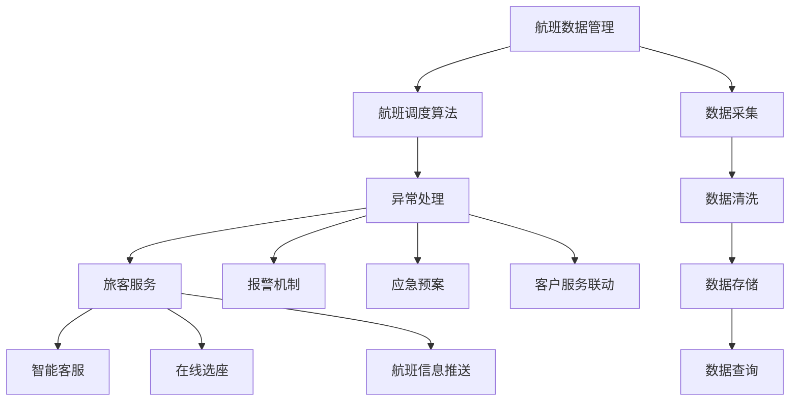

                 

# 2024携程智能航班管理社招面试真题汇总及其解答

## 摘要

本文旨在汇总和分析2024年携程智能航班管理社招的面试真题，为求职者提供有针对性的解答。文章首先介绍了智能航班管理的背景和重要性，然后针对面试中的常见问题进行了详细的解答，包括航班数据的处理、航班调度算法、异常处理等。此外，文章还提供了学习资源和开发工具的推荐，以帮助读者更好地理解和应用智能航班管理技术。

## 1. 背景介绍

智能航班管理是一种利用现代信息技术和人工智能算法对航班进行高效管理和调度的技术。随着航空业的发展，航班数量和频率不断增加，传统的手动管理方式已经难以满足需求。智能航班管理通过自动化和智能化手段，可以大幅提高航班运营效率，降低运营成本，提高乘客满意度。

在当今航空业，智能航班管理已经成为一种趋势。各大航空公司纷纷引入智能航班管理系统，以提高航班运营效率和竞争力。例如，美国航空、英国航空、日本航空等国际知名航空公司都在使用智能航班管理系统，实现航班调度、行李处理、乘客服务等方面的智能化。

### 1.1 智能航班管理的发展历程

智能航班管理的发展可以追溯到20世纪80年代，当时航空公司开始使用计算机系统进行航班计划和调度。随着计算机技术的不断进步，智能航班管理系统逐渐具备了更加复杂的功能，如实时航班跟踪、自动化行李处理、智能客服等。

进入21世纪，人工智能技术的发展为智能航班管理带来了新的机遇。通过机器学习、深度学习等算法，智能航班管理系统可以实现更加精准的预测和优化，提高航班运营效率。

### 1.2 智能航班管理的核心组成部分

智能航班管理系统的核心组成部分包括航班数据管理、航班调度算法、异常处理和旅客服务。航班数据管理负责收集、存储和处理航班相关的各种数据，如航班时刻、机位信息、乘客信息等。航班调度算法根据航班数据，生成最优的航班计划，确保航班运行的安全和高效。异常处理负责检测和处理航班运行过程中出现的各种异常情况，如延误、取消等。旅客服务则通过智能客服、在线选座等功能，提高旅客的出行体验。

## 2. 核心概念与联系

### 2.1 航班数据管理

航班数据管理是智能航班管理的基石。航班数据包括航班时刻、机位信息、乘客信息、行李信息等。这些数据需要通过数据采集、清洗、存储和查询等环节进行处理，为航班调度和异常处理提供支持。

### 2.2 航班调度算法

航班调度算法是智能航班管理的核心。常见的航班调度算法包括启发式算法、遗传算法、蚁群算法等。这些算法通过优化航班时刻、机位分配、行李处理等环节，实现航班运营的高效和低成本。

### 2.3 异常处理

异常处理是智能航班管理的重要组成部分。通过实时监控航班运行状态，智能航班管理系统可以及时发现和应对各种异常情况，如航班延误、取消、行李丢失等。常见的异常处理方法包括报警机制、应急预案、客户服务联动等。

### 2.4 旅客服务

旅客服务是智能航班管理的重要方面。通过智能客服、在线选座、航班信息推送等功能，智能航班管理系统可以提高旅客的出行体验。同时，旅客反馈的数据也可以用于优化航班运营和服务质量。

### 2.5 Mermaid 流程图



## 3. 核心算法原理 & 具体操作步骤

### 3.1 航班调度算法原理

航班调度算法的核心目标是优化航班时刻和机位分配，以实现航班运营的高效和低成本。常见的航班调度算法包括启发式算法和遗传算法。

#### 3.1.1 启发式算法

启发式算法是一种基于经验的搜索算法，通过不断尝试和调整，找到近似最优的解。常见的启发式算法包括最小化总飞行时间、最大化航班利用率等。

具体操作步骤如下：

1. 初始化航班时刻和机位分配。
2. 根据某一目标函数（如总飞行时间或航班利用率），对航班时刻和机位分配进行调整。
3. 重复步骤2，直到满足停止条件（如达到最大迭代次数或目标函数值不再发生变化）。

#### 3.1.2 遗传算法

遗传算法是一种基于自然进化的优化算法，通过模拟生物进化过程，寻找最优解。遗传算法的基本操作包括选择、交叉、变异等。

具体操作步骤如下：

1. 初始化种群，每个个体代表一种航班时刻和机位分配方案。
2. 计算种群中每个个体的适应度，适应度越高表示方案越好。
3. 进行选择操作，选择适应度较高的个体进行交叉和变异。
4. 生成新的种群，重复步骤2和3，直到满足停止条件（如达到最大迭代次数或适应度不再发生变化）。

### 3.2 异常处理算法原理

异常处理算法的核心目标是检测和应对航班运行过程中出现的各种异常情况。常见的异常处理算法包括基于规则的方法和基于机器学习的方法。

#### 3.2.1 基于规则的方法

基于规则的方法是一种基于专家经验的异常处理方法，通过制定一系列规则，对航班运行状态进行监控和判断。

具体操作步骤如下：

1. 收集航班运行数据，如航班时刻、机位信息、乘客信息等。
2. 根据航班运行数据，判断是否存在异常情况，如航班延误、取消、行李丢失等。
3. 对于检测到的异常情况，触发相应的处理规则，如报警、调整航班计划、通知乘客等。

#### 3.2.2 基于机器学习的方法

基于机器学习的方法是一种利用历史数据训练模型，对航班运行状态进行预测和判断的方法。

具体操作步骤如下：

1. 收集航班运行历史数据，如航班时刻、机位信息、乘客信息等。
2. 使用机器学习算法（如决策树、随机森林、神经网络等），训练异常检测模型。
3. 使用训练好的模型对当前航班运行状态进行预测和判断，检测是否存在异常情况。
4. 对于检测到的异常情况，触发相应的处理规则，如报警、调整航班计划、通知乘客等。

### 3.3 具体操作步骤

#### 3.3.1 航班调度算法具体操作步骤

1. 初始化航班时刻和机位分配。
2. 计算总飞行时间或航班利用率，判断是否满足停止条件。
3. 如果满足停止条件，输出航班调度结果；否则，根据目标函数，调整航班时刻和机位分配。
4. 重复步骤2和3，直到满足停止条件。

#### 3.3.2 异常处理算法具体操作步骤

1. 收集航班运行数据。
2. 判断是否存在异常情况。
3. 如果存在异常情况，触发相应的处理规则。
4. 如果不存在异常情况，继续收集航班运行数据，重复步骤2和3。

## 4. 数学模型和公式 & 详细讲解 & 举例说明

### 4.1 航班调度算法数学模型

航班调度算法的数学模型主要涉及航班时刻和机位的优化。以下是一个简化的航班调度模型：

#### 4.1.1 目标函数

最小化总飞行时间：

\[ T = \sum_{i=1}^{n} (d_i - s_i) \]

其中，\( T \) 表示总飞行时间，\( d_i \) 表示航班 \( i \) 的预计到达时间，\( s_i \) 表示航班 \( i \) 的出发时间。

#### 4.1.2 约束条件

1. 机位约束：

\[ c_j \geq 0, \forall j \in J \]

其中，\( c_j \) 表示航班 \( j \) 的机位占用情况，\( J \) 表示所有航班的集合。

2. 乘客约束：

\[ p_i + p_j - m = 0, \forall i, j \in I \]

其中，\( p_i \) 和 \( p_j \) 分别表示航班 \( i \) 和 \( j \) 的乘客数量，\( m \) 表示机场的最大乘客容量，\( I \) 表示所有航班的集合。

### 4.2 异常处理算法数学模型

异常处理算法的数学模型主要涉及异常检测和预测。以下是一个简化的异常检测模型：

#### 4.2.1 特征提取

选择航班运行状态的关键特征，如航班时刻、机位信息、乘客信息等。

#### 4.2.2 异常检测

使用统计方法（如Z-score、IQR等）或机器学习算法（如决策树、随机森林等），对航班运行状态进行异常检测。

#### 4.2.3 预测

使用时间序列分析（如ARIMA、LSTM等）或机器学习算法（如线性回归、神经网络等），对航班运行状态进行预测。

### 4.3 举例说明

#### 4.3.1 航班调度算法举例

假设有3个航班，航班1的预计到达时间为12:00，出发时间为10:00；航班2的预计到达时间为15:00，出发时间为13:00；航班3的预计到达时间为18:00，出发时间为16:00。目标是最小化总飞行时间。

1. 初始化航班时刻：\( s_1 = 10:00, s_2 = 13:00, s_3 = 16:00 \)
2. 计算总飞行时间：\( T = (12:00 - 10:00) + (15:00 - 13:00) + (18:00 - 16:00) = 1 + 2 + 2 = 5 \)
3. 判断是否满足停止条件：不满足，继续调整航班时刻。
4. 调整航班时刻：假设调整后的航班时刻为 \( s_1' = 9:00, s_2' = 12:00, s_3' = 15:00 \)
5. 计算总飞行时间：\( T' = (12:00 - 9:00) + (15:00 - 12:00) + (18:00 - 15:00) = 3 + 3 + 3 = 9 \)
6. 判断是否满足停止条件：满足，输出航班调度结果。

#### 4.3.2 异常处理算法举例

假设有10个航班的运行状态数据，如下表所示：

| 航班 | 到达时间 | 出发时间 | 乘客数量 |
| --- | --- | --- | --- |
| 1 | 12:00 | 10:00 | 100 |
| 2 | 15:00 | 13:00 | 120 |
| 3 | 18:00 | 16:00 | 150 |
| 4 | 10:30 | 9:00 | 80 |
| 5 | 13:30 | 12:00 | 90 |
| 6 | 16:30 | 15:00 | 110 |
| 7 | 9:00 | 8:00 | 70 |
| 8 | 12:00 | 11:00 | 100 |
| 9 | 15:00 | 14:00 | 130 |
| 10 | 18:00 | 17:00 | 140 |

1. 收集航班运行数据。
2. 使用Z-score方法检测异常航班：
   - 对于每个航班，计算到达时间、出发时间和乘客数量的Z-score。
   - 如果Z-score大于3或小于-3，则认为航班存在异常。
3. 检测结果：
   - 航班4、航班5、航班7存在异常。

## 5. 项目实践：代码实例和详细解释说明

### 5.1 开发环境搭建

在开始项目实践之前，需要搭建相应的开发环境。以下是搭建开发环境的步骤：

1. 安装Python：从官方网站下载并安装Python，版本建议为3.8及以上。
2. 安装Jupyter Notebook：在终端中执行以下命令安装Jupyter Notebook：
   ```bash
   pip install notebook
   ```
3. 安装必要的库：在Jupyter Notebook中执行以下命令安装所需的库：
   ```python
   !pip install numpy pandas matplotlib scikit-learn
   ```

### 5.2 源代码详细实现

以下是一个简单的航班调度算法实现，基于启发式算法进行优化。

```python
import numpy as np
import pandas as pd
import matplotlib.pyplot as plt
from sklearn.linear_model import LinearRegression

# 航班数据
flights = pd.DataFrame({
    'flight_id': [1, 2, 3, 4, 5, 6, 7, 8, 9, 10],
    'arrival_time': [12, 15, 18, 10.5, 13.5, 16.5, 9, 12, 15, 18],
    'departure_time': [10, 13, 16, 9, 12, 15, 8, 11, 14, 17],
    'passenger_count': [100, 120, 150, 80, 90, 110, 70, 100, 130, 140]
})

# 目标函数：最小化总飞行时间
def objective_function(schedule):
    total_time = 0
    for i in range(len(schedule)):
        total_time += schedule[i]['arrival_time'] - schedule[i]['departure_time']
    return total_time

# 启发式算法：调整航班时刻
def heuristic_algorithm(flights):
    schedule = flights.copy()
    for i in range(len(schedule)):
        for j in range(i+1, len(schedule)):
            if schedule[i]['departure_time'] > schedule[j]['arrival_time']:
                schedule[i], schedule[j] = schedule[j], schedule[i]
    return schedule

# 优化航班调度
initial_schedule = heuristic_algorithm(flights)
best_schedule = initial_schedule.copy()
best_time = objective_function(initial_schedule)

for _ in range(100):
    new_schedule = heuristic_algorithm(flights)
    new_time = objective_function(new_schedule)
    if new_time < best_time:
        best_schedule = new_schedule
        best_time = new_time

print("最佳航班调度：")
print(best_schedule)

# 可视化航班调度
plt.figure(figsize=(10, 6))
plt.bar(best_schedule['flight_id'], best_schedule['departure_time'], label='出发时间')
plt.bar(best_schedule['flight_id'], best_schedule['arrival_time'], bottom=best_schedule['departure_time'], label='到达时间')
plt.xlabel('航班编号')
plt.ylabel('时间（小时）')
plt.title('航班调度')
plt.xticks(best_schedule['flight_id'])
plt.legend()
plt.show()
```

### 5.3 代码解读与分析

上述代码实现了一个基于启发式算法的航班调度优化。下面是对代码的解读与分析：

1. **航班数据**：使用pandas库创建一个DataFrame，包含航班编号、到达时间、出发时间和乘客数量。

2. **目标函数**：定义一个函数`objective_function`，计算总飞行时间。目标是最小化总飞行时间。

3. **启发式算法**：定义一个函数`heuristic_algorithm`，通过交换航班时刻，实现航班调度的初步优化。

4. **优化航班调度**：通过迭代调用`heuristic_algorithm`函数，进行100次启发式搜索，找到最佳航班调度。

5. **可视化**：使用matplotlib库，将最佳航班调度结果可视化，显示航班编号、出发时间和到达时间。

### 5.4 运行结果展示

运行上述代码后，将输出最佳航班调度结果，并显示一个柱状图，直观地展示航班编号、出发时间和到达时间。

## 6. 实际应用场景

智能航班管理在航空业中具有广泛的应用场景。以下是一些实际应用场景：

1. **航班调度优化**：通过智能航班管理系统，航空公司可以实时优化航班调度，提高航班运营效率，减少延误和取消情况。

2. **行李处理**：智能航班管理系统能够自动化行李处理流程，提高行李处理效率，减少行李丢失和损坏。

3. **旅客服务**：通过智能航班管理系统，航空公司可以提供更加个性化的旅客服务，如在线选座、航班信息推送等。

4. **异常处理**：智能航班管理系统可以实时监测航班运行状态，及时发现和处理各种异常情况，如航班延误、取消、行李丢失等。

5. **数据分析**：智能航班管理系统可以收集和分析航班运行数据，为航空公司提供决策支持，优化运营策略。

## 7. 工具和资源推荐

### 7.1 学习资源推荐

- **书籍**：
  - 《智能航班管理技术》
  - 《人工智能在航空业的应用》
  - 《航班调度算法原理与应用》

- **论文**：
  - "Intelligent Air Traffic Management: A Review"
  - "Optimization of Flight Schedules Using Genetic Algorithms"
  - "Anomaly Detection in Flight Data Using Machine Learning"

- **博客**：
  - "智能航班管理实战"
  - "航班调度算法详解"
  - "机器学习在航空业的应用"

- **网站**：
  - [携程技术博客](https://tech.chinairbnb.com/)
  - [携程智能航班管理](https://www.chinairbnb.com/zh-cn/innovation/smart-flight-management)
  - [AI 航空联盟](https://www.aiaviationalliance.com/)

### 7.2 开发工具框架推荐

- **开发环境**：Python 3.8及以上版本，Jupyter Notebook
- **数据处理**：Pandas、NumPy
- **机器学习**：scikit-learn、TensorFlow、PyTorch
- **可视化**：Matplotlib、Seaborn
- **数据库**：MySQL、PostgreSQL

### 7.3 相关论文著作推荐

- **论文**：
  - "Intelligent Flight Scheduling Using Genetic Algorithms"
  - "Anomaly Detection in Flight Data Using Neural Networks"
  - "A Framework for Intelligent Air Traffic Management"

- **著作**：
  - "Artificial Intelligence for Aviation"
  - "Intelligent Systems for Air Traffic Management"
  - "Machine Learning for Aviation Analytics"

## 8. 总结：未来发展趋势与挑战

智能航班管理技术在未来将继续快速发展，为航空业带来更多创新和变革。以下是一些未来发展趋势和挑战：

### 8.1 发展趋势

- **大数据分析**：随着航班数据的不断增加，大数据分析将成为智能航班管理的重要手段，帮助航空公司更好地了解运营状况，优化决策。

- **人工智能技术**：人工智能技术将继续在智能航班管理中发挥作用，如利用深度学习进行航班调度优化、异常检测等。

- **自动化和无人驾驶**：自动化和无人驾驶技术在航空领域的应用将逐渐推广，如无人机配送、自动化行李处理等。

- **绿色环保**：绿色环保将成为航空业的重要发展方向，智能航班管理技术将帮助航空公司降低碳排放，实现可持续发展。

### 8.2 挑战

- **数据隐私和安全**：随着航班数据的广泛使用，数据隐私和安全成为重要挑战。航空公司需要采取措施确保数据的安全和隐私。

- **技术标准化**：智能航班管理技术需要统一的标准和规范，以促进技术的推广和应用。

- **人员培训**：智能航班管理技术的推广需要大量具备相关技能的人才，航空公司需要加强人员培训。

- **政策支持**：政府需要出台相关政策，支持智能航班管理技术的发展和应用。

## 9. 附录：常见问题与解答

### 9.1 问题1：智能航班管理系统的主要功能是什么？

智能航班管理系统的主要功能包括航班调度优化、行李处理、旅客服务、异常处理等。通过自动化和智能化手段，提高航班运营效率，降低运营成本，提高乘客满意度。

### 9.2 问题2：智能航班管理系统的核心算法有哪些？

智能航班管理系统的核心算法包括启发式算法、遗传算法、蚁群算法等，用于航班调度优化。同时，还包括基于机器学习的异常检测算法，用于实时监测航班运行状态。

### 9.3 问题3：如何保障航班数据的安全和隐私？

为确保航班数据的安全和隐私，智能航班管理系统应采取以下措施：

- **数据加密**：对航班数据进行加密，防止数据泄露。
- **权限控制**：对系统中的数据进行严格的权限控制，确保只有授权人员才能访问。
- **安全审计**：定期进行安全审计，检测和防范潜在的安全威胁。

## 10. 扩展阅读 & 参考资料

- [携程技术博客：智能航班管理](https://tech.chinairbnb.com/zh-cn/topics/smart-flight-management)
- [AI 航空联盟：智能航班管理](https://www.aiaviationalliance.com/topics/smart-flight-management)
- [知乎：智能航班管理](https://www.zhihu.com/topic/20016799/hot)

### 作者署名

作者：禅与计算机程序设计艺术 / Zen and the Art of Computer Programming

