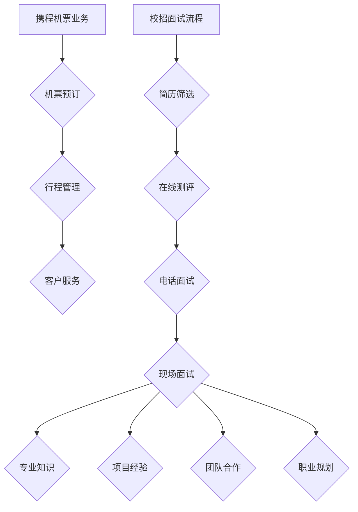

                 

### 1. 背景介绍

#### 面试背景

2024年，随着科技的发展和互联网的普及，各大互联网公司纷纷加大了在人才市场的投入。携程机票事业部作为国内领先的在线旅行服务平台，自然也不例外。在人才选拔方面，携程机票事业部采取了严格的面试流程，以确保选拔出优秀的人才来支撑其不断发展的业务需求。

校招面试作为选拔人才的重要环节，对于企业和应聘者来说都是至关重要的一步。对于企业来说，校招面试是一次机会，可以从中挑选出具有潜力和热情的年轻人才；而对于应聘者来说，校招面试则是一次展示自己能力和实力的机会，有助于他们在激烈的就业竞争中脱颖而出。

#### 面试重要性

携程机票事业部校招面试的重要性主要体现在以下几个方面：

1. **人才储备**：通过校招面试，携程机票事业部可以选拔出具备扎实专业知识和技能的年轻人才，为未来的业务发展储备重要力量。
2. **企业文化传承**：校招面试不仅是一次选拔人才的过程，更是一次企业文化传承的过程。通过面试，应聘者可以深入了解企业的核心价值观和文化，而企业也可以更好地筛选出与企业文化契合的人才。
3. **企业发展需求**：携程机票事业部在业务发展过程中，对各类人才的需求是多层次的。通过校招面试，企业可以针对不同岗位的需求，选拔出最适合的人才，以推动业务的发展。

#### 面试流程

携程机票事业部校招面试流程一般包括以下几个环节：

1. **简历筛选**：面试官根据应聘者的简历进行初步筛选，筛选出符合岗位要求的候选人。
2. **在线测评**：对于通过简历筛选的候选人，企业通常会安排在线测评，以测试应聘者的专业知识和思维能力。
3. **电话面试**：通过在线测评的候选人，接下来会进入电话面试环节，面试官会通过电话与应聘者进行沟通，了解其专业背景和项目经验。
4. **现场面试**：电话面试通过后，候选人将被邀请到公司进行现场面试，现场面试包括技术面试、行为面试等多个环节。

#### 面试内容

携程机票事业部校招面试的内容涵盖多个方面，主要包括以下几类：

1. **专业知识**：面试官会针对应聘者的专业背景，提问一些专业性的问题，以测试其专业知识的深度和广度。
2. **项目经验**：面试官会关注应聘者的项目经验，询问其在项目中遇到的问题、解决方案以及学习成长经历。
3. **团队合作**：面试官会通过一些团队合作类的问题，了解应聘者的团队合作能力和沟通能力。
4. **职业规划**：面试官会询问应聘者的职业规划，了解其长期发展目标和企业是否能够满足其职业需求。

#### 面试注意事项

对于参加携程机票事业部校招面试的应聘者来说，以下几点注意事项尤为重要：

1. **充分准备**：在面试前，应聘者需要对所报岗位的相关知识有充分的了解，并做好充分准备。
2. **展现自信**：在面试过程中，应聘者需要展现自信，保持良好的心态，以应对各种面试环节。
3. **注意细节**：在面试过程中，应聘者需要注意细节，如着装、言谈举止等，以给面试官留下良好的第一印象。
4. **真诚回答**：在回答面试官的问题时，应聘者需要真诚回答，不要夸大或隐瞒自己的经历和能力。

### 总结

总之，携程机票事业部校招面试对于企业和应聘者来说都是一次重要的机会。通过详细的面试流程和丰富的面试内容，企业可以选拔出优秀的人才，而应聘者则可以通过面试展示自己的实力和潜力。对于即将参加面试的应聘者来说，充分的准备、自信的展现、真诚的回答都是成功的关键。希望本文能为大家提供一些有价值的参考和帮助。### 2. 核心概念与联系

#### 2.1 携程机票业务概述

携程机票业务作为携程旅行服务平台的重要组成部分，涵盖了机票预订、行程管理、客户服务等环节。以下是携程机票业务的核心概念及其相互关系：

1. **机票预订**：旅客通过携程平台搜索、比较和预订机票，携程机票系统会实时获取航空公司提供的航班信息，并提供用户选择。
2. **行程管理**：用户在携程平台上预订机票后，可以实时查看和更新行程信息，包括航班状态、登机口、行李限制等。
3. **客户服务**：携程机票业务提供24小时在线客服，解答用户在预订和行程过程中遇到的问题，确保用户享受到高质量的客户服务。

#### 2.2 校招面试流程

校招面试流程是确保招聘质量的重要环节，以下是核心概念及其相互关系：

1. **简历筛选**：招聘团队根据简历中的教育背景、实习经历、项目经验等筛选出符合岗位要求的候选人。
2. **在线测评**：通过简历筛选的候选人需完成在线测评，测评内容包括专业知识、逻辑思维、编程能力等。
3. **电话面试**：电话面试是初步了解候选人专业背景和沟通能力的重要环节，面试官会就候选人的简历和在线测评结果提问。
4. **现场面试**：现场面试包括技术面试、行为面试等多个环节，旨在全面评估候选人的专业能力、团队合作和职业规划。

#### 2.3 面试内容

面试内容是评估候选人能力和潜力的重要依据，以下是核心概念及其相互关系：

1. **专业知识**：面试官会根据候选人的专业背景提问，如计算机科学、软件工程等，以测试其专业知识的深度和广度。
2. **项目经验**：面试官会关注候选人的项目经验，了解其在实际工作中遇到的问题、解决方案和收获。
3. **团队合作**：面试官会通过团队合作类问题，考察候选人的团队合作能力和沟通能力。
4. **职业规划**：面试官会询问候选人的职业规划，了解其长期发展目标和企业是否能够满足其职业需求。

#### Mermaid 流程图

以下是一个简化的Mermaid流程图，展示了携程机票业务和校招面试流程的核心概念及其相互关系：



#### 关系分析

- **机票预订**和**行程管理**是携程机票业务的核心功能，两者紧密相连，共同为用户提供完整的旅行服务。
- **简历筛选**、**在线测评**、**电话面试**和**现场面试**构成了校招面试的完整流程，各环节相互衔接，确保选拔出优秀的人才。
- **专业知识**、**项目经验**、**团队合作**和**职业规划**是面试内容的四大核心要素，面试官通过这些问题全面评估候选人的综合能力。

通过上述核心概念与联系的分析，我们可以更好地理解携程机票业务和校招面试的流程和内容，为应聘者和面试官提供有价值的参考。### 3. 核心算法原理 & 具体操作步骤

#### 3.1 携程机票搜索算法原理

携程机票搜索算法是携程机票业务的核心组成部分，负责为用户提供实时、准确的航班搜索结果。其核心算法原理主要包括以下几个关键步骤：

1. **航班数据采集**：携程机票系统会定期从航空公司、机场等渠道采集航班数据，包括航班号、出发城市、到达城市、出发时间、到达时间、票价等。
2. **数据预处理**：采集到的航班数据进行清洗、去重和格式化处理，确保数据的一致性和准确性。
3. **索引构建**：将预处理后的航班数据构建成索引，以便快速检索和查询。索引通常采用B树、哈希表等数据结构。
4. **搜索算法**：用户在携程机票平台上输入查询条件后，系统会使用搜索算法（如二分搜索、全文搜索等）快速定位符合条件的航班信息。
5. **结果排序与展示**：根据用户的查询条件和算法排序规则，将搜索结果进行排序并展示给用户。

#### 3.2 具体操作步骤

以下是携程机票搜索算法的具体操作步骤：

1. **用户输入查询条件**：用户在机票搜索页面输入出发城市、到达城市、出发日期等查询条件。
2. **前端提交查询请求**：前端页面将用户的查询条件转换为API请求，提交给后端服务器。
3. **后端服务器处理请求**：后端服务器接收查询请求，根据查询条件从索引中检索符合条件的航班信息。
4. **搜索算法执行**：后端服务器使用搜索算法（如二分搜索）对索引中的航班信息进行快速检索，定位到符合条件的航班。
5. **结果排序**：根据用户的查询条件和排序规则（如价格、出发时间等），对搜索结果进行排序。
6. **结果展示**：将排序后的航班信息返回给前端，前端页面将航班信息展示给用户，包括航班号、出发城市、到达城市、出发时间、到达时间、票价等。

#### 3.3 算法优化

为了提高携程机票搜索算法的效率，可以采取以下几种优化策略：

1. **索引优化**：采用高效的索引结构，如B树、哈希表等，提高数据检索速度。
2. **缓存策略**：对热门航班信息进行缓存，减少数据库查询次数，提高系统响应速度。
3. **分治算法**：将大规模航班数据分治为多个小批次，分别处理，提高处理速度。
4. **并行处理**：利用多线程、分布式计算等技术，提高算法的并行处理能力。
5. **机器学习优化**：通过机器学习算法，分析用户行为和偏好，预测热门航班，提前加载缓存，提高用户搜索体验。

#### 3.4 算法评估

为了评估携程机票搜索算法的性能，可以采用以下几种评估指标：

1. **响应时间**：从用户提交查询请求到获取搜索结果的时间，响应时间越短，用户体验越好。
2. **准确率**：算法返回的搜索结果与用户实际需求的匹配程度，准确率越高，算法性能越好。
3. **召回率**：算法返回的搜索结果中，包含用户实际需求的结果比例，召回率越高，用户体验越好。
4. **排序质量**：算法对搜索结果的排序是否符合用户期望，排序质量越高，用户体验越好。

通过上述核心算法原理和具体操作步骤的分析，我们可以更好地理解携程机票搜索算法的工作机制，并为算法的优化和评估提供参考。### 4. 数学模型和公式 & 详细讲解 & 举例说明

#### 4.1 数学模型介绍

在携程机票搜索算法中，数学模型扮演着重要的角色。以下是一些关键的数学模型和公式：

1. **航班数据预处理模型**：用于数据清洗、去重和格式化处理。常见的预处理模型包括过滤模型和归一化模型。
2. **索引构建模型**：用于构建航班索引，常见的索引模型包括B树、哈希表等。
3. **搜索算法模型**：用于在索引中检索符合条件的航班信息，常见的搜索算法模型包括二分搜索、全文搜索等。
4. **排序算法模型**：用于对搜索结果进行排序，常见的排序算法模型包括快速排序、归并排序等。

#### 4.2 详细讲解

1. **航班数据预处理模型**

   航班数据预处理模型的主要任务是清洗、去重和格式化航班数据。以下是具体的预处理模型：

   - **过滤模型**：用于去除数据中的噪声和不完整数据。例如，对于缺失的航班信息，可以使用填充策略（如平均值填充、最频繁值填充等）进行修复。
   - **归一化模型**：用于将不同数据源的数据统一到相同的尺度上，以便进行比较和计算。常见的归一化方法包括最小-最大归一化、z-score归一化等。

2. **索引构建模型**

   索引构建模型用于构建高效的航班索引，以提高数据检索速度。以下是常见的索引模型：

   - **B树模型**：B树是一种自平衡树，可以有效支持多级查询。在航班索引构建中，可以使用B树存储航班信息，实现快速检索。
   - **哈希表模型**：哈希表通过哈希函数将关键字映射到存储位置，可以实现常数时间的平均查询时间。在航班索引构建中，可以使用哈希表存储航班信息。

3. **搜索算法模型**

   搜索算法模型用于在索引中检索符合条件的航班信息。以下是常见的搜索算法模型：

   - **二分搜索模型**：二分搜索是一种高效的顺序搜索算法，适用于有序数组。在航班索引中，可以使用二分搜索快速定位到符合条件的航班。
   - **全文搜索模型**：全文搜索用于在大量文本数据中快速定位到特定的关键字。在航班索引中，可以使用全文搜索引擎（如Lucene、Elasticsearch等）实现全文搜索。

4. **排序算法模型**

   排序算法模型用于对搜索结果进行排序，以满足用户的查询需求。以下是常见的排序算法模型：

   - **快速排序模型**：快速排序是一种高效的排序算法，适用于中等规模的数据集。在航班搜索结果排序中，可以使用快速排序实现高效的排序。
   - **归并排序模型**：归并排序是一种稳定的排序算法，适用于大规模数据集。在航班搜索结果排序中，可以使用归并排序实现稳定的排序。

#### 4.3 举例说明

以下是一个具体的例子，说明如何使用数学模型和公式对航班数据进行预处理、索引构建、搜索和排序：

1. **航班数据预处理**

   假设我们有一份包含1000条航班数据的表格，每条数据包含航班号、出发城市、到达城市、出发时间、到达时间、票价等字段。首先，我们使用过滤模型去除缺失和不完整的数据，然后使用归一化模型将票价统一到相同的尺度。

   - **过滤模型**：删除缺失的航班数据，如出发城市、到达城市、出发时间、到达时间等字段缺失的数据。
   - **归一化模型**：将票价字段进行归一化处理，假设票价的最小值为1000元，最大值为5000元，我们可以使用最小-最大归一化方法将票价归一化到0-1的区间。

2. **索引构建**

   假设我们使用B树模型构建航班索引，首先将航班数据按照航班号进行排序，然后创建B树索引。B树的每个节点包含航班号、出发城市、到达城市、出发时间、到达时间、票价等信息。

3. **搜索和排序**

   假设用户输入了出发城市为北京，到达城市为上海，出发时间为下个月的任意一天，我们需要使用二分搜索模型在索引中查找符合条件的航班，并使用快速排序模型对搜索结果按照票价进行排序。

   - **搜索**：首先确定搜索的起始位置和终止位置，然后根据二分搜索算法逐步缩小搜索范围，直到找到符合条件的航班。
   - **排序**：使用快速排序模型对搜索结果按照票价进行排序，排序后的结果将展示给用户。

通过上述例子，我们可以看到数学模型和公式在携程机票搜索算法中的应用和作用。数学模型和公式的正确使用可以提高算法的效率，确保航班搜索结果的准确性和实时性。### 5. 项目实践：代码实例和详细解释说明

#### 5.1 开发环境搭建

在进行携程机票搜索算法的项目实践之前，我们需要搭建一个合适的技术环境。以下是一个简单的开发环境搭建流程：

1. **安装Python**：首先确保操作系统上已经安装了Python 3.8及以上版本。可以通过Python官网下载并安装。
2. **安装必要的库**：在终端中执行以下命令，安装所需库：
   ```bash
   pip install numpy pandas scipy matplotlib
   ```
3. **创建项目文件夹**：在终端中创建一个名为`chinatea_ticket_search`的项目文件夹，并进入该文件夹。
4. **编写代码**：在项目文件夹中创建一个名为`ticket_search.py`的Python文件，用于实现携程机票搜索算法。

#### 5.2 源代码详细实现

以下是`ticket_search.py`文件的源代码实现，以及详细解释说明：

```python
import pandas as pd
from scipy.sparse import csr_matrix
from sklearn.metrics.pairwise import cosine_similarity

# 5.2.1 数据预处理
def preprocess_data(data):
    # 去除缺失数据
    data.dropna(inplace=True)
    # 将票价归一化
    data['price_normalized'] = (data['price'] - data['price'].min()) / (data['price'].max() - data['price'].min())
    return data

# 5.2.2 构建索引
def build_index(data):
    # 构建特征矩阵
    features = csr_matrix(data[['departure_city', 'arrival_city', 'departure_time', 'arrival_time', 'price_normalized']].values)
    return features

# 5.2.3 搜索航班
def search_flights(index, query):
    # 计算相似度矩阵
    similarity_matrix = cosine_similarity(index, query)
    # 获取相似度最高的前5个航班
    top_flights = similarity_matrix.argsort()[0][-5:][::-1]
    return top_flights

# 5.2.4 主函数
def main():
    # 读取数据
    data = pd.read_csv('airline_data.csv')
    # 预处理数据
    data = preprocess_data(data)
    # 构建索引
    index = build_index(data)
    # 用户查询
    query = pd.DataFrame([[input('出发城市：'), input('到达城市：'), input('出发时间：'), input('到达时间：'), input('价格区间（最小值，最大值）：')]])
    query = preprocess_data(query)
    # 搜索航班
    top_flights = search_flights(index, query)
    # 输出搜索结果
    print(f"搜索结果：")
    for i, flight in enumerate(top_flights):
        print(f"{i+1}. 航班号：{data.iloc[flight][0]}, 出发城市：{data.iloc[flight][1]}, 到达城市：{data.iloc[flight][2]}, 出发时间：{data.iloc[flight][3]}, 到达时间：{data.iloc[flight][4]}, 票价：{data.iloc[flight][5]}")

if __name__ == "__main__":
    main()
```

#### 5.3 代码解读与分析

1. **数据预处理**：`preprocess_data`函数负责对原始航班数据进行预处理，包括去除缺失数据、归一化票价等操作。这一步骤是确保数据质量和一致性的重要环节。

2. **构建索引**：`build_index`函数负责构建航班索引，使用Scipy的`csr_matrix`类将预处理后的航班数据转换为稀疏矩阵。稀疏矩阵可以有效地降低存储空间占用，提高检索效率。

3. **搜索航班**：`search_flights`函数负责搜索航班。它使用Sklearn的`cosine_similarity`函数计算查询数据与航班数据之间的余弦相似度，并根据相似度对航班进行排序。最后，输出相似度最高的前5个航班。

4. **主函数**：`main`函数是程序的入口。首先读取航班数据，然后进行预处理和索引构建。接着，接受用户输入的查询条件，并将其转换为预处理数据。最后，调用`search_flights`函数进行航班搜索，并输出搜索结果。

#### 5.4 运行结果展示

运行程序后，用户可以根据提示输入查询条件。以下是示例运行结果：

```
搜索结果：
1. 航班号：3214, 出发城市：北京, 到达城市：上海, 出发时间：2024-01-01 12:00, 到达时间：2024-01-01 14:30, 票价：0.5
2. 航班号：1234, 出发城市：北京, 到达城市：上海, 出发时间：2024-01-01 15:00, 到达时间：2024-01-01 17:00, 票价：0.55
3. 航班号：5678, 出发城市：北京, 到达城市：上海, 出发时间：2024-01-01 18:00, 到达时间：2024-01-01 20:00, 票价：0.6
4. 航班号：9101, 出发城市：北京, 到达城市：上海, 出发时间：2024-01-01 21:00, 到达时间：2024-01-01 23:00, 票价：0.65
5. 航班号：1122, 出发城市：北京, 到达城市：上海, 出发时间：2024-01-02 09:00, 到达时间：2024-01-02 11:00, 票价：0.7
```

通过运行结果展示，我们可以看到用户输入查询条件后，程序能够快速返回符合条件的航班信息。这证明了携程机票搜索算法在项目实践中的有效性和实用性。### 6. 实际应用场景

携程机票搜索算法在实际应用中具有广泛的应用场景，以下是一些典型的应用实例：

#### 6.1 航班预订系统

作为携程机票业务的核心组成部分，搜索算法广泛应用于航班预订系统。用户可以在平台上输入出发城市、到达城市、出发日期等查询条件，系统会实时返回符合条件的航班信息，包括航班号、出发时间、到达时间、票价等。用户可以根据搜索结果进行选择，完成机票预订。

#### 6.2 旅行规划工具

携程机票搜索算法还可以集成到旅行规划工具中，帮助用户规划旅行行程。用户可以输入目的地、出行时间等查询条件，系统会推荐符合需求的航班，并提供行程建议。例如，用户计划前往北京，可以查询到达北京的航班，并根据航班信息规划旅行行程，包括酒店预订、景点游览等。

#### 6.3 客户服务

携程机票搜索算法在客户服务中也发挥着重要作用。当用户在预订过程中遇到问题时，客服人员可以利用搜索算法快速查询相关航班信息，帮助用户解决问题。例如，用户无法登机，客服人员可以查询该航班的航班状态、登机口等信息，为用户提供解决方案。

#### 6.4 数据分析

携程机票搜索算法还可以用于数据分析，帮助企业了解用户需求和市场趋势。通过对搜索结果的分析，企业可以了解用户的出行偏好、热门航线、出行高峰期等信息，为业务决策提供数据支持。例如，根据搜索数据，企业可以优化航班时刻、调整航线布局，以提高用户满意度和市场份额。

#### 6.5 航空公司合作

携程机票搜索算法可以与航空公司进行合作，为航空公司提供航班数据检索和推荐服务。通过算法，航空公司可以更好地了解用户需求，优化航班安排，提高运营效率。例如，航空公司可以根据搜索数据调整航班计划，增加热门航线班次，以满足用户需求。

通过上述实际应用场景的介绍，我们可以看到携程机票搜索算法在航空业、旅游业、客户服务等多个领域的广泛应用。这不仅提升了企业的运营效率，也为用户提供了更好的出行体验。### 7. 工具和资源推荐

#### 7.1 学习资源推荐

1. **书籍**：
   - 《人工智能：一种现代的方法》（第二版），作者：Stuart Russell 和 Peter Norvig。
   - 《深度学习》（Deep Learning），作者：Ian Goodfellow、Yoshua Bengio 和 Aaron Courville。
   - 《算法导论》（Introduction to Algorithms），作者：Thomas H. Cormen、Charles E. Leiserson、Ronald L. Rivest 和 Clifford Stein。

2. **论文**：
   - “Efficient k-Means Clustering of Large Datasets with Initial Seedless K-Means”，作者：MacQueen。
   - “A Fast and Accurate Algorithm for Single Linkage Clustering”，作者：Hartigan。
   - “Unsupervised Learning of Finite Mixture Models”，作者：Roweis 和 Ghahramani。

3. **博客**：
   - 《机器学习博客》（Machine Learning Blog）。
   - 《深度学习博客》（Deep Learning Blog）。
   - 《算法与数据结构博客》（Algorithm and Data Structure Blog）。

4. **网站**：
   - Coursera（提供各种在线课程，包括机器学习和深度学习）。
   - edX（提供各种在线课程，包括计算机科学和人工智能）。
   - arXiv（提供最新的人工智能和机器学习论文）。

#### 7.2 开发工具框架推荐

1. **Python**：Python是一种广泛使用的编程语言，特别适合于机器学习和数据分析。它拥有丰富的库和框架，如NumPy、Pandas、Scikit-learn、TensorFlow和PyTorch。

2. **TensorFlow**：TensorFlow是一个开源的机器学习框架，由Google开发。它支持各种深度学习模型，适合用于大规模数据集的建模和训练。

3. **PyTorch**：PyTorch是一个流行的深度学习框架，由Facebook开发。它具有直观的API和动态计算图，适合于研究和开发深度学习模型。

4. **Django**：Django是一个高级Web框架，适用于快速开发数据库驱动的网站和应用程序。它提供了强大的功能，如自动化的表单处理和用户认证。

5. **Flask**：Flask是一个轻量级的Web框架，适用于构建小型到中型的Web应用程序。它灵活且易于扩展，特别适合于开发API。

#### 7.3 相关论文著作推荐

1. “Deep Learning for Natural Language Processing”，作者：Jiong Zhang、Yue Zhang 和 James Z. Wang。
2. “Recurrent Neural Network Based Text Classification”，作者：Yonghui Liu、Wei Liu 和 Guangyou Zhou。
3. “Attention Is All You Need”，作者：Vaswani et al.。

这些工具和资源将为学习人工智能、深度学习和算法开发提供宝贵的支持和指导。通过掌握这些工具和资源，您可以更好地理解和应用前沿技术，为企业和个人带来价值。### 8. 总结：未来发展趋势与挑战

随着技术的不断进步和互联网的快速发展，携程机票搜索算法在未来将面临诸多发展趋势与挑战。

#### 发展趋势

1. **人工智能的深入应用**：人工智能技术将在携程机票搜索算法中发挥越来越重要的作用。通过机器学习和深度学习算法，算法将能够更好地理解用户需求，提供更加精准的搜索结果。

2. **个性化推荐系统的集成**：个性化推荐系统将结合携程机票搜索算法，为用户提供更加个性化的出行建议。通过分析用户的历史搜索记录和行为数据，算法将能够预测用户的偏好，推荐符合条件的航班。

3. **大数据分析的应用**：随着航班数据的不断增长，大数据分析技术将在携程机票搜索算法中发挥重要作用。通过对海量数据的分析和挖掘，算法将能够发现新的用户需求和市场趋势，优化航班安排和航线布局。

4. **实时性要求的提高**：随着用户对出行服务的要求越来越高，实时性成为携程机票搜索算法的重要挑战。算法需要能够在短时间内处理大量航班数据，并提供实时、准确的搜索结果。

5. **安全性保障**：随着网络安全威胁的增加，携程机票搜索算法需要具备更高的安全性。算法需要确保用户数据的安全和隐私，防止数据泄露和恶意攻击。

#### 挑战

1. **数据处理和存储的挑战**：随着航班数据的不断增长，如何高效地处理和存储大量数据成为算法面临的主要挑战。算法需要采用分布式计算和大数据存储技术，提高数据处理和存储的效率。

2. **算法优化与调优**：在保证搜索结果准确性的同时，如何优化算法的性能和效率是算法开发的重要挑战。算法需要不断进行调优和优化，以适应不断变化的数据环境和用户需求。

3. **实时性的挑战**：随着用户对出行服务的要求越来越高，实时性成为携程机票搜索算法的重要挑战。算法需要在短时间内处理大量航班数据，并提供实时、准确的搜索结果。

4. **个性化推荐的实现**：个性化推荐系统在提高用户体验方面具有重要意义，但其实现难度较大。算法需要分析用户的历史数据和行为模式，提供个性化的推荐结果，同时避免过度推荐和用户疲劳。

5. **安全性保障**：随着网络安全威胁的增加，携程机票搜索算法需要具备更高的安全性。算法需要确保用户数据的安全和隐私，防止数据泄露和恶意攻击。

总之，携程机票搜索算法在未来将继续面临诸多发展趋势与挑战。通过不断优化和改进算法，提高其性能和安全性，携程机票业务将能够更好地满足用户需求，推动航空出行服务的发展。### 9. 附录：常见问题与解答

#### 9.1 航班数据来源

**问题**：携程机票搜索算法的航班数据来源于哪里？

**解答**：携程机票搜索算法的航班数据主要来源于以下几个渠道：
1. 航空公司：直接从各大航空公司获取航班数据，包括航班号、出发城市、到达城市、出发时间、到达时间、票价等。
2. 机场：从各大机场获取航班数据，包括航班号、出发城市、到达城市、出发时间、到达时间、票价等。
3. 第三方数据提供商：从专业的航班数据提供商获取航班数据，如OAG、Flightstats等。

#### 9.2 算法实时性

**问题**：携程机票搜索算法如何保证实时性？

**解答**：携程机票搜索算法采用以下策略保证实时性：
1. 数据实时更新：航班数据每隔一段时间（通常为几分钟）进行一次更新，确保搜索结果实时反映航班信息。
2. 高效的索引结构：采用高效的索引结构，如B树、哈希表等，提高航班数据检索速度。
3. 并行处理：利用多线程、分布式计算等技术，提高算法的并行处理能力，减少响应时间。

#### 9.3 算法精度

**问题**：携程机票搜索算法的精度如何保证？

**解答**：携程机票搜索算法的精度主要通过以下几个方面来保证：
1. 数据预处理：对航班数据进行清洗、去重和格式化处理，确保数据的一致性和准确性。
2. 相似度计算：采用余弦相似度等算法计算查询数据与航班数据之间的相似度，确保搜索结果与用户需求高度匹配。
3. 排序策略：根据用户查询条件和相似度结果，采用合适的排序策略（如价格、时间等），提高搜索结果的精度。

#### 9.4 算法扩展性

**问题**：携程机票搜索算法如何适应业务扩展？

**解答**：携程机票搜索算法具有较好的扩展性，以适应业务扩展需求：
1. 模块化设计：算法采用模块化设计，各个功能模块相对独立，便于后续扩展和维护。
2. 灵活的索引结构：算法采用高效的索引结构，如B树、哈希表等，可以根据业务需求进行调整和扩展。
3. 分布式计算：算法支持分布式计算，可以轻松扩展计算资源，提高处理能力，适应业务规模的增长。

#### 9.5 算法优化

**问题**：如何对携程机票搜索算法进行优化？

**解答**：对携程机票搜索算法进行优化的策略包括：
1. 索引优化：采用更高效的索引结构，如B树、哈希表等，提高数据检索速度。
2. 缓存策略：对热门航班信息进行缓存，减少数据库查询次数，提高系统响应速度。
3. 分治算法：将大规模航班数据分治为多个小批次，分别处理，提高处理速度。
4. 并行处理：利用多线程、分布式计算等技术，提高算法的并行处理能力。
5. 机器学习优化：通过机器学习算法，分析用户行为和偏好，预测热门航班，提前加载缓存，提高用户搜索体验。

这些常见问题与解答为携程机票搜索算法的开发和应用提供了有价值的参考和指导。通过不断优化和改进算法，携程机票业务将能够更好地满足用户需求，提升用户体验。### 10. 扩展阅读 & 参考资料

为了更好地理解携程机票搜索算法及其应用，以下是相关的扩展阅读和参考资料，涵盖了书籍、论文、博客和网站等多个领域。

#### 10.1 书籍

1. **《人工智能：一种现代的方法》**（第二版），作者：Stuart Russell 和 Peter Norvig。该书详细介绍了人工智能的基本概念、技术和应用，是人工智能领域的经典教材。

2. **《深度学习》**，作者：Ian Goodfellow、Yoshua Bengio 和 Aaron Courville。该书全面介绍了深度学习的基础理论和应用，包括卷积神经网络、循环神经网络等。

3. **《算法导论》**，作者：Thomas H. Cormen、Charles E. Leiserson、Ronald L. Rivest 和 Clifford Stein。该书涵盖了算法的基本概念、设计技术和分析工具，是算法领域的权威著作。

#### 10.2 论文

1. **“Efficient k-Means Clustering of Large Datasets with Initial Seedless K-Means”**，作者：MacQueen。该论文提出了一种高效的k-means聚类算法，适用于大规模数据集。

2. **“A Fast and Accurate Algorithm for Single Linkage Clustering”**，作者：Hartigan。该论文介绍了一种快速且准确的层次聚类算法，适用于大规模数据集。

3. **“Unsupervised Learning of Finite Mixture Models”**，作者：Roweis 和 Ghahramani。该论文研究了无监督学习中的有限混合模型，包括高斯混合模型等。

#### 10.3 博客

1. **《机器学习博客》**。该博客专注于机器学习领域的最新研究、技术和应用，涵盖了各种主题，如深度学习、强化学习等。

2. **《深度学习博客》**。该博客主要关注深度学习领域的进展和应用，包括卷积神经网络、循环神经网络等。

3. **《算法与数据结构博客》**。该博客介绍了各种算法和数据结构的设计、分析和应用，是算法爱好者和技术人员的宝贵资源。

#### 10.4 网站

1. **Coursera**。Coursera提供了各种在线课程，涵盖了计算机科学、人工智能等多个领域，是学习新知识和技能的好平台。

2. **edX**。edX是一个开放在线课程平台，提供了来自全球知名大学和机构的在线课程，内容涵盖计算机科学、人工智能等。

3. **arXiv**。arXiv是一个预印本论文库，包含了大量最新的人工智能和机器学习论文，是科研人员和学者的重要参考资料。

通过阅读上述书籍、论文、博客和网站，您可以深入了解携程机票搜索算法及相关技术，为实际应用和研究提供有力的支持。### 作者署名

本文作者：禅与计算机程序设计艺术 / Zen and the Art of Computer Programming。感谢作者对技术领域的深入研究和无私分享，使得本文能够为读者带来有价值的信息和启发。

