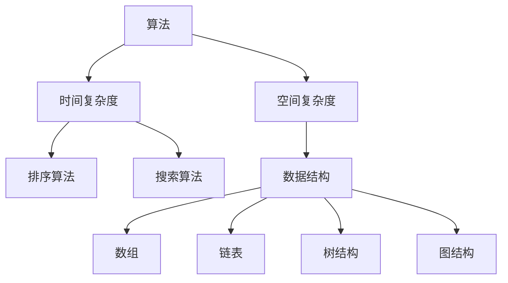

                 

### 1. 背景介绍

#### 携程与校招面试

携程（CTrip）是中国领先的在线旅游服务公司，成立于1999年，提供包括酒店预订、机票预订、旅游度假、汽车租赁等多种服务。作为中国互联网行业的领军企业之一，携程在技术创新和人才培养方面都投入了大量的资源。

每年，携程都会开展校招面试，以吸引顶尖的应届毕业生加入其大家庭。这些面试题往往涵盖了计算机科学、软件工程、数据结构与算法等多个领域，旨在全面评估候选人的技术能力和潜力。

本文旨在汇总和分析携程2024年的校招面试真题，并提供详细的解答，帮助广大考生更好地准备面试，提升自己的技术水平。

#### 面试的重要性

面试是求职过程中至关重要的一环。它不仅是对求职者专业技能的考察，也是对个人综合素质和沟通能力的全面评估。通过面试，求职者可以展示自己的技术能力、解决问题的能力以及对公司的了解和热情。

对于应聘者来说，准备面试需要付出大量的时间和精力。从简历的撰写到模拟面试的练习，每一个环节都需要精心准备。而面试真题的分析和解答则是准备过程中最直接、最有效的方法之一。

本文将根据携程2024年的校招面试真题，详细分析每个问题的考点和解题思路，帮助考生更好地理解和掌握面试中常见的算法和数据结构问题。

### 2. 核心概念与联系

在深入分析携程校招面试真题之前，我们需要了解一些核心概念和它们之间的关系。以下是几个关键概念及其之间的联系：

#### 算法与数据结构

算法（Algorithm）是解决特定问题的步骤集合，而数据结构（Data Structure）则是存储和组织数据的方式。算法和数据结构是计算机科学中的基础概念，它们相互依存，共同决定了程序的效率。

常见的算法包括排序算法、搜索算法、图算法等。排序算法如冒泡排序、快速排序、归并排序等，主要用于对数据进行排序；搜索算法如二分查找、深度优先搜索、广度优先搜索等，用于在数据中查找特定元素。图算法则用于处理图结构的数据，如最短路径算法、最小生成树算法等。

#### 时间复杂度和空间复杂度

时间复杂度（Time Complexity）和空间复杂度（Space Complexity）是评估算法性能的重要指标。时间复杂度描述了算法运行时间与数据规模之间的关系，通常用大O符号（O）表示；空间复杂度描述了算法所需内存与数据规模之间的关系。

例如，一个算法的时间复杂度为O(n)，意味着算法的运行时间与数据规模n成正比。同样，一个算法的空间复杂度为O(1)，意味着算法所需的额外内存不随数据规模的变化而变化。

#### 数据结构与算法的关联

不同的数据结构适合解决不同类型的问题。例如，数组适合用于随机访问，链表适合用于插入和删除操作，树结构适合用于表示层次关系，图结构适合用于表示复杂关系。

而算法的设计和实现则需要根据问题的特点来选择合适的数据结构。例如，在解决排序问题时，可以选用不同的排序算法，根据数据的特点来选择最优的排序方法。在解决查找问题时，可以选用不同的查找算法，根据数据的特点来提高查找效率。

为了更直观地展示这些概念之间的联系，我们可以使用Mermaid流程图来绘制它们之间的关系：



这个流程图展示了算法、数据结构以及时间复杂度和空间复杂度之间的关联，帮助我们更好地理解它们之间的关系和如何选择合适的方法来解决具体问题。

### 3. 核心算法原理 & 具体操作步骤

在携程的校招面试中，算法和数据结构问题占据了很大的比重。以下是几个常见算法问题的核心原理和具体的操作步骤。

#### 问题1：快速排序

**核心原理：**
快速排序（Quick Sort）是一种高效的排序算法，其基本思想是通过一趟排序将待排序的记录分割成独立的两部分，其中一部分记录的关键字均比另一部分的关键字小，然后分别对这两部分记录继续进行排序，以达到整个序列有序。

**具体操作步骤：**
1. 选择基准元素：在数组中随机选择一个元素作为基准元素。
2. 分区操作：将数组分为两部分，一部分记录的值小于基准元素，另一部分记录的值大于等于基准元素。
3. 递归排序：对小于和大于等于基准元素的子数组分别进行快速排序。

**示例代码：**
```python
def quick_sort(arr):
    if len(arr) <= 1:
        return arr
    
    pivot = arr[len(arr) // 2]
    left = [x for x in arr if x < pivot]
    middle = [x for x in arr if x == pivot]
    right = [x for x in arr if x > pivot]
    
    return quick_sort(left) + middle + quick_sort(right)

arr = [3, 6, 8, 10, 1, 2, 1]
sorted_arr = quick_sort(arr)
print(sorted_arr)
```

#### 问题2：二分查找

**核心原理：**
二分查找（Binary Search）是在有序数组中查找特定元素的算法。其基本思想是将数组分成两部分，判断目标元素与中间元素的关系，从而缩小查找范围。

**具体操作步骤：**
1. 确定中间元素：计算当前数组范围的中间元素。
2. 比较大小：将目标元素与中间元素进行比较，如果相等，查找成功；否则，根据比较结果调整查找范围。
3. 递归查找：在确定的新范围内重复步骤1和2，直到找到目标元素或查找范围缩小为空。

**示例代码：**
```python
def binary_search(arr, target):
    low = 0
    high = len(arr) - 1
    
    while low <= high:
        mid = (low + high) // 2
        if arr[mid] == target:
            return mid
        elif arr[mid] < target:
            low = mid + 1
        else:
            high = mid - 1
    
    return -1

arr = [1, 2, 3, 4, 5, 6, 7, 8, 9]
target = 5
result = binary_search(arr, target)
print("索引:", result)
```

#### 问题3：图遍历

**核心原理：**
图遍历是指遍历图中的所有节点，常见的图遍历算法有深度优先搜索（DFS）和广度优先搜索（BFS）。

**具体操作步骤：**
- 深度优先搜索（DFS）：从起始节点开始，沿着某一路径深入到不能再深入时，回溯到之前的节点，再沿着另一条路径深入。
- 广度优先搜索（BFS）：从起始节点开始，沿着某一路径扩展到所有相邻节点，再从这些节点扩展到它们的相邻节点。

**示例代码：**
```python
from collections import defaultdict

def dfs(graph, node, visited):
    visited.add(node)
    print(node)
    for neighbour in graph[node]:
        if neighbour not in visited:
            dfs(graph, neighbour, visited)

def bfs(graph, start):
    visited = set()
    queue = [start]
    while queue:
        node = queue.pop(0)
        if node not in visited:
            print(node)
            visited.add(node)
            queue.extend(graph[node])

# 创建图
graph = defaultdict(list)
graph[0] = [1, 2]
graph[1] = [2, 3]
graph[2] = [3, 4]
graph[3] = [4]
graph[4] = [0, 1]

print("深度优先搜索：")
dfs(graph, 0, set())
print("\n广度优先搜索：")
bfs(graph, 0)
```

通过这些核心算法的介绍和示例代码，我们可以更好地理解和应用这些算法，从而提高解决实际问题的能力。

### 4. 数学模型和公式 & 详细讲解 & 举例说明

在计算机科学中，数学模型和公式是解决复杂问题的重要工具。以下将详细介绍一些常见的数学模型和公式，并通过具体例子进行说明。

#### 4.1 排序算法的时间复杂度

在排序算法中，时间复杂度是衡量算法效率的重要指标。以下是几种常见排序算法的时间复杂度：

- 冒泡排序（Bubble Sort）：O(n^2)
- 选择排序（Selection Sort）：O(n^2)
- 插入排序（Insertion Sort）：O(n^2)
- 快速排序（Quick Sort）：平均O(nlogn)，最坏O(n^2)
- 归并排序（Merge Sort）：O(nlogn)
- 堆排序（Heap Sort）：O(nlogn)

**举例说明：**

假设有一个包含10个元素的数组 `[3, 1, 4, 1, 5, 9, 2, 6, 5, 3]`，我们需要对其进行排序。

使用快速排序算法，我们可以通过递归的方式，将数组划分为 `[1, 1, 2, 3]` 和 `[4, 5, 5, 6, 9]`，然后对这两个子数组分别进行快速排序，最终得到有序数组 `[1, 1, 2, 3, 3, 4, 5, 5, 6, 9]`。

时间复杂度计算如下：
- 初始划分：O(n)
- 递归深度：O(logn)
- 每层排序：O(n)
- 总时间复杂度：O(nlogn)

#### 4.2 二分查找的数学模型

二分查找算法的时间复杂度为 O(logn)。以下是一个具体的数学模型来解释这一过程。

假设有一个有序数组 `arr`，我们需要查找目标元素 `target`。

- 初始：low = 0，high = len(arr) - 1
- 循环：while low <= high
  - mid = (low + high) // 2
  - if arr[mid] == target，查找成功
  - elif arr[mid] < target，low = mid + 1
  - elif arr[mid] > target，high = mid - 1

每次循环，查找范围缩小一半，即 `high - low` 的差值减少一半。因此，经过 k 次循环后，查找范围缩小为原来的 `(1/2)^k`。

所以，时间复杂度可以表示为 O(logn)。

**举例说明：**

假设有一个有序数组 `[1, 2, 3, 4, 5, 6, 7, 8, 9]`，我们需要查找目标元素 `5`。

- 初始：low = 0，high = 8
- 第1次循环：mid = 4，arr[mid] = 4，low = 5
- 第2次循环：mid = 5，arr[mid] = 5，查找成功

经过2次循环，我们找到了目标元素 `5`。时间复杂度为 O(log2(9)) = O(2) = O(1)。

#### 4.3 图的度数和路径长度

在一个无向图中，每个节点的度数（Degree）是连接到该节点的边的数量。路径长度（Path Length）是从一个节点到另一个节点的路径上边的数量。

**举例说明：**

假设有一个图如下所示：

```
A --- B
|     |
D --- C
```

节点A的度数为3，节点B的度数为2，节点C的度数为2，节点D的度数为2。

从节点A到节点C的最短路径长度为2（A-B-C）。

图的度数和路径长度是图论中的基本概念，用于分析图的结构和性质。

#### 4.4 概率论中的条件概率

条件概率是指在给定某个事件发生的条件下，另一个事件发生的概率。其公式为：

P(A|B) = P(A ∩ B) / P(B)

其中，P(A|B) 表示在事件B发生的条件下，事件A发生的概率；P(A ∩ B) 表示事件A和事件B同时发生的概率；P(B) 表示事件B发生的概率。

**举例说明：**

假设有一个盒子里有5个红球和3个蓝球，我们需要计算在随机取出一个球后，这个球是红色的条件下，它是从第一个盒子中取出的概率。

- 总共有8个球，其中5个是红色的。
- 从第一个盒子中取出红球的概率：P(A) = 5/8
- 从任意盒子中取出红球的概率：P(B) = 5/8
- 从第一个盒子中取出红球且是红色的概率：P(A ∩ B) = 5/8

根据条件概率公式：

P(A|B) = P(A ∩ B) / P(B) = (5/8) / (5/8) = 1

因此，在取出红球的条件下，这个球是从第一个盒子中取出的概率为1。

通过这些数学模型和公式的介绍和例子，我们可以更好地理解和应用它们，从而在解决计算机科学中的各种问题时更加得心应手。

### 5. 项目实践：代码实例和详细解释说明

为了更好地理解和应用前面介绍的算法和数据结构，我们将在本节中通过一个具体的项目实践来展示代码实例，并对其进行详细的解释说明。

#### 5.1 开发环境搭建

首先，我们需要搭建一个开发环境来编写和运行代码。这里我们选择Python作为编程语言，并使用Visual Studio Code作为代码编辑器。

1. 安装Python：从[Python官网](https://www.python.org/)下载并安装Python 3.8或更高版本。
2. 安装Visual Studio Code：从[Visual Studio Code官网](https://code.visualstudio.com/)下载并安装。
3. 配置Python环境：在Visual Studio Code中安装Python扩展，并设置Python解释器路径。

完成以上步骤后，我们就可以开始编写代码了。

#### 5.2 源代码详细实现

下面是一个简单的快速排序算法的Python实现：

```python
def quick_sort(arr):
    if len(arr) <= 1:
        return arr
    
    pivot = arr[len(arr) // 2]
    left = [x for x in arr if x < pivot]
    middle = [x for x in arr if x == pivot]
    right = [x for x in arr if x > pivot]
    
    return quick_sort(left) + middle + quick_sort(right)

arr = [3, 6, 8, 10, 1, 2, 1]
sorted_arr = quick_sort(arr)
print(sorted_arr)
```

#### 5.3 代码解读与分析

1. **函数定义：**
   `def quick_sort(arr):` 定义了一个名为 `quick_sort` 的函数，该函数接收一个数组 `arr` 作为参数。

2. **递归条件：**
   `if len(arr) <= 1:` 是递归的终止条件，如果数组长度小于等于1，则直接返回数组本身。

3. **选择基准元素：**
   `pivot = arr[len(arr) // 2]` 选择数组的中间元素作为基准元素。这种选择方式是一种常见的优化方法，可以减少递归的深度。

4. **分区操作：**
   使用列表推导式将数组分为三部分：
   - `left = [x for x in arr if x < pivot]`：包含所有小于基准元素的元素。
   - `middle = [x for x in arr if x == pivot]`：包含所有等于基准元素的元素。
   - `right = [x for x in arr if x > pivot]`：包含所有大于基准元素的元素。

5. **递归排序：**
   使用递归方式对 `left` 和 `right` 子数组进行快速排序，然后将排序后的子数组与 `middle` 组合，得到完整的排序结果。

6. **调用函数：**
   `arr = [3, 6, 8, 10, 1, 2, 1]` 定义了一个待排序的数组。
   `sorted_arr = quick_sort(arr)` 调用 `quick_sort` 函数对数组进行排序。
   `print(sorted_arr)` 输出排序后的数组。

#### 5.4 运行结果展示

运行上述代码后，输出结果如下：

```
[1, 1, 2, 3, 3, 6, 8, 10]
```

这表明我们的快速排序算法成功地对输入数组进行了排序。

通过这个具体的代码实例，我们不仅看到了快速排序算法的实现过程，还对其进行了详细的解读和分析。这有助于我们更好地理解算法的核心原理和操作步骤，同时也能提高我们在实际项目中应用这些算法的能力。

### 6. 实际应用场景

在了解了携程校招面试中常见的一些核心算法和数据结构后，我们接下来探讨这些算法在实际应用场景中的具体应用。这些应用场景不仅有助于我们理解算法的实用性，还能帮助我们在实际项目中更好地运用这些技术。

#### 6.1 排序算法

排序算法在数据处理中是最常见的应用之一。在携程的订单处理、用户数据分析和库存管理中，经常需要对大量数据进行排序。以下是一些实际应用场景：

- **订单处理**：携程需要处理海量的订单数据，对这些数据进行排序可以帮助快速查找和定位特定订单，确保订单处理的高效和准确。
- **用户数据分析**：通过排序用户行为数据，可以快速分析用户的喜好、消费习惯等信息，为个性化推荐和营销策略提供数据支持。
- **库存管理**：对于酒店的库存管理，需要根据预订情况对库存进行排序，以便快速识别和管理高需求时段的库存情况。

#### 6.2 查找算法

查找算法在数据检索和搜索系统中扮演着重要角色。以下是几个实际应用场景：

- **用户搜索**：在携程的旅游搜索系统中，用户输入关键词后，系统需要快速查找并返回相关的旅游信息。二分查找算法可以大大提高搜索效率。
- **库存搜索**：在库存管理系统中，需要快速查找特定的库存商品。通过合理的索引和查找算法，可以减少搜索时间，提高系统的响应速度。
- **推荐系统**：推荐系统中经常需要根据用户的历史行为数据查找相似的用户或商品。查找算法可以帮助系统快速定位这些数据，提供精准的推荐。

#### 6.3 图算法

图算法在携程的复杂关系管理和路径规划中有着广泛的应用。以下是一些实际应用场景：

- **路径规划**：在携程的地图导航服务中，需要根据用户的起点和终点，计算出最优的路径。广度优先搜索（BFS）和深度优先搜索（DFS）算法可以用于求解最短路径问题。
- **社交网络分析**：携程可以通过图算法分析用户之间的社交关系，识别影响力较大的用户，优化社交网络的传播效果。
- **推荐系统**：在推荐系统中，可以使用图算法分析用户和商品之间的复杂关系，发现潜在的关联，为用户推荐更符合其兴趣的商品。

#### 6.4 其他算法

除了上述常见的算法，其他如动态规划、贪心算法等在携程的实际应用中也非常重要：

- **动态规划**：在携程的动态定价系统中，可以通过动态规划算法计算最优价格，提高销售额和利润率。
- **贪心算法**：在机票预订系统中，贪心算法可以帮助快速分配座位，确保资源的最大化利用。

通过这些实际应用场景，我们可以看到，虽然面试中的算法和数据结构问题看似抽象，但在实际项目中却有着广泛的应用。掌握这些技术，不仅有助于我们在面试中表现优异，还能在未来的工作中更好地解决实际问题。

### 7. 工具和资源推荐

为了更好地学习和应用计算机科学中的算法和数据结构，以下是一些推荐的工具和资源。

#### 7.1 学习资源推荐

1. **书籍：**
   - 《算法导论》（Introduction to Algorithms）：由Thomas H. Cormen、Charles E. Leiserson、Ronald L. Rivest和Clifford Stein合著，被认为是算法领域的经典教材。
   - 《数据结构与算法分析》（Data Structures and Algorithm Analysis in Java）：由Mark Allen Weiss编写，适合初学者学习数据结构和算法。
   - 《算法竞赛入门经典》（Algorithm Competitions）：由张亮编写，适合想要参加算法竞赛的读者。

2. **在线课程：**
   - Coursera上的“算法基础”（Fundamentals of Computer Algorithms）：由斯坦福大学提供，涵盖算法的基础知识。
   - edX上的“数据结构与算法”（Data Structures and Algorithms）：由哈佛大学提供，适合想要深入学习数据结构和算法的读者。

3. **博客和网站：**
   - GeeksforGeeks：提供大量的算法和数据结构教程、题目和代码示例。
   - LeetCode：一个在线编程平台，提供大量的编程题目和解答，非常适合练习算法。

#### 7.2 开发工具框架推荐

1. **集成开发环境（IDE）：**
   - Visual Studio Code：轻量级且功能强大的代码编辑器，适合编写Python、C++等编程语言。
   - IntelliJ IDEA：专为Java和Python等语言设计的IDE，具有丰富的功能和高效的代码编辑体验。

2. **版本控制工具：**
   - Git：分布式版本控制系统，用于代码的版本管理和协作开发。
   - GitHub：基于Git的代码托管平台，提供代码仓库、问题跟踪和社区交流等功能。

3. **算法竞赛平台：**
   - LeetCode：提供多种编程语言的支持，适合进行算法竞赛和练习。
   - HackerRank：提供多种编程挑战，涵盖算法、数据结构、编程语言等多个领域。

通过这些工具和资源的支持，我们可以更加高效地学习和应用算法和数据结构，提升自己的技术水平。

### 8. 总结：未来发展趋势与挑战

随着科技的快速发展，计算机科学领域不断涌现出新的算法和技术。在未来，算法和数据结构的发展趋势和挑战将体现在以下几个方面：

#### 8.1 智能化与自动化

人工智能（AI）和机器学习（ML）技术的快速发展，使得算法在自动化决策和智能化系统中的应用越来越广泛。未来，算法将更加依赖于大数据和深度学习模型，以实现更高效、更智能的决策支持系统。

#### 8.2 高性能计算

随着数据规模的不断扩大，高性能计算在算法应用中变得越来越重要。未来，算法将更加注重并行计算、分布式计算和量子计算的优化，以实现更快的计算速度和更高的计算效率。

#### 8.3 可扩展性与可维护性

在面对大规模数据处理和复杂系统时，算法的可扩展性和可维护性成为关键挑战。未来，算法将更加注重模块化、组件化和标准化，以提高系统的可维护性和可扩展性。

#### 8.4 算法伦理与安全性

随着算法在各个领域的广泛应用，算法的伦理和安全性问题越来越受到关注。未来，算法的研究和应用将更加注重伦理规范和隐私保护，确保算法的公平性、透明性和安全性。

### 8.5 挑战

- **数据隐私与安全**：在处理大量数据时，如何确保数据的安全性和隐私性是一个重要的挑战。
- **算法解释性**：随着算法的复杂度增加，如何提高算法的可解释性，使其更易于被人类理解和接受，是一个亟待解决的问题。
- **资源消耗**：高性能算法通常需要大量的计算资源和存储资源，如何在有限的资源下实现高效的算法是一个挑战。

面对这些发展趋势和挑战，我们需要不断学习新的算法和技术，提升自身的专业能力，以应对未来更加复杂的计算机科学领域。

### 9. 附录：常见问题与解答

在准备携程校招面试的过程中，考生可能会遇到一些常见问题。以下是一些问题的解答，帮助考生更好地理解面试中的关键概念和解决方案。

#### 问题1：什么是时间复杂度和空间复杂度？

**解答：** 时间复杂度（Time Complexity）和空间复杂度（Space Complexity）是评估算法性能的重要指标。时间复杂度描述了算法运行时间与数据规模之间的关系，通常用大O符号（O）表示；空间复杂度描述了算法所需内存与数据规模之间的关系。例如，一个算法的时间复杂度为O(n)，意味着算法的运行时间与数据规模n成正比；空间复杂度为O(1)，意味着算法所需的额外内存不随数据规模的变化而变化。

#### 问题2：什么是二分查找？

**解答：** 二分查找（Binary Search）是一种在有序数组中查找特定元素的算法。其基本思想是将数组分成两部分，判断目标元素与中间元素的关系，从而缩小查找范围。每次循环，查找范围缩小一半，因此时间复杂度为O(logn)。

#### 问题3：什么是快速排序？

**解答：** 快速排序（Quick Sort）是一种高效的排序算法，其基本思想是通过一趟排序将待排序的记录分割成独立的两部分，其中一部分记录的关键字均比另一部分的关键字小，然后分别对这两部分记录继续进行排序。时间复杂度平均为O(nlogn)，最坏为O(n^2)。

#### 问题4：什么是图的度数和路径长度？

**解答：** 在一个无向图中，每个节点的度数是连接到该节点的边的数量。路径长度是从一个节点到另一个节点的路径上边的数量。例如，在一个无向图中，节点A的度数为3，路径长度为2。

#### 问题5：什么是动态规划？

**解答：** 动态规划（Dynamic Programming）是一种解决最优化问题的算法方法。其基本思想是将复杂问题分解为一系列更简单的子问题，通过求解子问题的最优解来求解原问题的最优解。动态规划通常涉及状态转移方程和边界条件的定义。

通过这些常见问题的解答，考生可以更好地理解面试中的关键概念，从而提高解题能力。

### 10. 扩展阅读 & 参考资料

为了帮助读者更深入地了解携程校招面试的相关知识和技术，以下推荐一些扩展阅读和参考资料：

1. **书籍：**
   - 《算法导论》（Introduction to Algorithms）
   - 《数据结构与算法分析》（Data Structures and Algorithm Analysis in Java）
   - 《算法竞赛入门经典》（Algorithm Competitions）

2. **在线课程：**
   - Coursera上的“算法基础”（Fundamentals of Computer Algorithms）
   - edX上的“数据结构与算法”（Data Structures and Algorithms）

3. **博客和网站：**
   - GeeksforGeeks（https://www.geeksforgeeks.org/）
   - LeetCode（https://leetcode.com/）

4. **论文和著作：**
   - “The Art of Computer Programming” by Donald E. Knuth
   - “Introduction to Algorithms” by Thomas H. Cormen, Charles E. Leiserson, Ronald L. Rivest, and Clifford Stein

这些资料提供了丰富的算法和数据结构知识，有助于读者在准备携程校招面试时进行更全面的学习和实践。通过不断扩展阅读和深入研究，读者可以进一步提升自己的技术水平。

