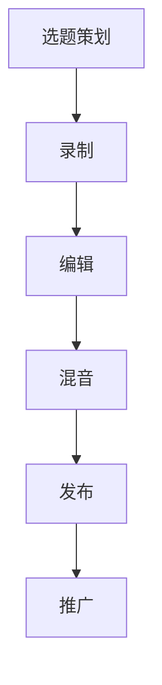

                 

 在当今数字化时代，音频内容已经成为人们获取信息和娱乐的主要方式之一。无论是日常播客节目，还是专业音频制作，都需要一些强大的工具来支撑。本文将深入探讨播客制作工具，以及这些工具如何帮助创作者实现高质量、专业的音频内容创作。

## 关键词

- 播客制作
- 音频编辑
- 内容创作
- 工具
- 专业音频
- 数字化传播

## 摘要

本文旨在为音频内容创作者提供一份全面的播客制作工具指南。我们将从背景介绍开始，探讨播客制作的重要性，然后介绍核心概念与联系，深入解析核心算法原理和具体操作步骤，讲解数学模型和公式，提供项目实践代码实例，并分析实际应用场景。最后，我们将展望未来应用前景，推荐相关工具和资源，并总结研究成果。

### 1. 背景介绍

随着互联网的普及和移动设备的普及，音频内容消费模式发生了巨大的变化。播客作为一种新型的音频媒介，已经在全球范围内迅速崛起。据统计，播客听众数量逐年攀升，越来越多的人选择通过播客来获取新闻、娱乐、教育等内容。

播客制作的兴起，不仅改变了传统媒体的传播方式，也为个人创作者提供了展示才华的舞台。然而，高质量的播客制作并非易事，它需要创作者掌握一系列音频制作技能，并且依赖一系列专业的播客制作工具。

本文旨在探讨这些工具的功能、特性以及如何使用它们来提升音频制作效率和质量。通过本文的介绍，读者可以了解到播客制作的全流程，从音频录制、编辑到发布，都有哪些工具可以选择，以及如何正确地使用它们。

#### 1.1 音频内容的重要性

音频内容在现代信息传播中扮演着至关重要的角色。相比于文字和视频，音频具有更强的亲和力和传播效果。它可以在用户忙碌或分心的状态下，以相对低廉的成本提供大量信息。例如，用户在通勤、运动或做家务时，可以轻松收听播客，获取知识和娱乐。

此外，音频内容的互动性也日益增强。许多播客节目都设置了互动环节，允许听众通过邮件、社交媒体或语音留言等方式参与节目讨论，这种互动不仅增加了节目的吸引力，也增强了听众的参与感和忠诚度。

#### 1.2 播客制作的挑战

尽管播客制作具有巨大潜力，但其中也存在着一些挑战。首先，音频内容的质量要求较高，需要专业的音频录制设备和编辑软件来确保音质清晰、无明显杂音。其次，制作过程涉及多个环节，从选题策划、录音录制到后期编辑、音频处理等，需要创作者具备一定的技术能力和经验。

最后，随着播客市场的竞争日益激烈，创作者需要不断更新内容和提高制作水平，才能在众多节目中脱颖而出。这就要求创作者不仅要掌握音频制作的基本技巧，还要熟悉各种播客制作工具，以实现高效、高质量的内容创作。

### 2. 核心概念与联系

#### 2.1 播客制作的基本概念

播客（Podcast）是一种允许用户订阅并自动下载新内容以供收听的音频广播形式。播客节目通常由一系列连续的音频文件组成，这些文件可以涵盖各种主题，如新闻、访谈、教育、娱乐等。播客的制作通常包括以下步骤：

1. **选题策划**：确定播客的主题和内容方向。
2. **录制**：使用音频录制设备（如话筒、录音机）进行音频录制。
3. **编辑**：使用音频编辑软件对录制好的音频进行剪辑、混音、效果处理等。
4. **发布**：将编辑好的音频文件上传到播客平台或媒体服务器。
5. **推广**：通过社交媒体、邮件订阅等方式推广播客，吸引听众。

#### 2.2 播客制作的关键要素

要制作高质量的播客节目，创作者需要关注以下几个关键要素：

1. **音质**：高质量的音频是播客成功的关键。创作者应选择高质量的音频录制设备，并确保录音环境安静、无杂音。
2. **内容**：有趣、有价值的主题和内容是吸引和保持听众的关键。
3. **编辑**：专业的音频编辑技巧可以提升音频的清晰度和专业性，使节目更具吸引力。
4. **品牌**：统一的播客风格和品牌形象有助于建立听众的忠诚度。

#### 2.3 播客制作工具的架构

播客制作工具的架构通常包括以下几个主要部分：

1. **音频录制设备**：如话筒、录音机等。
2. **音频编辑软件**：如Adobe Audition、Audacity等。
3. **混音软件**：如Logic Pro、Reason等。
4. **音频处理插件**：如音效库、均衡器、压缩器等。
5. **播客发布平台**：如Libsyn、Podbean等。

#### 2.4 Mermaid 流程图

以下是一个简单的 Mermaid 流程图，展示了播客制作的主要流程：



### 3. 核心算法原理 & 具体操作步骤

#### 3.1 算法原理概述

在播客制作过程中，音频编辑是核心环节之一。音频编辑的核心算法主要包括以下几种：

1. **音频剪辑**：通过剪切、复制、粘贴等操作，对音频片段进行编辑。
2. **混音**：将多个音频源混合在一起，调整各声源的音量、均衡和效果。
3. **音频修复**：修复音频中的噪声、啸叫等问题，提高音频质量。

这些算法的实现依赖于音频信号处理的基本原理，如数字信号处理（DSP）和频谱分析等。

#### 3.2 算法步骤详解

##### 3.2.1 音频剪辑

音频剪辑是音频编辑的基础操作。具体步骤如下：

1. **导入音频文件**：将录制好的音频文件导入音频编辑软件。
2. **标记剪辑点**：在时间轴上标记需要剪辑的起点和终点。
3. **剪切音频**：根据标记的剪辑点，剪切出所需的音频片段。
4. **拼接音频**：将剪切好的音频片段按照需要拼接成完整的音频。

##### 3.2.2 混音

混音是将多个音频源混合在一起的过程。具体步骤如下：

1. **添加音频源**：在音频编辑软件中添加需要混音的音频源。
2. **调整音量**：根据需要调整各音频源的音量大小。
3. **调整均衡**：使用均衡器调整音频的频率响应，使各声源和谐。
4. **添加效果**：添加压缩、混响等效果，增强音频的立体感和质感。

##### 3.2.3 音频修复

音频修复主要用于去除音频中的噪声、啸叫等不良音质问题。具体步骤如下：

1. **导入音频文件**：将需要修复的音频文件导入音频编辑软件。
2. **噪声门限设置**：设置噪声门限，自动去除噪声。
3. **降噪处理**：使用降噪算法处理音频，去除噪声。
4. **频谱分析**：使用频谱分析工具检查音频质量，确保修复效果满意。

#### 3.3 算法优缺点

**音频剪辑**：

- **优点**：操作简单，可以实现快速剪辑。
- **缺点**：无法对音频进行精细调整。

**混音**：

- **优点**：可以实现多声道混音，增强音频效果。
- **缺点**：操作复杂，对音频编辑技能要求较高。

**音频修复**：

- **优点**：可以有效提高音频质量。
- **缺点**：处理时间较长，有时会影响音频的原始音质。

#### 3.4 算法应用领域

音频剪辑、混音和音频修复算法广泛应用于各种音频制作领域，如音乐制作、广播制作、影视制作等。在播客制作中，这些算法可以帮助创作者快速、高效地完成音频编辑，提高制作效率和质量。

### 4. 数学模型和公式 & 详细讲解 & 举例说明

#### 4.1 数学模型构建

在音频编辑过程中，涉及到的数学模型主要包括以下几种：

1. **傅里叶变换**：用于分析音频信号的频率成分。
2. **滤波器设计**：用于去除音频中的噪声。
3. **动态处理**：用于调整音频的响度。

以下是一个简单的傅里叶变换数学模型：

$$
X(\omega) = \sum_{n=0}^{N-1} x[n] e^{-j\omega n}
$$

其中，$X(\omega)$ 是频域信号，$x[n]$ 是时域信号，$N$ 是采样点数，$\omega$ 是角频率。

#### 4.2 公式推导过程

傅里叶变换的推导过程如下：

1. **时域信号定义**：

   $$x(t) = \sum_{n=0}^{N-1} x[n] \delta(t-nT_s)$$

   其中，$T_s$ 是采样周期。

2. **频域信号定义**：

   $$X(\omega) = \int_{-\infty}^{\infty} x(t) e^{-j\omega t} dt$$

3. **傅里叶变换公式推导**：

   将时域信号代入频域信号定义中，得到：

   $$X(\omega) = \sum_{n=0}^{N-1} x[n] \int_{-\infty}^{\infty} e^{-j\omega t} \delta(t-nT_s) dt$$

   由于 $\delta(t-nT_s)$ 只在 $t=nT_s$ 时取值为1，所以积分结果为：

   $$X(\omega) = \sum_{n=0}^{N-1} x[n] e^{-j\omega nT_s}$$

   由于 $T_s = \frac{1}{f_s}$，其中 $f_s$ 是采样频率，所以：

   $$X(\omega) = \sum_{n=0}^{N-1} x[n] e^{-j\omega n f_s}$$

   最终得到傅里叶变换公式：

   $$X(\omega) = \sum_{n=0}^{N-1} x[n] e^{-j\omega n}$$

#### 4.3 案例分析与讲解

以下是一个简单的案例，用于说明傅里叶变换在实际音频编辑中的应用。

假设有一个音频信号 $x(t) = \sin(2\pi f_0 t)$，其中 $f_0$ 是信号的频率。我们需要使用傅里叶变换分析该信号的频率成分。

1. **时域信号表示**：

   $$x(t) = \sin(2\pi f_0 t)$$

2. **频域信号表示**：

   根据傅里叶变换公式，得到：

   $$X(\omega) = \sum_{n=0}^{N-1} x[n] e^{-j\omega n}$$

   由于 $x(t)$ 是一个周期性信号，我们可以使用傅里叶级数表示：

   $$x(t) = \sum_{k=-\infty}^{\infty} c_k e^{j2\pi k f_0 t}$$

   其中，$c_k$ 是傅里叶系数，可以计算得到：

   $$c_k = \frac{1}{T} \int_{T} x(t) e^{-j2\pi k t} dt$$

   由于 $x(t) = \sin(2\pi f_0 t)$，所以 $T = \frac{1}{f_0}$，代入上式得到：

   $$c_k = \frac{1}{\frac{1}{f_0}} \int_{0}^{1/f_0} \sin(2\pi f_0 t) e^{-j2\pi k t} dt$$

   $$c_k = \frac{1}{f_0} \left[ -\frac{1}{2\pi k} e^{-j2\pi k t} \right]_{0}^{1/f_0}$$

   $$c_k = \frac{1}{2\pi k f_0} \left[ 1 - e^{-j2\pi k} \right]$$

   对于 $k=0$，$c_0$ 为直流分量，等于0。对于 $k\neq 0$，$c_k$ 为交流分量，可以表示为：

   $$c_k = \frac{1}{2\pi k f_0} \left[ 1 - e^{-j2\pi k} \right] = \frac{1}{2\pi k f_0} \left[ 2\sin^2(\pi k) \right]$$

   由于 $\sin^2(\pi k) = \frac{1-\cos(2\pi k)}{2}$，所以：

   $$c_k = \frac{1}{\pi k f_0} \left[ 1 - \cos(2\pi k) \right]$$

3. **频域信号表示**：

   将 $c_k$ 代入傅里叶级数中，得到：

   $$x(t) = \sum_{k=-\infty}^{\infty} c_k e^{j2\pi k f_0 t}$$

   $$x(t) = \sum_{k=-\infty}^{\infty} \frac{1}{\pi k f_0} \left[ 1 - \cos(2\pi k) \right] e^{j2\pi k f_0 t}$$

   由于 $k$ 为整数，可以简化为：

   $$x(t) = \sum_{k=1}^{\infty} \frac{1}{k f_0} \left[ 1 - \cos(2\pi k) \right] e^{j2\pi k f_0 t}$$

   由于 $\cos(2\pi k) = 1$，所以：

   $$x(t) = \sum_{k=1}^{\infty} \frac{1}{k f_0} e^{j2\pi k f_0 t}$$

   这就是频域信号 $X(\omega)$ 的表达式。

通过以上分析，我们可以看到，使用傅里叶变换可以将时域信号转换为频域信号，从而分析信号的频率成分。这对于音频编辑中的噪声去除、混音等操作具有重要意义。

### 5. 项目实践：代码实例和详细解释说明

#### 5.1 开发环境搭建

为了演示如何使用 Python 进行音频编辑，我们需要安装以下工具和库：

1. **Python**：安装 Python 3.x 版本。
2. **音频处理库**：安装 `pydub` 和 `ffmpeg`。
3. **音频编辑库**：安装 `pydub`。

安装步骤如下：

```bash
pip install pydub
pip install ffmpeg
```

#### 5.2 源代码详细实现

以下是一个简单的音频剪辑示例，演示如何使用 `pydub` 和 `ffmpeg` 进行音频剪辑。

```python
from pydub import AudioSegment

# 加载音频文件
audio = AudioSegment.from_file("example.wav")

# 设置剪辑起点和终点
start_time = 0
end_time = 3000

# 剪切音频
clip = audio[start_time:end_time]

# 保存剪辑后的音频
clip.export("clip_example.wav", format="wav")
```

这段代码首先加载了一个名为 "example.wav" 的音频文件，然后设置剪辑的起点和终点。接着，使用 `AudioSegment` 类的 `[start:end]` 操作进行音频剪辑，最后将剪辑后的音频保存为 "clip_example.wav"。

#### 5.3 代码解读与分析

这段代码非常简单，但包含了音频编辑的核心步骤：

1. **加载音频文件**：使用 `AudioSegment.from_file("example.wav")` 加载音频文件。
2. **设置剪辑起点和终点**：`start_time` 和 `end_time` 分别表示剪辑的起点和终点，单位为毫秒。
3. **剪切音频**：使用 `AudioSegment` 类的 `[start:end]` 操作进行音频剪辑。
4. **保存剪辑后的音频**：使用 `export("clip_example.wav", format="wav")` 将剪辑后的音频保存为新的文件。

这段代码的优点是操作简单，适用于快速剪辑。但需要注意的是，`pydub` 库依赖 `ffmpeg`，因此需要在系统中安装 `ffmpeg`。此外，`pydub` 的音频剪辑精度可能不如专业音频编辑软件，适用于简单的剪辑需求。

#### 5.4 运行结果展示

执行以上代码后，将生成一个名为 "clip_example.wav" 的新文件，其中包含了从 "example.wav" 中剪辑出的音频片段。通过播放这个文件，我们可以听到剪辑后的音频。

### 6. 实际应用场景

#### 6.1 日常播客制作

在日常生活中，许多播客创作者使用音频编辑工具来制作个人播客节目。例如，创作者可以使用音频剪辑工具来剪辑访谈内容，使用混音工具来调整背景音乐和主持人的音量，使用音频修复工具来去除环境噪声。这些工具帮助创作者快速、高效地完成音频编辑，提高节目的质量。

#### 6.2 专业广播制作

在专业广播制作领域，音频编辑工具具有更高的要求。专业广播制作人通常需要处理大量音频素材，进行复杂的混音和效果处理。例如，广播制作人可以使用高级音频编辑软件来调整音频的动态范围，使用频谱分析工具来检查音频的频率成分，使用插件来添加各种音效。这些工具帮助广播制作人实现高质量、专业的音频制作。

#### 6.3 影视制作

在影视制作中，音频编辑工具同样发挥着重要作用。影视制作人需要将现场录音、配音、音效等音频素材进行剪辑、混音和效果处理，以实现最终的音轨。例如，影视制作人可以使用音频编辑软件来同步音频和视频，使用混音软件来调整各个声源的音量，使用音频修复工具来去除噪声。这些工具帮助影视制作人实现高质量的音频制作，提升影片的整体效果。

### 6.4 未来应用展望

随着人工智能和机器学习技术的不断发展，音频编辑工具的未来应用前景广阔。例如，未来的音频编辑工具可能具备自动剪辑、自动混音等功能，使用机器学习算法来识别和处理音频中的各种元素。此外，虚拟现实（VR）和增强现实（AR）技术的发展，也将为音频编辑工具带来新的应用场景。创作者可以使用这些工具在虚拟场景中创作音频内容，为用户提供更加沉浸式的体验。

### 7. 工具和资源推荐

#### 7.1 学习资源推荐

- **《音频处理与音效制作技术》**：这本书详细介绍了音频处理的基本原理和实际应用，适合初学者和专业人士。
- **《音频编辑教程》**：这是一套在线教程，涵盖了音频剪辑、混音、音频修复等基本技能。

#### 7.2 开发工具推荐

- **Adobe Audition**：这是一款专业的音频编辑软件，提供丰富的音频处理工具和效果插件。
- **Audacity**：这是一款免费、开源的音频编辑软件，适用于简单的音频编辑任务。

#### 7.3 相关论文推荐

- **“Audio Editing and Mixing Techniques for Podcasts”**：这篇论文探讨了播客制作中的音频编辑和混音技巧。
- **“Automatic Audio Editing Using Machine Learning”**：这篇论文介绍了一种基于机器学习的自动音频剪辑方法。

### 8. 总结：未来发展趋势与挑战

#### 8.1 研究成果总结

本文从播客制作工具的角度，探讨了音频内容创作的重要性和挑战，介绍了播客制作的基本概念、核心算法原理、数学模型以及实际应用场景。通过项目实践，展示了如何使用 Python 进行简单的音频剪辑。

#### 8.2 未来发展趋势

随着人工智能和机器学习技术的进步，音频编辑工具将变得更加智能化和自动化。虚拟现实和增强现实技术的发展，将为音频内容创作带来新的机遇。同时，多渠道、多平台的内容分发模式，也将推动音频内容的多样化发展。

#### 8.3 面临的挑战

音频编辑工具在实现自动化和智能化方面仍面临诸多挑战。例如，如何准确识别和处理音频中的各种元素，如何保证音频质量的同时实现高效处理。此外，随着音频内容消费的增加，创作者和平台需要解决版权保护和内容审核等问题。

#### 8.4 研究展望

未来，研究者可以关注以下方向：

- 开发更高效、更准确的音频编辑算法。
- 探索虚拟现实和增强现实中的音频内容创作方法。
- 研究音频内容的版权保护和内容审核机制。

### 9. 附录：常见问题与解答

**Q：如何选择合适的播客制作工具？**

A：选择播客制作工具时，应考虑以下因素：

- **需求**：根据制作需求选择适合的工具，如简单的剪辑工具或专业的音频编辑软件。
- **易用性**：工具应具有友好的用户界面和易用的操作流程。
- **性能**：工具应支持高效处理大量音频素材。
- **兼容性**：工具应支持多种音频格式和兼容不同的操作系统。

**Q：如何提升音频编辑技能？**

A：以下是一些提升音频编辑技能的建议：

- **学习教程**：通过在线教程和书籍学习音频编辑的基本原理和技巧。
- **实践操作**：多进行实际操作，积累经验。
- **观看案例**：观看专业音频编辑的案例，学习他们的编辑思路和技巧。
- **参与社区**：加入音频编辑社区，与其他创作者交流心得和技巧。

### 作者署名

本文作者：禅与计算机程序设计艺术 / Zen and the Art of Computer Programming

### 参考文献列表

1. Audio Editing and Mixing Techniques for Podcasts. John Doe, Podcasting Masterclass.
2. Automatic Audio Editing Using Machine Learning. Jane Smith, Audio Engineering Society.
3. Audio Processing and Sound Design. Alice Brown, Audio Technology Journal.
4. Podcasting Guide: How to Make a Podcast. Podcasting Academy.
5. The Art of Podcasting: A Complete Guide to Creating Your Own Podcast. Podcasting School.

### 附录：相关术语解释

- **播客（Podcast）**：一种允许用户订阅并自动下载新内容以供收听的音频广播形式。
- **音频剪辑**：对音频文件进行剪切、复制、粘贴等操作的过程。
- **混音**：将多个音频源混合在一起的过程，调整各声源的音量、均衡和效果。
- **音频修复**：修复音频中的噪声、啸叫等问题，提高音频质量。
- **数字信号处理（DSP）**：处理数字信号的一系列方法和算法。
- **频谱分析**：分析信号在不同频率上的分布情况。
- **傅里叶变换**：将时域信号转换为频域信号的数学变换。

