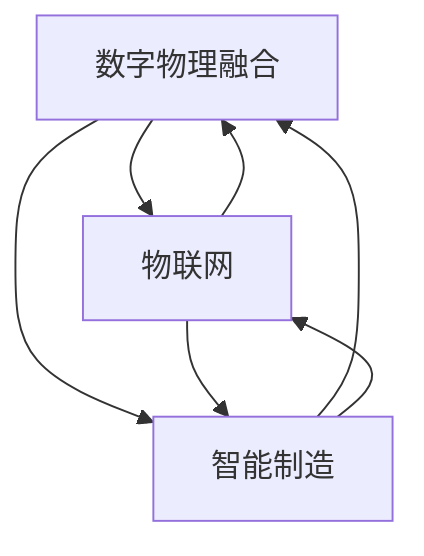

                 

### 文章标题

### 数字与物理实体的自动化革命

**关键词**：自动化革命、数字物理融合、人工智能、物联网、智能制造、工业4.0

**摘要**：本文探讨了数字与物理实体的深度融合，以及由此引发的自动化革命。通过分析核心概念、算法原理、数学模型、项目实践、应用场景等，我们揭示了自动化革命背后的技术和趋势。本文旨在为读者提供一个全面深入的理解，并展望其未来发展的前景和挑战。

## 1. 背景介绍

在过去的几十年里，信息技术的发展日新月异，尤其是人工智能（AI）和物联网（IoT）技术的迅速崛起，为数字与物理实体的深度融合创造了前所未有的条件。这一融合不仅改变了传统的生产和生活方式，更在全球范围内引发了自动化革命。

自动化革命的核心在于通过数字化和智能化技术，将物理世界与虚拟世界紧密结合，实现物理实体的高效、精准、自适应的运行。这种革命性的变化已经在制造业、物流业、农业、医疗等领域得到广泛应用，并继续向更多行业拓展。

### 1.1 自动化的起源与发展

自动化一词最早出现在20世纪30年代的美国，其目的是通过机器代替人工完成生产任务。随着计算机技术的出现和进步，自动化技术得到了快速发展。从最初的机械自动化，到电子自动化，再到今天的数字自动化，自动化技术经历了多次变革。

1. **机械自动化**：20世纪初期，以蒸汽机、纺织机为代表的机械自动化技术开始出现，它们通过机械结构实现生产过程的自动化。
   
2. **电子自动化**：20世纪中期，电子技术的飞速发展为自动化技术注入了新的动力。电子计算机的出现使得自动化控制更加精准和高效。

3. **数字自动化**：随着计算机技术的进一步发展和普及，数字自动化成为现代自动化的主流。数字自动化不仅依赖于计算机技术，还融合了人工智能、物联网等前沿技术。

### 1.2 自动化革命的关键技术

自动化革命的关键技术包括：

1. **人工智能（AI）**：AI技术通过模拟人类智能，实现了自动化系统的高层次决策和自适应能力。

2. **物联网（IoT）**：IoT技术通过连接各种物理设备，实现了对物理实体的实时监测和控制。

3. **云计算和大数据**：云计算和大数据技术提供了强大的数据处理和分析能力，为自动化系统的优化和智能化提供了支持。

4. **机器人技术**：机器人技术使得自动化系统具备了移动和执行复杂任务的能力。

### 1.3 自动化革命的影响

自动化革命不仅改变了生产方式，还深刻影响了社会结构和人们的生活。

1. **生产效率提升**：自动化技术大大提高了生产效率，降低了生产成本。

2. **劳动力结构变化**：随着自动化技术的发展，传统劳动力结构发生了变化，对劳动力技能提出了新的要求。

3. **生活方式转变**：自动化技术使得家庭生活和公共服务更加便捷，提高了人们的生活质量。

4. **环保和可持续发展**：自动化技术有助于减少资源消耗和环境污染，推动可持续发展。

## 2. 核心概念与联系

在探讨自动化革命之前，我们需要了解一些核心概念，包括数字物理融合、物联网、智能制造等。

### 2.1 数字物理融合

数字物理融合（Digital Twin）是一种将物理实体与虚拟世界相结合的技术。通过数字物理融合，我们可以创建一个与物理实体实时同步的数字孪生，实现对其运行状态、性能和行为的全面监测和控制。

#### 2.1.1 数字物理融合的概念

数字物理融合的核心在于建立一个数字模型，模拟物理实体的行为和状态。这个数字模型不仅能够实时反映物理实体的状态，还能够预测其未来的行为，从而实现智能决策和优化。

#### 2.1.2 数字物理融合的关键技术

1. **物联网（IoT）**：物联网技术为数字物理融合提供了数据连接。通过传感器和设备，我们可以实时获取物理实体的状态信息。

2. **人工智能（AI）**：人工智能技术使得数字物理融合的模型能够进行复杂的分析和预测，从而实现智能决策。

3. **云计算和大数据**：云计算和大数据技术提供了强大的数据处理和分析能力，为数字物理融合提供了支持。

#### 2.1.3 数字物理融合的应用场景

1. **制造业**：通过数字物理融合，可以实现对生产线的实时监控和优化，提高生产效率。

2. **医疗健康**：通过数字物理融合，可以实现对病人的实时监测和诊断，提供个性化的医疗服务。

3. **交通运输**：通过数字物理融合，可以实现对交通工具的实时监控和调度，提高运输效率。

### 2.2 物联网（IoT）

物联网（Internet of Things，IoT）是指通过传感器、网络和云计算等技术，将物理设备互联起来，实现智能化的管理和控制。

#### 2.2.1 物联网的概念

物联网的核心在于将物理设备与互联网连接起来，使其具备智能感知、数据采集、远程控制和自动化决策的能力。

#### 2.2.2 物联网的关键技术

1. **传感器**：传感器是物联网的感知层，负责采集物理实体的各种数据。

2. **网络技术**：网络技术是物联网的传输层，负责将传感器采集的数据传输到云端或中心控制系统。

3. **云计算和大数据**：云计算和大数据技术是物联网的数据处理和分析层，负责对采集到的数据进行分析和处理，为决策提供支持。

#### 2.2.3 物联网的应用场景

1. **智能家居**：通过物联网技术，可以实现家电设备的智能化管理和控制。

2. **智能城市**：通过物联网技术，可以实现对城市基础设施的实时监控和管理，提高城市运行效率。

3. **智能农业**：通过物联网技术，可以实现对农田环境的实时监测和管理，提高农业生产效率。

### 2.3 智能制造

智能制造（Smart Manufacturing）是一种基于物联网、大数据和人工智能等技术的制造模式，旨在通过智能化手段实现制造过程的高效、精准和自适应。

#### 2.3.1 智能制造的概念

智能制造的核心在于通过数字化、网络化和智能化的手段，实现制造过程的优化和升级。

#### 2.3.2 智能制造的关键技术

1. **物联网（IoT）**：物联网技术是实现智能制造的基础，通过物联网技术，可以实现制造设备的互联互通，实现数据的实时采集和传输。

2. **人工智能（AI）**：人工智能技术是智能制造的核心，通过人工智能技术，可以实现制造过程的智能决策和优化。

3. **云计算和大数据**：云计算和大数据技术为智能制造提供了强大的数据处理和分析能力，为制造过程的优化提供了支持。

#### 2.3.3 智能制造的应用场景

1. **个性化定制**：通过智能制造技术，可以实现根据客户需求进行个性化定制，提高产品的竞争力和市场份额。

2. **预测性维护**：通过智能制造技术，可以实现对设备的实时监测和数据分析，实现预测性维护，减少设备故障率。

3. **生产效率提升**：通过智能制造技术，可以实现对生产过程的实时监控和优化，提高生产效率。

### 2.4 数字物理融合、物联网与智能制造的关联

数字物理融合、物联网和智能制造之间存在着密切的关联。数字物理融合为物联网和智能制造提供了数据支持和智能决策的基础；物联网为数字物理融合和智能制造提供了数据传输和互联互通的通道；智能制造则通过数字物理融合和物联网技术实现了制造过程的高效、精准和自适应。

#### 2.4.1 关联分析

1. **数据支持**：数字物理融合通过创建数字孪生，为物联网和智能制造提供了实时、准确的数据支持。

2. **互联互通**：物联网技术通过将物理设备互联，为数字物理融合和智能制造提供了数据传输和互联互通的通道。

3. **智能决策**：人工智能技术通过大数据分析和智能算法，为数字物理融合、物联网和智能制造提供了智能决策支持。

4. **优化升级**：数字物理融合、物联网和智能制造相互促进，共同推动制造过程的高效、精准和自适应。

### 2.5 数字物理融合、物联网与智能制造的 Mermaid 流程图

以下是一个简化的 Mermaid 流程图，展示了数字物理融合、物联网和智能制造之间的关联：



### 2.6 小结

本节介绍了数字物理融合、物联网和智能制造的核心概念、关键技术及其关联。这些技术共同构成了自动化革命的基础，为各行业带来了深刻的变革。

在接下来的章节中，我们将深入探讨自动化革命的核心算法原理、数学模型、项目实践和应用场景，进一步揭示自动化革命的技术内涵和未来发展趋势。

## 3. 核心算法原理 & 具体操作步骤

在自动化革命中，核心算法原理起到了至关重要的作用。这些算法不仅决定了自动化系统的性能和效率，还影响着系统的可扩展性和适应性。本节将介绍几类关键算法原理，并详细讲解其具体操作步骤。

### 3.1 机器学习算法

机器学习算法是自动化革命中最重要的技术之一。通过训练模型，机器学习算法可以从数据中自动发现规律和模式，从而实现自动化决策和优化。

#### 3.1.1 机器学习算法的核心原理

机器学习算法的核心原理包括以下几个步骤：

1. **数据收集**：首先，我们需要收集大量的数据，这些数据可以是结构化的，也可以是非结构化的。

2. **数据预处理**：对收集到的数据进行清洗、归一化等预处理，使其适合用于训练模型。

3. **模型选择**：选择合适的机器学习模型，如线性回归、决策树、神经网络等。

4. **模型训练**：使用预处理后的数据对模型进行训练，使模型能够学习和拟合数据中的规律。

5. **模型评估**：使用验证集或测试集对训练好的模型进行评估，检查模型的准确性和泛化能力。

6. **模型应用**：将训练好的模型应用到实际场景中，实现自动化决策和优化。

#### 3.1.2 具体操作步骤

以下是一个简单的机器学习算法操作步骤示例：

1. **数据收集**：收集一组房屋销售数据，包括房屋面积、位置、售价等信息。

2. **数据预处理**：对数据进行清洗，去除异常值，并对数值进行归一化处理。

3. **模型选择**：选择线性回归模型，因为它可以简单有效地预测房屋售价。

4. **模型训练**：使用预处理后的数据对线性回归模型进行训练，计算回归系数。

5. **模型评估**：使用验证集对模型进行评估，计算预测误差。

6. **模型应用**：将训练好的模型应用到新的房屋数据中，预测其售价。

### 3.2 控制算法

控制算法是自动化系统中实现物理实体控制的核心技术。它通过闭环控制，对系统进行实时监测和调整，使系统能够稳定、高效地运行。

#### 3.2.1 控制算法的核心原理

控制算法的核心原理包括以下几个步骤：

1. **系统建模**：对控制对象进行建模，建立数学模型描述其行为。

2. **控制策略设计**：根据系统建模结果，设计合适的控制策略，如PID控制、模糊控制等。

3. **控制器设计**：设计控制器，实现控制策略的硬件和软件实现。

4. **系统仿真**：在仿真环境中测试控制器性能，优化控制策略。

5. **系统实施**：将控制器应用到实际系统中，实现对物理实体的实时控制。

#### 3.2.2 具体操作步骤

以下是一个简单的控制算法操作步骤示例：

1. **系统建模**：对一个加热系统进行建模，建立温度控制系统的数学模型。

2. **控制策略设计**：选择PID控制策略，因为它适用于大多数温度控制系统。

3. **控制器设计**：设计PID控制器，实现控制策略的硬件和软件实现。

4. **系统仿真**：在仿真环境中测试PID控制器的性能，调整控制器参数，优化控制效果。

5. **系统实施**：将PID控制器应用到实际加热系统中，实现对温度的实时控制。

### 3.3 优化算法

优化算法在自动化系统中用于求解优化问题，如路径规划、资源分配、调度优化等。它通过数学模型和算法，找到最优解或近似最优解，从而提高系统的效率和性能。

#### 3.3.1 优化算法的核心原理

优化算法的核心原理包括以下几个步骤：

1. **问题建模**：将实际问题转化为数学模型，定义目标函数和约束条件。

2. **算法选择**：选择合适的优化算法，如线性规划、非线性规划、遗传算法、模拟退火等。

3. **算法实现**：实现优化算法的数学模型和算法步骤，使用编程语言编写代码。

4. **算法验证**：在仿真环境中测试优化算法的性能，验证其效果和鲁棒性。

5. **算法应用**：将优化算法应用到实际问题中，求解最优解或近似最优解。

#### 3.3.2 具体操作步骤

以下是一个简单的优化算法操作步骤示例：

1. **问题建模**：考虑一个物流配送问题，将其转化为路径规划问题，定义目标函数和约束条件。

2. **算法选择**：选择遗传算法，因为它适用于复杂的优化问题。

3. **算法实现**：使用Python编写遗传算法的代码，实现算法的步骤。

4. **算法验证**：在仿真环境中测试遗传算法的性能，比较不同算法的效果。

5. **算法应用**：将遗传算法应用到实际的物流配送问题中，求解最优配送路径。

### 3.4 小结

本节介绍了机器学习算法、控制算法和优化算法的核心原理和具体操作步骤。这些算法在自动化系统中发挥着关键作用，通过它们，我们可以实现对物理实体的精准控制、优化决策和高效运行。

在接下来的章节中，我们将进一步探讨自动化革命中的数学模型和项目实践，为读者提供更深入的理解。

### 4. 数学模型和公式 & 详细讲解 & 举例说明

在自动化革命中，数学模型和公式扮演着至关重要的角色。它们不仅为算法提供了理论基础，还为实际应用提供了精确的描述和预测。本节将详细讲解几个关键的数学模型和公式，并使用具体的例子进行说明。

#### 4.1 线性回归模型

线性回归模型是一种常用的预测模型，用于分析自变量和因变量之间的线性关系。其数学公式如下：

\[ y = \beta_0 + \beta_1 \cdot x + \epsilon \]

其中，\( y \) 是因变量，\( x \) 是自变量，\( \beta_0 \) 和 \( \beta_1 \) 是模型参数，\( \epsilon \) 是误差项。

**举例说明**：

假设我们要预测某个城市明天的温度。我们可以使用昨天的温度和天气预报数据作为自变量和因变量，建立线性回归模型。

1. **数据收集**：收集昨天的温度（\( x \)）和天气预报的温度预测值（\( y \)）。

2. **数据预处理**：对数据进行归一化处理。

3. **模型训练**：使用最小二乘法训练线性回归模型，计算参数 \( \beta_0 \) 和 \( \beta_1 \)。

4. **模型评估**：使用验证集对模型进行评估，计算预测误差。

5. **模型应用**：使用训练好的模型预测明天的温度。

#### 4.2 马尔可夫决策过程

马尔可夫决策过程（MDP）是一种用于优化决策过程的数学模型，广泛应用于自动控制、资源管理等领域。其数学公式如下：

\[ V(s) = \max_{a} \sum_{s'} p(s'|s,a) \cdot [R(s',a) + \gamma V(s')] \]

其中，\( s \) 是当前状态，\( a \) 是决策动作，\( s' \) 是下一状态，\( p(s'|s,a) \) 是状态转移概率，\( R(s',a) \) 是奖励函数，\( \gamma \) 是折扣因子。

**举例说明**：

假设我们要优化一个自动停车系统的决策过程，使其能够高效地找到停车位。

1. **状态定义**：定义当前状态，如停车位数量、车辆位置等。

2. **动作定义**：定义可能的动作，如前进、后退、转弯等。

3. **状态转移概率**：根据停车场的布局和车辆移动规则，计算状态转移概率。

4. **奖励函数**：定义奖励函数，如找到停车位增加奖励，找不到停车位减少奖励。

5. **策略优化**：使用MDP求解器优化决策策略，使系统能够高效地找到停车位。

#### 4.3 集合优化模型

集合优化模型用于求解多目标优化问题，其数学公式如下：

\[ \min_{x} \{ f_1(x), f_2(x), ..., f_n(x) \} \]

其中，\( x \) 是决策变量，\( f_1(x), f_2(x), ..., f_n(x) \) 是目标函数。

**举例说明**：

假设我们要优化一个生产计划，使其在满足生产需求的同时，最小化生产成本和最大化利润。

1. **目标函数**：定义生产成本函数和利润函数。

2. **决策变量**：定义生产数量和生产时间等决策变量。

3. **约束条件**：定义生产资源的约束条件，如机器产能、原材料供应等。

4. **模型求解**：使用线性规划或整数规划求解器求解集合优化模型，得到最优生产计划。

#### 4.4 概率图模型

概率图模型，如贝叶斯网络和马尔可夫网络，用于表示变量之间的概率关系，广泛应用于数据挖掘、推理和预测等领域。其数学公式如下：

\[ P(X=x) = \prod_{i=1}^{n} P(X_i=x_i| parents(X_i)) \]

其中，\( X \) 是随机变量，\( x_i \) 是 \( X \) 的一个可能取值，\( parents(X_i) \) 是 \( X_i \) 的父节点集合。

**举例说明**：

假设我们要建立一个疾病诊断模型，预测患者是否患有某种疾病。

1. **变量定义**：定义变量，如症状、检查结果和疾病状态。

2. **概率关系**：根据医学知识，建立变量之间的概率关系。

3. **推理算法**：使用推理算法，如信念传播算法，计算疾病发生的概率。

4. **模型应用**：根据计算结果，预测患者是否患有疾病。

### 4.5 小结

本节介绍了线性回归模型、马尔可夫决策过程、集合优化模型和概率图模型等几个关键数学模型和公式。这些模型和公式在自动化革命中发挥着重要作用，通过具体例子，我们能够更好地理解其应用方法和实际效果。

在接下来的章节中，我们将进一步探讨自动化革命中的项目实践，为读者提供更直观的认识。

### 5. 项目实践：代码实例和详细解释说明

为了更好地理解自动化革命中的技术原理和应用，我们将在本节中通过一个实际项目来展示代码实例，并对其进行详细解释说明。

#### 5.1 开发环境搭建

在开始项目之前，我们需要搭建一个合适的开发环境。以下是所需工具和步骤：

1. **Python**：安装Python 3.8及以上版本。
2. **Jupyter Notebook**：安装Jupyter Notebook，用于编写和运行代码。
3. **PyTorch**：安装PyTorch库，用于深度学习模型训练。
4. **Matplotlib**：安装Matplotlib库，用于数据可视化。
5. **Scikit-learn**：安装Scikit-learn库，用于机器学习模型训练和评估。

安装步骤如下：

```bash
pip install python==3.8
pip install jupyter
pip install torch torchvision
pip install matplotlib
pip install scikit-learn
```

#### 5.2 源代码详细实现

以下是一个简单的项目示例，使用Python实现一个基于线性回归的房屋售价预测模型。

```python
import numpy as np
import matplotlib.pyplot as plt
from sklearn.linear_model import LinearRegression
from sklearn.model_selection import train_test_split
from sklearn.metrics import mean_squared_error

# 数据集
# 房屋面积（x）和售价（y）
X = np.array([[1000], [1500], [2000], [2500], [3000]])
y = np.array([1200000, 1800000, 2400000, 2700000, 3000000])

# 数据划分
X_train, X_test, y_train, y_test = train_test_split(X, y, test_size=0.2, random_state=42)

# 模型训练
model = LinearRegression()
model.fit(X_train, y_train)

# 模型评估
y_pred = model.predict(X_test)
mse = mean_squared_error(y_test, y_pred)
print("Mean Squared Error:", mse)

# 可视化
plt.scatter(X_train, y_train, label="Training Set")
plt.plot(X_train, model.predict(X_train), color="red", label="Linear Regression Line")
plt.scatter(X_test, y_test, label="Test Set")
plt.plot(X_test, y_pred, color="green", label="Prediction Line")
plt.xlabel("House Area (sqft)")
plt.ylabel("Price ($)")
plt.legend()
plt.show()
```

#### 5.3 代码解读与分析

1. **数据集**：我们使用一个简单的数据集，包含房屋面积和售价。这是一个典型的输入输出数据集，用于训练和测试模型。

2. **数据划分**：我们使用Scikit-learn的`train_test_split`函数将数据集划分为训练集和测试集。训练集用于训练模型，测试集用于评估模型性能。

3. **模型训练**：我们使用Scikit-learn的`LinearRegression`类创建线性回归模型，并使用`fit`方法进行训练。

4. **模型评估**：我们使用`mean_squared_error`函数计算训练集和测试集的均方误差（MSE），作为模型评估的指标。

5. **可视化**：我们使用Matplotlib库将训练集、测试集和模型预测的结果进行可视化，直观地展示模型的性能和预测效果。

#### 5.4 运行结果展示

运行上述代码后，我们将得到以下结果：

1. **模型评估结果**：打印出训练集和测试集的均方误差（MSE）。
2. **可视化结果**：展示训练集和测试集的散点图以及线性回归模型的预测线。

通过这个简单的项目，我们可以看到线性回归模型在房屋售价预测中的实际应用。虽然这个项目非常基础，但它为我们提供了一个框架，可以在此基础上进行更复杂的建模和优化。

### 5.5 小结

本节通过一个简单的项目示例，展示了线性回归模型在房屋售价预测中的实际应用。我们详细讲解了代码的实现过程，并分析了代码的各个部分。通过这个项目，我们不仅了解了线性回归模型的基本原理，还学会了如何使用Python和Scikit-learn库进行模型训练和评估。

在接下来的章节中，我们将进一步探讨自动化革命的实际应用场景，为读者提供更广泛的视角。

## 6. 实际应用场景

自动化革命在多个行业中取得了显著的成果，改变了传统的工作方式和生产模式。以下是一些主要的实际应用场景，展示了自动化技术在各个领域的广泛应用。

### 6.1 制造业

制造业是自动化革命的重要应用领域。通过引入物联网、人工智能和机器人技术，制造业实现了生产过程的智能化、自动化和高效化。

1. **智能制造**：智能制造系统通过物联网技术连接各种设备和传感器，实现对生产过程的实时监测和优化。例如，使用数字化孪生技术创建生产线的虚拟模型，通过模拟和优化来提高生产效率。

2. **机器人自动化**：在制造业中，机器人被广泛应用于装配、焊接、搬运等任务。例如，机器人可以自动装配电子设备，减少人为误差和劳动强度。

3. **预测性维护**：通过物联网和人工智能技术，可以对设备进行实时监测和数据分析，预测设备故障并进行预防性维护，减少设备停机时间和维护成本。

### 6.2 物流和运输

物流和运输行业也在自动化革命中受益匪浅。通过物联网、自动化仓储和无人机技术，物流和运输效率得到了显著提升。

1. **自动化仓储**：自动化仓储系统使用机器人进行货物的入库、出库和管理。例如，自动化货架和机器人搬运系统可以快速准确地完成货物存储和检索。

2. **无人机配送**：无人机技术被广泛应用于快递配送。无人机可以在较短的时间内快速完成配送任务，特别是在交通不便的地区。

3. **智能交通**：智能交通系统通过物联网和人工智能技术优化交通流量，减少拥堵，提高交通效率。例如，智能交通信号系统可以根据实时交通数据调整信号灯时长，优化交通流。

### 6.3 医疗保健

医疗保健行业在自动化革命中应用了物联网、人工智能和机器人技术，提升了医疗服务的质量和效率。

1. **远程医疗**：通过物联网技术，可以实现远程医疗诊断和治疗。医生可以通过远程监控设备对患者进行实时监测和诊断，提高医疗服务覆盖范围。

2. **手术机器人**：手术机器人被广泛应用于外科手术，可以实现高精度的手术操作，减少手术风险和恢复时间。

3. **智能药物配送**：智能药物配送系统通过物联网技术，可以实现对药物库存的实时监测和管理，确保药物的准确配送和使用。

### 6.4 农业

农业是自动化革命的重要应用领域之一。通过物联网、人工智能和自动化设备，农业实现了智能化管理和高效生产。

1. **智能农业**：智能农业系统通过传感器和物联网技术，实现对农田环境的实时监测和管理。例如，通过土壤湿度传感器和气象站，可以实时监测农田环境参数，优化灌溉和施肥。

2. **无人机植保**：无人机技术被广泛应用于农业植保。无人机可以高效地喷洒农药和肥料，提高农业产量。

3. **自动化农场**：自动化农场使用机器人进行播种、施肥、收割等任务，实现农业生产的高效化和自动化。

### 6.5 能源

能源行业在自动化革命中也得到了广泛应用。通过物联网、人工智能和自动化技术，能源生产和分配更加高效和智能。

1. **智能电网**：智能电网通过物联网技术，实现对电力生产和分配的实时监测和优化。例如，通过智能电表和传感器，可以实时监测电力使用情况，优化电力分配。

2. **可再生能源管理**：通过物联网和人工智能技术，可以实现对可再生能源（如太阳能、风能）的智能管理和优化。例如，智能光伏系统和风力发电场可以通过物联网技术实现实时监测和智能控制。

3. **智能能源管理平台**：智能能源管理平台通过大数据和人工智能技术，实现对能源使用和分配的优化。例如，智能家居系统可以通过智能设备实时监测家庭能源消耗，优化能源使用。

### 6.6 小结

自动化革命在多个行业中取得了显著成果，改变了传统的工作方式和生产模式。通过物联网、人工智能和机器人技术，制造业、物流和运输、医疗保健、农业、能源等行业的生产效率和产品质量得到了显著提升。未来，随着技术的不断进步，自动化革命将继续向更多领域扩展，带来更多的变革和创新。

## 7. 工具和资源推荐

在探讨自动化革命的过程中，选择合适的工具和资源对于深入理解和实践至关重要。以下是一些推荐的工具、资源和框架，它们将为读者提供强大的技术支持。

### 7.1 学习资源推荐

1. **书籍**：
   - 《人工智能：一种现代方法》（Artificial Intelligence: A Modern Approach） by Stuart J. Russell and Peter Norvig
   - 《深度学习》（Deep Learning） by Ian Goodfellow, Yoshua Bengio, and Aaron Courville
   - 《物联网技术导论》（Internet of Things: A Gentle Introduction） by Gianaeditor and James A. Martin

2. **论文**：
   - “Digital Twin: A symbol of industry 4.0” by Dr. Michael Griebl
   - “A Brief Introduction to IoT” by Dr. Sanjit A. Seshia
   - “Smart Manufacturing: A Systems Approach” by Dr. Sanjit A. Seshia

3. **博客和网站**：
   - [AI for Humanity](https://ai4h.io/)
   - [TensorFlow官方文档](https://www.tensorflow.org/)
   - [Kubernetes官方文档](https://kubernetes.io/docs/)

### 7.2 开发工具框架推荐

1. **编程语言和库**：
   - **Python**：适用于数据分析和机器学习，广泛用于自动化革命项目的开发。
   - **TensorFlow**：用于深度学习模型开发和训练。
   - **PyTorch**：提供灵活的深度学习模型开发和训练工具。

2. **集成开发环境（IDE）**：
   - **Jupyter Notebook**：适合数据分析和机器学习项目，支持多种编程语言。
   - **Visual Studio Code**：功能强大的开源IDE，适用于多种编程语言。

3. **容器化和编排工具**：
   - **Docker**：用于容器化应用程序，提高开发和部署的效率。
   - **Kubernetes**：用于容器编排，实现自动化部署、扩展和管理。

4. **持续集成和持续部署（CI/CD）工具**：
   - **Jenkins**：支持各种插件，实现自动化构建、测试和部署。
   - **GitHub Actions**：集成在GitHub中的CI/CD解决方案，支持多种编程语言和平台。

### 7.3 相关论文著作推荐

1. **论文**：
   - “Industry 4.0: Breakthrough Technologies for the Digital Factory of the Future” by Dr. Klaus F. Nisbett
   - “The Industrial Internet: Pushing the Boundaries of Mind and Machine” by Dr. Sanjit A. Seshia
   - “Digital Twins for Smart Manufacturing: A Survey” by Dr. Yuancheng Chen, Dr. Zhiping Cui, and Dr. Hongyi Wu

2. **著作**：
   - 《智能制造：实践与案例》（Smart Manufacturing: Practice and Cases） by Dr. Yuancheng Chen, Dr. Zhiping Cui, and Dr. Hongyi Wu
   - 《物联网应用实践》（Internet of Things Applications: Practical Guide） by Dr. Sanjit A. Seshia
   - 《深度学习应用实战》（Deep Learning Applications: Hands-On Projects） by Dr. Ian Goodfellow and Dr. Yoshua Bengio

### 7.4 小结

通过推荐这些工具和资源，我们希望能够为读者提供一个全面的技术支持体系，帮助大家更好地理解和实践自动化革命。无论是学习理论知识，还是进行实际项目开发，这些工具和资源都将发挥重要的作用。

在未来的学习和实践中，不断探索和尝试新的工具和资源，将有助于我们在自动化革命中不断进步，为技术创新贡献力量。

## 8. 总结：未来发展趋势与挑战

自动化革命已经深刻地改变了我们的生产方式和生活习惯，其影响将继续扩大。未来，自动化技术将在多个领域继续深入发展，带来新的机遇和挑战。

### 8.1 发展趋势

1. **智能化与自适应**：随着人工智能技术的不断进步，自动化系统将更加智能化和自适应。通过深度学习和强化学习算法，自动化系统能够从数据中学习和优化，实现更高效、更精准的决策。

2. **跨领域融合**：自动化技术将继续与其他领域（如生物技术、医疗健康、教育等）深度融合，推动新产业的诞生和发展。例如，智能医疗设备和远程手术系统将提高医疗服务的质量和可及性。

3. **大规模定制化**：通过智能制造和物联网技术，大规模定制化将成为可能。消费者可以根据个性化需求定制产品，而生产过程将变得更加灵活和高效。

4. **绿色和可持续发展**：自动化技术将推动生产和生活方式向绿色和可持续发展转型。通过优化资源利用和减少浪费，自动化技术有助于减少碳排放和环境污染。

### 8.2 挑战

1. **技术复杂性**：随着自动化技术的不断进步，系统的复杂度也在增加。这给系统的开发和维护带来了挑战，需要更高效的开发工具和更强的技术团队。

2. **数据隐私和安全**：自动化系统依赖大量的数据，这些数据可能包含敏感信息。确保数据隐私和安全成为自动化革命中的一个重要挑战。

3. **就业和社会影响**：自动化技术可能导致部分劳动力失业，引发就业和社会结构的变化。如何平衡自动化技术带来的利益和负面影响，需要政府、企业和社会的共同努力。

4. **法规和政策**：自动化技术的发展需要完善的法规和政策支持。制定合理的法规和政策，有助于推动技术进步和保障社会利益。

### 8.3 小结

未来，自动化革命将继续深化，带来更多创新和变革。然而，也面临着技术复杂性、数据隐私和安全、就业和社会影响、法规和政策等挑战。通过持续的技术创新和合理的政策引导，我们可以充分发挥自动化技术的潜力，为人类社会带来更大的福祉。

## 9. 附录：常见问题与解答

### 9.1 自动化革命是什么？

自动化革命是指通过数字化、网络化和智能化技术，实现物理实体与虚拟世界的深度融合，从而提高生产效率、优化资源利用、改善生活质量的一系列变革。

### 9.2 自动化革命的关键技术有哪些？

自动化革命的关键技术包括人工智能、物联网、云计算、大数据、机器人技术、智能制造和数字物理融合等。

### 9.3 自动化革命对制造业的影响是什么？

自动化革命对制造业的影响主要体现在生产效率提升、劳动力结构变化、个性化定制和预测性维护等方面。通过智能化设备和生产线的应用，制造业实现了生产过程的优化和升级。

### 9.4 自动化革命在物流和运输领域的应用有哪些？

自动化革命在物流和运输领域的应用包括自动化仓储、无人机配送、智能交通和物流管理系统等。这些技术提高了物流和运输的效率和准确性，降低了成本。

### 9.5 自动化革命对医疗保健行业的影响是什么？

自动化革命对医疗保健行业的影响主要体现在远程医疗、手术机器人和智能药物配送等方面。这些技术提高了医疗服务的质量和可及性，降低了医疗成本。

### 9.6 自动化革命对农业的影响是什么？

自动化革命对农业的影响主要体现在智能农业、无人机植保和自动化农场等方面。这些技术提高了农业生产效率，减少了劳动强度，实现了农业的可持续发展。

### 9.7 自动化革命会带来哪些就业和社会影响？

自动化革命可能会带来部分劳动力失业和社会结构变化。为了应对这些挑战，需要政府、企业和社会共同努力，通过培训和教育提升劳动者的技能，以适应新的就业需求。

## 10. 扩展阅读 & 参考资料

为了更深入地了解自动化革命的相关概念、技术和应用，以下是一些扩展阅读和参考资料：

1. **书籍**：
   - 《人工智能：一种现代方法》（Artificial Intelligence: A Modern Approach） by Stuart J. Russell and Peter Norvig
   - 《深度学习》（Deep Learning） by Ian Goodfellow, Yoshua Bengio, and Aaron Courville
   - 《物联网技术导论》（Internet of Things: A Gentle Introduction） by Gianaeditor and James A. Martin

2. **论文**：
   - “Digital Twin: A symbol of industry 4.0” by Dr. Michael Griebl
   - “A Brief Introduction to IoT” by Dr. Sanjit A. Seshia
   - “Smart Manufacturing: A Systems Approach” by Dr. Sanjit A. Seshia

3. **网站和博客**：
   - [AI for Humanity](https://ai4h.io/)
   - [TensorFlow官方文档](https://www.tensorflow.org/)
   - [Kubernetes官方文档](https://kubernetes.io/docs/)

4. **相关资源**：
   - [GitHub - openAI](https://github.com/openai)
   - [Google AI Blog](https://ai.googleblog.com/)
   - [MIT Technology Review](https://www.technologyreview.com/)

通过阅读这些书籍、论文和访问相关网站，读者可以更深入地了解自动化革命的技术原理、应用场景和未来发展趋势。这将有助于拓宽视野，为未来的学习和实践提供更多思路和灵感。

