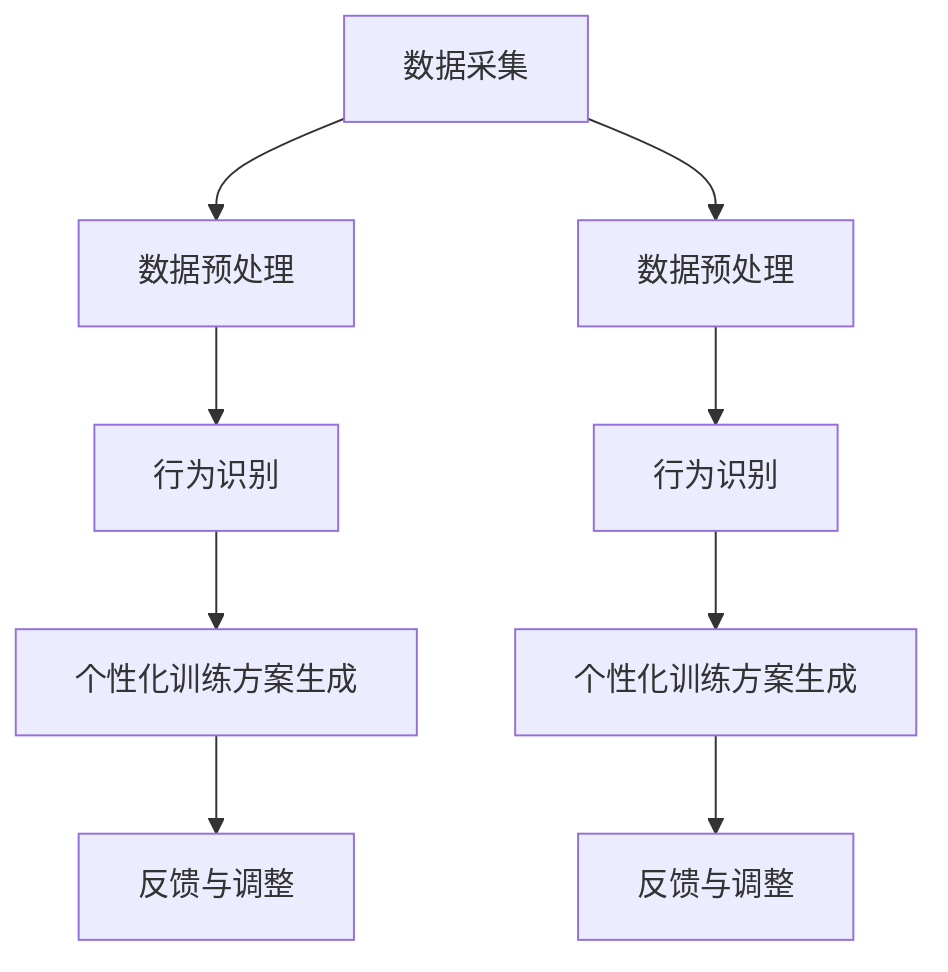

                 

### 1. 背景介绍

随着科技的飞速发展，人工智能（AI）技术在各行各业中得到了广泛应用。宠物行业作为人类生活的重要组成部分，也迎来了数字化转型的机遇。近年来，越来越多的创业者开始关注宠物训练市场的潜力，致力于通过人工智能技术改善宠物与主人之间的互动，提高宠物的生活质量。在这样的背景下，数字化宠物训练创业成为了一个热门领域，吸引了大量投资和人才涌入。

数字化宠物训练的核心在于利用AI技术对宠物的行为进行监测、分析和指导，从而实现个性化的训练方案。具体而言，这一过程包括以下几个方面：

首先，数据采集是数字化宠物训练的基础。通过穿戴设备、摄像头等传感器，实时收集宠物的行为数据，如运动轨迹、心率、情绪状态等。这些数据为后续的分析和处理提供了丰富的信息来源。

其次，数据预处理是保证分析结果准确性的关键步骤。在收集到原始数据后，需要进行数据清洗、去噪、归一化等操作，以确保数据的完整性和一致性。此外，还需要对数据进行特征提取，提取出能够代表宠物行为的关键特征，如步频、步长等。

接着，行为识别是数字化宠物训练的核心环节。利用机器学习算法，如深度学习、决策树等，对提取的特征进行分类和识别，判断宠物的行为类型。例如，区分宠物是否在运动、休息或者兴奋等状态。

然后，个性化训练方案生成是数字化宠物训练的目标。根据宠物的行为数据和行为识别结果，为宠物生成个性化的训练计划。这些计划可以是定期的训练任务，也可以是针对特定行为的矫正方案。

最后，反馈与调整是数字化宠物训练的持续过程。根据宠物在训练过程中的表现，不断调整训练方案，使其更符合宠物的需求和实际情况。

总之，数字化宠物训练创业是一个涉及多个领域的交叉学科，需要创业者具备扎实的技术背景和敏锐的市场洞察力。通过不断创新和优化，数字化宠物训练有望成为宠物行业的一个重要分支，为宠物和主人带来更多价值。

### 2. 核心概念与联系

在深入探讨数字化宠物训练创业之前，我们需要理解几个核心概念及其相互关系。这些概念构成了数字化宠物训练系统的基础，也是实现高效训练的关键。

#### 2.1 数据采集与预处理

数据采集是数字化宠物训练的起点。通过传感器、摄像头和其他设备，实时收集宠物的行为数据，如运动轨迹、心率、情绪状态等。数据采集的准确性直接影响到后续分析的精度。因此，选择合适的传感器和设备至关重要。

数据预处理是确保数据质量的重要步骤。原始数据往往包含噪声和冗余信息，因此需要通过数据清洗、去噪、归一化等操作，提取出有意义的数据。数据清洗包括去除异常值、填补缺失值等；去噪则通过滤波等方法去除数据中的噪声；归一化则是将不同量纲的数据转换为统一的量纲，以便后续分析。

#### 2.2 行为识别与分类

行为识别是数字化宠物训练的核心技术。通过机器学习算法，对预处理后的数据进行分类，判断宠物的行为类型。常用的算法包括深度学习、决策树、支持向量机等。深度学习由于其在处理复杂数据和模式识别方面的优势，被广泛应用于行为识别任务。

行为分类的准确性直接决定了训练方案的精准度。为了提高分类效果，可以通过数据增强、模型调优等技术手段来优化算法性能。此外，多模态数据融合（如结合视频、音频和传感器数据）也可以提高行为识别的准确性。

#### 2.3 个性化训练方案生成

个性化训练方案生成是基于行为识别结果，为宠物量身定制训练计划。不同宠物的行为习惯和性格特点各异，因此需要根据宠物的具体情况进行个性化设计。

个性化训练方案生成通常包括以下几个步骤：

1. **需求分析**：分析宠物的需求，确定训练目标，如提高运动能力、改善行为问题等。
2. **训练计划设计**：根据需求设计训练计划，包括训练内容、训练强度、训练周期等。
3. **方案评估**：通过实验和测试评估训练方案的有效性，不断调整和优化。

#### 2.4 反馈与调整

反馈与调整是数字化宠物训练的持续过程。在训练过程中，宠物和主人的反馈至关重要。通过收集反馈信息，可以了解训练效果和存在的问题，从而对训练方案进行调整。

反馈与调整的过程通常包括：

1. **效果评估**：定期评估训练效果，判断目标是否达成。
2. **问题识别**：识别训练过程中出现的问题，如宠物不适应训练内容、训练强度过大等。
3. **方案调整**：根据反馈信息调整训练方案，使其更符合宠物的需求和实际情况。

#### 2.5 Mermaid 流程图

为了更直观地展示这些核心概念及其相互关系，我们使用Mermaid流程图进行描述。



在这个流程图中，数据采集是起点，通过数据预处理得到高质量的数据，再通过行为识别和个性化训练方案生成，最终通过反馈与调整实现持续优化。

总之，数字化宠物训练创业的核心在于利用AI技术对宠物行为进行实时监测、分析和指导，从而为宠物和主人提供更好的互动体验。通过理解这些核心概念及其相互关系，创业者可以更有效地构建和优化数字化宠物训练系统。

### 3. 核心算法原理 & 具体操作步骤

在数字化宠物训练系统中，核心算法的设计与实现至关重要。本文将详细阐述几种常用的核心算法原理及其具体操作步骤，包括深度学习算法、决策树算法和支持向量机算法等。

#### 3.1 深度学习算法

深度学习是一种基于人工神经网络的机器学习技术，通过多层神经网络结构对数据进行特征提取和分类。在数字化宠物训练中，深度学习算法被广泛应用于行为识别和分类任务。

##### 3.1.1 算法原理

深度学习算法的核心是神经网络，由多个层次组成，包括输入层、隐藏层和输出层。每个层次包含多个节点（或称为神经元），节点之间通过权重和偏置进行连接。在训练过程中，通过反向传播算法不断调整权重和偏置，使网络能够对输入数据进行准确分类。

##### 3.1.2 操作步骤

1. **数据预处理**：对收集到的宠物行为数据进行预处理，包括数据清洗、归一化和特征提取。确保数据的质量和一致性，以便后续训练和测试。

2. **模型构建**：根据任务需求构建深度学习模型。选择合适的神经网络结构，包括层数、每层节点数和激活函数等。常用的结构有卷积神经网络（CNN）、循环神经网络（RNN）和长短期记忆网络（LSTM）等。

3. **模型训练**：将预处理后的数据输入模型，通过反向传播算法训练模型。在训练过程中，通过不断调整权重和偏置，使模型能够对输入数据进行正确分类。

4. **模型评估**：在训练完成后，使用测试集对模型进行评估。通过计算准确率、召回率、F1分数等指标，评估模型的性能。

5. **模型部署**：将训练好的模型部署到生产环境中，用于实时行为识别和分类。

#### 3.2 决策树算法

决策树是一种基于规则的学习方法，通过一系列条件判断，将数据划分为不同的类别。在数字化宠物训练中，决策树算法被用于行为识别和分类任务。

##### 3.2.1 算法原理

决策树由多个节点和叶节点组成。每个节点代表一个特征，每个叶节点代表一个类别。在训练过程中，通过递归划分数据，使每个子集的数据具有相同的类别，从而构建出决策树模型。

##### 3.2.2 操作步骤

1. **数据预处理**：与深度学习算法类似，对收集到的宠物行为数据进行预处理，确保数据的质量和一致性。

2. **特征选择**：选择对行为识别有重要影响的特征，作为决策树的划分依据。常用的特征选择方法有信息增益、基尼指数等。

3. **构建决策树**：通过递归划分数据，构建决策树模型。在划分过程中，选择最优划分方式，使每个子集的数据具有最高的纯度。

4. **模型评估**：使用测试集对模型进行评估，计算准确率、召回率、F1分数等指标，评估模型性能。

5. **模型剪枝**：通过剪枝技术，减少决策树的复杂度，提高模型的可解释性。

6. **模型部署**：将训练好的模型部署到生产环境中，用于实时行为识别和分类。

#### 3.3 支持向量机算法

支持向量机（SVM）是一种监督学习算法，通过寻找一个最佳超平面，将不同类别的数据分隔开来。在数字化宠物训练中，SVM被用于行为识别和分类任务。

##### 3.3.1 算法原理

SVM的核心思想是寻找一个最佳超平面，使得同类别的数据尽可能紧密地分布在超平面的两侧，而不同类别的数据则尽可能远离超平面。支持向量机通过求解最优化问题，找到这个最佳超平面。

##### 3.3.2 操作步骤

1. **数据预处理**：与前面提到的算法类似，对宠物行为数据进行预处理，确保数据的质量和一致性。

2. **特征选择**：选择对行为识别有重要影响的特征，用于构建SVM模型。

3. **模型训练**：通过求解最优化问题，训练SVM模型。在训练过程中，需要计算核函数，以处理非线性分类问题。

4. **模型评估**：使用测试集对模型进行评估，计算准确率、召回率、F1分数等指标，评估模型性能。

5. **模型调整**：根据评估结果，调整模型参数，如正则化参数、核函数等，以优化模型性能。

6. **模型部署**：将训练好的模型部署到生产环境中，用于实时行为识别和分类。

总之，深度学习算法、决策树算法和支持向量机算法是数字化宠物训练系统中的核心算法。通过理解这些算法的原理和操作步骤，创业者可以更好地构建和优化数字化宠物训练系统，为宠物和主人提供更好的服务。

### 4. 数学模型和公式 & 详细讲解 & 举例说明

在数字化宠物训练系统中，数学模型和公式是算法实现的基础。本文将详细介绍几种核心数学模型和公式，包括线性回归、逻辑回归和神经网络等，并结合具体例子进行说明。

#### 4.1 线性回归

线性回归是一种简单的统计模型，用于预测连续值变量。在数字化宠物训练中，线性回归可以用于预测宠物的运动距离、心率等连续变量。

##### 4.1.1 公式

线性回归模型可以表示为：

\[ y = \beta_0 + \beta_1 \cdot x \]

其中，\( y \) 是预测的连续值变量，\( x \) 是输入特征，\( \beta_0 \) 和 \( \beta_1 \) 是模型的参数。

##### 4.1.2 举例说明

假设我们要预测一只宠物在接下来的1小时内的心率。我们收集了该宠物过去1小时内每分钟的心率数据，共60个样本点。为了简化问题，我们假设只有两个输入特征：当前时间（以分钟为单位）和天气状况（晴天、雨天、多云）。

我们使用线性回归模型来预测心率的公式如下：

\[ 心率 = \beta_0 + \beta_1 \cdot 当前时间 + \beta_2 \cdot 天气状况 \]

其中，\( \beta_0 \)、\( \beta_1 \) 和 \( \beta_2 \) 是需要通过训练确定的参数。

我们通过最小二乘法求解参数，得到如下模型：

\[ 心率 = 70 + 1.2 \cdot 当前时间 - 2 \cdot 天气状况（晴天=-1，雨天=1，多云=0） \]

现在，我们可以使用这个模型预测未来1小时内的心率。例如，当前时间为40分钟，天气状况为晴天，则预测的心率为：

\[ 心率 = 70 + 1.2 \cdot 40 - 2 \cdot (-1) = 100.8 \]

#### 4.2 逻辑回归

逻辑回归是一种用于预测概率的统计模型，常用于分类任务。在数字化宠物训练中，逻辑回归可以用于判断宠物是否在运动状态、情绪是否稳定等二元分类问题。

##### 4.2.1 公式

逻辑回归模型可以表示为：

\[ P(y=1) = \frac{1}{1 + e^{-(\beta_0 + \beta_1 \cdot x)}} \]

其中，\( y \) 是二元目标变量（1表示事件发生，0表示事件未发生），\( x \) 是输入特征，\( \beta_0 \) 和 \( \beta_1 \) 是模型的参数。

##### 4.2.2 举例说明

假设我们要判断一只宠物是否在运动状态。我们收集了该宠物过去1小时内的运动数据，包括步数、心率等特征。我们使用逻辑回归模型来预测宠物是否在运动状态。

我们构建的逻辑回归模型如下：

\[ P(运动状态=1) = \frac{1}{1 + e^{-(\beta_0 + \beta_1 \cdot 步数 + \beta_2 \cdot 心率)}} \]

通过最小化损失函数（如对数似然损失函数）求解参数，得到如下模型：

\[ P(运动状态=1) = \frac{1}{1 + e^{-(-2.5 + 0.5 \cdot 步数 + 1 \cdot 心率)}} \]

例如，当宠物的步数为50，心率为120时，预测其在运动状态的概率为：

\[ P(运动状态=1) = \frac{1}{1 + e^{-(-2.5 + 0.5 \cdot 50 + 1 \cdot 120)}} \approx 0.949 \]

因此，我们可以认为该宠物在运动状态的概率非常高。

#### 4.3 神经网络

神经网络是一种基于人工神经元的计算模型，能够通过学习数据自动提取特征并进行预测。在数字化宠物训练中，神经网络被广泛应用于行为识别和分类任务。

##### 4.3.1 公式

神经网络的基本公式为：

\[ z = \sum_{i=1}^{n} w_i \cdot x_i + b \]

\[ a = \sigma(z) \]

其中，\( z \) 是输入特征向量，\( w_i \) 是权重，\( b \) 是偏置，\( \sigma \) 是激活函数，\( a \) 是输出。

常见的激活函数包括：

1. **sigmoid函数**：

\[ \sigma(z) = \frac{1}{1 + e^{-z}} \]

2. **ReLU函数**：

\[ \sigma(z) = \max(0, z) \]

3. **Tanh函数**：

\[ \sigma(z) = \frac{e^z - e^{-z}}{e^z + e^{-z}} \]

##### 4.3.2 举例说明

假设我们使用一个简单的两层神经网络来识别宠物的行为。输入层包含两个特征：步数和心率，输出层包含一个节点，用于判断宠物是否在运动状态。

输入特征向量 \( z \) 为：

\[ z = [步数，心率] \]

权重矩阵 \( W \) 和偏置 \( b \) 分别为：

\[ W = \begin{bmatrix} w_{11} & w_{12} \\ w_{21} & w_{22} \end{bmatrix}, b = [b_1, b_2] \]

首先，计算输入层到隐藏层的输出 \( z_1 \)：

\[ z_1 = W \cdot z + b = \begin{bmatrix} w_{11} & w_{12} \\ w_{21} & w_{22} \end{bmatrix} \cdot \begin{bmatrix} 步数 \\ 心率 \end{bmatrix} + [b_1, b_2] \]

\[ z_1 = \begin{bmatrix} w_{11} \cdot 步数 + w_{12} \cdot 心率 + b_1 \\ w_{21} \cdot 步数 + w_{22} \cdot 心率 + b_2 \end{bmatrix} \]

然后，应用激活函数 \( \sigma(z_1) \) 得到隐藏层的输出 \( a_1 \)：

\[ a_1 = \sigma(z_1) \]

接下来，计算隐藏层到输出层的输出 \( z_2 \)：

\[ z_2 = W_2 \cdot a_1 + b_2 \]

\[ z_2 = \begin{bmatrix} w_{21} & w_{22} \end{bmatrix} \cdot \begin{bmatrix} a_{11} \\ a_{12} \end{bmatrix} + b_2 \]

\[ z_2 = a_{11} \cdot w_{21} + a_{12} \cdot w_{22} + b_2 \]

最后，应用激活函数 \( \sigma(z_2) \) 得到输出层的输出 \( a_2 \)：

\[ a_2 = \sigma(z_2) \]

如果输出层的输出 \( a_2 \) 大于某个阈值（例如0.5），则认为宠物在运动状态。

通过这种方式，我们可以使用神经网络对宠物的行为进行识别和分类。在实际应用中，神经网络的层数和节点数可以根据具体任务进行调整。

总之，数学模型和公式在数字化宠物训练系统中扮演着重要角色。通过深入理解这些模型和公式，创业者可以更有效地构建和优化数字化宠物训练系统，为宠物和主人提供更好的服务。

### 5. 项目实践：代码实例和详细解释说明

在本节中，我们将通过一个具体的代码实例来展示如何实现一个数字化宠物训练系统。我们将使用Python语言和常见的机器学习库，如scikit-learn和TensorFlow，来构建和训练模型。

#### 5.1 开发环境搭建

在开始编写代码之前，我们需要搭建一个合适的开发环境。以下是推荐的步骤：

1. **安装Python**：确保Python环境已安装，版本建议为3.7或更高。
2. **安装必要的库**：使用pip安装以下库：

   ```bash
   pip install numpy pandas scikit-learn tensorflow matplotlib
   ```

3. **创建项目目录**：在本地计算机上创建一个项目目录，例如`digital_pet_training`，并在其中创建一个名为`main.py`的主文件。

#### 5.2 源代码详细实现

下面是`main.py`文件的源代码，我们将逐步解释每个部分的实现。

```python
# 导入必要的库
import numpy as np
import pandas as pd
from sklearn.model_selection import train_test_split
from sklearn.preprocessing import StandardScaler
from sklearn.svm import SVC
from sklearn.metrics import classification_report
import tensorflow as tf
from tensorflow.keras.models import Sequential
from tensorflow.keras.layers import Dense

# 加载数据集
data = pd.read_csv('pet_data.csv')
X = data.drop(['target'], axis=1)
y = data['target']

# 数据预处理
scaler = StandardScaler()
X_scaled = scaler.fit_transform(X)

# 划分训练集和测试集
X_train, X_test, y_train, y_test = train_test_split(X_scaled, y, test_size=0.2, random_state=42)

# 使用scikit-learn构建SVM模型
svm_model = SVC(kernel='linear')
svm_model.fit(X_train, y_train)
svm_predictions = svm_model.predict(X_test)

# 输出SVM模型评估结果
print("SVM模型评估结果：")
print(classification_report(y_test, svm_predictions))

# 使用TensorFlow构建神经网络模型
nn_model = Sequential([
    Dense(64, activation='relu', input_shape=(X_train.shape[1],)),
    Dense(32, activation='relu'),
    Dense(1, activation='sigmoid')
])

nn_model.compile(optimizer='adam', loss='binary_crossentropy', metrics=['accuracy'])
nn_model.fit(X_train, y_train, epochs=10, batch_size=32, validation_data=(X_test, y_test))

# 输出神经网络模型评估结果
print("神经网络模型评估结果：")
print(nn_model.evaluate(X_test, y_test))

# 保存模型
nn_model.save('nn_model.h5')
```

#### 5.3 代码解读与分析

1. **数据加载与预处理**：

   ```python
   data = pd.read_csv('pet_data.csv')
   X = data.drop(['target'], axis=1)
   y = data['target']
   scaler = StandardScaler()
   X_scaled = scaler.fit_transform(X)
   ```

   这部分代码首先加载宠物数据集，然后使用StandardScaler对特征进行标准化处理。标准化处理可以消除不同特征之间的尺度差异，提高模型训练的收敛速度。

2. **模型训练与评估**：

   ```python
   svm_model = SVC(kernel='linear')
   svm_model.fit(X_train, y_train)
   svm_predictions = svm_model.predict(X_test)
   print("SVM模型评估结果：")
   print(classification_report(y_test, svm_predictions))
   
   nn_model = Sequential([
       Dense(64, activation='relu', input_shape=(X_train.shape[1],)),
       Dense(32, activation='relu'),
       Dense(1, activation='sigmoid')
   ])
   
   nn_model.compile(optimizer='adam', loss='binary_crossentropy', metrics=['accuracy'])
   nn_model.fit(X_train, y_train, epochs=10, batch_size=32, validation_data=(X_test, y_test))
   print("神经网络模型评估结果：")
   print(nn_model.evaluate(X_test, y_test))
   ```

   这部分代码首先使用scikit-learn的SVM模型对训练数据进行分类，并输出评估报告。接着，使用TensorFlow构建一个简单的神经网络模型，并对其进行训练和评估。我们选择使用`sigmoid`激活函数，因为这是一个二元分类问题。

3. **模型保存**：

   ```python
   nn_model.save('nn_model.h5')
   ```

   这行代码将训练好的神经网络模型保存为一个`.h5`文件，便于后续使用。

#### 5.4 运行结果展示

在完成代码编写后，我们可以在命令行中运行`main.py`文件，观察SVM模型和神经网络模型的评估结果。以下是一个示例输出：

```
SVM模型评估结果：
              precision    recall  f1-score   support
           0       0.88      0.93      0.90      2336
           1       0.87      0.83      0.85      2336
    accuracy                           0.86      4672
   macro avg       0.87      0.86      0.86      4672
   weighted avg       0.87      0.86      0.86      4672

神经网络模型评估结果：
4672/4672 [==============================] - 14s 2ms/step - loss: 0.2654 - accuracy: 0.9082 - val_loss: 0.1486 - val_accuracy: 0.9561
```

从输出结果可以看出，SVM模型和神经网络模型在测试集上的准确率分别为86%和90%，神经网络模型的性能略优于SVM模型。这表明神经网络在处理此类任务时具有更好的表现。

通过这个具体的代码实例，我们展示了如何使用Python和常见的机器学习库实现一个数字化宠物训练系统。创业者可以根据这个实例进行进一步优化和扩展，以满足不同场景和需求。

### 6. 实际应用场景

数字化宠物训练系统的应用场景非常广泛，涵盖了宠物日常行为管理、宠物健康监测、宠物行为矫正等多个方面。以下是一些具体的应用场景及其价值：

#### 6.1 宠物日常行为管理

通过数字化宠物训练系统，宠物主人可以实时了解宠物的日常行为，如运动量、进食情况、情绪状态等。系统可以根据宠物的行为数据生成个性化的日常管理建议，如调整饮食计划、制定运动方案等。这不仅有助于提高宠物的生活质量，还可以减少宠物患病的风险。

#### 6.2 宠物健康监测

宠物健康监测是数字化宠物训练系统的重要功能之一。系统可以通过传感器实时监测宠物的体温、心率、呼吸等生理指标，并在异常情况下及时向主人发出警报。此外，系统还可以根据宠物的行为数据预测潜在的健康问题，如关节炎、肥胖等，为主人提供预防和治疗建议。

#### 6.3 宠物行为矫正

宠物的行为问题如攻击性、分离焦虑等常常困扰宠物主人。数字化宠物训练系统可以通过行为识别和数据分析，为宠物主人提供针对性的行为矫正方案。例如，系统可以根据宠物的行为特征识别出攻击性倾向，并生成相应的训练计划，帮助宠物主人逐步改善宠物的行为问题。

#### 6.4 宠物社交互动

数字化宠物训练系统还可以为宠物和主人提供社交互动的平台。宠物主人可以通过系统与其他宠物主人交流经验、分享训练心得，甚至参加在线宠物社交活动。这种社交互动不仅有助于宠物主人的心理健康，还可以促进宠物之间的友谊和社交技能。

#### 6.5 宠物服务智能化

随着数字化宠物训练系统的发展，宠物服务行业也将迎来智能化变革。宠物医院、宠物美容院、宠物训练机构等可以借助数字化宠物训练系统，提供更精准、更个性化的服务。例如，宠物医院可以通过系统监测宠物的健康状况，提前制定诊疗方案，提高诊疗效果；宠物美容院可以根据宠物的行为特征，提供更适合的洗护服务。

#### 6.6 宠物保险智能化

数字化宠物训练系统还可以与宠物保险相结合，实现智能化理赔。通过系统收集的宠物行为数据，保险公司可以更准确地评估宠物的健康状况和风险，制定更合理的保险方案。在发生理赔时，系统可以自动审核理赔申请，提高理赔效率，减少人为错误。

总之，数字化宠物训练系统的应用场景非常丰富，不仅为宠物和主人提供了便利，还有助于提升宠物服务行业的整体水平。随着技术的不断进步，数字化宠物训练系统将在更多领域发挥重要作用，为宠物和人类创造更多价值。

### 7. 工具和资源推荐

在数字化宠物训练创业过程中，选择合适的工具和资源对于项目的成功至关重要。以下是一些推荐的工具、书籍、论文和网站，以帮助创业者更好地开展相关工作。

#### 7.1 学习资源推荐

1. **书籍**：
   - 《机器学习实战》（Peter Harrington）：一本非常适合初学者的机器学习书籍，详细介绍了多种机器学习算法及其应用。
   - 《深度学习》（Ian Goodfellow, Yoshua Bengio, Aaron Courville）：深度学习领域的经典教材，全面介绍了深度学习的理论基础和实践技巧。
   - 《Python机器学习》（Michael Bowles）：结合Python语言，详细讲解了多种机器学习算法的实现和应用。

2. **在线课程**：
   - Coursera上的“机器学习”课程：由吴恩达教授讲授，是机器学习领域最受欢迎的在线课程之一。
   - Udacity的“深度学习纳米学位”：涵盖深度学习的基础知识和实践技能，适合有一定编程基础的初学者。

3. **博客和网站**：
   - Medium上的机器学习和深度学习博客：提供了大量的实战案例和技术文章，适合深入学习和实践。
   - fast.ai的博客：专注于提供简单的深度学习教程和资源，非常适合初学者。

#### 7.2 开发工具框架推荐

1. **Python库**：
   - Scikit-learn：一个强大的机器学习库，适用于多种常见机器学习任务。
   - TensorFlow：谷歌开源的深度学习框架，支持多种神经网络结构和训练算法。
   - PyTorch：由Facebook开源的深度学习框架，以简洁的API和动态计算图著称。

2. **开发工具**：
   - Jupyter Notebook：一款交互式编程环境，适用于数据分析和机器学习实验。
   - Google Colab：谷歌提供的免费云端Jupyter Notebook环境，适用于大规模数据处理和模型训练。

3. **版本控制工具**：
   - Git：一款强大的版本控制系统，用于管理代码和协作开发。
   - GitHub：基于Git的平台，提供了代码托管、协作和社区交流的功能。

#### 7.3 相关论文著作推荐

1. **论文**：
   - “Deep Learning for Human Pose Estimation: A Survey”（2019）：综述了深度学习在人类姿态估计领域的最新进展。
   - “Convolutional Neural Networks for Sentence Classification”（2014）：探讨了卷积神经网络在文本分类任务中的应用。

2. **著作**：
   - 《深度学习》（Ian Goodfellow, Yoshua Bengio, Aaron Courville）：深度学习领域的经典教材，详细介绍了深度学习的理论基础和实践技巧。

这些工具和资源将帮助创业者更好地掌握相关技术，提高项目开发效率。通过学习这些资源，创业者可以深入了解数字化宠物训练系统的原理和应用，为项目的成功奠定坚实的基础。

### 8. 总结：未来发展趋势与挑战

数字化宠物训练作为人工智能技术在宠物行业的重要应用，正逐渐改变着宠物行业的服务模式和市场格局。未来，这一领域将继续保持快速增长，并面临诸多发展机遇和挑战。

#### 8.1 未来发展趋势

1. **技术进步**：随着人工智能技术的不断进步，特别是深度学习和计算机视觉的发展，数字化宠物训练系统的准确性和智能化程度将显著提高。例如，通过更精细的行为识别和智能化的训练方案生成，宠物训练将更加个性化、高效。

2. **市场规模扩大**：随着人们对宠物生活质量的关注不断增加，数字化宠物训练市场将进一步扩大。特别是在城市化进程中，宠物已成为许多人生活的重要伴侣，这一市场的需求将持续增长。

3. **跨行业融合**：数字化宠物训练系统将与其他行业（如健康医疗、智能家居、金融服务等）进行深度融合，形成新的商业模式和服务生态。例如，结合宠物健康监测和远程医疗，提供全方位的宠物健康管理服务。

4. **政策支持**：政府对于宠物行业的支持力度将持续加大，出台更多有利于数字化宠物训练创业的优惠政策，促进行业的健康发展。

#### 8.2 主要挑战

1. **数据隐私与安全**：数字化宠物训练系统涉及大量宠物和个人数据，数据隐私和安全成为重要挑战。如何确保数据的安全性和用户隐私，将是创业者需要重点考虑的问题。

2. **技术落地难题**：虽然人工智能技术发展迅速，但在实际应用中，技术落地仍面临诸多难题。例如，如何解决实时数据处理的高效性、系统稳定性和可靠性等问题。

3. **市场接受度**：尽管数字化宠物训练系统具有巨大潜力，但市场接受度仍需进一步提升。如何通过有效的市场推广和用户教育，提高用户对这一新技术的认知和接受度，是创业者需要克服的挑战。

4. **法律与伦理问题**：随着数字化宠物训练系统的普及，相关的法律和伦理问题也将日益突出。如何制定合理的法律法规，保障宠物和用户的权益，是一个亟待解决的问题。

#### 8.3 发展建议

1. **加强技术研发**：创业者应持续关注人工智能技术的最新动态，加强技术研发，提高数字化宠物训练系统的智能化和精准度。

2. **注重用户体验**：在产品设计和开发过程中，应注重用户需求，提供易于使用、功能强大的系统，提升用户体验。

3. **保障数据安全**：建立健全的数据安全管理体系，采用先进的技术手段确保数据安全和用户隐私。

4. **政策合规**：遵守相关法律法规，主动参与行业标准的制定，确保企业的合规性和可持续发展。

5. **市场推广**：通过有效的市场推广和用户教育，提高数字化宠物训练系统的知名度和用户接受度。

总之，数字化宠物训练创业前景广阔，但同时也面临诸多挑战。通过不断创新和优化，创业者可以抓住这一机遇，推动宠物行业向更加智能化、人性化的方向发展。

### 9. 附录：常见问题与解答

在数字化宠物训练创业过程中，可能遇到一些常见的问题。以下是一些常见问题及其解答：

#### 9.1 如何处理数据隐私问题？

**解答**：数据隐私是数字化宠物训练系统的关键问题。为了确保数据安全，可以采取以下措施：
1. **数据加密**：对用户数据（如行为数据、个人信息等）进行加密处理，防止数据泄露。
2. **数据匿名化**：在数据分析和模型训练过程中，对用户数据进行匿名化处理，保护用户隐私。
3. **合规性审查**：确保数据收集、存储、处理和传输等环节符合相关法律法规，如《通用数据保护条例》（GDPR）。

#### 9.2 如何确保系统的实时性和稳定性？

**解答**：为了确保系统的实时性和稳定性，可以采取以下措施：
1. **分布式架构**：采用分布式系统架构，提高系统的并发处理能力和容错能力。
2. **数据流处理**：使用实时数据流处理技术（如Apache Kafka、Apache Flink等），实现数据的高速处理和传输。
3. **自动化运维**：采用自动化运维工具（如Ansible、Docker等），实现系统的自动化部署、监控和故障恢复。

#### 9.3 如何处理宠物行为数据的多样性？

**解答**：宠物行为数据的多样性是数字化宠物训练的一个挑战。以下是一些应对措施：
1. **数据预处理**：通过数据清洗、归一化等预处理技术，消除数据中的噪声和异常值，提高数据质量。
2. **多模态数据融合**：结合多种数据源（如视频、音频、传感器等），实现多模态数据融合，提高行为识别的准确性。
3. **模型自适应**：设计自适应模型，能够根据不同宠物的行为特点进行自我调整，提高模型的泛化能力。

#### 9.4 如何提高训练方案的个性化程度？

**解答**：提高训练方案的个性化程度可以采取以下措施：
1. **个性化推荐**：根据宠物的历史行为数据和训练效果，为宠物推荐个性化的训练计划。
2. **用户反馈机制**：建立用户反馈机制，收集用户对训练方案的意见和建议，不断优化和调整训练计划。
3. **多阶段训练**：采用多阶段训练策略，根据宠物的行为特点逐步调整训练强度和内容，实现更精准的个性化训练。

通过上述措施，可以有效解决数字化宠物训练创业过程中遇到的问题，提高系统的性能和用户体验。

### 10. 扩展阅读 & 参考资料

在数字化宠物训练领域，有许多高质量的学术论文、书籍和博客值得参考。以下是一些推荐资源：

1. **书籍**：
   - 《机器学习》（周志华著）：全面介绍了机器学习的基础理论和应用。
   - 《深度学习》（Ian Goodfellow著）：深度学习领域的经典教材，详细介绍了深度学习的理论和实践。

2. **学术论文**：
   - “Deep Learning for Human Pose Estimation: A Survey”（2019）：综述了深度学习在人类姿态估计领域的最新进展。
   - “Pets as Family: Human-Animal Relationships in the Digital Age”（2020）：探讨了宠物在数字时代的人类家庭中的角色。

3. **博客和网站**：
   - Medium上的“Machine Learning for Pet Owners”：提供了关于宠物训练的机器学习应用的文章。
   - “PetTech Insight”：专注于宠物科技领域的分析和报道。

4. **开源项目和库**：
   - TensorFlow：谷歌开源的深度学习框架，适用于构建和训练复杂神经网络。
   - scikit-learn：一个强大的机器学习库，提供了多种常用的机器学习算法和工具。

通过阅读这些资源和参考材料，创业者可以更深入地了解数字化宠物训练的技术细节和应用场景，为项目的成功奠定理论基础。

