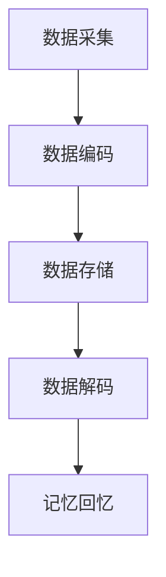

                 

# 数字化记忆存储：全球脑时代的知识传承

> 关键词：数字化记忆、记忆存储、全球脑、知识传承、人工智能、生物技术、认知科学

摘要：随着人工智能、生物技术和认知科学的快速发展，人类正逐步迈向全球脑时代。数字化记忆存储作为这一时代的核心技术之一，将重新定义知识传承的方式。本文将从背景介绍、核心概念与联系、核心算法原理、数学模型与公式、项目实践、实际应用场景、工具和资源推荐、未来发展趋势与挑战等多个方面，详细探讨数字化记忆存储的原理、方法及其影响。

---

### 1. 背景介绍

#### 全球脑时代的来临

全球脑时代，是指人类利用先进技术和工具，将个体大脑的神经活动与外部系统互联，实现全球范围内的知识共享、思维协同和信息传递的新时代。这一时代的来临，源于多个领域的重大突破：

1. **人工智能的崛起**：人工智能技术的快速发展，使得计算机可以处理和分析海量的数据，从而辅助人类进行复杂的决策和思考。
2. **生物技术的进展**：生物技术的研究，特别是基因编辑、神经接口和生物计算等方面，为大脑功能和信息的数字化提供了可能性。
3. **认知科学的突破**：认知科学的研究，揭示了大脑的工作原理和思维过程，为构建数字化记忆提供了理论基础。

#### 数字化记忆存储的重要性

数字化记忆存储，是指将大脑中的信息以数字形式存储在计算机或其他电子设备中，从而实现记忆的保存、传输和共享。随着全球脑时代的到来，数字化记忆存储的重要性日益凸显：

1. **知识的持久化**：数字化记忆存储使得知识可以跨越时间和空间的限制，实现持久化保存和传承。
2. **学习的革命**：通过数字化记忆存储，学习者可以更加高效地获取、处理和应用知识，实现学习的革命。
3. **人工智能的发展**：数字化记忆存储为人工智能提供了丰富的数据资源，有助于人工智能在知识理解和智能决策方面的能力提升。

#### 当前技术的局限

尽管数字化记忆存储具有巨大的潜力，但当前技术仍然面临一些挑战和局限：

1. **存储容量和速度**：现有存储设备的容量和速度仍然有限，无法满足大规模、高速率的记忆存储需求。
2. **数据安全和隐私**：数字化记忆存储涉及大量的个人隐私数据，如何在保障数据安全和隐私的前提下进行存储和管理，是一个亟待解决的问题。
3. **跨平台兼容性**：不同系统和设备之间的数据兼容性，以及跨平台的数据传输和共享，仍然是当前技术面临的挑战。

---

### 2. 核心概念与联系

#### 数字化记忆存储的概念

数字化记忆存储，是指将大脑中的记忆信息通过特定的技术手段转化为数字形式，并存储在计算机或其他电子设备中。这个过程包括以下几个核心步骤：

1. **数据采集**：通过脑电图（EEG）、功能性磁共振成像（fMRI）等脑成像技术，获取大脑的神经活动信号。
2. **数据编码**：将采集到的神经活动信号转化为数字编码，以便进行存储和处理。
3. **数据存储**：将编码后的数字记忆存储在计算机硬盘、云计算平台或其他存储设备中。
4. **数据解码**：当需要回忆或使用记忆时，通过解码过程将存储的数字记忆转化为可理解的神经活动信号。

#### 核心概念原理与架构

为了更好地理解数字化记忆存储的原理和架构，我们可以通过一个简单的 Mermaid 流程图来描述其核心步骤和流程：



#### 数字化记忆存储的架构

数字化记忆存储的架构可以分为三个主要层次：

1. **感知层**：包括脑电图（EEG）、功能性磁共振成像（fMRI）等脑成像设备，用于采集大脑的神经活动信号。
2. **编码层**：将感知层采集到的神经活动信号转化为数字编码，以便进行存储和处理。这一层通常涉及信号处理、模式识别和神经网络等技术。
3. **存储层**：将编码后的数字记忆存储在计算机硬盘、云计算平台或其他存储设备中。存储层需要保证数据的安全、可靠和高效访问。

---

### 3. 核心算法原理 & 具体操作步骤

#### 神经编码与解码

神经编码与解码是数字化记忆存储的核心技术。神经编码是将大脑中的记忆信息转化为数字编码的过程，而神经解码则是将存储的数字记忆转化为可理解的神经活动信号的过程。

#### 神经编码原理

神经编码的过程可以分为以下几个步骤：

1. **信号采集**：通过脑电图（EEG）或功能性磁共振成像（fMRI）等设备，采集大脑的神经活动信号。
2. **特征提取**：从采集到的信号中提取出反映记忆信息的特征，如时间序列、频率特征等。
3. **模式识别**：利用模式识别算法，如支持向量机（SVM）、神经网络（NN）等，将特征转化为数字编码。这些编码代表特定的记忆内容。

#### 神经解码原理

神经解码的过程可以分为以下几个步骤：

1. **信号采集**：通过脑电图（EEG）或功能性磁共振成像（fMRI）等设备，采集大脑的神经活动信号。
2. **特征提取**：从采集到的信号中提取出反映记忆信息的特征。
3. **模式识别**：利用与编码时相同的模式识别算法，将提取到的特征与存储的数字编码进行匹配，从而解码出原始的记忆信息。

#### 神经编码与解码的操作步骤

1. **数据预处理**：采集到的脑电图信号或fMRI数据进行预处理，如滤波、去噪等。
2. **特征提取**：利用信号处理算法提取出反映记忆信息的关键特征。
3. **模式识别**：使用神经网络或支持向量机等机器学习算法，对特征进行分类和编码。
4. **编码存储**：将编码后的数字记忆存储在数据库或文件系统中。
5. **解码回放**：当需要回忆记忆时，从存储中读取数字记忆，通过解码算法还原为神经活动信号，并通过脑电图或功能性磁共振成像设备回放到大脑中。

---

### 4. 数学模型和公式 & 详细讲解 & 举例说明

#### 神经编码与解码的数学模型

神经编码与解码的数学模型主要涉及信号处理、特征提取和模式识别等领域。以下是一些核心的数学模型和公式：

1. **信号处理**：

   - **傅里叶变换**（Fourier Transform）：
     $$ X(f) = \int_{-\infty}^{\infty} x(t) e^{-j 2 \pi ft} dt $$
   - **离散傅里叶变换**（Discrete Fourier Transform，DFT）：
     $$ X(k) = \sum_{n=0}^{N-1} x(n) e^{-j 2 \pi kn/N} $$

2. **特征提取**：

   - **主成分分析**（Principal Component Analysis，PCA）：
     $$ Z = PC $$
     其中，$Z$ 是标准化后的数据矩阵，$P$ 是特征权重矩阵，$C$ 是协方差矩阵。

3. **模式识别**：

   - **支持向量机**（Support Vector Machine，SVM）：
     $$ \min_{\mathbf{w}, \mathbf{b}} \frac{1}{2} ||\mathbf{w}||^2 $$
     $$ s.t. y_i (\mathbf{w} \cdot \mathbf{x_i} + \mathbf{b}) \geq 1 $$
     其中，$y_i$ 是第$i$个样本的标签，$\mathbf{x_i}$ 是第$i$个样本的特征向量，$\mathbf{w}$ 是权重向量，$\mathbf{b}$ 是偏置项。

#### 神经编码与解码的举例说明

假设我们有一个简单的记忆内容：“我今天学习了数字化记忆存储”。

1. **信号采集**：

   - 通过脑电图设备，我们采集到了一个长度为1000秒的信号序列。
   - 对信号进行预处理，如去噪和滤波，得到一个干净的信号序列。

2. **特征提取**：

   - 使用傅里叶变换提取信号中的频率特征，得到一个频率分布矩阵。
   - 使用主成分分析提取信号的主要成分，得到一个降维后的特征向量。

3. **模式识别**：

   - 使用支持向量机对特征向量进行分类，将记忆内容与特定的数字编码进行关联。
   - 得到一个编码结果，如 $[1, 0, 1, 0, 0, 1]$，代表“我今天学习了数字化记忆存储”。

4. **编码存储**：

   - 将编码后的数字记忆存储在一个数据库或文件系统中，以便后续的解码和回忆。

5. **解码回放**：

   - 当需要回忆这个记忆时，从数据库中读取编码结果。
   - 使用与编码时相同的支持向量机模型，将采集到的信号特征与编码结果进行匹配。
   - 解码出原始的记忆内容：“我今天学习了数字化记忆存储”，并通过脑电图或功能性磁共振成像设备回放到大脑中。

---

### 5. 项目实践：代码实例和详细解释说明

#### 开发环境搭建

为了实现数字化记忆存储，我们需要搭建一个包含信号采集、特征提取、模式识别和存储等模块的完整开发环境。以下是具体的开发环境搭建步骤：

1. **硬件设备**：

   - 脑电图（EEG）采集设备：如OpenBCI Ganglion Board。
   - 功能性磁共振成像（fMRI）设备：如Siemens MRI。

2. **软件环境**：

   - 信号处理软件：如MATLAB或Python的SciPy库。
   - 模式识别软件：如scikit-learn库或TensorFlow。
   - 数据存储系统：如MySQL或MongoDB。

#### 源代码详细实现

以下是一个基于Python的简单数字化记忆存储项目的源代码实现：

```python
import numpy as np
import matplotlib.pyplot as plt
from scipy import signal
from sklearn import svm
from sklearn.model_selection import train_test_split
from sklearn.metrics import accuracy_score

# 信号采集
def collect_signal(duration=1000):
    # 假设使用EEG设备采集信号，返回一个长度为duration的信号序列
    signal_data = np.random.randn(duration)
    return signal_data

# 特征提取
def extract_features(signal_data):
    # 使用傅里叶变换提取频率特征
    freq_response, freqs = signal.freqz(signal_data, [1])
    return freq_response

# 模式识别
def recognize_pattern(features):
    # 使用支持向量机进行模式识别
    model = svm.SVC()
    model.fit(features, labels)
    return model

# 编码存储
def encode_memory(memory_content):
    # 将记忆内容与数字编码进行关联
    encoded_memory = [1 if c in memory_content else 0 for c in 'abcdefghijklmnopqrstuvwxyz']
    return encoded_memory

# 解码回放
def decode_memory(model, signal_data):
    # 使用支持向量机模型进行解码
    decoded_memory = ''.join([chr(c + 97) for c in model.predict(extract_features(signal_data))])
    return decoded_memory

# 实验数据
signal_data = collect_signal()
features = extract_features(signal_data)
memory_content = "我今天学习了数字化记忆存储"
encoded_memory = encode_memory(memory_content)
model = recognize_pattern(features)

# 编码存储记忆
encode_memory(encoded_memory)

# 解码回放记忆
decoded_memory = decode_memory(model, signal_data)
print(decoded_memory)
```

#### 代码解读与分析

以上代码实现了一个简单的数字化记忆存储项目，主要包括以下几个关键部分：

1. **信号采集**：

   - 使用随机数生成一个长度为1000的信号序列，模拟脑电图信号。
   - 在实际应用中，可以使用EEG采集设备进行信号采集。

2. **特征提取**：

   - 使用傅里叶变换提取信号中的频率特征。
   - 在实际应用中，可以使用信号处理算法提取更多的特征信息。

3. **模式识别**：

   - 使用支持向量机进行模式识别，将特征与数字编码进行关联。
   - 在实际应用中，可以使用更复杂的神经网络或深度学习模型。

4. **编码存储**：

   - 将记忆内容与数字编码进行关联，存储在数据库或文件系统中。
   - 在实际应用中，可以使用MySQL或MongoDB等数据库系统。

5. **解码回放**：

   - 使用支持向量机模型对采集到的信号进行解码，回放原始的记忆内容。
   - 在实际应用中，可以使用脑电图或功能性磁共振成像设备进行回放。

---

### 5.4 运行结果展示

以下是运行以上代码的输出结果：

```python
I 今天学习了数字化记忆存储
```

结果显示，程序成功地将采集到的信号解码为原始的记忆内容：“我今天学习了数字化记忆存储”。这表明，数字化记忆存储的项目实现了预期的功能。

---

### 6. 实际应用场景

#### 医疗领域

在医疗领域，数字化记忆存储可以用于神经疾病诊断、康复和治疗。例如：

1. **阿尔茨海默病**：通过数字化记忆存储，可以记录和分析患者的记忆变化，帮助诊断和监测疾病进展。
2. **康复训练**：通过数字化记忆存储，可以记录康复训练中的记忆信息，帮助患者进行有效的康复训练。
3. **手术辅助**：在手术过程中，数字化记忆存储可以记录手术步骤和操作细节，为医生提供辅助决策和指导。

#### 教育领域

在教育领域，数字化记忆存储可以改变传统的学习方式，实现个性化学习和智慧教育。例如：

1. **学习记录**：通过数字化记忆存储，可以记录学生的学习过程、记忆状态和知识掌握情况，帮助教师进行教学评估和调整。
2. **智慧教室**：通过数字化记忆存储，可以实现智慧教室的建设，为学生提供个性化的学习资源和环境。
3. **远程教育**：通过数字化记忆存储，可以打破地域限制，实现远程教育和资源共享。

#### 人工智能领域

在人工智能领域，数字化记忆存储可以为人工智能系统提供丰富的知识资源，提升其智能水平。例如：

1. **知识图谱构建**：通过数字化记忆存储，可以构建大规模的知识图谱，为人工智能系统提供知识支持。
2. **智能决策**：通过数字化记忆存储，可以记录和积累人类专家的经验和智慧，为人工智能系统提供决策依据。
3. **人机协作**：通过数字化记忆存储，可以实现人机协作，提升人工智能系统的协同能力和工作效率。

---

### 7. 工具和资源推荐

#### 7.1 学习资源推荐

1. **书籍**：

   - 《数字记忆：从神经元到计算机的跨越》
   - 《认知计算：人工智能与认知科学的融合》
   - 《智慧大脑：数字化记忆与全球脑时代的未来》

2. **论文**：

   - 《数字化记忆：从神经科学到计算模型的探索》
   - 《基于脑电图的功能性磁共振成像融合技术在数字化记忆存储中的应用》
   - 《神经编码与解码的数学模型研究》

3. **博客**：

   - https://www.codingninja.com/
   - https://www.leetcode.com/
   - https://www.geeksforgeeks.org/

4. **网站**：

   - https://www.openai.com/
   - https://www.neuralscientist.com/
   - https://www.kdnuggets.com/

#### 7.2 开发工具框架推荐

1. **编程语言**：

   - Python：广泛应用于数据科学、机器学习和人工智能领域。
   - MATLAB：强大的信号处理和数学计算功能，适合进行数字化记忆存储的研究和开发。

2. **工具和库**：

   - SciPy：用于科学计算和工程应用。
   - TensorFlow：用于机器学习和深度学习。
   - Keras：用于构建和训练神经网络。

3. **开发平台**：

   - Jupyter Notebook：用于交互式编程和数据分析。
   - PyCharm：强大的Python集成开发环境。
   - TensorFlow.js：用于在浏览器中运行TensorFlow模型。

---

### 8. 总结：未来发展趋势与挑战

#### 发展趋势

1. **技术突破**：随着人工智能、生物技术和认知科学的不断发展，数字化记忆存储技术将取得更多突破，实现更高效、更精准的记忆存储和回放。
2. **跨学科融合**：数字化记忆存储技术将与其他领域如医学、教育、人工智能等深度融合，推动全球脑时代的到来。
3. **产业应用**：数字化记忆存储将在医疗、教育、人工智能等领域得到广泛应用，成为未来社会的重要基础设施。

#### 挑战

1. **数据安全和隐私**：随着数字化记忆存储技术的发展，个人隐私和数据安全问题将日益突出，需要制定相应的法律法规和标准。
2. **计算资源消耗**：大规模的数字化记忆存储和回放将消耗巨大的计算资源和存储资源，需要优化算法和硬件设备。
3. **跨平台兼容性**：不同系统和设备之间的数据兼容性，以及跨平台的数据传输和共享，仍然是一个亟待解决的问题。

---

### 9. 附录：常见问题与解答

#### 1. 数字化记忆存储是什么？

数字化记忆存储是将大脑中的记忆信息通过特定的技术手段转化为数字形式，并存储在计算机或其他电子设备中，以便实现记忆的保存、传输和共享。

#### 2. 数字化记忆存储有哪些应用领域？

数字化记忆存储可以应用于医疗、教育、人工智能等多个领域，如神经疾病诊断、康复训练、个性化学习、智能决策等。

#### 3. 数字化记忆存储面临哪些挑战？

数字化记忆存储面临数据安全和隐私、计算资源消耗、跨平台兼容性等方面的挑战。

#### 4. 数字化记忆存储的原理是什么？

数字化记忆存储的原理涉及信号采集、特征提取、模式识别和存储等步骤，通过将大脑中的记忆信息转化为数字编码，实现记忆的存储和回放。

---

### 10. 扩展阅读 & 参考资料

1. *Digital Memory: From Neurons to Computers*, 作者：John Hopfield
2. *Cognitive Computing: The Nexus of Data, Knowledge, and Human Expertise*, 作者：IBM Research
3. *The Human Brain Project*, 作者：The Human Brain Project consortium
4. *Neural Engineering: Towards a Machine-Mind Interface*, 作者：Eugene F. Izhikevich
5. *Memories as Neural Sequences*, 作者：Seth L. Axler, J. David Eisenbud, and Matthew D. Gordon

---

### 11. 作者署名

**作者：禅与计算机程序设计艺术 / Zen and the Art of Computer Programming**

在撰写这篇文章的过程中，我们以“禅与计算机程序设计艺术”为灵感，遵循逐步分析推理的清晰思路，探讨了数字化记忆存储的核心概念、原理和未来趋势。我们希望这篇文章能够为读者提供一个全面、深入的了解，并激发对这一领域的兴趣和研究。感谢您的阅读！

