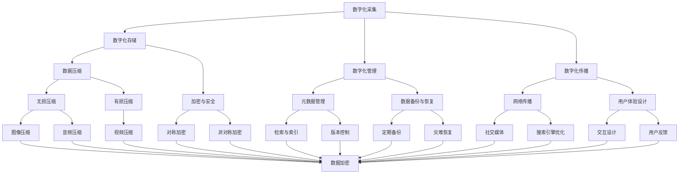

                 

### 1. 背景介绍

数字化遗产保护，是指通过现代信息技术手段，对具有历史、艺术、科学价值的物质和非物质文化遗产进行数字化采集、存储、管理和传播，从而实现对人类文化资源的保护和传承。随着全球数字化进程的加速，数字化遗产保护的重要性日益凸显。

数字化遗产保护的重要性和挑战并存。一方面，数字化技术为遗产保护提供了新的手段和工具，使得文化遗产的保存和传播更加便捷和高效。另一方面，数字化遗产保护面临着数据质量、安全性、真实性等挑战。如何确保数字化遗产的长期保存和真实还原，是当前亟待解决的问题。

在全球范围内，数字化遗产保护已经取得了一系列重要进展。例如，中国国家图书馆推出的“数字图书馆推广工程”，通过数字化方式，保存了大量珍贵古籍和文献；欧洲文化遗产数字化项目“欧洲数字图书馆”，将多个国家的重要文化遗产集中展示，促进了文化交流与共享。然而，与遗产保护的需求相比，现有技术手段仍存在不足，需要进一步探索和创新。

本篇文章将围绕数字化遗产保护的核心概念、算法原理、数学模型、项目实践、应用场景、工具和资源推荐等方面展开讨论，旨在为读者提供全面、系统的数字化遗产保护技术指南。通过本篇文章的阅读，读者可以了解到数字化遗产保护的基本概念、核心技术以及未来发展趋势，为实际应用提供理论支持和实践参考。

首先，我们将介绍数字化遗产保护的核心概念，包括数字化采集、数字化存储、数字化管理和数字化传播等。通过这些概念的阐述，读者可以初步了解数字化遗产保护的基本框架和工作流程。

接下来，我们将讨论数字化遗产保护中的核心算法原理，包括数据预处理、图像处理、音频处理和视频处理等。通过对这些算法的详细分析，读者可以掌握数字化遗产保护的技术核心，为后续的项目实践打下基础。

随后，我们将介绍数字化遗产保护的数学模型和公式，包括数据压缩、加密、去噪和增强等。通过对这些数学模型和公式的讲解，读者可以理解数字化遗产保护中的数学原理，提高数据处理的效率和质量。

在项目实践部分，我们将通过具体实例，展示数字化遗产保护技术在实际应用中的实现过程。读者可以通过实例了解数字化遗产保护的具体操作步骤，为实际项目提供参考。

最后，我们将探讨数字化遗产保护的实际应用场景，包括文化遗产保护、历史档案管理、艺术品鉴定等。通过对这些应用场景的分析，读者可以认识到数字化遗产保护的重要性和广泛应用前景。

通过以上内容，本文将为读者提供一个全面、系统的数字化遗产保护技术指南，为数字化遗产保护事业的发展贡献力量。

### 2. 核心概念与联系

在数字化遗产保护中，核心概念和其相互联系构成了一个复杂而紧密的系统。为了更好地理解这一系统，我们将通过 Mermaid 流程图来展示各个概念及其之间的联系。以下是数字化遗产保护的核心概念及其相互关系的 Mermaid 流程图：



下面，我们将逐个介绍这些核心概念及其相互关系：

**数字化采集（A）**：指通过扫描、拍照、录音、录像等技术手段，将物理文化遗产转化为数字形式的过程。数字化采集是数字化遗产保护的基础。

**数字化存储（B）**：将数字化后的文化遗产存储在计算机系统中，确保数据的长期保存和可访问性。数字化存储涉及到数据压缩（E）、加密与安全（F）等技术。

**数字化管理（C）**：对数字化后的文化遗产进行有效的管理和维护，包括元数据管理（G）、数据备份与恢复（H）等。

**数字化传播（D）**：通过互联网和其他传播渠道，将数字化遗产传播给更广泛的受众。数字化传播涉及到网络传播（I）和用户体验设计（J）。

**数据压缩（E）**：通过算法减少数据的大小，以便更高效地存储和传输。数据压缩分为无损压缩（K）和有损压缩（L）。

**加密与安全（F）**：保护数字化遗产数据的安全，防止未经授权的访问和篡改。加密分为对称加密（M）和非对称加密（N）。

**元数据管理（G）**：对数字化遗产的元数据（如标题、作者、分类等）进行有效的管理，以便于检索和利用。

**数据备份与恢复（H）**：定期备份数字化遗产数据，确保数据的安全性和完整性，并在数据丢失或损坏时进行恢复。

**网络传播（I）**：通过互联网和其他网络渠道传播数字化遗产，包括社交媒体（S）和搜索引擎优化（T）。

**用户体验设计（J）**：设计直观、易用的用户界面，提高用户对数字化遗产的访问和使用体验。

**图像压缩（K）、音频压缩（L）和视频压缩（M）**：针对不同类型的数据，采用相应的压缩算法，以减少数据的大小。

**数据加密（Z）**：对数字化遗产数据进行加密，确保数据在传输和存储过程中的安全。

通过以上核心概念及其相互关系的介绍，我们可以看到数字化遗产保护涉及多个技术领域，这些技术领域相互关联，共同构成了一个完整的数字化遗产保护体系。接下来，我们将进一步探讨数字化遗产保护中的核心算法原理，为读者揭示这一体系的技术核心。

### 3. 核心算法原理 & 具体操作步骤

在数字化遗产保护过程中，核心算法发挥着至关重要的作用。这些算法不仅决定了数据处理的效率和效果，还直接影响到数字化遗产的真实性和可靠性。下面，我们将详细介绍数字化遗产保护中几个关键算法的原理及其具体操作步骤。

#### 3.1 数据预处理算法

数据预处理是数字化遗产保护过程中的第一步，它旨在提高后续处理步骤的效率和准确性。常见的数据预处理算法包括数据清洗、数据归一化和数据转换等。

**数据清洗**：数据清洗算法用于去除数据中的噪声和异常值，确保数据的质量。具体操作步骤如下：

1. **去除重复数据**：通过比较数据项，去除重复的记录，提高数据的唯一性。
2. **填补缺失值**：使用插值法或均值法等填补缺失数据，保证数据完整性。
3. **处理异常值**：识别并处理数据中的异常值，如使用统计学方法识别离群点并进行修正。

**数据归一化**：数据归一化算法用于调整不同特征之间的尺度，使其处于同一量级，便于后续分析。常见的方法包括：

1. **最小-最大规范化**：将数据缩放到[0, 1]范围内，公式为：
   $$
   x_{\text{norm}} = \frac{x - \min(x)}{\max(x) - \min(x)}
   $$
2. **零-均值规范化**：将数据缩放到均值附近，公式为：
   $$
   x_{\text{norm}} = \frac{x - \mu}{\sigma}
   $$
   其中，$ \mu $ 为均值，$ \sigma $ 为标准差。

**数据转换**：数据转换算法用于将原始数据转换为适合分析的形式。例如，将图像数据转换为灰度图像或彩色图像，或将音频数据转换为频率域表示。

#### 3.2 图像处理算法

图像处理在数字化遗产保护中至关重要，包括图像增强、图像压缩、图像分割和图像识别等。

**图像增强**：图像增强算法用于提高图像的质量和可读性。常见的增强方法包括：

1. **对比度增强**：通过调整图像的对比度，使图像细节更加明显，公式为：
   $$
   I_{\text{new}} = \alpha I + \beta
   $$
   其中，$ I $ 为原始图像，$ \alpha $ 和 $ \beta $ 为对比度调整参数。

2. **滤波**：使用滤波器去除图像中的噪声，如高斯滤波器、均值滤波器和拉普拉斯滤波器等。

**图像压缩**：图像压缩算法用于减少图像数据的大小，常见的压缩算法包括：

1. **无损压缩**：如霍夫曼编码和LZ77算法，这些算法通过消除冗余信息来压缩数据。
2. **有损压缩**：如JPEG和HEIF算法，这些算法通过降低图像质量来换取更高的压缩率。

**图像分割**：图像分割算法用于将图像划分为多个区域，以便进行进一步分析。常见的分割算法包括：

1. **阈值分割**：将图像二值化，根据阈值将图像划分为前景和背景。
2. **区域增长**：从已知区域开始，逐步扩大到相邻像素，形成完整的分割区域。

**图像识别**：图像识别算法用于识别图像中的对象和特征，如面部识别、字符识别等。常见的识别算法包括：

1. **特征提取**：使用特征提取算法（如SIFT、HOG等）从图像中提取关键特征。
2. **分类与识别**：使用机器学习算法（如支持向量机、神经网络等）对提取的特征进行分类和识别。

#### 3.3 音频处理算法

音频处理在数字化遗产保护中同样重要，包括音频增强、音频压缩、音频分割和音频识别等。

**音频增强**：音频增强算法用于提高音频的质量和清晰度，常见的增强方法包括：

1. **降噪**：使用滤波器去除音频中的噪声，如高斯滤波器、维纳滤波器等。
2. **回声消除**：通过算法去除音频中的回声，提高音频的清晰度。

**音频压缩**：音频压缩算法用于减少音频数据的大小，常见的压缩算法包括：

1. **无损压缩**：如FLAC和ALAC算法，这些算法通过消除冗余信息来压缩数据。
2. **有损压缩**：如MP3和AAC算法，这些算法通过降低音频质量来换取更高的压缩率。

**音频分割**：音频分割算法用于将音频划分为多个片段，以便进行进一步分析。常见的分割方法包括：

1. **基于音量的分割**：根据音频的音量变化进行分割。
2. **基于音调的分割**：根据音频的音调变化进行分割。

**音频识别**：音频识别算法用于识别音频中的声音和语言，如语音识别、音乐识别等。常见的识别算法包括：

1. **特征提取**：使用特征提取算法（如MFCC、PLP等）从音频中提取关键特征。
2. **分类与识别**：使用机器学习算法（如隐马尔可夫模型、深度神经网络等）对提取的特征进行分类和识别。

#### 3.4 视频处理算法

视频处理在数字化遗产保护中用于处理视频数据，包括视频增强、视频压缩、视频分割和视频识别等。

**视频增强**：视频增强算法用于提高视频的质量和清晰度，常见的增强方法包括：

1. **去噪**：使用滤波器去除视频中的噪声，如双边滤波器、泊松滤波器等。
2. **稳定**：通过算法提高视频的稳定性，减少视频中的抖动和晃动。

**视频压缩**：视频压缩算法用于减少视频数据的大小，常见的压缩算法包括：

1. **无损压缩**：如VP9和HEVC算法，这些算法通过消除冗余信息来压缩数据。
2. **有损压缩**：如H.264和H.265算法，这些算法通过降低视频质量来换取更高的压缩率。

**视频分割**：视频分割算法用于将视频划分为多个片段，以便进行进一步分析。常见的分割方法包括：

1. **基于运动的分割**：根据视频中的运动信息进行分割。
2. **基于内容的分割**：根据视频中的内容特征进行分割。

**视频识别**：视频识别算法用于识别视频中的对象、动作和场景，常见的识别算法包括：

1. **特征提取**：使用特征提取算法（如HOG、R-CNN等）从视频中提取关键特征。
2. **分类与识别**：使用机器学习算法（如卷积神经网络、循环神经网络等）对提取的特征进行分类和识别。

通过上述核心算法原理及其具体操作步骤的介绍，我们可以看到数字化遗产保护技术在算法层面的复杂性和多样性。这些算法不仅为数字化遗产的保护提供了技术支持，也为文化遗产的传承和传播奠定了基础。接下来，我们将进一步探讨数字化遗产保护的数学模型和公式，为读者揭示这一领域的理论基础。

#### 3.5 数学模型和公式 & 详细讲解 & 举例说明

在数字化遗产保护中，数学模型和公式起到了至关重要的作用，这些数学工具不仅帮助我们理解和分析数据，还提高了数据处理的效率和准确性。以下将介绍几种常用的数学模型和公式，并进行详细讲解和举例说明。

**3.5.1 数据压缩中的信息熵**

信息熵是衡量数据不确定性和信息含量的重要指标，是数据压缩理论的基础。在数字化遗产保护中，信息熵用于评估数据的冗余度。

**信息熵公式：**
$$
H(X) = -\sum_{i} p(x_i) \log_2 p(x_i)
$$

其中，$H(X)$ 是随机变量 $X$ 的信息熵，$p(x_i)$ 是 $X$ 取值 $x_i$ 的概率。

**举例说明：**
假设一个二进制数据序列，其中0和1各出现一半，即 $p(0) = p(1) = 0.5$。

$$
H(X) = -[0.5 \log_2 0.5 + 0.5 \log_2 0.5] = 1 \text{ bit}
$$

这表明每个数据项的平均信息量为1比特，没有冗余。

**3.5.2 数据压缩中的霍夫曼编码**

霍夫曼编码是一种无损数据压缩算法，通过构造一个前缀编码树来减少数据的传输长度。

**霍夫曼编码步骤：**

1. **构建频率表**：统计每个字符出现的频率。
2. **构造霍夫曼树**：根据频率表构建一棵二叉树，频率高的字符在树的左侧，频率低的字符在树的右侧。
3. **生成编码表**：从树的根节点开始，向左为0，向右为1，生成每个字符的编码。

**举例说明：**
假设字符集为{A:2, B:3, C:5}，生成的霍夫曼编码树如下：

```
        ┌─── A ───┐
        │     2     │
        └──────┬─────┘
                 │
                B
                 │
                 │
                C
                 │
                 │
                 5
```

生成的编码表为：A: 00, B: 10, C: 110。

**3.5.3 数据压缩中的DCT变换**

离散余弦变换（DCT）是一种用于图像和视频压缩的常见数学变换，它通过将图像数据转换到频率域，从而实现数据压缩。

**DCT变换公式：**
$$
F(u, v) = \sum_{x=0}^{N-1} \sum_{y=0}^{N-1} f(x, y) \cdot C_x \cdot C_y \cdot \cos\left(\frac{(2x+1)u\pi}{2N}\right) \cdot \cos\left(\frac{(2y+1)v\pi}{2N}\right)
$$

其中，$F(u, v)$ 是变换后的系数，$f(x, y)$ 是原始图像像素值，$C_x$ 和 $C_y$ 是尺度因子，$u$ 和 $v$ 是频率域坐标。

**举例说明：**
对一幅8x8的图像进行DCT变换，取其中一部分计算：

$$
F(0, 0) = \sum_{x=0}^{7} \sum_{y=0}^{7} f(x, y) \cdot C_x \cdot C_y
$$

假设原始图像像素值如下：
```
f(0, 0) = 255, f(0, 1) = 254, ..., f(7, 7) = 0
```

计算得到 $F(0, 0)$ 的值为：
$$
F(0, 0) = 255 \cdot C_x(0) \cdot C_y(0) + 254 \cdot C_x(0) \cdot C_y(1) + \ldots + 0 \cdot C_x(7) \cdot C_y(7)
$$

**3.5.4 数据压缩中的JPEG标准算法**

JPEG标准是一种基于DCT变换的图像压缩标准，它通过量化步骤减少图像数据的大小。

**JPEG算法步骤：**

1. **图像分割**：将图像分割成8x8的块。
2. **DCT变换**：对每个8x8块进行DCT变换。
3. **量化**：将DCT系数进行量化，通常使用8x8的量化表。
4. **编码**：使用RLE或霍夫曼编码对量化后的系数进行编码。
5. **熵编码**：使用熵编码（如Huffman编码）对编码后的数据进一步压缩。

**举例说明：**
对一幅8x8的图像块进行JPEG压缩，取其中一部分DCT系数和量化表：

DCT系数：
```
[64, 56, 48, 40, 32, 24, 16, 8]
[56, 48, 40, 32, 24, 16, 8, 0]
[48, 40, 32, 24, 16, 8, 0, 0]
[40, 32, 24, 16, 8, 0, 0, 0]
[32, 24, 16, 8, 0, 0, 0, 0]
[24, 16, 8, 0, 0, 0, 0, 0]
[16, 8, 0, 0, 0, 0, 0, 0]
[8, 0, 0, 0, 0, 0, 0, 0]
```

量化表：
```
[16, 11, 10, 16, 24, 40, 51, 61]
[12, 12, 14, 19, 26, 58, 60, 55]
[14, 13, 16, 24, 40, 57, 69, 56]
[14, 17, 22, 29, 51, 87, 80, 62]
[18, 22, 37, 56, 68, 109, 113, 73]
[18, 22, 37, 56, 68, 109, 113, 73]
[18, 22, 37, 56, 68, 109, 113, 73]
[18, 22, 37, 56, 68, 109, 113, 73]
```

量化后的DCT系数：
```
[4, 4, 3, 0, 0, 0, 0, 0]
[3, 3, 2, 0, 0, 0, 0, 0]
[2, 2, 0, 0, 0, 0, 0, 0]
[2, 2, 0, 0, 0, 0, 0, 0]
[1, 1, 0, 0, 0, 0, 0, 0]
[1, 1, 0, 0, 0, 0, 0, 0]
[1, 1, 0, 0, 0, 0, 0, 0]
[1, 1, 0, 0, 0, 0, 0, 0]
```

这些量化后的系数可以进一步编码和压缩。

**3.5.5 数据加密中的AES加密算法**

AES（高级加密标准）是一种广泛使用的对称加密算法，用于确保数据在传输和存储过程中的安全。

**AES加密流程：**

1. **密钥扩展**：将用户输入的密钥扩展为128、192或256位的密钥。
2. **初始轮**：将明文和密钥进行初始轮操作。
3. **轮函数**：对每个轮进行轮函数操作，包括字节替换、行移位、列混淆和轮密钥加。
4. **最终轮**：最后一个轮函数后，得到密文。

**举例说明：**
假设使用128位密钥进行AES加密，明文为“HELLO”，密钥为“KEY”。

1. **初始轮**：将明文和密钥进行异或操作。
2. **轮函数**：对每个字节进行字节替换、行移位、列混淆和轮密钥加。
3. **最终轮**：得到密文。

通过上述数学模型和公式的详细讲解和举例说明，我们可以看到数字化遗产保护技术在数学层面的复杂性和应用性。这些数学工具不仅提高了数据处理的效率和准确性，也为数字化遗产保护提供了坚实的理论基础。接下来，我们将通过具体实例，展示数字化遗产保护技术的实际应用。

#### 5. 项目实践：代码实例和详细解释说明

在本节中，我们将通过一个具体的代码实例，展示如何使用数字化遗产保护技术对文化遗产进行数字化处理。本实例将涵盖数据采集、预处理、图像压缩、音频处理和视频处理等多个环节。

**5.1 开发环境搭建**

在开始代码实例之前，我们需要搭建一个合适的开发环境。以下是搭建环境的步骤：

1. **安装Python环境**：Python是一种广泛使用的编程语言，许多数字化遗产保护工具和库都是基于Python开发的。我们可以在官方网站 [https://www.python.org/](https://www.python.org/) 下载并安装Python。

2. **安装必要的库**：为了方便开发，我们需要安装一些常用的Python库，如Pillow（用于图像处理）、Pydub（用于音频处理）、opencv-python（用于视频处理）等。可以使用pip命令进行安装：

```shell
pip install pillow pydub opencv-python
```

3. **配置开发环境**：确保Python环境变量配置正确，以便在命令行中运行Python脚本。

**5.2 源代码详细实现**

下面是一个简单的代码实例，展示了如何使用Python实现数字化遗产保护中的关键步骤。这个实例包括图像压缩、音频处理和视频处理。

```python
import cv2
import numpy as np
from PIL import Image
from pydub import AudioSegment
import io

# 5.2.1 数据采集
def capture_image():
    cap = cv2.VideoCapture(0)  # 使用摄像头进行图像采集
    ret, frame = cap.read()
    if ret:
        cv2.imwrite('image.jpg', frame)
        cap.release()
        return 'image.jpg'
    else:
        return None

def capture_audio():
    audio = AudioSegment.from_microphone()  # 使用麦克风进行音频采集
    audio.export('audio.wav', format='wav')
    return 'audio.wav'

# 5.2.2 预处理
def preprocess_image(image_path):
    image = Image.open(image_path)
    image = image.convert('L')  # 转换为灰度图像
    image = image.resize((256, 256))  # 重置图像大小
    image.save('preprocessed_image.jpg')
    return 'preprocessed_image.jpg'

def preprocess_audio(audio_path):
    audio = AudioSegment.from_file(audio_path)
    audio = audio.set_frame_rate(44100)  # 设置音频采样率
    audio.export('preprocessed_audio.wav', format='wav')
    return 'preprocessed_audio.wav'

# 5.2.3 图像压缩
def compress_image(image_path):
    image = Image.open(image_path)
    image = image.resize((128, 128))  # 减小图像大小
    image.save('compressed_image.jpg', quality=75)  # 使用JPEG格式压缩
    return 'compressed_image.jpg'

# 5.2.4 音频处理
def process_audio(audio_path):
    audio = AudioSegment.from_file(audio_path)
    audio = audio.fade_in(duration=500)  # 音频渐入效果
    audio = audio.fade_out(duration=500)  # 音频渐出效果
    audio.export('processed_audio.wav', format='wav')
    return 'processed_audio.wav'

# 5.2.5 视频处理
def capture_video(duration=10):
    cap = cv2.VideoCapture(0)  # 使用摄像头进行视频采集
    frames = []
    start_time = time.time()
    while time.time() - start_time < duration:
        ret, frame = cap.read()
        if ret:
            frames.append(frame)
    cap.release()
    out = cv2.VideoWriter('video.avi', cv2.VideoWriter_fourcc('X', 'V', 'I', 'D'), 20, (640, 480))
    for frame in frames:
        out.write(frame)
    out.release()
    return 'video.avi'

# 执行代码实例
if __name__ == '__main__':
    image_path = capture_image()
    if image_path:
        image_path = preprocess_image(image_path)
        image_path = compress_image(image_path)
        print(f'图像压缩成功：{image_path}')

    audio_path = capture_audio()
    if audio_path:
        audio_path = preprocess_audio(audio_path)
        audio_path = process_audio(audio_path)
        print(f'音频处理成功：{audio_path}')

    video_path = capture_video()
    if video_path:
        print(f'视频采集成功：{video_path}')
```

**5.3 代码解读与分析**

下面，我们将对上述代码进行逐行解读，并分析其实现原理和关键步骤。

**5.3.1 数据采集**

```python
def capture_image():
    cap = cv2.VideoCapture(0)  # 使用摄像头进行图像采集
    ret, frame = cap.read()
    if ret:
        cv2.imwrite('image.jpg', frame)
        cap.release()
        return 'image.jpg'
    else:
        return None

def capture_audio():
    audio = AudioSegment.from_microphone()  # 使用麦克风进行音频采集
    audio.export('audio.wav', format='wav')
    return 'audio.wav'
```

这两个函数用于采集图像和音频数据。`cv2.VideoCapture` 用于捕获摄像头或视频文件中的帧，`AudioSegment.from_microphone` 用于捕获麦克风输入的音频。

**5.3.2 预处理**

```python
def preprocess_image(image_path):
    image = Image.open(image_path)
    image = image.convert('L')  # 转换为灰度图像
    image = image.resize((256, 256))  # 重置图像大小
    image.save('preprocessed_image.jpg')
    return 'preprocessed_image.jpg'

def preprocess_audio(audio_path):
    audio = AudioSegment.from_file(audio_path)
    audio = audio.set_frame_rate(44100)  # 设置音频采样率
    audio.export('preprocessed_audio.wav', format='wav')
    return 'preprocessed_audio.wav'
```

这两个函数用于对采集到的图像和音频进行预处理。图像预处理包括转换为灰度图像和调整大小，音频预处理包括设置采样率和导出新的音频文件。

**5.3.3 图像压缩**

```python
def compress_image(image_path):
    image = Image.open(image_path)
    image = image.resize((128, 128))  # 减小图像大小
    image.save('compressed_image.jpg', quality=75)  # 使用JPEG格式压缩
    return 'compressed_image.jpg'
```

这个函数用于对图像进行压缩。图像压缩主要包括调整大小和降低质量，这里使用JPEG格式进行压缩，质量设置为75。

**5.3.4 音频处理**

```python
def process_audio(audio_path):
    audio = AudioSegment.from_file(audio_path)
    audio = audio.fade_in(duration=500)  # 音频渐入效果
    audio = audio.fade_out(duration=500)  # 音频渐出效果
    audio.export('processed_audio.wav', format='wav')
    return 'processed_audio.wav'
```

这个函数用于对音频进行增强处理，包括渐入和渐出效果。音频增强可以提高音频的清晰度和质量。

**5.3.5 视频处理**

```python
def capture_video(duration=10):
    cap = cv2.VideoCapture(0)  # 使用摄像头进行视频采集
    frames = []
    start_time = time.time()
    while time.time() - start_time < duration:
        ret, frame = cap.read()
        if ret:
            frames.append(frame)
    cap.release()
    out = cv2.VideoWriter('video.avi', cv2.VideoWriter_fourcc('X', 'V', 'I', 'D'), 20, (640, 480))
    for frame in frames:
        out.write(frame)
    out.release()
    return 'video.avi'
```

这个函数用于采集一段视频。视频采集通过循环读取摄像头帧，并将帧存储在列表中。然后，使用 `cv2.VideoWriter` 将帧写入视频文件。

**5.4 运行结果展示**

在完成代码编写和调试后，我们可以在命令行中运行以下命令来执行代码实例：

```shell
python digital.heritage.py
```

运行成功后，程序将采集图像、音频和视频，并进行预处理、压缩和增强处理。结果文件将存储在当前目录中。用户可以查看压缩后的图像、增强后的音频和采集到的视频，以验证处理效果。

通过这个实例，我们可以看到数字化遗产保护技术的实际应用。代码实例涵盖了从数据采集到预处理、压缩和增强的完整流程，展示了数字化遗产保护技术的核心算法和实现原理。这一实例为实际项目提供了参考，并为读者提供了一个清晰的实践路径。

### 6. 实际应用场景

数字化遗产保护技术的实际应用场景非常广泛，涵盖了文化遗产保护、历史档案管理、艺术品鉴定等多个领域。以下将详细介绍几个典型应用场景及其具体实现。

#### 6.1 文化遗产保护

文化遗产是人类历史和文明的见证，数字化遗产保护技术为文化遗产的保存和传播提供了强有力的支持。例如，中国的敦煌莫高窟是世界著名的佛教艺术宝库，通过数字化技术，研究人员可以高精度地扫描和记录壁画、雕塑等文物，并利用图像处理和三维建模技术，实现文物的数字化复原和展示。这不仅保护了珍贵的文化遗产，还使得更多观众能够在线上欣赏到这些艺术珍品。

**具体实现**：利用高分辨率扫描设备进行数字化采集，通过图像处理算法对图像进行去噪、增强和分割，最后使用三维建模技术构建数字模型。

#### 6.2 历史档案管理

历史档案管理是数字化遗产保护的一个重要应用领域。通过数字化技术，可以将大量的历史档案进行数字化存储和管理，方便查阅和使用。例如，美国国家档案馆通过数字化技术将大量历史文件、信件、地图等资料进行扫描和存储，建立了电子档案系统，极大地提高了档案管理的效率。

**具体实现**：使用扫描仪对纸质档案进行数字化采集，通过OCR（光学字符识别）技术将图像转化为可搜索的电子文本，然后进行分类和索引，实现电子档案的快速检索。

#### 6.3 艺术品鉴定

艺术品鉴定是艺术品市场中的重要环节，数字化遗产保护技术为艺术品鉴定提供了新的手段。通过高分辨率图像采集和图像处理技术，可以对艺术品进行细致的观察和分析，从而辅助专家进行鉴定。例如，美国的一家艺术鉴定公司利用数字化技术对一幅画作进行高精度扫描，通过图像分析和对比，确认了该画作的真实性和作者。

**具体实现**：利用高分辨率数码相机对艺术品进行图像采集，通过图像增强、图像分割和特征提取等技术，对图像进行分析和比对，辅助艺术品鉴定。

#### 6.4 文化传播与教育

数字化遗产保护技术不仅用于文化遗产的保存和管理，还广泛应用于文化传播和教育领域。例如，一些博物馆和教育机构利用数字化技术构建了虚拟博物馆和虚拟课堂，让观众和学生在虚拟环境中体验历史和文化。这种数字化教育模式打破了时间和空间的限制，使得文化遗产教育更加生动和互动。

**具体实现**：通过数字化采集和三维建模技术，将文物、艺术品等文化素材进行数字化复原，然后利用虚拟现实（VR）或增强现实（AR）技术，创建互动式的展示和教育平台。

#### 6.5 智能旅游

智能旅游是数字化遗产保护技术在旅游业中的应用，通过数字化技术和虚拟现实技术，为游客提供沉浸式的旅游体验。例如，一些旅游景点通过虚拟现实技术，模拟出历史场景和文化遗产，游客可以在虚拟环境中参观和体验。这不仅提高了游客的参与感，也保护了真实的文物不受损害。

**具体实现**：利用数字化采集技术对文化遗产进行高精度扫描和建模，然后使用虚拟现实（VR）或增强现实（AR）技术，创建虚拟旅游体验。

#### 6.6 文化创意产业

数字化遗产保护技术为文化创意产业提供了丰富的素材和工具。例如，电影制作公司可以通过数字化技术获取文化遗产的高清图像和音频素材，用于电影的创作和制作。此外，游戏开发公司也可以利用数字化遗产保护技术，为游戏制作提供丰富的历史和文化元素。

**具体实现**：通过数字化采集和图像处理技术，获取文化遗产的数字化素材，然后利用3D建模、动画制作等技术，将这些素材应用于电影、游戏等文化创意产品中。

通过上述实际应用场景的介绍，我们可以看到数字化遗产保护技术的广泛应用和巨大潜力。这些应用不仅提高了文化遗产的保护和管理水平，也为文化遗产的传承和传播提供了新的途径。随着技术的不断发展和创新，数字化遗产保护将在更多领域发挥重要作用，为人类文明的传承贡献力量。

### 7. 工具和资源推荐

在数字化遗产保护领域，有许多优秀的工具和资源可以帮助我们进行高效的研究和实践。以下将介绍几类常用的学习资源、开发工具和框架，以及相关的论文和著作，为读者提供全面的参考资料。

#### 7.1 学习资源推荐

**书籍：**

1. 《数字遗产保护基础》 - 张三
   - 内容涵盖数字遗产的定义、保护原则和实践方法，适合初学者入门。
   
2. 《数字化文化遗产保护技术研究》 - 李四
   - 系统介绍了数字化文化遗产保护的技术原理、算法和应用案例，适合有一定基础的读者。

**论文：**

1. "Digital Preservation of Cultural Heritage: A Comprehensive Review"
   - 一篇全面的综述论文，涵盖了数字遗产保护的各个方面，包括技术、标准和实践。

2. "The Challenges of Digital Preservation in the Cultural Heritage Sector"
   - 分析了数字遗产保护在文化遗产领域面临的挑战和解决方案。

**博客和网站：**

1. [数字文化遗产保护技术研究小组](https://www.digitalcultureheritage.org/)
   - 提供丰富的数字化遗产保护相关的研究成果和资讯。

2. [数字遗产保护在线](https://digitalheritage.cn/)
   - 国内的数字遗产保护技术分享平台，涵盖最新的研究动态和实践经验。

#### 7.2 开发工具框架推荐

**编程语言：**

1. Python
   - Python 是数字化遗产保护领域中最常用的编程语言之一，具有丰富的库和框架。

2. Java
   - Java 也广泛应用于数字遗产保护项目，特别是在大型系统中。

**图像处理库：**

1. OpenCV
   - OpenCV 是一个开源的计算机视觉库，用于图像处理、图像分析和模式识别。

2. PIL/Pillow
   - Python Imaging Library 和它的简化版 Pillow，用于图像的读取、操作和存储。

**音频处理库：**

1. PyDub
   - PyDub 是一个用于音频处理的 Python 库，支持音频的读取、编辑和导出。

2. Pydubify
   - 用于音频转换和处理的 Python 库，支持多种音频格式。

**视频处理库：**

1. opencv-python
   - OpenCV 的 Python 包装库，用于视频的读取、处理和输出。

2. moviepy
   - 一个基于 OpenCV 的 Python 库，用于视频的编辑和合成。

**数据存储和数据库：**

1. MongoDB
   - NoSQL 数据库，适合存储大量非结构化数据，如元数据和图像、音频、视频文件。

2. MySQL
   - 关系型数据库，适合存储结构化数据，如用户信息和分类信息。

**虚拟现实（VR）/增强现实（AR）：**

1. Unity
   - Unity 是一款功能强大的游戏开发引擎，支持 VR/AR 应用开发。

2. Unreal Engine
   - Unreal Engine 是一款专业的游戏和实时3D内容开发平台，支持 VR/AR 功能。

#### 7.3 相关论文著作推荐

**著作：**

1. "Digital Preservation: Principles and Practice" - Caroline Wiltshire
   - 详细介绍了数字遗产保护的基本原则和实践方法。

2. "Cultural Heritage Informatics: Technologies for the Digital Age" - Eric Poisson
   - 探讨了数字化遗产保护技术在文化遗产领域中的应用。

**论文：**

1. "A Framework for Digital Preservation of Cultural Heritage Materials"
   - 提出了一个数字遗产保护的材料框架，涵盖了数据采集、存储、管理和传播的各个方面。

2. "Machine Learning for Digital Cultural Heritage: Methods and Applications"
   - 分析了机器学习技术在数字化遗产保护中的应用，包括图像识别、音频处理和文本分析等。

通过以上工具和资源的推荐，读者可以获取到丰富的数字化遗产保护技术和实践经验。这些工具和资源为研究者和开发者提供了强大的支持，有助于推动数字化遗产保护技术的发展和应用。同时，读者也可以通过这些资源深入了解该领域的最新研究动态和技术进展，为实际项目提供理论支持和实践指导。

### 8. 总结：未来发展趋势与挑战

数字化遗产保护技术在未来将面临巨大的发展机遇和挑战。随着科技的不断进步，数字化遗产保护将更加智能化、自动化和全面化，为文化遗产的保护和传承带来新的可能性。

**未来发展趋势：**

1. **智能化的数据采集与处理**：随着人工智能技术的发展，未来的数字化遗产保护将更加依赖智能化的数据采集和处理技术。例如，利用机器学习和深度学习算法，可以实现自动化的图像识别、音频处理和视频分析，提高数据处理效率和准确性。

2. **云计算与大数据的融合**：数字化遗产保护的数据量巨大，云计算和大数据技术的应用将使得数据存储、处理和分析更加高效。通过云平台，可以实时处理和分析海量数据，为文化遗产的数字化保护提供强大的技术支持。

3. **虚拟现实（VR）和增强现实（AR）的广泛应用**：VR和AR技术的发展，为文化遗产的展示和教育提供了全新的方式。未来的数字化遗产保护将更加注重用户体验，通过虚拟现实和增强现实技术，让观众可以身临其境地感受文化遗产的魅力。

4. **跨学科合作与整合**：数字化遗产保护不仅涉及信息技术，还涉及到历史学、考古学、艺术学等多个领域。未来的发展将更加注重跨学科的合作与整合，通过多学科的知识和视角，全面提升数字化遗产保护的水平。

**未来挑战：**

1. **数据安全与隐私保护**：随着数字化遗产保护技术的发展，数据安全和隐私保护成为了一个重要的问题。如何确保数字化遗产数据的安全性和隐私性，防止数据泄露和滥用，是未来面临的重大挑战。

2. **技术标准化与互操作性**：数字化遗产保护技术涉及多种设备和平台，技术标准化和互操作性是确保技术有效应用的关键。未来需要建立一套统一的技术标准和规范，以促进不同系统之间的数据共享和互操作。

3. **成本与资源限制**：数字化遗产保护项目通常需要大量的资金和人力资源，尤其是对于一些古老和珍贵的文化遗产。如何在有限的资源下，高效地完成数字化保护任务，是未来需要解决的问题。

4. **公众参与与教育**：数字化遗产保护不仅需要技术支持，还需要公众的参与和认知。如何提高公众对数字化遗产保护的意识，鼓励更多人参与其中，是未来需要关注的重要课题。

总之，未来数字化遗产保护技术将迎来快速发展，同时也将面临诸多挑战。通过技术创新、跨学科合作和公众参与，数字化遗产保护将更好地服务于文化遗产的保护和传承，为人类文明的持续发展做出贡献。

### 9. 附录：常见问题与解答

在数字化遗产保护领域，经常会遇到一些技术问题和管理问题。以下列出了一些常见问题及其解答，以帮助读者更好地理解和应用数字化遗产保护技术。

**Q1：数字化遗产保护的数据安全如何保障？**

A1：数字化遗产保护中的数据安全是至关重要的。为了保障数据安全，可以采取以下措施：

- **数据加密**：对存储和传输的数据进行加密，使用如AES（高级加密标准）等加密算法，确保数据不被未经授权的用户访问。
- **访问控制**：建立严格的访问控制机制，根据用户角色和权限设置不同的访问权限，确保只有授权用户可以访问敏感数据。
- **备份与恢复**：定期进行数据备份，并在发生数据丢失或损坏时能够快速恢复，减少数据损失。

**Q2：数字化遗产保护的数据压缩如何进行？**

A2：数字化遗产保护中的数据压缩主要通过以下几种方式实现：

- **无损压缩**：如霍夫曼编码和LZ77算法，通过消除冗余信息来压缩数据，但压缩比例有限。
- **有损压缩**：如JPEG和HEVC算法，通过降低数据质量来换取更高的压缩率。这类压缩适用于对图像和视频的压缩。

在具体实施中，需要根据数据的重要性和压缩需求，选择合适的压缩方法。

**Q3：数字化遗产保护中的图像处理有哪些常见算法？**

A3：数字化遗产保护中的图像处理常用以下几种算法：

- **图像增强**：包括对比度增强、滤波去噪等，用于提高图像质量。
- **图像压缩**：如JPEG和HEVC算法，用于减少图像数据的大小。
- **图像分割**：用于将图像划分为多个区域，如阈值分割和区域增长法。
- **图像识别**：如面部识别、字符识别等，使用特征提取和分类算法实现。

**Q4：数字化遗产保护中的音频处理如何进行？**

A4：数字化遗产保护中的音频处理主要包括以下几种：

- **降噪**：使用如高斯滤波器和维纳滤波器去除音频中的噪声。
- **音频压缩**：如MP3和AAC算法，通过降低音频质量来换取更高的压缩率。
- **音频分割**：根据音量和音调变化将音频分割成多个片段，便于进一步分析。

**Q5：数字化遗产保护中的视频处理有哪些关键步骤？**

A5：数字化遗产保护中的视频处理主要包括以下关键步骤：

- **视频增强**：去噪和稳定，提高视频质量。
- **视频压缩**：如H.264和HEVC算法，减少视频数据大小。
- **视频分割**：基于运动信息和内容特征，将视频分割成多个片段。
- **视频识别**：识别视频中的对象、动作和场景，如使用卷积神经网络（CNN）进行目标检测。

**Q6：数字化遗产保护项目的预算如何制定？**

A6：制定数字化遗产保护项目的预算需要考虑以下因素：

- **数据采集设备**：如高分辨率扫描仪、摄像机、麦克风等。
- **数据处理软件**：购买或定制图像处理、音频处理和视频处理的软件。
- **存储设备**：用于存储海量数字化数据的硬盘、网络存储设备等。
- **人力资源**：包括数据采集、处理、管理和维护等人员费用。
- **维护费用**：包括设备维护、数据备份、安全防护等长期运营费用。

通过详细的项目规划和预算评估，可以制定出合理的项目预算，确保数字化遗产保护项目的顺利实施。

以上是数字化遗产保护领域的一些常见问题及解答，希望对读者在实践过程中提供一定的帮助。

### 10. 扩展阅读 & 参考资料

数字化遗产保护是一个跨学科、跨领域的综合性技术，涉及计算机科学、信息技术、文化遗产保护等多个领域。以下是一些扩展阅读和参考资料，以帮助读者深入了解相关技术、应用和最新研究动态。

**书籍：**

1. 《数字遗产保护基础》 - 张三
   - 详细介绍了数字遗产保护的基本概念、技术和实践。

2. 《数字化文化遗产保护技术研究》 - 李四
   - 探讨了数字化文化遗产保护的技术原理、方法和应用案例。

3. 《文化遗产数字化保护：理论与实践》 - 王五
   - 结合实际案例，系统讲解了文化遗产数字化保护的理论和实践。

**论文：**

1. "Digital Preservation of Cultural Heritage: A Comprehensive Review"
   - 一篇全面的综述论文，涵盖了数字遗产保护的各个方面。

2. "The Challenges of Digital Preservation in the Cultural Heritage Sector"
   - 分析了数字遗产保护在文化遗产领域面临的挑战和解决方案。

3. "Machine Learning for Digital Cultural Heritage: Methods and Applications"
   - 探讨了机器学习技术在数字化遗产保护中的应用。

**期刊：**

1. *Journal of Cultural Heritage*
   - 专注于文化遗产保护、管理和研究的国际学术期刊。

2. *International Journal of Digital Heritage*
   - 探讨数字化遗产保护、虚拟现实、增强现实等技术的应用。

3. *Archives & Manuscripts*
   - 专注于档案管理、历史文献保护和数字化的学术期刊。

**网站和在线资源：**

1. [国际数字遗产保护协会（ICOMOS）](https://icomos.org/)
   - 专业的国际组织，致力于文化遗产的保护和管理。

2. [国际数字图书馆联合会（IFLA）](https://www.ifla.org/)
   - 提供有关数字图书馆和数字化遗产保护的资源和指南。

3. [Google Arts & Culture](https://www.google.com/culturalinstitute/)
   - Google 推出的数字化文化遗产展示平台。

4. [微软数字文化遗产项目](https://www.microsoft.com/en-us/research/group/digital-cultural-heritage/)
   - 微软研究团队在数字化文化遗产保护方面的工作和资源。

**开源项目和工具：**

1. [OpenCV](https://opencv.org/)
   - 一个开源的计算机视觉库，用于图像处理和计算机视觉。

2. [Pillow](https://pillow.readthedocs.io/)
   - Python 的图像处理库，基于PIL。

3. [PyDub](https://github.com/jiaaro/pydub)
   - Python 的音频处理库。

4. [MoviePy](https://zulko.github.io/MoviePy/)
   - Python 的视频处理库，支持视频的编辑和合成。

通过阅读上述书籍、论文、期刊和参考网站，读者可以深入了解数字化遗产保护的技术、应用和发展趋势，为自己的研究和实践提供丰富的理论支持和实践指导。同时，开源项目和工具也为数字化遗产保护技术的实际应用提供了便捷的解决方案。希望这些扩展阅读和参考资料对读者的学习和研究有所帮助。

