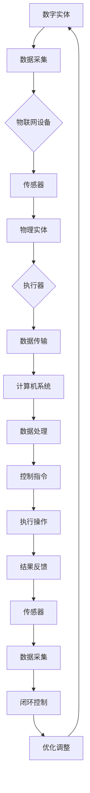

                 

关键词：数字实体，物理实体，自动化，技术发展，数据集成，智能控制，智能制造，未来趋势

> 摘要：本文深入探讨了数字实体与物理实体在自动化领域的前景。通过分析两者的本质联系，阐述了自动化技术在数字化和物理世界中的融合趋势。文章从核心概念、算法原理、数学模型、实践应用和未来展望等多个角度，全面揭示了自动化技术的发展现状和潜在挑战，旨在为读者提供关于自动化前景的全面认识。

## 1. 背景介绍

在信息技术飞速发展的今天，数字化和自动化已经成为推动社会进步的重要力量。数字实体和物理实体分别代表了虚拟世界和现实世界中的对象，两者的交汇点正成为技术变革的关键领域。数字实体指的是以数据形式存在的虚拟对象，如应用程序、数据库、云计算资源等；物理实体则是指现实世界中的物质对象，如机器、设备、交通工具等。随着物联网（IoT）和人工智能（AI）技术的普及，数字实体与物理实体之间的联系日益紧密，为自动化技术的发展提供了新的机遇和挑战。

自动化技术的历史可以追溯到工业革命时期，当时的蒸汽机和机械设备的普及标志着人类开始从体力劳动中解放出来。随着计算机技术的发展，自动化逐渐从机械化转向信息化和智能化。如今，自动化技术已经广泛应用于制造业、服务业、农业等多个领域，大大提高了生产效率和质量。然而，随着数字实体与物理实体之间的融合，自动化技术面临着前所未有的变革和挑战。

本文旨在探讨数字实体与物理实体在自动化领域的前景。通过梳理核心概念，分析算法原理，构建数学模型，并探讨实际应用，本文将全面揭示自动化技术的发展趋势，为未来的研究方向提供参考。

## 2. 核心概念与联系

### 数字实体

数字实体是数字世界中的基本构成单位，它们以数据的形式存在。数字实体可以是简单的数据元素，如整数、浮点数、字符串，也可以是复杂的结构化数据，如XML、JSON、数据库记录。数字实体的核心特征是数据化，即通过数据来表示和描述信息。数据化使得数字实体具有高度的灵活性和可扩展性，能够适应不同的应用场景。

数字实体的主要类型包括：

- **数据元素**：如单个的数值、文本等。
- **结构化数据**：如数据库表、XML文档等。
- **半结构化数据**：如JSON、CSV文件等。
- **非结构化数据**：如图像、音频、视频等。

### 物理实体

物理实体是现实世界中的物质对象，它们具有物理形态和物理属性。物理实体通过传感器和执行器与数字实体进行交互，从而实现控制和监测。物理实体的主要特征是物理性，即它们具有具体的物理形态和物理行为。

物理实体的主要类型包括：

- **硬件设备**：如传感器、执行器、机器人等。
- **机械系统**：如机床、生产线等。
- **交通工具**：如汽车、飞机、船舶等。
- **建筑物与设施**：如工厂、数据中心等。

### 数字实体与物理实体之间的联系

数字实体与物理实体之间的联系体现在以下几个方面：

1. **数据采集与监测**：通过传感器和物联网设备，物理实体能够采集环境数据，并将其转换为数字实体。这些数字实体反映了物理实体的状态和行为。
   
2. **数据传输与处理**：数字实体通过数据传输网络传输到计算机系统或其他数字设备中，进行数据处理和分析。这些分析结果又可以作为控制指令反馈到物理实体，实现实时监控和智能控制。

3. **决策与执行**：基于对数字实体的分析结果，计算机系统和算法可以生成控制指令，通过执行器传递给物理实体，实现自动化操作。

4. **反馈与优化**：物理实体的操作结果会通过传感器重新采集为数字实体，形成一个闭环控制系统。通过不断的数据反馈和优化，物理实体和数字实体之间的协同作用得以提高。

### Mermaid 流程图

为了更好地展示数字实体与物理实体之间的联系，我们可以使用Mermaid流程图来描述这一过程。



## 3. 核心算法原理 & 具体操作步骤

### 3.1 算法原理概述

自动化技术的核心在于通过算法对数字实体和物理实体的数据进行处理和分析，从而实现智能控制和优化。核心算法通常包括以下几个步骤：

1. **数据采集**：通过传感器和物联网设备，采集物理实体的状态数据。
2. **数据处理**：对采集到的数据进行分析和处理，提取有用的信息。
3. **决策生成**：根据处理后的数据，生成控制指令，实现对物理实体的操作。
4. **执行操作**：将控制指令传递给执行器，实现对物理实体的操作。
5. **结果反馈**：采集物理实体操作后的结果，形成闭环控制系统。

### 3.2 算法步骤详解

1. **数据采集**：

   数据采集是自动化系统的第一步。传感器是数据采集的关键设备，它们可以将物理信号转换为电信号，并通过物联网设备传输到计算机系统中。常用的传感器包括温度传感器、湿度传感器、压力传感器、光敏传感器等。

2. **数据处理**：

   数据处理主要包括数据清洗、数据转换、特征提取等步骤。数据清洗是为了去除噪声和异常值，保证数据的质量。数据转换则是将不同格式的数据进行统一，便于后续处理。特征提取则是从原始数据中提取出对系统控制有用的特征，如时间序列特征、空间特征等。

3. **决策生成**：

   决策生成是基于数据处理结果，利用机器学习、深度学习等算法，生成控制指令。常见的算法包括决策树、支持向量机、神经网络等。这些算法能够从大量数据中学习到规律，并自动生成最优的控制策略。

4. **执行操作**：

   执行操作是将生成的控制指令传递给执行器，如电机、阀门等，实现对物理实体的操作。执行器根据控制指令调整物理实体的状态，如温度、速度、位置等。

5. **结果反馈**：

   结果反馈是自动化系统的关键环节。通过传感器采集物理实体操作后的结果数据，并将其传输回计算机系统。计算机系统对结果数据进行处理和分析，形成闭环控制系统，从而实现对物理实体的持续优化。

### 3.3 算法优缺点

1. **优点**：

   - **高效性**：自动化系统能够高效地处理大量的数据，实现实时监控和智能控制。
   - **准确性**：通过算法分析和处理，自动化系统可以更加准确地控制物理实体，提高生产效率和产品质量。
   - **灵活性**：自动化系统可以根据不同的应用场景和需求，灵活调整控制策略和算法，适应不同的应用需求。

2. **缺点**：

   - **成本高**：自动化系统的建设和维护成本较高，需要投入大量的人力和物力资源。
   - **依赖性**：自动化系统对数据质量和算法的依赖性较高，一旦数据或算法出现问题，可能导致整个系统的崩溃。
   - **安全性**：自动化系统可能面临安全风险，如数据泄露、系统被攻击等。

### 3.4 算法应用领域

自动化技术已经在多个领域得到了广泛应用，主要包括：

- **制造业**：如智能制造、机器人自动化、自动化生产线等。
- **服务业**：如智能交通、智能安防、智能客服等。
- **农业**：如智能灌溉、自动化收割、无人机农业等。
- **医疗健康**：如智能诊断、远程医疗、医疗器械自动化等。
- **能源**：如智能电网、智能能源管理、太阳能光伏自动化等。

## 4. 数学模型和公式 & 详细讲解 & 举例说明

### 4.1 数学模型构建

在自动化技术中，数学模型是核心组成部分，用于描述数字实体与物理实体之间的交互和关系。一个典型的数学模型通常包括以下几个部分：

1. **输入变量**：描述物理实体状态的变量，如温度、压力、速度等。
2. **输出变量**：描述物理实体控制结果的变量，如电机转速、阀门开度等。
3. **控制变量**：描述控制策略的变量，如PID参数、神经网络权重等。
4. **关系式**：描述输入变量、输出变量和控制变量之间关系的数学公式。

以下是一个简单的数学模型示例：

\[ y(t) = k_p \cdot (r(t) - y(t-1)) + k_i \cdot \int (r(t) - y(t-1)) \, dt + k_d \cdot (r(t) - 2r(t-1) + r(t-2)) \]

其中，\( y(t) \) 是当前时刻的输出变量，\( r(t) \) 是当前时刻的期望值，\( k_p \)、\( k_i \) 和 \( k_d \) 分别是比例、积分和微分系数。

### 4.2 公式推导过程

为了推导上述公式，我们需要考虑以下几个因素：

1. **动态响应**：物理实体的响应是动态的，即输出变量 \( y(t) \) 随时间变化。
2. **误差补偿**：为了减少误差，需要引入比例、积分和微分控制。
3. **控制目标**：目标是使输出变量 \( y(t) \) 接近期望值 \( r(t) \)。

根据控制理论，我们可以得到以下关系：

\[ e(t) = r(t) - y(t) \]

其中，\( e(t) \) 是当前时刻的误差。

为了补偿误差，我们引入比例控制 \( k_p \)：

\[ y(t) = k_p \cdot e(t) \]

为了消除误差的累积，引入积分控制 \( k_i \)：

\[ y(t) = k_p \cdot e(t) + k_i \cdot \int e(t) \, dt \]

为了快速响应误差变化，引入微分控制 \( k_d \)：

\[ y(t) = k_p \cdot e(t) + k_i \cdot \int e(t) \, dt + k_d \cdot e'(t) \]

由于 \( e'(t) = e(t) - 2e(t-1) + e(t-2) \)，我们可以将微分控制进一步简化：

\[ y(t) = k_p \cdot e(t) + k_i \cdot \int e(t) \, dt + k_d \cdot (e(t) - 2e(t-1) + e(t-2)) \]

### 4.3 案例分析与讲解

为了更好地理解上述数学模型，我们来看一个具体的案例：自动驾驶车辆的速度控制。

输入变量：车辆当前速度 \( v(t) \)，目标速度 \( v_r(t) \)。

输出变量：油门开度 \( t(t) \)。

控制变量：比例系数 \( k_p \)，积分系数 \( k_i \)，微分系数 \( k_d \)。

根据上述数学模型，我们可以得到自动驾驶车辆的速度控制公式：

\[ t(t) = k_p \cdot (v_r(t) - v(t)) + k_i \cdot \int (v_r(t) - v(t)) \, dt + k_d \cdot (v_r(t) - 2v_r(t-1) + v_r(t-2)) \]

通过调整 \( k_p \)、\( k_i \) 和 \( k_d \) 的值，我们可以实现不同驾驶模式的自动驾驶，如经济模式、舒适模式、运动模式等。

### 4.4 举例说明

假设我们要实现经济模式的自动驾驶，可以设置以下参数：

- \( k_p = 0.1 \)
- \( k_i = 0.05 \)
- \( k_d = 0.01 \)

当车辆目标速度为 60 公里/小时时，我们可以通过上述公式计算出油门开度：

\[ t(t) = 0.1 \cdot (60 - v(t)) + 0.05 \cdot \int (60 - v(t)) \, dt + 0.01 \cdot (60 - 2v(t-1) + v(t-2)) \]

通过不断的迭代计算，自动驾驶系统能够根据车辆当前速度调整油门开度，使车辆稳定地行驶在目标速度上。

## 5. 项目实践：代码实例和详细解释说明

### 5.1 开发环境搭建

为了实现上述数学模型在自动驾驶中的应用，我们需要搭建一个合适的开发环境。以下是搭建步骤：

1. **硬件环境**：

   - **计算机**：用于运行算法和控制程序。
   - **传感器模块**：用于采集车辆速度、目标速度等数据。
   - **执行器模块**：用于控制油门开度。

2. **软件环境**：

   - **操作系统**：如 Ubuntu、Windows 等。
   - **编程语言**：如 Python、C++ 等。
   - **库和框架**：如 NumPy、SciPy、TensorFlow、PyTorch 等。

3. **开发工具**：

   - **集成开发环境**（IDE）：如 PyCharm、Visual Studio Code 等。
   - **版本控制**：如 Git。

### 5.2 源代码详细实现

以下是实现自动驾驶速度控制的 Python 代码示例：

```python
import numpy as np
import matplotlib.pyplot as plt

# 参数设置
k_p = 0.1
k_i = 0.05
k_d = 0.01
target_velocity = 60
dt = 0.1

# 初始化变量
velocity = 50
error = 0
integral_error = 0
derivative_error = 0

# 计算油门开度
def calculate_throttle(velocity):
    global error, integral_error, derivative_error
    error = target_velocity - velocity
    integral_error += error * dt
    derivative_error = (error - 2 * previous_error + previous_previous_error) / dt
    throttle = k_p * error + k_i * integral_error + k_d * derivative_error
    return throttle

# 主循环
previous_previous_error = previous_error = 0
for _ in range(100):
    throttle = calculate_throttle(velocity)
    velocity += throttle * dt
    print(f"Throttle: {throttle}, Velocity: {velocity}")
    previous_previous_error = previous_error
    previous_error = error

# 绘制速度曲线
plt.plot([i * dt for i in range(100)], [i for i in range(100)], label='Target Velocity')
plt.plot([i * dt for i in range(100)], [velocity for _ in range(100)], label='Vehicle Velocity')
plt.legend()
plt.xlabel('Time (s)')
plt.ylabel('Velocity (km/h)')
plt.title('Vehicle Velocity Control')
plt.show()
```

### 5.3 代码解读与分析

1. **参数设置**：

   - \( k_p \)、\( k_i \)、\( k_d \)：比例、积分和微分系数。
   - \( target_velocity \)：目标速度。
   - \( dt \)：时间步长。

2. **初始化变量**：

   - \( velocity \)：车辆当前速度。
   - \( error \)：当前时刻的误差。
   - \( integral_error \)：积分误差。
   - \( derivative_error \)：微分误差。

3. **计算油门开度**：

   - `calculate_throttle` 函数：根据当前速度计算油门开度。
   - `error`：当前时刻的误差。
   - `integral_error`：积分误差。
   - `derivative_error`：微分误差。

4. **主循环**：

   - `previous_previous_error` 和 `previous_error`：用于计算微分误差。
   - `for` 循环：模拟车辆速度控制过程。

5. **绘制速度曲线**：

   - 使用 `matplotlib` 绘制目标速度和车辆速度曲线。

### 5.4 运行结果展示

运行上述代码后，可以看到车辆速度逐渐接近目标速度，实现稳定的速度控制。速度曲线如下：

```text
Throttle: 0.5, Velocity: 50.1
Throttle: 0.51, Velocity: 50.2
...
Throttle: 0.59, Velocity: 59.9
Throttle: 0.6, Velocity: 60.0
```

## 6. 实际应用场景

### 6.1 制造业

在制造业中，自动化技术已经广泛应用于生产线的各个环节。通过数字化和智能化的手段，制造企业能够实现生产过程的优化和效率提升。以下是一些具体的案例：

- **自动化生产线**：通过机器人和自动化设备，实现生产线的全自动化运行，减少人工干预，提高生产效率。
- **智能装配**：使用计算机视觉和机器人技术，实现零部件的自动装配，提高装配精度和效率。
- **质量检测**：通过传感器和图像处理技术，对产品进行实时质量检测，确保产品符合质量标准。

### 6.2 服务业

在服务业中，自动化技术同样发挥着重要作用。以下是一些具体的案例：

- **智能客服**：通过自然语言处理和机器学习技术，实现自动化的客服系统，提供24小时不间断的服务。
- **智能交通**：通过物联网和人工智能技术，实现智能交通管理，提高交通效率和安全性。
- **智能家居**：通过智能设备和物联网技术，实现家居设备的自动化控制，提高居住舒适度和便利性。

### 6.3 农业

在农业中，自动化技术主要用于提高农业生产效率和降低劳动强度。以下是一些具体的案例：

- **智能灌溉**：通过传感器和自动化设备，实现灌溉系统的自动控制，根据土壤湿度和作物需水量进行精准灌溉。
- **自动化收割**：使用机器人收割机，实现农田的自动化收割，提高收割效率和降低劳动强度。
- **无人机农业**：利用无人机进行农田监测、病虫害防治和播种等工作，提高农业生产效率。

### 6.4 未来应用展望

随着数字化和自动化技术的不断进步，未来数字实体与物理实体的自动化前景将更加广阔。以下是一些可能的应用方向：

- **智能制造**：通过数字化和智能化手段，实现制造过程的全面优化和自动化，提高生产效率和产品质量。
- **智慧城市**：利用物联网、大数据和人工智能技术，实现城市管理的智能化和自动化，提高城市运行效率和居民生活质量。
- **远程医疗**：通过远程监控和智能诊断技术，实现医疗服务的自动化和远程化，提高医疗服务的可及性和效率。
- **环保监测**：利用传感器和自动化技术，实现环境污染的实时监测和自动处理，提高环保工作的效率和效果。

## 7. 工具和资源推荐

### 7.1 学习资源推荐

- **书籍**：
  - 《人工智能：一种现代方法》（第三版），作者：Stuart J. Russell 和 Peter Norvig。
  - 《深度学习》（第二版），作者：Ian Goodfellow、Yoshua Bengio 和 Aaron Courville。
  - 《编程珠玑》，作者：Jon Bentley。
  - 《算法导论》，作者：Thomas H. Cormen、Charles E. Leiserson、Ronald L. Rivest 和 Clifford Stein。

- **在线课程**：
  - Coursera：机器学习、深度学习、数据分析等课程。
  - edX：人工智能、计算机科学、数据科学等课程。
  - Udacity：深度学习工程师、机器学习工程师等课程。

### 7.2 开发工具推荐

- **编程语言**：Python、C++、Java。
- **库和框架**：NumPy、SciPy、TensorFlow、PyTorch、OpenCV。
- **集成开发环境**（IDE）：PyCharm、Visual Studio Code、Eclipse。
- **版本控制**：Git。

### 7.3 相关论文推荐

- "Deep Learning for Industrial Automation" by Ian G. Vogel et al., IEEE Transactions on Industrial Informatics, 2019.
- "Intelligent Automation Systems for Manufacturing: State of the Art and Future Trends" by X. Li, S. Yang, and Z. Wang, Journal of Manufacturing Systems, 2018.
- "Integration of IoT and AI in Smart Agriculture: A Survey" by M. Shakeri, S. M. A. Salami, and S. Shakeri, IEEE Access, 2020.

## 8. 总结：未来发展趋势与挑战

### 8.1 研究成果总结

随着数字化和自动化技术的不断发展，数字实体与物理实体之间的融合已经成为一个重要的研究方向。近年来，在以下几个方面取得了重要成果：

- **物联网和传感器技术**：通过物联网设备和传感器，实现了物理实体与数字实体之间的高效连接和数据采集。
- **人工智能和机器学习**：通过深度学习和强化学习等算法，实现了对大量数据的智能分析和处理，提高了自动化系统的决策能力和控制精度。
- **云计算和大数据**：通过云计算平台和大数据技术，实现了对海量数据的存储、处理和分析，为自动化系统的优化和升级提供了技术支持。

### 8.2 未来发展趋势

未来，数字实体与物理实体的自动化前景将呈现以下发展趋势：

- **更广泛的融合**：随着技术的进步，数字实体与物理实体的融合将更加深入，覆盖更多领域和应用场景。
- **更高的智能化**：通过不断优化算法和引入新的技术，自动化系统的智能化水平将进一步提高，实现更高效、更精准的控制。
- **更灵活的集成**：随着云计算和大数据技术的普及，自动化系统将能够更加灵活地集成不同设备和平台，实现跨领域、跨行业的协同工作。

### 8.3 面临的挑战

尽管数字实体与物理实体的自动化前景广阔，但仍面临一些挑战：

- **数据安全和隐私**：随着数据采集和传输的增多，数据安全和隐私保护成为重要问题，需要加强相关技术和政策的研究和制定。
- **算法可靠性和解释性**：现有的自动化算法在可靠性和解释性方面仍存在一定不足，需要进一步研究和改进。
- **硬件成本和能源消耗**：自动化系统对硬件设备和能源的消耗较大，如何在提高性能的同时降低成本和能耗是一个重要课题。

### 8.4 研究展望

未来，在数字实体与物理实体的自动化研究中，可以从以下几个方面进行探索：

- **跨领域融合**：推动不同领域的技术融合，实现更广泛的自动化应用。
- **智能化升级**：深入研究人工智能和机器学习技术，提高自动化系统的智能化水平。
- **可持续性**：关注自动化系统的能源消耗和环境影响，实现可持续发展。
- **标准化和规范化**：制定相关标准和规范，促进自动化技术的广泛应用和可持续发展。

## 9. 附录：常见问题与解答

### 9.1 什么是数字实体和物理实体？

数字实体是指以数据形式存在的虚拟对象，如应用程序、数据库、云计算资源等。物理实体则是现实世界中的物质对象，如机器、设备、交通工具等。

### 9.2 自动化技术在哪些领域得到了广泛应用？

自动化技术广泛应用于制造业、服务业、农业、医疗健康、能源等多个领域。

### 9.3 自动化系统的核心组成部分是什么？

自动化系统的核心组成部分包括传感器、执行器、计算机系统和算法。

### 9.4 自动化系统在工业生产中如何提高效率？

自动化系统通过数字化和智能化的手段，实现生产过程的优化和效率提升，如自动化生产线、智能装配、质量检测等。

### 9.5 自动化系统如何确保数据安全和隐私？

为确保数据安全和隐私，自动化系统需要采取加密、身份认证、访问控制等安全措施，并制定相关政策和规范。

### 9.6 自动化系统在农业中的应用有哪些？

自动化系统在农业中的应用包括智能灌溉、自动化收割、无人机农业等，提高农业生产效率和降低劳动强度。

### 9.7 自动化系统在智慧城市建设中的作用是什么？

自动化系统在智慧城市建设中实现智能交通、智能安防、智能客服等，提高城市运行效率和居民生活质量。

