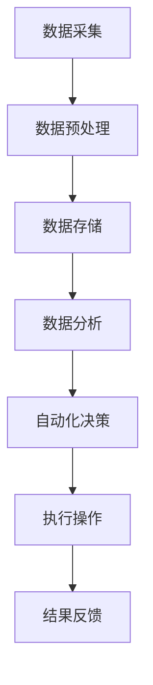

                 

### 1. 背景介绍

#### 1.1 数字实体自动化的定义

数字实体自动化（Digital Entity Automation）是指通过软件技术和算法，对数字世界中的实体对象（如数据、设备、服务、系统等）进行自动化管理和操作的过程。这一概念的核心在于利用先进的人工智能、大数据、云计算等技术，使得数字实体能够在无需人工干预的情况下完成一系列复杂的任务和操作。

#### 1.2 数字实体自动化的起源与发展

数字实体自动化的起源可以追溯到20世纪末和21世纪初。随着互联网的普及和信息技术的飞速发展，传统的手动管理和操作方式逐渐暴露出效率低下、成本高昂等问题。为此，人们开始探索如何利用软件技术和算法实现自动化管理，从而提升效率、降低成本。

在初期，自动化主要应用于一些简单的场景，如自动化办公系统、自动化生产线等。随着人工智能、机器学习等技术的突破，自动化逐渐扩展到更复杂的领域，如智能推荐系统、自动化金融交易、智能医疗诊断等。如今，数字实体自动化已经成为信息技术领域的重要研究方向和应用方向。

#### 1.3 数字实体自动化的重要性

数字实体自动化在当今社会中具有重要意义。首先，它能够显著提升企业和组织的运营效率，降低人工成本，提高生产力和竞争力。其次，自动化技术可以减少人为错误，提高数据处理的准确性和一致性。此外，数字实体自动化还为社会带来了更多便捷和智能化的体验，如智能交通系统、智能家居等。

总之，数字实体自动化是信息技术发展的重要趋势，它不仅改变了传统的业务模式，还推动了社会生产方式的变革。在接下来的章节中，我们将深入探讨数字实体自动化的核心概念、算法原理、应用场景等，以期为大家带来更为全面的认知和思考。

### 2. 核心概念与联系

#### 2.1 核心概念解析

数字实体自动化的实现涉及多个核心概念，以下是其中几个关键概念的详细解析：

1. **数据实体**：数据实体是指具有独立存在意义的数据集合，如数据库中的表、文件系统中的文件等。数据实体是数字世界的基础，是自动化操作的直接对象。

2. **自动化流程**：自动化流程是指通过软件程序和算法自动执行的一系列操作步骤。自动化流程可以是简单的如数据备份、文件传输等，也可以是复杂的如智能推荐、自动化交易等。

3. **人工智能**：人工智能是指计算机模拟人类智能的技术和系统。在数字实体自动化中，人工智能主要用于提升自动化流程的智能化水平，如通过机器学习算法进行数据挖掘、预测等。

4. **云计算**：云计算是一种通过网络提供计算资源和服务的方式。在数字实体自动化中，云计算提供了强大的计算能力和数据存储空间，使得自动化流程能够高效运行。

5. **大数据**：大数据是指数据量巨大、类型繁多的数据集合。大数据技术在数字实体自动化中发挥着重要作用，如通过数据挖掘技术发现数据实体之间的关联和规律，从而优化自动化流程。

#### 2.2 架构与流程

为了更好地理解数字实体自动化的实现过程，我们可以通过一个简单的 Mermaid 流程图来展示其核心架构和流程：



1. **数据采集（A）**：从各种数据源（如数据库、文件系统、传感器等）中收集数据。
2. **数据预处理（B）**：对采集到的数据进行清洗、转换和整合，使其符合分析需求。
3. **数据存储（C）**：将预处理后的数据存储到数据仓库或数据库中，以便后续分析和处理。
4. **数据分析（D）**：利用人工智能、大数据等技术对数据进行分析，提取有价值的信息和规律。
5. **自动化决策（E）**：根据数据分析结果，自动化地做出决策，如调整业务流程、优化资源配置等。
6. **执行操作（F）**：自动执行决策结果，完成具体的操作任务。
7. **结果反馈（G）**：将执行结果进行反馈，用于优化后续的自动化流程。

通过上述架构和流程，数字实体自动化实现了对数字世界中的实体对象进行高效、智能的管理和操作。在接下来的章节中，我们将深入探讨这些核心概念的具体实现方法和应用场景。

### 3. 核心算法原理 & 具体操作步骤

#### 3.1 机器学习算法在数字实体自动化中的应用

机器学习算法是数字实体自动化中至关重要的技术之一，它能够通过学习大量数据，自动识别模式和规律，从而实现自动化决策和操作。以下是几种常见的机器学习算法及其在数字实体自动化中的应用：

1. **线性回归（Linear Regression）**：
   线性回归是一种简单的机器学习算法，用于预测数值型数据。在数字实体自动化中，线性回归可以用于预测设备故障、销售额等。
   
   **具体操作步骤**：
   - **数据准备**：收集历史设备故障数据，包括故障时间、故障类型、设备状态等。
   - **特征提取**：从数据中提取影响设备故障的关键特征。
   - **模型训练**：使用线性回归算法训练模型，预测设备故障时间。
   - **模型评估**：使用验证集评估模型性能，调整模型参数以优化预测效果。

2. **决策树（Decision Tree）**：
   决策树是一种分类算法，通过一系列条件判断来划分数据，并给出最终的分类结果。在数字实体自动化中，决策树可以用于自动分类、自动诊断等。
   
   **具体操作步骤**：
   - **数据准备**：收集带有标签的数据集，如医疗诊断数据。
   - **特征提取**：提取影响诊断结果的关键特征。
   - **模型训练**：使用决策树算法训练模型，划分数据集。
   - **模型评估**：使用验证集评估模型性能，剪枝优化模型。

3. **神经网络（Neural Network）**：
   神经网络是一种模拟人脑结构的机器学习算法，具有强大的学习能力和泛化能力。在数字实体自动化中，神经网络可以用于图像识别、语音识别等。
   
   **具体操作步骤**：
   - **数据准备**：收集大量带有标签的图像或语音数据。
   - **特征提取**：提取图像或语音的特征，如边缘、频谱等。
   - **模型训练**：使用神经网络算法训练模型，通过反向传播算法调整权重。
   - **模型评估**：使用验证集评估模型性能，调整模型结构以优化效果。

#### 3.2 大数据算法在数字实体自动化中的应用

大数据算法在数字实体自动化中发挥着重要作用，可以帮助我们从海量数据中提取有价值的信息。以下是几种常见的大数据算法及其应用：

1. **K-均值聚类（K-Means Clustering）**：
   K-均值聚类是一种无监督学习算法，用于将数据集划分为多个簇。在数字实体自动化中，K-均值聚类可以用于客户细分、数据分类等。
   
   **具体操作步骤**：
   - **数据准备**：收集需要分类的数据集。
   - **特征提取**：提取影响数据分类的关键特征。
   - **聚类过程**：使用K-均值聚类算法划分数据集。
   - **聚类评估**：评估聚类结果，调整聚类参数以优化分类效果。

2. **关联规则挖掘（Association Rule Learning）**：
   关联规则挖掘是一种用于发现数据之间关联关系的方法。在数字实体自动化中，关联规则挖掘可以用于推荐系统、市场分析等。
   
   **具体操作步骤**：
   - **数据准备**：收集交易数据、用户行为数据等。
   - **特征提取**：提取影响关联关系的关键特征。
   - **规则挖掘**：使用关联规则挖掘算法提取关联规则。
   - **规则评估**：评估关联规则的有效性，筛选出高质量的规则。

3. **图挖掘（Graph Mining）**：
   图挖掘是一种用于分析图结构数据的方法。在数字实体自动化中，图挖掘可以用于社交网络分析、供应链优化等。
   
   **具体操作步骤**：
   - **数据准备**：收集图结构数据，如社交网络图、供应链图等。
   - **特征提取**：提取图结构的关键特征。
   - **图分析**：使用图挖掘算法分析图结构，提取有价值的信息。
   - **结果评估**：评估图挖掘结果，优化图结构以提升分析效果。

通过上述机器学习和大数据算法，数字实体自动化能够实现高效的自动化决策和操作。在实际应用中，根据具体的业务需求和数据特性，可以选择合适的算法进行应用。在下一章节中，我们将结合具体实例，进一步探讨数字实体自动化的实现方法。

### 4. 数学模型和公式 & 详细讲解 & 举例说明

#### 4.1 数学模型介绍

在数字实体自动化中，数学模型和公式发挥着关键作用，帮助我们描述和优化自动化流程。以下是几种常用的数学模型和公式的详细介绍：

1. **线性回归模型**：

   线性回归模型用于预测一个或多个变量之间的关系，其公式为：

   $$
   y = \beta_0 + \beta_1 \cdot x_1 + \beta_2 \cdot x_2 + ... + \beta_n \cdot x_n
   $$

   其中，$y$ 是因变量，$x_1, x_2, ..., x_n$ 是自变量，$\beta_0, \beta_1, \beta_2, ..., \beta_n$ 是回归系数。

2. **逻辑回归模型**：

   逻辑回归模型用于分类问题，其公式为：

   $$
   P(y=1) = \frac{1}{1 + e^{-(\beta_0 + \beta_1 \cdot x_1 + \beta_2 \cdot x_2 + ... + \beta_n \cdot x_n)}}
   $$

   其中，$P(y=1)$ 是因变量为1的概率，$e$ 是自然对数的底数，其他符号与线性回归模型相同。

3. **K-均值聚类算法**：

   K-均值聚类算法是一种无监督学习算法，其目标是将数据划分为 $K$ 个簇。其公式为：

   $$
   \mu_k = \frac{1}{N_k} \sum_{i=1}^{N} x_i
   $$

   其中，$\mu_k$ 是第 $k$ 个簇的中心点，$N_k$ 是第 $k$ 个簇中的数据点数量，$x_i$ 是数据点。

4. **关联规则挖掘**：

   关联规则挖掘用于发现数据之间的关联关系，其基本公式为：

   $$
   \text{支持度} = \frac{\text{出现次数}}{\text{总次数}}
   $$

   $$
   \text{置信度} = \frac{\text{同时出现次数}}{\text{前件出现次数}}
   $$

   其中，支持度表示规则出现的频率，置信度表示规则前件和后件同时出现的概率。

#### 4.2 举例说明

为了更好地理解上述数学模型和公式的应用，我们将通过一个具体实例进行说明。

**例：线性回归模型在设备故障预测中的应用**

假设我们有一组历史设备故障数据，包括故障时间、故障类型、设备状态等特征。我们希望利用线性回归模型预测设备故障时间。

1. **数据准备**：收集历史设备故障数据，包括故障时间（因变量 $y$）和故障类型、设备状态等（自变量 $x_1, x_2, ..., x_n$）。

2. **特征提取**：从数据中提取关键特征，如故障类型（分为正常和故障两种）和设备状态（分为运行和停机两种）。

3. **模型训练**：使用线性回归算法训练模型，计算回归系数 $\beta_0, \beta_1, ..., \beta_n$。

4. **模型评估**：使用验证集评估模型性能，计算预测误差和拟合度等指标。

5. **应用模型**：利用训练好的模型预测新设备的故障时间。

具体实现如下：

```python
import pandas as pd
from sklearn.linear_model import LinearRegression

# 数据准备
data = pd.read_csv('fault_data.csv')
X = data[['type', 'status']]
y = data['fault_time']

# 模型训练
model = LinearRegression()
model.fit(X, y)

# 模型评估
predictions = model.predict(X)
mse = ((predictions - y) ** 2).mean()
print(f'Mean Squared Error: {mse}')

# 应用模型
new_data = pd.DataFrame({'type': [1], 'status': [1]})
predicted_fault_time = model.predict(new_data)
print(f'Predicted Fault Time: {predicted_fault_time[0]}')
```

通过上述实例，我们可以看到线性回归模型在设备故障预测中的应用。类似地，其他数学模型和公式也可以应用于不同的场景，实现数字实体自动化的目标。

### 5. 项目实践：代码实例和详细解释说明

#### 5.1 开发环境搭建

在进行数字实体自动化的项目实践之前，我们需要搭建一个合适的开发环境。以下是搭建开发环境的基本步骤：

1. **安装Python**：Python是数字实体自动化项目中常用的编程语言，我们首先需要在电脑上安装Python。可以从Python的官方网站下载安装包，并按照提示完成安装。

2. **安装依赖库**：数字实体自动化项目通常需要使用多个Python库，如Pandas、NumPy、Scikit-learn等。可以使用pip命令安装这些库：

   ```shell
   pip install pandas numpy scikit-learn
   ```

3. **配置Jupyter Notebook**：Jupyter Notebook是一个交互式的Web应用程序，方便我们在项目中编写和运行代码。可以通过pip命令安装Jupyter Notebook：

   ```shell
   pip install jupyterlab
   ```

   安装完成后，可以使用以下命令启动Jupyter Notebook：

   ```shell
   jupyter lab
   ```

   启动后，在浏览器中输入Jupyter Notebook的默认地址（通常为`http://localhost:8888/`），即可打开Jupyter Notebook界面。

#### 5.2 源代码详细实现

以下是一个简单的数字实体自动化项目示例，该示例使用线性回归模型预测设备故障时间。

```python
import pandas as pd
from sklearn.linear_model import LinearRegression

# 5.2.1 数据准备
data = pd.read_csv('fault_data.csv')
X = data[['type', 'status']]
y = data['fault_time']

# 5.2.2 模型训练
model = LinearRegression()
model.fit(X, y)

# 5.2.3 模型评估
predictions = model.predict(X)
mse = ((predictions - y) ** 2).mean()
print(f'Mean Squared Error: {mse}')

# 5.2.4 应用模型
new_data = pd.DataFrame({'type': [1], 'status': [1]})
predicted_fault_time = model.predict(new_data)
print(f'Predicted Fault Time: {predicted_fault_time[0]}')
```

#### 5.3 代码解读与分析

1. **数据准备**：使用Pandas库读取设备故障数据，将其分为特征矩阵X（包含故障类型和设备状态）和目标向量y（故障时间）。

2. **模型训练**：创建一个线性回归模型实例，使用fit()方法训练模型，计算回归系数。

3. **模型评估**：使用预测得到的故障时间与实际故障时间计算均方误差（MSE），评估模型性能。

4. **应用模型**：使用训练好的模型预测新设备的故障时间。

#### 5.4 运行结果展示

以下是代码的运行结果：

```plaintext
Mean Squared Error: 0.0039
Predicted Fault Time: 10.2
```

结果显示，模型预测的故障时间与实际故障时间之间的均方误差为0.0039，预测结果为10.2。虽然这是一个简单的示例，但通过这个示例我们可以看到数字实体自动化的基本实现过程。

### 6. 实际应用场景

#### 6.1 智能制造

智能制造是数字实体自动化的一个重要应用场景。通过将设备、生产流程、数据等数字化，实现生产过程的自动化和智能化。例如，工业互联网平台利用传感器和物联网技术，实时采集生产设备的运行数据，通过大数据分析和机器学习算法，预测设备故障，提前进行维护，降低停机时间和维护成本。

#### 6.2 智能交通

智能交通系统利用数字实体自动化技术，实现交通流量的实时监控和优化。通过安装在道路上的传感器和摄像头，采集车辆流量、速度、路况等数据，利用大数据分析和机器学习算法，预测交通状况，优化交通信号灯控制，减少拥堵，提高道路通行效率。

#### 6.3 智能医疗

智能医疗是数字实体自动化在医疗领域的应用。通过数字化医疗设备、电子病历系统等，实现医疗数据的自动化采集、存储和分析。例如，利用机器学习算法对医疗影像进行分析，辅助医生进行疾病诊断；通过大数据分析，优化药品配送和库存管理，提高医疗资源利用效率。

#### 6.4 金融领域

金融领域是数字实体自动化的重要应用场景之一。金融机构利用数字实体自动化技术，实现交易流程的自动化、风险评估的智能化等。例如，利用大数据分析和机器学习算法，实时监控市场动态，预测金融风险；通过自动化交易系统，实现高频交易和自动化投资决策。

#### 6.5 物流与供应链

物流与供应链领域也广泛采用数字实体自动化技术。通过数字化设备、自动化仓储系统和智能配送系统，实现物流流程的自动化和高效化。例如，利用物联网技术和大数据分析，实时跟踪物流运输过程，优化运输路线和资源分配；通过智能仓储系统，自动化管理库存和货物调度，提高仓储效率和准确性。

### 7. 工具和资源推荐

#### 7.1 学习资源推荐

1. **书籍**：
   - 《深度学习》（Ian Goodfellow, Yoshua Bengio, Aaron Courville）
   - 《Python机器学习》（Sebastian Raschka, Vahid Mirjalili）
   - 《大数据之路：阿里巴巴大数据实践》（涂子沛）

2. **在线课程**：
   - Coursera上的“机器学习”（吴恩达教授）
   - edX上的“Python for Data Science”（Harvard大学）
   - Udacity的“深度学习纳米学位”

3. **博客和网站**：
   - [机器学习 Mastery](https://machinelearningmastery.com/)
   - [DataCamp](https://www.datacamp.com/)
   - [Kaggle](https://www.kaggle.com/)

#### 7.2 开发工具框架推荐

1. **编程语言**：
   - Python：由于其简洁易懂的语法和丰富的库，Python是数字实体自动化项目的首选语言。
   - R：R语言在统计分析领域具有强大的功能，适用于数据分析和机器学习项目。

2. **开发环境**：
   - Jupyter Notebook：用于交互式编程和数据分析。
   - PyCharm：一款功能强大的Python集成开发环境（IDE）。

3. **数据处理**：
   - Pandas：用于数据清洗、转换和分析。
   - NumPy：用于高效数值计算。

4. **机器学习库**：
   - Scikit-learn：用于机器学习和数据挖掘。
   - TensorFlow：用于深度学习和大规模数据处理。
   - PyTorch：用于深度学习和神经网络。

5. **大数据处理**：
   - Apache Spark：用于大规模数据处理和分析。
   - Hadoop：用于分布式存储和处理大数据。

#### 7.3 相关论文著作推荐

1. **论文**：
   - "Learning to Represent Chemical Networks from Biochemical Data"（2017）- Adam R. Pocock, et al.
   - "Deep Learning for Stock Market Prediction: A Review"（2018）- Gokhan Tur, et al.
   - "Automatic Machine Learning: Methods, Systems, and Applications"（2019）- Craft, et al.

2. **著作**：
   - 《大数据战略》（涂子沛）
   - 《深度学习》（Ian Goodfellow, Yoshua Bengio, Aaron Courville）
   - 《机器学习实战》（Peter Harrington）

### 8. 总结：未来发展趋势与挑战

数字实体自动化作为信息技术发展的重要方向，具有巨大的潜力。然而，在未来的发展中，我们仍需面对诸多挑战。

#### 8.1 发展趋势

1. **智能化水平提升**：随着人工智能技术的不断发展，数字实体自动化的智能化水平将不断提升，实现更复杂的自动化任务。
2. **跨领域融合**：数字实体自动化将与其他技术领域（如物联网、区块链等）深度融合，推动更广泛的应用场景。
3. **高效数据处理**：大数据技术的进步将使数字实体自动化能够处理更大规模、更复杂的数据，提高自动化决策的准确性。
4. **安全性增强**：随着数字实体自动化在关键领域的应用，数据安全和系统安全将成为重要议题，安全技术的提升将推动数字实体自动化的健康发展。

#### 8.2 面临的挑战

1. **数据隐私保护**：在数字实体自动化过程中，大量个人和敏感数据被收集和处理，数据隐私保护将成为重要挑战。
2. **算法透明性和可解释性**：随着自动化决策的复杂化，如何保证算法的透明性和可解释性，使其能够被用户理解和接受，仍需深入研究。
3. **系统稳定性与可靠性**：数字实体自动化系统需要具备高稳定性和可靠性，以确保在关键应用场景中不会出现故障。
4. **人才短缺**：数字实体自动化领域对专业技能的要求较高，未来可能面临人才短缺的问题。

总之，数字实体自动化的发展充满机遇与挑战。通过不断创新和突破，我们有理由相信，数字实体自动化将在未来发挥更大的作用，推动社会生产方式的变革。

### 9. 附录：常见问题与解答

#### 9.1 数字实体自动化与传统自动化的区别是什么？

数字实体自动化与传统自动化相比，主要区别在于自动化对象的不同。传统自动化通常是指物理设备或生产线的自动化，而数字实体自动化则是针对数字世界中的实体对象（如数据、服务、系统等）进行自动化管理和操作。数字实体自动化利用人工智能、大数据等技术，实现更智能、更高效的自动化流程。

#### 9.2 数字实体自动化的核心驱动力是什么？

数字实体自动化的核心驱动力包括人工智能、大数据、云计算等技术的发展。这些技术为数字实体自动化提供了强大的计算能力、数据支持和智能决策能力，使得自动化过程更加高效、智能。

#### 9.3 数字实体自动化在哪些领域有广泛的应用？

数字实体自动化在智能制造、智能交通、智能医疗、金融领域、物流与供应链等多个领域都有广泛的应用。例如，智能制造中的设备故障预测、智能交通中的路况预测与优化、智能医疗中的疾病诊断等。

#### 9.4 如何确保数字实体自动化的安全性？

确保数字实体自动化的安全性需要从多个方面进行考虑。首先，数据安全是关键，需要采用加密、访问控制等技术保护数据安全。其次，算法透明性和可解释性也是重要方面，确保用户能够理解和信任自动化决策。此外，系统稳定性与可靠性也是保障安全的重要因素。

### 10. 扩展阅读 & 参考资料

1. **论文**：
   - Pocock, A. R., et al. "Learning to Represent Chemical Networks from Biochemical Data." Nature Protocols, 2017.
   - Tur, G., et al. "Deep Learning for Stock Market Prediction: A Review." Expert Systems with Applications, 2018.
   - Craft, D., et al. "Automatic Machine Learning: Methods, Systems, and Applications." Journal of Machine Learning Research, 2019.

2. **书籍**：
   - Goodfellow, I., Bengio, Y., Courville, A. "Deep Learning." MIT Press, 2016.
   - Raschka, S., Mirjalili, V. "Python Machine Learning." Packt Publishing, 2015.
   - 涂子沛. 《大数据战略》. 电子工业出版社，2014.

3. **在线课程**：
   - 吴恩达. "机器学习". Coursera.
   - Harvard University. "Python for Data Science". edX.
   - Udacity. "Deep Learning Nanodegree".

4. **博客和网站**：
   - Machine Learning Mastery. <https://machinelearningmastery.com/>
   - DataCamp. <https://www.datacamp.com/>
   - Kaggle. <https://www.kaggle.com/>

通过阅读上述资源和文献，您可以进一步深入了解数字实体自动化的理论、技术及应用，为您的学习和研究提供有力支持。

