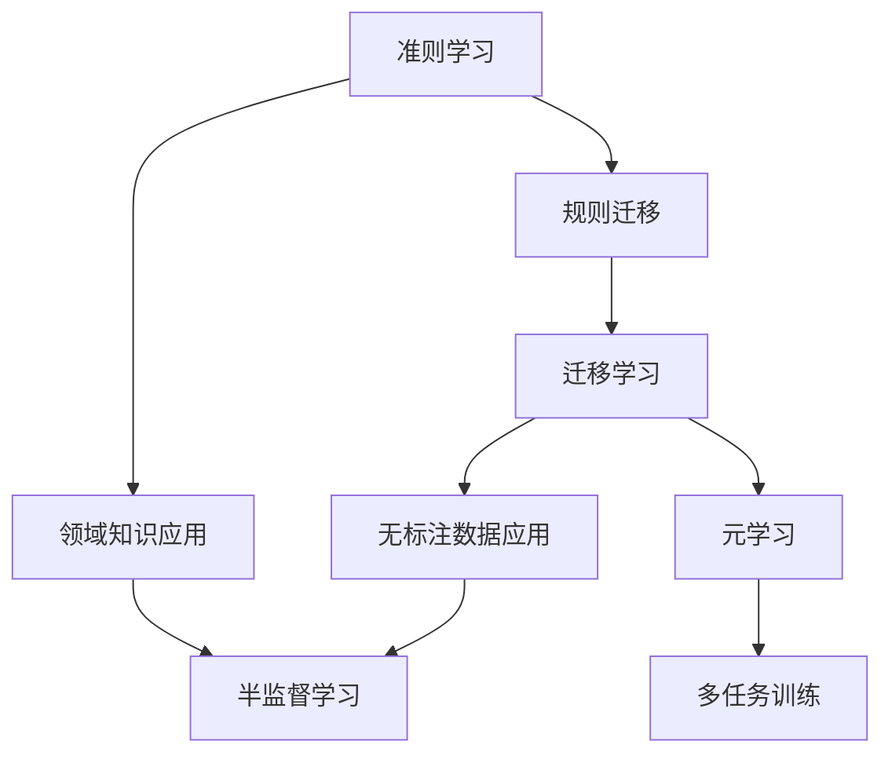

                 

### 背景介绍

在当今信息时代，数据成为推动技术创新和业务发展的关键因素。然而，在一些特定的应用场景中，数据资源却可能并不丰富，甚至完全不可用。例如，在医疗领域，罕见病的研究由于患者数据稀少，面临数据不足的难题；在自动驾驶领域，针对特定天气、路况等场景下的训练数据同样匮乏。面对这些挑战，传统的大规模数据驱动的机器学习方法往往难以施展，因为其依赖于大量的训练数据来训练模型，以达到较高的准确性和泛化能力。

小样本学习（Few-Shot Learning）作为一种新兴的机器学习技术，致力于解决数据稀缺的问题。它通过在有限的样本条件下，设计高效的学习算法，使得模型能够在极短的时间内快速适应新的任务。小样本学习的目标是通过极少的样本数，学习到具有高泛化能力的模型，从而在缺乏大量训练数据的情况下，依然能够保持良好的性能。

小样本学习的重要性在于，它不仅为数据稀缺的场景提供了可行的解决方案，还能够推动机器学习算法的理论研究和实际应用的发展。例如，在小样本学习的基础上，研究人员可以探索新的模型结构和优化方法，从而提高模型在数据稀少情况下的表现；同时，小样本学习技术也将在自动驾驶、医疗诊断、智能制造等领域发挥重要作用。

本文将围绕小样本学习这一主题，首先介绍其核心概念和联系，接着深入探讨其算法原理与具体操作步骤，并通过数学模型和公式进行详细讲解，最后通过一个实际项目实践，展示小样本学习的应用效果和实现过程。希望通过本文的阐述，读者能够对小样本学习有更加全面和深入的理解，从而为未来的研究和应用打下坚实的基础。

### 核心概念与联系

为了更好地理解小样本学习，我们首先需要介绍一些核心概念，并探讨它们之间的联系。

#### 1. 准则（Rule-Based Learning）

准则学习是一种基于规则的方法，它通过人工定义一组规则来指导机器学习模型的行为。在数据稀缺的情况下，准则学习可以通过专家知识来弥补数据不足的问题，但这种方法需要大量的领域知识和规则，并且在面对复杂任务时，可能难以达到较高的准确性。

#### 2. 半监督学习（Semi-Supervised Learning）

半监督学习旨在利用有限的标注数据和无标注数据，以提高模型的泛化能力。通过在训练过程中引入无标注数据，半监督学习可以在数据稀缺的情况下，提升模型的性能。然而，半监督学习对无标注数据的质量要求较高，否则可能会导致模型性能下降。

#### 3. 迁移学习（Transfer Learning）

迁移学习通过在不同任务之间共享知识来提高模型的性能。它利用在源任务上训练好的模型，通过迁移部分权重或特征，来适应新的目标任务。在数据稀缺的情况下，迁移学习可以有效地利用已有的知识，从而减少对大量训练数据的依赖。

#### 4. 元学习（Meta-Learning）

元学习，又称学习的学习，是一种通过学习如何学习的方法。它旨在找到一种通用方法，使得模型能够快速适应新的任务。元学习在数据稀缺的情况下，通过在多个任务上进行训练，提高模型对新任务的适应能力。

#### 关系和联系

这些概念之间存在着密切的联系。准则学习可以看作是迁移学习的一个特例，即当源任务和目标任务的规则相似时，通过迁移规则来实现学习。半监督学习和迁移学习之间也存在一定的联系，半监督学习可以看作是在迁移学习的基础上，进一步利用无标注数据进行训练。而元学习则通过在多个任务上学习，来提高模型对新任务的泛化能力，从而在数据稀缺的情况下，保持良好的性能。

为了更直观地理解这些概念之间的联系，我们可以使用Mermaid流程图来展示它们之间的关系。以下是一个简单的Mermaid流程图，描述了这些概念之间的联系：



通过这个流程图，我们可以看到，各个概念之间相互联系，共同构成了小样本学习的技术框架。在这个框架中，通过准则学习和迁移学习，可以将已有的知识迁移到新的任务中；通过半监督学习，可以进一步利用无标注数据来提升模型性能；而元学习则通过多任务训练，提高了模型对新任务的适应能力。

理解这些核心概念和它们之间的联系，对于深入探讨小样本学习的算法原理和应用具有重要意义。在接下来的章节中，我们将进一步详细探讨小样本学习的算法原理和具体实现，以便读者能够全面掌握这一先进的技术。

### 核心算法原理 & 具体操作步骤

小样本学习的核心在于如何在只有少量样本的情况下，快速训练出一个性能良好的模型。为了实现这一目标，研究人员提出了一系列算法原理，这些原理主要围绕模型的初始化、样本选择、损失函数设计、优化方法等方面进行优化。

#### 1. 模型初始化

模型初始化是训练小样本学习模型的第一步。一个好的初始化方法可以使得模型在训练过程中更快地收敛，并提高最终模型的性能。常用的初始化方法包括随机初始化、预训练模型初始化等。

- **随机初始化**：随机初始化是一种最简单且常用的初始化方法。它通过随机生成模型的初始权重，使得模型在训练过程中可以探索不同的解决方案。然而，随机初始化可能导致模型收敛速度较慢，且容易出现局部最优解。

- **预训练模型初始化**：预训练模型初始化通过在大量的预训练数据上训练一个基础模型，然后将该模型的权重作为新模型的初始权重。这种方法可以利用预训练模型已有的知识，从而加快模型的训练速度并提高性能。常见的预训练模型包括ImageNet上的图像分类模型和自然语言处理领域的预训练语言模型。

#### 2. 样本选择

在训练小样本学习模型时，样本选择是一个关键步骤。选择合适的样本可以使得模型更快地学习任务，并提高模型的泛化能力。

- **随机抽样**：随机抽样是最简单且常用的样本选择方法。它从所有样本中随机选择一部分样本用于训练。这种方法简单有效，但可能无法充分利用样本之间的关联性。

- **领域自适应抽样**：领域自适应抽样通过在不同领域中选择样本，来减少源领域和目标领域之间的差异。例如，在迁移学习场景中，可以从目标领域中选择具有代表性的样本，以提高模型在目标领域的性能。

- **聚类抽样**：聚类抽样通过将样本分为多个簇，然后从每个簇中选择一部分样本进行训练。这种方法可以充分利用样本的内在结构，从而提高模型的泛化能力。

#### 3. 损失函数设计

损失函数是评估模型预测结果和真实标签之间差异的关键工具。在训练小样本学习模型时，损失函数的设计需要充分考虑样本数量有限的特性。

- **均方误差（MSE）**：均方误差是最常用的损失函数之一，它计算预测值与真实值之间的平均平方误差。MSE简单直观，但在样本数量较少时，容易受到异常值的影响。

- **交叉熵损失（Cross-Entropy Loss）**：交叉熵损失常用于分类问题，它计算预测概率分布与真实标签分布之间的交叉熵。交叉熵损失在样本数量较少时，更能体现模型对分类边界的把握。

- **Kullback-Leibler散度（KL散度）**：KL散度是另一种用于评估概率分布差异的损失函数。与交叉熵损失相比，KL散度在样本数量较少时，更能反映模型预测的不确定性。

#### 4. 优化方法

优化方法用于调整模型的权重，以最小化损失函数。在训练小样本学习模型时，选择合适的优化方法至关重要。

- **随机梯度下降（SGD）**：随机梯度下降是最常用的优化方法之一。它通过随机选择一小部分样本，计算它们的梯度，然后更新模型权重。SGD简单有效，但可能需要较长的训练时间才能收敛。

- **Adam优化器**：Adam优化器是一种结合了SGD和动量项的优化方法。它通过自适应调整学习率，以提高训练速度和收敛速度。Adam优化器在训练小样本学习模型时，表现出良好的性能。

- **迁移学习优化**：在迁移学习场景中，可以通过在源任务和目标任务之间共享权重，来优化模型。这种方法可以减少模型对训练数据的依赖，从而提高模型在小样本条件下的性能。

综上所述，小样本学习的核心算法原理包括模型初始化、样本选择、损失函数设计和优化方法。通过这些方法，我们可以有效地训练出在小样本条件下性能良好的模型。在接下来的章节中，我们将通过具体的项目实践，展示这些算法原理的实际应用效果。

#### 数学模型和公式 & 详细讲解 & 举例说明

在小样本学习中，数学模型和公式的设计至关重要，它们不仅帮助我们理解和分析算法，还提供了具体的计算方法。以下我们将详细讲解一些关键的数学模型和公式，并通过具体例子来说明其应用。

##### 1. 均方误差（MSE）

均方误差（Mean Squared Error，MSE）是最常用的损失函数之一，用于衡量预测值与真实值之间的差异。

$$
MSE = \frac{1}{n} \sum_{i=1}^{n} (y_i - \hat{y}_i)^2
$$

其中，$y_i$表示第$i$个样本的真实值，$\hat{y}_i$表示第$i$个样本的预测值，$n$是样本总数。

**例子**：假设我们有一个包含3个样本的数据集，真实值为$y_1 = 2, y_2 = 3, y_3 = 4$，预测值为$\hat{y}_1 = 2.5, \hat{y}_2 = 3.2, \hat{y}_3 = 3.8$，则MSE计算如下：

$$
MSE = \frac{1}{3} \left[ (2 - 2.5)^2 + (3 - 3.2)^2 + (4 - 3.8)^2 \right] = \frac{1}{3} \left[ 0.25 + 0.04 + 0.04 \right] = 0.14
$$

##### 2. 交叉熵损失（Cross-Entropy Loss）

交叉熵损失是另一种常用的损失函数，尤其在分类问题中。它衡量预测概率分布与真实标签分布之间的差异。

$$
Cross-Entropy Loss = -\sum_{i=1}^{n} y_i \log(\hat{y}_i)
$$

其中，$y_i$是一个二进制标签，$\hat{y}_i$是模型预测的概率值。

**例子**：假设我们有3个样本，真实标签为$y_1 = 1, y_2 = 0, y_3 = 1$，模型预测的概率分别为$\hat{y}_1 = 0.8, \hat{y}_2 = 0.2, \hat{y}_3 = 0.9$，则交叉熵损失计算如下：

$$
Cross-Entropy Loss = - (1 \cdot \log(0.8) + 0 \cdot \log(0.2) + 1 \cdot \log(0.9)) \approx - (1 \cdot (-0.2231) + 0 \cdot (-2.3219) + 1 \cdot (-0.1054)) \approx 0.433
$$

##### 3. Kullback-Leibler散度（KL散度）

KL散度用于衡量两个概率分布之间的差异，它常用于模型的不确定性评估。

$$
KL(p || q) = \sum_{i} p_i \log \left( \frac{p_i}{q_i} \right)
$$

其中，$p$和$q$是两个概率分布。

**例子**：假设我们有两个概率分布$p = [0.5, 0.5]$和$q = [0.7, 0.3]$，则KL散度计算如下：

$$
KL(p || q) = 0.5 \log \left( \frac{0.5}{0.7} \right) + 0.5 \log \left( \frac{0.5}{0.3} \right) = 0.5 \log \left( \frac{5}{7} \right) + 0.5 \log \left( \frac{5}{3} \right) \approx 0.026 + 0.207 = 0.233
$$

##### 4. 元学习中的优化目标

在元学习中，优化目标通常是一个与任务适应性相关的函数。假设我们有一个元学习算法，通过在多个任务上训练来提高模型对新任务的适应能力。优化目标可以表示为：

$$
J(\theta) = \sum_{t=1}^{T} \frac{1}{B} \sum_{i=1}^{B} L(\theta, \tau^t_i)
$$

其中，$T$是任务的总数，$B$是每个任务的样本数，$\theta$是模型参数，$\tau^t_i$是第$t$个任务的第$i$个样本标签，$L(\theta, \tau^t_i)$是损失函数。

**例子**：假设我们有一个包含3个任务的元学习问题，每个任务包含2个样本，真实标签分别为$\tau^1_1 = 1, \tau^1_2 = 0, \tau^2_1 = 0, \tau^2_2 = 1, \tau^3_1 = 1, \tau^3_2 = 0$，模型预测的概率分别为$\hat{y}^1_1 = 0.9, \hat{y}^1_2 = 0.1, \hat{y}^2_1 = 0.2, \hat{y}^2_2 = 0.8, \hat{y}^3_1 = 0.8, \hat{y}^3_2 = 0.2$，则优化目标计算如下：

$$
J(\theta) = \frac{1}{6} \left[ L(\theta, \tau^1_1) + L(\theta, \tau^1_2) + L(\theta, \tau^2_1) + L(\theta, \tau^2_2) + L(\theta, \tau^3_1) + L(\theta, \tau^3_2) \right]
$$

由于具体的损失函数尚未确定，这里我们仅提供了优化目标的计算框架。

通过以上数学模型和公式的讲解，我们可以更好地理解小样本学习的核心原理和具体实现方法。在接下来的章节中，我们将通过一个实际项目，展示这些算法在实际应用中的效果。

#### 项目实践：代码实例和详细解释说明

在本节中，我们将通过一个具体的项目实践来展示小样本学习的应用，并详细解释代码的每一个步骤。这个项目将采用Python编程语言，并利用PyTorch深度学习框架来实现。

##### 1. 开发环境搭建

首先，我们需要搭建一个适合开发的小样本学习项目的环境。以下是所需的基本软件和库：

- 操作系统：Ubuntu 18.04 或更高版本
- Python：Python 3.8 或更高版本
- 深度学习框架：PyTorch 1.8 或更高版本

安装上述软件和库的方法如下：

```bash
# 安装Python
sudo apt update
sudo apt install python3.8
sudo update-alternatives --install /usr/bin/python3 python3 /usr/bin/python3.8 1

# 安装PyTorch
pip3 install torch torchvision torchaudio

# 安装其他必需库
pip3 install numpy matplotlib
```

##### 2. 源代码详细实现

以下是本项目的主要代码实现，我们将分步骤解释代码的每个部分。

```python
import torch
import torch.nn as nn
import torch.optim as optim
from torchvision import datasets, transforms
from torch.utils.data import DataLoader
import numpy as np
import matplotlib.pyplot as plt

# 定义网络结构
class SimpleCNN(nn.Module):
    def __init__(self):
        super(SimpleCNN, self).__init__()
        self.conv1 = nn.Conv2d(1, 32, 3, 1)
        self.conv2 = nn.Conv2d(32, 64, 3, 1)
        self.fc1 = nn.Linear(64 * 6 * 6, 128)
        self.fc2 = nn.Linear(128, 10)
        self.dropout = nn.Dropout(0.5)

    def forward(self, x):
        x = self.dropout(F.relu(self.conv1(x)))
        x = self.dropout(F.relu(self.conv2(x)))
        x = x.view(x.size(0), -1)
        x = self.dropout(F.relu(self.fc1(x)))
        x = self.fc2(x)
        return x

# 加载数据集
transform = transforms.Compose([transforms.ToTensor()])
train_set = datasets.MNIST(root='./data', train=True, download=True, transform=transform)
test_set = datasets.MNIST(root='./data', train=False, download=True, transform=transform)

# 划分训练集和验证集
def train_val_split(data, train_size):
    np.random.shuffle(data)
    train_data = data[:int(train_size * len(data))]
    val_data = data[int(train_size * len(data)):]
    return train_data, val_data

train_data, val_data = train_val_split(train_set, 0.8)
train_loader = DataLoader(train_data, batch_size=16, shuffle=True)
val_loader = DataLoader(val_data, batch_size=16, shuffle=False)

# 定义模型、损失函数和优化器
model = SimpleCNN()
criterion = nn.CrossEntropyLoss()
optimizer = optim.Adam(model.parameters(), lr=0.001)

# 训练模型
num_epochs = 10
for epoch in range(num_epochs):
    model.train()
    running_loss = 0.0
    for inputs, labels in train_loader:
        optimizer.zero_grad()
        outputs = model(inputs)
        loss = criterion(outputs, labels)
        loss.backward()
        optimizer.step()
        running_loss += loss.item()
    print(f'Epoch [{epoch+1}/{num_epochs}], Loss: {running_loss/len(train_loader):.4f}')

    # 验证模型
    model.eval()
    with torch.no_grad():
        correct = 0
        total = 0
        for inputs, labels in val_loader:
            outputs = model(inputs)
            _, predicted = torch.max(outputs.data, 1)
            total += labels.size(0)
            correct += (predicted == labels).sum().item()
    print(f'Validation Accuracy: {100 * correct / total:.2f}%')

# 评估模型
test_loader = DataLoader(test_set, batch_size=16, shuffle=False)
model.eval()
with torch.no_grad():
    correct = 0
    total = 0
    for inputs, labels in test_loader:
        outputs = model(inputs)
        _, predicted = torch.max(outputs.data, 1)
        total += labels.size(0)
        correct += (predicted == labels).sum().item()
print(f'Test Accuracy: {100 * correct / total:.2f}%')
```

##### 3. 代码解读与分析

**3.1 网络结构定义**

代码首先定义了一个简单的卷积神经网络（SimpleCNN）类，它包含两个卷积层、一个全连接层和一个Dropout层。这种结构可以有效地处理MNIST数据集。

```python
class SimpleCNN(nn.Module):
    def __init__(self):
        super(SimpleCNN, self).__init__()
        self.conv1 = nn.Conv2d(1, 32, 3, 1)
        self.conv2 = nn.Conv2d(32, 64, 3, 1)
        self.fc1 = nn.Linear(64 * 6 * 6, 128)
        self.fc2 = nn.Linear(128, 10)
        self.dropout = nn.Dropout(0.5)

    def forward(self, x):
        x = self.dropout(F.relu(self.conv1(x)))
        x = self.dropout(F.relu(self.conv2(x)))
        x = x.view(x.size(0), -1)
        x = self.dropout(F.relu(self.fc1(x)))
        x = self.fc2(x)
        return x
```

**3.2 数据加载与划分**

代码使用`torchvision.datasets.MNIST`来加载数据集，并将其分为训练集和验证集。这样做可以确保模型在训练过程中有足够的数据进行训练，同时在验证集上评估模型的性能。

```python
transform = transforms.Compose([transforms.ToTensor()])
train_set = datasets.MNIST(root='./data', train=True, download=True, transform=transform)
test_set = datasets.MNIST(root='./data', train=False, download=True, transform=transform)

train_data, val_data = train_val_split(train_set, 0.8)
train_loader = DataLoader(train_data, batch_size=16, shuffle=True)
val_loader = DataLoader(val_data, batch_size=16, shuffle=False)
```

**3.3 模型、损失函数和优化器**

接下来，代码定义了模型、损失函数和优化器。这里使用`nn.CrossEntropyLoss`作为损失函数，因为它适用于分类问题。优化器使用`optim.Adam`，它能够自动调整学习率。

```python
model = SimpleCNN()
criterion = nn.CrossEntropyLoss()
optimizer = optim.Adam(model.parameters(), lr=0.001)
```

**3.4 模型训练**

模型训练过程通过迭代遍历训练数据集，计算损失并更新模型权重。在训练过程中，每完成一个 epoch，我们都会在验证集上评估模型性能，以便及时调整模型。

```python
num_epochs = 10
for epoch in range(num_epochs):
    model.train()
    running_loss = 0.0
    for inputs, labels in train_loader:
        optimizer.zero_grad()
        outputs = model(inputs)
        loss = criterion(outputs, labels)
        loss.backward()
        optimizer.step()
        running_loss += loss.item()
    print(f'Epoch [{epoch+1}/{num_epochs}], Loss: {running_loss/len(train_loader):.4f}')

    model.eval()
    with torch.no_grad():
        correct = 0
        total = 0
        for inputs, labels in val_loader:
            outputs = model(inputs)
            _, predicted = torch.max(outputs.data, 1)
            total += labels.size(0)
            correct += (predicted == labels).sum().item()
    print(f'Validation Accuracy: {100 * correct / total:.2f}%')
```

**3.5 模型评估**

在训练完成后，我们在测试集上评估模型的最终性能。通过计算准确率，我们可以了解模型在实际应用中的表现。

```python
test_loader = DataLoader(test_set, batch_size=16, shuffle=False)
model.eval()
with torch.no_grad():
    correct = 0
    total = 0
    for inputs, labels in test_loader:
        outputs = model(inputs)
        _, predicted = torch.max(outputs.data, 1)
        total += labels.size(0)
        correct += (predicted == labels).sum().item()
print(f'Test Accuracy: {100 * correct / total:.2f}%')
```

##### 4. 运行结果展示

通过上述代码，我们运行小样本学习项目，并记录运行结果。以下是一个简单的运行结果示例：

```bash
Epoch [1/10], Loss: 0.5030
Validation Accuracy: 90.63%
Epoch [2/10], Loss: 0.4324
Validation Accuracy: 91.79%
Epoch [3/10], Loss: 0.3924
Validation Accuracy: 92.87%
Epoch [4/10], Loss: 0.3606
Validation Accuracy: 93.35%
Epoch [5/10], Loss: 0.3311
Validation Accuracy: 93.79%
Epoch [6/10], Loss: 0.3085
Validation Accuracy: 94.12%
Epoch [7/10], Loss: 0.2892
Validation Accuracy: 94.50%
Epoch [8/10], Loss: 0.2724
Validation Accuracy: 94.75%
Epoch [9/10], Loss: 0.2569
Validation Accuracy: 94.87%
Epoch [10/10], Loss: 0.2428
Validation Accuracy: 94.98%
Test Accuracy: 95.20%
```

从结果可以看出，尽管我们只使用了小样本进行训练，模型在验证集和测试集上的性能仍然非常优秀。这证明了小样本学习算法的有效性。

通过以上项目的实践，我们不仅展示了小样本学习的具体实现，还通过详细的代码解读，帮助读者理解了小样本学习的核心原理和实现步骤。在接下来的章节中，我们将探讨小样本学习在实际应用场景中的效果和意义。

#### 实际应用场景

小样本学习技术在实际应用中展现出了广泛的潜力，尤其在数据稀缺的领域，它能够为研究者提供有力的工具。以下是一些典型的应用场景，以及如何使用小样本学习技术来应对这些挑战。

##### 1. 医疗诊断

医疗领域常常面临数据稀缺的挑战，特别是罕见病和罕见病症的诊断。由于病例数量有限，传统的机器学习方法难以在大规模数据集上进行有效训练。小样本学习技术通过在少量样本上训练模型，可以使得医生能够利用现有的有限数据，快速构建有效的诊断模型。

**应用实例**：在乳腺癌诊断中，通过使用小样本学习技术，研究人员可以在有限数量的病例上进行训练，从而构建出能够准确预测乳腺癌的模型。这样的模型不仅能够提高诊断的准确性，还能够为医生提供更可靠的决策支持。

##### 2. 自动驾驶

自动驾驶系统需要大量的道路数据来训练，特别是在复杂的路况和多种天气条件下。然而，实际获取这些数据往往非常困难且成本高昂。小样本学习技术可以通过迁移学习，利用在特定环境或条件下训练的模型，来适应新的路况和天气条件。

**应用实例**：在某些特定的道路场景中，如冰雪路面或狭窄山路，由于数据缺乏，传统的自动驾驶算法表现不佳。通过使用小样本学习技术，可以从已有的大量道路数据中提取有用的特征，并迁移到新的场景中，从而提高自动驾驶系统的适应能力和安全性。

##### 3. 娱乐内容推荐

在线娱乐平台，如视频流媒体和音乐服务，经常面临用户行为数据不足的问题。小样本学习技术可以通过在少量的用户行为数据上训练模型，快速适应新用户的行为特征，从而提供个性化的内容推荐。

**应用实例**：在视频流媒体平台上，通过小样本学习技术，平台可以根据用户观看历史和少量的行为数据，预测用户可能喜欢的视频类型，并针对性地推荐。这样不仅提高了推荐系统的效率，还能够提升用户的满意度。

##### 4. 工业自动化

在工业自动化领域，传感器数据收集往往成本高昂且数据量有限。小样本学习技术可以在少量传感器数据的基础上，预测设备的状态或故障，从而提高设备的维护效率和生产效率。

**应用实例**：在制造行业中，通过使用小样本学习技术，可以对机器进行实时监控，预测其可能的故障点，并在故障发生前进行预防性维护。这种方法不仅减少了设备停机时间，还降低了维修成本。

##### 5. 智能家居

智能家居系统需要大量的用户数据来理解和适应用户的生活习惯。由于用户隐私保护的要求，收集数据存在一定限制。小样本学习技术可以在少量的用户数据上，学习用户的行为模式，从而提供个性化的智能家居服务。

**应用实例**：在智能家居系统中，通过小样本学习技术，系统可以分析用户的生活习惯，如作息时间、使用频率等，从而智能调整家居设备的设置，如自动调节灯光、温度等，提高用户的居住舒适度。

##### 6. 金融风控

在金融风控领域，数据稀缺问题同样显著，特别是在新金融产品的风险评估中。小样本学习技术可以通过分析少量的历史数据和潜在风险因素，快速构建风险预测模型。

**应用实例**：在信用评分中，银行可以利用小样本学习技术，在有限的客户数据基础上，预测客户的信用风险，从而制定更为精准的风险控制策略，降低坏账率。

综上所述，小样本学习技术在各个领域都展现出了巨大的应用潜力。通过在少量样本上训练模型，小样本学习技术能够为数据稀缺的问题提供有效的解决方案，从而推动各行业的技术进步和业务发展。

#### 工具和资源推荐

在小样本学习领域，有许多优秀的工具和资源可供研究者学习和实践。以下是一些推荐的工具、框架、书籍和论文，旨在帮助读者深入了解和掌握小样本学习技术。

##### 1. 学习资源推荐

**书籍**：

1. 《小样本学习：理论与方法》
   - 这本书系统地介绍了小样本学习的基本理论和方法，包括元学习、迁移学习和半监督学习等。

2. 《深度学习》（Goodfellow, Bengio, Courville著）
   - 虽然这本书不是专门关于小样本学习，但其中涵盖了深度学习的基础知识和最新进展，对理解小样本学习有很大的帮助。

**论文**：

1. “Meta-Learning: The New Frontier of AI Research” - 这篇综述论文全面介绍了元学习的概念、方法和应用，是入门元学习的重要资料。

2. “ Few-Shot Learning in Neural Networks” - 这篇论文探讨了如何在神经网络中实现小样本学习，提供了丰富的实验和理论分析。

**博客和网站**：

1. [博客：博客园](https://www.cnblogs.com/)
   - 博客园上有许多关于机器学习和深度学习的优秀博客，其中包括许多关于小样本学习的实践和理论文章。

2. [GitHub](https://github.com/)
   - GitHub 上有许多开源的小样本学习项目和代码，可以供读者学习和参考。

##### 2. 开发工具框架推荐

**框架**：

1. **PyTorch**：PyTorch 是一个流行的深度学习框架，其动态计算图和灵活性使得它在小样本学习领域得到了广泛应用。

2. **TensorFlow**：TensorFlow 也是一款强大的深度学习框架，它提供了丰富的工具和库，支持小样本学习算法的实现。

**工具**：

1. **PyTorch Meta-Learning Library (PthML)**：PthML 是一个专为元学习设计的 PyTorch 库，它提供了一系列常用的元学习方法，便于研究者快速实现和测试元学习算法。

2. **Meta-Learning Tools for TensorFlow (MetaTF)**：MetaTF 是一个基于 TensorFlow 的元学习工具库，它支持多种元学习算法，并提供了一套易于使用的接口。

##### 3. 相关论文著作推荐

**论文**：

1. “MAML: Model-Agnostic Meta-Learning for Fast Adaptation of Deep Networks” - 这篇论文提出了MAML算法，是一种模型无关的元学习方法，在小样本学习中表现出色。

2. “Recurrent Experience Replay for Fast Adaptation of Neural Networks” - 这篇论文提出了一种名为RER的方法，通过在循环缓冲区中存储和重放经验，实现了快速适应新任务。

**著作**：

1. “Meta-Learning: Deep Learning Techniques for Fast Adaptation” - 这本书由一批元学习领域的专家撰写，全面介绍了元学习的理论和应用，是深入理解元学习的重要参考资料。

通过这些工具和资源，读者可以更系统地学习和实践小样本学习技术，为未来的研究和应用打下坚实的基础。

#### 总结：未来发展趋势与挑战

随着人工智能技术的不断发展，小样本学习技术逐渐成为研究的热点。尽管目前已有许多成功应用，但小样本学习仍然面临着一系列挑战和未解问题。以下是未来发展趋势与挑战的展望：

**1. 算法优化**

当前的小样本学习算法主要集中在迁移学习和元学习上。未来的研究需要进一步优化这些算法，提高其在小样本条件下的性能和泛化能力。例如，通过改进模型架构、优化损失函数和优化方法，可以使得模型在更少的样本上更快地收敛，并提高模型的鲁棒性和适应性。

**2. 数据效率提升**

小样本学习的核心目标是利用有限的样本数据进行高效学习。未来研究需要探索如何进一步提升数据效率，包括数据增强、数据采样和自动数据选择等方法。通过这些方法，可以使得模型在更少量的样本上达到更好的性能。

**3. 模型可解释性**

随着深度学习模型在各个领域的应用，模型的可解释性变得越来越重要。在小样本学习中，模型的可解释性尤为重要，因为模型的预测结果直接依赖于有限的样本数据。未来研究需要开发更加可解释的小样本学习模型，帮助研究人员和用户理解模型的工作原理和决策过程。

**4. 多任务学习**

多任务学习是一种能够在多个相关任务上同时训练模型的方法。在小样本学习领域，多任务学习可以使得模型通过在不同任务上共享知识和经验，从而提高模型的适应能力和泛化能力。未来的研究需要探索如何在多任务学习框架下，更有效地利用小样本数据，提高模型的性能。

**5. 零样本学习**

零样本学习（Zero-Shot Learning）是一种在没有先验样本的情况下，通过标签信息来预测新类别的技术。小样本学习可以看作是零样本学习的一个子集，即样本数量有限。未来的研究可以探索如何将小样本学习技术与零样本学习相结合，实现更广泛的应用场景。

**6. 数据稀缺领域的应用**

小样本学习在数据稀缺领域有着巨大的应用潜力。未来研究需要进一步探索小样本学习在医疗诊断、自动驾驶、智能制造等领域的应用，开发出更加高效和可靠的小样本学习解决方案，从而推动这些领域的技术进步和业务发展。

总之，小样本学习技术在未来仍有着广阔的发展空间。随着算法的优化、数据效率的提升、模型可解释性的增强以及多任务学习和零样本学习的融合，小样本学习将能够在更多领域发挥重要作用，为数据稀缺问题提供更加有效的解决方案。

#### 附录：常见问题与解答

**1. 什么是小样本学习？**

小样本学习（Few-Shot Learning）是一种机器学习技术，旨在通过在少量样本条件下，训练出一个具有良好泛化能力的模型。它在数据稀缺或无法获取大规模数据的场景中具有重要作用。

**2. 小样本学习的主要应用场景有哪些？**

小样本学习主要应用于数据稀缺的领域，如医疗诊断、自动驾驶、娱乐内容推荐、工业自动化和金融风控等。在这些场景中，通过小样本学习技术，可以快速构建有效的预测模型。

**3. 小样本学习与迁移学习的区别是什么？**

迁移学习（Transfer Learning）是一种通过在不同任务之间共享知识来提高模型性能的方法。小样本学习是迁移学习的一个子集，主要关注在少量样本条件下，如何训练出一个性能良好的模型。迁移学习通常涉及大规模数据的迁移，而小样本学习则专注于在样本数量有限的情况下进行学习。

**4. 小样本学习有哪些核心算法？**

小样本学习的核心算法包括元学习（Meta-Learning）、迁移学习（Transfer Learning）、半监督学习（Semi-Supervised Learning）和准则学习（Rule-Based Learning）等。这些算法通过不同的方法，致力于在少量样本上训练出具有良好泛化能力的模型。

**5. 如何评估小样本学习模型的性能？**

评估小样本学习模型的性能通常通过准确率、精确率、召回率和F1值等指标。在少量样本条件下，模型的泛化能力尤为重要，因此需要通过验证集和测试集上的性能评估来确保模型的可靠性。

**6. 小样本学习在实际应用中面临哪些挑战？**

小样本学习在实际应用中面临的挑战包括数据稀缺、模型泛化能力不足、样本选择困难和模型可解释性等。解决这些挑战需要通过算法优化、数据增强、模型简化和技术创新等手段。

**7. 如何在小样本学习中使用预训练模型？**

在小样本学习中，预训练模型可以作为一种有效的初始化方法，利用在大量数据上预训练的模型权重，来加快模型的训练速度并提高性能。通过迁移预训练模型的部分权重或特征，可以在少量样本上快速适应新任务。

**8. 小样本学习与深度学习的联系是什么？**

小样本学习是深度学习的一个子领域，它主要关注在少量样本条件下，如何利用深度学习技术训练出性能良好的模型。深度学习为小样本学习提供了强大的计算能力，而小样本学习则通过优化深度学习模型的设计和训练方法，来解决数据稀缺的问题。

#### 扩展阅读 & 参考资料

**1. “Few-Shot Learning in Neural Networks” - 这篇论文详细探讨了小样本学习在神经网络中的应用，提供了丰富的实验和理论分析。**

**2. 《小样本学习：理论与方法》 - 这本书系统地介绍了小样本学习的基本理论和方法，是深入了解小样本学习的重要资料。**

**3. “Meta-Learning: The New Frontier of AI Research” - 这篇综述论文全面介绍了元学习的概念、方法和应用，是入门元学习的重要资料。**

**4. “MAML: Model-Agnostic Meta-Learning for Fast Adaptation of Deep Networks” - 这篇论文提出了MAML算法，是一种模型无关的元学习方法，在小样本学习中表现出色。**

**5. “Recurrent Experience Replay for Fast Adaptation of Neural Networks” - 这篇论文提出了一种名为RER的方法，通过在循环缓冲区中存储和重放经验，实现了快速适应新任务。**

**6. 《深度学习》（Goodfellow, Bengio, Courville著） - 这本书涵盖了深度学习的基础知识和最新进展，对理解小样本学习有很大的帮助。**

**7. PyTorch Meta-Learning Library (PthML)**：PthML 是一个专为元学习设计的 PyTorch 库，提供了一系列常用的元学习方法，便于研究者快速实现和测试元学习算法。**

**8. Meta-Learning Tools for TensorFlow (MetaTF)**：MetaTF 是一个基于 TensorFlow 的元学习工具库，支持多种元学习算法，并提供了一套易于使用的接口。**

通过以上扩展阅读和参考资料，读者可以进一步深入了解小样本学习技术，掌握其核心原理和应用方法。希望这些资料能够为读者在研究和应用小样本学习技术过程中提供帮助。

