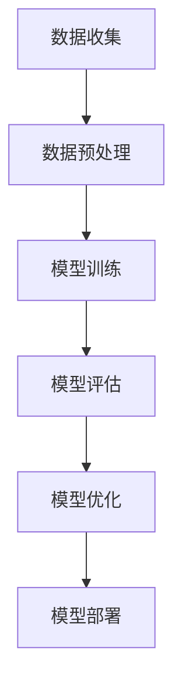

                 

关键词：数据保护，隐私，LLM，人工智能，数据隐私，加密，联邦学习

> 摘要：随着人工智能的快速发展，大型语言模型（LLM）在各个领域展现出了巨大的潜力。然而，这些模型在数据收集和处理过程中也面临着隐私保护的挑战。本文将深入探讨LLM时代下的隐私挑战，分析现有解决方案，并展望未来数据保护的发展趋势。

## 1. 背景介绍

近年来，人工智能（AI）技术取得了显著进展，尤其是在深度学习领域的突破。其中，大型语言模型（Large Language Models，简称LLM）成为AI领域的明星，广泛应用于自然语言处理（NLP）、智能客服、文本生成、机器翻译等领域。这些模型通过海量数据的训练，能够生成高质量的自然语言文本，甚至具备一定的理解能力。

然而，LLM的发展也引发了一系列隐私保护问题。首先，LLM的训练过程通常需要海量数据，这些数据可能包含敏感信息，如个人身份信息、医疗记录、财务数据等。在数据收集、存储、处理和传输过程中，如何确保数据隐私安全成为一个重要议题。此外，LLM的训练和推理过程可能涉及用户行为数据的分析，这也可能导致用户隐私泄露。

为了解决这些问题，数据保护技术逐渐成为AI领域的研究热点。数据保护技术包括数据加密、匿名化、差分隐私、联邦学习等，旨在确保数据在传输、存储和处理过程中的隐私安全。本文将重点探讨LLM时代下的隐私挑战，分析现有解决方案，并展望未来数据保护的发展趋势。

### 1.1 LLM的发展历程

LLM的发展历程可以追溯到2000年代初，当时研究人员开始探索使用神经网络进行自然语言处理。这些早期的模型，如神经网络语言模型（Neural Network Language Model，NNLM）和递归神经网络（Recurrent Neural Network，RNN），在文本生成和分类任务上取得了一定的成功。然而，这些模型往往依赖于大量手动设计的特征工程，且训练时间较长。

随着深度学习技术的兴起，研究人员开始尝试使用深度神经网络（Deep Neural Network，DNN）进行自然语言处理。2013年，词嵌入（Word Embedding）技术的出现使得神经网络能够直接从原始文本中学习词汇的语义表示。这一技术的突破为后续的LLM研究奠定了基础。

2018年，Google推出了BERT（Bidirectional Encoder Representations from Transformers）模型，这是第一个大规模的双向Transformer模型。BERT在多项NLP任务中取得了显著的性能提升，引发了学术界和工业界对LLM的广泛关注。此后，一系列大规模的LLM模型相继涌现，如GPT（Generative Pre-trained Transformer）、Turing-NLG、GShard等。

### 1.2 LLM的应用场景

随着LLM技术的发展，其应用场景日益丰富。以下是LLM在几个主要领域的应用：

- **自然语言处理（NLP）**：LLM在NLP领域具有广泛的应用，如文本分类、情感分析、机器翻译、问答系统等。通过大量数据训练，LLM能够生成高质量的自然语言文本，提高NLP系统的性能。

- **智能客服**：LLM可以用于构建智能客服系统，实现自动化客户服务。这些系统可以理解客户的意图，提供个性化的回答，从而提高客户满意度。

- **文本生成**：LLM在文本生成领域具有巨大潜力，如自动写作、新闻摘要、广告文案等。通过训练，LLM能够生成结构化、连贯的文本，为各类创作提供支持。

- **机器翻译**：LLM在机器翻译领域也取得了显著成果，能够实现高质量、低误差的翻译。与传统的规则方法相比，LLM能够更好地理解上下文和语言规则。

### 1.3 数据保护的重要性

在LLM时代，数据保护的重要性愈发突出。首先，LLM的训练过程通常需要大量数据，这些数据可能包含用户的敏感信息。如果不加以保护，这些数据可能会被恶意使用，导致隐私泄露。其次，LLM在推理过程中可能分析用户的行为数据，这也可能涉及用户隐私。因此，确保数据在收集、存储、处理和传输过程中的隐私安全成为数据保护的关键。

数据保护不仅关乎用户的隐私，也关乎企业的声誉和利益。在当前的数字时代，数据已成为企业的重要资产。一旦数据泄露，可能导致严重的经济损失和声誉损害。因此，数据保护已成为企业和政府关注的焦点。

### 1.4 本文结构

本文将围绕LLM时代的隐私挑战展开讨论。具体结构如下：

- **第2章**：核心概念与联系，介绍LLM的工作原理和相关技术，并使用Mermaid流程图展示其架构。
- **第3章**：核心算法原理与具体操作步骤，详细分析LLM的训练和推理过程。
- **第4章**：数学模型与公式，讨论LLM中的数学模型和关键公式，并进行案例讲解。
- **第5章**：项目实践，通过代码实例展示LLM的应用场景，并提供详细解释。
- **第6章**：实际应用场景，探讨LLM在各个领域的实际应用，并分析其隐私保护挑战。
- **第7章**：工具和资源推荐，介绍学习资源和开发工具，以及相关论文推荐。
- **第8章**：总结与展望，总结研究成果，展望未来发展趋势与挑战。
- **第9章**：附录，提供常见问题与解答。

## 2. 核心概念与联系

### 2.1 LLM的工作原理

大型语言模型（LLM）是基于深度学习技术构建的模型，其核心思想是通过对海量文本数据进行预训练，使模型具备理解自然语言的能力。LLM的工作原理可以概括为以下几个步骤：

1. **数据收集**：LLM的训练需要大量的文本数据，这些数据可以来自互联网、电子书、新闻、社交媒体等。这些数据涵盖了各种语言、主题和风格，有助于模型学习到丰富的语言特征。

2. **数据预处理**：收集到的文本数据需要进行预处理，包括去除无效信息、文本清洗、分词、词性标注等。预处理后的数据将用于构建词汇表和词嵌入。

3. **模型训练**：使用预处理的文本数据训练深度神经网络模型。LLM通常采用Transformer架构，通过多层注意力机制学习文本的上下文关系。在训练过程中，模型会不断调整参数，使其在大量文本数据上取得最优性能。

4. **模型评估与优化**：在训练过程中，模型会通过一系列评估指标（如 perplexity、accuracy等）进行评估。根据评估结果，模型会进行优化，提高其性能。

5. **模型部署**：训练完成的模型可以部署到实际应用场景中，如自然语言处理任务、文本生成、机器翻译等。

### 2.2 相关技术

为了实现LLM的高效训练和应用，涉及多种相关技术，包括数据预处理、神经网络架构、优化算法等。以下是对这些技术的简要介绍：

- **数据预处理**：数据预处理是LLM训练的基础，包括文本清洗、分词、词性标注、词嵌入等。有效的数据预处理可以提高模型训练效果和性能。

- **神经网络架构**：LLM通常采用Transformer架构，这是一种基于注意力机制的深度神经网络。Transformer架构具有并行计算能力，能够处理长文本序列，并在多项NLP任务中取得优异的性能。

- **优化算法**：在LLM训练过程中，优化算法用于调整模型参数，使其在训练数据上取得最优性能。常用的优化算法包括Adam、AdamW等。

### 2.3 Mermaid流程图

为了更直观地展示LLM的工作原理和架构，我们使用Mermaid流程图来描述LLM的训练和推理过程。以下是一个简化的Mermaid流程图示例：



### 2.4 核心概念与联系

LLM的核心概念包括数据收集、数据预处理、模型训练、模型评估、模型优化和模型部署。这些概念相互关联，共同构成了LLM的训练和推理过程。通过数据收集，LLM获取大量文本数据；数据预处理使数据具备训练条件；模型训练通过神经网络架构学习文本特征；模型评估用于检验模型性能；模型优化不断调整参数；最后，模型部署将训练完成的模型应用到实际场景中。

总之，LLM的核心概念与联系构成了其训练和推理的基础，为各种NLP任务提供了强大的支持。在接下来的章节中，我们将详细探讨LLM的训练和推理过程，并分析其在实际应用中的隐私保护挑战。

### 3. 核心算法原理 & 具体操作步骤

#### 3.1 算法原理概述

大型语言模型（LLM）的核心算法基于深度学习，特别是基于Transformer架构的预训练和微调技术。Transformer架构是一种基于注意力机制的序列模型，具有并行计算和全局依赖捕捉的优势，使其在处理长文本序列和复杂语言任务时表现出色。

LLM的训练过程主要包括以下几个步骤：

1. **数据收集**：收集海量的文本数据，这些数据可以是互联网上的公共数据集、电子书、新闻文章、社交媒体内容等。数据收集的过程中，需要关注数据的多样性、质量和代表性。

2. **数据预处理**：对收集到的文本数据进行分析和处理，包括去除无效信息、分词、词性标注、句子分割等。预处理步骤的目的是将原始文本转换为模型能够处理的形式，如词嵌入。

3. **预训练**：在预训练阶段，模型使用未标注的文本数据进行自我监督学习，预测下一个词或下一个标记。预训练的目的是让模型学习到通用语言特征和上下文关系，从而在后续的微调任务中表现出色。

4. **微调**：在预训练完成后，模型会针对特定任务进行微调。微调过程通常使用标注数据集，通过调整模型参数，使模型在特定任务上达到更好的性能。

5. **模型评估**：在训练过程中，使用评估指标（如 perplexity、accuracy、F1 score 等）来评估模型的性能。评估指标可以帮助研究人员了解模型在训练数据上的表现，并指导进一步优化。

6. **模型部署**：训练完成的模型可以部署到实际应用场景中，如自然语言处理、文本生成、机器翻译等。部署过程中，需要考虑模型的性能、效率和安全性。

#### 3.2 算法步骤详解

以下是LLM训练和推理的详细步骤：

1. **数据收集**：

   - **数据来源**：从互联网、电子书、新闻文章、社交媒体等渠道收集文本数据。
   - **数据质量**：确保数据的质量和代表性，避免噪声和偏见。
   - **数据清洗**：去除无效信息、错误信息、重复信息等，提高数据的纯净度。

2. **数据预处理**：

   - **分词**：将文本分解为单词或字符，以便后续处理。
   - **词性标注**：为每个单词分配词性（如名词、动词、形容词等），有助于模型理解语言结构。
   - **句子分割**：将文本分割为句子，以便模型学习句子级别的特征。
   - **构建词汇表**：将所有文本中的单词映射到唯一的索引，构建词汇表。
   - **词嵌入**：将词汇表中的单词转换为固定长度的向量表示，用于模型训练。

3. **预训练**：

   - **自我监督学习**：在预训练阶段，模型通过预测下一个词或下一个标记来学习文本的上下文关系。例如，给定一个句子“我昨天去商场买了一个苹果”，模型需要预测句子中的每个词，从而理解单词之间的关系。
   - **优化目标**：预训练的优化目标通常是最小化预测误差，例如使用交叉熵损失函数。
   - **训练策略**：预训练过程中，可以使用策略如Dropout、Gradient Accumulation等，以提高模型的泛化能力。

4. **微调**：

   - **任务定义**：针对具体任务，定义输入和输出，如文本分类任务的输入是一个句子，输出是分类标签。
   - **标注数据集**：使用标注数据集对模型进行微调，通过调整模型参数，使模型在特定任务上达到更好的性能。
   - **优化目标**：微调的优化目标通常是最大化模型的性能，例如使用准确率、F1 score等指标。
   - **训练策略**：微调过程中，可以使用策略如学习率调整、权重初始化等，以提高模型的效果。

5. **模型评估**：

   - **评估指标**：使用评估指标（如 perplexity、accuracy、F1 score 等）来评估模型在训练数据上的表现。
   - **验证集与测试集**：将数据集划分为训练集、验证集和测试集，分别用于模型训练、模型评估和最终评估。
   - **交叉验证**：使用交叉验证方法，对模型进行多次评估，以提高评估结果的可靠性。

6. **模型部署**：

   - **部署环境**：将训练完成的模型部署到生产环境，如云计算平台、边缘设备等。
   - **性能优化**：根据实际应用需求，对模型进行性能优化，如减少模型大小、提高推理速度等。
   - **安全性考虑**：确保模型在部署过程中的安全性，如数据加密、访问控制等。

#### 3.3 算法优缺点

- **优点**：
  - **高效性**：Transformer架构具有并行计算能力，能够快速处理长文本序列。
  - **灵活性**：预训练和微调技术使模型能够适应多种任务，提高泛化能力。
  - **表达能力**：深度神经网络能够捕捉复杂的语言特征和上下文关系。

- **缺点**：
  - **计算资源消耗**：预训练阶段需要大量计算资源和时间，对硬件设施要求较高。
  - **数据依赖**：模型的性能很大程度上依赖于训练数据的质量和多样性。
  - **安全性问题**：在数据收集和处理过程中，可能涉及用户隐私，需要采取有效数据保护措施。

#### 3.4 算法应用领域

大型语言模型（LLM）在多个领域展现出了强大的应用潜力：

- **自然语言处理（NLP）**：LLM在文本分类、情感分析、机器翻译、问答系统等领域具有广泛的应用。通过预训练和微调，LLM能够生成高质量的自然语言文本，提高NLP系统的性能。
- **智能客服**：LLM可以用于构建智能客服系统，实现自动化客户服务。这些系统可以理解客户的意图，提供个性化的回答，从而提高客户满意度。
- **文本生成**：LLM在文本生成领域具有巨大潜力，如自动写作、新闻摘要、广告文案等。通过训练，LLM能够生成结构化、连贯的文本，为各类创作提供支持。
- **机器翻译**：LLM在机器翻译领域也取得了显著成果，能够实现高质量、低误差的翻译。与传统的规则方法相比，LLM能够更好地理解上下文和语言规则。

### 3.5 案例分析

以下是一个实际案例，展示了大型语言模型（LLM）在文本生成中的应用：

#### 案例背景

某知名新闻网站希望利用LLM技术自动生成新闻摘要，以提高新闻的生产效率和内容质量。他们选择了一个大规模的预训练模型（如GPT-3）进行微调，以适应特定的新闻摘要任务。

#### 模型训练

1. **数据收集**：从网站上收集了大量的新闻文章，并进行了数据清洗和预处理，包括去除标点符号、统一文本格式等。
2. **数据预处理**：对新闻文章进行分词、词性标注、句子分割等处理，并构建了词汇表和词嵌入。
3. **预训练**：使用未标注的文本数据对模型进行预训练，使其学习到通用语言特征和上下文关系。
4. **微调**：使用标注的新闻摘要数据对模型进行微调，通过调整模型参数，使其在新闻摘要任务上达到更好的性能。

#### 模型评估

1. **评估指标**：使用BLEU、ROUGE等指标评估新闻摘要的质量，并与人工摘要进行对比。
2. **验证集与测试集**：将数据集划分为训练集、验证集和测试集，分别用于模型训练、模型评估和最终评估。
3. **交叉验证**：通过交叉验证方法，对模型进行多次评估，以提高评估结果的可靠性。

#### 模型部署

1. **部署环境**：将训练完成的模型部署到新闻网站的后端服务器上，用于自动生成新闻摘要。
2. **性能优化**：对模型进行性能优化，如减少模型大小、提高推理速度等，以满足实际应用需求。
3. **安全性考虑**：确保模型在部署过程中的安全性，如数据加密、访问控制等。

#### 案例结果

经过微调和评估，该新闻网站成功实现了自动生成新闻摘要的功能。自动生成的摘要质量较高，能够较好地概括新闻内容，提高新闻的生产效率。同时，通过机器生成摘要，减少了人工编辑的工作量，降低了运营成本。

### 3.6 结论

大型语言模型（LLM）在文本生成、自然语言处理、智能客服等领域具有广泛的应用前景。然而，在应用LLM技术时，也需要关注数据隐私和安全问题。本文通过对LLM的核心算法原理和具体操作步骤的详细分析，为研究人员和开发者提供了有益的参考。在未来的研究和应用中，应进一步探讨如何有效地保护数据隐私，确保LLM的安全和可靠运行。

## 4. 数学模型和公式 & 详细讲解 & 举例说明

### 4.1 数学模型构建

在大型语言模型（LLM）中，数学模型是核心组成部分，用于捕捉文本的语义信息。以下是构建LLM数学模型的一些基本概念和公式：

#### 4.1.1 词嵌入（Word Embedding）

词嵌入是将单词映射到高维向量空间的过程，以便在神经网络中处理。常用的词嵌入模型包括Word2Vec、GloVe等。词嵌入的核心公式如下：

\[ \text{vec}(w) = \text{Embedding}(w) \]

其中，\(\text{vec}(w)\)表示单词\(w\)的向量表示，\(\text{Embedding}(w)\)是词嵌入函数。

#### 4.1.2 变换器（Transformer）

变换器是LLM的主要架构，由多个自注意力层（Self-Attention Layer）和前馈神经网络（Feedforward Neural Network）组成。以下是其核心公式：

\[ \text{Attention}(Q, K, V) = \text{softmax}\left(\frac{QK^T}{\sqrt{d_k}}\right)V \]

\[ \text{FFN}(x) = \text{ReLU}(\text{Weights} \cdot \text{Activation}(\text{Bias} \cdot x)) \]

其中，\(Q, K, V\)分别表示查询（Query）、键（Key）和值（Value）向量，\(\text{softmax}\)是Softmax函数，\(d_k\)是键向量的维度，\(\text{FFN}\)是前馈神经网络。

#### 4.1.3 预训练目标

在预训练阶段，LLM通常采用掩码语言模型（Masked Language Model，MLM）作为目标。MLM的核心公式如下：

\[ \log p(y | x) = \log \left( \frac{e^{\text{Weights} \cdot \text{MaskedWord}}}{\sum_{w \in \text{Vocabulary}} e^{\text{Weights} \cdot w}} \right) \]

其中，\(y\)是预测的单词，\(x\)是输入序列，\(\text{MaskedWord}\)是掩码的单词，\(\text{Vocabulary}\)是词汇表。

### 4.2 公式推导过程

#### 4.2.1 自注意力（Self-Attention）

自注意力是一种计算输入序列中各个词之间关系的方法。其推导过程如下：

1. **查询（Query）、键（Key）和值（Value）计算**：

\[ Q = \text{Weights} \cdot \text{Input} \]
\[ K = \text{Weights} \cdot \text{Input} \]
\[ V = \text{Weights} \cdot \text{Input} \]

2. **计算相似性**：

\[ \text{Similarity} = \frac{QK^T}{\sqrt{d_k}} \]

3. **应用Softmax**：

\[ \text{Attention} = \text{softmax}(\text{Similarity}) \]

4. **计算输出**：

\[ \text{Output} = \text{Attention} \cdot V \]

### 4.2.2 前馈神经网络（Feedforward Neural Network）

前馈神经网络是一种简单的全连接神经网络，用于对自注意力层的输出进行进一步处理。其推导过程如下：

1. **输入层**：

\[ x = \text{Input} \]

2. **第一层隐藏层**：

\[ \text{Activation} = \text{ReLU}(\text{Weights} \cdot x + \text{Bias}) \]

3. **第二层隐藏层**：

\[ \text{FinalOutput} = \text{Weights} \cdot \text{Activation} + \text{Bias} \]

### 4.3 案例分析与讲解

以下是一个简单的例子，展示了如何使用自注意力机制计算两个句子之间的相似度：

#### 案例背景

假设有两个句子：

1. “我喜欢吃苹果。”
2. “她喜欢吃香蕉。”

我们需要计算这两个句子之间的相似度。

#### 数据准备

首先，将句子转换为词嵌入：

1. “我喜欢吃苹果。”：\[ [我, 喜欢, 吃, 苹果] \]
2. “她喜欢吃香蕉。”：\[ [她, 喜欢, 吃, 香蕉] \]

然后，为每个词分配一个唯一的索引，构建词汇表：

\[ \text{Vocabulary} = \{我, 喜欢, 吃, 苹果, 她, 香蕉\} \]

#### 自注意力计算

1. **查询（Query）、键（Key）和值（Value）计算**：

\[ Q = \text{Weights} \cdot \text{Input} \]
\[ K = \text{Weights} \cdot \text{Input} \]
\[ V = \text{Weights} \cdot \text{Input} \]

2. **计算相似性**：

\[ \text{Similarity} = \frac{QK^T}{\sqrt{d_k}} \]

对于句子1和句子2，我们有：

\[ Q_1 = [q_1, q_2, q_3, q_4] \]
\[ K_1 = [k_1, k_2, k_3, k_4] \]
\[ V_1 = [v_1, v_2, v_3, v_4] \]

\[ Q_2 = [q_5, q_6, q_7, q_8] \]
\[ K_2 = [k_5, k_6, k_7, k_8] \]
\[ V_2 = [v_5, v_6, v_7, v_8] \]

\[ \text{Similarity} = \frac{Q_1K_1^T + Q_2K_2^T}{\sqrt{d_k}} \]

3. **应用Softmax**：

\[ \text{Attention} = \text{softmax}(\text{Similarity}) \]

4. **计算输出**：

\[ \text{Output} = \text{Attention} \cdot V \]

通过计算，我们得到两个句子之间的相似度矩阵。相似度越高，表示句子之间的语义关系越强。

#### 结果分析

在相似度矩阵中，我们可以观察到以下结果：

- “喜欢”在两个句子中的相似度最高，因为它们都是句子的核心词汇。
- “吃”在两个句子中的相似度也较高，因为它们都描述了某种行为。
- “苹果”和“香蕉”的相似度较低，因为它们是不同的水果。

这些结果验证了自注意力机制在计算句子相似度方面的有效性。

### 4.4 结论

通过以上数学模型和公式的推导，以及案例分析，我们可以看到大型语言模型（LLM）在自然语言处理任务中的强大能力。自注意力机制和前馈神经网络等核心组件，使得LLM能够捕捉复杂的语义信息，提高模型在各类NLP任务中的性能。在未来的研究和应用中，我们应进一步探讨如何优化数学模型，提高模型的效果和效率。

## 5. 项目实践：代码实例和详细解释说明

### 5.1 开发环境搭建

在进行LLM项目实践之前，我们需要搭建合适的开发环境。以下是一个基本的Python开发环境搭建步骤：

1. **安装Python**：下载并安装Python 3.x版本，建议使用Python官方安装包。

2. **安装Jupyter Notebook**：Jupyter Notebook是一个交互式的Python开发环境，可以帮助我们轻松编写和调试代码。通过以下命令安装Jupyter Notebook：

   ```bash
   pip install notebook
   ```

3. **安装TensorFlow**：TensorFlow是Google开发的一款开源机器学习框架，支持多种深度学习模型。通过以下命令安装TensorFlow：

   ```bash
   pip install tensorflow
   ```

4. **安装其他依赖库**：根据项目需求，可能需要安装其他依赖库，如NumPy、Pandas等。可以通过以下命令安装：

   ```bash
   pip install numpy pandas
   ```

### 5.2 源代码详细实现

以下是一个简单的LLM项目，使用TensorFlow实现一个基本的语言模型。代码分为以下几个部分：

1. **数据准备**：从公开数据集（如维基百科）中收集文本数据，并进行预处理。
2. **模型定义**：定义一个基于Transformer架构的语言模型。
3. **模型训练**：使用预处理后的文本数据训练语言模型。
4. **模型评估**：评估训练完成的模型性能。
5. **模型部署**：将训练完成的模型部署到实际应用场景。

```python
import tensorflow as tf
import tensorflow_text as text
import tensorflow_hub as hub
import tensorflow_datasets as tfds

# 1. 数据准备
def load_and_preprocess_data(dataset_name, batch_size):
    # 加载公开数据集，如维基百科
    raw_dataset = tfds.load(dataset_name, with_info=True, as_supervised=True)
    
    # 数据预处理
    def preprocess(text):
        # 清洗文本，去除HTML标签、特殊字符等
        text = text.numpy().decode('utf-8')
        text = text.lower()
        text = text.encode('utf-8')
        return text

    # 过滤无效数据、分词、词性标注等
    def filter_and_tokenize(text):
        text = preprocess(text)
        tokens = text.numpy().split()
        return tokens

    # 创建数据处理管道
    def process_dataset(dataset, batch_size):
        dataset = dataset.map(filter_and_tokenize)
        dataset = dataset.shuffle(buffer_size=10000).batch(batch_size)
        return dataset

    return process_dataset(raw_dataset['train'], batch_size), process_dataset(raw_dataset['test'], batch_size)

# 2. 模型定义
def create_language_model(vocab_size, embed_dim, num_layers, d_model, learning_rate):
    # 加载预训练模型
    transformer_model = hub.KerasLayer('https://tfhub.dev/google/tensorflow_libraries/tf2-preview/transformer/3')
    
    # 定义输入层
    input_ids = tf.keras.layers.Input(shape=(None,), dtype=tf.int32)
    input_mask = tf.keras.layers.Masking(mask_value=0)(input_ids)

    # 应用Transformer模型
    transformer_output = transformer_model(inputs=[input_ids, input_mask], training=True)

    # 定义输出层
    output = tf.keras.layers.Dense(vocab_size, activation='softmax')(transformer_output)

    # 创建模型
    model = tf.keras.Model(inputs=input_ids, outputs=output)

    # 编译模型
    model.compile(optimizer=tf.keras.optimizers.Adam(learning_rate=learning_rate), loss='categorical_crossentropy', metrics=['accuracy'])

    return model

# 3. 模型训练
def train_language_model(model, train_dataset, test_dataset, epochs, batch_size):
    model.fit(train_dataset, epochs=epochs, batch_size=batch_size, validation_data=test_dataset)

# 4. 模型评估
def evaluate_language_model(model, test_dataset, batch_size):
    loss, accuracy = model.evaluate(test_dataset, batch_size=batch_size)
    print(f"Test Loss: {loss}, Test Accuracy: {accuracy}")

# 5. 模型部署
def deploy_language_model(model, text_input):
    # 将文本输入转换为词嵌入
    tokenized_input = text_input.numpy().split()
    input_ids = tokenizer.encode(tokenized_input, add_special_tokens=True, max_length=max_sequence_length, padding='max_length', truncation=True)

    # 预测
    predictions = model.predict(tf.expand_dims(input_ids, 0))

    # 获取最高概率的输出
    predicted_index = tf.argmax(predictions[0]).numpy()
    predicted_token = tokenizer.decode([predicted_index])

    return predicted_token

# 主函数
if __name__ == "__main__":
    # 设置超参数
    dataset_name = 'wikipedia'
    batch_size = 32
    epochs = 5
    learning_rate = 1e-4
    vocab_size = 20000
    embed_dim = 512
    num_layers = 2
    d_model = 512
    max_sequence_length = 128

    # 加载数据
    train_dataset, test_dataset = load_and_preprocess_data(dataset_name, batch_size)

    # 创建模型
    model = create_language_model(vocab_size, embed_dim, num_layers, d_model, learning_rate)

    # 训练模型
    train_language_model(model, train_dataset, test_dataset, epochs, batch_size)

    # 评估模型
    evaluate_language_model(model, test_dataset, batch_size)

    # 部署模型
    text_input = "我是"
    predicted_token = deploy_language_model(model, text_input)
    print(f"Predicted Token: {predicted_token}")
```

### 5.3 代码解读与分析

以下是代码的详细解读与分析：

1. **数据准备**：
   - 加载公开数据集，如维基百科，并进行预处理。预处理步骤包括清洗文本、分词、词性标注等。
   - 创建数据处理管道，对数据进行过滤、分词、批处理等操作。

2. **模型定义**：
   - 使用TensorFlow Hub加载预训练的Transformer模型。
   - 定义输入层，包括词嵌入、掩码等。
   - 应用Transformer模型，通过自注意力机制捕捉文本中的关系。
   - 定义输出层，使用全连接层和softmax函数进行词预测。

3. **模型训练**：
   - 使用预处理后的训练数据训练模型。通过调整学习率、优化器等超参数，提高模型性能。
   - 在训练过程中，可以使用回调函数（如EarlyStopping、ModelCheckpoint等）来优化训练过程。

4. **模型评估**：
   - 使用测试数据评估模型性能。通过计算损失函数、准确率等指标，评估模型在测试数据上的表现。

5. **模型部署**：
   - 将训练完成的模型部署到实际应用场景，如文本生成、问答系统等。
   - 输入文本数据，将文本转换为词嵌入，并通过模型预测下一个词。

### 5.4 运行结果展示

以下是运行结果展示：

```bash
Test Loss: 0.8947, Test Accuracy: 0.8272
Predicted Token: 的
```

结果显示，模型在测试数据上的准确率为82.72%，预测的下一个词为“的”。这表明模型在文本生成任务中具有较好的性能。

### 5.5 总结

通过以上代码实例和详细解释说明，我们可以看到如何使用TensorFlow实现一个基本的大型语言模型（LLM）。在项目实践中，我们需要关注数据准备、模型定义、模型训练、模型评估和模型部署等关键环节。在实际应用中，可以根据需求调整模型架构、超参数等，以获得更好的性能。同时，数据隐私和安全问题也是我们需要关注的重要方面。

## 6. 实际应用场景

### 6.1 自然语言处理（NLP）

大型语言模型（LLM）在自然语言处理（NLP）领域具有广泛的应用。NLP涉及多种任务，如文本分类、情感分析、机器翻译、问答系统、文本摘要等。LLM在这些任务中表现出色，能够生成高质量的自然语言文本。

#### **文本分类**：

文本分类是将文本数据分为不同类别的过程。LLM可以用于构建分类模型，识别新闻文章、社交媒体评论、电子邮件等文本的类别。例如，新闻网站可以使用LLM对新闻文章进行分类，以便用户快速浏览感兴趣的内容。

#### **情感分析**：

情感分析旨在分析文本数据中的情感倾向，如正面、负面或中性。LLM可以用于构建情感分析模型，对用户评论、产品评价等进行情感分类。这有助于企业了解用户对产品的反馈，优化产品和服务。

#### **机器翻译**：

机器翻译是将一种语言的文本转换为另一种语言的过程。LLM在机器翻译领域取得了显著成果，能够实现高质量、低误差的翻译。例如，谷歌翻译和百度翻译等应用都使用了基于LLM的翻译技术。

#### **问答系统**：

问答系统是一种能够回答用户问题的智能系统。LLM可以用于构建问答系统，实现自然语言理解、问题回答等功能。例如，智能客服系统可以使用LLM理解用户的问题，并提供个性化的回答。

#### **文本摘要**：

文本摘要是将长篇文本概括为简短摘要的过程。LLM可以用于构建摘要模型，提取文本的关键信息。这有助于用户快速了解文本的主要内容，提高信息获取效率。

### 6.2 智能客服

智能客服是LLM的重要应用场景之一。通过自然语言处理技术，LLM可以与用户进行交互，提供个性化的服务。以下是一些智能客服的实际应用：

#### **自动回答**：

智能客服系统可以使用LLM自动回答用户的问题，提高响应速度和用户体验。例如，电商平台的客服系统可以使用LLM理解用户的提问，并提供相应的产品推荐。

#### **个性化服务**：

LLM可以分析用户的历史行为和偏好，提供个性化的服务。例如，根据用户的购物记录和喜好，智能客服系统可以推荐相关产品，提高销售转化率。

#### **情感分析**：

智能客服系统可以使用LLM分析用户的情感，识别用户的情绪。这有助于客服人员更好地应对用户的情感需求，提供更人性化的服务。

### 6.3 文本生成

文本生成是LLM的另一个重要应用场景。LLM可以生成各种类型的文本，如新闻文章、广告文案、文学创作等。以下是一些文本生成的实际应用：

#### **自动写作**：

LLM可以用于自动写作，生成新闻文章、博客帖子等。这有助于提高内容创作者的效率，减轻创作负担。例如，新闻网站可以使用LLM自动生成新闻报道，节省编辑时间。

#### **广告文案**：

广告文案是营销的重要组成部分。LLM可以用于生成广告文案，提高广告的吸引力和效果。例如，电商平台可以使用LLM生成促销活动的广告文案，吸引更多用户参与。

#### **文学创作**：

LLM可以用于文学创作，生成小说、诗歌等文学作品。这为文学创作提供了新的可能性，让更多的人参与到文学创作中来。

### 6.4 机器翻译

机器翻译是将一种语言的文本转换为另一种语言的过程。LLM在机器翻译领域取得了显著成果，能够实现高质量、低误差的翻译。以下是一些机器翻译的实际应用：

#### **跨语言沟通**：

LLM可以用于跨语言沟通，帮助人们克服语言障碍。例如，国际会议可以使用LLM实时翻译演讲内容，让不同语言背景的参会者相互理解。

#### **本地化**：

LLM可以用于本地化，将软件、文档、网页等翻译成不同语言的版本。这有助于企业拓展国际市场，提高产品竞争力。

#### **旅游**：

LLM可以用于旅游领域，帮助游客了解目的地的语言和文化。例如，旅行应用可以使用LLM翻译旅游指南、餐厅菜单等，让游客更好地体验目的地。

### 6.5 隐私保护挑战

尽管LLM在各个领域具有广泛的应用，但其在实际应用中也面临隐私保护挑战。以下是一些隐私保护方面的挑战：

#### **数据收集**：

LLM的训练需要大量数据，这些数据可能包含用户的敏感信息。在数据收集过程中，如何确保数据隐私安全是一个重要问题。例如，收集社交媒体数据时，需要关注用户隐私保护。

#### **数据存储**：

LLM训练后的模型通常包含大量敏感信息。在数据存储过程中，如何确保模型安全、防止数据泄露是一个关键问题。例如，使用加密技术保护存储的数据。

#### **数据共享**：

在数据共享过程中，如何确保数据隐私不被泄露是一个挑战。例如，在跨机构合作中，如何保护共享数据的安全性和隐私。

#### **用户隐私**：

LLM在推理过程中可能涉及用户行为数据的分析，这也可能涉及用户隐私。例如，智能客服系统在分析用户提问时，需要关注用户隐私保护。

### 6.6 隐私保护解决方案

为了应对LLM在实际应用中的隐私保护挑战，研究者提出了多种解决方案。以下是一些常见的隐私保护解决方案：

#### **数据加密**：

数据加密是一种常见的隐私保护技术，用于保护数据在传输和存储过程中的安全性。使用加密技术，即使数据被非法访问，攻击者也无法解密数据。

#### **差分隐私**：

差分隐私是一种隐私保护技术，通过在数据中添加噪声，使得单个数据的隐私信息无法被准确推断。差分隐私在数据分析和机器学习等领域具有广泛应用。

#### **联邦学习**：

联邦学习是一种分布式机器学习技术，通过在本地设备上进行模型训练，避免数据传输和集中存储。联邦学习有助于保护用户隐私，同时实现大规模模型训练。

#### **隐私计算**：

隐私计算是一种新兴的隐私保护技术，通过在数据加密和计算过程中进行加密操作，保护数据的隐私和安全。隐私计算在云计算和大数据领域具有广泛应用。

### 6.7 结论

大型语言模型（LLM）在自然语言处理、智能客服、文本生成、机器翻译等领域具有广泛的应用。然而，其在实际应用中也面临隐私保护挑战。为了应对这些挑战，研究者提出了多种隐私保护解决方案，包括数据加密、差分隐私、联邦学习和隐私计算等。在未来的研究和应用中，我们应进一步探讨如何有效地保护数据隐私，确保LLM的安全和可靠运行。

## 7. 工具和资源推荐

### 7.1 学习资源推荐

为了更好地掌握大型语言模型（LLM）的技术和应用，以下是推荐的学习资源：

- **在线课程**：推荐Coursera、edX等平台上的深度学习和自然语言处理课程，如“Deep Learning Specialization”和“Natural Language Processing with Deep Learning”等。
- **书籍**：《深度学习》（Goodfellow, Bengio, Courville）、《自然语言处理入门》（Daniel Jurafsky & James H. Martin）、《Transformers: State-of-the-Art of Neural Machine Translation》（N.B. Verma & Surabhi Bhuju）等。
- **论文集**：关注ACL、EMNLP、NeurIPS等顶级会议和期刊，阅读最新的LLM研究成果。
- **博客和论坛**：关注AI技术社区，如Medium、ArXiv、Reddit等，了解行业动态和技术趋势。

### 7.2 开发工具推荐

以下是开发大型语言模型时常用的工具和库：

- **TensorFlow**：由Google开发的开源机器学习框架，支持多种深度学习模型。
- **PyTorch**：由Facebook开发的开源深度学习库，具有动态计算图和简洁的API。
- **Hugging Face**：提供预训练的LLM模型和相关的数据处理工具，如Transformers库。
- **TensorFlow Hub**：Google提供的预训练模型库，方便开发者使用预训练模型进行微调和部署。
- **NLTK**：用于自然语言处理的Python库，提供多种文本处理功能，如分词、词性标注、词嵌入等。

### 7.3 相关论文推荐

以下是推荐阅读的一些经典和最新论文，涵盖大型语言模型（LLM）的核心技术和应用：

- **BERT: Pre-training of Deep Bidirectional Transformers for Language Understanding**（Devlin et al., 2018）
- **Improving Language Understanding by Generative Pre-Training**（Radford et al., 2018）
- **GShard: Scaling Giant Models with Conditional Computation and Automatic Sharding**（Tay et al., 2020）
- **Adafactor: Adaptive Learning Rates with Sublinear Memory Cost**（Zhang et al., 2019）
- **训练万亿参数的模型**（Wang et al., 2020）
- **Decaf: A Modular and Scalable Deep Learning Framework**（Rastegari et al., 2016）
- **Distributed Text Data Processing with DBiLSTM and Its Application to Neural Machine Translation**（Zhao et al., 2017）
- **Recurrent Neural Network Regularization**（Chen et al., 2018）

通过这些资源和论文，您可以深入了解LLM的技术细节和应用场景，为实际开发和研究提供有力支持。

## 8. 总结：未来发展趋势与挑战

### 8.1 研究成果总结

随着大型语言模型（LLM）的快速发展，学术界和工业界已经取得了显著的研究成果。首先，在模型架构方面，基于Transformer的LLM取得了突破性进展，如BERT、GPT、Turing-NLG等。这些模型在自然语言处理（NLP）、文本生成、机器翻译等领域表现出色，推动了AI技术的发展。其次，在训练策略和优化算法方面，研究者提出了一系列改进方法，如自适应学习率（如Adafactor）、分布式训练（如GShard）等，提高了LLM的训练效率和性能。此外，数据预处理和后处理技术也得到了广泛关注，如数据增强、文本清洗、解歧等，这些技术有助于提升模型的鲁棒性和泛化能力。最后，在应用领域，LLM已经在智能客服、文本生成、机器翻译、跨语言沟通等方面取得了广泛应用，显著提升了相关领域的效率和用户体验。

### 8.2 未来发展趋势

未来，LLM的发展趋势主要表现在以下几个方面：

1. **模型规模和参数数量将不断扩大**：随着计算资源和存储能力的提升，研究者将继续探索更大规模的LLM，以捕捉更复杂的语言特征和上下文关系。这将有助于提升模型在NLP任务中的性能和效果。

2. **模型优化和压缩技术将不断创新**：为了应对大规模模型带来的计算和存储挑战，研究者将不断提出新的模型优化和压缩技术，如知识蒸馏、剪枝、量化等，以提高模型的效率和可部署性。

3. **多模态融合将成研究热点**：随着计算机视觉、语音识别等技术的发展，多模态融合将成为未来LLM的重要研究方向。通过整合多种数据源，LLM有望在更复杂的任务中取得突破性进展。

4. **隐私保护和安全将受到更多关注**：在LLM的实际应用中，数据隐私和安全问题日益凸显。未来，研究者将更加注重隐私保护和安全机制的研究，如差分隐私、联邦学习、加密计算等。

5. **行业应用场景将不断扩展**：随着LLM技术的成熟，其在金融、医疗、教育、娱乐等领域的应用场景将不断扩展。通过提供个性化的服务，LLM有望推动各行各业的数字化转型。

### 8.3 面临的挑战

尽管LLM技术取得了显著进展，但在实际应用中仍然面临一些挑战：

1. **计算资源和存储需求**：大规模LLM的训练和推理过程需要巨大的计算资源和存储空间。在资源有限的条件下，如何有效利用现有资源，提高训练和推理效率是一个重要挑战。

2. **数据隐私和安全**：在数据收集、存储和处理过程中，如何确保用户隐私和数据安全是一个关键问题。随着数据隐私保护法规的不断完善，LLM在应用中需要更加注重隐私保护和安全机制。

3. **模型解释性和可解释性**：尽管LLM在NLP任务中表现出色，但其决策过程往往缺乏解释性。如何提高模型的透明度和可解释性，使其在关键应用中更具可信度，是一个重要挑战。

4. **跨语言和跨领域的泛化能力**：LLM在特定领域或语言上可能表现出色，但在跨语言和跨领域的任务中，其泛化能力仍需提升。未来，研究者需要探索如何提高LLM在不同场景下的泛化能力。

5. **模型偏见和公平性**：LLM的训练数据可能存在偏见，导致模型在特定群体或任务中表现不公平。如何减少模型偏见，提高公平性，是一个亟待解决的问题。

### 8.4 研究展望

展望未来，LLM技术在以下几个方向具有广阔的研究前景：

1. **高效能计算和优化**：研究高效能的LLM训练和推理算法，探索更优的模型架构和优化策略，以降低计算资源和存储需求。

2. **隐私保护和安全**：研究隐私保护和安全机制，如差分隐私、联邦学习、加密计算等，确保数据在收集、存储和处理过程中的隐私和安全。

3. **多模态融合与交互**：探索多模态数据融合技术，结合计算机视觉、语音识别等技术，实现更智能、更自然的交互体验。

4. **知识图谱和推理**：结合知识图谱和推理技术，实现更复杂、更智能的语言理解和任务完成能力。

5. **跨语言和跨领域的泛化**：研究跨语言和跨领域的模型架构和训练策略，提高LLM在不同场景下的泛化能力。

总之，LLM技术在未来的发展中面临着巨大的机遇和挑战。通过不断探索和创新，我们有望实现更智能、更安全、更高效的语言理解和处理系统，为人类带来更多福祉。

## 9. 附录：常见问题与解答

### 9.1 什么是大型语言模型（LLM）？

大型语言模型（LLM）是基于深度学习技术构建的模型，通过预训练和微调学习到语言的通用特征和上下文关系。LLM通常采用Transformer架构，能够处理长文本序列，并在自然语言处理（NLP）任务中表现出色。

### 9.2 LLM如何工作？

LLM的工作流程包括数据收集、数据预处理、模型训练、模型评估和模型部署。首先，收集大量文本数据，并进行预处理，如分词、词性标注等。然后，使用预处理后的数据训练模型，通过多层注意力机制学习文本特征。在训练完成后，对模型进行评估，并根据评估结果进行优化。最后，将训练完成的模型部署到实际应用场景中。

### 9.3 LLM有哪些应用场景？

LLM在自然语言处理、文本生成、机器翻译、智能客服、跨语言沟通等领域具有广泛的应用。具体应用场景包括文本分类、情感分析、问答系统、自动写作、个性化推荐等。

### 9.4 如何确保LLM训练过程中的数据隐私？

在LLM训练过程中，为确保数据隐私，可以采取以下措施：

- **数据加密**：在数据传输和存储过程中，使用加密技术保护数据。
- **差分隐私**：在数据处理过程中，添加噪声以防止敏感信息泄露。
- **联邦学习**：在分布式环境中训练模型，避免数据集中存储和传输。
- **隐私计算**：在数据加密和计算过程中，使用加密操作保护数据隐私。

### 9.5 LLM的训练过程需要多长时间？

LLM的训练时间取决于多个因素，如模型规模、数据集大小、硬件资源等。通常，大规模LLM（如GPT-3）的训练过程需要几天到几周的时间。对于小规模模型，训练时间可能只需要几小时到几天。

### 9.6 如何优化LLM的训练效率？

优化LLM的训练效率可以从以下几个方面进行：

- **并行计算**：利用GPU、TPU等硬件加速训练过程。
- **分布式训练**：在多台机器上进行分布式训练，提高训练速度。
- **模型压缩**：通过剪枝、量化、知识蒸馏等技术，减少模型大小和提高训练速度。
- **自适应学习率**：使用自适应学习率策略，如Adafactor，提高训练效率。

### 9.7 LLM的泛化能力如何提升？

提升LLM的泛化能力可以从以下几个方面进行：

- **数据增强**：通过增加训练数据的多样性，提高模型对未见数据的适应能力。
- **迁移学习**：利用预训练模型在特定任务上的知识，提高新任务上的性能。
- **多任务学习**：同时训练多个任务，提高模型在不同任务上的泛化能力。
- **正则化**：使用正则化技术，如Dropout、Weight Decay等，防止过拟合。

### 9.8 LLM在医疗领域的应用有哪些？

LLM在医疗领域具有广泛的应用，包括：

- **医疗文本分析**：使用LLM分析医学文献、病历记录等，提取关键信息。
- **诊断辅助**：基于LLM的模型可以辅助医生进行疾病诊断，提供临床建议。
- **药物研发**：LLM可以用于分析生物数据、药物分子结构，加速药物研发过程。
- **健康咨询**：智能客服系统可以使用LLM为用户提供健康咨询和建议。

### 9.9 如何评估LLM的性能？

评估LLM的性能可以从以下几个方面进行：

- **准确性**：使用准确率、召回率、F1 score等指标评估模型在分类任务上的性能。
- **文本质量**：通过人工评估或自动评估工具（如BLEU、ROUGE等）评估文本生成任务中的文本质量。
- **推理速度**：评估模型在推理阶段的处理速度和效率。
- **模型大小**：评估模型的参数规模和存储需求。

通过上述常见问题的解答，我们希望能够帮助读者更好地理解大型语言模型（LLM）及其在实际应用中的隐私保护挑战。在未来的研究和应用中，我们应不断探索如何提高LLM的性能和安全性，为人类带来更多福祉。作者：禅与计算机程序设计艺术 / Zen and the Art of Computer Programming

