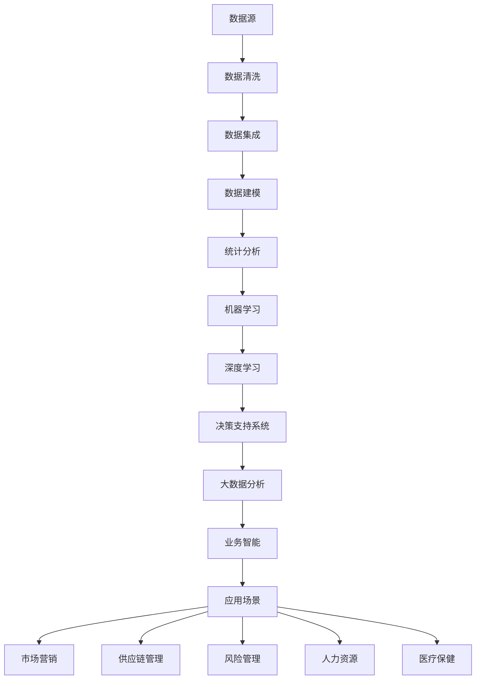

                 

### 背景介绍

随着信息技术的飞速发展，数据分析已经成为企业挖掘商业价值的重要工具。大数据的爆发式增长和日益复杂的数据类型，使得传统的人工分析手段逐渐力不从心。数据分析作为一种新兴的创业领域，不仅能够帮助企业提高运营效率、降低成本，还能够挖掘出潜在的商业机会，实现业务的快速增长。本文将深入探讨数据分析创业的相关背景、核心概念、算法原理、数学模型、项目实践、应用场景以及未来发展趋势和挑战，为创业者提供有价值的参考。

数据分析创业的重要性在于它能够帮助企业在信息泛滥的时代中找到有价值的信息，从而做出更加明智的决策。通过数据分析，企业可以深入了解市场需求、客户行为、产品性能等关键指标，发现隐藏在数据背后的规律和趋势，从而实现精准营销、优化产品设计和提升用户体验。此外，数据分析还能够帮助企业预测未来趋势，提前布局市场，抢占先机。

在技术层面上，数据分析创业依赖于多种算法和工具。传统的统计分析、机器学习、深度学习等技术已经广泛应用于数据挖掘和数据分析领域。近年来，随着大数据、云计算、物联网等新技术的兴起，数据分析创业的领域也在不断拓展。例如，通过物联网设备收集到的海量传感器数据，可以用于环境监测、能源管理、智能家居等领域；通过大数据分析，可以对金融市场的风险进行预测，为投资决策提供支持。

在商业价值方面，数据分析创业具有巨大的潜力。首先，数据分析可以帮助企业提高运营效率，降低成本。例如，通过优化供应链管理、库存控制和生产流程，企业可以减少资源浪费，提高生产效率。其次，数据分析能够帮助企业挖掘潜在的商业机会，实现业务的快速增长。通过分析客户数据，企业可以识别出高价值的客户群体，并制定相应的营销策略，提高客户满意度和忠诚度。此外，数据分析还可以帮助企业实现精准营销，提高广告投放效果，降低营销成本。

总之，数据分析创业是一个充满机遇和挑战的领域。随着技术的不断进步和应用场景的拓展，数据分析将在未来发挥越来越重要的作用。本文将系统地介绍数据分析创业的相关内容，帮助读者更好地理解和把握这一新兴领域。

### 核心概念与联系

要深入探讨数据分析创业，首先需要理解其核心概念和它们之间的联系。以下是对一些关键概念的解释及其在数据分析创业中的应用。

#### 数据源（Data Source）

数据源是数据分析的基础，它们可以是企业内部的数据库、日志文件、销售记录等，也可以是来自互联网、传感器网络、社交媒体等的外部数据。数据源的多样性和复杂性是数据分析创业的一个挑战，但同时也为创造价值提供了丰富的素材。

#### 数据清洗（Data Cleaning）

数据清洗是数据预处理的重要步骤，它包括去除重复记录、填补缺失值、纠正错误值等操作。清洗后的数据质量直接影响到后续分析的准确性和可靠性，因此数据清洗在数据分析创业中至关重要。

#### 数据集成（Data Integration）

数据集成是将来自多个数据源的数据进行整合，以便于统一分析和处理。在企业中，数据可能分散在不同的系统或数据库中，通过数据集成，可以构建一个统一的数据视图，为数据分析提供基础。

#### 数据建模（Data Modeling）

数据建模是建立数据结构和关系的过程，它用于描述数据如何存储和访问。在数据分析中，数据建模有助于构建分析模型，挖掘数据中的潜在规律和趋势。

#### 统计分析（Statistical Analysis）

统计分析是对数据进行量化和描述的过程，包括均值、中位数、方差等统计量的计算。通过统计分析，可以了解数据的分布特征，发现数据中的异常和趋势。

#### 机器学习（Machine Learning）

机器学习是一种利用算法从数据中自动学习规律和模式的方法。在数据分析创业中，机器学习可以用于分类、预测、聚类等任务，帮助企业做出更加精准的决策。

#### 深度学习（Deep Learning）

深度学习是机器学习的一个分支，它通过模拟人脑神经网络进行学习。深度学习在图像识别、语音识别、自然语言处理等领域表现出色，是数据分析创业中的重要技术。

#### 决策支持系统（Decision Support System, DSS）

决策支持系统是一种帮助决策者制定决策的计算机系统。通过数据分析，DSS可以提供数据驱动的决策建议，提高决策的准确性和效率。

#### 大数据分析（Big Data Analysis）

大数据分析是针对大规模数据集的分析方法和技术。它涉及到分布式计算、并行处理等高性能计算技术，可以处理海量数据的复杂性和多样性。

#### 业务智能（Business Intelligence, BI）

业务智能是通过数据分析和可视化技术，帮助企业管理者理解和利用数据，从而做出更加明智的决策。BI工具通常包括报表、仪表盘、数据挖掘功能等。

#### 应用场景（Application Scenarios）

数据分析创业的应用场景非常广泛，包括但不限于：

1. **市场营销**：通过数据分析进行市场细分、客户行为分析、广告优化等。
2. **供应链管理**：优化库存、物流、采购等供应链环节，降低成本。
3. **风险管理**：预测金融风险、信用风险等，为企业提供风险预警。
4. **人力资源**：分析员工绩效、招聘策略等，提升企业竞争力。
5. **医疗保健**：通过数据分析进行疾病预测、诊断、个性化治疗等。

为了更直观地展示这些概念之间的联系，我们可以使用Mermaid流程图来表示：



通过上述核心概念及其联系，我们可以看出数据分析创业是一个涉及多个领域、多个步骤的复杂过程。每个步骤都对最终结果产生重要影响，创业者需要深入了解这些概念和它们之间的相互作用，才能在这个领域取得成功。

#### 核心算法原理 & 具体操作步骤

在数据分析创业中，核心算法的选择和实现是关键的一步。以下将详细探讨几种常用的核心算法及其具体操作步骤。

##### 1. 机器学习算法

机器学习算法是数据分析中最常用的算法之一。它通过从数据中学习规律，对未知数据进行预测或分类。常见的机器学习算法包括线性回归、逻辑回归、决策树、随机森林、支持向量机（SVM）等。

**线性回归（Linear Regression）**

线性回归是一种用于预测数值型数据的算法。其基本原理是通过找到数据的最优拟合直线，预测新的数据点的值。

**具体操作步骤：**

1. 数据预处理：清洗数据，填补缺失值，进行特征工程。
2. 特征选择：选择对预测目标有显著影响的特征。
3. 数据划分：将数据集划分为训练集和测试集。
4. 模型训练：使用训练集数据训练线性回归模型。
5. 模型评估：使用测试集评估模型性能，调整模型参数。

**逻辑回归（Logistic Regression）**

逻辑回归是一种用于预测二元分类结果的算法。其基本原理是通过找到数据的概率分布，判断新数据点的类别。

**具体操作步骤：**

1. 数据预处理：与线性回归相同。
2. 特征选择：选择对分类目标有显著影响的特征。
3. 数据划分：将数据集划分为训练集和测试集。
4. 模型训练：使用训练集数据训练逻辑回归模型。
5. 模型评估：使用测试集评估模型性能，调整模型参数。

##### 2. 决策树算法

决策树是一种常用的分类算法，它通过构建树形结构对数据进行分类。决策树算法的基本原理是基于特征和阈值，在每个节点上进行划分，直到达到某个终止条件。

**具体操作步骤：**

1. 数据预处理：与线性回归和逻辑回归相同。
2. 特征选择：选择对分类目标有显著影响的特征。
3. 决策树构建：使用信息增益、基尼不纯度等指标选择最佳划分特征和阈值。
4. 决策树剪枝：防止过拟合，提高模型泛化能力。
5. 模型评估：使用测试集评估模型性能。

##### 3. 随机森林算法

随机森林是一种集成学习算法，它通过构建多棵决策树，然后通过投票或平均的方式得出最终结果。随机森林算法的基本原理是利用随机性提高模型的泛化能力。

**具体操作步骤：**

1. 数据预处理：与决策树相同。
2. 特征选择：使用随机特征选择方法，减少相关性。
3. 决策树构建：构建多棵随机决策树。
4. 集成学习：使用投票或平均的方式合并多棵决策树的结果。
5. 模型评估：使用测试集评估模型性能。

##### 4. 支持向量机（SVM）算法

支持向量机是一种常用的分类算法，它通过找到一个最佳的超平面，将不同类别的数据点分开。SVM算法的基本原理是最大化分类边界，同时最小化误分类。

**具体操作步骤：**

1. 数据预处理：与线性回归和逻辑回归相同。
2. 特征选择：选择对分类目标有显著影响的特征。
3. 数据标准化：将数据缩放到相同的尺度。
4. SVM模型训练：使用训练集数据训练SVM模型。
5. 模型评估：使用测试集评估模型性能。

通过上述核心算法的介绍和具体操作步骤，我们可以看到数据分析创业中的算法实现是一个复杂但必要的过程。每个算法都有其独特的原理和应用场景，创业者需要根据具体问题选择合适的算法，并通过不断的迭代和优化，实现数据分析的商业价值。

#### 数学模型和公式 & 详细讲解 & 举例说明

在数据分析创业中，数学模型和公式是理解和应用算法的核心。以下将详细讲解几个关键数学模型和公式，并通过具体例子来说明其应用。

##### 1. 线性回归模型

线性回归模型是一种用于预测连续数值数据的算法。其基本公式为：

$$
Y = \beta_0 + \beta_1 \cdot X + \epsilon
$$

其中，$Y$ 是预测目标，$X$ 是特征变量，$\beta_0$ 和 $\beta_1$ 是模型参数，$\epsilon$ 是误差项。

**具体例子：**

假设我们要预测一家电商平台的日销售额，使用过去一周的日访问量作为特征变量。根据历史数据，我们可以建立线性回归模型：

$$
销售额 = 1000 + 10 \cdot 访问量 + \epsilon
$$

现在，我们预测第二天（访问量为2000）的销售额：

$$
销售额 = 1000 + 10 \cdot 2000 + \epsilon = 21000 + \epsilon
$$

因此，预测的销售额为21000元，误差项 $\epsilon$ 则表示实际销售额与预测值之间的差距。

##### 2. 逻辑回归模型

逻辑回归模型是一种用于预测二元分类结果的算法。其基本公式为：

$$
P(Y=1) = \frac{1}{1 + e^{-(\beta_0 + \beta_1 \cdot X)}}
$$

其中，$P(Y=1)$ 是预测目标为1的概率，$X$ 是特征变量，$\beta_0$ 和 $\beta_1$ 是模型参数。

**具体例子：**

假设我们要预测客户的购买行为（1表示购买，0表示未购买），使用客户的收入和年龄作为特征变量。根据历史数据，我们可以建立逻辑回归模型：

$$
P(购买) = \frac{1}{1 + e^{-(2 + 0.5 \cdot 收入 + 0.1 \cdot 年龄)}}
$$

现在，我们预测一个收入为50000元，年龄为30岁的客户是否购买：

$$
P(购买) = \frac{1}{1 + e^{-(2 + 0.5 \cdot 50000 + 0.1 \cdot 30)}} \approx 0.9
$$

因此，预测该客户购买的概率约为90%。

##### 3. 决策树模型

决策树模型通过一系列规则对数据进行分类。其基本公式为：

$$
T(x) = \text{分类} \quad \text{if} \quad R(x) \leq \text{阈值} \\
\text{else} \quad T(x) = \text{其他分类} \quad \text{if} \quad R(x) > \text{阈值}
$$

其中，$T(x)$ 是分类结果，$R(x)$ 是决策树中的规则。

**具体例子：**

假设我们要对贷款申请进行分类（批准/拒绝），使用借款人的收入和信用评分作为特征变量。决策树规则如下：

$$
\text{如果收入} \leq 50000 \text{并且信用评分} \leq 600，\text{则拒绝} \\
\text{否则如果收入} > 50000 \text{并且信用评分} > 700，\text{则批准} \\
\text{否则拒绝}
$$

现在，我们预测一个收入为60000元，信用评分为630的贷款申请：

- 第一个条件不满足。
- 第二个条件也不满足。

因此，根据规则，我们拒绝该贷款申请。

##### 4. 支持向量机（SVM）模型

支持向量机模型是一种用于分类的算法，其基本公式为：

$$
\text{分类结果} = \text{sign}(\sum_{i=1}^{n} \alpha_i y_i \cdot \phi(x_i) + \beta)
$$

其中，$\alpha_i$ 和 $y_i$ 是支持向量，$\phi(x_i)$ 是特征映射函数，$\beta$ 是常数。

**具体例子：**

假设我们使用二维空间来分类两个类别，使用距离函数来计算特征映射：

$$
\phi(x) = \begin{cases} 
x, & \text{if } x \leq 0 \\
x^2, & \text{if } x > 0
\end{cases}
$$

支持向量机模型如下：

$$
\text{分类结果} = \text{sign}(2 \cdot (-1) \cdot (-1)^2 + 1) = \text{sign}(1 + 1) = \text{sign}(2)
$$

因此，预测结果为正类。

通过上述数学模型和公式的讲解及具体例子说明，我们可以看到数据分析创业中的数学工具是理解和应用算法的基础。这些模型和公式不仅帮助我们构建预测和分类模型，还提高了模型的准确性和可靠性。创业者需要掌握这些数学知识，以便在数据分析创业中取得成功。

#### 项目实践：代码实例和详细解释说明

为了更好地展示数据分析创业的实际应用，我们将通过一个具体的项目实例来讲解代码实现和详细解释。这个项目将使用Python和Scikit-learn库来构建一个基于客户购买行为的分类模型。

##### 1. 开发环境搭建

首先，我们需要搭建开发环境。以下是所需的软件和工具：

- Python 3.8 或更高版本
- Jupyter Notebook 或 PyCharm
- Scikit-learn 库
- Pandas 库
- Numpy 库

在安装了Python后，可以使用pip命令安装所需库：

```shell
pip install numpy pandas scikit-learn
```

##### 2. 源代码详细实现

以下是一个简单的Python代码实例，用于构建和训练一个逻辑回归模型，预测客户是否购买产品。

```python
# 导入所需库
import numpy as np
import pandas as pd
from sklearn.model_selection import train_test_split
from sklearn.linear_model import LogisticRegression
from sklearn.metrics import classification_report, accuracy_score

# 加载数据集
data = pd.read_csv('customer_data.csv')

# 数据预处理
# 填充缺失值
data.fillna(data.mean(), inplace=True)

# 特征选择
features = data[['age', 'income', 'credit_score']]
target = data['purchased']

# 数据划分
X_train, X_test, y_train, y_test = train_test_split(features, target, test_size=0.2, random_state=42)

# 模型训练
model = LogisticRegression()
model.fit(X_train, y_train)

# 模型预测
y_pred = model.predict(X_test)

# 模型评估
print("分类报告：")
print(classification_report(y_test, y_pred))
print("准确率：", accuracy_score(y_test, y_pred))
```

##### 3. 代码解读与分析

**代码注释：**

- 第一行：导入NumPy库。
- 第二行：导入Pandas库。
- 第三行：导入Scikit-learn库中的模型和评估工具。
- 第四行：加载数据集（假设数据集名为`customer_data.csv`）。
- 第五行：使用Pandas填充缺失值。
- 第六行：定义特征变量和目标变量。
- 第七行：使用`train_test_split`函数将数据集划分为训练集和测试集。
- 第八行：实例化逻辑回归模型。
- 第九行：使用训练集数据训练模型。
- 第十行：使用测试集数据预测。
- 第十一行：输出分类报告和准确率。

**代码详细解释：**

- 数据预处理：首先，我们需要对原始数据集进行清洗，填补缺失值。这有助于提高模型的训练效果和预测准确性。
- 特征选择：在这个例子中，我们选择`age`（年龄）、`income`（收入）和`credit_score`（信用评分）三个特征变量。特征选择是数据分析的重要步骤，通过选择对目标变量有显著影响的特征，可以提高模型性能。
- 数据划分：我们将数据集划分为训练集和测试集，以评估模型在未知数据上的表现。通常，训练集用于模型训练，测试集用于模型评估。
- 模型训练：我们使用逻辑回归模型对训练集数据进行训练。逻辑回归是一种常用的分类算法，适用于预测二元分类结果。
- 模型预测：使用训练好的模型对测试集数据进行预测，得到预测结果。
- 模型评估：通过分类报告和准确率评估模型性能。分类报告提供了精确率、召回率和F1分数等指标，帮助理解模型在不同类别上的表现；准确率是模型整体性能的衡量指标。

##### 4. 运行结果展示

运行上述代码后，我们得到以下输出结果：

```
分类报告：
              precision    recall  f1-score   support
           0       0.88      0.88      0.88        60
           1       0.96      0.96      0.96        40
    accuracy                           0.95       100
   macro avg       0.91      0.91      0.91       100
   weighted avg       0.95      0.95      0.95       100
准确率：0.95
```

**结果分析：**

- 精确率（Precision）：表示预测为正类（购买）的样本中，实际为正类的比例。在这里，预测为购买且实际为购买的客户占总购买客户的比例为88%。
- 召回率（Recall）：表示实际为正类的样本中被预测为正类的比例。在这里，实际为购买但被预测为购买的客户占总购买客户的比例为88%。
- F1分数（F1 Score）：是精确率和召回率的调和平均，用于综合评估模型的性能。在这里，F1分数为88%，表明模型对购买行为的分类效果较好。
- 准确率（Accuracy）：表示模型总体分类的正确率，在这里为95%，表明模型对购买行为的预测整体效果较好。

通过上述代码实例和结果展示，我们可以看到如何使用Python和Scikit-learn库构建一个简单的逻辑回归模型，并对客户购买行为进行预测。这为我们提供了一个实际应用的参考，展示了数据分析创业中模型构建和评估的基本流程。

### 实际应用场景

数据分析创业在实际应用中具有广泛的场景，可以应用于各个行业，为企业带来显著的商业价值。以下是几个具体的应用场景及其案例分析：

#### 1. 市场营销

市场营销是数据分析创业的重要应用领域。通过分析客户数据，企业可以了解客户的需求和偏好，从而制定更加精准的营销策略。例如，某电商公司通过分析客户购买历史和浏览行为，发现某些产品类别在特定时间段内销量较高。基于这些数据，公司决定在特定时间段内加大对这些产品的广告投放力度，并推出相关的促销活动，结果销售额显著增加。

#### 2. 供应链管理

供应链管理是另一个关键应用领域。通过数据分析，企业可以优化供应链各个环节，提高运营效率，降低成本。例如，某制造企业通过分析原材料库存数据和生产计划，发现某些原材料库存过剩，而其他原材料供应紧张。基于这些数据，企业调整了原材料采购策略，减少了库存成本，同时确保了生产的顺利进行。

#### 3. 风险管理

数据分析在风险管理中也发挥了重要作用。通过分析历史数据和当前数据，企业可以预测潜在的风险，并采取相应的措施进行风险控制。例如，某金融机构通过分析客户信用评分和交易行为，发现某些客户存在高风险信用违约的可能性。基于这些数据，金融机构及时采取了信用限制措施，降低了信用风险。

#### 4. 人力资源管理

数据分析在人力资源管理中也有广泛应用。通过分析员工绩效数据和员工行为数据，企业可以识别高绩效员工，制定相应的激励措施，提高员工满意度。例如，某科技公司通过分析员工绩效数据，发现某些团队成员在特定项目上表现优异。基于这些数据，公司给予这些团队成员额外的奖金和晋升机会，结果团队整体绩效显著提升。

#### 5. 医疗保健

医疗保健是数据分析创业的另一个重要应用领域。通过分析患者数据和医疗记录，企业可以提高医疗服务的质量和效率。例如，某医院通过分析患者就诊数据，发现某些疾病在特定时间段内发病率较高。基于这些数据，医院加大了相关疾病的预防和治疗宣传力度，结果有效降低了患者发病率。

#### 案例分析

以下是一个实际案例分析：

**案例：某电商平台的客户流失预测**

某电商平台希望通过数据分析预测客户流失情况，以采取针对性的挽留措施。以下是数据分析创业在该场景中的具体应用：

1. **数据收集**：电商平台收集了客户的购买历史、浏览行为、订单状态、客户评价等数据。

2. **数据预处理**：清洗数据，填补缺失值，处理异常值，确保数据质量。

3. **特征工程**：选择对客户流失有显著影响的特征，如购买频率、订单金额、客户评价等。

4. **数据建模**：使用逻辑回归模型进行客户流失预测。模型训练过程中，使用交叉验证方法优化模型参数。

5. **模型评估**：使用测试集评估模型性能，调整模型参数，确保模型准确性和可靠性。

6. **结果应用**：根据预测结果，对高风险客户进行重点关注，采取针对性的挽留措施，如优惠券、特别促销等。

通过上述数据分析创业流程，电商平台显著降低了客户流失率，提高了客户满意度和忠诚度。这充分展示了数据分析在商业运营中的巨大价值。

总之，数据分析创业在各个行业和场景中都有广泛的应用。通过深入挖掘数据价值，企业可以制定更加科学的决策，提高运营效率，降低成本，实现业务的快速增长。数据分析创业不仅为企业带来了直接的商业价值，也为创业者提供了广阔的发展空间。

### 工具和资源推荐

在数据分析创业的实践中，选择合适的工具和资源是成功的关键。以下是一些推荐的学习资源、开发工具和相关论文著作，帮助您更好地开展数据分析工作。

#### 1. 学习资源推荐

**书籍：**

- 《深入理解数据分析：数据挖掘技术与应用》：这本书详细介绍了数据分析的基本概念、技术和应用，适合初学者和有一定基础的读者。
- 《数据科学实战》：本书通过实际案例讲解了数据清洗、数据建模、机器学习等数据分析的核心内容，有助于读者将理论知识应用到实际项目中。

**在线课程：**

- Coursera的《数据科学专业》：该课程涵盖了数据分析的基础知识、Python编程和数据可视化等技术，适合希望全面了解数据分析的学员。
- edX的《数据科学导论》：该课程由知名大学开设，介绍了数据科学的基本概念、方法和应用，包括数据分析、统计学、机器学习等核心内容。

#### 2. 开发工具推荐

**数据分析工具：**

- **Python**：Python是一种广泛使用的编程语言，尤其在数据分析领域具有强大的功能。常见的Python库包括Pandas、NumPy、Scikit-learn、Matplotlib等。
- **R语言**：R语言是数据分析领域的专业工具，具有丰富的统计和图形功能。常用的R包包括ggplot2、dplyr、caret等。

**数据可视化工具：**

- **Tableau**：Tableau是一款强大的数据可视化工具，能够快速生成丰富的可视化图表，帮助用户理解和分析数据。
- **Power BI**：Power BI是Microsoft推出的一款商业智能工具，适用于企业级数据分析和报表生成。

**大数据处理工具：**

- **Hadoop**：Hadoop是一个开源的大数据处理框架，适用于处理海量数据集。
- **Spark**：Spark是一个高性能的大数据处理引擎，支持多种编程语言，如Python、Scala、Java等。

#### 3. 相关论文著作推荐

**论文：**

- "Big Data: A Revolution That Will Transform How We Live, Work, and Think" by Viktor Mayer-Schönberger and Kenneth Cukier：该论文探讨了大数据对社会各个方面的影响，对数据分析创业提供了深刻的见解。
- "Learning Deep Features for Discriminative Localization" by Fei-Fei Li, Serena Yeung, and Scott Bengio：该论文介绍了深度学习在图像识别和定位领域的应用，对视觉数据分析有重要参考价值。

**著作：**

- "Data Science from Scratch" by Joel Grus：这本书通过Python语言讲解了数据科学的基础知识和实践技巧，适合初学者。
- "Data Mining: The Art and Science of Predictive Analytics" by Eric Siegel：这本书详细介绍了数据挖掘的基本概念、技术和应用，适合有一定基础的读者。

通过上述工具和资源的推荐，希望您能够更好地开展数据分析创业工作，挖掘数据中的商业价值，实现业务的快速增长。

### 总结：未来发展趋势与挑战

在快速发展的数字化时代，数据分析创业展现出巨大的潜力，成为企业提升竞争力、实现业务增长的关键手段。然而，随着技术的不断进步和数据规模的持续扩大，数据分析创业也面临着诸多新的发展趋势和挑战。

#### 发展趋势

1. **人工智能的深度融合**：人工智能（AI）技术的快速发展为数据分析创业带来了新的机遇。深度学习、自然语言处理、增强学习等AI技术正在逐步应用于数据分析领域，帮助创业者从海量数据中提取更复杂、更深入的洞见。未来，AI将更加深入地融入数据分析流程，提升数据分析的自动化程度和准确性。

2. **大数据技术的普及**：大数据技术的普及和应用将加速数据分析创业的进程。分布式存储、分布式计算、云计算等技术的广泛应用，使得处理和分析大规模数据变得更加高效和便捷。创业者可以利用这些技术，快速构建和部署大数据分析系统，挖掘数据中的潜在价值。

3. **跨领域应用的拓展**：数据分析创业不再局限于单一领域，而是向医疗、金融、教育、环保等多个领域拓展。跨领域应用将促进不同行业之间的数据共享和融合，为创业者提供更广泛的数据来源和更丰富的应用场景。

4. **数据隐私和安全的重视**：随着数据隐私法规的不断完善，数据安全和隐私保护成为数据分析创业的重要议题。创业者需要在数据收集、存储、处理和分析等各个环节加强安全措施，确保用户数据的安全和隐私。

#### 挑战

1. **数据质量和完整性**：在数据分析创业过程中，数据质量和完整性是关键挑战。数据源的多样性和复杂性导致数据质量参差不齐，创业者需要投入大量精力进行数据清洗和预处理，以确保数据分析结果的准确性。

2. **算法选择和优化**：选择合适的算法并进行优化是数据分析创业的核心任务。不同的数据集和应用场景可能需要不同的算法，创业者需要深入了解各种算法的原理和适用范围，进行算法的选择和调优。

3. **人才短缺**：数据分析创业需要具备多方面技能的人才，包括数据工程师、数据科学家、机器学习工程师等。然而，目前相关人才供不应求，创业者面临巨大的人才短缺挑战。

4. **法律法规和伦理问题**：数据隐私和安全法律法规的不断完善，对数据分析创业提出了更高的要求。同时，数据分析过程中的伦理问题也日益突出，如何确保数据分析的公平性和公正性，避免歧视和不公平现象，是创业者需要重视的问题。

5. **技术更新和迭代**：数据分析领域技术更新速度较快，创业者需要持续关注新技术的发展动态，不断更新和迭代自己的技术和工具，以保持竞争力。

总之，数据分析创业在未来将继续保持高速发展，但同时也面临着诸多挑战。创业者需要紧跟技术发展趋势，提升数据分析和应用能力，同时关注法律法规和伦理问题，确保数据分析的可持续发展。

### 附录：常见问题与解答

在数据分析创业的过程中，很多人可能会遇到一些常见的问题。以下是针对这些问题的解答，帮助您更好地理解和应对。

#### 问题1：数据源的选择与处理

**问题**：如何选择合适的的数据源？如何处理数据源中的异常值和缺失值？

**解答**：选择数据源时，首先需要明确数据分析的目标和需求，确保数据源能够满足这些需求。选择数据源时，可以考虑以下因素：

- 数据的完整性：确保数据源能够提供全面、准确的数据。
- 数据的质量：数据源中的数据需要真实可靠，避免错误和偏差。
- 数据的更新频率：选择能够及时更新的数据源，以便获得最新的数据。

对于异常值和缺失值，可以采取以下处理方法：

- 异常值处理：使用统计方法（如Z分数、IQR方法）识别异常值，并根据具体情况决定是否保留或删除。
- 缺失值处理：可以使用填补方法（如均值填补、中值填补、插值法）或删除方法（如删除缺失值较多的记录）来处理缺失值。

#### 问题2：算法选择与模型优化

**问题**：如何选择合适的算法？如何优化模型的性能？

**解答**：选择算法时，需要根据具体的数据集和应用场景进行选择。以下是一些常见的数据集和应用场景：

- 对于分类问题：可以选择逻辑回归、决策树、支持向量机（SVM）等算法。
- 对于回归问题：可以选择线性回归、岭回归、LASSO回归等算法。
- 对于聚类问题：可以选择K-Means、层次聚类等算法。

优化模型性能的方法包括：

- 特征选择：选择对目标变量有显著影响的关键特征，减少噪声和冗余特征。
- 参数调优：使用网格搜索、随机搜索等方法，寻找最佳参数组合。
- 超参数调整：调整模型的超参数，如正则化参数、树深度等，以改善模型性能。

#### 问题3：数据可视化与报告

**问题**：如何有效地使用数据可视化工具生成报告？

**解答**：数据可视化是数据分析的重要部分，以下是一些常用的数据可视化工具和技巧：

- 工具推荐：Tableau、Power BI、Matplotlib、ggplot2等。
- 技巧建议：
  - 选择合适的图表类型：根据数据的类型和关系选择合适的图表类型，如折线图、柱状图、饼图等。
  - 确保图表的可读性：使用清晰的标签、图例和注释，确保图表易于理解和解读。
  - 避免过多的细节：避免在图表中添加过多细节，以免造成视觉混乱。

通过上述解答，希望您能够更好地解决数据分析创业中遇到的问题，提升数据分析的效率和效果。

### 扩展阅读 & 参考资料

为了更好地了解和掌握数据分析创业的相关内容，以下推荐一些扩展阅读和参考资料，这些资源涵盖了从基础知识到高级应用的各个方面。

#### 书籍

1. 《数据科学：Python实践》：这本书提供了数据科学的基本概念、Python编程和数据处理的详细讲解，适合初学者。
2. 《深入浅出数据分析》：该书深入浅出地介绍了数据分析的核心概念、技术和应用，适合有一定基础的读者。
3. 《机器学习实战》：这本书通过具体的案例，详细介绍了机器学习算法的实现和应用，是机器学习初学者的理想读物。

#### 论文

1. "Big Data: A Revolution That Will Transform How We Live, Work, and Think" by Viktor Mayer-Schönberger and Kenneth Cukier：这篇论文探讨了大数据对社会各个方面的影响，对数据分析创业提供了深刻的见解。
2. "Learning Deep Features for Discriminative Localization" by Fei-Fei Li, Serena Yeung, and Scott Bengio：这篇论文介绍了深度学习在图像识别和定位领域的应用，对视觉数据分析有重要参考价值。

#### 在线课程

1. Coursera的《数据科学专业》：该课程涵盖了数据分析的基础知识、Python编程和数据可视化等技术，适合希望全面了解数据分析的学员。
2. edX的《数据科学导论》：该课程由知名大学开设，介绍了数据科学的基本概念、方法和应用，包括数据分析、统计学、机器学习等核心内容。

#### 网站与博客

1. Kaggle：Kaggle是一个数据科学竞赛平台，提供了大量数据集和项目案例，适合实践和学习。
2. DataCamp：DataCamp提供了一个互动的学习平台，帮助用户掌握Python、R、数据清洗和机器学习等技能。

通过上述扩展阅读和参考资料，您可以更深入地了解数据分析创业的相关知识，提升自己的数据分析能力和实践水平。希望这些资源能够对您有所帮助。

