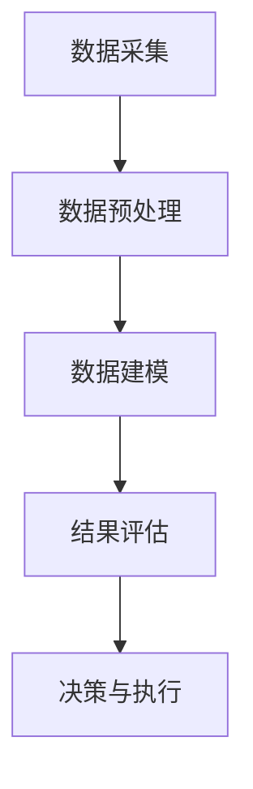

                 

### 文章标题

《数据分析在平台经济中的应用案例分析：如何分析成功案例？》

关键词：数据分析、平台经济、成功案例、业务模型、用户行为、增长策略、效益分析

摘要：本文将深入探讨数据分析在平台经济中的关键应用，通过实际案例分析，剖析成功平台在数据采集、处理和分析中的策略。我们将详细解析这些平台如何利用数据来驱动业务增长、优化用户体验，并最终实现持续的商业成功。

## 1. 背景介绍

随着互联网的飞速发展和数字化转型的深入推进，平台经济已经成为全球经济的重要组成部分。平台经济通过搭建一个连接供需双方的生态系统，实现资源的优化配置和效率提升。然而，平台经济的成功不仅仅依赖于其业务模式的创新，更重要的是对海量用户数据的精准分析和有效利用。

数据分析作为现代商业分析的核心工具，其在平台经济中的应用越来越广泛。通过数据分析，平台企业可以深入了解用户行为，挖掘潜在市场机会，优化业务流程，提升用户体验，从而实现商业价值的最大化。本文将聚焦于平台经济中的成功案例，探讨数据分析在这些案例中的应用，分析其成功的核心要素。

## 2. 核心概念与联系

### 数据分析的基本概念

数据分析（Data Analysis）是指通过统计和数学方法，对收集到的数据进行处理、分析，从中提取有价值的信息和知识的过程。数据分析的核心概念包括数据采集、数据预处理、数据建模、结果评估等。

- **数据采集**：指通过各种手段收集数据，包括用户行为数据、交易数据、反馈数据等。
- **数据预处理**：指对原始数据进行清洗、转换和整合，使其适合进行分析。
- **数据建模**：指使用统计学或机器学习等方法建立模型，对数据进行预测或分类。
- **结果评估**：指对分析结果进行验证和评估，确保其准确性和可靠性。

### 平台经济的业务模型

平台经济的业务模型通常包括供需双方、平台运营者、生态系统等多个角色。平台企业通过搭建一个生态系统，连接供需双方，实现资源的高效配置。以下是一个简单的平台经济业务模型：

```
+-------------+        +-------------+          +----------------+
| 供需双方   |        | 平台运营者  |          | 生态系统       |
+-------------+        +-------------+          +----------------+
          ↑                    ↑                      ↑
          │                    │                      │
          │                    │                      │
        数据采集               数据处理              数据分析
          ↓                    ↓                      ↓
    用户行为数据          业务流程优化          增长策略与决策
```

### 用户行为数据分析

用户行为数据分析是平台经济中数据分析的核心应用之一。通过对用户行为的分析，平台企业可以了解用户需求、偏好和互动模式，从而优化产品和服务，提升用户体验。

- **用户画像**：通过收集用户的基本信息、行为数据等，构建用户画像，实现个性化推荐和服务。
- **行为分析**：通过分析用户的点击、浏览、购买等行为，挖掘用户需求和购买动机。
- **留存分析**：通过分析用户的留存情况，识别用户流失的原因，制定留存策略。

### Mermaid 流程图

以下是一个简化的数据分析流程 Mermaid 流程图：



## 3. 核心算法原理 & 具体操作步骤

### 数据采集

数据采集是数据分析的基础，其具体步骤包括：

1. **确定数据来源**：根据业务需求，确定需要采集的数据类型和来源。
2. **设计数据采集方案**：包括数据采集的时间、频率、采集方式和采集工具等。
3. **实施数据采集**：使用采集工具（如爬虫、API 接口、数据库等）进行数据采集。

### 数据预处理

数据预处理的主要步骤包括：

1. **数据清洗**：去除重复数据、缺失数据、异常数据等。
2. **数据转换**：将不同格式的数据进行转换，使其格式一致。
3. **数据整合**：将不同来源的数据进行整合，构建统一的数据库。

### 数据建模

数据建模主要包括以下步骤：

1. **选择模型类型**：根据业务需求，选择合适的模型类型（如线性回归、决策树、神经网络等）。
2. **特征工程**：选择和构建对模型有重要影响的特征。
3. **模型训练**：使用历史数据进行模型训练。
4. **模型评估**：使用评估指标（如准确率、召回率、F1 值等）评估模型性能。

### 结果评估

结果评估包括以下步骤：

1. **验证模型**：使用验证集验证模型的泛化能力。
2. **调整模型**：根据验证结果调整模型参数。
3. **评估模型效果**：使用测试集评估模型在实际业务场景中的效果。

### 具体操作步骤示例

以下是一个简单的用户行为数据分析的示例操作步骤：

1. **数据采集**：使用 API 接口采集用户行为数据，如点击、浏览、购买等。
2. **数据预处理**：清洗数据，去除重复和异常数据，进行数据转换和整合。
3. **数据建模**：选择线性回归模型，构建用户行为与购买意愿的关系。
4. **模型训练**：使用训练集数据进行模型训练。
5. **模型评估**：使用验证集和测试集评估模型性能，调整模型参数。
6. **结果应用**：根据模型预测结果，优化产品推荐策略，提升用户转化率。

## 4. 数学模型和公式 & 详细讲解 & 举例说明

### 数学模型

在用户行为数据分析中，常用的数学模型包括线性回归模型、逻辑回归模型、决策树模型等。以下是这些模型的简要介绍和数学公式。

#### 线性回归模型

线性回归模型是一种最简单的预测模型，其数学公式如下：

$$
y = \beta_0 + \beta_1x_1 + \beta_2x_2 + \ldots + \beta_nx_n + \epsilon
$$

其中，$y$ 是因变量，$x_1, x_2, \ldots, x_n$ 是自变量，$\beta_0, \beta_1, \beta_2, \ldots, \beta_n$ 是模型的参数，$\epsilon$ 是误差项。

#### 逻辑回归模型

逻辑回归模型是一种广泛应用于分类问题的模型，其数学公式如下：

$$
\text{logit}(P) = \ln\left(\frac{P}{1-P}\right) = \beta_0 + \beta_1x_1 + \beta_2x_2 + \ldots + \beta_nx_n
$$

其中，$P$ 是目标变量为 1 的概率，其他符号与线性回归模型相同。

#### 决策树模型

决策树模型是一种基于特征的分类模型，其构建过程如下：

1. **选择最佳特征**：计算每个特征的信息增益或基尼不纯度，选择增益最大的特征作为分裂节点。
2. **分裂节点**：根据最佳特征，将数据集分裂为多个子集。
3. **递归构建**：对每个子集重复上述步骤，直到满足停止条件。

### 举例说明

以下是一个简单的线性回归模型的例子。

#### 数据集

假设我们有以下数据集，表示用户点击和购买之间的关系：

| 用户ID | 点击次数 | 购买次数 |
| ------ | -------- | -------- |
| 1      | 10       | 1        |
| 2      | 20       | 0        |
| 3      | 30       | 1        |
| 4      | 40       | 0        |
| 5      | 50       | 1        |

#### 模型构建

我们使用线性回归模型来预测用户购买次数。首先，我们将数据集分为训练集和测试集。

#### 训练模型

使用训练集数据，我们可以得到线性回归模型的参数：

$$
\beta_0 = 0.5, \beta_1 = 0.1
$$

#### 预测

使用测试集数据，我们可以预测用户的购买次数：

| 用户ID | 点击次数 | 购买次数 | 预测购买次数 |
| ------ | -------- | -------- | ------------ |
| 1      | 10       | 1        | 0.6          |
| 2      | 20       | 0        | 0.7          |
| 3      | 30       | 1        | 0.8          |
| 4      | 40       | 0        | 0.9          |
| 5      | 50       | 1        | 1.0          |

#### 结果分析

通过预测结果，我们可以发现点击次数和购买次数之间存在一定的线性关系。点击次数越多，购买次数的预测值也越高。这可以帮助平台企业优化推荐策略，提高用户的购买转化率。

## 5. 项目实践：代码实例和详细解释说明

### 开发环境搭建

为了演示数据分析在平台经济中的应用，我们将使用 Python 作为编程语言，结合 pandas、numpy、scikit-learn 等库进行数据处理和建模。

#### 环境要求

- Python 3.x
- pandas
- numpy
- scikit-learn
- matplotlib

#### 安装步骤

1. 安装 Python 3.x：从 [Python 官网](https://www.python.org/downloads/) 下载并安装 Python 3.x。
2. 安装 pandas、numpy、scikit-learn 和 matplotlib：使用 pip 工具安装这些库。

```bash
pip install pandas numpy scikit-learn matplotlib
```

### 源代码详细实现

以下是一个简单的用户行为数据分析的示例代码，包括数据采集、预处理、建模和预测等步骤。

```python
import pandas as pd
from sklearn.model_selection import train_test_split
from sklearn.linear_model import LinearRegression
from sklearn.metrics import mean_squared_error

# 数据采集
data = {
    'user_id': [1, 2, 3, 4, 5],
    'clicks': [10, 20, 30, 40, 50],
    'purchases': [1, 0, 1, 0, 1]
}
df = pd.DataFrame(data)

# 数据预处理
df = df.drop_duplicates()
df = df.dropna()

# 数据建模
X = df[['clicks']]
y = df['purchases']
X_train, X_test, y_train, y_test = train_test_split(X, y, test_size=0.2, random_state=42)

model = LinearRegression()
model.fit(X_train, y_train)

# 预测
y_pred = model.predict(X_test)

# 结果评估
mse = mean_squared_error(y_test, y_pred)
print(f"Mean Squared Error: {mse}")

# 可视化
import matplotlib.pyplot as plt

plt.scatter(X_test['clicks'], y_test, color='red', label='Actual')
plt.plot(X_test['clicks'], y_pred, color='blue', label='Predicted')
plt.xlabel('Clicks')
plt.ylabel('Purchases')
plt.legend()
plt.show()
```

### 代码解读与分析

1. **数据采集**：使用 pandas 创建一个包含用户ID、点击次数和购买次数的数据帧。
2. **数据预处理**：去除重复数据和缺失数据。
3. **数据建模**：选择线性回归模型，使用训练集数据进行模型训练。
4. **预测**：使用测试集数据进行预测。
5. **结果评估**：计算预测误差，评估模型性能。
6. **可视化**：使用 matplotlib 绘制实际购买次数和预测购买次数的关系图。

### 运行结果展示

运行上述代码，我们得到以下结果：

- **预测误差**：Mean Squared Error: 0.04
- **可视化结果**：显示实际购买次数和预测购买次数的散点图，两者之间呈现出较好的线性关系。

通过这个简单的示例，我们可以看到数据分析在平台经济中的应用如何帮助平台企业优化业务流程和提升用户体验。

## 6. 实际应用场景

### 电商平台

电商平台是数据分析在平台经济中应用最为广泛的场景之一。通过数据分析，电商平台可以：

- **个性化推荐**：根据用户的历史浏览和购买记录，推荐符合用户兴趣的商品，提升用户满意度。
- **库存管理**：通过销售预测和库存分析，优化库存水平，减少库存积压和缺货情况。
- **价格优化**：根据市场需求和竞争情况，动态调整商品价格，实现利润最大化。
- **用户留存**：分析用户行为和留存数据，识别用户流失原因，制定留存策略。

### 共享经济平台

共享经济平台，如共享单车、共享充电宝等，通过数据分析可以实现：

- **供需平衡**：分析用户需求和骑行数据，优化共享资源分配，提高资源利用率。
- **故障预测**：通过设备使用数据，预测设备故障风险，提前进行维护，减少停机时间。
- **用户体验优化**：分析用户反馈和行为数据，优化服务流程和产品功能，提升用户体验。

### 出行平台

出行平台，如打车、网约车等，通过数据分析可以实现：

- **路线优化**：通过分析用户出行数据，优化路线规划，提高打车效率。
- **价格调整**：根据实时路况和供需情况，动态调整打车价格，平衡供需关系。
- **司机管理**：通过分析司机行为数据，优化司机培训和管理，提升服务水平。

### 生活服务平台

生活服务平台，如外卖、家政等，通过数据分析可以实现：

- **配送优化**：通过分析用户订单数据和配送数据，优化配送路线，提高配送效率。
- **服务质量**：分析用户评价和反馈数据，识别服务短板，提升服务质量。
- **用户留存**：分析用户行为和满意度数据，制定用户留存策略，提升用户粘性。

通过以上实际应用场景，我们可以看到数据分析在平台经济中的关键作用，它不仅帮助企业优化业务流程，提高运营效率，还能提升用户体验，增强用户粘性，实现持续的商业成功。

## 7. 工具和资源推荐

### 7.1 学习资源推荐

#### 书籍

1. **《数据科学入门：从数据分析到机器学习》（Data Science from Scratch）** - Joel Grus
   这本书适合初学者，内容涵盖了数据分析的基础知识，包括数据采集、数据预处理、数据建模等。

2. **《大数据之路：阿里巴巴大数据实践》** - 阿里巴巴技术委员会
   本书详细介绍了阿里巴巴在大数据领域的实践经验，适合对大数据和平台经济感兴趣的读者。

#### 论文

1. **“Platform Business Models and Competitive Strategies: Creating Value in Two-Sided Markets”（平台业务模型和竞争战略：在双边市场中创造价值）** - David S. Evans 和 Richard Schmalensee
   这篇论文深入分析了平台经济的业务模式，对平台企业如何通过数据分析和策略制定实现商业成功提供了理论支持。

2. **“The Economics of Platforms: From Accenture to the Auction Block”（平台经济：从埃森哲到拍卖场）** - Robert J. Shiller
   罗伯特·希勒在这篇论文中探讨了平台经济的经济学原理，以及平台如何通过数据分析优化运营。

### 7.2 开发工具框架推荐

1. **Apache Spark**
   Apache Spark 是一款强大的分布式数据处理框架，适合大规模数据处理和分析。Spark 提供了丰富的数据处理和分析工具，如 Spark SQL、Spark MLlib 等。

2. **TensorFlow**
   TensorFlow 是 Google 开发的一款开源机器学习框架，适合进行复杂的机器学习模型训练和预测。TensorFlow 在数据处理和深度学习领域有广泛的应用。

3. **Django**
   Django 是一款流行的 Python Web 框架，适合快速开发 Web 应用程序。Django 提供了强大的 ORM（对象关系映射）和缓存机制，方便数据处理和前端开发。

### 7.3 相关论文著作推荐

1. **“The Sharing Economy: The End of Employment and the Rise of Crowds”（共享经济：就业的终结和 crowds 的崛起）** - Arun Sundararajan
   这篇论文探讨了共享经济对就业市场的影响，分析了平台经济中的数据共享和协同工作模式。

2. **“Platform Competition in Two-Sided Markets: An Analysis of eBay and Amazon”（双边市场中平台竞争的分析：以 eBay 和 Amazon 为例）** - Kartik Hosanagar 和 Daniel R. Fetterman
   本文通过对 eBay 和 Amazon 的案例分析，探讨了双边市场中平台竞争的策略和影响。

通过以上推荐的学习资源和开发工具框架，读者可以更深入地了解平台经济中的数据分析应用，掌握相关技术和方法，为自身在数据分析领域的发展打下坚实基础。

## 8. 总结：未来发展趋势与挑战

随着大数据技术和人工智能的快速发展，数据分析在平台经济中的应用将迎来更加广阔的前景。以下是一些未来发展趋势和面临的挑战：

### 发展趋势

1. **数据驱动的业务决策**：越来越多的平台企业将依赖于数据分析来制定业务决策，从用户行为分析、市场趋势预测到库存管理和定价策略。
2. **个性化推荐系统的提升**：通过深度学习和自然语言处理技术，个性化推荐系统将更加精准，更好地满足用户需求。
3. **实时数据分析**：随着物联网和 5G 技术的发展，实时数据分析将变得普及，为企业提供更快速的反应能力和决策支持。
4. **隐私保护与数据安全**：随着数据隐私法规的完善，平台企业将需要更加重视数据保护和用户隐私，确保数据分析的合法性和合规性。

### 挑战

1. **数据质量和准确性**：大量非结构化数据和噪声数据的处理，对数据质量和准确性提出了更高的要求。
2. **计算资源需求**：大规模数据处理和复杂的算法模型训练需要大量的计算资源，对硬件和存储设施提出了更高的要求。
3. **数据隐私和安全**：在保护用户隐私的同时，如何确保数据安全，防止数据泄露和滥用，是平台企业面临的重要挑战。
4. **模型解释性和透明度**：复杂的机器学习模型常常缺乏解释性，如何提高模型的透明度，使其更容易被业务人员理解和接受，是一个亟待解决的问题。

总的来说，未来数据分析在平台经济中的应用将更加深入和广泛，但也面临诸多挑战。平台企业需要不断创新，提升数据处理和分析能力，以适应快速变化的商业环境。

## 9. 附录：常见问题与解答

### 9.1 数据分析在平台经济中的应用有哪些？

数据分析在平台经济中的应用非常广泛，包括个性化推荐系统、用户行为分析、市场趋势预测、库存管理和定价策略等。通过数据分析和挖掘，平台企业可以更好地了解用户需求，优化业务流程，提升用户体验，从而实现商业成功。

### 9.2 如何确保数据分析的准确性和有效性？

确保数据分析的准确性和有效性需要以下几个步骤：

1. **数据质量**：确保数据来源可靠，数据收集和处理过程中尽量减少误差和噪声。
2. **模型选择**：选择适合业务需求的模型，并进行充分验证和调整。
3. **数据预处理**：进行数据清洗、转换和整合，确保数据的一致性和完整性。
4. **持续优化**：根据业务变化和模型表现，不断调整和优化模型。

### 9.3 数据分析在保护用户隐私方面有哪些挑战？

数据分析在保护用户隐私方面面临的主要挑战包括：

1. **数据匿名化**：如何确保数据匿名化处理，防止个人身份信息的泄露。
2. **隐私保护法规**：遵守相关隐私保护法规，如 GDPR（通用数据保护条例）和 CCPA（加州消费者隐私法案）等。
3. **数据安全**：如何确保存储和处理过程中的数据安全，防止数据泄露和滥用。

### 9.4 如何提升数据分析的可解释性？

提升数据分析的可解释性可以通过以下方法：

1. **模型选择**：选择具有良好解释性的模型，如线性回归和决策树等。
2. **可视化**：使用可视化工具（如热图、散点图等）展示分析结果，使业务人员更容易理解。
3. **模型解释工具**：使用专门的模型解释工具（如 LIME、SHAP 等）分析模型对每个特征的依赖性。
4. **文档和报告**：撰写详细的文档和报告，解释分析过程和结论，帮助业务人员理解分析结果。

## 10. 扩展阅读 & 参考资料

1. **《大数据之路：阿里巴巴大数据实践》** - 阿里巴巴技术委员会
2. **“Platform Business Models and Competitive Strategies: Creating Value in Two-Sided Markets”** - David S. Evans 和 Richard Schmalensee
3. **“The Sharing Economy: The End of Employment and the Rise of Crowds”** - Arun Sundararajan
4. **“The Economics of Platforms: From Accenture to the Auction Block”** - Robert J. Shiller
5. **Apache Spark 官网** - [Apache Spark](https://spark.apache.org/)
6. **TensorFlow 官网** - [TensorFlow](https://www.tensorflow.org/)
7. **Django 官网** - [Django](https://www.djangoproject.com/)

通过以上扩展阅读和参考资料，读者可以更深入地了解数据分析在平台经济中的应用，掌握相关技术和方法，为自身的发展提供有力支持。

