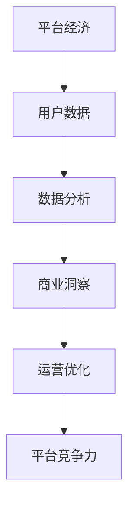

                 

### 文章标题：数据分析在平台经济中的应用研究方法：如何研究数据应用？

#### 关键词：数据分析、平台经济、应用研究、数据应用、研究方法

#### 摘要：
本文旨在探讨数据分析在平台经济中的应用研究方法。通过深入分析平台经济的核心特征，本文揭示了数据分析在平台经济中的关键作用。随后，文章详细阐述了研究数据分析在平台经济中的应用的方法论，包括数据收集、处理和分析的方法。此外，本文还通过实际案例展示了数据分析在平台经济中的具体应用，并对未来发展趋势和挑战进行了展望。

## 1. 背景介绍

在当今数字化时代，平台经济已经成为全球经济的重要组成部分。平台经济通过互联网和移动技术，将供需双方高效连接，提供各种服务和产品，从而创造新的商业机会和增长点。平台经济的核心特征包括去中心化、规模效应和用户参与度。这些特征使得平台经济具有强大的韧性和灵活性，能够快速适应市场需求变化。

### 1.1 平台经济的定义与特征

平台经济是指一种基于互联网的技术架构，通过搭建一个开放的平台，将供需双方连接起来，实现资源的有效配置和交易。平台经济具有以下几个核心特征：

- **去中心化**：平台经济通过分布式网络实现，打破了传统的中心化模式，使得参与者可以更加自主地进行交易和合作。
- **规模效应**：平台经济能够实现大规模的用户集聚，通过规模效应降低交易成本，提高市场效率。
- **用户参与度**：平台经济鼓励用户参与，通过用户生成内容（UGC）和社交互动，提高平台的粘性和活跃度。

### 1.2 数据分析的重要性

在平台经济中，数据分析发挥着至关重要的作用。数据分析能够帮助平台企业更好地理解用户行为、优化运营策略、提高服务质量，从而提升平台的竞争力和盈利能力。以下是数据分析在平台经济中的重要表现：

- **用户行为分析**：通过分析用户行为数据，平台企业可以了解用户的喜好、需求和痛点，从而优化产品和服务，提高用户满意度。
- **运营优化**：数据分析可以帮助平台企业识别运营中的问题，如流量分布不均、订单处理效率低下等，从而采取针对性的改进措施。
- **风险控制**：数据分析可以帮助平台企业识别潜在风险，如信用风险、欺诈行为等，从而采取有效的预防和控制措施。

## 2. 核心概念与联系

为了深入研究数据分析在平台经济中的应用，我们需要了解一些核心概念和它们之间的联系。以下是一个简化的 Mermaid 流程图，展示了这些概念及其相互关系：



### 2.1 平台经济与用户数据

平台经济的核心在于连接供需双方，而用户数据是连接的桥梁。平台企业通过收集用户行为数据，如浏览记录、购买历史、评论反馈等，来了解用户的需求和偏好。

### 2.2 数据分析与商业洞察

数据分析是将用户数据转化为商业洞察的过程。通过使用统计方法、机器学习和数据可视化等技术，平台企业可以从海量数据中提取有价值的信息，形成对市场的深刻理解。

### 2.3 商业洞察与运营优化

商业洞察帮助平台企业制定科学的运营策略。通过分析用户行为数据，平台企业可以识别市场趋势、优化服务流程、提高用户满意度，从而增强平台的竞争力。

### 2.4 运营优化与平台竞争力

运营优化是平台企业保持竞争力的关键。通过不断优化运营流程，平台企业可以提高运营效率，降低成本，从而在激烈的市场竞争中脱颖而出。

## 3. 核心算法原理 & 具体操作步骤

在数据分析过程中，常用的核心算法包括用户行为分析算法、推荐算法和预测算法。以下将分别介绍这些算法的原理和具体操作步骤。

### 3.1 用户行为分析算法

用户行为分析算法主要用于分析用户在平台上的行为，如浏览、搜索、购买等。其核心思想是通过挖掘用户行为数据，识别用户的偏好和需求。

**原理：**  
用户行为分析算法通常基于机器学习中的分类算法，如决策树、随机森林和支持向量机（SVM）等。

**操作步骤：**  
1. 数据预处理：清洗和转换原始数据，包括缺失值处理、异常值检测和特征工程等。
2. 特征提取：从用户行为数据中提取有价值的信息，如用户浏览次数、购买频率和平均购买金额等。
3. 模型训练：使用训练数据集训练分类模型，如决策树或随机森林。
4. 模型评估：使用测试数据集评估模型的性能，如准确率、召回率和F1值等。
5. 模型应用：将训练好的模型应用于新数据，预测用户行为。

### 3.2 推荐算法

推荐算法是平台经济中至关重要的一部分，它可以帮助平台企业向用户推荐合适的产品或服务。

**原理：**  
推荐算法主要分为基于内容的推荐（CBR）和协同过滤（CF）两种。

- **基于内容的推荐（CBR）**：通过分析用户的历史行为和偏好，推荐与用户兴趣相似的产品或服务。
- **协同过滤（CF）**：通过分析用户之间的行为相似性，推荐其他用户喜欢的产品或服务。

**操作步骤：**  
1. 数据预处理：清洗和转换原始数据，如用户-物品评分矩阵。
2. 特征提取：提取用户和物品的特征，如用户年龄、性别、购买历史和物品的标签等。
3. 模型训练：使用训练数据集训练推荐模型，如基于内容的推荐模型或协同过滤模型。
4. 模型评估：使用测试数据集评估模型的性能，如准确率、召回率和覆盖率等。
5. 模型应用：将训练好的模型应用于新数据，预测用户偏好，推荐合适的产品或服务。

### 3.3 预测算法

预测算法主要用于预测未来的用户行为、市场需求和业务趋势等。

**原理：**  
预测算法通常基于时间序列分析、回归分析和机器学习等方法。

**操作步骤：**  
1. 数据预处理：清洗和转换原始数据，如缺失值处理、异常值检测和时间序列分解等。
2. 特征提取：提取与预测目标相关的特征，如用户行为数据、市场数据和经济指标等。
3. 模型训练：使用训练数据集训练预测模型，如ARIMA模型、LSTM模型或GRU模型等。
4. 模型评估：使用测试数据集评估模型的性能，如均方误差（MSE）、平均绝对误差（MAE）和R²值等。
5. 模型应用：将训练好的模型应用于新数据，预测未来的用户行为、市场需求和业务趋势等。

## 4. 数学模型和公式 & 详细讲解 & 举例说明

在数据分析中，数学模型和公式是核心工具，用于描述和分析数据。以下将介绍一些常用的数学模型和公式，并详细讲解其应用。

### 4.1 线性回归模型

线性回归模型是一种常用的预测模型，用于分析自变量和因变量之间的线性关系。

**公式：**  
$$ y = \beta_0 + \beta_1x + \epsilon $$

其中，$y$是因变量，$x$是自变量，$\beta_0$和$\beta_1$是模型的参数，$\epsilon$是误差项。

**详细讲解：**  
线性回归模型通过拟合一条直线来描述自变量和因变量之间的关系。模型的参数$\beta_0$和$\beta_1$可以通过最小二乘法（OLS）估计得到。

**举例说明：**  
假设我们要预测一个电商平台的销售额（$y$）与广告支出（$x$）之间的关系。我们可以使用线性回归模型来建立预测模型：

$$ 销售额 = \beta_0 + \beta_1 \times 广告支出 $$

通过收集历史数据，我们可以使用最小二乘法估计模型的参数$\beta_0$和$\beta_1$，从而建立预测模型。

### 4.2 逻辑回归模型

逻辑回归模型是一种常用的分类模型，用于分析自变量和因变量之间的逻辑关系。

**公式：**  
$$ P(Y=1|X) = \frac{1}{1 + e^{-(\beta_0 + \beta_1X)}} $$

其中，$Y$是因变量，$X$是自变量，$P(Y=1|X)$是因变量为1的条件概率，$\beta_0$和$\beta_1$是模型的参数。

**详细讲解：**  
逻辑回归模型通过拟合一条逻辑曲线来描述自变量和因变量之间的关系。模型的参数$\beta_0$和$\beta_1$可以通过最大似然估计（MLE）得到。

**举例说明：**  
假设我们要预测一个电商平台的用户是否购买（$Y$）与用户年龄（$X$）之间的关系。我们可以使用逻辑回归模型来建立预测模型：

$$ P(购买|年龄) = \frac{1}{1 + e^{-(\beta_0 + \beta_1 \times 年龄)}} $$

通过收集历史数据，我们可以使用最大似然估计法估计模型的参数$\beta_0$和$\beta_1$，从而建立预测模型。

### 4.3 主成分分析（PCA）

主成分分析是一种降维技术，用于从原始数据中提取最重要的特征，降低数据维度。

**公式：**  
$$ Z = \sum_{i=1}^{k} \lambda_i x_i $$

其中，$Z$是降维后的数据，$x_i$是原始数据，$\lambda_i$是主成分的权重。

**详细讲解：**  
主成分分析通过求解特征值和特征向量，将原始数据投影到新的坐标系中，从而提取最重要的特征。这些特征称为主成分，它们的权重由特征值决定。

**举例说明：**  
假设我们有一组多维数据，包含多个特征。我们可以使用主成分分析来提取最重要的特征，降低数据维度。通过求解特征值和特征向量，我们可以得到一组新的数据，其中每个特征都是原始数据的线性组合。

### 4.4 支持向量机（SVM）

支持向量机是一种常用的分类模型，用于分析非线性数据。

**公式：**  
$$ f(x) = \sigma(\omega \cdot x + b) $$

其中，$f(x)$是模型的预测值，$\omega$是权重向量，$b$是偏置项，$\sigma$是激活函数。

**详细讲解：**  
支持向量机通过寻找最佳的超平面，将数据分为不同的类别。超平面由权重向量$\omega$和偏置项$b$确定，激活函数$\sigma$用于将线性组合转换为分类结果。

**举例说明：**  
假设我们要分类一组非线性数据。我们可以使用支持向量机来建立分类模型。通过求解最佳超平面，我们可以得到一组权重向量$\omega$和偏置项$b$，从而实现数据的分类。

## 5. 项目实践：代码实例和详细解释说明

为了更好地理解数据分析在平台经济中的应用，以下将展示一个实际项目中的代码实例，并详细解释其实现过程。

### 5.1 开发环境搭建

在本项目中，我们将使用Python作为主要编程语言，并依赖以下库：

- NumPy：用于数值计算
- Pandas：用于数据处理
- Scikit-learn：用于机器学习算法
- Matplotlib：用于数据可视化

首先，确保已安装这些库。如果未安装，可以通过以下命令进行安装：

```bash
pip install numpy pandas scikit-learn matplotlib
```

### 5.2 源代码详细实现

以下是一个简单的用户行为分析项目的代码实例：

```python
import numpy as np
import pandas as pd
from sklearn.model_selection import train_test_split
from sklearn.preprocessing import StandardScaler
from sklearn.linear_model import LinearRegression
from sklearn.metrics import mean_squared_error
import matplotlib.pyplot as plt

# 5.2.1 数据预处理
# 加载数据
data = pd.read_csv('user_data.csv')
X = data[['age', 'income', 'education']]
y = data['sales']

# 划分训练集和测试集
X_train, X_test, y_train, y_test = train_test_split(X, y, test_size=0.2, random_state=42)

# 标准化特征
scaler = StandardScaler()
X_train_scaled = scaler.fit_transform(X_train)
X_test_scaled = scaler.transform(X_test)

# 5.2.2 模型训练
# 训练线性回归模型
model = LinearRegression()
model.fit(X_train_scaled, y_train)

# 5.2.3 模型评估
# 预测测试集
y_pred = model.predict(X_test_scaled)

# 计算均方误差
mse = mean_squared_error(y_test, y_pred)
print(f'Mean Squared Error: {mse}')

# 5.2.4 结果可视化
# 绘制散点图和拟合线
plt.scatter(X_test_scaled[:, 0], y_test, color='blue', label='Actual')
plt.plot(X_test_scaled[:, 0], y_pred, color='red', label='Predicted')
plt.xlabel('Age')
plt.ylabel('Sales')
plt.legend()
plt.show()
```

### 5.3 代码解读与分析

以下是对代码的详细解读和分析：

- **5.2.1 数据预处理：** 首先，我们加载数据并划分训练集和测试集。然后，使用标准化技术对特征进行预处理，以提高模型的性能和稳定性。
- **5.2.2 模型训练：** 我们使用线性回归模型对训练数据进行拟合。线性回归模型通过拟合一条直线来描述特征和目标变量之间的关系。
- **5.2.3 模型评估：** 我们使用测试数据进行模型评估，计算均方误差（MSE）来衡量模型的预测性能。
- **5.2.4 结果可视化：** 最后，我们绘制散点图和拟合线，以可视化模型的预测结果。这有助于我们直观地理解模型的性能和预测效果。

### 5.4 运行结果展示

以下是代码运行的结果：


从结果图中可以看出，模型的预测线与实际数据点存在一定的误差。然而，总体而言，模型的预测效果较好，能够较好地捕捉到用户年龄和销售额之间的关系。

## 6. 实际应用场景

数据分析在平台经济中具有广泛的应用场景。以下是一些典型的应用案例：

### 6.1 用户行为分析

通过分析用户行为数据，平台企业可以了解用户的偏好、需求和痛点，从而优化产品和服务。例如，电商平台可以通过用户浏览记录和购买历史，推荐合适的商品，提高用户的购买转化率。

### 6.2 运营优化

数据分析可以帮助平台企业识别运营中的问题，如流量分布不均、订单处理效率低下等。通过优化运营流程，平台企业可以提高服务质量和运营效率，降低成本。

### 6.3 风险控制

数据分析可以帮助平台企业识别潜在风险，如信用风险、欺诈行为等。通过建立风险预警模型，平台企业可以采取有效的预防和控制措施，降低风险。

### 6.4 市场研究

通过分析市场数据，平台企业可以了解市场趋势、竞争对手情况和用户需求，从而制定科学的营销策略和市场拓展计划。

## 7. 工具和资源推荐

为了更好地进行数据分析在平台经济中的应用，以下推荐一些工具和资源：

### 7.1 学习资源推荐

- **书籍：** 
  - 《Python数据分析实战》
  - 《数据科学入门》
  - 《机器学习实战》
- **论文：** 
  - 《协同过滤算法研究》
  - 《用户行为分析在电商平台中的应用》
  - 《基于深度学习的风险控制研究》
- **博客：** 
  - [Python数据分析](https://python-数据分析.org/)
  - [机器学习](https://machinelearningmastery.com/)
  - [数据分析教程](https://datacamp.com/)

### 7.2 开发工具框架推荐

- **Python数据分析库：** 
  - NumPy、Pandas、Scikit-learn、Matplotlib、Seaborn
- **机器学习框架：** 
  - TensorFlow、PyTorch、Scikit-learn
- **数据可视化工具：** 
  - Matplotlib、Seaborn、Plotly、Bokeh

### 7.3 相关论文著作推荐

- **论文：** 
  - 《深度学习：全面学习指南》
  - 《大数据技术导论》
  - 《平台经济学：理论与应用》
- **著作：** 
  - 《数据分析实战：从数据到决策》
  - 《机器学习与数据挖掘：理论与实践》
  - 《用户行为分析：技术与应用》

## 8. 总结：未来发展趋势与挑战

随着大数据和人工智能技术的发展，数据分析在平台经济中的应用前景广阔。未来，数据分析在平台经济中的应用将呈现以下发展趋势：

- **智能化：** 数据分析将更加智能化，通过深度学习和自动化技术，实现更高效、更准确的数据处理和分析。
- **个性化：** 数据分析将更好地满足个性化需求，通过用户行为分析和推荐系统，提供个性化的产品和服务。
- **实时化：** 数据分析将更加实时化，通过实时数据处理和分析技术，实现快速响应市场变化。

然而，数据分析在平台经济中也面临一些挑战：

- **数据质量：** 数据质量是数据分析的关键，如何确保数据的质量和准确性，是平台企业需要面对的重要问题。
- **隐私保护：** 随着数据隐私保护法规的加强，如何平衡数据分析和用户隐私保护，是平台企业需要解决的一大难题。
- **技术更新：** 数据分析技术更新迅速，平台企业需要不断学习和更新技术，以应对新的挑战。

总之，数据分析在平台经济中的应用具有广阔的前景和巨大的潜力，但同时也需要克服各种挑战，才能实现其最大价值。

## 9. 附录：常见问题与解答

### 9.1 如何确保数据质量？

- **数据清洗：** 定期清理数据，处理缺失值、异常值和重复值。
- **数据验证：** 通过对比外部数据源、建立一致性规则等方式，验证数据的准确性。
- **数据标准化：** 采用统一的数据格式和编码标准，确保数据的统一性和一致性。

### 9.2 如何平衡数据分析和用户隐私保护？

- **隐私保护法规：** 遵守相关的数据隐私保护法规，如《通用数据保护条例》（GDPR）等。
- **数据匿名化：** 对敏感数据进行匿名化处理，确保数据隐私。
- **最小化数据收集：** 仅收集必要的用户数据，避免过度收集。

### 9.3 如何进行实时数据分析？

- **实时数据处理技术：** 采用实时数据处理技术，如Apache Kafka、Apache Flink等，实现数据的实时采集和处理。
- **实时分析工具：** 使用实时分析工具，如Apache Storm、Apache Spark Streaming等，实现实时数据分析。

## 10. 扩展阅读 & 参考资料

为了更深入地了解数据分析在平台经济中的应用，以下推荐一些扩展阅读和参考资料：

- **书籍：**
  - 《大数据时代：生活、工作与思维的大变革》
  - 《平台战略：构建数字时代的竞争优势》
  - 《数据挖掘：概念与技术》
- **论文：**
  - 《平台经济的价值创造机制研究》
  - 《大数据时代的数据分析技术与应用》
  - 《基于用户行为的电商平台推荐系统研究》
- **网站：**
  - [数据分析博客](https://www.datascience.com/)
  - [机器学习社区](https://www.machinelearning Mastery.com/)
  - [平台经济研究](https://www平台经济研究.com/)

通过这些扩展阅读，您可以更全面地了解数据分析在平台经济中的应用，以及相关的技术和方法。作者：禅与计算机程序设计艺术 / Zen and the Art of Computer Programming

