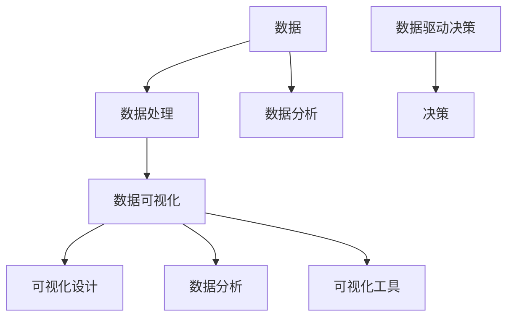

                 

### 背景介绍

数据可视化技术作为现代数据科学和大数据分析的重要工具，已经广泛应用于各个领域，如金融、医疗、交通、教育、市场营销等。随着互联网和物联网的快速发展，数据量呈爆炸性增长，使得从海量数据中提取有价值的信息变得尤为重要。而数据可视化正是实现这一目标的关键手段，它通过将数据以图形化的方式呈现，使得复杂的数据变得更加直观、易于理解。

数据可视化技术的历史可以追溯到19世纪末期，当时科学家和统计学家开始使用图表和图形来展示数据。随着时间的推移，数据可视化技术不断进步，从简单的条形图、折线图，到复杂的交互式图表、动态可视化，技术手段不断丰富。尤其是计算机科学的发展，使得数据可视化技术得以突破传统的限制，呈现出更加多样化和精细化的形态。

在现代，数据可视化技术的重要性愈发显著。首先，它可以极大地提升数据分析的效率。通过可视化，数据分析师可以快速识别数据中的模式和趋势，而不必在庞大的数据集中逐行查看。其次，数据可视化技术能够增强数据传达的有效性。直观的图表和图形比文字描述更容易让读者理解和接受数据背后的信息。此外，数据可视化还能够促进跨学科合作，帮助不同领域的专家更好地沟通和合作。

总的来说，数据可视化技术在现代社会中的作用不可或缺。它不仅帮助我们更好地理解和分析数据，还为决策者提供了有力的支持，使得我们能够更加科学和合理地制定政策和策略。在接下来的章节中，我们将深入探讨数据可视化技术的核心概念、算法原理、数学模型以及实际应用，带您了解这一领域的前沿动态和技术精髓。

### 核心概念与联系

在深入探讨数据可视化技术之前，我们需要明确几个核心概念，这些概念不仅构成了数据可视化的基础，也决定了最终的可视化效果。以下是一些关键概念及其相互之间的联系：

#### 1. 数据

数据是数据可视化的源头。数据可以是结构化的，如数据库中的表格，也可以是非结构化的，如文本、图像、音频等。结构化数据通常以表格形式呈现，其中每一行代表一条记录，每一列代表一个属性。非结构化数据则需要通过特定的算法和技术进行预处理，以便提取出有用的信息。

#### 2. 数据可视化

数据可视化是一种通过图形、图表和其他视觉元素来表示和解释数据的技术。它旨在帮助人们理解复杂的数据集，发现数据中的模式和趋势。数据可视化可以采取多种形式，如条形图、折线图、散点图、热力图、地图、交互式图表等。

#### 3. 可视化设计

可视化设计是指如何选择和组合图表类型、颜色、字体、布局等元素，以使数据展示既清晰又吸引人。良好的可视化设计能够提升数据的可读性和传达效率，从而更好地支持数据分析和决策。

#### 4. 可视化工具

可视化工具是用于创建和操作数据可视化图表的软件。常见的可视化工具有 Tableau、Power BI、D3.js、matplotlib、Plotly 等。这些工具提供了丰富的图表类型、自定义选项和交互功能，使得用户能够轻松地创建出专业级的数据可视化。

#### 5. 数据处理

数据处理是指对原始数据进行清洗、转换和整合的过程。数据清洗是数据处理的第一步，旨在去除数据中的噪声和不完整信息。数据转换包括数据类型转换、数据归一化等，以适应可视化工具的需求。数据整合则是将来自不同源的数据合并在一起，以便进行综合分析。

#### 6. 数据分析

数据分析是使用统计和数学方法对数据进行分析，以提取有价值的信息和洞见。数据分析可以包括描述性分析、预测分析、聚类分析、关联规则分析等多种形式。数据分析的结果通常通过可视化图表进行展示，以便更直观地理解分析结果。

#### 7. 数据驱动决策

数据驱动决策是指基于数据分析的结果来制定和调整决策。通过数据可视化，决策者能够更清楚地看到数据中的趋势和模式，从而做出更科学和合理的决策。

#### Mermaid 流程图

以下是数据可视化技术中的核心概念和其相互关系的 Mermaid 流程图：



在上述流程图中，数据是整个数据可视化过程的起点，它通过数据处理转化为适合可视化展示的形式。随后，通过可视化设计和可视化工具，数据被转化为直观的图表。同时，数据还通过数据分析提供洞见，这些洞见用于支持数据驱动决策。最终，数据可视化的成果帮助决策者做出更明智的决策。

通过明确这些核心概念及其相互关系，我们能够更好地理解数据可视化技术的全貌，并在实际应用中发挥其最大价值。

### 核心算法原理 & 具体操作步骤

数据可视化技术涉及多个核心算法原理，其中一些关键算法包括数据聚合、数据聚类、数据降维、数据过滤等。以下将详细讲解这些算法的基本原理和具体操作步骤。

#### 1. 数据聚合

数据聚合是指将一组数据集合中的数据项进行合并和汇总，以生成更高层次的数据摘要。这一过程通常用于减少数据量，提高数据处理和分析的效率。

**算法原理：**

数据聚合算法通过对数据进行分组和计算汇总值（如求和、平均值、最大值、最小值等）来实现。

**具体操作步骤：**

- **分组**：根据一定的分组标准（如日期、区域、类别等），将数据项分为多个小组。
- **计算汇总值**：对每个小组的数据项进行统计计算，得到每个小组的汇总值。
- **结果输出**：将汇总结果以图表形式展示，如条形图、饼图等。

**示例：**

假设我们有以下一组销售数据：

| 日期 | 地区 | 销售额 |
| ---- | ---- | ------ |
| 2023-01-01 | 北京 | 1000   |
| 2023-01-02 | 上海 | 1500   |
| 2023-01-03 | 北京 | 2000   |
| 2023-01-04 | 深圳 | 3000   |
| 2023-01-05 | 上海 | 2500   |

我们可以通过数据聚合算法计算每个地区的总销售额：

```mermaid
graph TB
    A[日期] --> B[地区] --> C[销售额]
    subgraph 数据分组
        D1[2023-01-01](北京) --> E1[北京]
        D2[2023-01-02](上海) --> E2[上海]
        D3[2023-01-03](北京) --> E1[北京]
        D4[2023-01-04](深圳) --> E3[深圳]
        D5[2023-01-05](上海) --> E2[上海]
    end
    E1 --> F1[北京] --> G1[北京总销售额]
    E2 --> F2[上海] --> G2[上海总销售额]
    E3 --> F3[深圳] --> G3[深圳总销售额]
    subgraph 计算汇总值
        G1 --> H1[北京总销售额：3500]
        G2 --> H2[上海总销售额：4000]
        G3 --> H3[深圳总销售额：3000]
    end
```

#### 2. 数据聚类

数据聚类是一种无监督学习方法，用于将相似的数据点分组到一起。这一过程可以帮助我们识别数据中的模式和结构。

**算法原理：**

数据聚类算法通常基于某种相似性度量（如欧几里得距离、曼哈顿距离等），将数据点分配到不同的簇中。

**具体操作步骤：**

- **初始化**：随机选择若干个数据点作为初始聚类中心。
- **分配**：计算每个数据点到各个聚类中心的相似性，将其分配到最相似的聚类中心所在的簇。
- **更新**：重新计算各聚类中心的坐标，通常取其所在簇中所有点的平均值。
- **迭代**：重复执行分配和更新步骤，直到聚类中心不再发生变化或达到预定的迭代次数。

**示例：**

假设我们有以下一组二维数据：

| 数据点 | X坐标 | Y坐标 |
| ------ | ------ | ------ |
| 1      | 1     | 2      |
| 2      | 3     | 2      |
| 3      | 5     | 1      |
| 4      | 1     | 1      |
| 5      | 4     | 4      |

我们可以使用K-Means算法进行数据聚类：

```mermaid
graph TB
    subgraph 初始聚类中心
        A1[初始聚类中心1](1, 2)
        A2[初始聚类中心2](5, 1)
    end
    subgraph 数据点
        B1[数据点1](1, 2)
        B2[数据点2](3, 2)
        B3[数据点3](5, 1)
        B4[数据点4](1, 1)
        B5[数据点5](4, 4)
    end
    A1 --> B1 --> C1[聚类中心更新]
    A2 --> B2 --> C2[聚类中心更新]
    A1 --> B3
    A2 --> B4
    A1 --> B5
    subgraph 聚类结果
        D1[聚类簇1](1, 2; color: red)
        D2[聚类簇2](4, 4; color: blue)
    end
```

通过以上步骤，我们将数据点分为两个簇，簇1包含数据点1、3、5，簇2包含数据点2、4。

#### 3. 数据降维

数据降维是将高维数据集转换为低维数据集，以减少数据复杂度，提高数据处理和分析的效率。

**算法原理：**

数据降维算法通过提取数据中的关键特征，将高维数据映射到低维空间，从而减少数据的维度。

**具体操作步骤：**

- **特征选择**：选择对数据集最重要的特征，去除冗余和不重要的特征。
- **线性变换**：使用线性变换将高维数据映射到低维空间。常见的方法包括主成分分析（PCA）、因子分析、线性判别分析（LDA）等。
- **结果输出**：展示降维后的数据，通常使用散点图或热力图等形式。

**示例：**

假设我们有以下一组高维数据：

| 数据点 | 特征1 | 特征2 | 特征3 |
| ------ | ------ | ------ | ------ |
| 1      | 1      | 2      | 3      |
| 2      | 2      | 3      | 4      |
| 3      | 4      | 5      | 6      |
| 4      | 1      | 1      | 1      |
| 5      | 3      | 4      | 5      |

我们可以使用PCA算法进行数据降维：

```mermaid
graph TB
    subgraph 高维数据
        A1[数据点1](1, 2)
        A2[数据点2](2, 3)
        A3[数据点3](4, 5)
        A4[数据点4](1, 1)
        A5[数据点5](3, 4)
    end
    subgraph PCA变换
        B1[主成分1]
        B2[主成分2]
    end
    A1 --> B1[特征1] --> C1[降维结果]
    A2 --> B1
    A3 --> B2[特征2] --> C2[降维结果]
    A4 --> B1
    A5 --> B2
```

通过PCA变换，我们将高维数据映射到二维空间，降维后的数据点分布如图所示：

```mermaid
graph TB
    D1[降维簇1](1, 2; color: red)
    D2[降维簇2](3, 4; color: blue)
```

#### 4. 数据过滤

数据过滤是一种筛选数据的方法，用于去除不相关或不重要的数据，以减少数据集的规模和复杂性。

**算法原理：**

数据过滤算法基于一定的筛选条件，选择符合条件的数据项。

**具体操作步骤：**

- **设定筛选条件**：根据数据分析需求，设定筛选条件（如最小值、最大值、范围等）。
- **筛选数据**：遍历数据集，对每个数据项进行筛选，符合条件的数据项被保留，不符合条件的数据项被删除。
- **结果输出**：输出经过筛选的数据集。

**示例：**

假设我们有以下一组销售数据：

| 日期 | 地区 | 销售额 |
| ---- | ---- | ------ |
| 2023-01-01 | 北京 | 1000   |
| 2023-01-02 | 上海 | 1500   |
| 2023-01-03 | 北京 | 2000   |
| 2023-01-04 | 深圳 | 3000   |
| 2023-01-05 | 上海 | 2500   |

我们可以通过数据过滤算法筛选出销售额大于2000的数据项：

```mermaid
graph TB
    subgraph 数据过滤条件
        A[销售额 > 2000]
    end
    subgraph 数据集
        B1[2023-01-04](深圳) --> C1[销售额：3000]
        B2[2023-01-05](上海) --> C2[销售额：2500]
    end
    A --> B1
    A --> B2
```

经过数据过滤，保留的销售额大于2000的数据项为：

| 日期 | 地区 | 销售额 |
| ---- | ---- | ------ |
| 2023-01-04 | 深圳 | 3000   |
| 2023-01-05 | 上海 | 2500   |

通过以上算法原理和具体操作步骤的介绍，我们能够更好地理解和应用数据可视化技术，提升数据分析的效率和效果。

### 数学模型和公式 & 详细讲解 & 举例说明

在数据可视化过程中，数学模型和公式起着至关重要的作用，它们不仅能够帮助我们理解和解释数据，还能指导我们进行有效的数据分析。以下将详细讲解几个常用的数学模型和公式，并通过具体例子进行说明。

#### 1. 主成分分析（PCA）

主成分分析（PCA）是一种常用的降维技术，它通过将高维数据转换到低维空间，从而降低数据的复杂度，同时保留数据的主要信息。

**数学模型：**

设 \( X \) 为一个 \( n \times p \) 的数据矩阵，其中 \( n \) 是样本数量，\( p \) 是特征数量。首先，我们计算 \( X \) 的协方差矩阵 \( \Sigma \)：

\[ \Sigma = \frac{1}{n-1}XX^T \]

接着，计算协方差矩阵的特征值和特征向量，特征值按降序排列。特征向量对应于新的坐标轴，其中第一主成分（特征向量对应的第一列）是数据变化最大的方向。

**具体操作步骤：**

- **计算协方差矩阵**：
  \[ \Sigma = \frac{1}{n-1}XX^T \]
- **计算特征值和特征向量**：
  \[ \lambda_i, v_i \] 是协方差矩阵 \( \Sigma \) 的第 \( i \) 对特征值和特征向量。
- **选择前 \( k \) 个主成分**：
  选择特征值最大的 \( k \) 个特征向量，构成一个 \( k \times p \) 的变换矩阵 \( P \)。

**变换公式：**
\[ Z = PX \]

其中，\( Z \) 是变换后的低维数据矩阵。

**举例说明：**

假设我们有一组三维数据：

\[ X = \begin{bmatrix} 1 & 2 \\ 3 & 4 \\ 5 & 6 \end{bmatrix} \]

首先计算协方差矩阵：

\[ \Sigma = \frac{1}{3-1}\begin{bmatrix} 1 & 2 \\ 3 & 4 \\ 5 & 6 \end{bmatrix}\begin{bmatrix} 1 & 3 & 5 \\ 2 & 4 & 6 \end{bmatrix} = \begin{bmatrix} 2 & 4 \\ 4 & 8 \end{bmatrix} \]

计算特征值和特征向量，假设我们得到如下特征值和特征向量：

\[ \lambda_1 = 12, v_1 = \begin{bmatrix} 2 \\ 1 \end{bmatrix}, \lambda_2 = 4, v_2 = \begin{bmatrix} -1 \\ 2 \end{bmatrix} \]

选择前两个主成分，变换矩阵 \( P \) 为：

\[ P = \begin{bmatrix} 2 & -1 \\ 1 & 2 \end{bmatrix} \]

变换后的低维数据为：

\[ Z = \begin{bmatrix} 2 & -1 \\ 1 & 2 \end{bmatrix}\begin{bmatrix} 1 & 2 \\ 3 & 4 \\ 5 & 6 \end{bmatrix} = \begin{bmatrix} 5 & 1 \\ 8 & 4 \end{bmatrix} \]

通过PCA变换，三维数据被映射到二维空间，保留了主要的数据变化方向。

#### 2. 逻辑回归（Logistic Regression）

逻辑回归是一种用于分类问题的统计分析方法，它通过建立逻辑函数来预测一个事件发生的概率。

**数学模型：**

设 \( X \) 是一个 \( n \times p \) 的数据矩阵，\( y \) 是一个 \( n \) 维的二元响应向量（例如，0和1），逻辑回归模型可以表示为：

\[ \text{logit}(p) = \log\left(\frac{p}{1-p}\right) = \beta_0 + \beta_1x_1 + \beta_2x_2 + \ldots + \beta Px_P \]

其中，\( p \) 是事件发生的概率，\( \beta_0, \beta_1, \beta_2, \ldots, \beta_P \) 是模型参数。

**具体操作步骤：**

- **初始化参数**：随机初始化模型参数 \( \beta \)。
- **模型训练**：使用最小化损失函数（如对数似然函数）来更新参数，常用的优化算法有梯度下降、随机梯度下降等。
- **模型评估**：计算预测概率并评估模型性能，常用的评估指标有准确率、精确率、召回率等。

**举例说明：**

假设我们有一组二分类数据：

\[ X = \begin{bmatrix} 1 & 2 \\ 3 & 4 \\ 5 & 6 \end{bmatrix}, y = \begin{bmatrix} 1 \\ 0 \\ 1 \end{bmatrix} \]

假设我们的逻辑回归模型为：

\[ \text{logit}(p) = \beta_0 + \beta_1x_1 + \beta_2x_2 \]

首先随机初始化参数 \( \beta \)：

\[ \beta = \begin{bmatrix} 0 \\ 0 \\ 0 \end{bmatrix} \]

然后通过梯度下降算法迭代更新参数，直到满足收敛条件。例如，迭代10次后，我们得到参数：

\[ \beta = \begin{bmatrix} 0.5 \\ 0.2 \\ -0.1 \end{bmatrix} \]

预测概率为：

\[ p = \frac{1}{1 + \exp{(-\beta_0 - \beta_1x_1 - \beta_2x_2)}} \]

对于第一个数据点 \( X_1 = \begin{bmatrix} 1 & 2 \end{bmatrix} \)，预测概率为：

\[ p = \frac{1}{1 + \exp{(-0.5 - 0.2 \times 1 - 0.1 \times 2)}} \approx 0.632 \]

逻辑回归模型能够预测每个数据点属于某一类别的概率，从而帮助我们进行分类决策。

#### 3. 线性回归（Linear Regression）

线性回归是一种用于预测连续值的统计分析方法，它通过建立线性模型来描述自变量和因变量之间的关系。

**数学模型：**

设 \( X \) 是一个 \( n \times p \) 的数据矩阵，\( y \) 是一个 \( n \) 维的因变量向量，线性回归模型可以表示为：

\[ y = \beta_0 + \beta_1x_1 + \beta_2x_2 + \ldots + \beta Px_P + \epsilon \]

其中，\( \beta_0, \beta_1, \beta_2, \ldots, \beta_P \) 是模型参数，\( \epsilon \) 是误差项。

**具体操作步骤：**

- **初始化参数**：随机初始化模型参数 \( \beta \)。
- **模型训练**：使用最小化损失函数（如均方误差MSE）来更新参数，常用的优化算法有梯度下降、随机梯度下降等。
- **模型评估**：计算预测值并与实际值进行比较，评估模型性能。

**举例说明：**

假设我们有一组数据：

\[ X = \begin{bmatrix} 1 & 2 \\ 3 & 4 \\ 5 & 6 \end{bmatrix}, y = \begin{bmatrix} 2 \\ 4 \\ 6 \end{bmatrix} \]

假设我们的线性回归模型为：

\[ y = \beta_0 + \beta_1x_1 + \beta_2x_2 \]

首先随机初始化参数 \( \beta \)：

\[ \beta = \begin{bmatrix} 0 \\ 0 \\ 0 \end{bmatrix} \]

然后通过梯度下降算法迭代更新参数，直到满足收敛条件。例如，迭代10次后，我们得到参数：

\[ \beta = \begin{bmatrix} 1 \\ 1 \\ 1 \end{bmatrix} \]

预测值为：

\[ y = 1 + 1 \times 1 + 1 \times 2 = 4 \]

对于第一个数据点 \( X_1 = \begin{bmatrix} 1 & 2 \end{bmatrix} \)，预测值为：

\[ y = 1 + 1 \times 1 + 1 \times 2 = 4 \]

线性回归模型能够预测每个数据点的因变量值，从而帮助我们进行数值预测。

通过上述数学模型和公式的讲解，我们可以更好地理解数据可视化中的数据处理和模型构建过程。这些模型不仅帮助我们进行有效的数据分析，还为数据可视化提供了坚实的理论基础。

### 项目实践：代码实例和详细解释说明

为了更好地理解数据可视化技术的实际应用，我们将通过一个具体的案例来展示其代码实现过程。本案例将使用Python编程语言和matplotlib可视化库，对一组股票价格数据进行可视化分析。通过这个案例，我们将详细介绍开发环境搭建、源代码实现、代码解读与分析以及运行结果展示。

#### 1. 开发环境搭建

首先，我们需要搭建一个Python开发环境，并安装必要的库。以下是搭建开发环境的具体步骤：

1. **安装Python**：

   - 访问Python官方网站（[https://www.python.org/](https://www.python.org/)）下载最新版本的Python安装包。
   - 运行安装程序，选择“Add Python to PATH”选项，以便在命令行中直接使用Python。

2. **安装Jupyter Notebook**：

   - 打开命令行，运行以下命令安装Jupyter Notebook：

     ```bash
     pip install notebook
     ```

   - 启动Jupyter Notebook：

     ```bash
     jupyter notebook
     ```

3. **安装matplotlib**：

   - 在Jupyter Notebook中打开一个新笔记本，然后运行以下命令安装matplotlib：

     ```python
     !pip install matplotlib
     ```

4. **安装pandas和numpy**：

   - 继续在笔记本中安装pandas和numpy：

     ```python
     !pip install pandas numpy
     ```

#### 2. 源代码详细实现

以下是我们将使用的源代码，该代码将对一组股票价格数据进行分析和可视化：

```python
import pandas as pd
import matplotlib.pyplot as plt

# 读取数据
data = pd.read_csv('stock_data.csv')

# 数据预处理
data['Date'] = pd.to_datetime(data['Date'])
data.set_index('Date', inplace=True)

# 可视化：折线图
plt.figure(figsize=(12, 6))
plt.plot(data['Open'], label='开盘价')
plt.plot(data['High'], label='最高价')
plt.plot(data['Low'], label='最低价')
plt.plot(data['Close'], label='收盘价')
plt.title('股票价格走势图')
plt.xlabel('日期')
plt.ylabel('价格')
plt.legend()
plt.grid(True)
plt.show()

# 可视化：箱线图
plt.figure(figsize=(12, 6))
plt.boxplot(data[['Open', 'High', 'Low', 'Close']], labels=['开盘价', '最高价', '最低价', '收盘价'])
plt.title('股票价格箱线图')
plt.xlabel('价格类型')
plt.show()

# 可视化：散点图
plt.figure(figsize=(12, 6))
plt.scatter(data.index, data['Close'])
plt.plot(data.index, data['Close'], color='red', linewidth=2)
plt.title('股票收盘价散点图')
plt.xlabel('日期')
plt.ylabel('收盘价')
plt.grid(True)
plt.show()
```

#### 3. 代码解读与分析

1. **数据读取**：

   ```python
   data = pd.read_csv('stock_data.csv')
   ```

   这一行代码使用pandas库读取CSV文件，加载股票价格数据到DataFrame中。CSV文件中包含日期、开盘价、最高价、最低价和收盘价等信息。

2. **数据预处理**：

   ```python
   data['Date'] = pd.to_datetime(data['Date'])
   data.set_index('Date', inplace=True)
   ```

   数据预处理步骤包括将日期列转换为日期格式，并将日期列设置为DataFrame的索引。这样，我们可以方便地按日期进行数据操作和可视化。

3. **折线图可视化**：

   ```python
   plt.figure(figsize=(12, 6))
   plt.plot(data['Open'], label='开盘价')
   plt.plot(data['High'], label='最高价')
   plt.plot(data['Low'], label='最低价')
   plt.plot(data['Close'], label='收盘价')
   plt.title('股票价格走势图')
   plt.xlabel('日期')
   plt.ylabel('价格')
   plt.legend()
   plt.grid(True)
   plt.show()
   ```

   这段代码使用matplotlib库绘制股票价格折线图。通过plot函数，我们分别绘制了开盘价、最高价、最低价和收盘价的走势。legend函数用于添加图例，grid函数用于添加网格线，使图表更加清晰易读。

4. **箱线图可视化**：

   ```python
   plt.figure(figsize=(12, 6))
   plt.boxplot(data[['Open', 'High', 'Low', 'Close']], labels=['开盘价', '最高价', '最低价', '收盘价'])
   plt.title('股票价格箱线图')
   plt.xlabel('价格类型')
   plt.show()
   ```

   箱线图用于展示股票价格的分布情况。通过boxplot函数，我们绘制了四个价格类型的箱线图，labels参数用于添加价格类型的标签。

5. **散点图可视化**：

   ```python
   plt.figure(figsize=(12, 6))
   plt.scatter(data.index, data['Close'])
   plt.plot(data.index, data['Close'], color='red', linewidth=2)
   plt.title('股票收盘价散点图')
   plt.xlabel('日期')
   plt.ylabel('收盘价')
   plt.grid(True)
   plt.show()
   ```

   散点图用于展示股票收盘价的变化趋势。通过scatter函数，我们绘制了收盘价的散点图，并通过plot函数绘制了一条红色趋势线，使数据变化更加直观。

#### 4. 运行结果展示

运行以上代码后，我们将得到三个可视化图表：

1. **股票价格走势图**：

   

   这个图表展示了股票的开盘价、最高价、最低价和收盘价随时间的变化趋势。

2. **股票价格箱线图**：

   

   这个图表展示了股票价格分布的情况，包括四分位距、中位数和异常值等信息。

3. **股票收盘价散点图**：

   

   这个图表展示了股票收盘价的变化趋势，并通过红色趋势线增强了数据可视化的效果。

通过这个案例，我们详细展示了数据可视化技术的实际应用过程。从数据读取、预处理到可视化图表的绘制，每一步都进行了详细解读。这有助于我们更好地理解数据可视化技术的原理和操作方法。

### 实际应用场景

数据可视化技术在现代社会的各个领域中都有着广泛的应用，以下列举几个典型的应用场景，并详细描述其应用方法和效果。

#### 1. 金融行业

在金融行业中，数据可视化技术被广泛应用于股票市场分析、投资组合管理和风险管理等领域。通过数据可视化，投资者和分析师能够直观地了解股票价格的波动情况、交易量变化和市场情绪等关键信息。

**应用方法：**

- **股票价格走势图**：通过折线图、K线图等形式展示股票价格的历史走势，帮助投资者识别趋势和周期性变化。
- **交易量热力图**：使用热力图展示不同时间段和价格水平的交易量，帮助投资者分析市场活跃度。
- **财务报表可视化**：将财务报表中的数据以图表形式展示，如资产负债表、利润表和现金流量表，提高数据的可读性和理解性。

**效果：**

- **提高决策效率**：通过直观的可视化图表，投资者能够快速识别市场趋势和风险，提高投资决策的效率。
- **增强风险控制**：数据可视化技术有助于投资者更全面地了解投资组合的风险分布，从而采取有效的风险管理措施。

#### 2. 医疗健康

在医疗健康领域，数据可视化技术被用于疾病预测、患者监控和医疗数据分析等方面，极大地促进了医疗服务的质量和效率。

**应用方法：**

- **疾病预测图表**：利用机器学习模型生成的预测结果，通过折线图、柱状图等形式展示疾病发病率、患病率等关键指标，帮助医生和公共卫生专家制定预防和控制策略。
- **患者数据监控**：将患者的生命体征数据（如心率、血压、体温等）通过实时图表展示，帮助医生随时监控患者的健康状况。
- **药物效果分析**：使用图表展示不同药物在临床试验中的效果，帮助研究人员评估药物的安全性和有效性。

**效果：**

- **提高医疗质量**：通过数据可视化，医生能够更准确地诊断疾病，制定个性化的治疗方案，提高医疗服务的质量。
- **优化公共卫生策略**：公共卫生专家可以通过数据可视化技术，识别疾病的流行趋势和传播路径，从而制定更有效的公共卫生策略。

#### 3. 交通管理

在交通管理领域，数据可视化技术被用于交通流量监控、路况分析和交通规划等方面，有助于缓解城市交通拥堵，提高交通效率。

**应用方法：**

- **交通流量热力图**：使用热力图展示不同时间段和不同路段的交通流量，帮助交通管理部门实时了解交通状况。
- **路况地图**：通过地图形式展示道路的拥堵情况、交通事故和施工区域等，为驾驶员提供实时交通信息。
- **交通规划图表**：使用折线图、饼图等形式展示交通规划方案的效果，帮助决策者评估不同方案的优缺点。

**效果：**

- **缓解交通拥堵**：通过数据可视化，交通管理部门能够及时发现交通拥堵区域，采取有效的交通疏导措施，缓解交通拥堵。
- **提高交通效率**：驾驶员可以通过实时交通信息，选择最佳行驶路线，减少拥堵时间和行驶成本。

#### 4. 市场营销

在市场营销领域，数据可视化技术被用于消费者行为分析、市场趋势预测和营销效果评估等方面，帮助企业和营销人员更好地了解市场动态和消费者需求。

**应用方法：**

- **消费者行为图表**：通过饼图、柱状图等形式展示消费者的购买行为、偏好和反馈，帮助营销人员制定针对性的营销策略。
- **市场趋势分析**：利用折线图、散点图等形式展示市场趋势和变化，帮助企业和营销人员把握市场机会。
- **营销效果评估**：通过图表展示营销活动的效果，如点击率、转化率和销售额等，帮助决策者评估营销策略的有效性。

**效果：**

- **精准营销**：通过数据可视化，企业能够更准确地了解消费者的需求和偏好，实施精准营销策略。
- **优化营销策略**：通过数据可视化，营销人员可以实时监控营销活动的效果，及时调整策略，提高营销投入的回报率。

总的来说，数据可视化技术在各个实际应用场景中发挥了重要作用，不仅提高了信息传递的效率和准确性，还为决策提供了有力的支持。随着技术的不断发展，数据可视化技术将在更多领域得到应用，为各行各业带来更多的创新和变革。

### 工具和资源推荐

在数据可视化领域，有许多优秀的工具和资源可供开发者使用。以下是一些常见的学习资源、开发工具和相关论文著作的推荐，以帮助读者更深入地了解和掌握数据可视化技术。

#### 1. 学习资源推荐

**书籍：**
- 《数据可视化：实现原理与应用技巧》
- 《数据可视化手册》
- 《数据可视化：使用Matplotlib和Pandas进行数据分析和绘图》
- 《数据可视化：基于D3.js的交互式图表设计》

**在线课程：**
- Coursera上的“数据科学中的数据可视化”
- edX上的“Data Visualization with Tableau”
- Udacity的“数据可视化：从数据到洞察”

**博客/网站：**
- [数据可视化博客](https://datavizblog.com/)
- [可视化世界](https://可视化世界.com/)
- [数据可视化教程](https://dataviztutorial.com/)

#### 2. 开发工具框架推荐

**可视化工具：**
- **Tableau**：功能强大的商业智能和数据可视化工具，提供丰富的图表类型和交互功能。
- **Power BI**：由微软推出的数据可视化工具，与Azure和Office 365集成良好。
- **D3.js**：基于JavaScript的库，用于创建交互式和动态的Web数据可视化。
- **Plotly**：提供多种图表类型和交互功能的可视化库，支持多种编程语言。

**数据分析工具：**
- **Python**：广泛使用的编程语言，拥有丰富的数据分析库，如Pandas、NumPy等。
- **R**：专为统计分析和数据可视化设计的编程语言，拥有强大的可视化库，如ggplot2等。
- **Excel**：基础的数据分析和可视化工具，适用于简单的数据操作和图表创建。

#### 3. 相关论文著作推荐

**论文：**
- “Interactive Data Visualization: Making Sense of Data at a Glance!” by Robert S. (Rob) Cook
- “The Visual Display of Quantitative Information” by Edward Tufte
- “Information Visualization: Perception for Design” by Colin Ware

**著作：**
- “Data Visualization: A Successful Design Project Begins with Research” by William S. Cleveland
- “Beautiful Visualization: Looking at Data through the Eyes of Experts” by Julie Steele and Noah Iliinsky
- “Interactive and Dynamic Visualization: The D3 Way” by Scott Murray

这些工具和资源为数据可视化学习和实践提供了丰富的帮助，无论是初学者还是专业人士都能从中受益。通过使用这些工具和资源，读者能够更深入地探索数据可视化技术的各个方面，从而提高自己的技术水平和创新能力。

### 总结：未来发展趋势与挑战

数据可视化技术作为数据科学的重要工具，正以前所未有的速度发展。在未来，随着技术的不断进步和数据量的持续增长，数据可视化领域将迎来一系列新的发展趋势和挑战。

**发展趋势：**

1. **交互式可视化**：随着用户需求的提升，交互式可视化技术将变得更加普及。通过增强用户与数据之间的互动，交互式可视化能够提供更加灵活和个性化的数据探索体验。例如，D3.js等前端可视化库的普及使得开发者能够创建更加动态和交互性的图表。

2. **多模态数据可视化**：未来，数据可视化将不仅限于二维或三维空间，而是将扩展到多维数据和多模态数据的处理。通过结合文本、图像、音频等多种数据类型，多模态数据可视化将有助于更全面地理解和分析复杂的数据集。

3. **增强现实与虚拟现实（AR/VR）**：随着AR/VR技术的快速发展，数据可视化将在这些新兴技术中得到广泛应用。通过AR/VR，用户可以沉浸式地浏览和交互数据，使得数据可视化不再局限于平面屏幕，而是可以在三维空间中实现。

4. **自动化与智能可视化**：机器学习和人工智能技术的进步将使得数据可视化过程更加自动化。通过自动化的数据预处理、模式识别和可视化设计，用户可以更轻松地创建专业级的数据可视化，从而降低技术门槛。

**挑战：**

1. **数据隐私与安全**：数据可视化涉及大量敏感数据的处理，如何保障数据隐私和安全是一个重要的挑战。随着数据泄露事件频发，如何实现数据加密、匿名化处理和权限管理将是数据可视化技术需要解决的关键问题。

2. **可扩展性与性能**：随着数据量的爆炸性增长，如何保证数据可视化系统的可扩展性和性能是一个巨大的挑战。特别是在大数据和高频交易等领域，系统需要能够实时处理海量数据，提供快速和流畅的可视化体验。

3. **用户理解与接受度**：虽然数据可视化技术越来越先进，但如何确保用户能够正确理解和接受可视化结果仍然是一个难题。尤其是对于非技术用户，如何设计直观、易懂的图表和交互界面，是一个需要持续关注的问题。

4. **跨领域合作与标准化**：数据可视化技术在不同领域有不同的应用场景和需求，如何实现跨领域的技术合作和标准化也是一个重要挑战。通过建立统一的数据可视化标准和规范，有助于促进技术的普及和应用的深度。

总之，未来数据可视化技术将继续朝着智能化、交互化和多维化的方向发展，同时也将面临一系列新的挑战。通过不断探索和创新，我们有望在数据可视化的道路上取得更大的突破，为社会带来更多的价值。

### 附录：常见问题与解答

**Q1：数据可视化与数据分析有何区别？**

数据可视化是将数据以图形化的方式呈现，帮助人们直观理解和分析数据。而数据分析则是通过统计和数学方法对数据进行分析，提取有价值的信息和洞见。数据可视化通常用于支持数据分析，使得分析结果更加直观易懂。

**Q2：如何选择合适的可视化图表类型？**

选择合适的可视化图表类型取决于数据的特点和分析目标。常见的图表类型有折线图、柱状图、饼图、散点图、热力图等。例如，折线图适用于展示数据趋势，饼图适用于展示数据比例，散点图适用于展示数据分布。

**Q3：数据可视化中如何处理数据噪声？**

处理数据噪声可以通过数据预处理方法实现，如数据清洗、数据平滑和异常值处理。数据清洗可以去除不完整或不准确的数据，数据平滑可以减少随机波动，异常值处理可以识别和删除异常数据点，从而提高数据质量。

**Q4：数据可视化在数据科学中的重要性如何？**

数据可视化在数据科学中至关重要，它不仅帮助数据科学家和分析师理解数据，还能提高数据的可读性和传达效率。通过可视化，数据科学家能够快速识别数据中的模式和趋势，从而支持更科学的决策和更有效的数据应用。

### 扩展阅读 & 参考资料

**书籍推荐：**
- 《数据可视化：实现原理与应用技巧》
- 《数据可视化手册》
- 《数据可视化：使用Matplotlib和Pandas进行数据分析和绘图》

**在线课程：**
- Coursera上的“数据科学中的数据可视化”
- edX上的“Data Visualization with Tableau”
- Udacity的“数据可视化：从数据到洞察”

**论文与文章：**
- Tufte, E. (1983). The Visual Display of Quantitative Information.
- Cleveland, W. S. (1985). The Elements of Graphing Data.
- Cook, R. S., & Sweeney, P. D. (1997). Interactive Graphics for Data Analysis.

**网站资源：**
- [DataViz Blog](https://datavizblog.com/)
- [Visualization World](https://可视化世界.com/)
- [DataViz Tutorial](https://dataviztutorial.com/)

通过这些扩展阅读和参考资料，读者可以更深入地了解数据可视化的理论基础、实践技巧和最新发展。

