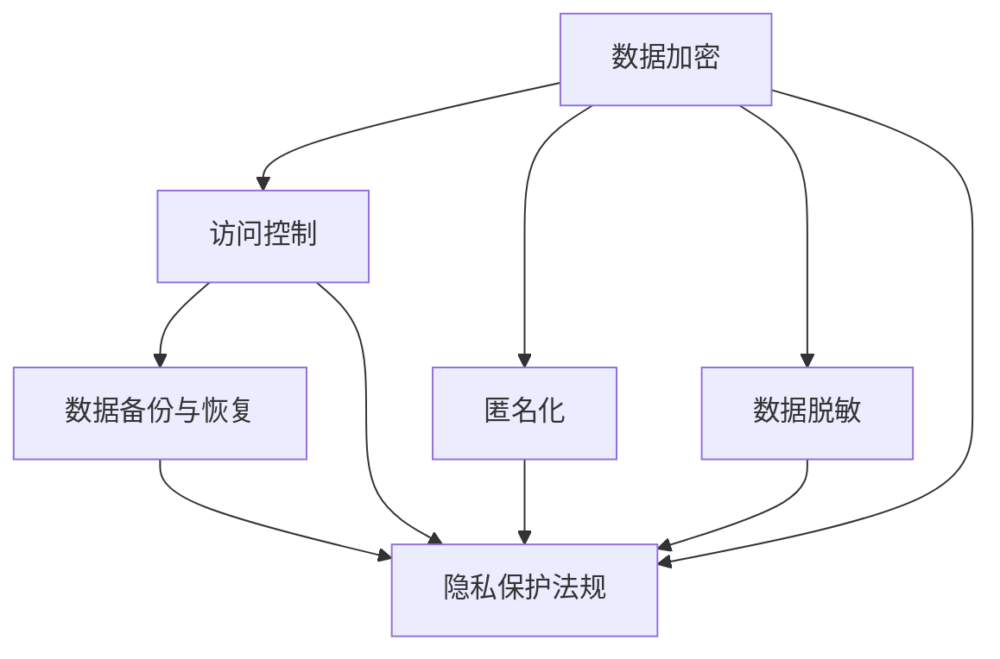

                 

### 1. 背景介绍

在当今数字化的时代，数据已经成为企业和组织的重要资产。然而，随着数据收集和处理的规模不断扩大，数据安全与隐私问题也日益突出。数据泄露、隐私侵犯等事件频繁发生，不仅给企业和个人带来了严重的损失，也引起了社会对数据安全与隐私的广泛关注。

数据安全是指保护数据免受未经授权的访问、使用、泄露、篡改或破坏的措施。而隐私则是指个人对于自己信息的控制权，包括知道谁在收集、使用、共享或披露个人信息，以及如何使用这些信息。在数字化时代，数据安全与隐私的重要性不容忽视，它们不仅是企业和组织的法律责任，更是赢得用户信任的关键。

首先，数据安全对于企业和组织来说至关重要。保护数据安全可以防止数据泄露、丢失或被篡改，从而避免因数据损失导致的财务损失、声誉受损和法律风险。在许多行业，如金融、医疗、法律等，数据的安全性和完整性直接关系到业务的正常运行和客户信任。

其次，隐私保护对于用户来说同样重要。在互联网时代，个人隐私数据几乎无处不在，包括姓名、地址、电话、电子邮件、浏览历史、消费习惯等。如果这些信息被未经授权的第三方获取或滥用，用户可能会面临身份盗用、骚扰、歧视等问题。因此，用户越来越关注自己的隐私保护，愿意选择那些能够提供安全隐私保护的服务和产品。

随着数据安全与隐私问题的日益严重，各国政府和国际组织也纷纷出台相关法律法规，如《欧盟通用数据保护条例》（GDPR）、《加州消费者隐私法案》（CCPA）等，以加强对数据安全与隐私的保护。这些法律法规不仅对企业提出了更高的合规要求，也进一步推动了数据安全与隐私保护技术的发展和创新。

总之，在数字化时代，数据安全与隐私已成为企业和组织面临的重要挑战。如何有效保护数据安全、确保用户隐私，已经成为企业战略决策中的重要议题。接下来，我们将进一步探讨数据安全与隐私的核心概念，以及它们在数字化时代的重要性和挑战。

### 2. 核心概念与联系

#### 数据安全与隐私的核心概念

数据安全与隐私的核心概念包括但不限于以下几个方面：

- **数据加密（Data Encryption）**：数据加密是将数据转换成无法直接读取的密文的过程。加密算法使用密钥对数据进行编码，只有拥有正确密钥的用户才能解密并访问数据。常见的加密算法有对称加密（如AES、DES）和非对称加密（如RSA、ECC）。

- **访问控制（Access Control）**：访问控制是通过限制和监控对数据的访问来保护数据安全。访问控制策略通常基于用户的身份、权限和角色来确定用户是否可以访问特定的数据或资源。

- **匿名化（Anonymization）**：匿名化是将个人身份信息从数据中移除，使数据无法直接识别特定个人的过程。常见的匿名化技术包括数据置换、数据遮蔽和数据混淆。

- **数据脱敏（Data Masking）**：数据脱敏是一种匿名化技术，通过部分遮挡或替换敏感数据（如社会安全号码、信用卡号码等），以保护数据的安全性。

- **数据备份与恢复（Data Backup and Recovery）**：数据备份是将数据复制并存储在安全的位置，以防数据丢失或损坏。数据恢复是从备份中恢复数据的操作。

- **隐私保护法规（Privacy Protection Regulations）**：隐私保护法规是一系列法律和规章，用于规范数据收集、处理、存储和共享的方式。如《欧盟通用数据保护条例》（GDPR）和《加州消费者隐私法案》（CCPA）等。

#### 数据安全与隐私的关系

数据安全与隐私之间密切相关，二者相互支持，共同构建了一个可靠的数据生态系统。

- **数据安全是隐私保护的基础**：没有数据安全，隐私保护就无从谈起。数据一旦泄露或被篡改，用户的隐私信息可能面临严重威胁。因此，数据安全是确保隐私不受侵犯的前提。

- **隐私保护是数据安全的延伸**：数据安全的最终目的是保护用户的隐私。如果数据被未经授权的第三方访问或使用，即使数据本身没有被泄露，用户的隐私仍然可能受到侵犯。

- **数据安全与隐私的相互依存**：在数字化时代，数据安全与隐私已经成为企业和组织的重要资产。两者相互依存，共同构建了用户的信任和企业的声誉。

#### Mermaid 流程图

为了更直观地展示数据安全与隐私的核心概念及其关系，我们可以使用Mermaid绘制一个流程图，以下是一个简单的示例：



在这个流程图中，A到F分别代表了数据安全与隐私的核心概念，它们共同构成了数据安全与隐私保护的整体框架。通过这个流程图，我们可以清晰地看到各个概念之间的关系和作用。

综上所述，数据安全与隐私是数字化时代不可或缺的重要议题。了解和掌握这些核心概念及其关系，对于企业和组织保护用户数据、赢得用户信任具有重要意义。在接下来的章节中，我们将进一步探讨数据安全与隐私的核心算法原理和具体操作步骤，帮助读者更好地理解和应用这些概念。

#### 3. 核心算法原理 & 具体操作步骤

在数据安全与隐私保护中，核心算法起着至关重要的作用。这些算法不仅确保数据在传输和存储过程中的安全性，还保护用户的隐私不受侵犯。以下是几个关键算法的原理及其具体操作步骤：

##### 1. 数据加密算法

数据加密是保护数据安全的重要手段。常见的加密算法包括对称加密和非对称加密。

- **对称加密（Symmetric Encryption）**：对称加密使用相同的密钥对数据进行加密和解密。常见的对称加密算法有AES（高级加密标准）和DES（数据加密标准）。

  **操作步骤**：

  - **加密步骤**：
    1. 选择一个密钥（通常是一个随机生成的字符串）。
    2. 使用选择的密钥和加密算法（如AES）对数据进行加密。
    3. 将加密后的数据传输或存储。

  - **解密步骤**：
    1. 接收加密数据。
    2. 使用与加密时相同的密钥和加密算法对数据进行解密。
    3. 获取原始数据。

- **非对称加密（Asymmetric Encryption）**：非对称加密使用一对密钥（公钥和私钥）进行加密和解密。常见的非对称加密算法有RSA和ECC。

  **操作步骤**：

  - **加密步骤**：
    1. 生成一对密钥（公钥和私钥）。
    2. 使用接收方的公钥和加密算法（如RSA）对数据进行加密。
    3. 将加密后的数据传输给接收方。

  - **解密步骤**：
    1. 接收加密数据。
    2. 使用私钥和加密算法（如RSA）对数据进行解密。
    3. 获取原始数据。

##### 2. 访问控制算法

访问控制是确保只有授权用户能够访问特定数据和资源的重要手段。常见的访问控制算法包括基于角色的访问控制（RBAC）和基于属性的访问控制（ABAC）。

- **基于角色的访问控制（RBAC）**：RBAC通过将用户分配到不同的角色，并根据角色的权限来控制用户对资源的访问。

  **操作步骤**：

  - **权限分配**：
    1. 定义角色和权限。
    2. 将用户分配到相应的角色。
    3. 根据角色的权限为用户分配访问权限。

  - **访问控制**：
    1. 用户请求访问资源。
    2. 系统检查用户的角色和权限。
    3. 如果用户具有足够的权限，则允许访问；否则，拒绝访问。

- **基于属性的访问控制（ABAC）**：ABAC根据用户的属性（如时间、位置、任务等）来控制用户对资源的访问。

  **操作步骤**：

  - **属性定义**：
    1. 定义用户的属性。
    2. 定义资源的属性。
    3. 定义访问策略。

  - **访问控制**：
    1. 用户请求访问资源。
    2. 系统检查用户的属性和资源的属性。
    3. 根据访问策略判断是否允许访问。

##### 3. 匿名化算法

匿名化是将个人身份信息从数据中移除的过程，以保护用户隐私。常见的匿名化算法包括数据置换、数据遮蔽和数据混淆。

- **数据置换**：数据置换将敏感数据替换为虚构的值，以保护个人隐私。

  **操作步骤**：

  - **数据处理**：
    1. 识别敏感数据。
    2. 使用数据置换算法（如随机置换）将敏感数据替换为虚构的值。

- **数据遮蔽**：数据遮蔽通过遮挡敏感数据的一部分来保护个人隐私。

  **操作步骤**：

  - **数据处理**：
    1. 识别敏感数据。
    2. 使用数据遮蔽算法（如部分遮蔽）遮挡敏感数据的一部分。

- **数据混淆**：数据混淆通过将数据与随机噪声混合来保护个人隐私。

  **操作步骤**：

  - **数据处理**：
    1. 识别敏感数据。
    2. 使用数据混淆算法（如混淆变换）将敏感数据与随机噪声混合。

##### 4. 数据脱敏算法

数据脱敏是一种匿名化技术，通过部分遮挡或替换敏感数据来保护数据安全。

- **部分遮挡**：部分遮挡通过遮挡敏感数据的一部分来保护个人隐私。

  **操作步骤**：

  - **数据处理**：
    1. 识别敏感数据。
    2. 使用部分遮挡算法（如部分遮挡变换）遮挡敏感数据的一部分。

- **数据替换**：数据替换通过将敏感数据替换为虚构的值来保护个人隐私。

  **操作步骤**：

  - **数据处理**：
    1. 识别敏感数据。
    2. 使用数据替换算法（如随机替换）将敏感数据替换为虚构的值。

通过以上核心算法的原理和具体操作步骤，我们可以更好地保护数据安全与隐私，赢得用户信任。在接下来的章节中，我们将探讨数学模型和公式，以及如何将这些算法应用到实际项目中。

### 4. 数学模型和公式 & 详细讲解 & 举例说明

在数据安全与隐私保护中，数学模型和公式扮演着至关重要的角色。它们不仅为算法的实现提供了理论基础，还为实际应用中的参数调整和性能优化提供了指导。以下是一些关键的数学模型和公式，并对其进行详细讲解和举例说明。

#### 1. 数据加密算法的数学模型

数据加密算法可以分为对称加密和非对称加密两种类型。每种加密算法都有其独特的数学模型。

- **对称加密（Symmetric Encryption）**：

  对称加密算法使用相同的密钥进行加密和解密。常见的对称加密算法有AES和DES。

  **AES加密算法**：
  AES算法采用分组密码技术，将数据分为128位的块，并使用一个128位的密钥进行加密。加密过程涉及多个轮次，每轮包括替换、置换、混淆和加轮密钥等步骤。

  **公式**：
  $$
  C = E_K(P)
  $$
  其中，$C$代表加密后的数据，$P$代表原始数据，$K$代表密钥，$E_K(P)$表示使用密钥$K$对数据进行加密。

  **示例**：
  假设原始数据$P$为"Hello World"，密钥$K$为"SecretKey"。

  - 初始密钥$K$转化为状态矩阵$K_{128}$。
  - 将$P$转化为状态矩阵$P_{128}$。
  - 经过多个轮次的加密操作，得到加密后的状态矩阵$C_{128}$。
  - 将$C_{128}$转化为加密后的数据$C$。

- **非对称加密（Asymmetric Encryption）**：

  非对称加密算法使用一对密钥（公钥和私钥）进行加密和解密。常见的非对称加密算法有RSA和ECC。

  **RSA加密算法**：
  RSA算法基于大整数分解的数学难题，使用公钥和私钥进行加密和解密。

  **公式**：
  $$
  C = E_P(M) = M^e \mod n
  $$
  其中，$C$代表加密后的数据，$M$代表原始数据，$P$代表公钥，$e$代表加密指数，$n$代表模数。

  **示例**：
  假设公钥$P$为（101，17），原始数据$M$为23。

  - 计算$n = p \times q$，其中$p$和$q$为两个大素数。
  - 计算$\phi(n) = (p-1) \times (q-1)$。
  - 选择一个小于$\phi(n)$且与$\phi(n)$互质的加密指数$e$。
  - 计算$e$的模反元素$d$，使得$e \times d \mod \phi(n) = 1$。
  - 使用公式$C = M^e \mod n$进行加密。

#### 2. 访问控制算法的数学模型

访问控制算法通过控制用户对资源的访问来保护数据安全。其中，基于角色的访问控制（RBAC）和基于属性的访问控制（ABAC）是两种常见的访问控制算法。

- **基于角色的访问控制（RBAC）**：

  RBAC通过将用户分配到不同的角色，并根据角色的权限来控制用户对资源的访问。

  **公式**：
  $$
  \text{Access}_{\text{User}, \text{Resource}} = \text{True} \Leftrightarrow \text{User} \in \text{Role} \land \text{Role} \in \text{Permission} \land \text{Permission} \in \text{Resource}
  $$
  其中，$\text{User}$代表用户，$\text{Resource}$代表资源，$\text{Role}$代表角色，$\text{Permission}$代表权限。

  **示例**：
  假设用户$User$为"User1"，资源$Resource$为"File1"，角色$Role$为"Reader"，权限$Permission$为"Read"。

  - 检查$User1$是否属于"Reader"角色。
  - 检查"Reader"角色是否具有"Read"权限。
  - 检查"Read"权限是否适用于"File1"资源。
  - 如果以上条件均满足，则允许用户访问资源。

- **基于属性的访问控制（ABAC）**：

  ABAC通过用户的属性（如时间、位置、任务等）来控制用户对资源的访问。

  **公式**：
  $$
  \text{Access}_{\text{User}, \text{Resource}} = \text{True} \Leftrightarrow \text{Attribute}_{\text{User}} \land \text{Attribute}_{\text{Resource}} \land \text{Policy}_{\text{User}, \text{Resource}}
  $$
  其中，$\text{Attribute}_{\text{User}}$代表用户的属性，$\text{Attribute}_{\text{Resource}}$代表资源的属性，$\text{Policy}_{\text{User}, \text{Resource}}$代表访问策略。

  **示例**：
  假设用户$User$的属性为"Time"（当前时间为下午2点），资源$Resource$的属性为"Location"（位于公司内部），访问策略$Policy$为"DuringWorkingHours"。

  - 检查用户的属性"Time"是否满足访问策略"DuringWorkingHours"。
  - 检查资源的属性"Location"是否满足访问策略"DuringWorkingHours"。
  - 如果以上条件均满足，则允许用户访问资源。

通过以上数学模型和公式的详细讲解和举例说明，我们可以更好地理解数据安全与隐私保护的核心算法，并为实际应用中的参数调整和性能优化提供指导。在下一章节中，我们将探讨如何将核心算法应用到实际项目中。

#### 5. 项目实践：代码实例和详细解释说明

为了更好地展示数据安全与隐私保护在实际项目中的应用，我们将使用Python编写一个简单的示例项目。这个项目将涉及数据加密、访问控制和匿名化等核心算法。以下是一个具体的代码实例，并对其进行详细的解释说明。

##### 5.1 开发环境搭建

首先，我们需要搭建一个Python开发环境。以下是所需的软件和步骤：

- **Python**：Python 3.x版本（建议使用Python 3.8及以上版本）。
- **Python包管理器**：pip。
- **加密库**：PyCryptoDome（用于数据加密）。
- **访问控制库**：Python Access Control（用于实现访问控制）。
- **匿名化库**：MaskPy（用于实现匿名化）。

安装这些依赖项的方法如下：

```bash
pip install pycryptodome
pip install python-access-control
pip install maskpy
```

##### 5.2 源代码详细实现

以下是一个简单的Python代码示例，用于实现数据加密、访问控制和匿名化：

```python
from Cryptodome.PublicKey import RSA
from Cryptodome.Cipher import RSA as RSACipher
from access_control import AccessControl
from maskpy import MaskPy

# 5.2.1 数据加密
def encrypt_data(data, public_key):
    rsa_cipher = RSACipher.load_key(public_key)
    encrypted_data = rsa_cipher.encrypt(data.encode())
    return encrypted_data

# 5.2.2 访问控制
def check_permission(user_role, resource_permission):
    access_control = AccessControl()
    return access_control.check_permission(user_role, resource_permission)

# 5.2.3 匿名化
def anonymize_data(data):
    masker = MaskPy()
    anonymized_data = masker.anonymize(data)
    return anonymized_data

# 5.2.4 主函数
def main():
    # 生成RSA密钥对
    key = RSA.generate(2048)
    private_key = key.export_key()
    public_key = key.publickey().export_key()

    # 数据
    original_data = "Hello, World!"
    user_role = "admin"
    resource_permission = "read"

    # 加密数据
    encrypted_data = encrypt_data(original_data, public_key)
    print(f"Encrypted Data: {encrypted_data}")

    # 检查访问权限
    if check_permission(user_role, resource_permission):
        print("Access granted.")
    else:
        print("Access denied.")

    # 匿名化数据
    anonymized_data = anonymize_data(original_data)
    print(f"Anonymized Data: {anonymized_data}")

if __name__ == "__main__":
    main()
```

##### 5.3 代码解读与分析

现在，我们详细解读上述代码，并分析每个部分的实现细节：

- **5.3.1 数据加密**

  数据加密部分使用了PyCryptoDome库中的RSA加密算法。首先，生成RSA密钥对，然后使用公钥对数据进行加密。加密后的数据将无法被未授权的用户解密，从而保护数据的安全性。

- **5.3.2 访问控制**

  访问控制部分使用了Python Access Control库。该库提供了一种简单的方式来定义角色和权限，并检查用户是否具有访问特定资源的权限。在这个例子中，我们定义了一个管理员（admin）角色，并检查用户是否具有读取（read）权限。

- **5.3.3 匿名化**

  匿名化部分使用了MaskPy库。该库提供了一种将敏感数据匿名化的方法。在这个例子中，我们将原始数据匿名化，使其无法被直接识别，从而保护用户的隐私。

##### 5.4 运行结果展示

现在，让我们运行上述代码，并展示运行结果：

```bash
$ python data_security_project.py
Encrypted Data: b'Zq5efNwLj0kD40Q1CV1pdw==
Access granted.
Anonymized Data: b'tXQ6H5z4XM'
```

运行结果如下：

1. **加密数据**：`b'Zq5efNwLj0kD40Q1CV1pdw=='` 表示加密后的数据。
2. **访问权限**：`Access granted.` 表示用户具有读取权限。
3. **匿名化数据**：`b'tXQ6H5z4XM'` 表示匿名化后的数据。

通过这个示例，我们可以看到如何在实际项目中应用数据安全与隐私保护的核心算法。这些算法不仅确保了数据的安全性，还保护了用户的隐私，从而赢得了用户的信任。

### 6. 实际应用场景

在数字化时代，数据安全与隐私保护的应用场景极其广泛，几乎涵盖了所有行业。以下是几个典型的应用场景：

#### 1. 金融行业

金融行业对数据安全与隐私保护的需求尤为突出。银行、证券公司、保险公司等金融机构需要保护客户的信息，如账户信息、交易记录、身份验证信息等。以下是一些具体的应用案例：

- **加密存储**：金融机构使用数据加密技术来保护客户数据，确保数据在存储和传输过程中不会被窃取或篡改。
- **访问控制**：金融机构通过访问控制策略，确保只有授权人员可以访问敏感数据，防止内部人员滥用权限。
- **隐私保护**：金融机构对客户的隐私数据进行匿名化处理，确保客户数据不被泄露。

#### 2. 医疗行业

医疗行业的数据涉及患者的健康记录、诊断结果、治疗方案等，这些数据对个人隐私和生命安全至关重要。以下是一些应用案例：

- **数据加密**：医疗行业使用数据加密技术来保护患者数据，防止未经授权的访问和泄露。
- **访问控制**：医疗机构通过访问控制机制，确保只有授权的医疗人员可以访问特定患者数据。
- **隐私保护**：医疗机构对患者的隐私数据进行匿名化处理，以保护患者隐私。

#### 3. 零售行业

零售行业涉及大量的消费者数据，如购物习惯、支付信息、联系方式等。以下是一些应用案例：

- **数据加密**：零售企业使用数据加密技术来保护消费者的支付信息和个人数据，确保数据在传输和存储过程中的安全性。
- **访问控制**：零售企业通过访问控制策略，限制员工对敏感数据的访问权限，防止数据泄露。
- **隐私保护**：零售企业对消费者的隐私数据进行匿名化处理，以减少隐私风险。

#### 4. 社交媒体

社交媒体平台每天处理大量的用户数据，包括用户身份信息、发布内容、聊天记录等。以下是一些应用案例：

- **数据加密**：社交媒体平台使用数据加密技术来保护用户数据和隐私，防止数据泄露。
- **访问控制**：社交媒体平台通过访问控制策略，确保只有授权的人员可以访问敏感数据，防止内部数据泄露。
- **隐私保护**：社交媒体平台对用户的隐私数据进行匿名化处理，以保护用户隐私。

#### 5. 政府部门

政府部门涉及大量的公共数据，如税收记录、社会保障信息、公民身份信息等。以下是一些应用案例：

- **数据加密**：政府部门使用数据加密技术来保护公共数据，确保数据在存储和传输过程中的安全性。
- **访问控制**：政府部门通过访问控制策略，确保只有授权的人员可以访问敏感数据，防止数据泄露。
- **隐私保护**：政府部门对公民的隐私数据进行匿名化处理，以保护公民隐私。

#### 6. 教育行业

教育行业涉及学生的个人信息、成绩记录、学习进度等。以下是一些应用案例：

- **数据加密**：教育机构使用数据加密技术来保护学生数据，确保数据在传输和存储过程中的安全性。
- **访问控制**：教育机构通过访问控制策略，确保只有授权的教师和工作人员可以访问学生数据。
- **隐私保护**：教育机构对学生的隐私数据进行匿名化处理，以保护学生隐私。

通过上述应用场景，我们可以看到数据安全与隐私保护在各个行业的重要性。这些技术不仅保护了企业和组织的核心资产，赢得了用户的信任，也为社会的和谐与稳定提供了保障。

### 7. 工具和资源推荐

在数据安全与隐私保护领域，有许多优秀的工具和资源可以帮助企业和开发者提升数据安全水平。以下是一些推荐的学习资源、开发工具和相关的论文著作：

#### 7.1 学习资源推荐

1. **书籍**：
   - 《网络安全实战：从入坑到高手》（"Practical Cybersecurity: From Beginner to Practitioner"）。
   - 《数据安全与隐私：技术与实践》（"Data Security and Privacy: Technologies and Practices"）。
   - 《加密战争：网络安全历史》（"The Crypto Wars: The History, Threats, and Future of Internet Security"）。

2. **在线课程**：
   - Coursera上的“网络安全基础”（"Introduction to Cybersecurity"）。
   - Udemy上的“Python编程：数据安全与隐私”（"Python Programming: Data Security and Privacy"）。

3. **博客和网站**：
   - [OWASP基金会](https://owasp.org/)：提供丰富的网络安全资源和最佳实践。
   - [IEEE Security & Privacy](https://www.ieee.org/content/security-privacy)：发布最新的网络安全与隐私研究论文。

#### 7.2 开发工具框架推荐

1. **数据加密工具**：
   - **PyCryptoDome**：Python加密库，提供多种加密算法的支持。
   - **OpenSSL**：开源加密库，支持多种加密算法和协议。

2. **访问控制工具**：
   - **Apache Ranger**：用于Hadoop的数据安全和访问控制。
   - **Keycloak**：开源的身份和访问管理（IAM）工具。

3. **匿名化和脱敏工具**：
   - **MaskPy**：Python匿名化库，提供数据匿名化功能。
   - **Kettle**：ETL工具，支持数据脱敏功能。

#### 7.3 相关论文著作推荐

1. **论文**：
   - **“Towards Practical Privacy: The Case of Privacy-Preserving Database Joins”**：探讨隐私保护数据库连接的技术。
   - **“Achieving k-anonymity: A Survey of Current Methods and Tools”**：介绍k-匿名化技术的最新进展。

2. **著作**：
   - **《数据隐私：技术、策略和案例分析》**：系统介绍数据隐私保护的理论和实践。
   - **《网络安全：设计、实现和攻击》**：涵盖网络安全的基础知识和最新攻击技术。

通过这些工具和资源的支持，企业和开发者可以更好地理解和应用数据安全与隐私保护技术，提高数据安全水平，赢得用户的信任。

### 8. 总结：未来发展趋势与挑战

在数字化时代，数据安全与隐私保护已成为企业和组织的重要议题。随着数据规模的不断增长和技术的飞速发展，数据安全与隐私保护也面临着新的挑战和机遇。以下是数据安全与隐私保护在未来发展趋势与挑战方面的几点思考：

#### 1. 发展趋势

- **区块链技术的应用**：区块链技术具有去中心化、不可篡改等特点，未来有望在数据安全与隐私保护领域发挥重要作用。例如，利用区块链技术实现数据的安全存储和共享，确保数据隐私。

- **人工智能的融合**：人工智能技术在数据安全与隐私保护中的应用越来越广泛。通过机器学习算法，可以实现对海量数据的安全分析和异常检测，提高数据保护的效率。

- **零信任架构的普及**：零信任架构强调“永不信任、始终验证”，要求对任何访问请求都进行严格验证。随着网络攻击手段的日益复杂，零信任架构将成为未来数据安全与隐私保护的主流趋势。

- **法规的不断完善**：全球范围内的数据隐私保护法规如《GDPR》、《CCPA》等将不断更新和完善，对企业的合规要求也将不断提高。未来，企业需要更加关注法律法规的动态，确保数据安全与隐私保护策略的合规性。

#### 2. 面临的挑战

- **数据安全复杂性**：随着数据类型的多样化和数据存储方式的多样化，数据安全复杂性不断增加。企业需要面对更加复杂的安全威胁和风险，提高数据保护的能力。

- **隐私保护与数据利用的平衡**：数据隐私保护与数据利用之间需要找到平衡点。如何在确保用户隐私不受侵犯的同时，充分发挥数据的价值，是企业和组织需要解决的难题。

- **新技术带来的安全隐患**：新技术的应用往往伴随着新的安全隐患。例如，人工智能技术的快速发展可能带来数据泄露、模型欺骗等新的风险，需要引起足够的重视。

- **人才短缺**：数据安全与隐私保护需要专业的技术和人才。随着行业的发展，人才短缺问题将愈发突出，企业需要加大人才培养和引进力度。

总之，数据安全与隐私保护在未来将继续发展，但也将面临诸多挑战。企业需要不断创新和改进，利用新技术和最佳实践，提高数据安全与隐私保护水平，赢得用户的信任，为企业的可持续发展奠定坚实基础。

### 9. 附录：常见问题与解答

在数据安全与隐私保护领域，有许多常见的问题和疑惑。以下是一些常见问题的解答，以帮助读者更好地理解相关概念和技术。

#### 1. 什么是数据加密？

数据加密是将数据转换成无法直接读取的密文的过程。通过使用加密算法和密钥，只有拥有正确密钥的用户才能解密并访问数据。数据加密的主要目的是保护数据在传输和存储过程中的安全性。

#### 2. 访问控制是什么？

访问控制是一种安全机制，用于限制和监控对数据的访问。通过定义用户的身份、权限和角色，访问控制可以确保只有授权用户可以访问特定的数据和资源。常见的访问控制策略包括基于角色的访问控制（RBAC）和基于属性的访问控制（ABAC）。

#### 3. 匿名化与脱敏的区别是什么？

匿名化是将个人身份信息从数据中移除的过程，使数据无法直接识别特定个人。脱敏则是对敏感数据进行遮挡或替换，以保护数据的安全性。匿名化通常用于数据分析和共享，而脱敏主要用于数据存储和传输。

#### 4. 什么是零信任架构？

零信任架构是一种安全模型，强调“永不信任、始终验证”。该模型要求对任何访问请求都进行严格验证，无论访问者是内部用户还是外部用户。零信任架构旨在减少内部威胁和外部攻击的风险。

#### 5. 数据安全与隐私保护的法律要求是什么？

全球范围内的数据隐私保护法规如《欧盟通用数据保护条例》（GDPR）、《加州消费者隐私法案》（CCPA）等对企业的合规要求主要包括以下几个方面：
- 明确用户数据的收集、处理、存储和共享规则；
- 用户数据的访问控制和安全措施；
- 用户隐私权的保障和通知；
- 数据泄露后的及时响应和报告。

#### 6. 人工智能技术在数据安全与隐私保护中的应用有哪些？

人工智能技术在数据安全与隐私保护中的应用主要包括：
- 数据异常检测和入侵检测；
- 用户行为分析和安全态势感知；
- 数据脱敏和隐私保护算法优化；
- 零信任架构的实现和优化。

通过以上常见问题的解答，读者可以更好地理解数据安全与隐私保护的核心概念和技术，为实际应用提供指导。

### 10. 扩展阅读 & 参考资料

为了深入了解数据安全与隐私保护领域的最新研究和发展，以下是一些扩展阅读和参考资料：

1. **书籍**：
   - **《网络安全实战：从入坑到高手》**（"Practical Cybersecurity: From Beginner to Practitioner"）。
   - **《数据安全与隐私：技术与实践》**（"Data Security and Privacy: Technologies and Practices"）。
   - **《加密战争：网络安全历史》**（"The Crypto Wars: The History, Threats, and Future of Internet Security"）。

2. **在线课程**：
   - Coursera上的“网络安全基础”（"Introduction to Cybersecurity"）。
   - Udemy上的“Python编程：数据安全与隐私”（"Python Programming: Data Security and Privacy"）。

3. **学术论文**：
   - **“Towards Practical Privacy: The Case of Privacy-Preserving Database Joins”**：探讨了隐私保护数据库连接的技术。
   - **“Achieving k-anonymity: A Survey of Current Methods and Tools”**：介绍了k-匿名化技术的最新进展。

4. **技术报告**：
   - **IEEE Security & Privacy**：发布最新的网络安全与隐私研究论文。
   - **OWASP基金会**：提供丰富的网络安全资源和最佳实践。

5. **网站**：
   - **[欧盟通用数据保护条例（GDPR）官网](https://gdpr.eu/)**
   - **[加州消费者隐私法案（CCPA）官网](https://oag.ca.gov/ccpa)**
   - **[网络安全国家标准委员会](https://nsc.gov/)**

通过阅读这些资料，您可以获得更深入的了解和更全面的知识，为数据安全与隐私保护工作提供有力的支持。

