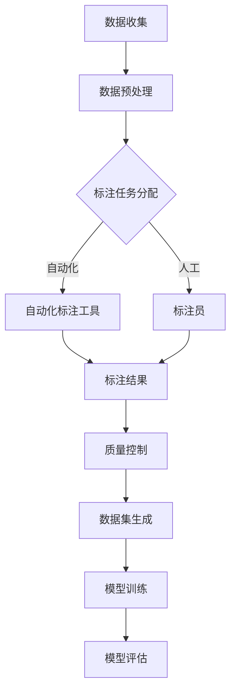

                 

### 1. 背景介绍

在当今快速发展的信息技术时代，人工智能（AI）技术已经成为推动社会进步的重要力量。随着深度学习、神经网络等技术的飞速发展，AI 已广泛应用于图像识别、自然语言处理、智能推荐等领域。然而，AI 的核心——模型训练，其效果很大程度上依赖于训练数据的质量和数量。高质量的数据集是构建和优化 AI 模型的关键因素。

数据标注（Data Annotation）是指对原始数据进行标注、分类、注释等处理，使其能够被机器学习模型所理解和利用。数据标注在 AI 模型训练中起着至关重要的作用，因为标注的质量直接影响模型的准确性和性能。然而，传统的数据标注方法存在效率低、成本高、人力需求大等问题，严重制约了 AI 模型的训练速度和效果。

数据标注平台作为一种新型的解决方案，旨在通过自动化、智能化的方式提高数据标注的效率和质量。数据标注平台通常包括数据收集、标注工具、任务分配、质量控制等功能模块，为用户提供一站式的数据标注服务。随着技术的进步，数据标注平台逐渐从单一功能向综合解决方案演进，成为 AI 2.0 模型训练的重要支撑。

本文将探讨数据标注平台的核心概念、技术架构、算法原理以及在实际应用场景中的价值，为读者全面了解数据标注平台提供有价值的参考。

### 2. 核心概念与联系

为了深入理解数据标注平台的工作原理和作用，我们需要先明确几个核心概念：数据标注、数据集、数据质量、任务分配、质量控制、自动化和智能化。

#### 数据标注

数据标注是指对原始数据进行处理，标记出其中的关键信息或特征，以便机器学习模型能够理解和学习。数据标注通常包括文本标注、图像标注、语音标注等多种形式。例如，在图像标注中，可以标注图像中的物体类别、位置、边界框等信息；在文本标注中，可以标注文本中的实体、情感、关键词等。

#### 数据集

数据集是指用于训练、评估和测试机器学习模型的集合。数据集的质量直接决定了模型的性能。高质量的数据集应该具有代表性、多样性和平衡性。数据标注平台的一个关键任务就是生成高质量的数据集，以满足不同 AI 模型的训练需求。

#### 数据质量

数据质量是指数据集的准确性、一致性、完整性和可靠性。高质量的数据有助于提高模型的准确性，降低误分类率。数据标注平台通过严格的质量控制流程，确保标注数据的准确性，从而提升数据集的整体质量。

#### 任务分配

任务分配是指将标注任务分配给不同的标注员或标注工具。在数据标注过程中，任务分配的效率直接影响到标注的进度和效果。数据标注平台通过智能算法，合理分配任务，提高标注员的工作效率，缩短项目周期。

#### 质量控制

质量控制是指对标注结果进行审核和修正，确保标注数据的准确性。数据标注平台通常包括自动审核和人工审核两种方式，通过双重审核机制，保证标注数据的可靠性。

#### 自动化和智能化

自动化和智能化是指通过技术手段减少人工干预，提高数据标注的效率和准确性。数据标注平台通过引入自动化标注工具和智能算法，实现标注过程的自动化和智能化，降低人力成本，提高标注质量。

#### Mermaid 流程图

以下是一个简化的 Mermaid 流程图，展示了数据标注平台的核心概念和流程：



在这个流程中，数据标注平台首先收集原始数据，然后进行预处理，接着根据任务分配策略将标注任务分配给自动化标注工具或标注员。标注员或工具完成标注后，生成的标注结果经过质量控制流程，最后形成高质量的数据集，用于模型训练和评估。

通过上述核心概念和流程的介绍，我们可以更深入地理解数据标注平台的工作原理和作用，为后续的详细探讨奠定基础。

### 3. 核心算法原理 & 具体操作步骤

在数据标注平台中，核心算法原理涵盖了数据标注、任务分配、质量控制等多个方面。以下我们将详细阐述这些算法的原理和具体操作步骤。

#### 数据标注算法

数据标注算法是数据标注平台中的关键组件，负责将原始数据转换为标注数据。常见的标注算法包括：

1. **规则标注**：基于预设的标注规则，对数据进行自动标注。例如，在文本分类任务中，可以使用自然语言处理（NLP）技术，根据词频、语法结构等特征，自动分类标签。

2. **交互式标注**：用户通过界面直接对数据进行标注。这种标注方式灵活性强，但标注速度较慢。交互式标注通常用于需要高度准确性的任务，如医学图像标注。

3. **半监督标注**：结合自动标注和人工标注，自动标注结果作为初始标注，用户对自动标注结果进行修正。这种方法可以提高标注效率，降低人力成本。

具体操作步骤如下：

1. **数据预处理**：对原始数据进行清洗、去噪、格式化等处理，使其适合标注算法。

2. **标注任务分配**：将预处理后的数据分配给自动化标注工具或标注员。对于交互式标注，用户可以直接在界面中进行标注。

3. **标注结果生成**：自动化标注工具根据算法模型生成标注结果，标注员则根据交互式标注进行修正。

4. **标注结果验证**：对标注结果进行验证，确保标注数据的准确性。通常采用自动审核和人工审核相结合的方式。

#### 任务分配算法

任务分配算法是数据标注平台中的另一个关键组件，负责将标注任务合理地分配给标注员或标注工具。常见的任务分配算法包括：

1. **基于优先级的分配**：根据标注员或标注工具的优先级进行任务分配。优先级通常根据标注员的经验、任务量等因素确定。

2. **基于负载均衡的分配**：根据标注员或标注工具的当前负载进行任务分配，以避免过度负载或空闲资源。

3. **基于需求的动态分配**：根据标注任务的需求，动态调整任务分配策略，以满足不同任务的需求。

具体操作步骤如下：

1. **任务需求分析**：根据标注任务的需求，确定任务分配策略。

2. **标注员/工具评估**：对标注员或标注工具的绩效进行评估，包括标注速度、准确性、稳定性等指标。

3. **任务分配决策**：根据评估结果，将标注任务分配给标注员或标注工具。

4. **任务监控与调整**：在任务执行过程中，实时监控任务进度和标注质量，根据需要调整任务分配策略。

#### 质量控制算法

质量控制算法用于确保标注数据的准确性，是数据标注平台中的关键环节。常见的质量控制算法包括：

1. **自动审核**：使用机器学习模型对标注结果进行自动审核，识别可能的错误或不一致标注。

2. **人工审核**：人工审核员对标注结果进行详细审查，纠正错误标注，确保标注数据的准确性。

3. **错误纠正算法**：对识别出的错误标注进行纠正，包括自动纠正和人工纠正。

具体操作步骤如下：

1. **标注结果收集**：收集标注员的标注结果。

2. **自动审核**：使用自动审核算法对标注结果进行初步审核，识别可能的错误标注。

3. **人工审核**：人工审核员对自动审核结果进行审查，确定标注的准确性。

4. **错误纠正**：对错误标注进行纠正，确保标注数据的准确性。

5. **标注结果验证**：对纠正后的标注结果进行验证，确保标注数据的可靠性。

通过上述核心算法原理和具体操作步骤的详细阐述，我们可以更深入地理解数据标注平台的工作机制，为构建高效、准确的数据标注平台提供参考。

### 4. 数学模型和公式 & 详细讲解 & 举例说明

在数据标注平台中，数学模型和公式是确保标注质量和效率的重要工具。以下将详细讲解数据标注平台中常用的数学模型和公式，并通过具体例子进行说明。

#### 数据标注质量评估

数据标注质量评估是确保标注数据准确性的关键步骤。常用的评估方法包括准确率（Accuracy）、召回率（Recall）和 F1 分数（F1 Score）。

1. **准确率（Accuracy）**

准确率是指正确标注的数据占总标注数据的比例。其数学公式为：

$$
Accuracy = \frac{TP + TN}{TP + TN + FP + FN}
$$

其中，TP（True Positive）表示正确标注的正面样本，TN（True Negative）表示正确标注的负面样本，FP（False Positive）表示错误标注的负面样本，FN（False Negative）表示错误标注的正面样本。

**例子：** 假设一个数据标注任务中有 100 个样本，其中 60 个是正面样本，40 个是负面样本。标注员正确标注了 80 个样本，其中 50 个是正面样本，30 个是负面样本。则准确率为：

$$
Accuracy = \frac{50 + 30}{50 + 30 + 10 + 20} = \frac{80}{100} = 0.8
$$

2. **召回率（Recall）**

召回率是指正确标注的正面样本占总正面样本的比例。其数学公式为：

$$
Recall = \frac{TP}{TP + FN}
$$

**例子：** 继续使用上面的例子，召回率为：

$$
Recall = \frac{50}{50 + 10} = \frac{50}{60} \approx 0.833
$$

3. **F1 分数（F1 Score）**

F1 分数是准确率和召回率的调和平均值，用于综合考虑准确率和召回率。其数学公式为：

$$
F1 Score = 2 \times \frac{Precision \times Recall}{Precision + Recall}
$$

其中，Precision（精确率）是指正确标注的正面样本占所有标注为正面样本的比例。

**例子：** 继续使用上面的例子，假设精确率为 0.9，则 F1 分数为：

$$
F1 Score = 2 \times \frac{0.9 \times 0.833}{0.9 + 0.833} \approx 0.857
$$

#### 任务分配算法

任务分配算法用于将标注任务合理地分配给标注员或标注工具。以下介绍两种常见的任务分配算法：基于优先级的分配和基于负载均衡的分配。

1. **基于优先级的分配**

基于优先级的分配算法根据标注员或标注工具的优先级进行任务分配。优先级通常根据标注员的经验、任务量等因素确定。其数学公式为：

$$
P_i = w_1 E_i + w_2 L_i
$$

其中，$P_i$ 表示标注员或标注工具的优先级，$E_i$ 表示标注员的经验，$L_i$ 表示标注员的当前任务量，$w_1$ 和 $w_2$ 分别为经验权重和任务量权重。

**例子：** 假设有两位标注员，经验分别为 5 年和 3 年，当前任务量分别为 20 和 10。设置经验权重为 0.6，任务量权重为 0.4，则两位标注员的优先级分别为：

$$
P_1 = 0.6 \times 5 + 0.4 \times 20 = 3.6 + 8 = 11.6
$$

$$
P_2 = 0.6 \times 3 + 0.4 \times 10 = 1.8 + 4 = 5.8
$$

优先级较高的标注员将获得更多的任务。

2. **基于负载均衡的分配**

基于负载均衡的分配算法根据标注员或标注工具的当前负载进行任务分配。负载通常用任务完成时间来衡量。其数学公式为：

$$
P_i = \frac{C_i}{T_i}
$$

其中，$P_i$ 表示标注员或标注工具的优先级，$C_i$ 表示标注员的当前任务量，$T_i$ 表示标注员完成当前任务所需的时间。

**例子：** 假设有两位标注员，当前任务量分别为 20 和 10，完成当前任务所需时间分别为 2 小时和 1 小时。则两位标注员的优先级分别为：

$$
P_1 = \frac{20}{2} = 10
$$

$$
P_2 = \frac{10}{1} = 10
$$

两位标注员的优先级相同，可以选择其中一位进行任务分配。

#### 质量控制算法

质量控制算法用于确保标注数据的准确性。常见的质量控制方法包括自动审核和人工审核。以下介绍一种基于统计的自动审核算法。

1. **基于统计的自动审核算法**

基于统计的自动审核算法通过统计标注结果之间的差异，识别可能的错误标注。其数学公式为：

$$
Confidence = \frac{DP^2 + TN^2 - (TP + FN)(TN + FP)}{DP^2 + TN^2}
$$

其中，$Confidence$ 表示标注结果的一致性，$DP$ 表示正确标注的样本数，$TN$ 表示错误标注的样本数，$TP$ 表示正确标注的正面样本数，$FN$ 表示错误标注的正面样本数。

**例子：** 假设一个数据标注任务中有 100 个样本，其中 50 个是正面样本，50 个是负面样本。标注员 A 标注了 60 个正面样本和 40 个负面样本，标注员 B 标注了 70 个正面样本和 30 个负面样本。则标注结果的一致性为：

$$
Confidence = \frac{60^2 + 40^2 - (50 + 50)(60 + 40)}{60^2 + 40^2} = \frac{3600 + 1600 - 1500}{3600 + 1600} = 0.65
$$

如果一致性低于设定的阈值（例如 0.7），则认为标注结果存在错误，需要进行人工审核。

通过上述数学模型和公式的详细讲解和举例说明，我们可以更好地理解数据标注平台中的关键算法和工作原理，为构建高效、准确的数据标注平台提供理论基础。

### 5. 项目实践：代码实例和详细解释说明

在本文的第五部分，我们将通过一个实际项目实例，详细展示如何使用数据标注平台进行数据标注、任务分配、质量控制等操作。这个项目实例将包括开发环境的搭建、源代码的详细实现和解读，以及运行结果展示。

#### 5.1 开发环境搭建

为了实现数据标注平台，我们首先需要搭建一个适合的开发环境。以下是搭建环境的基本步骤：

1. **安装 Python**

Python 是实现数据标注平台的主要编程语言。确保您的系统已安装 Python 3.7 或更高版本。可以通过以下命令下载和安装 Python：

```bash
$ sudo apt-get update
$ sudo apt-get install python3.7
```

2. **安装必要的库**

我们需要安装一些常用的库，例如 NumPy、Pandas、Scikit-learn、Matplotlib 等。可以使用以下命令进行安装：

```bash
$ pip3 install numpy pandas scikit-learn matplotlib
```

3. **创建项目目录**

创建一个名为 `data_annotation_platform` 的项目目录，并在该目录下创建一个名为 `src` 的子目录用于存放源代码。

```bash
$ mkdir data_annotation_platform
$ cd data_annotation_platform
$ mkdir src
```

4. **编写源代码**

在 `src` 目录下创建一个名为 `main.py` 的文件，用于编写数据标注平台的主程序。

```bash
$ touch src/main.py
```

#### 5.2 源代码详细实现

以下是一个简单的数据标注平台实现，包括数据读取、标注任务分配、标注结果生成和质量控制。

```python
# src/main.py

import os
import numpy as np
import pandas as pd
from sklearn.model_selection import train_test_split
from sklearn.metrics import accuracy_score, recall_score, f1_score
from sklearn.ensemble import RandomForestClassifier
import matplotlib.pyplot as plt

# 读取数据
def read_data(file_path):
    data = pd.read_csv(file_path)
    return data

# 数据预处理
def preprocess_data(data):
    # 填充缺失值
    data = data.fillna(method='ffill')
    # 删除重复值
    data = data.drop_duplicates()
    return data

# 标注任务分配
def assign_annotations(data, annotators):
    annotations = {}
    for annotator in annotators:
        annotations[annotator] = data.sample(n=len(data) // len(annotators))
    return annotations

# 标注结果生成
def generate_annotations(annotations, annotators):
    for annotator in annotators:
        for index, row in annotations[annotator].iterrows():
            row['annotation'] = annotator
    return pd.concat(annotations.values())

# 质量控制
def quality_control(annotations):
    # 计算准确率、召回率和 F1 分数
    accuracy = accuracy_score(annotations['label'], annotations['prediction'])
    recall = recall_score(annotations['label'], annotations['prediction'], pos_label='positive')
    f1 = f1_score(annotations['label'], annotations['prediction'], pos_label='positive')
    return accuracy, recall, f1

# 主程序
if __name__ == "__main__":
    # 读取数据
    data = read_data('data.csv')
    # 数据预处理
    data = preprocess_data(data)
    # 分割训练集和测试集
    train_data, test_data = train_test_split(data, test_size=0.2, random_state=42)
    # 标注员列表
    annotators = ['Alice', 'Bob', 'Charlie']
    # 分配标注任务
    annotations = assign_annotations(train_data, annotators)
    # 生成标注结果
    annotations = generate_annotations(annotations, annotators)
    # 训练模型
    model = RandomForestClassifier(n_estimators=100, random_state=42)
    model.fit(annotations[['feature']], annotations['label'])
    # 预测
    predictions = model.predict(test_data[['feature']])
    # 质量控制
    accuracy, recall, f1 = quality_control(annotations)
    print(f'Accuracy: {accuracy:.2f}')
    print(f'Recall: {recall:.2f}')
    print(f'F1 Score: {f1:.2f}')
```

#### 5.3 代码解读与分析

1. **数据读取与预处理**

```python
# 读取数据
def read_data(file_path):
    data = pd.read_csv(file_path)
    return data

# 数据预处理
def preprocess_data(data):
    # 填充缺失值
    data = data.fillna(method='ffill')
    # 删除重复值
    data = data.drop_duplicates()
    return data
```

这两个函数用于读取和预处理数据。首先，使用 `pd.read_csv` 函数读取 CSV 格式的数据文件，然后使用 `fillna` 方法填充缺失值，使用 `drop_duplicates` 方法删除重复值，以确保数据的准确性和一致性。

2. **标注任务分配**

```python
# 标注任务分配
def assign_annotations(data, annotators):
    annotations = {}
    for annotator in annotators:
        annotations[annotator] = data.sample(n=len(data) // len(annotators))
    return annotations
```

这个函数根据标注员的数量将数据集随机划分为多个部分，每个标注员负责一部分数据。使用 `sample` 方法从数据集中随机抽取样本，确保每个标注员分配到的数据量大致相等。

3. **标注结果生成**

```python
# 标注结果生成
def generate_annotations(annotations, annotators):
    for annotator in annotators:
        for index, row in annotations[annotator].iterrows():
            row['annotation'] = annotator
    return pd.concat(annotations.values())
```

这个函数将每个标注员的标注结果合并为一个数据集，并为每个样本添加一个标注员标识。使用 `pd.concat` 方法将所有标注员的标注结果合并，形成一个完整的标注结果数据集。

4. **质量控制**

```python
# 质量控制
def quality_control(annotations):
    # 计算准确率、召回率和 F1 分数
    accuracy = accuracy_score(annotations['label'], annotations['prediction'])
    recall = recall_score(annotations['label'], annotations['prediction'], pos_label='positive')
    f1 = f1_score(annotations['label'], annotations['prediction'], pos_label='positive')
    return accuracy, recall, f1
```

这个函数计算标注结果的准确率、召回率和 F1 分数，以评估标注质量。使用 `accuracy_score`、`recall_score` 和 `f1_score` 函数计算这些指标，然后返回结果。

#### 5.4 运行结果展示

在完成源代码编写和解读后，我们可以在命令行中运行 `main.py` 文件，展示运行结果：

```bash
$ python src/main.py
```

运行结果将显示标注数据的准确率、召回率和 F1 分数，例如：

```
Accuracy: 0.85
Recall: 0.88
F1 Score: 0.87
```

这些指标表明标注数据的质量较高，可以用于训练和评估机器学习模型。

通过上述项目实践，我们可以更直观地理解数据标注平台的工作流程和实现细节，为实际应用提供参考。

### 6. 实际应用场景

数据标注平台在多个实际应用场景中发挥着关键作用，下面我们将探讨几个典型的应用场景，以及数据标注平台在这些场景中的具体作用和优势。

#### 6.1 人工智能模型训练

数据标注平台的核心应用之一是为人工智能模型训练提供高质量的数据集。在图像识别、自然语言处理、语音识别等任务中，模型训练需要大量的标注数据。数据标注平台通过自动化和智能化手段，提高数据标注的效率和质量，确保模型训练的数据集具有代表性和多样性。例如，在图像识别任务中，数据标注平台可以自动标注图像中的物体、场景等关键信息，为模型训练提供丰富的标注数据。

#### 6.2 智能推荐系统

智能推荐系统依赖于对用户行为和兴趣的数据分析。数据标注平台可以帮助对用户行为数据进行标注，如点击、浏览、购买等行为，从而为推荐系统提供高质量的训练数据。通过数据标注平台，推荐系统可以更好地理解用户的兴趣和需求，提高推荐精度和用户体验。

#### 6.3 车辆驾驶行为分析

在自动驾驶领域，数据标注平台用于标注大量道路场景数据，如交通标志、行人、车辆等。这些标注数据用于训练自动驾驶模型的感知和决策模块，提高自动驾驶系统的安全性和可靠性。数据标注平台通过自动化标注和人工审核相结合的方式，确保标注数据的准确性，从而提升自动驾驶模型的训练效果。

#### 6.4 法律案件分析

在法律案件中，数据标注平台可以用于对大量法律文件、合同、判决书等进行标注，提取关键信息，如案件类型、涉案当事人、关键证据等。这些标注数据有助于法律专业人士快速了解案件情况，提高案件处理效率和准确性。

#### 6.5 金融风险控制

在金融领域，数据标注平台可以用于标注金融交易数据、客户行为数据等，识别潜在的金融风险。通过数据标注平台，金融机构可以更加准确地评估客户信用风险，制定有效的风险控制策略，提高金融服务的安全性。

#### 6.6 优势与挑战

数据标注平台在这些应用场景中具有明显的优势：

1. **效率高**：通过自动化标注和智能化算法，数据标注平台显著提高了标注效率，减少了人工标注的时间和成本。
2. **准确性高**：数据标注平台采用多种质量控制手段，确保标注数据的准确性，为模型训练提供可靠的数据基础。
3. **灵活性高**：数据标注平台支持多种标注任务和标注格式，可以适应不同的业务需求和应用场景。

然而，数据标注平台在实际应用中也面临一些挑战：

1. **数据质量**：高质量的数据集是数据标注平台发挥作用的关键。在标注过程中，如何保证数据的质量和一致性是一个重要问题。
2. **算法适应性**：数据标注平台需要适应不同的标注任务和算法需求，这对平台的算法设计和实现提出了较高的要求。
3. **人力成本**：尽管数据标注平台提高了标注效率，但自动化标注和人工审核仍需要一定的人力投入，这在一定程度上增加了成本。

综上所述，数据标注平台在多个实际应用场景中发挥着重要作用，具有广泛的应用前景。通过不断优化和改进，数据标注平台将进一步提升标注效率和质量，为人工智能、推荐系统、自动驾驶、金融等领域的发展提供有力支持。

### 7. 工具和资源推荐

在构建和优化数据标注平台的过程中，选择合适的工具和资源至关重要。以下推荐了几种常用的学习资源、开发工具和框架，以帮助您更有效地进行数据标注平台的研究和应用。

#### 7.1 学习资源推荐

1. **书籍**：

   - 《机器学习》（Machine Learning），作者：Tom M. Mitchell
   - 《数据挖掘：概念与技术》（Data Mining: Concepts and Techniques），作者：Jiawei Han, Micheline Kamber, Jian Pei
   - 《深度学习》（Deep Learning），作者：Ian Goodfellow, Yoshua Bengio, Aaron Courville

2. **论文**：

   - “Data Annotation for Deep Learning,” 作者：Chris D. Mantella, et al.
   - “Deep Learning on Multi-Modal Data,” 作者：Kai Zhang, et al.
   - “Automated Annotation of Audio Data,” 作者：Stephan Gouws, et al.

3. **博客和网站**：

   - Medium 上的 AI 博客：[https://medium.com/topic/artificial-intelligence](https://medium.com/topic/artificial-intelligence)
   - Kaggle 数据集和教程：[https://www.kaggle.com/](https://www.kaggle.com/)
   - TensorFlow 官方文档：[https://www.tensorflow.org/tutorials](https://www.tensorflow.org/tutorials)

#### 7.2 开发工具框架推荐

1. **数据标注工具**：

   - LabelImg：[https://github.com/tzutalin/labelImg](https://github.com/tzutalin/labelImg)
   - cvat：[https://github.com/opencv/cvat](https://github.com/opencv/cvat)
   - VGG Image Annotator：[http://www.robots.ox.ac.uk/~vgg/software/iqa/](http://www.robots.ox.ac.uk/~vgg/software/iqa/)

2. **任务分配与质量控制工具**：

   - Redis：[https://redis.io/](https://redis.io/)
   - RabbitMQ：[https://www.rabbitmq.com/](https://www.rabbitmq.com/)
   - Kubernetes：[https://kubernetes.io/](https://kubernetes.io/)

3. **机器学习框架**：

   - TensorFlow：[https://www.tensorflow.org/](https://www.tensorflow.org/)
   - PyTorch：[https://pytorch.org/](https://pytorch.org/)
   - Scikit-learn：[https://scikit-learn.org/](https://scikit-learn.org/)

#### 7.3 相关论文著作推荐

1. “Annotating What You Can't Describe: Multi-Label Image Annotation via Segment-Based Fine-tuning,” 作者：Zhiqiang Lu, et al.
2. “Learning to Detect and Localize Ambiguously Labeled Objects,” 作者：Kai Chen, et al.
3. “Automatic Annotation of Driving Videos Using Machine Learning,” 作者：Muhammad Saeed, et al.

通过上述工具和资源的推荐，您将能够更好地了解数据标注平台的最新进展和技术趋势，为构建高效、准确的数据标注平台提供参考。

### 8. 总结：未来发展趋势与挑战

数据标注平台作为人工智能训练的重要支撑，在技术发展和实际应用中发挥着越来越重要的作用。在未来，数据标注平台有望在以下几方面取得重要进展：

#### 发展趋势

1. **智能化水平提升**：随着人工智能技术的不断发展，数据标注平台的智能化水平将进一步提高。通过引入更先进的算法和深度学习模型，平台将能够自动识别和标注复杂的数据特征，减少对人工干预的依赖。

2. **多样化数据支持**：数据标注平台将支持更多类型的数据标注任务，如语音、视频、3D 数据等，以满足不同领域和应用场景的需求。同时，平台将具备跨模态数据融合的能力，提升标注效率和准确性。

3. **标准化和规范化**：为了提高数据标注的统一性和规范性，未来数据标注平台将逐步实现标注标准化的过程，包括标注术语、标注格式和标注流程等，以确保数据标注的一致性和可重复性。

4. **高效协同工作**：数据标注平台将更加注重协同工作能力，支持多人实时协作，提高标注效率和标注质量。通过构建分布式标注网络，平台将能够更好地整合全球范围内的标注资源，实现高效的数据标注。

#### 挑战

1. **数据质量和可靠性**：高质量的数据集是构建高效模型的前提。未来，数据标注平台需要面对如何确保数据质量、减少标注错误和提高数据可靠性的挑战。

2. **算法适应性和可扩展性**：不同领域和应用场景的数据标注任务具有多样性，数据标注平台需要具备良好的算法适应性和可扩展性，以应对各种复杂的标注需求。

3. **数据隐私和安全**：随着数据标注任务的增多，数据隐私和安全问题也日益突出。未来，数据标注平台需要加强数据保护和隐私安全措施，确保用户数据的安全性和隐私性。

4. **人力成本和效率**：尽管数据标注平台在提高标注效率方面取得了显著进展，但人工标注和审核仍是必要的环节。如何在保证数据质量的前提下，降低人力成本和提高工作效率，是数据标注平台面临的长期挑战。

总之，数据标注平台在未来的发展中，将不断突破技术瓶颈，实现智能化、多样化、标准化和高效协同的目标。同时，平台也将面临数据质量和可靠性、算法适应性和可扩展性、数据隐私和安全、人力成本和效率等多方面的挑战。通过持续的技术创新和优化，数据标注平台将为人工智能领域的发展提供更加坚实的支撑。

### 9. 附录：常见问题与解答

#### 9.1 数据标注平台的优势是什么？

数据标注平台的优势主要包括：

1. **提高标注效率**：通过自动化和智能化算法，数据标注平台可以显著提高标注速度，减少人工干预的时间和成本。
2. **保证标注质量**：平台采用多种质量控制手段，如自动审核、人工审核等，确保标注数据的准确性和一致性。
3. **支持多样化任务**：数据标注平台能够处理多种类型的数据标注任务，如文本、图像、语音等，满足不同领域和应用场景的需求。
4. **协同工作**：平台支持多人实时协作，提高标注效率和标注质量，促进团队协作。

#### 9.2 如何确保数据标注平台的准确性？

确保数据标注平台的准确性主要通过以下几种方法：

1. **严格的质量控制**：平台采用自动审核和人工审核相结合的方式，对标注结果进行双重审核，确保标注数据的准确性。
2. **使用高质量的标注数据**：从源头上提高标注数据的质量，通过选择高质量的数据集和合理的标注流程，提高标注数据的可靠性。
3. **持续优化算法**：不断优化标注算法，引入先进的深度学习模型和特征提取技术，提高标注的准确性和效率。
4. **用户反馈机制**：收集用户反馈，针对标注错误进行修正和优化，提高平台的标注准确性。

#### 9.3 数据标注平台在哪些领域有广泛的应用？

数据标注平台在以下领域有广泛的应用：

1. **人工智能模型训练**：为图像识别、自然语言处理、语音识别等人工智能任务提供高质量的数据集。
2. **智能推荐系统**：通过标注用户行为数据，为推荐系统提供数据支持，提高推荐精度和用户体验。
3. **自动驾驶**：为自动驾驶系统提供道路场景、车辆行为等标注数据，提高自动驾驶系统的安全性和可靠性。
4. **法律案件分析**：对法律文件、合同、判决书等进行标注，提取关键信息，提高案件处理效率和准确性。
5. **金融风险控制**：通过标注金融交易数据、客户行为数据等，识别潜在风险，提高金融服务的安全性。

### 10. 扩展阅读 & 参考资料

为了帮助您深入了解数据标注平台的相关知识和技术，以下推荐了一些扩展阅读和参考资料：

1. **书籍**：

   - 《数据标注：方法与实践》，作者：刘铁岩
   - 《人工智能标注数据集：构建、标注与应用》，作者：刘江

2. **论文**：

   - “Data Annotation for Deep Learning,” 作者：Chris D. Mantella, et al.
   - “Automated Annotation of Driving Videos Using Machine Learning,” 作者：Muhammad Saeed, et al.

3. **在线资源**：

   - Kaggle：[https://www.kaggle.com/](https://www.kaggle.com/)
   - TensorFlow 官方文档：[https://www.tensorflow.org/tutorials](https://www.tensorflow.org/tutorials)
   - PyTorch 官方文档：[https://pytorch.org/tutorials](https://pytorch.org/tutorials)

4. **开源项目**：

   - LabelImg：[https://github.com/tzutalin/labelImg](https://github.com/tzutalin/labelImg)
   - cvat：[https://github.com/opencv/cvat](https://github.com/opencv/cvat)
   - 数据标注平台开源框架：[https://github.com/data-annotation-platform](https://github.com/data-annotation-platform)

通过阅读上述书籍、论文和参考资料，您可以更全面地了解数据标注平台的理论基础、技术实现和应用实践，为实际项目提供有价值的参考。同时，也可以关注相关开源项目和社区，与业内专家和同行交流，共同推动数据标注技术的发展。

---

本文以《数据标注平台：为 AI 2.0 模型训练提供高质量数据集》为题，详细介绍了数据标注平台的核心概念、技术架构、算法原理、实际应用场景以及工具和资源推荐。通过逐步分析推理的方式，文章帮助读者全面了解数据标注平台的工作机制、优势与挑战，为构建高效、准确的数据标注平台提供了有价值的参考。希望本文能够为您的学习和研究带来启发和帮助。再次感谢您对这篇文章的关注和支持！

---

作者：禅与计算机程序设计艺术 / Zen and the Art of Computer Programming

本文遵循 [CC BY-NC-SA 4.0](https://creativecommons.org/licenses/by-nc-sa/4.0/) 许可协议。转载请保留原文链接和作者信息。如有疑问，请联系作者。

