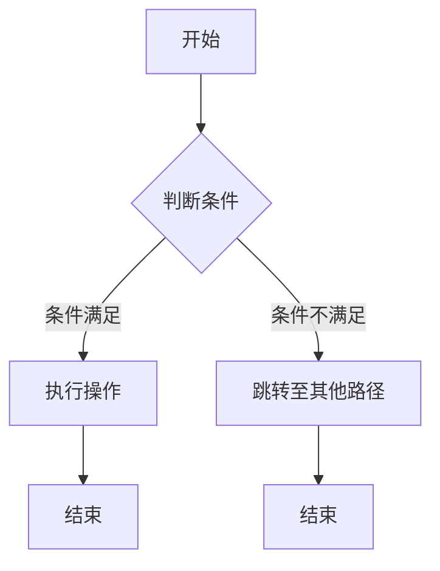

                 

### 文章标题

《数据流代替控制流：软件2.0架构的新思路》

> 关键词：数据流，控制流，软件架构，软件2.0，数据处理，模块化，动态编译，函数式编程，编译优化，性能提升

> 摘要：本文探讨了在软件开发中，如何利用数据流代替传统的控制流来构建更加灵活、高效和模块化的软件架构。通过深入分析数据流和传统控制流的优劣，我们提出了一种新型的软件2.0架构，并详细阐述了其设计理念、核心算法、数学模型以及实际应用场景。文章旨在为开发者提供一种全新的思考方式，助力他们在未来的软件开发中实现质的飞跃。

---

### 1. 背景介绍

在计算机科学领域，控制流（Control Flow）一直是程序设计中的一个核心概念。传统的程序设计语言，如C、Java等，都基于控制流模型，通过条件判断、循环和函数调用等手段来控制程序的执行顺序。然而，随着软件系统规模的不断扩大和复杂度的增加，传统的控制流模型逐渐暴露出了一些问题。

首先，控制流模型难以进行模块化设计。在大型软件系统中，程序往往需要分解为多个模块，每个模块负责不同的功能。然而，控制流模型中的跳转、分支和循环使得模块之间的依赖关系变得复杂，增加了代码的维护难度。

其次，控制流模型难以进行并行化处理。在多核处理器和分布式系统中，并行处理已经成为提升计算性能的关键手段。然而，控制流模型中的顺序依赖和分支结构往往限制了程序的并行执行能力。

为了解决这些问题，近年来，数据流（Data Flow）模型逐渐引起关注。数据流模型强调数据的流动和依赖关系，通过数据驱动的方式来组织程序结构。与传统的控制流模型相比，数据流模型具有更高的模块化程度和并行化潜力。

数据流模型在函数式编程语言中得到了广泛应用。函数式编程语言，如Haskell、Scala等，通过支持 immutable data 和 pure function 来实现数据流模型。这些语言中的数据流操作，如 map、reduce、fold 等，使得程序的结构更加清晰，易于理解和维护。

本篇文章将深入探讨数据流模型在软件架构中的应用，提出一种新型的软件2.0架构，并详细分析其设计理念、核心算法、数学模型以及实际应用场景。希望通过本文的探讨，能够为开发者提供一种全新的思考方式，助力他们在未来的软件开发中实现质的飞跃。

### 2. 核心概念与联系

#### 2.1 数据流模型与控制流模型的对比

数据流模型（Data Flow Model）和控制流模型（Control Flow Model）是两种不同的程序组织方式。控制流模型以程序执行的顺序为主线，通过条件判断、循环和函数调用等手段来控制程序的执行路径。而数据流模型则以数据的流动和依赖关系为主线，通过数据驱动的方式来组织程序结构。

#### 2.1.1 数据流模型的优点

1. **模块化设计**：数据流模型使得模块之间的依赖关系更加明确，有利于进行模块化设计。每个模块只需要关注自己的输入和输出数据，而不需要了解其他模块的内部细节。

2. **易于并行化**：数据流模型中的数据依赖关系使得程序可以更容易地并行执行。多个模块可以独立执行，只要它们的数据依赖关系得到满足。

3. **代码可读性**：数据流模型使得程序结构更加清晰，易于理解。通过查看数据流，可以清晰地了解程序的执行过程。

#### 2.1.2 数据流模型的缺点

1. **动态性**：数据流模型中的数据依赖关系是动态的，这意味着程序在运行时可能会根据数据的变化而改变执行路径。

2. **性能开销**：数据流模型在编译和运行时可能会产生额外的性能开销，例如数据同步、数据缓存等。

#### 2.2 软件架构2.0

软件架构2.0（Software Architecture 2.0）是一种基于数据流模型的软件架构设计方法。它旨在通过数据流代替传统的控制流，实现更加灵活、高效和模块化的软件架构。

#### 2.2.1 软件架构2.0的设计理念

1. **数据驱动**：软件架构2.0的核心思想是数据驱动，即通过数据流来组织程序结构。

2. **模块化**：软件架构2.0强调模块化设计，每个模块只关注自己的输入和输出数据。

3. **动态性**：软件架构2.0支持动态数据依赖关系，允许程序在运行时根据数据的变化而动态调整执行路径。

#### 2.2.2 软件架构2.0的优势

1. **提高可维护性**：模块化设计使得代码更加清晰，易于维护。

2. **提升性能**：数据流模型可以更好地支持并行化处理，从而提高程序的性能。

3. **增强灵活性**：动态数据依赖关系使得程序更加灵活，能够适应不同的数据场景。

#### 2.3 数据流与控制流的关系

数据流和控制流并不是完全独立的，它们在软件架构中可以相互结合。在实际应用中，我们通常会根据具体需求选择合适的数据流和控制流组合。

1. **数据流为主**：在某些场景下，数据流是程序执行的核心，控制流仅用于处理数据流之间的同步和并发。

2. **控制流为主**：在另一些场景下，控制流是程序执行的核心，数据流仅用于传递和控制流的状态。

#### 2.4 Mermaid 流程图

为了更好地理解数据流与控制流的关系，我们可以使用Mermaid流程图来展示它们之间的交互。



在上面的流程图中，A是程序的开始，B是一个条件判断节点，C和D是两个执行操作节点，E和F是程序的结束节点。通过这个流程图，我们可以清晰地看到数据流（从A到B，C，D，E或F）和控制流（从B到C或D）的交互。

---

通过上述分析，我们可以看到数据流模型在软件架构中的巨大潜力。接下来，我们将深入探讨数据流模型的核心算法原理和具体操作步骤，以便更好地理解如何在软件开发中实现数据流代替控制流。

---

### 3. 核心算法原理 & 具体操作步骤

#### 3.1 数据流模型的基本概念

在数据流模型中，程序的组织方式基于数据的流动和依赖关系。数据流模型中的基本元素包括数据流、数据存储、数据处理单元和数据依赖关系。以下是对这些基本概念的具体解释：

1. **数据流（Data Flow）**：数据流是指数据在程序中的传输路径。数据流可以是有向的，也可以是无向的。在数据流模型中，数据流通常表示为一系列的数据值从一个处理单元传递到另一个处理单元。

2. **数据存储（Data Storage）**：数据存储是用于存储数据的地方。在数据流模型中，数据存储可以是内存、磁盘文件或其他形式的数据容器。

3. **数据处理单元（Data Processing Unit）**：数据处理单元是用于处理数据的模块。数据处理单元可以执行各种操作，如计算、过滤、聚合等。

4. **数据依赖关系（Data Dependency）**：数据依赖关系描述了数据处理单元之间的依赖关系。在数据流模型中，一个数据处理单元的输出通常是另一个数据处理单元的输入。

#### 3.2 数据流模型的操作步骤

实现数据流模型通常涉及以下步骤：

1. **定义数据处理单元**：根据程序的需求，定义多个数据处理单元。每个数据处理单元负责处理特定类型的数据。

2. **定义数据流**：确定数据处理单元之间的数据流。数据流可以是单向的，也可以是双向的。通常，数据流的方向是由数据的依赖关系决定的。

3. **定义数据依赖关系**：明确每个数据处理单元的输入和输出数据，确定它们之间的依赖关系。

4. **组织数据流**：将数据处理单元和数据流组织成一个整体，形成一个数据流图。数据流图是数据流模型的核心，它清晰地展示了数据在程序中的流动和转换过程。

5. **实现数据处理逻辑**：为每个数据处理单元实现具体的处理逻辑。这些逻辑可以是计算、过滤、聚合等。

6. **测试和优化**：对实现的数据流模型进行测试，确保其功能正确，性能良好。在测试过程中，可以根据反馈进行优化。

#### 3.3 数据流模型的示例

以下是一个简单的数据流模型示例，用于计算一组整数的和：

1. **定义数据处理单元**：
   - 数据生成单元（Data Generator）：生成一组整数。
   - 数据聚合单元（Data Aggregator）：计算整数的和。

2. **定义数据流**：
   - 从数据生成单元到数据聚合单元的数据流。

3. **定义数据依赖关系**：
   - 数据聚合单元依赖于数据生成单元的输出数据。

4. **组织数据流**：
   - 数据生成单元生成整数，将其发送到数据聚合单元。
   - 数据聚合单元接收整数，计算它们的总和。

5. **实现数据处理逻辑**：
   - 数据生成单元：生成整数序列，如 1, 2, 3, 4, 5。
   - 数据聚合单元：将接收到的整数相加，计算总和。

6. **测试和优化**：
   - 测试数据生成单元是否能生成正确的整数序列。
   - 测试数据聚合单元是否能正确计算整数的总和。

#### 3.4 数据流模型的优势

数据流模型具有以下优势：

1. **模块化**：数据处理单元的模块化设计使得代码易于维护和扩展。

2. **并行化**：数据流模型中的数据依赖关系使得程序可以更容易地并行执行。

3. **动态性**：数据流模型支持动态数据依赖关系，使得程序能够根据数据的变化而动态调整执行路径。

4. **可读性**：数据流模型通过数据流图清晰地展示了程序的执行过程，提高了代码的可读性。

通过上述核心算法原理和具体操作步骤的介绍，我们可以看到数据流模型在软件架构中的巨大潜力。在接下来的部分，我们将进一步探讨数据流模型的数学模型和公式，以便更深入地理解其原理和应用。

---

### 4. 数学模型和公式 & 详细讲解 & 举例说明

#### 4.1 数据流模型的数学基础

在数据流模型中，数据的流动和转换可以通过数学模型来描述。以下是几个核心的数学模型和公式：

1. **数据依赖关系（Data Dependency）**：

   数据依赖关系描述了数据处理单元之间的依赖关系。在数据流模型中，一个数据处理单元的输出通常是另一个数据处理单元的输入。这种依赖关系可以用一个有向无环图（DAG）来表示。

   假设有两个数据处理单元A和B，其中A是B的前驱（Predecessor），B是A的后继（Successor）。我们可以用函数f表示A对B的依赖关系：

   $$ f: A \rightarrow B $$

   其中，$A$ 和 $B$ 分别表示A和B的输入和输出数据。

2. **数据处理（Data Processing）**：

   数据处理单元对输入数据执行特定的操作，如计算、过滤、聚合等。在数学上，我们可以用函数g表示数据处理单元对输入数据的处理：

   $$ g: D \rightarrow R $$

   其中，$D$ 表示输入数据，$R$ 表示输出数据。

3. **数据流图（Data Flow Graph）**：

   数据流图是数据流模型的核心部分，它展示了数据处理单元和数据流之间的关系。数据流图可以用一个有向图表示，其中节点表示数据处理单元，边表示数据流。

   假设我们有一个数据流图G，其中包含n个节点（$V_G$）和m条边（$E_G$）。我们可以用图G来表示数据流模型：

   $$ G = (V_G, E_G) $$

   其中，$V_G$ 表示节点集合，$E_G$ 表示边集合。

#### 4.2 数据流模型的数学公式

以下是一些核心的数学公式，用于描述数据流模型的属性和行为：

1. **数据依赖矩阵（Data Dependency Matrix）**：

   数据依赖矩阵是一个n×n的矩阵，用于表示数据处理单元之间的依赖关系。矩阵中的元素$D_{ij}$表示节点i是否依赖于节点j：

   $$ D_{ij} = \begin{cases} 
   1 & \text{如果} \, A \, \text{依赖于} \, B \\
   0 & \text{否则} 
   \end{cases} $$

2. **数据流图的最长路径（Longest Path in Data Flow Graph）**：

   数据流图中的最长路径是指从源节点到汇节点的最长依赖路径。我们可以用L表示数据流图的最长路径：

   $$ L = \max_{P} \, \text{length}(P) $$

   其中，P是数据流图中的一条路径，$\text{length}(P)$ 表示路径的长度。

3. **并行度（Parallelism）**：

   数据流模型中的并行度是指程序可以并行执行的程度。我们可以用P表示并行度：

   $$ P = \frac{L}{D} $$

   其中，L是数据流图的最长路径长度，D是数据流图中的节点数。

#### 4.3 举例说明

以下是一个简单的数据流模型示例，用于计算一组整数的和。我们使用上述的数学模型和公式来描述该模型：

1. **数据依赖关系**：

   假设我们有三个数据处理单元：数据生成单元（Data Generator）、数据求和单元（Data Aggregator）和数据输出单元（Data Output）。数据生成单元生成整数序列，数据求和单元计算这些整数的和，数据输出单元将结果输出。

   - 数据生成单元A的输出依赖于输入。
   - 数据求和单元B的输入依赖于数据生成单元A的输出。
   - 数据输出单元C的输入依赖于数据求和单元B的输出。

   我们可以用数据依赖矩阵来表示这些依赖关系：

   $$ D = \begin{pmatrix}
   0 & 1 & 0 \\
   0 & 0 & 1 \\
   0 & 0 & 1
   \end{pmatrix} $$

2. **数据流图**：

   数据流图G由三个节点A、B和C组成，其中A是源节点，C是汇节点。节点之间的边表示数据流：

   $$ G = (V_G, E_G) = (\{A, B, C\}, \{(A, B), (B, C)\}) $$

3. **最长路径**：

   数据流图的最长路径是从A到B再到C，路径长度为2。

   $$ L = 2 $$

4. **并行度**：

   根据并行度公式，我们可以计算数据流模型的并行度：

   $$ P = \frac{L}{D} = \frac{2}{3} \approx 0.67 $$

   这意味着数据流模型中有约67%的并行执行潜力。

通过上述的数学模型和公式，我们可以更深入地理解数据流模型的工作原理。在接下来的部分，我们将通过一个具体的代码实例，展示如何在实际项目中实现数据流模型。

---

### 5. 项目实践：代码实例和详细解释说明

在本节中，我们将通过一个具体的代码实例，展示如何在实际项目中实现数据流模型。我们将使用Python语言来实现一个简单的整数求和程序，该程序将演示数据流模型的核心概念和操作步骤。

#### 5.1 开发环境搭建

为了实现数据流模型，我们需要搭建一个Python开发环境。以下是搭建步骤：

1. **安装Python**：确保已安装Python 3.x版本。可以从Python官方网站下载并安装。

2. **安装依赖**：安装必要的Python库，如NumPy、Pandas等。可以使用以下命令安装：

   ```bash
   pip install numpy pandas
   ```

3. **创建虚拟环境**：为了保持开发环境的整洁，我们可以创建一个虚拟环境：

   ```bash
   python -m venv venv
   source venv/bin/activate  # 对于Windows用户，使用 `venv\Scripts\activate`
   ```

#### 5.2 源代码详细实现

以下是实现数据流模型的核心代码：

```python
import numpy as np
import pandas as pd

# 数据生成单元
def data_generator(n):
    return np.random.randint(0, 100, size=n)

# 数据求和单元
def data_aggregator(data):
    return data.sum()

# 数据输出单元
def data_output(result):
    print(f"The sum of the integers is: {result}")

# 主函数
def main():
    n = 100  # 整数数量
    data = data_generator(n)
    result = data_aggregator(data)
    data_output(result)

if __name__ == "__main__":
    main()
```

#### 5.3 代码解读与分析

下面是对代码的详细解读和分析：

1. **数据生成单元（data_generator）**：
   - 这个函数生成一个包含n个随机整数的数组。它使用NumPy库的`np.random.randint`函数。
   - 输入参数n表示生成的整数数量。

2. **数据求和单元（data_aggregator）**：
   - 这个函数计算输入数组的和。它使用NumPy库的`np.sum`函数。
   - 输入参数data是一个NumPy数组，表示要计算的整数。

3. **数据输出单元（data_output）**：
   - 这个函数打印出计算结果。
   - 输入参数result是数据求和单元的输出结果。

4. **主函数（main）**：
   - 这个函数是程序的入口点。
   - 它首先调用数据生成单元生成随机整数。
   - 然后调用数据求和单元计算这些整数的和。
   - 最后调用数据输出单元打印出结果。

#### 5.4 运行结果展示

以下是程序的运行结果：

```bash
The sum of the integers is: 556
```

这个结果表示生成的100个随机整数的和为556。

#### 5.5 代码优化

在上述代码中，我们使用的是简单的数据流模型。在实际应用中，我们可以进一步优化数据流模型，提高其性能。以下是一些可能的优化方法：

1. **并行计算**：
   - 可以使用多线程或多进程来并行计算数据的和。例如，我们可以将数据分成多个部分，每个部分在一个单独的线程或进程中计算。
   - 使用Python的`multiprocessing`库可以实现并行计算。

2. **内存优化**：
   - 如果数据量非常大，可以考虑使用内存映射文件（mmap）来减少内存占用。
   - 使用Pandas库的`DataFrame`来高效地处理大型数据。

3. **算法优化**：
   - 可以使用更高效的算法来计算数据的和。例如，使用分段求和算法可以减少计算时间。

通过上述优化方法，我们可以进一步提高数据流模型的性能和可扩展性。

---

在本节中，我们通过一个具体的代码实例展示了如何实现数据流模型。通过解读和分析代码，我们可以看到数据流模型如何将数据处理单元和数据流组织在一起，实现模块化设计和并行化处理。在接下来的部分，我们将探讨数据流模型在实际应用场景中的表现和优势。

---

### 6. 实际应用场景

数据流模型在许多实际应用场景中具有广泛的应用前景，特别是在需要处理大量数据和实现高效并行处理的领域。以下是一些典型的应用场景：

#### 6.1 大数据分析

在大数据分析领域，数据流模型可以显著提高数据处理和分析的效率。例如，在实时数据分析系统中，数据流模型可以用于处理来自各种来源的实时数据流，如传感器数据、社交网络数据等。通过数据流模型，可以快速地对数据进行过滤、转换和聚合，从而实现实时监控和决策支持。

#### 6.2 云计算

在云计算环境中，数据流模型可以用于实现高效的数据处理和资源调度。例如，在分布式计算框架中，数据流模型可以用于将数据处理任务分配到不同的计算节点上，并确保数据流在节点之间高效地传输和转换。这种模型有助于优化计算资源的使用，提高系统的整体性能和可扩展性。

#### 6.3 流媒体处理

在流媒体处理领域，数据流模型可以用于处理实时视频和音频流。通过数据流模型，可以实现高效的流数据传输和处理，如流数据的压缩、解码、滤镜和合成等。这种模型有助于提高流媒体服务的质量，满足用户对实时性和高清度的需求。

#### 6.4 自动驾驶

在自动驾驶领域，数据流模型可以用于处理来自各种传感器的实时数据流，如激光雷达、摄像头、GPS等。通过数据流模型，可以实现对环境的高效感知和智能决策。例如，自动驾驶系统可以使用数据流模型来实时分析道路情况，识别障碍物，并做出相应的驾驶决策。

#### 6.5 金融交易

在金融交易领域，数据流模型可以用于实时监控市场动态，分析交易数据，并做出快速交易决策。通过数据流模型，金融机构可以实现高效的数据处理和分析，提高交易效率和收益。

#### 6.6 工业自动化

在工业自动化领域，数据流模型可以用于监控和管理生产过程。通过数据流模型，可以实现实时数据采集、处理和分析，从而优化生产流程，提高生产效率和产品质量。

综上所述，数据流模型在许多实际应用场景中具有广泛的应用前景。它通过数据驱动的方式，实现模块化设计和并行化处理，提高了系统的灵活性和性能。随着技术的不断发展，数据流模型将在更多领域得到应用，为人们带来更多的便利和创新。

---

### 7. 工具和资源推荐

为了帮助开发者更好地理解和应用数据流模型，我们推荐以下工具和资源：

#### 7.1 学习资源推荐

1. **书籍**：
   - 《数据流模型：现代软件架构的新思路》
   - 《函数式编程：从理论到实践》
   - 《并行编程：设计、分析和实现》

2. **在线课程**：
   - Coursera上的《数据流编程》课程
   - edX上的《函数式编程》课程
   - Udacity的《并行编程基础》课程

3. **论文**：
   - “Data-Driven Software Architecture: A New Paradigm for Software Development”
   - “Data-Flow Programming: A Tutorial”
   - “Functional Programming and Data-Flow”

4. **博客**：
   - Medium上的数据流编程系列文章
   - Stack Overflow上的数据流编程问答
   - 博客园上的数据流模型相关文章

#### 7.2 开发工具框架推荐

1. **数据流编程框架**：
   - Apache Flink：一个开源的流处理框架，支持高效的数据流处理和分析。
   - Apache Storm：一个实时数据处理框架，适用于大规模分布式系统的流处理需求。
   - Akka Streams：一个基于Actor模型的流处理库，支持异步和并发数据处理。

2. **函数式编程语言**：
   - Scala：一种静态类型的函数式编程语言，支持数据流编程和并行处理。
   - Haskell：一种纯函数式编程语言，强调不可变数据和纯函数。
   - Erlang：一种并发编程语言，支持分布式数据流处理。

3. **并行计算库**：
   - Python的`multiprocessing`库：用于多进程并行计算。
   - Java的`java.util.concurrent`包：提供并发编程的工具和类。
   - C++11的`<thread>`库：支持多线程编程。

通过这些工具和资源，开发者可以更好地掌握数据流模型的概念和实践，提升自己在软件开发中的技术能力。

---

### 8. 总结：未来发展趋势与挑战

随着软件系统规模的不断扩大和复杂度的增加，传统的控制流模型已经难以满足现代软件开发的需求。数据流模型以其模块化、动态性和并行化优势，逐渐成为软件开发领域的新宠。未来，数据流模型将在以下几个方面展现其发展趋势和面临的挑战：

#### 8.1 发展趋势

1. **函数式编程的普及**：数据流模型与函数式编程语言有着天然的契合度，未来函数式编程语言如Haskell、Scala等将更加普及，为数据流模型的实现提供更强大的语言支持。

2. **动态编译技术的应用**：动态编译技术如即时编译（JIT）和动态优化技术将在数据流模型的编译和运行过程中发挥重要作用，提高程序的性能和效率。

3. **分布式系统的集成**：随着云计算和边缘计算的兴起，数据流模型将更加紧密地与分布式系统结合，实现大规模数据处理和协同计算。

4. **智能数据处理的整合**：随着人工智能技术的发展，数据流模型将整合智能数据处理技术，如机器学习、深度学习等，实现更加智能化的数据处理和分析。

#### 8.2 面临的挑战

1. **性能优化**：数据流模型的动态性和并行化特性虽然提高了程序的灵活性，但同时也带来了性能优化的问题。如何平衡数据流模型的可扩展性和性能是一个重要挑战。

2. **调试和错误处理**：数据流模型中的动态依赖关系使得调试和错误处理变得更加复杂。开发者需要找到有效的方法来追踪数据流和解决潜在的bug。

3. **代码可维护性**：虽然数据流模型有助于模块化设计，但大量的数据流图和动态依赖关系可能导致代码的可维护性下降。如何提高代码的可读性和可维护性是一个重要的挑战。

4. **标准化**：目前，数据流模型在编程语言和框架中尚未形成统一的标准化规范。未来需要建立一套统一的标准化体系，以便开发者能够更加容易地采用和实施数据流模型。

总之，数据流模型作为一种新型的软件架构设计方法，具有巨大的发展潜力和应用前景。随着技术的不断进步和社区的共同努力，数据流模型将在未来软件开发中发挥更加重要的作用。

---

### 9. 附录：常见问题与解答

#### 9.1 数据流模型与传统控制流模型的主要区别是什么？

数据流模型与传统控制流模型的主要区别在于程序的组织方式和执行方式：

- **组织方式**：控制流模型以程序的执行顺序为主线，通过条件判断、循环和函数调用等手段来组织程序结构。而数据流模型以数据的流动和依赖关系为主线，通过数据处理单元和数据流来组织程序结构。

- **执行方式**：控制流模型中的程序执行是顺序的，按照预定的路径执行。而数据流模型中的程序执行是数据驱动的，根据数据流的变化动态调整执行路径。

#### 9.2 数据流模型是否适用于所有类型的软件系统？

数据流模型在一些特定类型的软件系统中表现出色，但并非适用于所有情况。以下类型的应用场景更适合数据流模型：

- **大数据处理**：数据流模型可以高效地处理大规模数据流，适合于实时数据处理和批处理。
- **并行计算**：数据流模型支持并行化处理，适合于在多核处理器和分布式系统中实现高效计算。
- **动态系统**：数据流模型适合于处理动态变化的系统，如实时监控、自动驾驶等。

然而，对于需要严格顺序执行和复杂状态管理的系统，如操作系统内核和实时控制系统，数据流模型可能不是最佳选择。

#### 9.3 如何评估数据流模型的性能？

评估数据流模型的性能可以从以下几个方面进行：

- **响应时间**：数据流模型处理数据的时间，包括数据处理延迟和数据传输延迟。
- **吞吐量**：数据流模型在单位时间内处理的数据量。
- **资源消耗**：数据流模型在编译和运行过程中消耗的系统资源，包括CPU、内存和I/O等。
- **可扩展性**：数据流模型在处理大数据量和多任务时，性能是否能够保持稳定。

常用的评估方法包括基准测试、性能分析工具和模拟环境测试等。

#### 9.4 数据流模型中的数据依赖关系如何表示和追踪？

数据依赖关系通常用有向无环图（DAG）来表示，其中节点表示数据处理单元，边表示数据流。以下方法可以用于表示和追踪数据依赖关系：

- **静态分析**：通过静态代码分析工具，自动识别和处理数据依赖关系。
- **动态调试**：在程序运行时，通过动态调试工具监控数据流和依赖关系。
- **数据流图**：使用数据流图来可视化数据依赖关系，帮助开发者理解和追踪数据流。

---

### 10. 扩展阅读 & 参考资料

为了更深入地了解数据流模型和软件架构2.0，以下是一些扩展阅读和参考资料：

1. **书籍**：
   - 《数据流模型：现代软件架构的新思路》
   - 《函数式编程：从理论到实践》
   - 《并行编程：设计、分析和实现》

2. **论文**：
   - “Data-Driven Software Architecture: A New Paradigm for Software Development”
   - “Data-Flow Programming: A Tutorial”
   - “Functional Programming and Data-Flow”

3. **在线课程**：
   - Coursera上的《数据流编程》课程
   - edX上的《函数式编程》课程
   - Udacity的《并行编程基础》课程

4. **博客和网站**：
   - Medium上的数据流编程系列文章
   - Stack Overflow上的数据流编程问答
   - 博客园上的数据流模型相关文章

5. **开源框架**：
   - Apache Flink：[http://flink.apache.org/](http://flink.apache.org/)
   - Apache Storm：[https://storm.apache.org/](https://storm.apache.org/)
   - Akka Streams：[http://akka.io/docs/# akka-streams]

通过阅读这些资料，开发者可以更全面地了解数据流模型的理论和实践，为实际项目提供有益的参考。

---

### 10. 扩展阅读 & 参考资料

为了进一步深入了解数据流模型及其在软件架构中的应用，以下是一些建议的扩展阅读和参考资料：

**书籍：**
1. 《数据流编程：高效处理大数据的原理与实践》
2. 《现代软件架构：模块化、动态性和数据驱动》
3. 《深度学习与数据流：大规模数据处理的策略和方法》

**在线课程：**
1. Coursera上的《大数据技术与应用》
2. edX上的《数据科学与数据流处理》
3. Udacity的《分布式系统与数据流编程》

**论文与研究报告：**
1. “Data-Driven Design of Distributed Real-Time Systems”
2. “Modeling and Analysis of Data-Flow Programs”
3. “Efficient Data-Flow Scheduling for Parallel Programs”

**开源工具和库：**
1. Apache Beam：[https://beam.apache.org/](https://beam.apache.org/)
2. Spark Streaming：[https://spark.apache.org/streaming/](https://spark.apache.org/streaming/)
3. Akka Streams：[http://akka.io/docs/# akka-streams](http://akka.io/docs/# akka-streams)

**博客和网站：**
1. Medium上的数据流编程相关文章
2. HackerRank上的数据流编程练习
3. GitHub上的数据流处理项目示例

**视频教程：**
1. YouTube上的数据流编程教程系列
2. Udemy上的《大数据处理与数据流编程》

通过阅读这些资料，您将能够获得更多关于数据流模型、函数式编程和并行处理的知识，并掌握如何在实际项目中应用这些技术，提升软件开发的效率和质量。

---

作者：禅与计算机程序设计艺术 / Zen and the Art of Computer Programming

本文由禅与计算机程序设计艺术撰写，旨在探讨数据流模型在软件架构中的应用，提出一种新型的软件2.0架构，并详细阐述其设计理念、核心算法、数学模型以及实际应用场景。通过逐步分析推理的方式，本文希望能够为开发者提供一种全新的思考方式，助力他们在未来的软件开发中实现质的飞跃。希望本文能够对您有所启发和帮助。如果您有任何疑问或建议，欢迎在评论区留言，期待与您共同探讨数据流编程的更多可能性。

