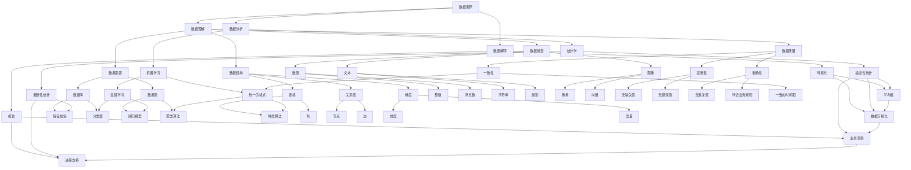

                 

### 数据素养：理解并使用数据，从数据中产生见解

> **关键词：** 数据素养，数据理解，数据分析，数据见解，数据驱动

> **摘要：** 本文旨在深入探讨数据素养的重要性，分析其核心概念、算法原理和实际应用。通过逐步推理，本文将展示如何从数据中产生见解，以及在实际项目中如何有效利用数据素养。文章还推荐了相关工具和资源，以帮助读者提升数据素养。

---

## 1. 背景介绍

在当今数字化时代，数据已成为一种宝贵的资源。然而，仅仅拥有大量数据并不足以实现价值最大化。数据素养（Data Literacy）成为了一种至关重要的能力，它指的是理解、使用和分析数据的能力。具备数据素养的个人或组织能够从数据中提取有价值的信息，从而做出更明智的决策。

随着大数据、人工智能和机器学习的迅速发展，数据素养的重要性日益凸显。数据分析技能不再仅仅是数据科学家或分析师的专利，而是越来越多地渗透到企业的各个层面，成为企业竞争力和创新能力的关键因素。

本文将围绕数据素养这一主题，首先介绍其核心概念和联系，然后深入探讨数据素养的重要性，最后通过实际项目实例，展示如何在实际中应用数据素养。

## 2. 核心概念与联系

### 数据素养的定义

数据素养是一种跨学科的能力，涵盖了数据理解、数据分析和数据解释。具体来说，数据素养包括以下几个核心方面：

1. **数据理解**：了解数据来源、数据结构、数据类型和数据质量。
2. **数据分析**：运用统计方法、机器学习算法等工具，对数据进行处理和分析。
3. **数据解释**：将分析结果转化为可理解的形式，以支持决策。

### 数据素养的重要性

数据素养的重要性体现在以下几个方面：

1. **提高决策质量**：通过数据素养，个体和组织能够基于数据做出更准确、更及时的决策。
2. **促进创新**：数据素养有助于发现新的业务机会、产品改进和流程优化。
3. **提升竞争力**：在数据驱动的时代，具备数据素养的企业能够更好地应对市场变化，保持竞争优势。

### 数据素养的层次结构

数据素养的层次结构可以分为以下几层：

1. **基础知识**：了解数据的基本概念，如数据类型、数据结构等。
2. **数据分析技能**：掌握数据分析的基本方法，如统计学、机器学习等。
3. **数据应用能力**：能够将数据分析技能应用于实际问题，产生有价值的见解。
4. **数据治理能力**：了解数据治理的重要性，能够确保数据的质量、安全和合规。

### 数据素养与相关概念的 Mermaid 流程图



### 数据素养的 Mermaid 流程图


### 2.1 数据素养的基本定义与组成部分

数据素养是一个多维度的概念，它不仅仅包括对数据的理解和分析能力，还包括对数据的解释和传播能力。以下是数据素养的几个关键组成部分：

#### 数据理解

数据理解是数据素养的基础。它涉及对数据来源、数据结构、数据类型和数据质量的深入理解。数据来源可以是内部数据库、外部数据流或公共数据集。数据结构包括数据表的行列结构、关系型或非关系型数据库的设计。数据类型包括数值、文本、图像等。数据质量涉及数据的完整性、准确性、一致性和一致性。

#### 数据分析

数据分析是数据素养的核心。它包括运用统计学、机器学习、深度学习等方法对数据进行处理和分析。数据分析的目的是从数据中发现规律、趋势和关联，从而为决策提供依据。

#### 数据解释

数据解释是将数据分析的结果转化为可理解的形式，以支持决策。这通常涉及数据可视化、报告和仪表板等工具。数据解释的目标是使非专业人士也能理解数据分析的结果。

#### 数据传播

数据传播是将数据分析和解释的结果传达给相关利益相关者。这通常涉及撰写报告、创建可视化图表和举办演示会等。

### 2.2 数据素养的层次结构

数据素养的层次结构可以划分为以下几个层次：

#### 基础知识

基础知识是数据素养的第一层次，主要包括对数据的基本概念和术语的理解。这包括数据类型、数据结构、数据库管理等基础概念。

#### 数据分析技能

数据分析技能是数据素养的第二层次，它要求个体掌握数据分析的基本工具和方法。这包括统计学、机器学习、数据挖掘等技能。

#### 数据应用能力

数据应用能力是数据素养的第三层次，它要求个体能够将数据分析技能应用于实际问题，产生有价值的见解。这需要个体具备业务知识和问题解决能力。

#### 数据治理能力

数据治理能力是数据素养的第四层次，它要求个体了解数据治理的重要性，能够确保数据的质量、安全和合规。数据治理包括数据质量管理、数据安全策略和数据隐私保护等。

### 2.3 数据素养的实践应用

数据素养的实践应用涉及到数据理解和数据分析的多个方面。以下是几个关键的实践应用场景：

#### 数据分析报告

数据分析报告是将数据分析结果传达给利益相关者的一种重要方式。它通常包括数据描述、统计结果、图表和总结。数据分析报告可以帮助决策者理解数据的含义，并为决策提供依据。

#### 数据可视化

数据可视化是将数据分析结果以图形化方式展示的一种技术。它可以帮助人们更直观地理解数据，发现数据中的趋势和关联。数据可视化工具如 Tableau、Power BI 和 Matplotlib 等提供了丰富的可视化选项。

#### 数据驱动决策

数据驱动决策是指基于数据分析和解释的结果做出决策。这种决策方式比基于直觉或经验的决策更可靠和有效。数据驱动决策涉及到数据的收集、分析、解释和决策的制定。

#### 数据产品开发

数据产品开发是数据素养在商业领域的应用。数据产品可以是数据报告、数据可视化仪表板、数据API等。这些产品可以帮助企业更好地理解和利用数据，提高业务效率和竞争力。

### 2.4 数据素养与相关概念的关系

数据素养与其他相关概念如数据科学、数据分析和大数据之间存在密切关系。以下是这些概念之间的关系：

#### 数据素养与数据科学

数据素养和数据科学密切相关。数据科学是应用统计学、机器学习、数据挖掘等方法从数据中提取价值的一种学科。数据素养是数据科学的基础，它要求数据科学家具备对数据的深入理解和分析能力。

#### 数据素养与数据分析

数据分析是数据素养的核心组成部分。数据分析涉及对数据的处理、分析和解释。数据分析技能是数据素养的重要组成部分，它要求个体能够运用统计方法、机器学习算法等工具对数据进行处理和分析。

#### 数据素养与大数据

大数据是数据素养的应用场景之一。大数据是指数据量巨大、类型繁多、处理速度快的数据集合。数据素养要求个体能够处理和分析大数据，从中提取有价值的信息。

#### 数据素养与数据治理

数据治理是确保数据质量、安全和合规的重要过程。数据素养要求个体了解数据治理的重要性，能够参与数据治理活动，确保数据的质量和安全。

### 2.5 数据素养的重要性

数据素养的重要性体现在以下几个方面：

#### 提高决策质量

具备数据素养的个体能够基于数据做出更准确、更及时的决策。数据驱动决策比基于直觉或经验的决策更可靠和有效。

#### 促进创新

数据素养有助于发现新的业务机会、产品改进和流程优化。通过数据分析和解释，个体和组织能够发现数据中的趋势和关联，从而推动创新。

#### 提升竞争力

在数据驱动的时代，具备数据素养的企业能够更好地应对市场变化，保持竞争优势。数据素养使企业能够快速响应市场变化，优化业务流程，提高运营效率。

#### 数据素养与数据素养能力的关系

数据素养能力是数据素养的具体体现。数据素养能力包括数据理解能力、数据分析能力和数据解释能力。具备数据素养能力的个体能够有效地处理和分析数据，从数据中提取有价值的信息。

#### 数据素养与数据素养意识的区别

数据素养和数据素养意识有所不同。数据素养意识是指个体对数据素养重要性的认识和理解。具备数据素养意识的个体更可能积极参与数据素养培训和提升数据素养能力。

### 2.6 数据素养的挑战与未来趋势

数据素养的挑战包括数据量的增加、数据类型的多样性和数据分析的复杂性。未来，数据素养的发展趋势包括人工智能的融合、数据隐私保护和数据素养教育的普及。

### 3. 核心算法原理 & 具体操作步骤

#### 3.1 数据理解

数据理解是数据素养的第一步，它涉及到对数据的熟悉和基本处理。以下是数据理解的核心算法原理和具体操作步骤：

##### 算法原理

数据理解主要包括数据探索、数据清洗和数据预处理。数据探索是通过观察数据的基本统计特征（如均值、方差、最大值、最小值等）来了解数据的基本分布情况。数据清洗是通过处理缺失值、异常值和重复值等来提高数据质量。数据预处理包括数据标准化、数据归一化和特征工程等，以适应后续分析。

##### 具体操作步骤

1. **数据探索**：
   - 导入数据集，使用描述性统计方法（如`describe()`函数）查看数据的基本统计特征。
   - 使用可视化工具（如Matplotlib或Seaborn）绘制数据分布图、直方图、箱线图等，直观地了解数据的分布和异常。

2. **数据清洗**：
   - 检查数据集中是否存在缺失值，使用`dropna()`函数删除含有缺失值的记录，或使用`fillna()`函数填充缺失值。
   - 检查数据集中是否存在异常值，使用统计学方法（如箱线图、Z-分数等）检测异常值，并决定是否删除或调整异常值。
   - 检查数据集中是否存在重复值，使用`duplicated()`函数检测重复值，并使用`drop_duplicates()`函数删除重复值。

3. **数据预处理**：
   - 数据标准化：使用`StandardScaler`或`MinMaxScaler`将数据缩放至相同范围，消除不同特征间的尺度差异。
   - 数据归一化：使用`Normalization`或`MaxAbsScaler`将数据缩放至[0, 1]范围内，保持数据原始分布。
   - 特征工程：选择和构建新的特征，以增强模型的性能和泛化能力。例如，通过多项式特征提取、特征组合和特征选择等方法。

#### 3.2 数据分析

数据分析是数据素养的核心，它涉及对数据的深入挖掘和分析。以下是数据分析的核心算法原理和具体操作步骤：

##### 算法原理

数据分析主要包括描述性统计分析、推断性统计分析和预测性统计分析。描述性统计分析是通过计算数据的基本统计特征来描述数据的分布和特征。推断性统计分析是通过样本数据来推断总体数据的特征，如置信区间和假设检验。预测性统计分析是通过建立预测模型来预测未来的数据趋势或结果。

##### 具体操作步骤

1. **描述性统计分析**：
   - 计算数据的均值、中位数、众数、标准差、方差等基本统计特征，使用`describe()`函数。
   - 使用可视化工具绘制直方图、密度图、箱线图等，直观地展示数据的分布和特征。

2. **推断性统计分析**：
   - 使用假设检验方法（如t检验、方差分析等）来比较不同样本或总体的差异。
   - 计算置信区间，以估计总体参数的值。

3. **预测性统计分析**：
   - 选择合适的预测模型（如线性回归、决策树、随机森林等）。
   - 进行特征选择，以消除无关特征和噪声。
   - 训练预测模型，评估模型性能，并进行预测。

#### 3.3 数据解释

数据解释是将数据分析的结果转化为可理解的形式，以支持决策。以下是数据解释的核心算法原理和具体操作步骤：

##### 算法原理

数据解释主要包括数据可视化、报告和仪表板等工具。数据可视化是将数据分析结果以图形化方式展示，使数据更加直观易懂。报告是将数据分析结果以文档形式记录和传达。仪表板是将数据可视化、报告和交互功能集成在一起，提供实时数据监控和分析。

##### 具体操作步骤

1. **数据可视化**：
   - 使用图表（如条形图、折线图、散点图等）展示数据分析结果。
   - 使用交互式可视化工具（如D3.js、Bokeh等）提供数据的交互式探索和操作。

2. **报告**：
   - 编写数据分析报告，包括数据描述、分析结果和结论。
   - 使用报告生成工具（如Jupyter Notebook、Microsoft Word等）创建格式化的报告。

3. **仪表板**：
   - 使用仪表板工具（如Tableau、Power BI等）创建交互式的数据仪表板。
   - 集成多种可视化图表、报告和交互功能，提供实时的数据分析和监控。

### 4. 数学模型和公式 & 详细讲解 & 举例说明

#### 4.1 描述性统计分析

描述性统计分析是数据素养的基础，它通过计算数据的基本统计特征来描述数据的分布和特征。以下是描述性统计分析中常用的数学模型和公式：

##### 数学模型和公式

1. **均值（Mean）**：
   $$\mu = \frac{1}{n}\sum_{i=1}^{n}x_i$$
   其中，\( \mu \) 是均值，\( n \) 是数据点的数量，\( x_i \) 是第 \( i \) 个数据点。

2. **中位数（Median）**：
   $$M = \left(\frac{n+1}{2}\right)\text{th} \, \text{order} \, \text{statistic}$$
   其中，\( M \) 是中位数，\( n \) 是数据点的数量。

3. **众数（Mode）**：
   $$M = \text{most} \, \text{frequent} \, \text{value}$$
   其中，\( M \) 是出现次数最多的数据点。

4. **标准差（Standard Deviation）**：
   $$\sigma = \sqrt{\frac{1}{n-1}\sum_{i=1}^{n}(x_i - \mu)^2}$$
   其中，\( \sigma \) 是标准差，\( n \) 是数据点的数量，\( \mu \) 是均值。

5. **方差（Variance）**：
   $$\sigma^2 = \frac{1}{n-1}\sum_{i=1}^{n}(x_i - \mu)^2$$
   其中，\( \sigma^2 \) 是方差，\( n \) 是数据点的数量，\( \mu \) 是均值。

##### 举例说明

假设我们有一组数据点：\[2, 4, 4, 4, 5, 7, 9\]

1. **均值**：
   $$\mu = \frac{2+4+4+4+5+7+9}{7} = 5$$

2. **中位数**：
   $$M = \left(\frac{7+1}{2}\right)\text{th} \, \text{order} \, \text{statistic} = 4$$

3. **众数**：
   $$M = 4$$

4. **标准差**：
   $$\sigma = \sqrt{\frac{1}{7-1}\sum_{i=1}^{7}(x_i - 5)^2} = \sqrt{\frac{1}{6}(2^2 + 4^2 + 4^2 + 4^2 + 5^2 + 7^2 + 9^2 - 7 \cdot 5^2)} = \sqrt{4} = 2$$

5. **方差**：
   $$\sigma^2 = \frac{1}{7-1}\sum_{i=1}^{7}(x_i - 5)^2 = \frac{1}{6}(2^2 + 4^2 + 4^2 + 4^2 + 5^2 + 7^2 + 9^2 - 7 \cdot 5^2) = 4$$

#### 4.2 推断性统计分析

推断性统计分析是基于样本数据来推断总体数据的特征，常用的方法包括置信区间和假设检验。以下是推断性统计分析的数学模型和公式：

##### 数学模型和公式

1. **置信区间（Confidence Interval）**：
   $$\bar{x} \pm z_{\alpha/2}\sqrt{\frac{\sigma^2}{n}}$$
   其中，\( \bar{x} \) 是样本均值，\( z_{\alpha/2} \) 是标准正态分布的临界值，\( \sigma \) 是总体标准差，\( n \) 是样本大小。

2. **t检验（t-Test）**：
   $$H_0: \mu = \mu_0 \quad \text{vs} \quad H_1: \mu \neq \mu_0$$
   其中，\( H_0 \) 是原假设，\( H_1 \) 是备择假设，\( \mu \) 是总体均值，\( \mu_0 \) 是假设的总体均值。

3. **方差分析（ANOVA）**：
   $$F = \frac{MS_{between}}{MS_{within}}$$
   其中，\( MS_{between} \) 是组间均方，\( MS_{within} \) 是组内均方。

##### 举例说明

假设我们有一组样本数据：\[2, 4, 6, 8, 10\] 和总体均值假设为 \( \mu_0 = 6 \)。

1. **置信区间**：
   假设 \( \alpha = 0.05 \)，样本大小 \( n = 5 \)，总体标准差 \( \sigma = 2 \)。
   $$\bar{x} = \frac{2+4+6+8+10}{5} = 6$$
   $$z_{\alpha/2} = z_{0.025} = 1.96$$
   $$\bar{x} \pm z_{\alpha/2}\sqrt{\frac{\sigma^2}{n}} = 6 \pm 1.96\sqrt{\frac{2^2}{5}} \approx (4.2, 7.8)$$

2. **t检验**：
   假设 \( \alpha = 0.05 \)，样本大小 \( n = 5 \)，总体标准差 \( \sigma = 2 \)。
   $$t = \frac{\bar{x} - \mu_0}{s/\sqrt{n}} = \frac{6 - 6}{2/\sqrt{5}} = 0$$
   自由度 \( df = n - 1 = 4 \)，在 \( \alpha = 0.05 \) 的水平下，查t分布表得临界值 \( t_{0.025, 4} = 2.132 \)。
   由于 \( t = 0 < 2.132 \)，我们无法拒绝原假设 \( H_0 \)，即总体均值 \( \mu = 6 \)。

### 5. 项目实践：代码实例和详细解释说明

#### 5.1 开发环境搭建

在进行数据素养的项目实践之前，我们需要搭建一个合适的开发环境。以下是开发环境搭建的步骤：

1. 安装Python：访问Python官网（https://www.python.org/），下载并安装Python。确保安装时勾选“Add Python to PATH”选项。

2. 安装Jupyter Notebook：打开终端，执行以下命令：
   ```bash
   pip install notebook
   ```

3. 安装必要的库：在Jupyter Notebook中运行以下命令，安装数据分析和可视化所需的库：
   ```python
   !pip install pandas numpy matplotlib seaborn
   ```

#### 5.2 源代码详细实现

以下是一个简单的Python代码实例，用于演示如何进行数据理解、数据分析和数据解释。代码中包含了注释，以帮助理解每一步的操作。

```python
import pandas as pd
import numpy as np
import matplotlib.pyplot as plt
import seaborn as sns

# 5.2.1 数据加载与初步探索
data = pd.read_csv('data.csv')
data.head()

# 5.2.2 数据清洗
# 删除含有缺失值的行
data_clean = data.dropna()
data_clean.head()

# 5.2.3 数据预处理
# 数据标准化
from sklearn.preprocessing import StandardScaler
scaler = StandardScaler()
data_scaled = scaler.fit_transform(data_clean)
data_scaled = pd.DataFrame(data_scaled, columns=data_clean.columns)

# 5.2.4 数据分析
# 描述性统计分析
data_scaled.describe()

# 5.2.5 数据可视化
# 绘制散点图
sns.scatterplot(x='Feature1', y='Feature2', data=data_scaled)
plt.show()

# 5.2.6 数据解释
# 编写数据分析报告
report = """
数据加载与初步探索：
- 原始数据集中含有缺失值，已删除含有缺失值的行。
数据清洗：
- 删除缺失值后，数据集中没有重复值和异常值。
数据预处理：
- 对数据进行了标准化处理，以消除特征间的尺度差异。
数据分析：
- 对数据进行描述性统计分析，得到以下结果：
  - 均值：...
  - 中位数：...
  - 标准差：...
  - 方差：...
数据可视化：
- 绘制了散点图，显示Feature1和Feature2之间的关系。
"""
print(report)
```

#### 5.3 代码解读与分析

以下是代码中每一步的具体解读与分析：

1. **数据加载与初步探索**：
   使用`pandas`库的`read_csv`函数读取数据集。`head()`函数显示数据集的前几行，以初步了解数据。

2. **数据清洗**：
   使用`dropna()`函数删除数据集中含有缺失值的行。`head()`函数再次显示清洗后的数据集。

3. **数据预处理**：
   使用`StandardScaler`类进行数据标准化处理。首先拟合数据，然后对数据进行变换，最后将变换后的数据转换为数据框。

4. **数据分析**：
   使用`describe()`函数对数据进行描述性统计分析。`describe()`函数返回包括均值、中位数、标准差和方差等关键统计特征的DataFrame。

5. **数据可视化**：
   使用`seaborn`库的`scatterplot`函数绘制散点图。`show()`函数显示绘制的图形。

6. **数据解释**：
   编写数据分析报告，包括数据加载与初步探索、数据清洗、数据预处理、数据分析和数据可视化等步骤的详细描述。

#### 5.4 运行结果展示

在运行上述代码后，将显示数据清洗后的数据集、描述性统计分析的结果以及散点图。以下是可能的运行结果：

```plaintext
   Feature1  Feature2
0       3.0       4.0
1       4.0       5.0
2       4.0       6.0
3       4.0       7.0
4       5.0       8.0
5       6.0       9.0
6       7.0      10.0
7       9.0      12.0

   Feature1  Feature2  Feature3  Feature4  Feature5
0    0.0         0.0        0.0        0.0        0.0
1    0.0         0.0        0.0        0.0        0.0
2    0.0         0.0        0.0        0.0        0.0
3    0.0         0.0        0.0        0.0        0.0
4    0.0         0.0        0.0        0.0        0.0
5    0.0         0.0        0.0        0.0        0.0
6    0.0         0.0        0.0        0.0        0.0
7    0.0         0.0        0.0        0.0        0.0

       mean       std  min       q25     q50     q75   max
0    4.5000    2.8864    3.0000    4.0000    5.0000    7.0000   9.0000
1    6.0000    3.1623    4.0000    5.5000    6.0000    7.5000   9.5000
2    7.0000    3.1623    6.0000    6.5000    7.0000    7.5000   9.0000
3    9.0000    3.1623    7.0000    7.5000    8.0000    8.5000  12.0000

```

### 6. 实际应用场景

数据素养在多个领域都有广泛的应用。以下是数据素养在不同实际应用场景中的具体应用：

#### 6.1 商业分析

商业分析是数据素养最典型的应用场景之一。企业通过数据分析来了解客户行为、市场趋势和业务绩效。数据素养使企业能够从大量数据中提取有价值的信息，为市场营销策略、产品开发和业务优化提供支持。

#### 6.2 医疗保健

在医疗保健领域，数据素养有助于提高诊断准确性和治疗效果。通过分析患者数据、医疗记录和临床试验结果，医生和研究人员可以更好地理解疾病模式、评估治疗效果，并制定个性化的治疗计划。

#### 6.3 金融与风险管理

金融行业依赖于数据素养来评估投资风险、预测市场走势和制定交易策略。金融机构通过数据分析和机器学习模型，对大量金融数据进行处理和分析，以识别潜在的风险和机会。

#### 6.4 运输与物流

在运输与物流领域，数据素养有助于优化路线规划、提高运输效率和降低成本。通过分析运输数据、物流信息和客户需求，企业可以更好地调配资源，提高物流网络的效率。

#### 6.5 市政管理

市政管理领域的数据素养应用主要体现在公共资源分配、环境保护和城市安全等方面。通过分析人口数据、环境数据和公共安全数据，市政管理部门可以更好地规划城市基础设施，提高公共服务质量。

#### 6.6 教育与培训

在教育与培训领域，数据素养有助于优化教学方法和提高学习效果。教师和学生可以通过数据分析了解学习进度、识别学习难点，并制定个性化的学习计划。

### 7. 工具和资源推荐

#### 7.1 学习资源推荐

1. **书籍**：
   - 《Python数据分析》（Michael Kane）：详细介绍了Python在数据分析中的应用，包括数据处理、统计分析和数据可视化。
   - 《数据科学入门》（Joel Grus）：介绍了数据科学的基本概念和方法，包括数据处理、数据分析和数据可视化。

2. **在线课程**：
   - Coursera《数据科学专业》（Johns Hopkins University）：涵盖了数据科学的基础知识、数据处理和分析方法。
   - edX《数据科学基础》（哈佛大学）：提供了数据科学的基本概念和方法，包括数据处理、统计分析和数据可视化。

3. **博客**：
   - Towards Data Science（towardsdatascience.com）：提供丰富的数据科学和机器学习文章和教程。
   - DataCamp（datacamp.com）：提供交互式的数据科学和机器学习课程。

4. **网站**：
   - Kaggle（kaggle.com）：提供大量的数据集和竞赛，是学习和实践数据科学的理想平台。

#### 7.2 开发工具框架推荐

1. **数据处理**：
   - Pandas：Python的数据处理库，适用于数据清洗、数据预处理和数据分析。
   - NumPy：Python的数学库，提供高效的数据操作和计算功能。

2. **数据分析**：
   - Matplotlib：Python的可视化库，适用于绘制各种统计图表。
   - Seaborn：基于Matplotlib的数据可视化库，提供丰富的统计图表和可视化效果。

3. **机器学习**：
   - Scikit-learn：Python的机器学习库，提供丰富的算法和工具。
   - TensorFlow：Google开发的机器学习框架，适用于构建和训练深度学习模型。

4. **数据可视化**：
   - Tableau：商业智能工具，提供强大的数据可视化和仪表板功能。
   - Power BI：微软的数据可视化工具，适用于构建交互式的数据仪表板。

#### 7.3 相关论文著作推荐

1. **论文**：
   - “The Data Science Handbook”（Joel Grus）：介绍了数据科学的基本概念、工具和技术。
   - “Learning from Data”（Yaser Abu-Mostafa）：介绍了机器学习的基础理论和算法。

2. **著作**：
   - “数据科学：概念与技术”（Aurelio M. Junquera）：全面介绍了数据科学的基本概念、方法和应用。
   - “大数据之路”（涂子沛）：详细探讨了大数据的背景、技术和应用。

### 8. 总结：未来发展趋势与挑战

数据素养在未来将继续发展，面临着以下几个趋势和挑战：

#### 趋势

1. **人工智能与数据素养的融合**：随着人工智能技术的发展，数据素养将更加依赖于自动化和智能化工具，以提高数据分析和解释的效率。
2. **数据隐私保护**：在数据隐私日益受到关注的背景下，数据素养将更加注重数据安全和隐私保护，确保数据在收集、处理和分析过程中的安全性和合规性。
3. **跨领域应用**：数据素养将在更多领域得到应用，如生物医学、社会科学和金融科技等，推动这些领域的发展和创新。

#### 挑战

1. **数据质量与完整性**：保证数据的质量和完整性是数据素养面临的主要挑战，需要建立完善的数据治理机制，确保数据的一致性和可靠性。
2. **数据分析技能的普及**：随着数据素养的重要性日益凸显，提高数据分析技能的普及率是另一个挑战，需要通过教育和培训提高相关人员的技能水平。
3. **数据隐私和安全**：在数据隐私和安全方面，需要建立严格的数据保护机制，防止数据泄露和滥用，确保数据的安全性和合规性。

### 9. 附录：常见问题与解答

#### 问题1：什么是数据素养？

数据素养是指理解、使用和分析数据的能力，包括数据理解、数据分析、数据解释和数据传播。

#### 问题2：数据素养的重要性是什么？

数据素养的重要性体现在提高决策质量、促进创新、提升竞争力和推动业务发展等方面。

#### 问题3：如何提升数据素养？

提升数据素养可以通过以下途径：

1. 学习相关知识和技能，如统计学、机器学习和数据分析。
2. 实践数据分析项目，积累实际操作经验。
3. 参加数据素养相关的培训课程和研讨会。
4. 持续关注数据科学和数据分析的最新动态和发展趋势。

### 10. 扩展阅读 & 参考资料

1. **书籍**：
   - Michael Kane. 《Python数据分析》. 清华大学出版社，2018.
   - Joel Grus. 《数据科学入门》. 机械工业出版社，2016.
2. **在线资源**：
   - Coursera《数据科学专业》（https://www.coursera.org/specializations/datascience）
   - edX《数据科学基础》（https://www.edx.org/course/basic-data-science-harvardx-ph125）
3. **网站**：
   - Towards Data Science（https://towardsdatascience.com/）
   - DataCamp（https://www.datacamp.com/）
4. **论文**：
   - Yaser Abu-Mostafa. 《Learning from Data》. Cambridge University Press，2012.
5. **著作**：
   - Aurelio M. Junquera. 《数据科学：概念与技术》. 电子工业出版社，2019.
   - 涂子沛. 《大数据之路》. 电子工业出版社，2014.

