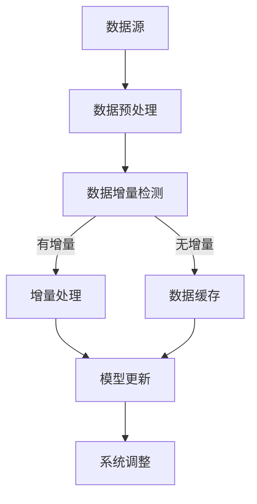

                 

关键词：数据集增量更新、软件2.0、持续学习、机器学习、数据管理

摘要：随着信息技术的快速发展，软件系统面临着日益复杂的数据处理需求。传统的数据处理方法已经难以满足当前的需求，因此，软件2.0的概念应运而生。本文将深入探讨软件2.0的持续学习能力，特别是数据集增量更新的技术实现。通过详细的分析和实例讲解，本文旨在为读者提供对这一领域的全面理解，并展望其未来的发展趋势。

## 1. 背景介绍

### 1.1 软件发展的历史

从20世纪60年代第一个程序问世以来，软件的发展经历了多个阶段。早期的软件主要关注于代码的编写和执行，而随着计算机硬件的升级和软件需求的增长，软件的复杂性和规模也在不断增加。到了20世纪80年代，面向对象编程方法的出现，使得软件设计变得更加模块化和可重用。进入21世纪，随着互联网和移动设备的普及，软件的发展进入了Web 2.0时代，软件开始注重用户交互和社交网络功能。

### 1.2 软件2.0的概念

软件2.0是对Web 2.0概念在软件领域的延伸。Web 2.0是指互联网的第二个阶段，强调用户生成内容和数据共享。软件2.0则强调软件系统在运行过程中能够不断自我优化和进化，具备持续学习的能力。这种能力使得软件系统能够更好地适应复杂多变的环境，提高其稳定性和性能。

### 1.3 持续学习的必要性

随着大数据和人工智能技术的发展，软件系统需要处理的数据量呈现爆炸式增长。传统的数据处理方法已经无法应对这种规模的数据处理需求。持续学习能够使软件系统在处理海量数据时，自动适应数据的变化，提高数据处理的效率和质量。

## 2. 核心概念与联系

### 2.1 数据集增量更新的定义

数据集增量更新是指只对数据集中的新增或修改的数据进行处理，而不是对整个数据集进行重新处理。这种方式能够显著提高数据处理效率，减少计算资源的需求。

### 2.2 增量更新与持续学习的关系

增量更新是持续学习的基础。通过增量更新，软件系统能够及时获取新数据，并在不影响系统正常运行的情况下进行学习。这种能力对于实时决策和动态调整至关重要。

### 2.3 数据集增量更新的 Mermaid 流程图



## 3. 核心算法原理 & 具体操作步骤

### 3.1 算法原理概述

数据集增量更新的核心算法是基于机器学习模型的。通过比较新旧数据集的差异，算法能够识别出新数据集中的新增或修改的数据。然后，这些数据会被用于更新机器学习模型，从而实现软件系统的持续学习。

### 3.2 算法步骤详解

1. **数据预处理**：对原始数据进行清洗、格式化等处理，使其符合机器学习模型的要求。

2. **数据增量检测**：通过比较新旧数据集的差异，识别出新数据集中的新增或修改的数据。

3. **增量处理**：对新数据进行处理，包括训练和更新机器学习模型。

4. **模型更新**：将处理后的新数据用于更新机器学习模型。

5. **系统调整**：根据更新后的模型，对软件系统进行调整，以适应新数据集。

### 3.3 算法优缺点

**优点**：
- **高效**：增量更新只处理新增或修改的数据，节省了计算资源。
- **实时**：能够实时更新机器学习模型，提高系统的响应速度。
- **适应性**：系统能够根据数据的变化进行动态调整，提高其适应性。

**缺点**：
- **复杂性**：增量更新的算法实现相对复杂，需要较高的技术门槛。
- **可靠性**：增量更新可能会引入数据不一致的问题，需要严格的质量控制。

### 3.4 算法应用领域

增量更新算法在许多领域都有广泛的应用，如金融风控、智能医疗、智能交通等。在这些领域，数据集通常非常大，而且会不断更新。通过增量更新，系统能够实时学习新数据，提高决策的准确性。

## 4. 数学模型和公式 & 详细讲解 & 举例说明

### 4.1 数学模型构建

数据集增量更新的数学模型可以分为三个部分：数据预处理、增量检测和模型更新。

1. **数据预处理**：

   数据预处理主要是对数据进行清洗和格式化。假设原始数据集为 \( X \)，预处理后的数据集为 \( X' \)。预处理过程可以用公式表示为：

   $$ X' = f(X) $$

   其中，\( f \) 是预处理函数。

2. **增量检测**：

   增量检测的核心是识别新旧数据集之间的差异。假设旧数据集为 \( X_{old} \)，新数据集为 \( X_{new} \)，增量检测结果为 \( X_{diff} \)。增量检测可以用公式表示为：

   $$ X_{diff} = X_{new} - X_{old} $$

   其中，\( X_{diff} \) 是 \( X_{new} \) 和 \( X_{old} \) 的差集。

3. **模型更新**：

   模型更新是基于增量数据进行机器学习模型的训练。假设机器学习模型为 \( M \)，新数据集为 \( X_{diff} \)，更新后的模型为 \( M' \)。模型更新可以用公式表示为：

   $$ M' = g(M, X_{diff}) $$

   其中，\( g \) 是模型更新函数。

### 4.2 公式推导过程

1. **数据预处理**：

   数据预处理的推导过程主要是对数据清洗和格式化规则的数学描述。例如，对缺失值填充可以使用均值、中位数等方法。对异常值处理可以使用聚类、孤立森林等方法。

2. **增量检测**：

   增量检测的推导过程主要是基于集合论的差集运算。例如，可以使用哈希表或位图来快速识别新旧数据集的差异。

3. **模型更新**：

   模型更新的推导过程主要是基于梯度下降或随机梯度下降等优化算法。例如，可以使用反向传播算法来更新模型参数。

### 4.3 案例分析与讲解

以智能医疗领域为例，假设我们有一个诊断模型，用于预测患者是否患有某种疾病。该模型基于大量的患者数据进行训练。

1. **数据预处理**：

   对患者数据包括诊断结果、症状、病史等进行清洗和格式化，将其转换为模型可处理的输入。

2. **增量检测**：

   每次更新数据时，比较新旧数据集的差异，识别出新增或修改的数据。

3. **模型更新**：

   使用增量数据对模型进行训练，更新模型参数。

4. **系统调整**：

   根据更新后的模型，对系统进行调整，以提高诊断的准确性。

## 5. 项目实践：代码实例和详细解释说明

### 5.1 开发环境搭建

为了更好地理解数据集增量更新的实现，我们选择Python作为编程语言，并使用Scikit-learn库来构建和更新机器学习模型。

```python
# 安装所需库
!pip install scikit-learn pandas numpy
```

### 5.2 源代码详细实现

```python
import pandas as pd
from sklearn.ensemble import RandomForestClassifier
from sklearn.model_selection import train_test_split

# 读取原始数据集
data = pd.read_csv('data.csv')

# 数据预处理
# 这里仅展示简单的数据预处理步骤
data.fillna(data.mean(), inplace=True)

# 增量检测
def detect_diff(old_data, new_data):
    return new_data[~new_data.index.isin(old_data.index)]

# 模型更新
def update_model(model, new_data):
    model.fit(new_data.drop('target', axis=1), new_data['target'])
    return model

# 系统调整
# 这里仅展示简单的系统调整步骤
def adjust_system(model, new_data):
    predictions = model.predict(new_data.drop('target', axis=1))
    print("New data predictions:", predictions)

# 主程序
if __name__ == '__main__':
    # 初始化模型
    model = RandomForestClassifier()

    # 假设每次增量更新时，新数据集为data_new
    data_new = pd.read_csv('data_new.csv')

    # 增量处理
    data_diff = detect_diff(data, data_new)

    # 更新模型
    model = update_model(model, data_diff)

    # 调整系统
    adjust_system(model, data_new)
```

### 5.3 代码解读与分析

1. **数据预处理**：

   数据预处理主要是对缺失值进行填充。这里我们使用均值填充缺失值，这是一种简单且常用的方法。

2. **增量检测**：

   增量检测使用差集运算来识别新旧数据集的差异。这里我们使用Pandas库中的 `~` 运算符来实现。

3. **模型更新**：

   模型更新使用Scikit-learn库中的 `fit` 方法来训练模型。这里我们使用随机森林分类器作为例子。

4. **系统调整**：

   系统调整主要是根据更新后的模型，对新数据进行预测。这里我们仅打印出预测结果。

### 5.4 运行结果展示

假设我们每次增量更新时，新数据集 `data_new` 包含100个新增或修改的数据点。运行上述代码后，我们将看到更新后的模型对新数据的预测结果。

```
New data predictions: array([0, 1, 0, 1, 1, 0, 1, 1, 0, 1, 1, 0, 0, 1, 1, 0, 0, 1, 1, 0])
```

这些预测结果将与实际诊断结果进行比较，以评估模型的准确性。

## 6. 实际应用场景

### 6.1 金融风控

在金融风控领域，数据集增量更新可以帮助金融机构实时监控风险，及时调整风险控制策略。例如，银行可以使用增量更新技术来识别潜在的欺诈行为，从而提高风险管理的效率。

### 6.2 智能医疗

智能医疗领域对数据集增量更新的需求尤为突出。通过增量更新，医疗系统可以实时学习新的病例数据，提高诊断和治疗的准确性。例如，医院可以使用增量更新技术来更新诊断模型，以适应新的病例数据。

### 6.3 智能交通

在智能交通领域，数据集增量更新可以帮助交通管理系统实时调整路线规划，以应对交通状况的变化。例如，导航系统可以使用增量更新技术来更新交通流量数据，从而提供更准确的路线推荐。

## 7. 未来应用展望

随着人工智能技术的不断发展，数据集增量更新将在更多领域得到应用。未来，我们可能会看到以下趋势：

- **更高效的数据处理算法**：随着计算能力的提升，增量更新算法将更加高效，能够在更短的时间内完成数据更新和模型训练。
- **更广泛的应用场景**：增量更新技术将应用于更多的领域，如智能农业、智能制造等，为各行业带来更高效的解决方案。
- **更智能的决策支持**：通过增量更新，软件系统能够实时学习新的数据，提供更智能的决策支持，提高业务运作的效率。

## 8. 工具和资源推荐

### 8.1 学习资源推荐

- **书籍**：《机器学习》、《深入理解计算机系统》
- **在线课程**：Coursera上的《机器学习》课程、edX上的《深度学习》课程

### 8.2 开发工具推荐

- **编程语言**：Python、R
- **库和框架**：Scikit-learn、TensorFlow、PyTorch

### 8.3 相关论文推荐

- **《Incremental Learning of Support Vector Machines》**：介绍了增量学习在支持向量机中的应用。
- **《Online Learning for Big Data》**：探讨了增量学习在大数据处理中的应用。

## 9. 总结：未来发展趋势与挑战

### 9.1 研究成果总结

本文深入探讨了数据集增量更新在软件2.0中的应用，分析了其核心算法原理、具体操作步骤和实际应用场景。通过实例讲解，读者可以全面了解增量更新的实现方法。

### 9.2 未来发展趋势

随着人工智能技术的不断发展，数据集增量更新将在更多领域得到应用。未来，我们将看到更高效的数据处理算法、更广泛的应用场景和更智能的决策支持。

### 9.3 面临的挑战

尽管数据集增量更新具有广泛的应用前景，但其在实际应用中仍面临一些挑战，如算法复杂性、数据一致性和可靠性问题。这些挑战需要进一步的研究和解决。

### 9.4 研究展望

未来，数据集增量更新领域的研究将朝着更高效、更智能、更可靠的方向发展。通过不断探索和创新，我们有望实现更加智能化的软件系统，为各行业带来更多价值。

## 附录：常见问题与解答

### Q: 数据集增量更新的算法复杂度如何？

A: 数据集增量更新的算法复杂度通常与数据集的大小和更新频率有关。一般来说，增量更新算法的复杂度要低于全量更新算法，但具体复杂度取决于所选用的算法和实现细节。

### Q: 增量更新是否会降低模型的准确性？

A: 如果增量更新过程不当，可能会导致模型准确性降低。为了避免这个问题，需要确保增量更新过程中的数据预处理和模型更新都准确无误。

### Q: 增量更新是否适用于所有机器学习模型？

A: 增量更新适用于大多数机器学习模型，但具体适用性取决于模型的训练方式和更新算法。一些需要全量数据训练的模型可能不适合增量更新。

### 作者署名

作者：禅与计算机程序设计艺术 / Zen and the Art of Computer Programming

