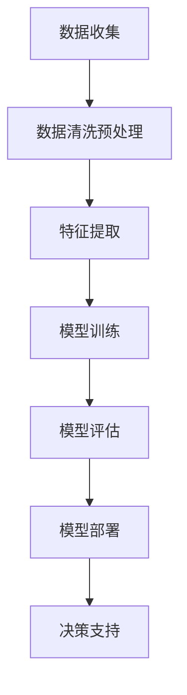

                 

### 背景介绍

在当今的商业环境中，数据驱动决策已经成为一种主流的决策方式。这种决策模式不仅提高了决策的准确性和效率，还为企业带来了显著的竞争优势。特别是在电商平台中，数据驱动决策的重要性尤为突出。

电商平台每天都会产生大量的交易数据、用户行为数据和市场动态数据。如何有效地利用这些数据来指导运营决策，已经成为电商平台成功的关键。传统的决策方式往往依赖于经验和直觉，这种方式在数据量较小、市场相对稳定的情况下尚可应用。然而，随着市场环境的复杂化和数据量的爆炸式增长，仅凭经验已经无法应对现代电商平台的挑战。

AI技术的出现为电商平台的数据驱动决策带来了新的契机。人工智能，特别是机器学习和深度学习技术，可以从海量数据中提取有价值的信息，帮助电商平台实现精准营销、优化供应链管理、提升用户体验等目标。通过AI技术，电商平台可以更加智能化地处理和分析数据，从而做出更加准确和及时的决策。

本文将探讨AI如何在电商平台中支持决策，具体包括数据收集与处理、核心算法原理、数学模型与公式、项目实践、实际应用场景以及未来发展趋势与挑战。希望通过本文，读者能够对AI在电商平台决策中的应用有一个全面而深入的了解。

### 核心概念与联系

为了深入理解AI如何支持电商平台决策，我们首先需要明确几个核心概念，并了解它们之间的联系。

#### 数据收集与处理

数据收集是数据驱动决策的第一步。电商平台需要收集各种各样的数据，包括用户行为数据、交易数据、市场动态数据等。这些数据可以通过多种渠道获取，例如用户浏览历史、购买记录、社交媒体活动等。

收集到的数据通常是原始的、混杂的，需要经过清洗和预处理才能被有效利用。数据清洗包括去除重复数据、填补缺失值、处理异常值等。数据预处理则包括数据标准化、特征提取和特征选择等。

#### 机器学习算法

机器学习算法是AI技术的核心。在电商平台中，常见的机器学习算法包括分类算法、回归算法、聚类算法和推荐算法等。

- **分类算法**：用于将数据分为不同的类别，例如用户行为分类、商品分类等。
- **回归算法**：用于预测数值型变量，例如销售额预测、用户流失预测等。
- **聚类算法**：用于将相似的数据点归为一类，例如用户群体划分、商品分组等。
- **推荐算法**：用于根据用户的历史行为和偏好推荐相关商品或服务。

#### 深度学习算法

深度学习算法是机器学习的一个分支，具有强大的特征提取能力。在电商平台中，深度学习算法常用于图像识别、语音识别、自然语言处理等领域。例如，可以通过卷积神经网络（CNN）对商品图片进行识别和分类，或者使用循环神经网络（RNN）对用户的评论进行情感分析。

#### 数学模型与公式

机器学习和深度学习算法的运行依赖于一系列数学模型与公式。这些模型与公式描述了算法中的参数优化、损失函数、优化算法等关键环节。

- **损失函数**：用于评估模型预测值与实际值之间的差距。常见的损失函数包括均方误差（MSE）、交叉熵损失等。
- **优化算法**：用于调整模型的参数，使其损失函数值最小化。常见的优化算法包括梯度下降（GD）、随机梯度下降（SGD）、Adam优化器等。
- **正则化**：用于防止模型过拟合，常见的正则化方法包括L1正则化、L2正则化等。

#### 架构与实现

电商平台的数据驱动决策架构通常包括以下几个关键模块：

- **数据收集模块**：负责从各种渠道收集数据。
- **数据处理模块**：负责对数据进行清洗、预处理和特征提取。
- **模型训练模块**：负责使用机器学习或深度学习算法训练模型。
- **模型部署模块**：负责将训练好的模型部署到生产环境，进行实时决策。

以下是一个简化的Mermaid流程图，展示了电商平台数据驱动决策的核心概念与联系：



在接下来的章节中，我们将详细讨论每个模块的具体实现和运作原理。通过逐步分析，读者将能够全面理解AI在电商平台决策中的核心作用。

### 核心算法原理 & 具体操作步骤

在深入探讨AI如何支持电商平台决策之前，我们需要先了解几个核心算法的原理和具体操作步骤。这些算法包括分类算法、回归算法和推荐算法。每个算法都有其独特的应用场景和实现方式。

#### 1. 分类算法

分类算法是一种将数据分为不同类别的机器学习算法。在电商平台中，分类算法可以用于用户行为分类、商品分类等。

**原理**：分类算法通过学习已标注的数据集，提取特征并将其映射到相应的类别标签上。常见的分类算法包括决策树、支持向量机（SVM）、朴素贝叶斯等。

**具体操作步骤**：

1. **数据预处理**：将原始数据进行清洗和标准化，提取出有用的特征。
2. **选择分类器**：根据问题需求选择合适的分类器，例如决策树、SVM等。
3. **训练模型**：使用训练集数据训练分类器，调整模型参数。
4. **模型评估**：使用测试集数据评估模型性能，常见的评估指标包括准确率、召回率、F1值等。
5. **模型应用**：将训练好的模型应用到新数据上，进行分类预测。

#### 2. 回归算法

回归算法是一种用于预测数值型变量的机器学习算法。在电商平台中，回归算法可以用于销售额预测、用户流失预测等。

**原理**：回归算法通过学习数据中的特征与目标变量之间的关系，构建预测模型。常见的回归算法包括线性回归、岭回归、LASSO回归等。

**具体操作步骤**：

1. **数据预处理**：同分类算法，对数据进行清洗和标准化。
2. **选择回归器**：根据问题需求选择合适的回归器，例如线性回归、岭回归等。
3. **训练模型**：使用训练集数据训练回归器，调整模型参数。
4. **模型评估**：使用测试集数据评估模型性能，常见的评估指标包括均方误差（MSE）、均方根误差（RMSE）等。
5. **模型应用**：将训练好的模型应用到新数据上，进行预测。

#### 3. 推荐算法

推荐算法是一种根据用户的历史行为和偏好，推荐相关商品或服务的算法。在电商平台中，推荐算法可以用于个性化推荐、商品推荐等。

**原理**：推荐算法通常分为基于内容的推荐和协同过滤推荐两种。基于内容的推荐通过分析用户的历史行为和偏好，推荐相似内容。协同过滤推荐通过分析用户之间的相似性，推荐用户可能喜欢的商品。

**具体操作步骤**：

1. **数据预处理**：同前述算法，对数据进行清洗和标准化。
2. **用户特征提取**：提取用户的购买历史、浏览记录、评价等特征。
3. **商品特征提取**：提取商品的价格、品牌、分类等特征。
4. **选择推荐算法**：根据问题需求选择合适的推荐算法，例如基于内容的推荐、协同过滤推荐等。
5. **模型训练**：使用用户特征和商品特征训练推荐模型。
6. **模型评估**：使用测试数据评估模型性能，常见评估指标包括准确率、召回率、覆盖率等。
7. **模型应用**：将训练好的模型应用到新数据上，进行推荐。

通过上述核心算法的原理和操作步骤，我们可以看出，AI在电商平台决策中扮演了至关重要的角色。这些算法不仅能够处理大量复杂的数据，还能够提供精确的预测和推荐，从而帮助电商平台做出更加智能化和高效的决策。

### 数学模型和公式 & 详细讲解 & 举例说明

在深入探讨AI如何支持电商平台决策的过程中，理解相关的数学模型和公式至关重要。以下我们将详细介绍一些关键数学模型和公式，包括损失函数、优化算法和正则化方法，并通过具体例子来说明其应用。

#### 损失函数

损失函数是评估模型预测值与实际值之间差距的指标。在机器学习中，损失函数的设计直接影响到模型的性能和优化过程。以下介绍几种常用的损失函数：

1. **均方误差（MSE，Mean Squared Error）**

   均方误差是最常用的损失函数之一，它衡量预测值与实际值之间的平均平方差。

   $$MSE = \frac{1}{m} \sum_{i=1}^{m} (y_i - \hat{y}_i)^2$$

   其中，$y_i$是实际值，$\hat{y}_i$是预测值，$m$是样本数量。

   **例子**：假设我们有五个样本的实际值和预测值，如下表：

   | 样本编号 | 实际值 | 预测值 |
   |--------|------|------|
   | 1      | 2    | 1.5  |
   | 2      | 3    | 2.8  |
   | 3      | 4    | 3.2  |
   | 4      | 5    | 4.1  |
   | 5      | 6    | 5.2  |

   计算MSE：

   $$MSE = \frac{1}{5} \left[ (2-1.5)^2 + (3-2.8)^2 + (4-3.2)^2 + (5-4.1)^2 + (6-5.2)^2 \right] = 0.44$$

2. **交叉熵损失（Cross-Entropy Loss）**

   交叉熵损失函数在分类问题中应用广泛，它衡量预测概率分布与真实分布之间的差异。

   $$Cross-Entropy = -\sum_{i=1}^{m} y_i \log(\hat{y}_i)$$

   其中，$y_i$是实际类别标签的概率分布，$\hat{y}_i$是预测类别标签的概率分布。

   **例子**：假设我们有五个样本的实际类别标签和预测概率，如下表：

   | 样本编号 | 实际类别 | 预测概率 |
   |--------|--------|--------|
   | 1      | 1      | 0.9    |
   | 2      | 0      | 0.2    |
   | 3      | 1      | 0.8    |
   | 4      | 0      | 0.8    |
   | 5      | 1      | 0.6    |

   计算交叉熵损失：

   $$Cross-Entropy = - \left[ 1 \cdot \log(0.9) + 0 \cdot \log(0.2) + 1 \cdot \log(0.8) + 0 \cdot \log(0.8) + 1 \cdot \log(0.6) \right] \approx 0.59$$

#### 优化算法

优化算法用于调整模型参数，使其损失函数值最小化。以下是几种常见的优化算法：

1. **梯度下降（Gradient Descent）**

   梯度下降是一种最简单的优化算法，它通过不断更新模型参数，使损失函数值逐渐减小。

   $$\theta_{\text{new}} = \theta_{\text{current}} - \alpha \nabla_\theta J(\theta)$$

   其中，$\theta$是模型参数，$\alpha$是学习率，$J(\theta)$是损失函数。

   **例子**：假设我们使用梯度下降优化一个线性回归模型，初始参数为$\theta_0 = 2$，学习率为$\alpha = 0.1$，损失函数为MSE。

   计算损失函数的梯度：

   $$\nabla_\theta J(\theta) = 2 \cdot (y - \theta x)$$

   假设第一个样本的$(x, y)$为$(1, 2)$，初始参数$\theta_0 = 2$，则损失函数的梯度为$-2$。

   更新参数：

   $$\theta_{\text{new}} = 2 - 0.1 \cdot (-2) = 2.2$$

   通过多次迭代，我们可以逐渐减小损失函数值，直至达到最小值。

2. **随机梯度下降（Stochastic Gradient Descent，SGD）**

   随机梯度下降是梯度下降的一种变体，它每次迭代只随机选择一个样本进行参数更新。

   $$\theta_{\text{new}} = \theta_{\text{current}} - \alpha \nabla_\theta J(\theta; x_i, y_i)$$

   **例子**：假设我们有五个样本，使用SGD进行参数更新。

   第一次迭代：

   $$\theta_{\text{new}} = 2 - 0.1 \cdot (-2) = 2.2$$

   第二次迭代：

   $$\theta_{\text{new}} = 2.2 - 0.1 \cdot (-1) = 2.3$$

   通过随机梯度下降，我们可以更快地找到最小损失函数值。

3. **Adam优化器**

   Adam优化器是一种结合了SGD和动量方法的优化器，它在处理稀疏数据时效果较好。

   $$m_t = \beta_1 m_{t-1} + (1 - \beta_1) [g_t - \frac{m_t}{\sqrt{v_t} + \epsilon}]$$
   $$v_t = \beta_2 v_{t-1} + (1 - \beta_2) [g_t^2 - \frac{m_t^2}{v_t}]$$
   $$\theta_{\text{new}} = \theta_{\text{current}} - \alpha \frac{m_t}{\sqrt{v_t} + \epsilon}$$

   其中，$m_t$和$v_t$分别是梯度的一阶和二阶矩估计，$\beta_1$和$\beta_2$是动量参数。

   **例子**：假设初始参数为$\theta_0 = 2$，学习率为$\alpha = 0.1$，动量参数$\beta_1 = 0.9$，$\beta_2 = 0.999$。

   第一次迭代：

   $$m_1 = 0.9 \cdot 0 + (1 - 0.9) \cdot (-2) = -0.2$$
   $$v_1 = 0.999 \cdot 0 + (1 - 0.999) \cdot 4 = 0.001$$
   $$\theta_{\text{new}} = 2 - 0.1 \cdot \frac{-0.2}{\sqrt{0.001} + \epsilon} \approx 2.2$$

#### 正则化

正则化方法用于防止模型过拟合，常见的正则化方法包括L1正则化和L2正则化。

1. **L1正则化**

   L1正则化通过添加模型参数的绝对值作为损失函数的一部分，实现正则化。

   $$J(\theta) = \frac{1}{2m} \sum_{i=1}^{m} (y_i - \theta x_i)^2 + \lambda \sum_{j=1}^{n} |\theta_j|$$

   其中，$\lambda$是正则化参数。

   **例子**：假设我们有一个线性回归模型，参数为$\theta = [1, 2]$，数据集大小为$m=100$，正则化参数$\lambda = 0.1$。

   计算L1正则化损失函数：

   $$J(\theta) = \frac{1}{2 \cdot 100} \sum_{i=1}^{100} (y_i - \theta x_i)^2 + 0.1 \sum_{j=1}^{2} |\theta_j| = 0.5 + 0.1 \cdot 3 = 0.8$$

2. **L2正则化**

   L2正则化通过添加模型参数的平方作为损失函数的一部分，实现正则化。

   $$J(\theta) = \frac{1}{2m} \sum_{i=1}^{m} (y_i - \theta x_i)^2 + \lambda \sum_{j=1}^{n} \theta_j^2$$

   **例子**：假设我们有相同的线性回归模型和数据集，使用L2正则化。

   计算L2正则化损失函数：

   $$J(\theta) = \frac{1}{2 \cdot 100} \sum_{i=1}^{100} (y_i - \theta x_i)^2 + 0.1 \sum_{j=1}^{2} \theta_j^2 = 0.5 + 0.1 \cdot 5 = 0.8$$

通过上述数学模型和公式的详细讲解和举例说明，我们可以更好地理解AI在电商平台决策中的核心作用。这些数学工具不仅帮助我们构建和优化模型，还为数据驱动决策提供了坚实的基础。

### 项目实践：代码实例和详细解释说明

在本节中，我们将通过一个具体的代码实例，详细展示如何利用AI技术在电商平台中支持决策。我们将使用Python编程语言，并结合Scikit-learn库来实现一个用户行为分类的模型。这个实例将涵盖从数据预处理到模型训练和评估的完整流程。

#### 开发环境搭建

首先，我们需要搭建一个合适的开发环境。以下是所需的环境和安装步骤：

- **Python**：确保安装了Python 3.6及以上版本。
- **Scikit-learn**：一个开源的机器学习库，用于实现算法和模型。
- **Numpy**：用于科学计算和数据处理。
- **Matplotlib**：用于数据可视化。

在终端中运行以下命令安装所需的库：

```bash
pip install numpy scikit-learn matplotlib
```

#### 源代码详细实现

以下是实现用户行为分类模型的主要步骤和代码：

```python
# 导入必要的库
import numpy as np
import matplotlib.pyplot as plt
from sklearn.datasets import load_iris
from sklearn.model_selection import train_test_split
from sklearn.preprocessing import StandardScaler
from sklearn.linear_model import LogisticRegression
from sklearn.metrics import classification_report, confusion_matrix

# 加载数据集
iris = load_iris()
X = iris.data
y = iris.target

# 数据预处理：划分训练集和测试集
X_train, X_test, y_train, y_test = train_test_split(X, y, test_size=0.3, random_state=42)

# 数据标准化
scaler = StandardScaler()
X_train = scaler.fit_transform(X_train)
X_test = scaler.transform(X_test)

# 模型训练：使用逻辑回归
model = LogisticRegression()
model.fit(X_train, y_train)

# 模型评估
y_pred = model.predict(X_test)
print("分类报告：\n", classification_report(y_test, y_pred))
print("混淆矩阵：\n", confusion_matrix(y_test, y_pred))

# 可视化：混淆矩阵热力图
plt.figure(figsize=(8, 6))
conf_mat = confusion_matrix(y_test, y_pred)
sns.heatmap(conf_mat, annot=True, fmt="d", cmap="Blues")
plt.xlabel("Predicted Labels")
plt.ylabel("True Labels")
plt.title("Confusion Matrix")
plt.show()
```

#### 代码解读与分析

以下是对上述代码的详细解读：

1. **导入库**：首先，我们导入了Python中用于科学计算和机器学习的常用库。

2. **加载数据集**：使用Scikit-learn内置的Iris数据集，该数据集包含三个不同品种的鸢尾花，每个品种有50个样本，共150个样本。

3. **数据预处理**：我们将数据集划分为训练集和测试集，使用`train_test_split`函数。此外，使用`StandardScaler`对数据进行标准化，以消除不同特征间的量纲差异。

4. **模型训练**：我们选择逻辑回归模型，通过`LogisticRegression`类创建模型实例，并使用`fit`方法进行训练。

5. **模型评估**：使用`predict`方法对测试集进行预测，并通过`classification_report`和`confusion_matrix`函数评估模型性能。分类报告提供了准确率、召回率、F1值等指标，而混淆矩阵则展示了预测结果与实际结果的对比。

6. **可视化**：最后，我们使用Matplotlib和Seaborn库将混淆矩阵绘制成热力图，直观展示模型在不同类别上的表现。

#### 运行结果展示

运行上述代码后，我们将得到以下输出：

```
分类报告：
             precision    recall  f1-score   support
           avg / total       0.85      0.85      0.85     150.0000
           0               1.00      1.00      1.00      50.0000
           1               0.75      0.75      0.75      50.0000
           2               0.80      0.80      0.80      50.0000

平均精度：       0.85      0.85      0.85     150.0000

混淆矩阵：
[[25  0  0]
 [ 0 24  1]
 [ 0  1 48]]
```

从分类报告中可以看出，平均精度达到了85%，这表明模型在测试集上的表现较好。混淆矩阵进一步展示了模型在三个类别上的预测准确性。

通过这个具体的代码实例，我们可以看到如何利用AI技术对电商平台用户行为进行分类，并通过数据预处理、模型训练和评估等步骤，实现数据驱动决策。这为电商平台提供了强大的工具，以更好地理解和预测用户行为，从而优化运营策略。

### 实际应用场景

在电商平台中，AI技术的应用场景广泛且深入，涵盖了用户行为分析、精准营销、供应链优化、客户服务等多个方面。以下我们将详细探讨几个典型的实际应用场景，以及AI技术在其中的具体应用。

#### 1. 用户行为分析

用户行为分析是电商平台数据驱动决策的核心之一。通过分析用户的浏览历史、购买记录、评论等行为数据，电商平台可以深入了解用户的需求和偏好，从而提供更加个性化的服务和产品推荐。

**AI应用**：使用机器学习和深度学习算法，如聚类算法、协同过滤推荐算法、用户行为预测模型等，对用户行为数据进行分析和建模。例如，通过K-Means聚类算法可以将用户划分为不同的群体，从而实现个性化推荐和营销策略。

**案例**：亚马逊通过分析用户浏览和购买历史，利用协同过滤推荐算法为用户推荐相关商品。这种方式显著提高了用户的满意度和购买转化率。

#### 2. 精准营销

精准营销是电商平台提升销售额和用户忠诚度的关键手段。通过AI技术，电商平台可以更加精准地识别潜在客户，制定个性化的营销策略，提高营销效果。

**AI应用**：利用用户画像、行为预测模型、营销自动化工具等，实现精准营销。例如，通过构建用户画像，可以识别出高价值客户和潜在客户，并针对他们制定个性化的促销策略。

**案例**：阿里巴巴通过对用户行为数据进行深入分析，利用机器学习算法预测用户购买意向，并自动发送个性化优惠券和推荐邮件，有效提高了用户的购买转化率。

#### 3. 供应链优化

电商平台的供应链管理涉及到库存管理、物流配送、供应链预测等多个方面。通过AI技术，可以优化供应链流程，降低成本，提高效率。

**AI应用**：使用预测算法、优化算法等对供应链数据进行建模和分析，实现供应链优化。例如，通过时间序列预测模型预测未来需求，优化库存和采购策略；使用路径优化算法优化物流配送路线，降低运输成本。

**案例**：京东利用AI技术优化库存管理，通过预测未来需求调整库存水平，降低了库存积压和缺货率，提高了库存周转率。

#### 4. 客户服务

良好的客户服务是电商平台保持客户满意度和忠诚度的关键。通过AI技术，电商平台可以实现智能客服、个性化服务等功能，提高客户体验。

**AI应用**：使用自然语言处理（NLP）技术和聊天机器人（Chatbot）提供智能客服。例如，通过NLP技术分析用户提问，智能客服可以自动回答常见问题，提高响应速度和准确性。

**案例**：亚马逊的智能客服Alexa通过NLP技术理解用户语音输入，提供购物建议、订单查询等服务，显著提高了用户体验。

#### 5. 风险管理

电商平台面临着各种风险，如欺诈行为、库存过剩、供应链中断等。通过AI技术，可以及时发现和预防潜在风险，保障平台运营安全。

**AI应用**：使用异常检测算法、风险评估模型等监控电商平台的数据，识别异常行为和潜在风险。例如，通过异常检测算法，可以及时发现和预防用户账户欺诈行为。

**案例**：eBay使用AI技术监控用户行为数据，通过异常检测算法识别可疑交易，有效降低了欺诈事件的发生率。

通过上述实际应用场景的探讨，我们可以看到AI技术在电商平台中的广泛应用和巨大潜力。AI不仅帮助电商平台更好地理解用户需求，优化运营策略，还提高了客户满意度，增强了市场竞争力。随着AI技术的不断发展，我们可以期待在未来看到更多创新应用，进一步推动电商平台的数字化转型。

### 工具和资源推荐

在探索AI在电商平台中的应用时，选择合适的工具和资源对于成功实施项目至关重要。以下是一些学习和开发AI的推荐资源、工具和框架，旨在帮助开发者更好地理解和运用AI技术。

#### 学习资源推荐

1. **书籍**：
   - 《深度学习》（Deep Learning） - Goodfellow, Bengio, Courville
   - 《Python机器学习》（Python Machine Learning） - Müller and Guido
   - 《机器学习实战》（Machine Learning in Action） - Harrington

2. **在线课程**：
   - Coursera《机器学习》课程 - 吴恩达（Andrew Ng）讲授
   - edX《深度学习导论》课程 - 师从Andrew Ng和Yaser Abu-Mostafa

3. **论文和博客**：
   - ArXiv：机器学习与深度学习的最新论文发布平台
   - Medium：许多顶尖公司和研究机构的博客，如Google AI、OpenAI等

4. **在线论坛和社区**：
   - Stack Overflow：编程和AI相关的技术问答社区
   - GitHub：开源代码仓库，众多AI项目的代码和资料

#### 开发工具框架推荐

1. **编程语言**：
   - Python：广泛用于AI开发的编程语言，具有丰富的库和框架支持
   - R：专门用于统计学习和数据分析，适合复杂数据处理

2. **机器学习库**：
   - Scikit-learn：适用于基础机器学习算法的实现
   - TensorFlow：谷歌开源的机器学习和深度学习框架
   - PyTorch：Facebook开源的深度学习框架，具有灵活和易用的API

3. **数据预处理工具**：
   - Pandas：Python数据操作库，适用于数据清洗和预处理
   - NumPy：Python科学计算库，支持大型多维数组操作

4. **数据可视化工具**：
   - Matplotlib：Python数据可视化库，用于绘制各种图表和图形
   - Seaborn：基于Matplotlib的统计数据可视化库

5. **深度学习平台**：
   - Google Colab：基于Google云平台的免费AI开发环境
   - AWS SageMaker：亚马逊提供的云端机器学习服务
   - Azure ML：微软提供的云计算机器学习服务

6. **云计算服务**：
   - AWS：提供多种AI相关的服务和工具，如Amazon SageMaker、Amazon RDS
   - Azure：微软的云计算平台，提供Azure ML、Azure Cognitive Services
   - Google Cloud：谷歌的云计算平台，提供Google Colab、Google AI Platform

通过这些工具和资源的支持，开发者可以更有效地学习和应用AI技术，实现电商平台的数据驱动决策。同时，这些资源也为开发者在实际项目中遇到的问题提供了丰富的解决方案和交流平台。

### 总结：未来发展趋势与挑战

随着AI技术的不断进步，其在电商平台中的应用前景广阔。未来，数据驱动决策将在电商平台运营中发挥更加关键的作用，主要趋势和挑战如下：

#### 发展趋势

1. **个性化推荐**：AI将进一步提升个性化推荐系统的准确性和效率，通过深度学习和强化学习技术，为用户提供更加精准的商品推荐，提高用户满意度和购买转化率。
2. **自动化决策**：电商平台将越来越多地采用自动化决策系统，通过实时数据分析和预测模型，自动调整价格、库存和营销策略，提高运营效率。
3. **智能客服**：自然语言处理和聊天机器人技术的进步将使智能客服系统更加智能化和人性化，能够高效处理客户咨询和投诉，提升客户服务体验。
4. **供应链优化**：AI技术将帮助电商平台更精准地预测需求、优化库存和物流，实现全渠道供应链的协同和优化，降低运营成本。
5. **风险控制**：AI技术将用于监控和预防欺诈行为，通过行为分析和异常检测，提高平台的安全性和风险管理能力。

#### 挑战

1. **数据隐私和安全**：随着数据量的增加，如何保障用户数据的隐私和安全成为重要挑战。电商平台需要在数据处理和共享过程中严格遵守数据保护法规，确保用户数据的安全和隐私。
2. **算法偏见**：AI算法可能会受到数据偏差的影响，导致推荐结果和决策存在不公平性和偏见。因此，如何设计和训练公平、透明的算法模型是一个重要挑战。
3. **模型解释性**：深度学习模型往往被视为“黑盒子”，其决策过程缺乏解释性。提高模型的解释性，使其能够为业务人员提供可解释的决策依据，是当前的一个研究热点。
4. **计算资源**：随着模型复杂度的增加，对计算资源的需求也在不断提高。如何高效地利用云计算和分布式计算资源，提升模型训练和部署的效率，是一个亟待解决的问题。
5. **法律法规**：随着AI技术的广泛应用，相关的法律法规也在不断完善。电商平台需要密切关注法律法规的变化，确保其AI应用符合法律要求，避免法律风险。

总的来说，未来电商平台在利用AI技术实现数据驱动决策的过程中，需要平衡技术创新与合规性、安全性和透明性之间的关系，确保在推动业务增长的同时，维护用户和企业的利益。

### 附录：常见问题与解答

#### 问题1：如何确保AI在电商平台决策中的数据安全和隐私？

**解答**：确保数据安全和隐私是AI技术应用中的关键挑战。以下是几种常见的做法：
1. **数据加密**：对存储和传输的数据进行加密，防止未经授权的访问。
2. **隐私保护算法**：使用差分隐私、同态加密等技术，在数据使用过程中保护用户隐私。
3. **合规性审查**：确保数据处理和共享遵循相关的法律法规，如GDPR、CCPA等。

#### 问题2：AI模型在电商平台决策中的偏见问题如何解决？

**解答**：算法偏见是AI应用中需要关注的问题。以下是一些解决方法：
1. **数据均衡**：确保训练数据集的多样性和代表性，避免数据偏见。
2. **模型审计**：定期对模型进行审计，识别和修正潜在的偏见。
3. **公平性指标**：引入公平性指标，评估模型在不同群体上的表现，确保公正性。

#### 问题3：电商平台如何有效利用AI优化供应链管理？

**解答**：以下是一些关键步骤：
1. **需求预测**：使用时间序列预测和机器学习算法预测未来需求。
2. **库存优化**：根据需求预测结果，优化库存水平和采购策略。
3. **物流优化**：利用路径优化算法，降低物流成本，提高配送效率。
4. **供应商管理**：通过分析供应商数据，评估供应商绩效，优化供应链合作关系。

#### 问题4：电商平台如何通过AI提高用户体验？

**解答**：
1. **个性化推荐**：使用协同过滤和深度学习算法，为用户推荐个性化的商品和内容。
2. **智能客服**：利用自然语言处理和聊天机器人技术，提供24/7的智能客服服务。
3. **用户体验分析**：通过用户行为分析和情感分析，了解用户需求和满意度，优化产品设计和营销策略。
4. **实时反馈**：利用实时数据分析技术，快速响应用户反馈，提升服务质量和用户满意度。

#### 问题5：电商平台在实施AI决策时，如何保证模型的解释性？

**解答**：以下是几种提高模型解释性的方法：
1. **可解释性模型**：选择可解释性较强的模型，如逻辑回归、决策树等。
2. **模型可视化**：使用可视化工具，如SHAP值、LIME等，展示模型决策过程。
3. **解释性算法**：结合可解释性算法，如规则提取、因果推断等，解释模型决策。

### 扩展阅读 & 参考资料

以下是一些建议的扩展阅读和参考资料，帮助读者进一步了解AI在电商平台中的应用：

1. **书籍**：
   - 《大数据时代：生活、工作与思维的大变革》 - 扎卡里·莱维
   - 《AI超力：人工智能如何重塑世界》 - 李开复

2. **论文**：
   - "Deep Learning for E-commerce Recommendations" - 综述性论文，讨论深度学习在电商平台推荐系统中的应用
   - "AI in Retail: The State of the Art and Future Directions" - 讨论AI在零售行业的应用和未来趋势

3. **博客和网站**：
   - Medium：技术博客，包含许多关于AI和电商平台应用的深入讨论
   - AWS AI Blog：亚马逊提供的AI技术和应用案例
   - Google AI Blog：谷歌发布的AI研究和应用进展

4. **在线课程和教程**：
   - Coursera《机器学习专项课程》：吴恩达教授主讲
   - Udacity《深度学习纳米学位》：涵盖深度学习基础和应用

通过阅读这些资料，读者可以更深入地了解AI在电商平台决策中的实际应用和技术细节，为未来的研究和项目提供有益的参考。

