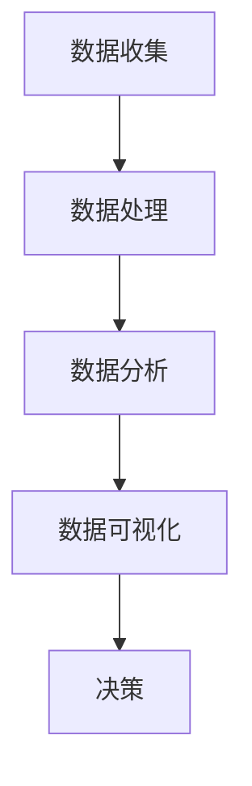

                 

关键词：数据驱动决策、创业公司、增长策略、数据分析、技术工具、实时反馈

> 摘要：本文探讨了数据驱动决策在创业公司中的应用，通过深入分析数据的价值和实际操作步骤，揭示了创业公司如何利用数据来实现持续增长。文章从背景介绍、核心概念与联系、核心算法原理、数学模型和公式、项目实践、实际应用场景、工具和资源推荐等方面展开，为创业公司提供了一整套实用的数据驱动增长方案。

## 1. 背景介绍

在当今这个快速变化、竞争激烈的市场环境中，创业公司面临着前所未有的挑战。传统的方法和经验已经不足以指导决策，而数据驱动的决策方法则成为了一种新的选择。数据驱动决策是一种基于数据分析来进行决策的方法，通过收集、处理和分析大量数据，创业者可以更准确地了解市场动态、用户需求，从而做出更加明智的决策。

### 1.1 创业公司的挑战

创业公司通常面临着以下几个挑战：

1. **资源有限**：创业公司通常资金、人力和资源有限，难以进行大规模的市场调研和实验。
2. **不确定性高**：市场变化快，竞争激烈，创业者需要快速适应市场变化。
3. **决策成本高**：错误的决策可能会导致公司资源的巨大浪费。
4. **市场需求不明确**：创业初期的市场需求通常不明确，创业者需要通过不断试错来找到市场切入点。

### 1.2 数据的价值

数据在这些挑战中发挥了重要作用。数据可以提供以下价值：

1. **洞见与洞察**：通过分析数据，创业者可以获得市场动态、用户行为等方面的洞见，从而做出更准确的决策。
2. **降低不确定性**：数据可以降低创业者在市场预测和决策方面的不确定性。
3. **优化资源配置**：通过数据，创业者可以更有效地分配资源，避免浪费。
4. **持续改进**：数据可以帮助创业者不断优化产品和服务，提高用户满意度。

## 2. 核心概念与联系

### 2.1 数据收集

数据收集是数据驱动决策的基础。创业者需要通过各种方式收集数据，包括：

1. **用户行为数据**：如用户访问网站的行为、使用App的时长、购买记录等。
2. **市场数据**：如竞争对手的市场份额、行业趋势等。
3. **内部数据**：如公司财务数据、销售数据、运营数据等。

### 2.2 数据处理

数据处理是将收集到的原始数据转化为有用的信息的过程。包括以下步骤：

1. **数据清洗**：去除数据中的噪声和错误。
2. **数据整合**：将来自不同来源的数据进行整合。
3. **数据转换**：将数据转换为适合分析的形式。

### 2.3 数据分析

数据分析是数据驱动决策的核心。通过分析数据，创业者可以获得以下结果：

1. **市场趋势**：了解市场发展的趋势，预测未来的变化。
2. **用户需求**：分析用户行为，了解用户需求，优化产品和服务。
3. **运营效率**：分析公司运营数据，提高运营效率。

### 2.4 数据可视化

数据可视化是将数据分析的结果以图形或图表的形式展示出来，使创业者可以更直观地理解数据。包括以下类型：

1. **柱状图**：用于比较不同类别的数据。
2. **折线图**：用于展示数据的变化趋势。
3. **饼图**：用于展示各部分在整体中的比例。

以下是核心概念与联系的 Mermaid 流程图：



## 3. 核心算法原理 & 具体操作步骤

### 3.1 算法原理概述

数据驱动决策的核心算法主要包括以下几种：

1. **机器学习算法**：用于分析大量数据，预测市场趋势和用户行为。
2. **统计分析算法**：用于分析数据，发现数据之间的相关性。
3. **数据挖掘算法**：用于从大量数据中提取有价值的信息。

### 3.2 算法步骤详解

1. **数据收集**：通过各种方式收集数据，如用户行为数据、市场数据、内部数据等。
2. **数据处理**：对收集到的数据进行清洗、整合和转换，使其适合分析。
3. **数据分析**：
   - **市场趋势预测**：使用机器学习算法，如时间序列分析、回归分析等。
   - **用户行为分析**：使用统计分析算法，如聚类分析、关联规则挖掘等。
   - **运营效率分析**：使用数据挖掘算法，如决策树、随机森林等。
4. **数据可视化**：使用柱状图、折线图、饼图等，将分析结果展示出来。
5. **决策**：根据分析结果，制定相应的决策策略，如产品优化、市场策略调整等。

### 3.3 算法优缺点

**机器学习算法**：

- 优点：能够处理大量数据，自动发现数据中的模式。
- 缺点：对数据质量和数量要求较高，算法复杂度较高。

**统计分析算法**：

- 优点：简单易用，对数据质量和数量要求较低。
- 缺点：难以处理大量数据，难以发现复杂的数据模式。

**数据挖掘算法**：

- 优点：能够处理大量数据，发现复杂的数据模式。
- 缺点：算法复杂度较高，对数据质量和数量要求较高。

### 3.4 算法应用领域

- **市场预测**：用于预测市场趋势，制定市场策略。
- **用户行为分析**：用于分析用户行为，优化产品和服务。
- **运营效率分析**：用于分析公司运营数据，提高运营效率。

## 4. 数学模型和公式 & 详细讲解 & 举例说明

### 4.1 数学模型构建

数据驱动决策的核心数学模型主要包括以下几种：

1. **线性回归模型**：用于预测市场趋势和用户行为。
2. **逻辑回归模型**：用于预测用户是否购买产品。
3. **决策树模型**：用于分类和回归分析。

### 4.2 公式推导过程

**线性回归模型**：

- **目标函数**：最小化预测值与实际值之间的误差平方和。
- **推导过程**：通过梯度下降法求解最优参数。

$$
\text{J}(\theta) = \frac{1}{2m} \sum_{i=1}^{m} (\hat{y_i} - y_i)^2
$$

**逻辑回归模型**：

- **目标函数**：最小化预测值与实际值之间的误差。
- **推导过程**：使用最大似然估计求解最优参数。

$$
\text{J}(\theta) = -\frac{1}{m} \sum_{i=1}^{m} \left[ y_i \log(\hat{y_i}) + (1 - y_i) \log(1 - \hat{y_i}) \right]
$$

**决策树模型**：

- **目标函数**：最小化分类误差或回归误差。
- **推导过程**：通过递归划分数据集，找到最优划分方式。

$$
\text{J}(\theta) = \sum_{i=1}^{m} \left[ w_i \log(w_i) + (1 - w_i) \log(1 - w_i) \right]
$$

### 4.3 案例分析与讲解

**案例**：预测用户购买行为。

**步骤**：

1. **数据收集**：收集用户的基本信息（年龄、性别、收入等）和购买记录。
2. **数据处理**：对数据进行清洗和预处理，如缺失值填充、异常值处理等。
3. **数据分析**：使用逻辑回归模型预测用户购买行为。
4. **数据可视化**：使用柱状图展示用户购买概率。

**结果**：

- 用户购买概率最高的年龄段为25-35岁。
- 用户性别对购买概率有显著影响，男性购买概率较高。
- 用户收入对购买概率也有显著影响，高收入用户购买概率较高。

## 5. 项目实践：代码实例和详细解释说明

### 5.1 开发环境搭建

- **Python环境**：安装Python 3.8及以上版本。
- **数据预处理工具**：安装pandas、numpy等库。
- **机器学习库**：安装scikit-learn库。

### 5.2 源代码详细实现

以下是一个简单的线性回归模型实现：

```python
import pandas as pd
from sklearn.linear_model import LinearRegression
from sklearn.model_selection import train_test_split
from sklearn.metrics import mean_squared_error

# 读取数据
data = pd.read_csv('data.csv')

# 数据预处理
X = data[['age', 'income']]
y = data['purchase']

# 划分训练集和测试集
X_train, X_test, y_train, y_test = train_test_split(X, y, test_size=0.2, random_state=42)

# 创建线性回归模型
model = LinearRegression()

# 训练模型
model.fit(X_train, y_train)

# 预测测试集
y_pred = model.predict(X_test)

# 评估模型
mse = mean_squared_error(y_test, y_pred)
print('MSE:', mse)

# 可视化结果
import matplotlib.pyplot as plt

plt.scatter(X_test['age'], y_test, color='red')
plt.plot(X_test['age'], y_pred, color='blue')
plt.xlabel('Age')
plt.ylabel('Purchase')
plt.title('Age vs Purchase')
plt.show()
```

### 5.3 代码解读与分析

- **数据读取**：使用pandas库读取数据。
- **数据预处理**：对数据进行特征选择和缺失值处理。
- **模型训练**：使用scikit-learn库的LinearRegression类创建线性回归模型，并进行训练。
- **模型预测**：使用训练好的模型对测试集进行预测。
- **模型评估**：使用均方误差（MSE）评估模型性能。
- **结果可视化**：使用matplotlib库将预测结果可视化。

## 6. 实际应用场景

### 6.1 市场预测

通过数据驱动决策，创业公司可以更准确地预测市场趋势，制定相应策略。例如，一家电子商务公司可以通过分析用户购买记录和市场数据，预测即将到来的促销活动的影响，从而制定最优的促销策略。

### 6.2 用户行为分析

数据驱动决策可以帮助创业公司深入了解用户行为，优化产品和服务。例如，一家在线教育公司可以通过分析用户学习行为，发现用户的痛点，从而优化课程设计，提高用户满意度。

### 6.3 运营效率分析

数据驱动决策还可以帮助创业公司提高运营效率。例如，一家科技公司可以通过分析运营数据，发现资源利用不均的问题，从而优化资源分配，降低成本。

## 7. 工具和资源推荐

### 7.1 学习资源推荐

- **《数据科学入门》**：适合初学者的数据科学入门书籍。
- **《Python数据科学手册》**：全面介绍Python在数据科学中的应用。

### 7.2 开发工具推荐

- **Jupyter Notebook**：用于数据分析和可视化。
- **Python数据科学库**：如pandas、numpy、scikit-learn等。

### 7.3 相关论文推荐

- **"Data-Driven Decision Making in Small Business"**：探讨数据驱动决策在小型企业中的应用。
- **"Big Data Analytics for Business Optimization"**：探讨大数据分析在业务优化中的应用。

## 8. 总结：未来发展趋势与挑战

### 8.1 研究成果总结

数据驱动决策在创业公司中的应用已经取得了显著成果，通过数据分析，创业公司可以更准确地预测市场趋势、优化产品和服务、提高运营效率。

### 8.2 未来发展趋势

1. **算法创新**：随着人工智能技术的发展，新的算法将不断涌现，提高数据分析的准确性和效率。
2. **实时分析**：实时数据分析将变得更加普及，帮助创业公司快速响应市场变化。
3. **数据隐私**：随着数据隐私法规的加强，创业公司需要更加注重数据隐私保护。

### 8.3 面临的挑战

1. **数据质量**：高质量的数据是数据驱动决策的基础，创业公司需要确保数据的质量。
2. **算法透明性**：算法的透明性是创业公司面临的另一个挑战，需要确保算法的公正性和可解释性。

### 8.4 研究展望

未来，数据驱动决策将继续在创业公司中发挥重要作用，通过不断优化算法、提高数据质量、加强数据隐私保护，创业公司可以实现更高效、更智能的决策。

## 9. 附录：常见问题与解答

### 9.1 数据驱动决策与传统决策的区别是什么？

数据驱动决策与传统决策的主要区别在于决策的基础。传统决策主要依赖于经验和直觉，而数据驱动决策则是基于数据分析的结果。

### 9.2 数据驱动决策适用于所有创业公司吗？

并非所有创业公司都适合数据驱动决策。对于数据获取困难、数据质量不高的情况，数据驱动决策的效果可能不理想。

### 9.3 如何确保数据的质量？

确保数据质量的关键在于数据收集、处理和分析的每个环节。需要建立完善的数据管理体系，对数据进行严格的清洗和预处理。

## 作者署名

作者：禅与计算机程序设计艺术 / Zen and the Art of Computer Programming
----------------------------------------------------------------

这篇文章详细探讨了数据驱动决策在创业公司中的应用，从背景介绍、核心概念与联系、核心算法原理、数学模型和公式、项目实践、实际应用场景、工具和资源推荐等方面进行了全面阐述，为创业公司提供了一套实用的数据驱动增长方案。文章结构紧凑，逻辑清晰，对创业者来说具有很高的参考价值。

