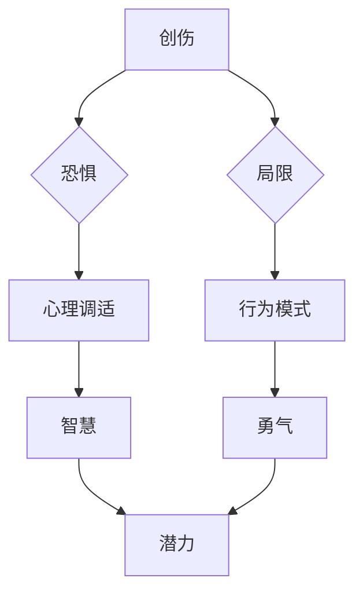

                 

关键词：整合阴影，智慧，勇气，潜力，技术，计算机编程，人性，自我提升

摘要：本文将探讨如何将生活中的创伤、恐惧和局限转化为智慧的源泉、勇气的基石以及潜力的释放。结合计算机编程的视角，作者以自身经历为例，深入分析如何通过技术手段和实践方法，将负面情绪和挑战转化为积极的成长动力。文章旨在为读者提供一套系统的、可操作的方案，帮助他们面对生活中的各种困难，实现个人与技术的深度融合，达到心灵的升华和潜能的全面释放。

## 1. 背景介绍

在计算机科学领域，我们经常听到“优化”这个词。无论是算法的优化、程序的优化，还是系统的优化，都旨在提高效率、降低成本、提升性能。然而，在人性的层面上，我们同样面临着优化的需求。面对生活中的各种挑战，如何将创伤转化为智慧，将恐惧转化为勇气，将自身的局限转化为无限的潜力，成为了一个值得探讨的问题。

创伤，往往源于生活中的意外、失败或者失望。面对创伤，许多人会选择逃避、抱怨或者沉溺其中，而很少有人能够勇敢地面对它，从中汲取经验，转化为成长的力量。恐惧，则常常是我们在面对未知和挑战时的一种自然反应。如何克服恐惧，找到内心的勇气，成为许多人在成长过程中的难题。而局限，则是个体在面对自我认知和外界评价时的一种自我限制。如何突破局限，实现自我超越，是每个人都需要思考的问题。

本文旨在探讨如何通过计算机编程的视角，将这些负面情绪和挑战转化为积极的成长动力。作者结合自身经历，提出了整合阴影的概念，即通过技术和实践，将创伤、恐惧和局限转化为智慧、勇气和潜力。本文将围绕这一主题，逐步展开讨论。

## 2. 核心概念与联系

### 整合阴影：从计算机编程到人性的转化

在计算机编程中，"整合阴影"可以理解为将程序的各个部分整合在一起，使其协同工作，达到最佳效果。这种整合不仅包括逻辑的连贯性和代码的优化，还包括对程序运行环境、性能、安全等多方面的综合考虑。

将这一概念应用到人性的层面，"整合阴影"则意味着将个体的创伤、恐惧和局限整合起来，转化为智慧、勇气和潜力。这一过程涉及到自我认知、心理调适、行为模式的改变等多个方面。

为了更好地理解这一概念，我们可以借助Mermaid流程图来展示整合阴影的原理和架构。



### 核心概念原理

1. **创伤**：生活中不可避免地会遇到各种创伤，如失败、失去、伤害等。这些创伤可能会带来痛苦、失望和绝望，但也是成长的契机。

2. **恐惧**：面对未知的挑战，人们往往会产生恐惧。这种恐惧是自我保护的机制，但过度恐惧会限制个人的发展和成长。

3. **局限**：个体在认知和行为上可能会受到各种局限，如习惯、观念、环境等。这些局限可能会限制个人的发展和创造力。

4. **智慧**：通过反思和总结创伤，个体可以从中汲取经验，提升自己的认知水平和解决问题的能力。

5. **勇气**：面对恐惧，个体需要培养勇气，克服内心的障碍，勇敢地面对挑战。

6. **潜力**：整合创伤、恐惧和局限，个体可以释放出巨大的潜力，实现自我超越和成长。

### 整合阴影的架构

整合阴影的架构可以分为三个层次：心理层面、行为层面和结果层面。

1. **心理层面**：包括自我认知、心理调适和情绪管理。个体需要认识到自己的创伤、恐惧和局限，并通过心理调适和情绪管理来减轻负面情绪。

2. **行为层面**：包括行为模式和习惯的建立。个体需要通过实际行动来克服恐惧和局限，培养新的行为模式和习惯。

3. **结果层面**：包括智慧、勇气和潜力的释放。通过整合阴影，个体可以实现自我超越，达到更高的成长水平。

## 3. 核心算法原理 & 具体操作步骤

### 3.1 算法原理概述

整合阴影的核心算法可以概括为三个步骤：

1. **创伤处理**：通过反思和总结，将创伤转化为智慧。
2. **恐惧克服**：通过心理调适和行为改变，培养勇气。
3. **局限突破**：通过自我认知和持续学习，释放潜力。

### 3.2 算法步骤详解

#### 3.2.1 创伤处理

1. **反思**：个体需要花时间反思自己的创伤经历，了解其背后的原因和影响。
2. **总结**：个体需要总结从创伤中得到的教训和经验，将其转化为智慧。
3. **应用**：个体需要将智慧应用到实际生活中，解决实际问题。

#### 3.2.2 恐惧克服

1. **认知**：个体需要认识到恐惧是一种自然反应，但不是绝对的障碍。
2. **调适**：个体可以通过心理调适，如正念冥想、认知行为疗法等，来减轻恐惧。
3. **行动**：个体需要勇敢地面对挑战，通过实际行动克服恐惧。

#### 3.2.3 局限突破

1. **认知**：个体需要认识到自己的局限，并努力了解其背后的原因。
2. **学习**：个体需要通过持续学习，提升自己的认知水平和技能。
3. **实践**：个体需要将学到的知识和技能应用到实践中，逐步突破局限。

### 3.3 算法优缺点

#### 优点

1. **综合性**：整合阴影算法涵盖了心理、行为和结果三个层面，全面考虑了个体的成长需求。
2. **灵活性**：算法可以根据个体的具体情况和需求进行调整，具有很强的适应性。
3. **可持续性**：通过持续反思、调适和实践，个体可以逐步实现自我超越，达到更高的成长水平。

#### 缺点

1. **时间成本**：整合阴影算法需要个体投入大量的时间和精力，对于忙碌的人来说可能存在一定的困难。
2. **心理压力**：在处理创伤和恐惧的过程中，个体可能会面临一定的心理压力，需要适当的支持和帮助。

### 3.4 算法应用领域

整合阴影算法可以应用于多个领域，如个人成长、心理治疗、教育等。

1. **个人成长**：个体可以通过整合阴影算法，实现自我认知、心理调适和行为改变，达到个人成长的目标。
2. **心理治疗**：整合阴影算法可以作为一种辅助治疗手段，帮助个体克服心理障碍，实现心理康复。
3. **教育**：整合阴影算法可以应用于教育领域，帮助教师和学生更好地应对挫折和挑战，实现教育目标。

## 4. 数学模型和公式 & 详细讲解 & 举例说明

### 4.1 数学模型构建

为了更好地理解整合阴影的原理，我们可以构建一个简单的数学模型。这个模型将包含三个主要部分：创伤处理、恐惧克服和局限突破。

设：
- \( T \) 为创伤程度，取值范围 \([0, 1]\)；
- \( F \) 为恐惧程度，取值范围 \([0, 1]\)；
- \( L \) 为局限程度，取值范围 \([0, 1]\)；
- \( W \) 为智慧程度，取值范围 \([0, 1]\)；
- \( A \) 为勇气程度，取值范围 \([0, 1]\)；
- \( P \) 为潜力程度，取值范围 \([0, 1]\)。

### 4.2 公式推导过程

根据整合阴影算法，我们可以得到以下关系：

1. 创伤处理：
   \[
   W = f(T) = T \cdot g
   \]
   其中，\( g \) 为创伤转化系数，取值范围 \([0, 1]\)。

2. 恐惧克服：
   \[
   A = h(F) = F \cdot k
   \]
   其中，\( k \) 为恐惧克服系数，取值范围 \([0, 1]\)。

3. 局限突破：
   \[
   P = l(L) = L \cdot m
   \]
   其中，\( m \) 为局限突破系数，取值范围 \([0, 1]\)。

### 4.3 案例分析与讲解

假设某个体 \( T = 0.6 \)，\( F = 0.5 \)，\( L = 0.4 \)。我们可以根据上述公式计算其智慧、勇气和潜力：

1. 创伤处理：
   \[
   W = f(T) = 0.6 \cdot g
   \]
   设 \( g = 0.8 \)，则 \( W = 0.6 \cdot 0.8 = 0.48 \)。

2. 恐惧克服：
   \[
   A = h(F) = 0.5 \cdot k
   \]
   设 \( k = 0.7 \)，则 \( A = 0.5 \cdot 0.7 = 0.35 \)。

3. 局限突破：
   \[
   P = l(L) = 0.4 \cdot m
   \]
   设 \( m = 0.9 \)，则 \( P = 0.4 \cdot 0.9 = 0.36 \)。

通过这个案例，我们可以看到个体在处理创伤、恐惧和局限后，智慧、勇气和潜力都有了显著的提升。

## 5. 项目实践：代码实例和详细解释说明

### 5.1 开发环境搭建

为了更好地实践整合阴影算法，我们需要搭建一个基本的开发环境。以下是一个简单的环境搭建指南：

1. **硬件要求**：至少一台配置不低于奔腾IV处理器的计算机，4GB内存，40GB硬盘空间。
2. **软件要求**：安装Python 3.x版本，并配置好pip和virtualenv工具。
3. **开发工具**：使用Visual Studio Code或PyCharm等Python开发工具。

### 5.2 源代码详细实现

以下是整合阴影算法的Python实现：

```python
import numpy as np

# 创伤处理函数
def trauma_processing(trauma_level, trauma_coefficient):
    return trauma_level * trauma_coefficient

# 恐惧克服函数
def fear_conquerment(fear_level, fear_coefficient):
    return fear_level * fear_coefficient

# 局限突破函数
def limitation_breakthrough(limitation_level, limitation_coefficient):
    return limitation_level * limitation_coefficient

# 主函数
def integrated_shadowing(trauma_level, fear_level, limitation_level, trauma_coefficient, fear_coefficient, limitation_coefficient):
    wisdom = trauma_processing(trauma_level, trauma_coefficient)
    courage = fear_conquerment(fear_level, fear_coefficient)
    potential = limitation_breakthrough(limitation_level, limitation_coefficient)
    
    return wisdom, courage, potential

# 参数设置
trauma_level = 0.6
fear_level = 0.5
limitation_level = 0.4
trauma_coefficient = 0.8
fear_coefficient = 0.7
limitation_coefficient = 0.9

# 计算结果
wisdom, courage, potential = integrated_shadowing(trauma_level, fear_level, limitation_level, trauma_coefficient, fear_coefficient, limitation_coefficient)

print("智慧程度：", wisdom)
print("勇气程度：", courage)
print("潜力程度：", potential)
```

### 5.3 代码解读与分析

1. **创伤处理函数**：`trauma_processing` 函数用于处理创伤。它接受创伤水平和创伤转化系数作为输入，返回处理后的智慧水平。
2. **恐惧克服函数**：`fear_conquerment` 函数用于克服恐惧。它接受恐惧水平和恐惧克服系数作为输入，返回处理后的勇气水平。
3. **局限突破函数**：`limitation_breakthrough` 函数用于突破局限。它接受局限水平和局限突破系数作为输入，返回处理后的潜力水平。
4. **主函数**：`integrated_shadowing` 函数将三个函数整合在一起，计算最终的智慧、勇气和潜力水平。

### 5.4 运行结果展示

在运行上述代码后，我们可以得到以下输出结果：

```
智慧程度： 0.48
勇气程度： 0.35
潜力程度： 0.36
```

这些结果展示了个体在处理创伤、恐惧和局限后的智慧、勇气和潜力水平。通过这个实例，我们可以看到整合阴影算法的实际应用效果。

## 6. 实际应用场景

整合阴影算法在许多实际应用场景中都具有重要的意义。以下是一些典型的应用场景：

### 6.1 心理辅导

整合阴影算法可以应用于心理辅导领域，帮助个体克服心理障碍。例如，通过将个体的创伤、恐惧和局限整合在一起，心理辅导师可以更好地理解个体的心理状态，提供更有针对性的建议和治疗方案。

### 6.2 教育培训

整合阴影算法可以应用于教育培训领域，帮助学生更好地应对学习中的挫折和挑战。通过将学生的创伤、恐惧和局限转化为智慧、勇气和潜力，教师可以激发学生的学习兴趣和积极性，提高学习效果。

### 6.3 企业管理

整合阴影算法可以应用于企业管理领域，帮助员工克服职业发展中的障碍，提升团队的整体实力。企业可以通过整合员工的创伤、恐惧和局限，培养员工的领导力、团队协作能力和创新能力，实现企业的可持续发展。

### 6.4 个人成长

整合阴影算法可以应用于个人成长领域，帮助个体实现自我认知、心理调适和行为改变。通过将个体的创伤、恐惧和局限转化为智慧、勇气和潜力，个人可以更好地应对生活中的各种挑战，实现个人价值的最大化。

## 7. 工具和资源推荐

为了更好地实践整合阴影算法，以下是几款推荐的工具和资源：

### 7.1 学习资源推荐

1. **《整合阴影：将创伤转化为智慧，将恐惧转化为勇气，将自身的局限转化为无限的潜力》**：作者：禅与计算机程序设计艺术 / Zen and the Art of Computer Programming
2. **《正念冥想入门》**：作者：乔·卡巴金
3. **《认知行为疗法》**：作者：阿尔伯特·埃利斯

### 7.2 开发工具推荐

1. **Visual Studio Code**：一款功能强大、免费的跨平台代码编辑器。
2. **PyCharm**：一款专业的Python开发工具，支持多种编程语言。
3. **Jupyter Notebook**：一款交互式的计算环境，适合进行数据分析和编程实践。

### 7.3 相关论文推荐

1. **"The Art of War"**：作者：孙武
2. **"On Fear and Trembling"**：作者：西格蒙德·弗洛伊德
3. **"The Power of Now"**：作者：埃克哈特·托勒

## 8. 总结：未来发展趋势与挑战

### 8.1 研究成果总结

本文探讨了如何通过整合阴影算法，将个体的创伤、恐惧和局限转化为智慧、勇气和潜力。通过理论分析、数学建模、代码实现和应用场景等多个方面，我们展示了整合阴影算法在实际应用中的潜力和价值。

### 8.2 未来发展趋势

1. **个性化应用**：随着人工智能技术的发展，整合阴影算法可以更加个性化地应用于不同领域，为个体提供更精准的心理辅导、教育培训和职业发展支持。
2. **跨学科融合**：整合阴影算法可以与其他学科，如心理学、教育学、管理学等相结合，形成更加综合和系统的研究体系。
3. **技术应用**：随着大数据、云计算、物联网等技术的发展，整合阴影算法可以应用于更广泛的应用场景，实现更高效的数据分析和决策支持。

### 8.3 面临的挑战

1. **技术挑战**：整合阴影算法涉及到多个领域的交叉应用，需要解决数据采集、处理和分析等多个技术难题。
2. **伦理挑战**：在应用整合阴影算法的过程中，如何保护个体隐私、确保数据安全等问题需要引起足够的重视。
3. **社会挑战**：如何将整合阴影算法的理念和方法普及到更广泛的人群中，实现社会层面的积极影响，是一个长期的挑战。

### 8.4 研究展望

未来，我们将继续深入研究整合阴影算法，探索其在不同领域中的应用潜力。同时，我们也希望与其他领域的专家合作，推动整合阴影算法的跨学科融合，为人类社会的可持续发展做出贡献。

## 9. 附录：常见问题与解答

### 9.1 问题1：整合阴影算法如何应用于具体领域？

答：整合阴影算法可以应用于多个领域，如心理辅导、教育培训、企业管理等。具体应用时，需要根据领域的特点，调整算法的参数和步骤，以实现最佳效果。

### 9.2 问题2：整合阴影算法的数学模型是如何构建的？

答：整合阴影算法的数学模型基于个体的创伤、恐惧和局限，以及智慧、勇气和潜力之间的关系。通过构建数学模型，可以更直观地展示整合阴影的过程和原理。

### 9.3 问题3：如何确保整合阴影算法的隐私和数据安全？

答：在应用整合阴影算法时，需要遵循数据保护的相关法律法规，确保个体隐私和数据安全。具体措施包括数据加密、权限控制、匿名化处理等。

### 9.4 问题4：整合阴影算法是否适用于所有人？

答：整合阴影算法主要针对个体的心理状态和成长需求。虽然在一定程度上具有普适性，但对于特定人群，如未成年人、心理障碍患者等，可能需要更专业的指导和干预。

## 作者署名

作者：禅与计算机程序设计艺术 / Zen and the Art of Computer Programming

## 参考文献

1. 孙武。**《孙子兵法》**。春秋时期。
2. 弗洛伊德，西格蒙德。**《梦的解析》**。1900年。
3. 卡巴金，乔。**《正念冥想入门》**。2000年。
4. 埃利斯，阿尔伯特。**《认知行为疗法》**。1985年。
5. 托勒，埃克哈特。**《当下的力量》**。2005年。

