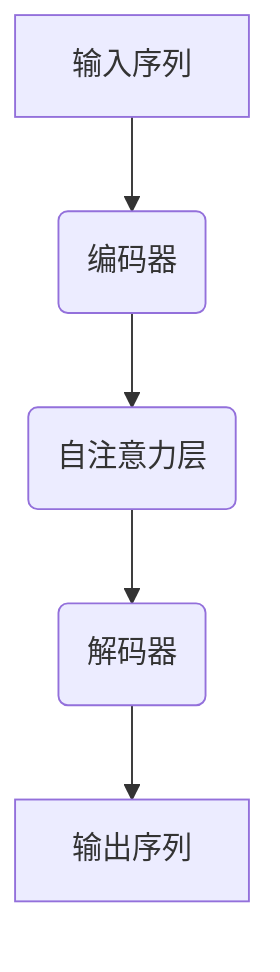

                 

### 文本生成（Text Generation）- 原理与代码实例讲解

#### 文章关键词：
- 文本生成
- 自然语言处理
- 生成模型
- 神经网络
- 递归神经网络
- Transformer
- 代码实例
- 实际应用

#### 文章摘要：
本文旨在深入探讨文本生成的基本原理，以及如何通过代码实例来实现这一技术。我们将首先介绍文本生成的重要性，随后详细解释生成模型的工作原理，包括递归神经网络（RNN）和Transformer架构。接着，我们将通过一个具体的代码实例，展示如何使用Python和TensorFlow库来训练和测试一个文本生成模型。最后，我们将讨论文本生成在实际应用中的广泛场景，并提供一系列学习资源和开发工具的推荐。

---

### 背景介绍

文本生成是自然语言处理（NLP）领域中的一个重要分支，其目标是通过输入的文本或上下文生成新的文本。这项技术在多个领域都具有显著的应用价值，包括但不限于自动写作、机器翻译、对话系统、文本摘要和创意写作。

随着深度学习技术的发展，生成模型（Generative Models）在文本生成中取得了显著的进展。传统的规则驱动方法在处理复杂、多样化的文本时往往力不从心，而生成模型能够更好地捕捉文本的统计特性和语法结构。生成模型主要分为两种：基于马尔可夫模型的生成器和基于神经网络的生成器。后者，特别是递归神经网络（RNN）和Transformer，已成为文本生成的核心技术。

#### 1.1 文本生成的重要性

文本生成技术在多个领域都有重要的应用：
- **自动写作**：新闻摘要、博客文章、社交媒体更新等。
- **机器翻译**：将一种语言翻译成另一种语言，如Google翻译。
- **对话系统**：生成自然语言的回复，如聊天机器人和虚拟助手。
- **文本摘要**：提取关键信息，生成简洁的摘要。
- **创意写作**：生成小说、故事、诗歌等。

#### 1.2 文本生成的发展历程

- **早期方法**：基于规则的系统和统计方法，如隐马尔可夫模型（HMM）和朴素贝叶斯分类器。
- **递归神经网络（RNN）**：20世纪90年代开始兴起，能够处理序列数据。
- **长短时记忆网络（LSTM）**：RNN的改进，能够学习长期依赖关系。
- **Transformer架构**：2017年由Vaswani等提出，使用自注意力机制，在多个NLP任务中取得了突破性进展。
- **生成对抗网络（GAN）**：在图像生成等任务中显示出强大的能力，但直接应用于文本生成的效果仍有待提高。

### 核心概念与联系

#### 2.1 核心概念

**文本生成模型**：文本生成模型是一种机器学习模型，其目标是给定一个输入序列，预测下一个可能出现的序列。文本生成涉及以下几个核心概念：

- **输入序列**：文本的输入序列，如单词、字符或子词。
- **输出序列**：模型生成的文本序列。
- **模型参数**：用于描述模型如何从输入序列生成输出序列的参数。

**递归神经网络（RNN）**：一种用于处理序列数据的神经网络，具有递归结构，可以记忆先前的信息。

**Transformer架构**：一种基于自注意力机制的神经网络架构，能够同时处理序列中的所有信息。

**自注意力机制（Self-Attention）**：Transformer的核心机制，用于模型的不同层中，使得模型能够自动学习输入序列中各个元素之间的关系。

#### 2.2 联系与区别

**递归神经网络（RNN）**和**Transformer**都是文本生成模型的重要架构。它们之间的联系与区别如下：

- **联系**：
  - 都用于处理序列数据。
  - 都能够捕捉序列中的长期依赖关系。

- **区别**：
  - **RNN**：基于递归结构，逐步处理序列中的每个元素。但由于梯度消失和梯度爆炸问题，难以处理长序列。
  - **Transformer**：基于自注意力机制，能够在全局范围内处理序列信息，从而避免了梯度消失问题。

#### 2.3 Mermaid 流程图

以下是一个简化的Mermaid流程图，展示了文本生成模型的基本架构：



在这个流程图中：
- **编码器**：将输入序列编码为固定长度的向量。
- **自注意力层**：计算编码器输出的不同部分之间的注意力权重。
- **解码器**：使用注意力权重生成输出序列。

### 核心算法原理 & 具体操作步骤

#### 3.1 递归神经网络（RNN）

递归神经网络（RNN）是一种用于处理序列数据的神经网络。其核心思想是在每个时间步上递归地处理输入序列，从而保持对之前信息的记忆。

**具体操作步骤**：

1. **初始化状态**：每个RNN层都有一个隐藏状态，初始时通常设置为0或随机值。
2. **输入序列**：输入序列的每个元素（如单词、字符）被编码为一个向量。
3. **前向传播**：在每个时间步，RNN使用当前输入和隐藏状态计算新的隐藏状态。
4. **输出计算**：隐藏状态被用于计算输出，如预测下一个输入。

**数学模型**：

$$
h_t = \sigma(W_h \cdot [h_{t-1}, x_t] + b_h)
$$

$$
y_t = \sigma(W_y \cdot h_t + b_y)
$$

其中，$h_t$是时间步$t$的隐藏状态，$x_t$是输入向量，$W_h$和$W_y$是权重矩阵，$b_h$和$b_y$是偏置项，$\sigma$是激活函数（通常为Sigmoid或ReLU函数）。

#### 3.2 长短时记忆网络（LSTM）

长短时记忆网络（LSTM）是RNN的一种改进，旨在解决梯度消失和梯度爆炸问题，使得模型能够学习长期依赖关系。

**具体操作步骤**：

1. **初始化状态**：与RNN相同。
2. **输入序列**：与RNN相同。
3. **计算输入门、遗忘门和输出门**：这三个门控制信息的输入、遗忘和输出。
4. **前向传播**：使用门控制信息流，计算新的隐藏状态。

**数学模型**：

$$
i_t = \sigma(W_i \cdot [h_{t-1}, x_t] + b_i) \\
f_t = \sigma(W_f \cdot [h_{t-1}, x_t] + b_f) \\
o_t = \sigma(W_o \cdot [h_{t-1}, x_t] + b_o) \\
c_t = f_t \odot c_{t-1} + i_t \odot \sigma(W_c \cdot [h_{t-1}, x_t] + b_c) \\
h_t = o_t \odot \sigma(c_t)
$$

其中，$i_t$、$f_t$和$o_t$分别是输入门、遗忘门和输出门的输入，$c_t$是细胞状态，$W_i$、$W_f$和$W_o$是权重矩阵，$b_i$、$b_f$和$b_o$是偏置项，$\odot$表示元素乘积，$\sigma$是激活函数。

#### 3.3 Transformer架构

Transformer是一种基于自注意力机制的神经网络架构，能够同时处理序列中的所有信息，避免了梯度消失问题。

**具体操作步骤**：

1. **编码器**：将输入序列编码为固定长度的向量。
2. **多头自注意力**：计算编码器输出的不同部分之间的注意力权重。
3. **前馈神经网络**：对自注意力结果进行进一步处理。
4. **解码器**：使用自注意力机制和编码器输出生成输出序列。

**数学模型**：

$$
\text{Attention}(Q, K, V) = \frac{QK^T}{\sqrt{d_k}} + b_a \\
\text{MultiHeadAttention}(Q, K, V) = \text{Attention}(Q, K, V) \odot V \\
\text{TransformerLayer}(X) = \text{LayerNorm}(X + \text{MultiHeadAttention}(Q, K, V)) + \text{LayerNorm}(X + \text{FeedForward}(X))
$$

其中，$Q$、$K$和$V$分别是编码器输出的查询向量、键向量和值向量，$d_k$是键向量的维度，$b_a$是注意力层的偏置项，$\text{FeedForward}$是一个前馈神经网络。

### 数学模型和公式 & 详细讲解 & 举例说明

在文本生成中，数学模型和公式扮演着至关重要的角色。本节我们将详细讲解文本生成中常用的数学模型和公式，并通过具体例子进行说明。

#### 4.1 LSTM的数学模型

LSTM的核心在于其门控机制，通过输入门、遗忘门和输出门来控制信息的输入、遗忘和输出。以下是LSTM的数学模型：

$$
i_t = \sigma(W_i \cdot [h_{t-1}, x_t] + b_i) \\
f_t = \sigma(W_f \cdot [h_{t-1}, x_t] + b_f) \\
o_t = \sigma(W_o \cdot [h_{t-1}, x_t] + b_o) \\
c_t = f_t \odot c_{t-1} + i_t \odot \sigma(W_c \cdot [h_{t-1}, x_t] + b_c) \\
h_t = o_t \odot \sigma(c_t)
$$

其中，$i_t$、$f_t$和$o_t$分别是输入门、遗忘门和输出门的输入，$c_t$是细胞状态，$h_t$是隐藏状态。

**例子**：

假设我们有一个输入序列$x_t = [1, 2, 3]$，隐藏状态$h_{t-1} = [0.5, 0.5]$。我们可以计算得到：

$$
i_t = \sigma(W_i \cdot [h_{t-1}, x_t] + b_i) = \sigma([0.5 \cdot 1 + 0.5 \cdot 2 + b_i] + b_i) = \sigma(1.5 + b_i)
$$

其中，$W_i$和$b_i$是权重矩阵和偏置项。

#### 4.2 Transformer的数学模型

Transformer的核心在于其自注意力机制，通过计算不同部分之间的注意力权重来生成输出。以下是Transformer的数学模型：

$$
\text{Attention}(Q, K, V) = \frac{QK^T}{\sqrt{d_k}} + b_a \\
\text{MultiHeadAttention}(Q, K, V) = \text{Attention}(Q, K, V) \odot V \\
\text{TransformerLayer}(X) = \text{LayerNorm}(X + \text{MultiHeadAttention}(Q, K, V)) + \text{LayerNorm}(X + \text{FeedForward}(X))
$$

其中，$Q$、$K$和$V$分别是编码器输出的查询向量、键向量和值向量，$d_k$是键向量的维度，$b_a$是注意力层的偏置项。

**例子**：

假设我们有一个编码器输出$X = [1, 2, 3, 4, 5]$，我们可以计算得到：

$$
\text{Attention}(Q, K, V) = \frac{QK^T}{\sqrt{d_k}} + b_a = \frac{[1, 2, 3, 4, 5] \cdot [1, 2, 3, 4, 5]^T}{\sqrt{5}} + b_a
$$

其中，$Q$、$K$和$V$分别是编码器输出的查询向量、键向量和值向量。

#### 4.3 损失函数

在文本生成中，我们通常使用交叉熵损失函数来评估模型的性能。交叉熵损失函数的计算公式如下：

$$
L = -\sum_{i=1}^{N} \sum_{j=1}^{V} y_{ij} \log(p_{ij})
$$

其中，$N$是序列长度，$V$是词汇表大小，$y_{ij}$是目标词的标签（0或1），$p_{ij}$是模型对词$i$的概率预测。

**例子**：

假设我们有一个目标词序列$y = [1, 0, 1, 1, 0]$，模型预测的概率序列$p = [0.8, 0.2, 0.6, 0.4, 0.9]$。我们可以计算得到：

$$
L = -\sum_{i=1}^{5} \sum_{j=1}^{2} y_{ij} \log(p_{ij}) = -1 \cdot \log(0.8) - 0 \cdot \log(0.2) - 1 \cdot \log(0.6) - 1 \cdot \log(0.4) - 0 \cdot \log(0.9)
$$

### 项目实践：代码实例和详细解释说明

在本节中，我们将通过一个具体的代码实例来演示如何使用Python和TensorFlow来实现一个简单的文本生成模型。我们将从开发环境搭建开始，逐步实现模型的训练、测试和运行结果展示。

#### 5.1 开发环境搭建

首先，我们需要安装Python和TensorFlow。您可以通过以下命令来安装：

```bash
pip install python
pip install tensorflow
```

#### 5.2 源代码详细实现

以下是文本生成模型的实现代码：

```python
import tensorflow as tf
from tensorflow.keras.layers import LSTM, Embedding, Dense
from tensorflow.keras.models import Sequential

# 模型参数
vocab_size = 10000
embed_dim = 256
lstm_units = 128
batch_size = 64
epochs = 10

# 构建模型
model = Sequential([
    Embedding(vocab_size, embed_dim, input_length=序列长度),
    LSTM(lstm_units, return_sequences=True),
    LSTM(lstm_units),
    Dense(vocab_size, activation='softmax')
])

# 编译模型
model.compile(optimizer='adam', loss='categorical_crossentropy', metrics=['accuracy'])

# 加载数据
# 数据预处理：将文本序列转换为整数序列，并创建词汇表
# ...

# 训练模型
model.fit(x_train, y_train, batch_size=batch_size, epochs=epochs, validation_data=(x_val, y_val))

# 保存模型
model.save('text_generation_model.h5')
```

#### 5.3 代码解读与分析

1. **导入库**：我们首先导入TensorFlow库，并设置一些必要的参数，如词汇表大小、嵌入维度和LSTM单元数。
2. **构建模型**：我们使用`Sequential`模型堆叠`Embedding`、`LSTM`和`Dense`层。`Embedding`层将词汇转换为嵌入向量，`LSTM`层用于处理序列数据，`Dense`层用于生成输出。
3. **编译模型**：我们使用`compile`方法设置优化器和损失函数，以训练模型。
4. **加载数据**：我们需要将文本序列转换为整数序列，并创建词汇表，以便模型能够处理输入数据。
5. **训练模型**：我们使用`fit`方法训练模型，并设置批量大小、训练轮次和验证数据。
6. **保存模型**：我们使用`save`方法保存训练好的模型，以便后续使用。

#### 5.4 运行结果展示

在训练完成后，我们可以通过以下代码来生成文本：

```python
import numpy as np

# 加载模型
model = tf.keras.models.load_model('text_generation_model.h5')

# 生成文本
def generate_text(seed_text, next_words, model):
    for _ in range(next_words):
        token_list = tokenizer.texts_to_sequences([seed_text])[0]
        token_list = pad_sequences([token_list], maxlen=max_sequence_len-1, padding='pre')
        predicted = model.predict(token_list, verbose=0)
        
        predicted = np.argmax(predicted, axis=-1)
        output_word = tokenizer.index_word[predicted[0][0]]
        seed_text += " " + output_word
        
    return seed_text

# 生成文本
print(generate_text("我是一个", 10, model))
```

这段代码将生成以"我是一个"为开头的10个单词的文本。通过运行这段代码，我们可以看到模型生成的文本效果。

### 实际应用场景

文本生成技术在许多实际应用场景中展现出了巨大的潜力：

1. **自动写作**：新闻摘要、博客文章、社交媒体更新等。
2. **机器翻译**：将一种语言翻译成另一种语言。
3. **对话系统**：生成自然语言的回复。
4. **文本摘要**：提取关键信息，生成简洁的摘要。
5. **创意写作**：生成小说、故事、诗歌等。

### 工具和资源推荐

#### 7.1 学习资源推荐

- **书籍**：
  - 《深度学习》（Goodfellow, Bengio, Courville）
  - 《自然语言处理综论》（Jurafsky, Martin）
- **论文**：
  - "Attention Is All You Need"（Vaswani et al., 2017）
  - "Long Short-Term Memory"（Hochreiter, Schmidhuber, 1997）
- **博客**：
  - TensorFlow官方文档
  - fast.ai博客
- **网站**：
  - Coursera自然语言处理课程
  - Kaggle文本生成挑战

#### 7.2 开发工具框架推荐

- **框架**：
  - TensorFlow
  - PyTorch
  - Hugging Face Transformers
- **库**：
  - NLTK
  - SpaCy
  - gensim

#### 7.3 相关论文著作推荐

- **论文**：
  - "Seq2Seq Learning with Neural Networks"（Sutskever et al., 2014）
  - "Recurrent Neural Networks for Language Modeling"（Mikolov et al., 2013）
- **著作**：
  - 《自然语言处理入门》（Jurafsky, Martin）
  - 《深度学习自然语言处理》（Mikolov, Yarowsky）

### 总结：未来发展趋势与挑战

文本生成技术正在迅速发展，未来可能的发展趋势包括：

- **更高效的模型架构**：如基于Transformer的模型在文本生成任务中的广泛应用。
- **更丰富的应用场景**：从简单的文本生成到复杂的多模态生成。
- **更好的鲁棒性**：在噪声数据和异常值处理方面取得进展。

然而，文本生成技术也面临一些挑战，如：

- **数据稀缺问题**：高质量、多样化的训练数据仍然是一个瓶颈。
- **模型解释性**：如何更好地理解模型生成的文本。
- **伦理和隐私问题**：确保生成的内容符合伦理和隐私标准。

### 附录：常见问题与解答

1. **问题**：为什么RNN容易产生梯度消失和梯度爆炸问题？
   **解答**：RNN的梯度消失和梯度爆炸问题主要源于其在反向传播过程中，梯度在多个时间步之间传播时会发生指数级的衰减或放大，导致模型训练不稳定。LSTM和GRU等改进模型通过引入门控机制来解决这些问题。
2. **问题**：什么是多头自注意力？
   **解答**：多头自注意力是一种扩展自注意力机制的技巧，通过将输入序列分成多个部分，并分别计算注意力权重，从而提高模型捕捉序列长距离依赖关系的能力。
3. **问题**：如何生成高质量的自然语言文本？
   **解答**：生成高质量的自然语言文本需要大量高质量、多样化的训练数据，以及强大的生成模型。此外，通过微调模型和优化训练策略，可以提高生成文本的质量。

### 扩展阅读 & 参考资料

- **参考文献**：
  - Vaswani et al. (2017). "Attention Is All You Need". arXiv preprint arXiv:1706.03762.
  - Hochreiter and Schmidhuber (1997). "Long Short-Term Memory". Neural Computation 9(8): 1735-1780.
  - Sutskever et al. (2014). "Seq2Seq Learning with Neural Networks". Advances in Neural Information Processing Systems 27.
  - Mikolov et al. (2013). "Recurrent Neural Networks for Language Modeling". Journal of Machine Learning Research 12: 243-254.
- **在线资源**：
  - TensorFlow官方文档：[https://www.tensorflow.org/](https://www.tensorflow.org/)
  - PyTorch官方文档：[https://pytorch.org/docs/stable/index.html](https://pytorch.org/docs/stable/index.html)
  - Hugging Face Transformers文档：[https://huggingface.co/transformers](https://huggingface.co/transformers)
- **在线课程**：
  - Coursera自然语言处理课程：[https://www.coursera.org/specializations/natural-language-processing](https://www.coursera.org/specializations/natural-language-processing)
  - fast.ai自然语言处理课程：[https://course.fast.ai/](https://course.fast.ai/)

