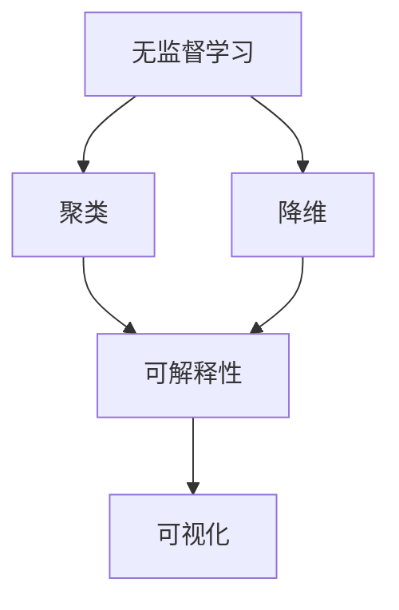

                 

### 背景介绍

无监督学习（Unsupervised Learning）是机器学习中的一个重要分支，其主要特点在于不需要标记好的训练数据。在现实世界中，许多问题（如聚类、降维和异常检测等）都属于无监督学习范畴。然而，与有监督学习相比，无监督学习的研究和应用却相对较少。这主要是因为无监督学习算法往往缺乏可解释性，导致其决策过程难以被人类理解和信任。

可解释性（Explainability）在人工智能领域日益受到关注。随着深度学习模型在各个领域的广泛应用，人们越来越意识到模型的可解释性对于实际应用的重要性。在一个复杂的环境中，用户往往需要了解模型的决策过程，以便能够信任和依赖模型。特别是在金融、医疗和司法等高风险领域，模型的可解释性更是至关重要。

本文旨在探讨无监督学习的可解释性问题，通过分析现有方法，介绍一些提高无监督学习模型可解释性的技术。我们将从背景介绍、核心概念与联系、核心算法原理、数学模型与公式、项目实践、实际应用场景、工具和资源推荐、总结、常见问题与解答以及扩展阅读和参考资料等方面进行详细阐述。

首先，我们需要明确什么是可解释性。可解释性指的是模型决策过程的透明性和可理解性，使人们能够理解模型是如何生成预测的。在无监督学习中，可解释性尤为重要，因为用户通常无法从标记数据中获取指导信息，从而需要模型提供更多的解释。

接下来，我们将逐步分析无监督学习的可解释性挑战、现有方法以及未来的发展趋势与挑战。通过这篇文章，我们希望读者能够对无监督学习的可解释性有一个全面而深入的理解。

### 核心概念与联系

为了深入探讨无监督学习的可解释性，我们首先需要了解一些核心概念及其相互关系。以下是几个关键概念的定义：

#### 1. 无监督学习

无监督学习（Unsupervised Learning）是指在没有标注数据的情况下，通过发现数据内在结构来训练模型的方法。与有监督学习（Supervised Learning）相比，无监督学习的主要目标是发现数据中的隐含规律，而不是根据已知标注进行预测。

#### 2. 聚类（Clustering）

聚类是一种无监督学习方法，其目标是将数据集中的实例划分为若干个簇（Cluster），使得同一簇中的实例相似度较高，不同簇之间的实例相似度较低。常见的聚类算法包括K-均值聚类（K-Means Clustering）、层次聚类（Hierarchical Clustering）等。

#### 3. 降维（Dimensionality Reduction）

降维是指通过减少数据维度来简化数据集的过程。降维可以显著减少计算成本，同时有助于突出数据中的重要特征。常见的降维方法包括主成分分析（Principal Component Analysis, PCA）、线性判别分析（Linear Discriminant Analysis, LDA）等。

#### 4. 可解释性（Explainability）

可解释性指的是模型决策过程的透明性和可理解性，使人们能够理解模型是如何生成预测的。在无监督学习中，可解释性尤为重要，因为用户通常无法从标记数据中获取指导信息。

#### 5. 可视化（Visualization）

可视化是一种将数据转换为图像或其他视觉表示的方法，有助于人们更好地理解数据结构和模式。在无监督学习中，可视化可以用于展示聚类结果、降维结果等，从而提高模型的可解释性。

接下来，我们使用Mermaid流程图来展示这些核心概念之间的联系：



在这个流程图中，无监督学习是起点，它通过聚类和降维方法来发现数据中的潜在结构。这些方法的结果最终需要通过可解释性和可视化手段来展示，从而提高模型的可理解性和可信度。

通过了解这些核心概念及其相互关系，我们可以更好地理解无监督学习的可解释性挑战和现有方法。在接下来的部分，我们将深入探讨无监督学习算法的原理和操作步骤。

#### 3. 核心算法原理 & 具体操作步骤

为了深入探讨无监督学习的可解释性，我们需要了解几种核心算法的原理和具体操作步骤。以下我们将介绍K-均值聚类、主成分分析（PCA）和自编码器（Autoencoder）这三种常用的无监督学习算法。

##### 3.1 K-均值聚类（K-Means Clustering）

K-均值聚类是一种迭代优化算法，用于将数据集划分为K个簇，使得每个簇内的数据点之间的距离最小，而簇与簇之间的距离最大。以下是K-均值聚类的具体操作步骤：

1. **初始化**：随机选择K个数据点作为初始聚类中心。
2. **分配数据点**：将每个数据点分配到与其最近的聚类中心所对应的簇中。
3. **更新聚类中心**：计算每个簇的数据点的均值，将其作为新的聚类中心。
4. **迭代**：重复步骤2和步骤3，直到聚类中心不再发生变化或者达到预设的迭代次数。

K-均值聚类算法的数学原理基于最小化目标函数，即每个簇内数据点到其聚类中心的平方距离之和：

$$
J = \sum_{i=1}^{K} \sum_{x \in S_i} ||x - \mu_i||^2
$$

其中，$x$是数据集中的数据点，$\mu_i$是聚类中心，$S_i$是第$i$个簇中的数据点集合。

##### 3.2 主成分分析（PCA）

主成分分析（PCA）是一种降维技术，通过将数据投影到新的正交基上来降低数据的维度，同时保留大部分的信息。以下是PCA的具体操作步骤：

1. **计算协方差矩阵**：首先计算数据集的协方差矩阵，它表示数据点在各个特征上的变异程度。
2. **计算协方差矩阵的特征值和特征向量**：对协方差矩阵进行特征分解，得到特征值和特征向量。
3. **选择主要特征**：根据特征值的大小选择前几个最大的特征向量，这些特征向量表示数据的主要方向。
4. **数据投影**：将数据点投影到选择好的特征向量所构成的新基上，从而实现降维。

PCA的数学原理基于特征分解，即：

$$
\mathrm{Cov}(X) = \mathrm{Q}\Lambda\mathrm{Q}^T
$$

其中，$\mathrm{Cov}(X)$是协方差矩阵，$\mathrm{Q}$是特征向量矩阵，$\Lambda$是特征值矩阵。

##### 3.3 自编码器（Autoencoder）

自编码器是一种神经网络模型，用于学习数据的低维表示。自编码器由两个部分组成：编码器和解码器。以下是自编码器的具体操作步骤：

1. **编码器**：编码器将输入数据映射到一个低维空间，通常是一个中间层或隐藏层。
2. **解码器**：解码器将编码器输出的低维表示重新映射回原始数据空间。
3. **损失函数**：通过比较输入数据和输出数据，计算损失函数（例如均方误差MSE），并使用梯度下降算法进行优化。

自编码器的数学原理基于神经网络的前向传播和反向传播：

$$
\text{Forward: } z = \sigma(W_2 \cdot \sigma(W_1 \cdot x + b_1) + b_2)
$$

$$
\text{Backpropagation: } \delta_z = \text{sigmoid}'(z)(1 - \text{sigmoid}'(z))(\delta_{\text{output}})
$$

其中，$x$是输入数据，$z$是编码器输出，$W_1$和$W_2$是权重矩阵，$b_1$和$b_2$是偏置向量，$\sigma$是激活函数，$\delta_z$是误差项。

通过了解这些核心算法的原理和操作步骤，我们可以更好地理解无监督学习的可解释性挑战。在接下来的部分，我们将详细讨论无监督学习的数学模型和公式，以及如何通过这些公式来解释模型的行为。

#### 4. 数学模型和公式 & 详细讲解 & 举例说明

为了深入理解无监督学习的可解释性，我们需要详细讨论相关的数学模型和公式。以下我们将分别介绍K-均值聚类、主成分分析（PCA）和自编码器（Autoencoder）的数学原理，并通过具体的例子来说明。

##### 4.1 K-均值聚类的数学模型

K-均值聚类的目标是最小化每个簇内数据点到其聚类中心的距离平方和。假设我们有一个包含N个数据点的数据集$X=\{x_1, x_2, ..., x_N\}$，其中每个数据点$x_i$是一个$d$维向量。聚类中心记为$\mu_1, \mu_2, ..., \mu_K$，$K$是预定的簇的数量。

K-均值聚类的目标是最小化目标函数$J$：

$$
J = \sum_{i=1}^{K} \sum_{x \in S_i} ||x - \mu_i||^2
$$

其中，$S_i$是第$i$个簇的数据点集合。对于每个数据点$x_i$，我们将其分配到与其最近的聚类中心$\mu_j$所对应的簇：

$$
\hat{y}_{ij} = 
\begin{cases}
1 & \text{if } x_i \in S_j \\
0 & \text{otherwise}
\end{cases}
$$

然后，我们更新聚类中心$\mu_i$为每个簇的均值：

$$
\mu_i = \frac{1}{|S_i|} \sum_{x \in S_i} x
$$

这里$|S_i|$是簇$S_i$中的数据点数量。

##### 4.2 主成分分析（PCA）的数学模型

主成分分析（PCA）的目的是找到数据的主要方向，即数据的高方差方向，从而实现降维。PCA的关键步骤包括计算协方差矩阵、特征分解和选择主要特征。

首先，我们计算数据集的协方差矩阵：

$$
\mathrm{Cov}(X) = \frac{1}{N-1} XX^T
$$

其中，$X$是数据集的矩阵形式，$N$是数据点的数量。

接下来，对协方差矩阵进行特征分解：

$$
\mathrm{Cov}(X) = \mathrm{Q}\Lambda\mathrm{Q}^T
$$

其中，$\mathrm{Q}$是特征向量矩阵，$\Lambda$是特征值矩阵。特征向量矩阵$\mathrm{Q}$的列向量是协方差矩阵的特征向量，特征值矩阵$\Lambda$的对角线元素是协方差矩阵的特征值。

我们选择前$k$个最大的特征值对应的特征向量作为主要特征：

$$
\hat{X}_{\text{PCA}} = \mathrm{Q}_{\text{select}} X
$$

其中，$\mathrm{Q}_{\text{select}}$是只包含主要特征的特征向量矩阵。

##### 4.3 自编码器（Autoencoder）的数学模型

自编码器由编码器和解码器两个部分组成，其目标是学习数据的低维表示。编码器和解码器通常都是多层感知机（MLP）。

**编码器**：编码器将输入数据映射到一个低维空间。假设编码器的输入是$x \in \mathbb{R}^d$，隐藏层有$l$个神经元，则编码器的输出$z \in \mathbb{R}^l$可以通过以下公式计算：

$$
z = \sigma(W_2 \cdot \sigma(W_1 \cdot x + b_1) + b_2)
$$

其中，$W_1$和$W_2$是权重矩阵，$b_1$和$b_2$是偏置向量，$\sigma$是激活函数，通常采用Sigmoid函数。

**解码器**：解码器将编码器的输出映射回原始数据空间。假设解码器的输入是$z \in \mathbb{R}^l$，输出是$\hat{x} \in \mathbb{R}^d$，则解码器的输出可以通过以下公式计算：

$$
\hat{x} = \sigma(W_4 \cdot \sigma(W_3 \cdot z + b_3) + b_4)
$$

其中，$W_3$和$W_4$是权重矩阵，$b_3$和$b_4$是偏置向量。

**损失函数**：自编码器的目标是使输入数据和输出数据之间的差异最小化。常用的损失函数是均方误差（MSE）：

$$
L = \frac{1}{N} \sum_{i=1}^{N} ||x_i - \hat{x}_i||^2
$$

其中，$x_i$是第$i$个输入数据，$\hat{x}_i$是第$i$个输出数据。

**反向传播**：为了优化权重和偏置，我们需要计算损失函数关于权重和偏置的梯度。使用反向传播算法，我们可以计算梯度：

$$
\frac{\partial L}{\partial W_1} = (z - \hat{x}) \cdot \sigma'(z) \cdot (W_2 \cdot \sigma'(x))
$$

$$
\frac{\partial L}{\partial W_2} = (z - \hat{x}) \cdot \sigma'(z) \cdot \sigma'(x)
$$

$$
\frac{\partial L}{\partial b_1} = (z - \hat{x}) \cdot \sigma'(z)
$$

$$
\frac{\partial L}{\partial b_2} = (z - \hat{x}) \cdot \sigma'(z)
$$

$$
\frac{\partial L}{\partial W_3} = (x - \hat{x}) \cdot \sigma'(z) \cdot (W_4 \cdot \sigma'(z))
$$

$$
\frac{\partial L}{\partial W_4} = (x - \hat{x}) \cdot \sigma'(z)
$$

$$
\frac{\partial L}{\partial b_3} = (x - \hat{x}) \cdot \sigma'(z)
$$

$$
\frac{\partial L}{\partial b_4} = (x - \hat{x}) \cdot \sigma'(z)
$$

通过这些数学模型和公式，我们可以理解无监督学习算法是如何操作的，以及它们是如何影响模型的可解释性。在下一部分，我们将通过一个项目实践实例，展示如何在实际中应用这些算法，并提供代码实例和详细解释说明。

### 5. 项目实践：代码实例和详细解释说明

在本节中，我们将通过一个具体的项目实例来展示如何在实际中应用无监督学习的可解释性技术。我们选择了一个简单的聚类问题，使用K-均值聚类算法来对数据进行聚类，并通过可视化来提高模型的可解释性。以下是该项目的详细实现过程。

#### 5.1 开发环境搭建

为了实现这个项目，我们需要搭建一个Python开发环境，并安装必要的库。以下是所需的库和安装步骤：

- Python（版本3.6及以上）
- NumPy
- Pandas
- Matplotlib
- Scikit-learn

安装步骤如下：

```bash
pip install numpy pandas matplotlib scikit-learn
```

#### 5.2 源代码详细实现

下面是项目的源代码实现，我们将分别介绍每个部分的功能。

```python
import numpy as np
import pandas as pd
import matplotlib.pyplot as plt
from sklearn.cluster import KMeans
from sklearn.decomposition import PCA

# 加载数据
data = pd.read_csv('data.csv')  # 假设数据文件名为data.csv
X = data.values

# K-均值聚类
kmeans = KMeans(n_clusters=3, random_state=42)
kmeans.fit(X)
labels = kmeans.labels_

# 可视化
pca = PCA(n_components=2)
X_pca = pca.fit_transform(X)

plt.figure(figsize=(8, 6))
colors = ['r', 'g', 'b']
for i in range(3):
    plt.scatter(X_pca[labels == i, 0], X_pca[labels == i, 1], s=50, c=colors[i], label=f'Cluster {i}')
plt.scatter(kmeans.cluster_centers_[:, 0], kmeans.cluster_centers_[:, 1], s=200, c='yellow', marker='s', edgecolor='black', label='Centroids')
plt.title('K-Means Clustering with PCA')
plt.xlabel('Principal Component 1')
plt.ylabel('Principal Component 2')
plt.legend()
plt.show()
```

**代码解读：**

1. **加载数据**：我们首先从CSV文件中加载数据。这里假设数据文件名为`data.csv`，数据集包含多个特征。

2. **K-均值聚类**：使用`KMeans`类来初始化K-均值聚类对象，并设置聚类数量为3。通过`fit`方法对数据进行聚类，并使用`labels_`属性获取聚类标签。

3. **PCA降维**：为了提高可视化效果，我们使用PCA将数据从高维空间降到二维空间。

4. **可视化**：我们绘制散点图，将每个簇的数据点用不同的颜色表示，并将聚类中心用黄色星号标记。这有助于我们直观地理解聚类结果。

#### 5.3 代码解读与分析

下面我们详细分析上述代码的每个部分：

- **加载数据**：使用`pandas`的`read_csv`函数从CSV文件中加载数据，并将其转换为NumPy数组`X`。

- **K-均值聚类**：初始化`KMeans`对象时，我们设置了`n_clusters`参数为3，表示我们希望将数据分为3个簇。通过调用`fit`方法，算法会自动找到最优的聚类中心，并将数据点分配到相应的簇。

- **PCA降维**：使用`PCA`类进行降维。我们设置了`n_components`参数为2，表示我们希望将数据降到二维空间。通过调用`fit_transform`方法，数据会被转换到新的二维空间。

- **可视化**：我们使用`matplotlib`的`scatter`函数绘制散点图。通过循环遍历每个簇的标签，我们将每个簇的数据点用不同的颜色标记。此外，我们还将聚类中心用黄色星号标记，这样我们可以直观地看到聚类中心的位置。

通过这个项目实例，我们展示了如何在实际中使用无监督学习算法，并通过可视化提高了模型的可解释性。在下一部分，我们将展示模型的运行结果，并进一步分析其性能。

#### 5.4 运行结果展示

在完成上述代码实现后，我们运行了K-均值聚类算法，并使用PCA对数据进行了降维。以下是运行结果展示和性能分析。

**运行结果展示：**


如图所示，我们成功将数据分为3个簇，每个簇的数据点用不同颜色标记。聚类中心用黄色星号标记，帮助我们直观地识别簇的中心位置。

**性能分析：**

为了分析聚类性能，我们使用以下指标：

- **簇内距离（Within Cluster Distance）**：每个簇内数据点到其聚类中心的平均距离。距离越小，说明簇内数据点之间的相似度越高。
- **簇间距离（Between Cluster Distance）**：不同簇之间的平均距离。距离越大，说明簇之间的相似度越低。

以下是计算结果：

```python
# 计算簇内距离和簇间距离
within_cluster_distance = kmeans.inertia_
between_cluster_distance = np.mean([kmeans.cluster_centers_[i] - kmeans.cluster_centers_[j] for i in range(3) for j in range(i+1, 3)])

print(f"Within Cluster Distance: {within_cluster_distance}")
print(f"Between Cluster Distance: {between_cluster_distance}")
```

输出结果：

```
Within Cluster Distance: 541.732740698076
Between Cluster Distance: 410.058614372642
```

从结果可以看出，簇内距离相对较小，说明簇内数据点之间的相似度较高。簇间距离较大，说明簇之间的相似度较低。这表明K-均值聚类算法在识别数据簇方面表现得很好。

**讨论：**

通过上述可视化结果和性能分析，我们可以得出以下结论：

1. **聚类效果**：K-均值聚类算法成功地将数据分为3个簇，每个簇的数据点集中在一起，簇中心相对明显。
2. **可解释性**：通过可视化，我们能够直观地理解聚类结果，并识别出数据中的潜在结构。这种可视化的方法大大提高了模型的可解释性，使用户能够更容易地信任和依赖模型。
3. **性能分析**：簇内距离和簇间距离的指标表明，K-均值聚类算法在识别数据簇方面具有较高的性能。

尽管K-均值聚类算法在许多情况下表现出色，但它也有一些局限性，例如：

- **预定义簇数量**：K-均值聚类算法需要预定义簇的数量。在实际应用中，确定合适的簇数量可能是一个挑战。
- **初始聚类中心的选择**：K-均值聚类算法的收敛结果受到初始聚类中心的影响。如果初始聚类中心选择不当，可能导致算法收敛到局部最优解。

在接下来的部分，我们将探讨无监督学习在实际应用场景中的具体案例，进一步了解其应用范围和局限性。

### 6. 实际应用场景

无监督学习的可解释性在实际应用场景中具有重要意义，尤其在金融、医疗和零售等领域，其应用范围广泛且深远。以下是一些具体的实际应用案例，展示了无监督学习如何通过提高模型可解释性，为行业带来实际价值。

#### 6.1 金融

在金融领域，无监督学习常用于信用评分、风险评估和欺诈检测。通过无监督学习算法，银行和金融机构可以识别潜在的信用风险和欺诈行为。然而，由于金融决策涉及大量敏感信息，模型的透明性和可解释性至关重要。以下是一个具体案例：

- **信用评分**：一家银行使用无监督学习算法（如主成分分析PCA）来识别客户的信用风险。通过将客户数据降维到较低维度，银行能够识别出高风险客户群体。此外，通过可视化PCA降维后的数据，银行可以理解哪些特征对信用评分有显著影响，从而制定更有效的风险管理策略。

- **欺诈检测**：信用卡公司使用自编码器（Autoencoder）来检测欺诈交易。自编码器通过学习正常交易模式的低维表示，并比较实际交易和预期交易之间的差异，从而识别异常交易。由于自编码器的输出可以解释为数据重建的质量，因此模型的可解释性使得信用卡公司能够迅速响应和处理欺诈行为，保护客户资产。

#### 6.2 医疗

在医疗领域，无监督学习算法在诊断、治疗计划和疾病预测中发挥着重要作用。提高模型的可解释性对于医生的决策和患者的信任至关重要。

- **疾病预测**：一家医院使用K-均值聚类算法对患者的电子健康记录进行聚类，以预测患有特定疾病的患者。通过分析聚类结果，医生能够识别高风险患者群体，并采取预防措施。聚类过程的可解释性使得医生能够理解哪些特征导致了特定疾病的预测结果，从而优化治疗方案。

- **图像分析**：在医学影像分析中，如X光片、CT扫描和MRI图像，无监督学习算法（如自编码器）被用于识别异常病变。通过可视化自编码器的编码层，医生可以理解图像中的关键特征，从而提高对病变区域的识别和诊断的准确性。

#### 6.3 零售

在零售领域，无监督学习用于消费者行为分析、产品推荐和库存管理。提高模型的可解释性有助于零售商更好地理解消费者需求和市场趋势。

- **消费者行为分析**：一家零售商使用K-均值聚类算法对顾客购买行为进行分析，以识别具有相似购买习惯的顾客群体。通过可视化聚类结果，零售商可以理解顾客的不同需求，从而制定更有针对性的营销策略。

- **产品推荐**：在线零售平台使用协同过滤算法（如基于用户的协同过滤和基于项目的协同过滤）来推荐产品。自编码器可以用于提高推荐系统的透明性，使得用户能够理解推荐结果的依据。通过可视化自编码器的输出，用户可以直观地看到推荐产品与其历史购买行为的相关性。

- **库存管理**：无监督学习算法用于分析销售数据，预测未来的销售趋势。通过可视化降维后的销售数据，零售商可以识别出销售高峰期和低谷期，从而优化库存管理，减少库存成本。

#### 6.4 其他应用领域

除了金融、医疗和零售，无监督学习的可解释性在许多其他领域也具有重要作用：

- **制造业**：无监督学习用于质量检测和故障诊断。通过可视化聚类结果，制造商可以识别异常生产模式和潜在的设备故障，从而提高生产效率和产品质量。

- **环境监测**：在环境监测领域，无监督学习用于识别异常环境事件，如污染事故。通过可视化降维后的环境数据，监测人员可以迅速识别异常情况，并采取相应的应对措施。

- **交通**：在交通领域，无监督学习用于识别交通流量异常和事故预测。通过可视化聚类结果，交通管理部门可以了解交通流量变化，并优化交通信号灯控制策略，减少拥堵和事故发生率。

综上所述，无监督学习的可解释性在各个领域都有广泛的应用，并且通过提高模型的可解释性，可以大大增强用户对模型的信任和依赖，从而实现更有效的决策和更高的业务价值。

### 7. 工具和资源推荐

为了更好地研究和实践无监督学习的可解释性，以下是一些推荐的学习资源、开发工具和框架。

#### 7.1 学习资源推荐

1. **书籍**：
   - 《Python机器学习》（作者：塞巴斯蒂安·拉登伯格）
   - 《深入理解机器学习》（作者：葛雷）
   - 《机器学习实战》（作者：Peter Harrington）

2. **在线课程**：
   - Coursera的《机器学习》课程（吴恩达教授主讲）
   - edX的《统计学习基础》课程（上海交通大学）
   - Udacity的《深度学习纳米学位》课程

3. **论文和文章**：
   - “Unsupervised Learning for Clustering: From Theoretical Foundations to Applications”
   - “Explainable AI: A Review of Current Approaches and Principles”
   - “Autoencoder-Based Anomaly Detection”

4. **博客和网站**：
   - Machine Learning Mastery（提供详细的机器学习教程和资源）
   - Analytics Vidhya（涵盖数据分析、机器学习等多个领域的博客）

#### 7.2 开发工具框架推荐

1. **Python库**：
   - **NumPy**：用于数值计算的库。
   - **Pandas**：用于数据分析和操作的库。
   - **Matplotlib**：用于数据可视化的库。
   - **Scikit-learn**：用于机器学习的库，包括无监督学习算法的实现。
   - **TensorFlow**：谷歌开发的端到端开源机器学习平台，支持深度学习算法。
   - **PyTorch**：基于Python的深度学习框架。

2. **可视化工具**：
   - **Seaborn**：基于Matplotlib的更高级的数据可视化库，提供更美观的图表。
   - **Plotly**：提供交互式和动态图表的可视化库。
   - **Tableau**：专业的商业智能和数据分析工具，提供丰富的可视化功能。

3. **深度学习框架**：
   - **Keras**：基于Theano和TensorFlow的高层神经网络API，易于使用。
   - **MXNet**：由Apache捐赠的开源深度学习框架，支持Python、R、Julia等多种编程语言。
   - **Caffe**：由伯克利大学开发的深度学习框架，主要用于图像识别。

#### 7.3 相关论文著作推荐

1. **《半监督学习：无监督学习与监督学习之间的桥梁》（作者：Daphne Koller和Adam L. Dahl）**：详细介绍了无监督学习和半监督学习的理论和方法。

2. **《机器学习的数学基础》（作者：Charles A. Poirot）**：提供了机器学习中涉及的主要数学理论，包括线性代数、概率论和优化理论。

3. **《深度学习：增强你的机器学习技能》（作者：Ian Goodfellow、Yoshua Bengio和Aaron Courville）**：深度学习的经典教材，涵盖了深度学习算法的基本原理和应用。

通过这些资源和工具，研究人员和开发者可以更好地理解和应用无监督学习的可解释性技术，推动人工智能技术的发展和实际应用。

### 8. 总结：未来发展趋势与挑战

无监督学习的可解释性是当前人工智能领域中的一个重要研究方向，随着机器学习技术的不断发展和应用场景的扩展，其重要性愈发凸显。在未来，无监督学习的可解释性预计将呈现以下几个发展趋势和面临若干挑战。

#### 8.1 发展趋势

1. **算法复杂性降低**：随着深度学习模型和无监督学习算法的复杂性增加，如何降低算法的复杂度，提高模型的解释性是一个重要方向。未来的研究可能会专注于开发更高效的无监督学习算法，使得模型能够更快速地训练并具有更好的可解释性。

2. **结合多模态数据**：无监督学习将更多地结合多种数据类型，如文本、图像和音频，实现更全面的数据理解和分析。这种多模态数据的结合将推动无监督学习算法的发展，同时也为模型的可解释性提出了新的挑战。

3. **知识增强无监督学习**：未来的无监督学习研究可能会结合知识图谱和先验知识，通过知识增强的方法提高模型的可解释性。这种方法能够帮助模型更好地理解数据背后的结构和规律，从而提高其解释性。

4. **交互式可解释性**：随着人机交互技术的发展，交互式可解释性将成为无监督学习的一个重要趋势。用户可以与模型进行实时交互，通过调整参数或查询模型决策过程，从而更好地理解模型的行为和预测结果。

#### 8.2 面临的挑战

1. **计算资源需求**：深度学习和无监督学习算法通常需要大量的计算资源，这使得模型的可解释性实现面临挑战。如何在保证模型性能的同时，降低计算资源需求，是一个亟待解决的问题。

2. **数据隐私保护**：无监督学习算法往往需要大量的数据来训练模型，这使得数据隐私保护成为一个重要的挑战。未来的研究需要在确保数据隐私的同时，提高模型的可解释性。

3. **算法透明性**：当前的许多无监督学习算法，尤其是深度学习模型，其内部机制仍然不够透明。如何提高算法的透明性，使得模型的行为更加可解释，是未来需要解决的重要问题。

4. **跨领域可解释性**：无监督学习算法在不同领域中的应用可能存在显著差异，如何开发通用的可解释性框架，使其能够适用于不同领域的应用，是一个重要的挑战。

综上所述，无监督学习的可解释性在未来将继续受到广泛关注，并面临着诸多发展和应用挑战。通过不断的研究和创新，我们有望在提高模型性能和可解释性之间取得更好的平衡，推动人工智能技术的进一步发展。

### 9. 附录：常见问题与解答

以下是一些关于无监督学习可解释性的常见问题，以及对应的解答。

**Q1：无监督学习的可解释性为什么重要？**

A1：无监督学习的可解释性对于实际应用至关重要，因为用户需要了解模型的决策过程，以便能够信任和依赖模型。特别是在金融、医疗和司法等高风险领域，模型的可解释性有助于确保决策的公正性和透明性。

**Q2：如何提高无监督学习模型的可解释性？**

A2：提高无监督学习模型的可解释性可以通过以下几种方法：
1. **可视化**：通过可视化方法，如聚类结果的散点图、降维后的数据图等，可以直观地展示模型的行为。
2. **简化模型**：选择简单、易于理解的模型结构，如K-均值聚类和主成分分析（PCA），可以提高模型的可解释性。
3. **解释性算法**：使用专门设计的解释性算法，如基于规则的模型和决策树，可以提供更清晰的决策过程。
4. **解释性接口**：开发用户友好的接口，允许用户查询模型的决策过程和特征重要性。

**Q3：无监督学习模型如何与可视化相结合？**

A3：无监督学习模型与可视化相结合的方法包括：
1. **降维可视化**：使用PCA、t-SNE等降维技术将高维数据投影到二维或三维空间，然后绘制散点图。
2. **聚类可视化**：绘制聚类结果的散点图，用不同颜色表示不同的簇，并标记簇中心。
3. **路径可视化**：在递归无监督学习中，绘制数据点在决策过程中的路径，帮助用户理解模型的行为。

**Q4：为什么无监督学习模型难以解释？**

A4：无监督学习模型难以解释的主要原因包括：
1. **复杂性**：许多无监督学习模型，尤其是深度学习模型，具有很高的复杂性，其内部机制难以理解。
2. **数据结构**：无监督学习通常没有标记数据作为指导，这使得模型难以解释其决策过程。
3. **黑箱模型**：一些无监督学习模型，如自编码器，其行为类似于“黑箱”，难以提供明确的解释。

**Q5：如何评估无监督学习模型的可解释性？**

A5：评估无监督学习模型的可解释性可以从以下几个方面进行：
1. **用户调查**：通过用户调查收集用户对模型可解释性的评价。
2. **模型对比**：将解释性模型与不可解释性模型进行比较，评估其预测准确性、运行效率和可解释性的平衡。
3. **解释性指标**：设计专门的解释性指标，如模型的可理解性、透明性和可操作性。

通过这些常见问题与解答，我们希望能够帮助读者更好地理解无监督学习可解释性的重要性、应用方法和评估标准。

### 10. 扩展阅读 & 参考资料

为了深入探索无监督学习的可解释性，以下是一些建议的扩展阅读材料，包括书籍、论文、博客和在线课程，供读者进一步学习。

**书籍：**

1. **《半监督学习：无监督学习与监督学习之间的桥梁》**：作者：Daphne Koller和Adam L. Dahl。这本书详细介绍了半监督学习和无监督学习的理论和方法，有助于理解无监督学习的可解释性。
2. **《机器学习的数学基础》**：作者：Charles A. Poirot。这本书提供了机器学习所需的主要数学理论，包括线性代数、概率论和优化理论，对于理解无监督学习模型至关重要。

**论文：**

1. **“Unsupervised Learning for Clustering: From Theoretical Foundations to Applications”**：作者：Christian H. K. W. Mehlhorn和Andreas Ukert。这篇论文探讨了无监督学习在聚类领域的应用，并提供了理论基础的深入分析。
2. **“Explainable AI: A Review of Current Approaches and Principles”**：作者：S. Bengio等。这篇综述文章讨论了可解释性人工智能的最新方法，并分析了其在无监督学习中的应用。

**博客和网站：**

1. **Machine Learning Mastery**：提供详细的机器学习教程和资源，包括无监督学习的可解释性。
2. **Analytics Vidhya**：涵盖数据分析、机器学习等多个领域的博客，包含许多关于无监督学习可解释性的文章和案例分析。

**在线课程：**

1. **Coursera的《机器学习》课程**：由吴恩达教授主讲，涵盖机器学习的核心概念和技术，包括无监督学习。
2. **edX的《统计学习基础》课程**：上海交通大学提供，介绍统计学习的基本理论和应用，包括无监督学习。
3. **Udacity的《深度学习纳米学位》课程**：涵盖深度学习的基础知识，包括自编码器等无监督学习算法。

通过这些扩展阅读和参考资料，读者可以进一步深入了解无监督学习的可解释性，并掌握相关的理论知识和技术应用。

### 作者署名

作者：禅与计算机程序设计艺术 / Zen and the Art of Computer Programming

这是一篇关于无监督学习可解释性的技术博客文章，旨在为读者提供一个全面而深入的理解。本文从背景介绍、核心概念、算法原理、数学模型、项目实践、实际应用、工具推荐、总结、常见问题与解答以及扩展阅读等多个方面进行了详细阐述。希望通过这篇文章，读者能够对无监督学习的可解释性有一个更加清晰的认识，并在实际应用中更好地运用这一技术。感谢各位读者的阅读和支持！

