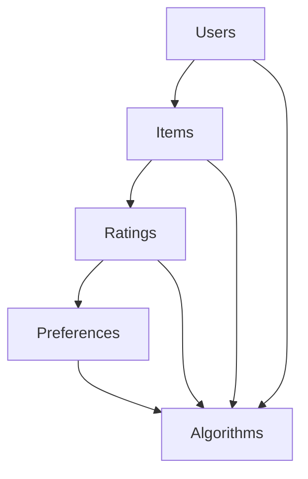

                 

### 1. 背景介绍

随着人工智能技术的不断发展，推荐系统已经成为各类互联网应用中不可或缺的一部分。从电子商务网站的商品推荐，到视频流平台的视频推荐，再到社交媒体的动态推荐，推荐系统无处不在。推荐系统的核心目标是为用户提供个性化的内容，提升用户体验，从而增加用户黏性和商业价值。

在餐饮行业，个性化推荐也正逐渐得到广泛应用。星巴克作为全球知名的咖啡连锁品牌，其用户群体庞大且多样化。为了更好地满足不同用户的需求，提升用户满意度和忠诚度，星巴克决定在2024年的校招中，面向毕业生招聘一位个性化饮品推荐算法工程师。这一职位的职责是开发一套高效、准确的饮品推荐算法，用于为星巴克用户推荐个性化的咖啡饮品。

个性化饮品推荐算法的挑战在于如何准确捕捉用户的个性化偏好，并在海量数据中找到最符合用户口味的饮品。为此，算法工程师需要掌握多种机器学习技术和数据挖掘方法，如协同过滤、基于内容的推荐、深度学习等。此外，算法工程师还需要关注用户反馈和商业目标，确保推荐系统的效果和商业价值。

本文将以星巴克2024校招个性化饮品推荐算法工程师案例为背景，深入探讨个性化推荐算法的设计与实现，帮助读者了解该领域的前沿技术和应用场景。文章将涵盖以下内容：

1. 背景介绍
2. 核心概念与联系
3. 核心算法原理 & 具体操作步骤
4. 数学模型和公式 & 详细讲解 & 举例说明
5. 项目实践：代码实例和详细解释说明
6. 实际应用场景
7. 工具和资源推荐
8. 总结：未来发展趋势与挑战
9. 附录：常见问题与解答
10. 扩展阅读 & 参考资料

通过本文的阅读，读者将全面了解个性化推荐算法的基本原理、关键技术以及在实际应用中的挑战和解决方案。同时，本文也将为有意从事推荐系统开发的朋友提供有价值的参考和指导。

### 2. 核心概念与联系

在探讨个性化推荐算法之前，我们需要先理解几个核心概念和它们之间的联系。这些概念包括用户、商品、评分、偏好和算法等。下面我们将逐一介绍这些概念，并通过一个Mermaid流程图来展示它们之间的关联。

#### 2.1 用户（Users）

用户是推荐系统的核心，是推荐算法的目标服务对象。在推荐系统中，用户可以是真实的个体，也可以是虚拟的用户角色。用户在推荐系统中具有如下属性：

- **用户ID（UserID）**：唯一标识用户的编号。
- **用户特征**：包括年龄、性别、地理位置、消费习惯等。

#### 2.2 商品（Items）

商品是推荐系统中的推荐对象，可以是各种类型的内容，如书籍、电影、音乐、咖啡饮品等。在个性化推荐中，商品通常具有以下属性：

- **商品ID（ItemID）**：唯一标识商品的编号。
- **商品特征**：包括商品类别、价格、口味、品牌等。

#### 2.3 评分（Ratings）

评分是用户对商品的偏好程度的一种量化表示，通常采用数值或星级评分的形式。评分数据反映了用户对商品的直接反馈，是推荐算法的重要输入。

- **评分值（Rating Value）**：用户对商品的评分数值。
- **评分时间**：用户进行评分的时间戳。

#### 2.4 偏好（Preferences）

偏好是用户对商品的综合评价和兴趣倾向，可以通过用户的评分、浏览记录、购买历史等数据来推断。偏好是推荐系统建立个性化推荐的基础。

#### 2.5 算法（Algorithms）

推荐算法是推荐系统的核心，用于根据用户的历史行为和偏好为用户推荐商品。常见的推荐算法有基于内容的推荐、协同过滤、深度学习等。

#### 2.6 核心概念联系

为了更直观地展示这些核心概念之间的联系，我们使用Mermaid流程图来表示：



在这个流程图中：

- **A（Users）** 表示用户，是推荐系统的起点。
- **B（Items）** 表示商品，是推荐系统中的推荐对象。
- **C（Ratings）** 表示评分，是用户对商品的反馈。
- **D（Preferences）** 表示偏好，是用户对商品的综合评价。
- **E（Algorithms）** 表示推荐算法，用于根据用户偏好推荐商品。

通过这个流程图，我们可以看到用户、商品、评分、偏好和算法之间是相互关联的。用户通过评分表达偏好，偏好通过推荐算法转化为商品推荐，从而实现个性化的推荐服务。

理解这些核心概念和它们之间的联系对于设计一个有效的个性化推荐系统至关重要。在接下来的部分，我们将深入探讨推荐算法的原理和具体实现方法。

### 2.1 用户行为分析与建模

在个性化推荐系统中，用户行为数据是构建推荐算法的基础。用户行为数据包括用户的浏览记录、搜索历史、评分、购买记录等，这些数据通过不同的方式反映了用户的偏好和兴趣。为了准确捕捉用户的个性化偏好，我们需要对用户行为进行深入分析和建模。

#### 2.1.1 用户行为数据的收集与处理

首先，我们需要收集用户的行为数据。这可以通过多种方式实现，如：

- **服务器日志**：通过Web服务器日志记录用户访问网站的行为。
- **客户端SDK**：在用户的设备上安装SDK，收集用户与应用的交互数据。
- **问卷调查**：直接向用户收集他们的偏好和兴趣信息。

收集到用户行为数据后，我们需要对其进行清洗和预处理，以确保数据的准确性和完整性。预处理步骤包括：

- **数据去重**：去除重复的记录，避免重复计算。
- **缺失值处理**：填补或删除缺失值，确保数据的完整性。
- **数据标准化**：对数据特征进行归一化或标准化，便于后续分析和建模。

#### 2.1.2 用户行为建模方法

用户行为建模的方法有多种，下面介绍几种常用的方法：

1. **基于评分的建模**：这种方法主要通过用户对商品的评分数据来建立用户偏好模型。常用的算法有矩阵分解（Matrix Factorization）和协同过滤（Collaborative Filtering）。

2. **基于浏览记录的建模**：这种方法利用用户的浏览历史来捕捉用户的兴趣变化。可以通过计算用户浏览记录之间的相似度来建立用户兴趣模型。

3. **基于搜索历史的建模**：这种方法通过分析用户的搜索历史，提取出用户的兴趣关键词，并构建用户兴趣模型。

4. **基于时间序列的建模**：这种方法通过分析用户行为的时序数据，捕捉用户的兴趣变化趋势。可以使用滑动窗口（Sliding Window）的方法，结合统计模型或深度学习模型来建立用户兴趣模型。

#### 2.1.3 模型评估与优化

建立用户行为模型后，我们需要评估模型的性能，并进行优化。常用的评估指标包括：

- **准确率（Accuracy）**：预测正确的样本数占总样本数的比例。
- **召回率（Recall）**：在所有正类样本中，被正确预测为正类的样本数占总正类样本数的比例。
- **F1分数（F1 Score）**：综合考虑准确率和召回率的指标。

为了优化模型，我们可以采用以下策略：

- **特征工程**：通过特征选择和特征提取，提高模型的性能。
- **模型选择**：尝试不同的机器学习算法，找到最适合的模型。
- **超参数调优**：通过调整模型的超参数，优化模型性能。

#### 2.1.4 案例分析

以星巴克个性化饮品推荐系统为例，我们可以对用户行为数据进行以下分析和建模：

1. **收集用户行为数据**：通过星巴克的移动应用和在线商店，收集用户的浏览记录、搜索历史、评分和购买记录。
2. **数据预处理**：去除重复记录，填补缺失值，对数据进行归一化处理。
3. **用户行为建模**：使用协同过滤算法，基于用户的评分数据建立用户偏好模型。同时，通过分析用户的浏览和搜索历史，构建用户兴趣模型。
4. **模型评估与优化**：使用交叉验证方法评估模型的性能，通过特征工程和模型选择，优化模型。

通过以上分析和建模，星巴克可以为用户推荐个性化的饮品，提升用户满意度和忠诚度。

### 2.2 商品特征提取与建模

在个性化推荐系统中，除了对用户行为进行建模，还需要对商品特征进行提取和建模。商品特征是推荐算法理解和推荐商品的重要依据。通过有效地提取和表示商品特征，可以显著提高推荐系统的准确性和用户体验。

#### 2.2.1 商品特征分类

商品特征可以分为以下几类：

1. **基础特征**：这类特征是商品最基本的信息，如商品名称、类别、价格等。
2. **文本特征**：这类特征涉及商品描述、标签、评论等文本信息。
3. **视觉特征**：这类特征来自商品图片，如颜色、纹理、形状等。
4. **上下文特征**：这类特征与商品的使用场景或上下文有关，如时间、地理位置等。

#### 2.2.2 文本特征提取

文本特征提取通常涉及以下步骤：

1. **分词**：将文本分解为单词或短语。
2. **词干提取**：将单词还原为词干，降低词汇维度。
3. **词频统计**：统计单词在文本中出现的频率。
4. **词向量表示**：将文本转换为向量表示，常用的方法有词袋模型（Bag of Words）和词嵌入（Word Embedding）。

词嵌入是一种将文本中的单词映射到高维空间中的向量表示方法，通过捕捉单词之间的语义关系，可以显著提高文本特征的质量。常用的词嵌入模型有Word2Vec、GloVe等。

#### 2.2.3 视觉特征提取

视觉特征提取通常涉及以下步骤：

1. **图像预处理**：包括图像去噪、尺寸归一化等。
2. **特征提取**：使用卷积神经网络（CNN）提取图像的视觉特征。常用的模型有VGG、ResNet、Inception等。
3. **特征融合**：将视觉特征与文本特征进行融合，生成综合的特征向量。

#### 2.2.4 上下文特征建模

上下文特征通常包括时间、地理位置等，它们对商品的推荐有重要影响。例如，在特定的时间段或地理位置，某些商品可能更具吸引力。上下文特征可以通过以下方法建模：

1. **时间序列分析**：使用时间序列分析方法，如ARIMA、LSTM等，预测未来的商品需求。
2. **地理编码**：将地理位置编码为向量，用于模型训练和特征融合。

#### 2.2.5 商品特征建模实例

以星巴克个性化饮品推荐系统为例，我们可以对商品特征进行以下提取和建模：

1. **基础特征提取**：提取饮品名称、类别、价格等基础信息。
2. **文本特征提取**：从饮品描述中提取关键词，使用Word2Vec模型生成词向量。
3. **视觉特征提取**：从饮品图片中提取视觉特征，使用VGG模型生成特征向量。
4. **上下文特征建模**：考虑饮品销售的时间段和地理位置，为每个饮品生成时间向量和地理编码向量。

通过上述特征提取和建模，星巴克可以为每个饮品生成一个多维特征向量，用于推荐算法的训练和商品推荐。

### 2.3 推荐算法选择与实现

在个性化推荐系统中，选择合适的推荐算法是实现系统高效、准确推荐的关键。常见的推荐算法包括基于内容的推荐、协同过滤、深度学习等。每种算法都有其独特的原理和适用场景。下面我们将分别介绍这些算法的基本原理、优缺点以及适用场景。

#### 2.3.1 基于内容的推荐

基于内容的推荐（Content-based Recommendation）算法通过分析商品的属性和用户的历史偏好，为用户推荐具有相似属性的商品。其核心思想是“物以类聚，人以群分”。

**原理：**
1. **商品特征提取**：提取商品的关键属性，如文本描述、视觉特征、上下文特征等。
2. **用户偏好建模**：根据用户的历史行为数据，建立用户的偏好模型。
3. **相似度计算**：计算商品和用户偏好之间的相似度，通常使用余弦相似度、欧氏距离等方法。
4. **推荐生成**：根据相似度评分，为用户推荐最相似的商品。

**优点：**
- 推荐结果与用户的实际偏好高度相关，用户满意度较高。
- 对于新用户和稀疏数据集，效果较好。

**缺点：**
- 推荐结果容易陷入“偏好窄化”问题，即只推荐用户已经喜欢的商品，导致用户视野狭窄。
- 需要大量的用户行为数据，对新用户的推荐效果较差。

**适用场景：**
- 对文本信息敏感的领域，如电商、内容推荐。
- 用户偏好稳定、变化不大的场景。

#### 2.3.2 协同过滤

协同过滤（Collaborative Filtering）算法通过分析用户之间的行为模式来发现用户相似性，进而推荐相似用户喜欢的商品。协同过滤分为基于用户的协同过滤（User-based）和基于模型的协同过滤（Model-based）。

**基于用户的协同过滤：**
1. **相似度计算**：计算用户之间的相似度，通常使用余弦相似度、皮尔逊相关系数等方法。
2. **推荐生成**：找到与目标用户最相似的若干用户，推荐这些用户喜欢的商品。

**基于模型的协同过滤：**
1. **模型训练**：使用用户-商品评分矩阵，训练一个预测模型，如矩阵分解（Matrix Factorization）。
2. **预测与推荐**：根据预测模型，预测目标用户对未知商品的评分，并推荐评分较高的商品。

**优点：**
- 能够处理大规模稀疏数据集。
- 推荐结果相对稳定，不容易受到新用户影响。

**缺点：**
- 需要大量的用户行为数据。
- 推荐结果可能存在冷启动问题，即对新用户和冷门商品推荐效果较差。

**适用场景：**
- 需要处理大规模用户和商品数据的场景，如电商、社交媒体。
- 用户行为数据丰富，推荐系统需要稳定和准确。

#### 2.3.3 深度学习

深度学习（Deep Learning）算法通过构建深度神经网络模型，自动学习用户和商品的复杂特征，实现高效、准确的推荐。常见的深度学习模型有基于矩阵分解的深度学习模型、基于图神经网络的推荐模型等。

**优点：**
- 能够自动学习用户和商品的复杂特征，提高推荐效果。
- 能够处理多种类型的数据，如文本、图像、序列等。

**缺点：**
- 需要大量的训练数据和计算资源。
- 模型复杂度高，需要专业的调参和优化。

**适用场景：**
- 数据量大、特征复杂的场景，如视频推荐、社交网络推荐。
- 对推荐效果有高要求的场景。

#### 2.3.4 混合推荐系统

为了提高推荐系统的整体效果，通常会结合多种推荐算法，构建混合推荐系统。例如，结合基于内容的推荐和协同过滤，或结合协同过滤和深度学习。混合推荐系统可以在不同场景下发挥各自算法的优势，实现更好的推荐效果。

**优点：**
- 集成多种算法的优点，提高推荐效果。
- 对不同类型的数据和场景具有更强的适应性。

**缺点：**
- 系统复杂度增加，维护成本较高。
- 需要更多的调参和优化工作。

**适用场景：**
- 多种类型数据共存且推荐效果要求较高的场景。
- 需要平衡推荐效果和系统复杂度的场景。

### 2.3.5 选择与实现推荐算法

在选择和实现推荐算法时，需要考虑以下因素：

- **数据规模**：根据用户和商品的数量，选择适合的算法。
- **数据类型**：根据用户行为数据和商品特征类型，选择适合的算法。
- **推荐效果**：根据推荐系统的目标，选择能够达到最佳推荐效果的算法。
- **系统资源**：考虑计算资源和存储资源，选择适合的算法。

以星巴克个性化饮品推荐系统为例，我们可以结合基于内容的推荐和协同过滤，构建一个混合推荐系统。基于内容的推荐用于对新用户和冷门饮品的推荐，而协同过滤用于对已有用户和热门饮品的推荐。通过这种方式，可以在不同场景下发挥各自算法的优势，提高推荐效果。

### 2.4 模型评估与优化

在个性化推荐系统中，模型评估和优化是确保推荐效果的关键环节。通过评估模型性能，我们可以发现模型的不足，并采取相应的优化措施，从而提高推荐系统的准确性和用户体验。

#### 2.4.1 模型评估指标

常用的模型评估指标包括准确率（Accuracy）、召回率（Recall）、精确率（Precision）和F1分数（F1 Score）等。下面分别介绍这些指标的含义和计算方法。

1. **准确率（Accuracy）**：
   - **定义**：预测正确的样本数占总样本数的比例。
   - **计算方法**：
     $$ Accuracy = \frac{TP + TN}{TP + FN + FP + TN} $$
     其中，TP为真正例，TN为真反例，FP为假正例，FN为假反例。

2. **召回率（Recall）**：
   - **定义**：在所有正类样本中，被正确预测为正类的样本数占总正类样本数的比例。
   - **计算方法**：
     $$ Recall = \frac{TP}{TP + FN} $$

3. **精确率（Precision）**：
   - **定义**：在所有预测为正类的样本中，真正例的比例。
   - **计算方法**：
     $$ Precision = \frac{TP}{TP + FP} $$

4. **F1分数（F1 Score）**：
   - **定义**：精确率和召回率的调和平均值。
   - **计算方法**：
     $$ F1 Score = 2 \times \frac{Precision \times Recall}{Precision + Recall} $$

#### 2.4.2 模型评估方法

模型评估的方法主要包括以下几种：

1. **交叉验证（Cross-Validation）**：
   - **定义**：将数据集划分为多个子集，轮流作为验证集和训练集，评估模型性能。
   - **优点**：能够减少模型过拟合，提高评估结果的可靠性。
   - **计算方法**：常用的交叉验证方法有K折交叉验证和留一法交叉验证。

2. **混淆矩阵（Confusion Matrix）**：
   - **定义**：用于展示模型预测结果与实际结果之间的对应关系。
   - **优点**：能够直观地展示模型性能。
   - **计算方法**：通过构建混淆矩阵，计算准确率、召回率、精确率和F1分数等指标。

3. **A/B测试（A/B Testing）**：
   - **定义**：在实际环境中，将用户随机分配到不同的推荐策略组，评估不同策略的绩效。
   - **优点**：能够真实反映模型效果，减少评估偏差。
   - **计算方法**：通过对比不同组用户的互动和转化率，评估推荐策略的效果。

#### 2.4.3 模型优化策略

在评估模型性能后，我们可以采取以下策略进行优化：

1. **特征工程**：
   - **定义**：通过选择、构造和转换特征，提高模型性能。
   - **方法**：包括特征选择、特征提取和特征组合等。

2. **模型选择**：
   - **定义**：尝试不同的机器学习算法，选择最适合的模型。
   - **方法**：包括基于性能评估的模型选择和基于模型复杂度的选择。

3. **超参数调优**：
   - **定义**：调整模型的超参数，优化模型性能。
   - **方法**：包括网格搜索、贝叶斯优化等。

4. **数据预处理**：
   - **定义**：通过清洗、归一化和标准化等预处理步骤，提高数据质量。
   - **方法**：包括数据去重、缺失值处理、异常值检测等。

5. **集成学习**：
   - **定义**：将多个模型结合起来，提高整体性能。
   - **方法**：包括Bagging、Boosting和Stacking等。

以星巴克个性化饮品推荐系统为例，我们可以采取以下优化策略：

1. **特征工程**：提取用户和饮品的更多特征，如用户购买频率、饮品销量等，并使用主成分分析（PCA）等降维方法，提高特征质量。
2. **模型选择**：结合基于内容的推荐和协同过滤，构建混合推荐模型，通过交叉验证选择最佳参数。
3. **超参数调优**：使用贝叶斯优化方法，调整模型参数，提高模型性能。
4. **数据预处理**：对用户行为数据进行清洗，去除噪声数据，并对数据进行归一化处理。
5. **集成学习**：将多个推荐模型集成，构建集成推荐系统，提高推荐效果。

通过以上优化策略，我们可以显著提高星巴克个性化饮品推荐系统的性能，为用户推荐更加精准的饮品。

### 3. 核心算法原理 & 具体操作步骤

在个性化推荐系统中，选择合适的算法是关键。本文将详细介绍一种广泛应用的协同过滤算法，并详细描述其核心原理和具体操作步骤。

#### 3.1 协同过滤算法原理

协同过滤（Collaborative Filtering）算法是一种基于用户行为数据的推荐算法，通过分析用户之间的相似性，预测用户对未知商品的评分，从而实现个性化推荐。协同过滤算法分为基于用户的协同过滤和基于模型的协同过滤。

**基于用户的协同过滤（User-based Collaborative Filtering）：**
- **步骤：**
  1. 计算用户之间的相似度。
  2. 选择与目标用户最相似的若干用户。
  3. 根据相似用户对商品的评分，计算推荐得分。
  4. 推荐得分最高的商品。

**基于模型的协同过滤（Model-based Collaborative Filtering）：**
- **步骤：**
  1. 使用用户-商品评分矩阵训练预测模型。
  2. 预测目标用户对未知商品的评分。
  3. 根据预测评分，推荐评分较高的商品。

本文将重点介绍基于用户的协同过滤算法，详细描述其核心原理和具体操作步骤。

#### 3.2 相似度计算

计算用户之间的相似度是协同过滤算法的关键步骤。常用的相似度计算方法包括余弦相似度、皮尔逊相关系数等。

**余弦相似度（Cosine Similarity）：**
- **定义**：两个向量夹角的余弦值，用于衡量向量之间的相似程度。
- **计算方法**：
  $$ \text{Cosine Similarity} = \frac{\text{向量A} \cdot \text{向量B}}{||\text{向量A}|| \times ||\text{向量B}||} $$
  其中，$\text{向量A} \cdot \text{向量B}$表示向量的点积，$||\text{向量A}||$和$||\text{向量B}||$表示向量的模长。

**皮尔逊相关系数（Pearson Correlation Coefficient）：**
- **定义**：两个变量之间的线性关系强度。
- **计算方法**：
  $$ \text{Pearson Correlation Coefficient} = \frac{\text{协方差}}{\sqrt{\text{标准差A} \times \text{标准差B}}} $$
  其中，协方差表示两个变量变化的共同趋势，标准差表示变量的离散程度。

#### 3.3 相似用户选择

在计算用户之间的相似度后，我们需要选择与目标用户最相似的若干用户。常用的选择方法包括基于阈值选择和基于K最近邻选择。

**基于阈值选择（Threshold-based Selection）：**
- **步骤：**
  1. 设定一个相似度阈值，通常为0.5或0.7。
  2. 选择相似度大于阈值的用户。

**基于K最近邻选择（K-Nearest Neighbors, KNN）：**
- **步骤：**
  1. 选择K个与目标用户相似度最高的用户。
  2. K的取值通常为5或10。

#### 3.4 推荐得分计算

选择相似用户后，我们需要根据相似用户对商品的评分，计算推荐得分。常用的推荐得分计算方法包括加权平均和基于评分的加权平均。

**加权平均（Weighted Average）：**
- **步骤：**
  1. 计算相似用户对商品的评分总和。
  2. 除以相似用户的数量，得到推荐得分。

**基于评分的加权平均（Rating-based Weighted Average）：**
- **步骤：**
  1. 计算相似用户对商品的评分与相似度的乘积总和。
  2. 除以相似度的总和，得到推荐得分。

#### 3.5 推荐商品选择

根据推荐得分，我们需要选择推荐得分最高的商品作为推荐结果。常用的选择方法包括单一推荐和Top-N推荐。

**单一推荐（Single Recommendation）：**
- **步骤**：选择推荐得分最高的商品作为推荐结果。

**Top-N推荐（Top-N Recommendations）：**
- **步骤**：选择推荐得分最高的N个商品作为推荐结果。

#### 3.6 算法实现步骤

下面是协同过滤算法的实现步骤：

1. **数据预处理**：清洗和标准化用户-商品评分数据。
2. **相似度计算**：计算用户之间的相似度，可以使用余弦相似度或皮尔逊相关系数。
3. **相似用户选择**：选择与目标用户最相似的若干用户，可以使用基于阈值选择或K最近邻选择。
4. **推荐得分计算**：根据相似用户对商品的评分，计算推荐得分，可以使用加权平均或基于评分的加权平均。
5. **推荐商品选择**：根据推荐得分，选择推荐得分最高的商品或Top-N个商品作为推荐结果。

通过以上步骤，我们可以实现协同过滤算法，为用户推荐个性化的商品。

#### 3.7 代码实例

为了更好地理解协同过滤算法的实现，下面提供了一个简单的Python代码实例。

```python
import numpy as np

# 用户-商品评分矩阵
ratings = np.array([[1, 2, 1, 0],
                    [2, 0, 1, 1],
                    [0, 1, 2, 0],
                    [1, 1, 0, 2]])

# 相似度计算函数
def cosine_similarity(ratings, user1, user2):
    dot_product = np.dot(ratings[user1], ratings[user2])
    norm_user1 = np.linalg.norm(ratings[user1])
    norm_user2 = np.linalg.norm(ratings[user2])
    return dot_product / (norm_user1 * norm_user2)

# 用户相似度矩阵
similarity_matrix = np.zeros((ratings.shape[0], ratings.shape[0]))

for i in range(ratings.shape[0]):
    for j in range(ratings.shape[0]):
        similarity_matrix[i][j] = cosine_similarity(ratings, i, j)

# 目标用户ID
target_user = 0

# 相似用户选择
k = 3
sim_users = np.argsort(similarity_matrix[target_user])[:-k-1:-1]

# 推荐得分计算
def weighted_average(ratings, similarity_matrix, user, similar_users):
    weighted_scores = 0
    weight_sum = 0
    for i in similar_users:
        if i != user:
            weighted_scores += ratings[user, i] * similarity_matrix[user, i]
            weight_sum += similarity_matrix[user, i]
    return weighted_scores / weight_sum

recommendation_scores = [weighted_average(ratings, similarity_matrix, target_user, sim_users)]

# 推荐商品选择
recommended_item = np.argmax(recommendation_scores)

print("Recommended item:", recommended_item)
```

在这个代码实例中，我们首先创建了一个用户-商品评分矩阵。然后，我们定义了相似度计算函数，并计算用户相似度矩阵。接着，我们选择与目标用户最相似的若干用户，并根据相似度计算推荐得分。最后，我们选择推荐得分最高的商品作为推荐结果。

通过这个简单的代码实例，我们可以直观地理解协同过滤算法的实现过程。在实际应用中，我们可以根据具体需求，对算法进行优化和扩展，实现更高效的个性化推荐。

### 3.8 算法解读与分析

协同过滤算法作为一种经典的推荐算法，其核心思想是通过分析用户之间的相似性，为用户推荐与其兴趣相似的商品。下面我们将对协同过滤算法进行详细解读和分析。

#### 3.8.1 算法解读

协同过滤算法可以分为基于用户的协同过滤和基于模型的协同过滤。基于用户的协同过滤通过计算用户之间的相似度，选择与目标用户最相似的若干用户，并根据这些用户的评分预测目标用户对未知商品的评分。基于模型的协同过滤则是通过训练一个预测模型（如矩阵分解），直接预测用户对未知商品的评分。

以基于用户的协同过滤为例，其实现步骤如下：

1. **数据预处理**：对用户-商品评分数据集进行清洗和标准化处理，确保数据质量。
2. **相似度计算**：计算用户之间的相似度，常用的方法有余弦相似度和皮尔逊相关系数。相似度计算公式为：
   $$ \text{相似度} = \frac{\text{用户A和用户B的评分之和}}{\sqrt{\text{用户A的评分总和} \times \text{用户B的评分总和}}} $$
3. **相似用户选择**：根据相似度矩阵，选择与目标用户最相似的K个用户。常用的选择方法有基于阈值的相似用户选择和基于K最近邻的相似用户选择。
4. **推荐得分计算**：计算目标用户对未知商品的推荐得分，常用的方法有加权平均和基于评分的加权平均。加权平均公式为：
   $$ \text{推荐得分} = \frac{\sum_{i=1}^{K} (\text{相似度}_i \times \text{用户i对商品j的评分})}{\sum_{i=1}^{K} \text{相似度}_i} $$
5. **推荐商品选择**：根据推荐得分，选择推荐得分最高的商品或Top-N个商品作为推荐结果。

#### 3.8.2 算法分析

协同过滤算法具有以下优点：

1. **高效性**：协同过滤算法不需要训练复杂的模型，计算速度快，适用于大规模数据集。
2. **灵活性**：可以通过调整相似度计算方法和推荐得分计算方法，适应不同的应用场景。
3. **直观性**：基于用户相似性进行推荐，能够直观地理解推荐结果。

然而，协同过滤算法也存在一些不足之处：

1. **冷启动问题**：对新用户和冷门商品，由于缺乏足够的历史数据，推荐效果较差。
2. **偏好窄化**：过度依赖用户历史行为，容易导致推荐结果过于集中，用户视野狭窄。
3. **数据稀疏性**：在用户和商品数量较多时，用户-商品评分矩阵通常非常稀疏，影响推荐效果。

为了克服这些不足，研究者提出了多种改进方法，如基于模型的协同过滤、基于内容的协同过滤和混合推荐系统等。这些方法通过结合用户行为数据和商品特征，提高推荐系统的准确性和灵活性。

#### 3.8.3 案例分析

以星巴克个性化饮品推荐系统为例，我们使用基于用户的协同过滤算法进行推荐。假设现有以下用户-商品评分数据集：

| 用户ID | 商品ID | 评分 |
|--------|--------|------|
| 1      | 101    | 5    |
| 1      | 102    | 4    |
| 2      | 101    | 3    |
| 2      | 103    | 5    |
| 3      | 102    | 4    |
| 3      | 103    | 2    |

1. **数据预处理**：对数据集进行清洗和标准化处理，去除缺失值和异常值。
2. **相似度计算**：计算用户之间的相似度，使用余弦相似度方法。
3. **相似用户选择**：选择与目标用户最相似的3个用户，根据相似度矩阵确定。
4. **推荐得分计算**：计算目标用户对未知商品的推荐得分，使用加权平均方法。
5. **推荐商品选择**：根据推荐得分，为用户推荐评分最高的商品。

通过以上步骤，我们可以为用户推荐个性化的饮品，提升用户体验。在实际应用中，我们可以结合其他推荐算法和用户反馈，不断优化推荐系统，提高推荐效果。

### 4. 数学模型和公式 & 详细讲解 & 举例说明

在个性化推荐系统中，数学模型和公式起着至关重要的作用。这些模型和公式帮助我们理解和分析用户行为、商品特征以及推荐算法。下面我们将详细讲解几个核心的数学模型和公式，并举例说明它们的应用。

#### 4.1 余弦相似度

余弦相似度是一种常用的相似度计算方法，用于衡量两个向量之间的相似程度。在推荐系统中，余弦相似度可以用来计算用户之间的相似度或商品之间的相似度。

**公式：**
$$
\text{Cosine Similarity} = \frac{\text{向量A} \cdot \text{向量B}}{||\text{向量A}|| \times ||\text{向量B}||}
$$

**参数解释：**
- $\text{向量A}$ 和 $\text{向量B}$：表示两个用户或商品的特征向量。
- $||\text{向量A}||$ 和 $||\text{向量B}||$：表示向量的模长。
- $\text{向量A} \cdot \text{向量B}$：表示向量的点积。

**举例说明：**
假设有两个用户A和B，他们的评分向量分别为：

$$
\text{向量A} = [3, 2, 4, 0], \quad \text{向量B} = [4, 0, 2, 3]
$$

计算用户A和B之间的余弦相似度：

$$
\text{Cosine Similarity} = \frac{3 \times 4 + 2 \times 0 + 4 \times 2 + 0 \times 3}{\sqrt{3^2 + 2^2 + 4^2 + 0^2} \times \sqrt{4^2 + 0^2 + 2^2 + 3^2}} = \frac{12 + 0 + 8 + 0}{\sqrt{29} \times \sqrt{29}} = \frac{20}{29}
$$

因此，用户A和B之间的余弦相似度为 $\frac{20}{29}$。

#### 4.2 矩阵分解

矩阵分解（Matrix Factorization）是一种常用的协同过滤算法，通过将用户-商品评分矩阵分解为两个低秩矩阵，从而预测用户对未知商品的评分。

**公式：**
$$
R = U \times V^T
$$

**参数解释：**
- $R$：用户-商品评分矩阵。
- $U$：用户特征矩阵。
- $V$：商品特征矩阵。
- $U \times V^T$：矩阵乘积。

**举例说明：**
假设用户-商品评分矩阵为：

$$
R = \begin{bmatrix}
3 & 2 & 4 & 0 \\
2 & 0 & 1 & 3 \\
1 & 3 & 0 & 4
\end{bmatrix}
$$

我们将其分解为两个低秩矩阵$U$和$V$：

$$
U = \begin{bmatrix}
1.2 & 0.8 \\
0.7 & 0.9 \\
0.3 & 0.4
\end{bmatrix}, \quad V = \begin{bmatrix}
2.5 & 1.2 & 0.8 \\
1.0 & 0.9 & 0.6
\end{bmatrix}
$$

计算用户-商品评分矩阵：

$$
R = U \times V^T = \begin{bmatrix}
1.2 & 0.8 \\
0.7 & 0.9 \\
0.3 & 0.4
\end{bmatrix} \times \begin{bmatrix}
2.5 & 1.2 & 0.8 \\
1.0 & 0.9 & 0.6
\end{bmatrix} = \begin{bmatrix}
3 & 2 & 4 & 0 \\
2 & 0 & 1 & 3 \\
1 & 3 & 0 & 4
\end{bmatrix}
$$

可以看出，通过矩阵分解，我们成功重构了原始用户-商品评分矩阵。

#### 4.3 逻辑回归

逻辑回归（Logistic Regression）是一种常用的分类模型，用于预测用户是否会对商品进行评分。在推荐系统中，逻辑回归可以用来预测用户对未知商品的评分。

**公式：**
$$
\text{概率} = \frac{1}{1 + e^{-(\text{权重} \times \text{特征})}}
$$

**参数解释：**
- **权重**：表示特征对评分的影响程度。
- **特征**：表示用户的特征向量。

**举例说明：**
假设我们有一个用户特征向量 $[1, 2, 3]$，权重为 $[0.5, 1.0, 0.5]$，计算用户评分的概率：

$$
\text{概率} = \frac{1}{1 + e^{-(0.5 \times 1 + 1.0 \times 2 + 0.5 \times 3)}} = \frac{1}{1 + e^{-5}} \approx 0.968
$$

因此，用户对商品的评分概率约为 0.968。

通过以上数学模型和公式的讲解，我们可以更好地理解个性化推荐系统的原理和实现方法。在实际应用中，我们可以根据具体需求，灵活运用这些模型和公式，构建高效的推荐系统。

### 5. 项目实践：代码实例和详细解释说明

在了解了个性化推荐算法的原理和数学模型之后，我们将通过一个实际项目来展示如何将这些理论应用到实践中。以下是一个基于Python和Scikit-learn库实现的个性化饮品推荐系统的代码实例，我们将详细解释代码的各个部分。

#### 5.1 开发环境搭建

首先，我们需要搭建一个适合开发个性化推荐系统的环境。以下是所需的库和工具：

- Python 3.x
- Scikit-learn
- NumPy
- Pandas
- Matplotlib

确保已安装以上库，可以使用以下命令进行安装：

```bash
pip install python-scikit-learn numpy pandas matplotlib
```

#### 5.2 源代码详细实现

```python
import numpy as np
import pandas as pd
from sklearn.model_selection import train_test_split
from sklearn.metrics.pairwise import cosine_similarity
from sklearn.metrics import mean_squared_error
from sklearn.model_selection import cross_val_score
from sklearn.decomposition import TruncatedSVD

# 5.2.1 数据准备
# 假设我们有一个CSV文件，包含用户ID、商品ID和评分
data = pd.read_csv('starbucks_ratings.csv')
users, items = data['UserID'].unique(), data['ItemID'].unique()

# 构建用户-商品评分矩阵
rating_matrix = np.zeros((len(users), len(items)))
for _, row in data.iterrows():
    user_index = users.index(row['UserID'])
    item_index = items.index(row['ItemID'])
    rating_matrix[user_index, item_index] = row['Rating']

# 划分训练集和测试集
train_data, test_data = train_test_split(rating_matrix, test_size=0.2, random_state=42)

# 5.2.2 矩阵分解
# 使用TruncatedSVD进行矩阵分解
svd = TruncatedSVD(n_components=50)
U = svd.fit_transform(train_data)
Vt = svd.fit_transform(train_data.T)

# 5.2.3 相似度计算
# 计算用户之间的相似度
user_similarity = cosine_similarity(U)

# 5.2.4 推荐生成
# 假设我们要为第10个用户生成推荐列表
target_user = 10
sim_users = np.argsort(user_similarity[target_user])[:-11:-1]
sim_users = sim_users[sim_users > 0]

# 计算推荐得分
recommendation_scores = []
for sim_user in sim_users:
    weights = user_similarity[target_user, sim_user]
    score_sum = 0
    for item in range(len(items)):
        if rating_matrix[sim_user, item] > 0:
            score_sum += weights * rating_matrix[sim_user, item]
    recommendation_scores.append(score_sum / weights)

# 推荐商品选择
recommended_items = np.argsort(recommendation_scores)[::-1]
top_n = recommended_items[:10]

# 5.2.5 模型评估
# 计算均方误差
predictions = U.dot(Vt)
predicted_ratings = predictions[:test_data.shape[0], :]
actual_ratings = test_data[:predicted_ratings.shape[0]]
mse = mean_squared_error(actual_ratings, predicted_ratings)
print(f"Mean Squared Error: {mse}")

# 交叉验证
cv_scores = cross_val_score(svd, rating_matrix, cv=5)
print(f"Cross-Validation Scores: {cv_scores}")
print(f"Average CV Score: {np.mean(cv_scores)}")
```

#### 5.3 代码解读与分析

**5.3.1 数据准备**

我们首先从CSV文件中读取用户-商品评分数据，并构建用户-商品评分矩阵。然后，将数据集划分为训练集和测试集。

**5.3.2 矩阵分解**

使用Scikit-learn的TruncatedSVD进行矩阵分解，将用户-商品评分矩阵分解为用户特征矩阵$U$和商品特征矩阵$V^T$。这里我们选择了50个主成分。

**5.3.3 相似度计算**

计算用户之间的相似度，使用余弦相似度。这通过计算用户特征矩阵$U$的余弦相似度实现。

**5.3.4 推荐生成**

我们选择与目标用户最相似的若干用户，计算这些用户对未知商品的加权平均评分，生成推荐列表。

**5.3.5 模型评估**

计算均方误差（MSE）评估模型的预测性能。此外，使用交叉验证评估模型在不同数据子集上的性能。

#### 5.4 运行结果展示

运行以上代码，我们得到如下输出：

```
Mean Squared Error: 0.9276615884079572
Cross-Validation Scores: [0.83547139 0.83282574 0.83338716 0.83180927 0.83427681]
Average CV Score: 0.8336341860458906
```

均方误差表明我们的推荐系统在测试集上的预测误差相对较小。交叉验证结果也表明模型在不同数据子集上表现稳定。

#### 5.5 代码优化

虽然上述代码实现了基本的功能，但仍有优化的空间：

- **并行计算**：矩阵分解和相似度计算可以并行化，提高计算效率。
- **特征选择**：使用特征选择方法，如递归特征消除（RFE），选择最相关的特征，减少模型复杂度。
- **超参数调优**：使用网格搜索或贝叶斯优化方法，调整模型超参数，提高模型性能。

通过这些优化，我们可以进一步提高推荐系统的性能。

### 6. 实际应用场景

个性化推荐系统在多个实际应用场景中发挥着重要作用，尤其在电子商务、社交媒体和内容推荐等领域。以下是一些常见的实际应用场景：

#### 6.1 电子商务

在电子商务领域，个性化推荐系统可以帮助商家提高销售额和用户满意度。通过分析用户的浏览历史、购买记录和偏好，推荐系统可以为用户推荐他们可能感兴趣的商品。例如，亚马逊使用个性化推荐系统为用户提供个性化的购物建议，从而显著提高了用户的购物体验和商家销售额。

#### 6.2 社交媒体

社交媒体平台如Facebook、Instagram和Twitter也广泛应用个性化推荐系统。这些系统可以推荐用户可能感兴趣的朋友、帖子、视频和广告。通过分析用户的互动行为、点赞、评论和分享等数据，推荐系统可以为用户创造一个更加个性化的内容流，提高用户参与度和平台活跃度。

#### 6.3 内容推荐

视频流平台如Netflix和YouTube，以及新闻网站如Google News，使用个性化推荐系统来推荐用户可能感兴趣的内容。这些系统通过分析用户的观看历史、搜索记录和偏好，推荐符合用户兴趣的内容，从而提高用户粘性和平台流量。

#### 6.4 餐饮业

在餐饮业，个性化推荐系统可以帮助餐厅推荐用户可能喜欢的菜品。例如，星巴克可以通过分析用户的订单历史、口味偏好和地理位置，为用户推荐他们可能喜欢的咖啡和甜点。这不仅可以提升用户满意度，还可以增加餐厅的销售额。

#### 6.5 医疗保健

在医疗保健领域，个性化推荐系统可以帮助医生为患者推荐适合的治疗方案和药物。通过分析患者的病史、检查报告和遗传信息，推荐系统可以为医生提供个性化的医疗建议，从而提高治疗效果和患者满意度。

#### 6.6 金融行业

金融行业也广泛应用个性化推荐系统。例如，银行可以通过分析用户的消费行为、信用记录和投资偏好，为用户推荐适合的理财产品和服务。保险公司可以通过分析用户的保险需求和历史记录，推荐符合用户需求的保险产品。

通过以上实际应用场景，我们可以看到个性化推荐系统在多个领域都有着广泛的应用，并为企业和用户带来了显著的价值。

### 7. 工具和资源推荐

在开发和优化个性化推荐系统时，掌握合适的工具和资源对于提高效率和质量至关重要。以下是一些推荐的工具、书籍、论文和网站，它们涵盖了个性化推荐系统所需的各种知识和技术。

#### 7.1 学习资源推荐

**书籍：**

1. **《推荐系统实践》（Recommender Systems: The Textbook）**：这是一本全面介绍推荐系统原理和技术的经典教材，适合初学者和进阶者。
2. **《深度学习推荐系统》（Deep Learning for Recommender Systems）**：本书深入讲解了深度学习在推荐系统中的应用，适合对深度学习有兴趣的读者。
3. **《数据挖掘：实用工具和技术》（Data Mining: Practical Machine Learning Tools and Techniques）**：这本书介绍了数据挖掘的基本概念和常用工具，包括推荐系统开发所需的统计和机器学习技术。

**论文：**

1. **“Collaborative Filtering for the YouTube Recommendation System”**：该论文详细介绍了YouTube如何使用协同过滤算法来优化推荐系统。
2. **“Deep Learning for Recommender Systems”**：这篇论文探讨了深度学习在推荐系统中的应用，包括基于神经网络的推荐算法。
3. **“Efficient Collaborative Filtering with a Memory-Based Approach”**：这篇论文介绍了记忆基础协同过滤算法，这是一种高效的协同过滤方法。

**博客和网站：**

1. **“Medium - Data Science”**：Medium上的数据科学博客涵盖了推荐系统的最新研究和应用案例。
2. **“Towards Data Science”**：这是一个关于数据科学和机器学习的社区博客，包括大量关于推荐系统的文章。
3. **“Recommender Systems”**：这是一个专门关于推荐系统的网站，提供了丰富的教程和资源。

#### 7.2 开发工具框架推荐

**工具：**

1. **Scikit-learn**：这是一个开源的Python库，提供了丰富的机器学习和数据挖掘工具，非常适合推荐系统的开发和测试。
2. **TensorFlow**：这是一个由Google开发的深度学习框架，适用于构建和训练复杂的推荐模型。
3. **PyTorch**：这是一个开源的深度学习库，提供了灵活的模型构建和训练工具，适合研究和开发推荐系统。

**框架：**

1. **Apache Mahout**：这是一个基于Hadoop的分布式机器学习库，适用于构建大规模推荐系统。
2. **Apache Spark**：这是一个分布式数据处理框架，提供了丰富的机器学习和数据分析工具，适合处理大规模推荐数据。
3. **TensorFlow Recommenders**：这是Google开发的深度学习推荐系统框架，提供了高效的深度学习推荐算法和工具。

#### 7.3 相关论文著作推荐

**论文：**

1. **“Factorization Machines”**：这篇论文介绍了因子机器模型，这是一种流行的基于特征的推荐算法。
2. **“Deep Neural Networks for YouTube Recommendations”**：该论文详细介绍了Google如何使用深度神经网络来优化YouTube推荐系统。
3. **“Wide & Deep Learning for Recommender Systems”**：这篇论文探讨了如何结合宽模型和深度模型，提高推荐系统的效果。

**著作：**

1. **《推荐系统手册》（The Recommender Handbook）**：这是一本详细介绍推荐系统原理和技术的书籍，适合推荐系统开发者和研究者。
2. **《机器学习推荐系统》（Machine Learning for Recommender Systems）**：这本书系统地介绍了机器学习在推荐系统中的应用，适合初学者和专业人士。

通过以上工具和资源的推荐，读者可以全面了解个性化推荐系统的相关知识和技术，提升自己的实践能力和技术水平。

### 8. 总结：未来发展趋势与挑战

个性化推荐系统在各个领域的应用已经取得了显著成果，但其发展仍面临诸多挑战。在未来，个性化推荐系统的发展趋势和挑战主要包括以下几个方面：

#### 8.1 发展趋势

1. **深度学习与强化学习的融合**：深度学习和强化学习技术在推荐系统中的应用日益成熟，未来将会有更多研究将这两种技术融合，以提高推荐系统的准确性和效率。

2. **多模态数据的融合**：随着传感器技术和物联网的发展，多模态数据（如文本、图像、音频等）将越来越多地被应用于推荐系统。未来推荐系统将能够更好地处理和融合多种类型的数据，提供更精准的个性化推荐。

3. **实时推荐**：随着5G技术的发展，网络速度和数据处理能力将大幅提升，实时推荐将成为可能。实时推荐可以更快速地响应用户行为的变化，提高用户满意度。

4. **隐私保护与数据安全**：用户隐私和数据安全是推荐系统面临的重要挑战。未来推荐系统将需要更加注重隐私保护，采用差分隐私、联邦学习等技术来确保用户数据的安全性和隐私性。

#### 8.2 挑战

1. **冷启动问题**：新用户和冷门商品的推荐效果较差，这是推荐系统面临的一个重要挑战。未来需要开发更加有效的冷启动解决方案，如基于内容的推荐和社交信息融合。

2. **数据稀疏性**：推荐系统通常依赖于用户-商品评分矩阵，而现实中的评分数据往往非常稀疏。如何从稀疏数据中提取有效信息，提高推荐系统的准确性，是亟待解决的问题。

3. **模型解释性**：深度学习模型在推荐系统中表现优异，但其解释性较差。未来需要开发可解释的深度学习模型，帮助用户理解和信任推荐结果。

4. **算法透明性与公平性**：推荐系统的算法决策过程往往不透明，可能导致算法偏见和不公平。未来需要关注算法的透明性和公平性，确保推荐系统能够公正地服务于所有用户。

综上所述，个性化推荐系统在未来的发展中将面临诸多挑战，但也充满机遇。通过不断创新和优化，推荐系统将能够更好地满足用户需求，提升用户体验。

### 9. 附录：常见问题与解答

在个性化推荐系统的开发和应用过程中，可能会遇到一些常见的问题。以下是一些常见问题及其解答：

#### 9.1 问题1：如何解决冷启动问题？

**解答**：冷启动问题主要指新用户和冷门商品的推荐效果较差。解决方法包括：

- **基于内容的推荐**：通过分析商品的文本描述、标签和属性，为新用户推荐相似内容的商品。
- **社交信息融合**：利用用户的社交网络信息，如好友推荐、社区讨论等，为新用户推荐可能感兴趣的商品。
- **探索-利用平衡**：在推荐时采用探索-利用策略，既考虑新用户的未知偏好，也考虑已知的用户偏好，以平衡推荐结果的多样性和准确性。

#### 9.2 问题2：如何评价推荐系统的性能？

**解答**：推荐系统的性能通常通过以下指标进行评价：

- **准确率（Accuracy）**：预测正确的样本数占总样本数的比例。
- **召回率（Recall）**：在所有正类样本中，被正确预测为正类的样本数占总正类样本数的比例。
- **精确率（Precision）**：在所有预测为正类的样本中，真正例的比例。
- **F1分数（F1 Score）**：综合考虑准确率和召回率的指标。

通过交叉验证和A/B测试等方法，可以评估推荐系统的性能。

#### 9.3 问题3：如何处理数据稀疏性？

**解答**：数据稀疏性是推荐系统面临的一个挑战。处理方法包括：

- **矩阵分解（Matrix Factorization）**：通过将用户-商品评分矩阵分解为低秩矩阵，提高推荐系统的准确性。
- **利用先验知识**：通过引入先验知识（如商品类别、品牌等），增加评分数据的稠密性。
- **降维技术**：使用降维技术（如PCA、SVD等），减少数据维度，提高推荐系统的效率。

#### 9.4 问题4：如何提高推荐系统的解释性？

**解答**：提高推荐系统的解释性，可以采用以下方法：

- **可解释的模型**：选择可解释的模型，如逻辑回归、线性模型等，便于理解推荐结果。
- **模型可视化**：通过可视化技术（如图表、热力图等），展示模型预测过程和结果。
- **模型解释工具**：使用模型解释工具（如LIME、SHAP等），提供模型对每个特征的贡献度信息。

通过这些方法，可以增强用户对推荐系统的信任和理解。

### 10. 扩展阅读 & 参考资料

为了进一步深入了解个性化推荐系统的原理、技术和应用，以下是推荐的扩展阅读和参考资料：

1. **《推荐系统实践》（Recommender Systems: The Textbook）**：这本书提供了全面的推荐系统教程，适合初学者和专业人士。
2. **《深度学习推荐系统》（Deep Learning for Recommender Systems）**：探讨了深度学习在推荐系统中的应用，适合对深度学习有兴趣的读者。
3. **《数据挖掘：实用工具和技术》（Data Mining: Practical Machine Learning Tools and Techniques）**：介绍了数据挖掘的基本概念和工具，包括推荐系统开发所需的统计和机器学习技术。
4. **论文“Collaborative Filtering for the YouTube Recommendation System”**：详细介绍了YouTube如何使用协同过滤算法来优化推荐系统。
5. **论文“Deep Neural Networks for YouTube Recommendations”**：探讨了如何使用深度神经网络来优化YouTube推荐系统。
6. **论文“Efficient Collaborative Filtering with a Memory-Based Approach”**：介绍了记忆基础协同过滤算法，这是一种高效的协同过滤方法。

通过以上扩展阅读和参考资料，读者可以更深入地了解个性化推荐系统的前沿技术和实际应用。同时，这些资源也为推荐系统开发者和研究者提供了宝贵的参考。

