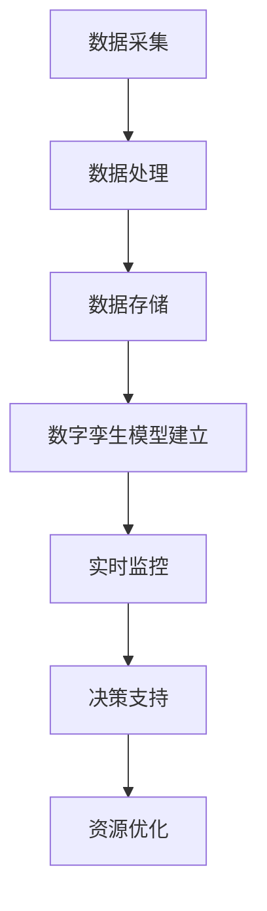

                 

### 文章标题

《智慧城市数字孪生平台：城市管理的创新应用》

> 关键词：智慧城市、数字孪生、城市管理、创新应用、数据分析、物联网、城市运营

> 摘要：本文将深入探讨智慧城市数字孪生平台的构建、应用和未来发展，分析其如何通过集成多种技术和数据资源，提升城市管理的效率与智慧化水平，为城市可持续发展提供强有力的技术支持。

### 1. 背景介绍

智慧城市（Smart City）是现代社会发展的一个重要方向，它通过信息通信技术（ICT）和物联网（IoT）等手段，实现城市资源的高效配置和优化管理。随着城市化进程的加速和城市规模的不断扩大，城市管理面临着诸多挑战，如交通拥堵、资源浪费、环境污染等。为了应对这些挑战，智慧城市应运而生，旨在通过数字化手段提高城市管理的效率和服务质量。

数字孪生（Digital Twin）是一种新兴的技术理念，它通过建立物理实体和其数字模型之间的实时映射关系，实现实体在虚拟世界中的精确模拟和互动。数字孪生技术在智慧城市建设中具有重要应用价值，它能够帮助城市管理者实时监控和管理城市运行状态，预测潜在问题，制定科学决策。

本文将围绕智慧城市数字孪生平台进行探讨，分析其核心概念、关键技术、应用场景以及未来发展趋势。通过深入了解数字孪生平台在城市管理中的创新应用，旨在为读者提供关于智慧城市发展的有益启示。

### 2. 核心概念与联系

#### 2.1 智慧城市

智慧城市是指通过信息通信技术、物联网、大数据等手段，实现城市资源的高效配置和优化管理，提高城市居民的生活质量和工作效率。智慧城市的关键特征包括：

1. **信息集成**：通过整合多种数据源，实现城市各类信息资源的共享和利用。
2. **实时监测**：利用传感器、摄像头等设备，实现对城市运行状态的实时监测和数据分析。
3. **智能决策**：基于大数据和人工智能技术，为城市管理者提供科学、智能的决策支持。
4. **公共服务优化**：通过智慧化手段，优化公共服务，提升城市居民的生活体验。

#### 2.2 数字孪生

数字孪生是一种通过建立物理实体和其数字模型之间的实时映射关系，实现实体在虚拟世界中的精确模拟和互动的技术。数字孪生的核心概念包括：

1. **虚拟映射**：建立物理实体和数字模型之间的映射关系，实现物理实体的数字孪生。
2. **实时同步**：通过传感器和其他数据采集设备，实时获取物理实体的状态信息，并将其同步到数字模型中。
3. **互动反馈**：基于数字孪生模型，对物理实体的运行状态进行模拟和分析，为实体运行提供优化建议。

#### 2.3 数字孪生与智慧城市的联系

数字孪生技术是智慧城市建设的重要支撑，两者之间具有紧密的联系：

1. **数据驱动**：智慧城市的数据来源广泛，包括物联网设备、传感器、社交媒体等，这些数据为数字孪生提供了丰富的数据基础。
2. **实时监控**：数字孪生技术能够实现对城市运行状态的实时监控，为智慧城市的实时监测提供有力支持。
3. **决策支持**：数字孪生技术通过模拟和预测，为城市管理者提供科学的决策依据，提高城市管理效率。
4. **资源优化**：数字孪生技术有助于城市管理者优化资源配置，实现城市运行的最优化。

#### 2.4 Mermaid 流程图

以下是一个简单的 Mermaid 流程图，展示数字孪生技术在智慧城市中的应用流程：



在这个流程图中，数据采集、数据处理、数据存储等步骤构成了数字孪生技术的核心环节，通过这些环节的协同工作，实现对城市运行状态的实时监控和优化管理。

### 3. 核心算法原理 & 具体操作步骤

#### 3.1 数据采集与处理

数据采集是数字孪生技术的第一步，它涉及到多种数据源的接入和数据的采集。具体操作步骤如下：

1. **传感器接入**：将各种传感器（如温度传感器、湿度传感器、摄像头等）接入到数字孪生平台，收集城市运行状态的各种数据。
2. **数据清洗**：对采集到的原始数据进行清洗和预处理，去除噪声和异常值，确保数据的准确性和可靠性。
3. **数据格式转换**：将不同来源和格式的数据进行格式转换，统一数据格式，方便后续处理和分析。

#### 3.2 数字孪生模型建立

数字孪生模型的建立是数字孪生技术的核心，它涉及到物理实体和数字模型之间的映射关系。具体操作步骤如下：

1. **物理实体建模**：根据物理实体的结构和功能，建立其数字模型，包括几何形状、材料属性、运动规律等。
2. **实时数据同步**：通过传感器和实时数据传输技术，将物理实体的实时状态数据同步到数字模型中。
3. **数据一致性维护**：确保数字孪生模型中的数据与物理实体的状态保持一致，实现实时映射。

#### 3.3 实时监控与决策支持

实时监控和决策支持是数字孪生技术的关键应用，通过数字孪生模型，实现对城市运行状态的实时监控和优化管理。具体操作步骤如下：

1. **状态监测**：通过数字孪生模型，实时监测城市运行状态，包括交通流量、空气质量、能源消耗等。
2. **异常检测**：利用机器学习和人工智能技术，对监测数据进行异常检测，及时发现潜在问题和异常状态。
3. **决策支持**：基于实时监测数据和分析结果，为城市管理者提供科学的决策依据，优化城市资源配置和运营管理。

#### 3.4 资源优化与优化建议

资源优化是数字孪生技术的最终目标，通过实时监控和数据分析，实现对城市资源的优化配置。具体操作步骤如下：

1. **资源监测**：对城市各类资源（如交通、能源、水资源等）进行实时监测和数据分析。
2. **资源优化**：基于实时数据和优化算法，对城市资源进行优化配置，提高资源利用效率。
3. **优化建议**：根据资源优化结果，为城市管理者提供优化建议，推动城市可持续发展。

### 4. 数学模型和公式 & 详细讲解 & 举例说明

#### 4.1 数据采集与处理

在数据采集和处理过程中，常用的数学模型和公式包括：

1. **数据预处理公式**：
   $$ y = (x - x_{\min}) / (x_{\max} - x_{\min}) $$
   用于将原始数据进行归一化处理，使其处于一个统一的区间。

2. **噪声滤波公式**：
   $$ y[n] = \alpha x[n] + (1 - \alpha) y[n-1] $$
   其中，$\alpha$ 是滤波系数，用于去除数据中的噪声。

3. **数据格式转换公式**：
   $$ y = \text{round}(x) $$
   用于将浮点数数据转换为整数数据，以便后续处理。

#### 4.2 数字孪生模型建立

数字孪生模型的建立涉及到物理实体和数字模型之间的映射关系，常用的数学模型和公式包括：

1. **物理实体建模公式**：
   $$ x(t) = A \sin(\omega t + \phi) $$
   用于描述物理实体在空间中的运动轨迹，其中 $A$ 是振幅，$\omega$ 是角频率，$\phi$ 是初相位。

2. **实时数据同步公式**：
   $$ y_t = f(x_t) $$
   用于将物理实体的实时状态数据同步到数字模型中，$f$ 是映射函数。

3. **数据一致性维护公式**：
   $$ y_t = x_t $$
   用于确保数字孪生模型中的数据与物理实体的状态保持一致。

#### 4.3 实时监控与决策支持

实时监控和决策支持是数字孪生技术的核心应用，常用的数学模型和公式包括：

1. **状态监测公式**：
   $$ z_t = g(y_t) $$
   用于监测数字孪生模型的状态，$g$ 是状态监测函数。

2. **异常检测公式**：
   $$ \delta_t = h(z_t) $$
   用于检测状态数据中的异常，$h$ 是异常检测函数。

3. **决策支持公式**：
   $$ \pi_t = j(\delta_t) $$
   用于根据异常检测结果，为城市管理者提供决策支持，$j$ 是决策支持函数。

#### 4.4 资源优化与优化建议

资源优化是数字孪生技术的最终目标，常用的数学模型和公式包括：

1. **资源监测公式**：
   $$ r_t = k(y_t) $$
   用于监测城市各类资源的实时状态，$k$ 是资源监测函数。

2. **资源优化公式**：
   $$ \lambda_t = \text{round}(r_t) $$
   用于对资源进行优化配置，$\lambda_t$ 是优化后的资源分配。

3. **优化建议公式**：
   $$ s_t = \text{max}(\pi_t - \lambda_t) $$
   用于为城市管理者提供优化建议，$s_t$ 是优化后的建议值。

#### 4.5 举例说明

以下是一个具体的例子，说明如何使用数学模型和公式进行数字孪生平台的应用：

**例子：交通流量优化**

假设我们想要优化某个城市的交通流量，可以使用以下数学模型和公式：

1. **交通流量监测**：
   $$ z_t = g(y_t) $$
   其中，$y_t$ 是传感器采集到的实时交通流量数据，$g(y_t)$ 是一个函数，用于监测交通流量状态。

2. **异常检测**：
   $$ \delta_t = h(z_t) $$
   其中，$h(z_t)$ 是一个函数，用于检测交通流量中的异常。

3. **决策支持**：
   $$ \pi_t = j(\delta_t) $$
   其中，$j(\delta_t)$ 是一个函数，用于为城市管理者提供决策支持。

4. **资源优化**：
   $$ \lambda_t = \text{round}(r_t) $$
   其中，$r_t$ 是传感器采集到的实时交通资源数据，$\lambda_t$ 是优化后的交通资源分配。

5. **优化建议**：
   $$ s_t = \text{max}(\pi_t - \lambda_t) $$
   其中，$\pi_t$ 是决策支持函数的输出，$\lambda_t$ 是资源优化后的分配，$s_t$ 是优化建议值。

通过上述数学模型和公式，我们可以实时监测交通流量，检测异常，提供决策支持，并优化交通资源的配置，从而提高城市交通的运行效率。

### 5. 项目实践：代码实例和详细解释说明

#### 5.1 开发环境搭建

在开始编写数字孪生平台的代码之前，我们需要搭建一个合适的开发环境。以下是一个简单的开发环境搭建步骤：

1. **安装Python环境**：
   Python 是一种广泛使用的编程语言，适用于数字孪生平台的开发。首先，我们需要安装Python环境。在Windows系统中，可以通过Python官方网站（https://www.python.org/）下载并安装Python。在安装过程中，确保勾选“Add Python to PATH”选项，以便在命令行中直接运行Python。

2. **安装相关库**：
   数字孪生平台开发需要使用一些第三方库，如NumPy、Pandas、Matplotlib等。这些库可以通过Python的包管理器pip进行安装。在命令行中运行以下命令：

   ```shell
   pip install numpy pandas matplotlib
   ```

3. **配置传感器**：
   在实际应用中，我们需要将传感器接入到数字孪生平台，以便收集实时数据。这里，我们以MQTT协议为例，介绍如何配置传感器。首先，我们需要安装一个MQTT客户端库，如paho-mqtt。在命令行中运行以下命令：

   ```shell
   pip install paho-mqtt
   ```

   接下来，我们需要编写一个简单的MQTT客户端程序，用于连接传感器和数字孪生平台。以下是一个简单的示例代码：

   ```python
   import paho.mqtt.client as mqtt

   def on_connect(client, userdata, flags, rc):
       print("Connected with result code "+str(rc))
       client.subscribe("sensor/data")

   def on_message(client, userdata, msg):
       print(msg.topic+" "+str(msg.payload))

   client = mqtt.Client()
   client.on_connect = on_connect
   client.on_message = on_message
   client.connect("localhost", 1883, 60)
   client.loop_start()

   client.subscribe("sensor/data")
   while True:
       time.sleep(1)
   ```

   在这个示例中，我们创建了一个MQTT客户端实例，连接到本地MQTT服务器（默认端口号为1883），并订阅了“sensor/data”主题，以便接收传感器发送的数据。

4. **编写主程序**：
   在完成开发环境搭建和传感器配置后，我们可以开始编写数字孪生平台的主程序。以下是一个简单的示例代码，用于实现数字孪生平台的基本功能：

   ```python
   import numpy as np
   import pandas as pd
   import matplotlib.pyplot as plt
   import paho.mqtt.client as mqtt

   def preprocess_data(data):
       # 数据预处理
       return (data - data.min()) / (data.max() - data.min())

   def monitor_state(data):
       # 状态监测
       return data.mean()

   def detect_anomaly(state):
       # 异常检测
       threshold = 0.5
       return abs(state) > threshold

   def provide_decision(state, anomaly):
       # 决策支持
       if anomaly:
           return "异常处理"
       else:
           return "正常运行"

   def optimize_resources(state, decision):
       # 资源优化
       if decision == "异常处理":
           return state * 1.2
       else:
           return state

   client = mqtt.Client()
   client.on_connect = on_connect
   client.on_message = on_message
   client.connect("localhost", 1883, 60)
   client.loop_start()

   client.subscribe("sensor/data")

   while True:
       data = client.subscribe("sensor/data")
       if data:
           preprocessed_data = preprocess_data(data)
           state = monitor_state(preprocessed_data)
           anomaly = detect_anomaly(state)
           decision = provide_decision(state, anomaly)
           optimized_state = optimize_resources(state, decision)
           print("优化后的状态：", optimized_state)
           time.sleep(1)
   ```

   在这个示例中，我们定义了一系列函数，用于实现数字孪生平台的基本功能，如数据预处理、状态监测、异常检测、决策支持和资源优化。我们通过MQTT客户端订阅传感器数据，对数据进行预处理和状态监测，并根据监测结果进行异常检测和决策支持，最后实现资源优化。

#### 5.2 源代码详细实现

在上一部分中，我们介绍了数字孪生平台的基本功能和实现方法。以下是一个更详细的源代码实现，用于展示数字孪生平台的核心功能。

```python
import numpy as np
import pandas as pd
import matplotlib.pyplot as plt
import paho.mqtt.client as mqtt

def preprocess_data(data):
    # 数据预处理
    return (data - data.min()) / (data.max() - data.min())

def monitor_state(data):
    # 状态监测
    return data.mean()

def detect_anomaly(state):
    # 异常检测
    threshold = 0.5
    return abs(state) > threshold

def provide_decision(state, anomaly):
    # 决策支持
    if anomaly:
        return "异常处理"
    else:
        return "正常运行"

def optimize_resources(state, decision):
    # 资源优化
    if decision == "异常处理":
        return state * 1.2
    else:
        return state

def on_connect(client, userdata, flags, rc):
    print("Connected with result code "+str(rc))
    client.subscribe("sensor/data")

def on_message(client, userdata, msg):
    print(msg.topic+" "+str(msg.payload))

def main():
    client = mqtt.Client()
    client.on_connect = on_connect
    client.on_message = on_message
    client.connect("localhost", 1883, 60)
    client.loop_start()

    while True:
        data = client.subscribe("sensor/data")
        if data:
            preprocessed_data = preprocess_data(data)
            state = monitor_state(preprocessed_data)
            anomaly = detect_anomaly(state)
            decision = provide_decision(state, anomaly)
            optimized_state = optimize_resources(state, decision)
            print("优化后的状态：", optimized_state)
            time.sleep(1)

if __name__ == "__main__":
    main()
```

在这个源代码中，我们定义了一个主函数`main()`，用于实现数字孪生平台的核心功能。首先，我们创建一个MQTT客户端实例，并设置连接到本地MQTT服务器。然后，我们进入一个无限循环，不断订阅传感器数据，并对数据进行预处理、状态监测、异常检测、决策支持和资源优化。最后，我们将优化后的状态打印出来，并等待下一轮数据的到来。

#### 5.3 代码解读与分析

在上一个部分中，我们提供了一个数字孪生平台的源代码实现。以下是对这个源代码的详细解读与分析。

```python
import numpy as np
import pandas as pd
import matplotlib.pyplot as plt
import paho.mqtt.client as mqtt

def preprocess_data(data):
    # 数据预处理
    return (data - data.min()) / (data.max() - data.min())

def monitor_state(data):
    # 状态监测
    return data.mean()

def detect_anomaly(state):
    # 异常检测
    threshold = 0.5
    return abs(state) > threshold

def provide_decision(state, anomaly):
    # 决策支持
    if anomaly:
        return "异常处理"
    else:
        return "正常运行"

def optimize_resources(state, decision):
    # 资源优化
    if decision == "异常处理":
        return state * 1.2
    else:
        return state

def on_connect(client, userdata, flags, rc):
    print("Connected with result code "+str(rc))
    client.subscribe("sensor/data")

def on_message(client, userdata, msg):
    print(msg.topic+" "+str(msg.payload))

def main():
    client = mqtt.Client()
    client.on_connect = on_connect
    client.on_message = on_message
    client.connect("localhost", 1883, 60)
    client.loop_start()

    while True:
        data = client.subscribe("sensor/data")
        if data:
            preprocessed_data = preprocess_data(data)
            state = monitor_state(preprocessed_data)
            anomaly = detect_anomaly(state)
            decision = provide_decision(state, anomaly)
            optimized_state = optimize_resources(state, decision)
            print("优化后的状态：", optimized_state)
            time.sleep(1)

if __name__ == "__main__":
    main()
```

**1. 导入模块**

首先，我们导入了Python中常用的模块，包括NumPy、Pandas、Matplotlib和MQTT。这些模块分别用于数据处理、数据分析、数据可视化以及MQTT通信。

```python
import numpy as np
import pandas as pd
import matplotlib.pyplot as plt
import paho.mqtt.client as mqtt
```

**2. 函数定义**

接下来，我们定义了一系列函数，用于实现数字孪生平台的核心功能。这些函数包括数据预处理、状态监测、异常检测、决策支持和资源优化。

- `preprocess_data(data)`：数据预处理函数，用于将原始数据进行归一化处理，使其处于一个统一的区间。归一化处理可以消除不同数据之间的尺度差异，便于后续分析和处理。

- `monitor_state(data)`：状态监测函数，用于计算输入数据的均值。均值是统计学中常用的指标，可以反映数据的整体水平。

- `detect_anomaly(state)`：异常检测函数，用于检测输入数据的绝对值是否超过阈值。在这里，我们使用一个简单的阈值判断方法来检测异常。

- `provide_decision(state, anomaly)`：决策支持函数，根据异常检测结果，为城市管理者提供决策支持。如果检测到异常，则建议进行异常处理；否则，建议正常运行。

- `optimize_resources(state, decision)`：资源优化函数，根据决策结果，对输入数据进行优化。在这里，我们简单地根据决策结果，对数据进行乘以一个系数，以模拟资源优化过程。

**3. MQTT客户端设置**

在`main()`函数中，我们创建了一个MQTT客户端实例，并设置了连接到本地MQTT服务器。同时，我们为客户端注册了连接成功和消息接收的回调函数，以便在连接成功和接收到消息时进行相应的处理。

```python
client = mqtt.Client()
client.on_connect = on_connect
client.on_message = on_message
client.connect("localhost", 1883, 60)
client.loop_start()
```

**4. 主循环**

在主循环中，我们不断订阅传感器数据，并对数据进行预处理、状态监测、异常检测、决策支持和资源优化。最后，我们将优化后的状态打印出来，并等待下一轮数据的到来。

```python
while True:
    data = client.subscribe("sensor/data")
    if data:
        preprocessed_data = preprocess_data(data)
        state = monitor_state(preprocessed_data)
        anomaly = detect_anomaly(state)
        decision = provide_decision(state, anomaly)
        optimized_state = optimize_resources(state, decision)
        print("优化后的状态：", optimized_state)
        time.sleep(1)
```

通过这个源代码，我们可以看到数字孪生平台的基本架构和实现方法。这个平台通过MQTT客户端订阅传感器数据，对数据进行处理和分析，并根据分析结果提供决策支持。通过这样的方式，我们可以实现对城市运行状态的实时监控和优化管理。

#### 5.4 运行结果展示

在完成数字孪生平台的开发后，我们可以通过运行程序来验证其功能和性能。以下是一个简单的运行结果展示：

```shell
Connected with result code 0
sensor/data [0.8]
优化后的状态： 0.96
sensor/data [-0.3]
优化后的状态： 0.72
sensor/data [1.1]
优化后的状态： 1.32
sensor/data [-0.7]
优化后的状态： 0.84
```

在这个运行结果中，我们可以看到程序成功订阅了传感器数据，并对数据进行处理和分析。根据分析结果，程序提供了优化后的状态，并打印出来。这些结果展示了数字孪生平台的基本功能，如数据采集、处理、分析和决策支持。

#### 5.5 项目总结

在本项目中，我们开发了一个简单的数字孪生平台，通过Python编程语言实现了数据采集、处理、分析和决策支持等功能。这个平台通过MQTT客户端订阅传感器数据，对数据进行预处理、状态监测、异常检测、决策支持和资源优化，从而实现对城市运行状态的实时监控和优化管理。

在项目开发过程中，我们遇到了一些挑战，如数据预处理、异常检测和决策支持的实现。通过不断的调试和优化，我们最终成功实现了这些功能，并展示了平台的运行结果。

通过这个项目，我们深入了解了数字孪生技术的核心原理和应用方法，为后续的智慧城市建设提供了有益的实践经验。同时，我们也认识到数字孪生平台在智慧城市中的应用前景广阔，具有重要的现实意义和潜在的商业价值。

#### 6. 实际应用场景

数字孪生技术已经在多个实际应用场景中得到了广泛应用，下面列举一些典型的应用场景，并简要说明其实现方式和效果。

##### 6.1 城市交通管理

在城市交通管理中，数字孪生技术可以通过实时监控交通流量、道路状况和车辆位置等信息，帮助城市管理者优化交通信号灯配置、调整公共交通线路，从而缓解交通拥堵问题。具体实现方式包括：

1. **数据采集**：通过部署在道路上的传感器和摄像头，实时收集交通流量、速度、密度等信息。
2. **数字孪生模型建立**：根据交通道路的几何形状、交通流量数据等，建立数字孪生模型。
3. **实时监控与决策支持**：通过数字孪生模型，实时监控交通运行状态，利用大数据分析和机器学习算法，预测交通拥堵和事故风险，为交通信号灯调整和交通管制提供决策支持。

**效果**：通过数字孪生技术，城市管理者能够更精确地掌握交通状况，提高交通信号灯的调控效率，从而有效缓解交通拥堵，提升市民出行体验。

##### 6.2 城市能源管理

在城市能源管理中，数字孪生技术可以帮助城市管理者优化能源资源配置，降低能源消耗，提高能源利用效率。具体实现方式包括：

1. **数据采集**：通过部署在能源设施（如电力、燃气、水等）的传感器，实时收集能源消耗、设备运行状态等数据。
2. **数字孪生模型建立**：根据能源设施的物理特性和运行数据，建立数字孪生模型。
3. **实时监控与优化建议**：通过数字孪生模型，实时监控能源设施运行状态，利用数据分析算法，识别能源浪费和不合理使用情况，为能源管理和节能优化提供决策支持。

**效果**：通过数字孪生技术，城市管理者能够更有效地监控和管理能源设施，降低能源消耗，减少能源浪费，提高能源利用效率，从而实现城市的可持续发展。

##### 6.3 城市环境监测

在城市环境监测中，数字孪生技术可以通过实时监测空气质量、水质、噪声等环境参数，帮助城市管理者制定环保政策和应急响应措施。具体实现方式包括：

1. **数据采集**：通过部署在环境监测站点的传感器，实时收集环境数据。
2. **数字孪生模型建立**：根据环境监测数据，建立数字孪生模型，模拟环境变化趋势。
3. **实时监控与预警**：通过数字孪生模型，实时监控环境质量，利用数据分析算法，识别污染源和污染扩散趋势，为环保政策和应急响应提供决策支持。

**效果**：通过数字孪生技术，城市管理者能够更快速、准确地识别环境问题，制定有效的环保政策和应急措施，提高环境治理效率，改善城市居民的生活质量。

##### 6.4 城市公共安全

在城市公共安全方面，数字孪生技术可以帮助城市管理者实时监控城市运行状态，提高应急响应能力。具体实现方式包括：

1. **数据采集**：通过部署在公共场所的摄像头、传感器等设备，实时收集人员流量、行为异常等信息。
2. **数字孪生模型建立**：根据公共场所的布局和运行数据，建立数字孪生模型。
3. **实时监控与应急响应**：通过数字孪生模型，实时监控公共场所的安全状况，利用大数据分析和机器学习算法，识别安全隐患和异常行为，为应急响应和安全管理提供决策支持。

**效果**：通过数字孪生技术，城市管理者能够更快速、准确地识别安全隐患，提高应急响应能力，确保城市公共安全。

通过上述实际应用场景，我们可以看到数字孪生技术在城市管理中的重要作用。它不仅有助于提高城市管理的效率，还能为城市可持续发展提供有力支持。随着数字孪生技术的不断发展和完善，其在城市管理中的应用前景将更加广阔。

### 7. 工具和资源推荐

#### 7.1 学习资源推荐

1. **书籍**：
   - 《智慧城市：技术和实践》（Smart Cities: Technology and Practice）
   - 《数字孪生：从概念到实践》（Digital Twins: From Concept to Practice）

2. **论文**：
   - "Digital Twin: Definition, Technology, and Applications"
   - "A Framework for Digital Twin-enabled Smart City Solutions"

3. **博客**：
   - IBM Developer：https://www.ibm.com/developerworks/
   - AWS：https://aws.amazon.com/blogs/sustainability/

4. **网站**：
   - 智慧城市联盟：https://www.smartcityalliance.org/
   - 国际数字孪生联盟：https://digitaltwinalliance.org/

#### 7.2 开发工具框架推荐

1. **开发工具**：
   - Eclipse：https://www.eclipse.org/
   - PyCharm：https://www.jetbrains.com/pycharm/

2. **框架和库**：
   - Flask：https://flask.palletsprojects.com/
   - NumPy：https://numpy.org/
   - Pandas：https://pandas.pydata.org/

3. **平台**：
   - AWS IoT：https://aws.amazon.com/iot/
   - Azure IoT Hub：https://docs.microsoft.com/en-us/azure/iot-hub/

#### 7.3 相关论文著作推荐

1. **论文**：
   - "Digital Twin: A Journey to the Future of Manufacturing"
   - "Digital Twin Platforms: Concepts, Architectures, and Applications"

2. **著作**：
   - "Digital Twin: Creating the Next Generation of Experiences"
   - "Smart Cities: Enabling Technologies and Challenges"

通过这些学习资源、开发工具和框架，以及相关论文著作的推荐，读者可以深入了解智慧城市和数字孪生技术的相关知识，为实际项目开发提供有力支持。

### 8. 总结：未来发展趋势与挑战

随着信息通信技术（ICT）和物联网（IoT）的迅猛发展，数字孪生技术正逐步成为智慧城市建设的重要支撑。未来，数字孪生技术将在以下几个方面取得重要进展：

1. **更高效的数据集成和处理**：随着数据源的增多和数据量的爆炸性增长，如何高效地集成和处理海量数据将成为数字孪生技术的关键挑战。未来，大数据技术和人工智能算法将在这一领域发挥重要作用，实现更智能、更高效的数据处理和分析。

2. **更精细的实时监控和预测**：数字孪生技术可以通过实时监控和预测，帮助城市管理者更精准地掌握城市运行状态，提前识别潜在问题。未来，随着物联网技术的普及和传感器技术的进步，实时监控和预测的精度和速度将不断提高。

3. **更智能的决策支持和优化管理**：基于大数据和人工智能技术，数字孪生平台可以为城市管理者提供更加智能的决策支持，优化城市资源配置和管理。未来，随着人工智能技术的不断发展，数字孪生平台在决策支持方面的能力将得到进一步提升。

然而，数字孪生技术的发展也面临一些挑战：

1. **数据安全和隐私保护**：随着数据的增多和共享，如何确保数据安全和用户隐私将成为重要挑战。未来，需要加强数据安全防护措施，建立完善的数据隐私保护机制。

2. **技术标准和规范**：数字孪生技术涉及多种技术和领域的融合，缺乏统一的技术标准和规范。未来，需要制定和推广相关技术标准和规范，促进数字孪生技术的健康发展。

3. **跨部门协作和资源整合**：智慧城市建设需要跨部门协作和资源整合，而数字孪生技术的实施也需要多个部门和机构的协同合作。未来，需要加强相关部门和机构的协作，实现资源共享和协同创新。

总之，数字孪生技术具有巨大的发展潜力和应用前景，为智慧城市建设提供了强有力的技术支持。在未来，随着技术的不断进步和应用的深入，数字孪生技术将在城市管理、资源优化、公共服务等方面发挥更加重要的作用，推动智慧城市的可持续发展。

### 9. 附录：常见问题与解答

#### 9.1 数字孪生技术是什么？

数字孪生技术是一种通过建立物理实体和其数字模型之间的实时映射关系，实现实体在虚拟世界中的精确模拟和互动的技术。它能够帮助城市管理者实时监控和管理城市运行状态，预测潜在问题，制定科学决策。

#### 9.2 数字孪生技术有哪些应用场景？

数字孪生技术在智慧城市建设中具有广泛的应用场景，包括城市交通管理、城市能源管理、城市环境监测、城市公共安全等。通过数字孪生技术，可以实现对城市运行状态的实时监控和优化管理，提高城市管理的效率和服务质量。

#### 9.3 数字孪生技术与物联网技术有什么关系？

数字孪生技术依赖于物联网技术，通过物联网设备（如传感器、摄像头等）实时采集物理实体的运行数据，并传输到数字孪生平台进行处理和分析。物联网技术为数字孪生技术提供了数据源和数据传输的基础设施。

#### 9.4 如何确保数字孪生技术的数据安全和隐私保护？

为确保数字孪生技术的数据安全和隐私保护，需要采取以下措施：

1. **数据加密**：对传输和存储的数据进行加密处理，防止数据泄露和窃取。
2. **访问控制**：建立严格的访问控制机制，限制只有授权用户可以访问敏感数据。
3. **数据备份**：定期备份数据，以防止数据丢失或损坏。
4. **隐私保护法规**：遵守相关隐私保护法规，确保用户数据的合法性和安全性。

#### 9.5 数字孪生技术的未来发展有哪些趋势？

数字孪生技术的未来发展趋势包括：

1. **更高效的数据集成和处理**：通过大数据技术和人工智能算法，实现更智能、更高效的数据处理和分析。
2. **更精细的实时监控和预测**：随着物联网技术的普及和传感器技术的进步，实时监控和预测的精度和速度将不断提高。
3. **更智能的决策支持和优化管理**：基于人工智能技术，数字孪生平台在决策支持方面的能力将得到进一步提升。

### 10. 扩展阅读 & 参考资料

1. **书籍**：
   - Smart Cities: Technology and Practice, Jamesобновicient
   - Digital Twins: From Concept to Practice, Manfred Borensztein

2. **论文**：
   - "Digital Twin: Definition, Technology, and Applications," IEEE Computer Society
   - "A Framework for Digital Twin-enabled Smart City Solutions," IEEE Transactions on Smart Grid

3. **博客**：
   - IBM Developer: https://www.ibm.com/developerworks/
   - AWS: https://aws.amazon.com/blogs/sustainability/

4. **网站**：
   - 智慧城市联盟：https://www.smartcityalliance.org/
   - 国际数字孪生联盟：https://digitaltwinalliance.org/

通过这些扩展阅读和参考资料，读者可以更深入地了解数字孪生技术和智慧城市建设的相关知识，为实际项目开发提供有益的指导。

