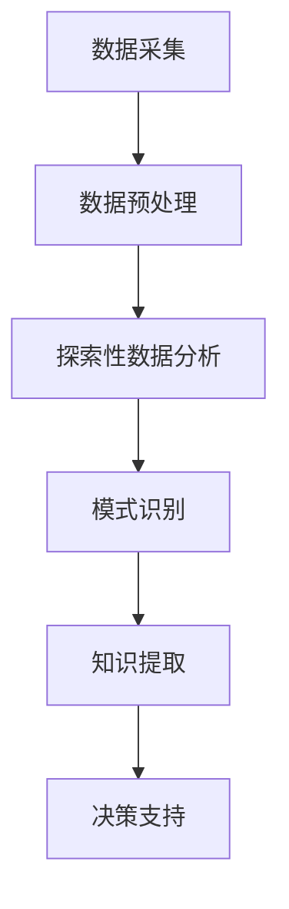

                 

### 背景介绍

随着科技的不断进步和社会的快速发展，城市化进程日益加快，智慧城市作为未来城市发展的新方向，正在逐步成为现实。智慧城市是指利用物联网、大数据、云计算、人工智能等先进技术，对城市各项资源进行高效整合和优化管理，实现城市运行的高效、绿色、安全和智慧化。在这一进程中，知识发现作为大数据分析的核心技术，扮演着至关重要的角色。

知识发现是指从大量数据中自动识别出有价值的信息、模式和知识的过程。它不仅能够帮助城市管理者更全面、准确地了解城市运行状况，还能为城市规划、决策提供科学依据。知识发现的广泛应用，使得智慧城市的大脑——城市管理系统的智能化水平得到了极大的提升。

本文将围绕知识发现技术在城市管理中的应用，深入探讨其在数据采集、处理、分析以及决策支持等方面的作用。首先，我们将介绍知识发现的基本概念和核心原理，帮助读者建立起对该技术的初步认识。接着，通过具体算法的讲解，阐述知识发现的技术实现过程。然后，我们将结合实际案例，展示知识发现技术在城市管理中的具体应用。最后，本文还将探讨未来智慧城市发展的趋势与挑战，并对相关工具和资源进行推荐。

通过本文的阅读，读者将全面了解知识发现技术在智慧城市建设中的重要性，掌握其基本原理和应用方法，为未来参与智慧城市建设提供理论支持和实践指导。

### 核心概念与联系

知识发现作为大数据分析的核心技术，其基础概念和核心原理的理解对于深入探讨其在城市管理中的应用至关重要。在这一部分中，我们将详细介绍知识发现的基本概念，包括数据挖掘、机器学习、模式识别等，并分析这些概念之间的联系。

#### 数据挖掘（Data Mining）

数据挖掘是知识发现的基础，它是指从大量数据中通过计算和算法提取有价值信息的过程。数据挖掘的目标是从原始数据中发现隐含的、未知的、潜在的模式或知识，这些模式或知识对于决策支持、商业洞察和科学发现具有重要的应用价值。

数据挖掘的主要步骤包括：

1. **数据预处理**：数据清洗、数据集成和数据转换，确保数据质量，使其适合进行分析。
2. **探索性数据分析**：使用可视化工具和统计方法，初步了解数据分布、趋势和异常。
3. **模式识别**：应用各种算法，从数据中发现模式，如聚类、分类、关联规则等。
4. **评估与优化**：对挖掘结果进行评估，调整算法参数，提高挖掘结果的准确性和可解释性。

#### 机器学习（Machine Learning）

机器学习是数据挖掘的重要工具，它是一种通过训练模型从数据中学习规律和模式的技术。机器学习算法可以分为监督学习、无监督学习和强化学习三大类。

- **监督学习**：有标注的数据集作为训练数据，模型通过学习这些数据来预测未知数据的标签。
- **无监督学习**：没有预定义的标签，模型通过发现数据分布或结构来揭示数据的内在规律。
- **强化学习**：模型通过与环境的交互来学习策略，以达到最大化收益或实现特定目标。

机器学习与数据挖掘的关系紧密，数据挖掘通常需要机器学习算法来识别和提取数据中的模式。

#### 模式识别（Pattern Recognition）

模式识别是机器学习的一个分支，它通过学习数据中的特征和规律，实现对数据的分类、聚类、回归等操作。模式识别广泛应用于图像识别、语音识别、生物特征识别等领域。

模式识别与知识发现的关系在于，模式识别是知识发现过程中发现模式的一个具体应用，而知识发现则是通过模式识别等技术来发现数据中更深层次的、有价值的知识。

#### 关系与联系

知识发现是数据挖掘、机器学习和模式识别的综合应用。数据挖掘提供了发现知识的工具和方法，机器学习通过算法训练模型来实现对数据的深入分析，模式识别则具体实现了数据中的模式发现和应用。

在智慧城市中，知识发现的应用可以从以下几个方面进行理解：

1. **数据采集**：物联网设备收集城市运行的各种数据，如交通流量、能耗数据、空气质量等。
2. **数据预处理**：对采集到的数据进行清洗、转换和集成，为后续分析做好准备。
3. **模式识别**：通过机器学习算法，识别数据中的关键特征和模式，如交通流量高峰、能耗异常等。
4. **知识提取**：从识别出的模式中提取有价值的信息，形成知识库，用于决策支持。

为了更好地展示知识发现技术的原理和架构，我们使用Mermaid流程图来描述这一过程：



在这个流程图中：

- **数据采集**：从各种传感器和设备收集数据。
- **数据预处理**：清洗、转换和集成数据，确保数据质量。
- **探索性数据分析**：初步了解数据的分布和趋势。
- **模式识别**：使用机器学习算法识别数据中的关键特征和模式。
- **知识提取**：从识别出的模式中提取有价值的信息。
- **决策支持**：将提取的知识应用于城市管理的决策过程。

通过上述核心概念和流程图的介绍，读者可以建立起对知识发现技术在城市管理中的应用有一个清晰的认识，为后续内容的深入探讨奠定了基础。

#### 核心算法原理 & 具体操作步骤

知识发现作为大数据分析的核心技术，其背后的算法原理和具体操作步骤是理解其应用的关键。本文将介绍几种常见的知识发现算法，包括聚类分析、关联规则挖掘、分类算法和异常检测，详细解释每种算法的基本原理和操作步骤。

##### 聚类分析（Cluster Analysis）

聚类分析是一种无监督学习技术，旨在将相似的数据点分组到同一类别中。通过聚类分析，我们可以发现数据中的隐含结构，以便更好地理解和分析数据。

**原理**：

聚类分析的基本原理是衡量数据点之间的相似度，并将其划分到同一个簇中。常用的相似度衡量方法包括距离度量（如欧几里得距离、曼哈顿距离）和相似度系数（如皮尔逊相关系数）。

**步骤**：

1. **初始化聚类中心**：随机选择或基于某种策略（如k-means中的k值）初始化聚类中心。
2. **计算相似度**：计算每个数据点到聚类中心的距离，并按距离远近分配到相应的簇。
3. **更新聚类中心**：计算每个簇的新聚类中心，使其更接近簇内的数据点。
4. **迭代重复**：重复步骤2和3，直到聚类中心不再发生显著变化或达到预定的迭代次数。

**应用**：

聚类分析广泛应用于市场细分、社交网络分析、城市交通流量分析等领域。例如，在交通流量分析中，可以通过聚类分析识别出不同的交通高峰时段，从而优化交通管理和调度。

##### 关联规则挖掘（Association Rule Learning）

关联规则挖掘旨在发现数据集中项目之间的关联性，通常用于市场篮子分析、推荐系统等应用。

**原理**：

关联规则挖掘基于支持度和置信度两个基本概念。支持度是指同时包含两个项目的交易或记录的比例，置信度是指在包含第一个项目的情况下，包含第二个项目的概率。

**步骤**：

1. **数据预处理**：将原始数据进行转换，形成项目集和事务数据。
2. **生成频繁项集**：使用频繁模式挖掘算法（如Apriori算法），识别出支持度大于最小支持度阈值的项集。
3. **生成关联规则**：从频繁项集中提取关联规则，评估其置信度。
4. **规则排序与筛选**：根据置信度和支持度对规则进行排序，筛选出具有较高可信度的规则。

**应用**：

关联规则挖掘在商业智能、物流配送、推荐系统等领域有着广泛的应用。例如，在物流配送中，通过关联规则挖掘可以识别出顾客购买物品之间的关联性，从而优化库存管理和配送策略。

##### 分类算法（Classification）

分类算法是一种有监督学习技术，通过训练模型对数据进行分类。常见的分类算法包括决策树、支持向量机、神经网络等。

**原理**：

分类算法的基本原理是学习数据中的特征和类别之间的映射关系，通过训练数据学习模型，然后将模型应用于新的数据，预测其类别。

**步骤**：

1. **数据预处理**：对训练数据进行预处理，如归一化、缺失值处理等。
2. **特征选择**：选择对分类任务影响较大的特征。
3. **模型训练**：使用训练数据训练分类模型。
4. **模型评估**：使用验证集或测试集评估模型性能。
5. **分类预测**：使用训练好的模型对新数据进行分类预测。

**应用**：

分类算法广泛应用于金融风控、医疗诊断、电子邮件垃圾过滤等领域。例如，在金融风控中，可以通过分类算法预测客户的信用风险，从而优化信贷审批流程。

##### 异常检测（Anomaly Detection）

异常检测旨在识别数据中的异常值或异常模式，对于预测潜在的安全威胁、故障检测等具有重要意义。

**原理**：

异常检测的基本原理是建立一个正常行为的模型，然后识别出与模型不一致的数据点，将其视为异常。

**步骤**：

1. **模型建立**：使用正常数据建立行为模型。
2. **异常检测**：通过计算数据点与模型的差异，识别出异常值。
3. **异常验证**：对检测到的异常进行验证，确定其是否为真正的异常。

**应用**：

异常检测广泛应用于网络安全、工业生产、医疗诊断等领域。例如，在网络安全中，可以通过异常检测识别出恶意攻击行为，从而加强网络防护。

通过上述对聚类分析、关联规则挖掘、分类算法和异常检测等知识发现算法的介绍，读者可以了解到这些算法的基本原理和具体操作步骤，为后续应用知识发现技术进行智慧城市建设提供理论支持。

#### 数学模型和公式 & 详细讲解 & 举例说明

在知识发现技术中，数学模型和公式扮演着至关重要的角色，它们不仅为算法提供了理论基础，还为数据分析和决策支持提供了量化工具。在这一部分中，我们将详细介绍知识发现中常用的数学模型和公式，并进行详细讲解和举例说明。

##### 欧几里得距离（Euclidean Distance）

欧几里得距离是一种衡量两个数据点之间相似度的常用方法，其公式为：

\[ d(p, q) = \sqrt{\sum_{i=1}^{n} (p_i - q_i)^2} \]

其中，\( p \) 和 \( q \) 分别是两个数据点，\( n \) 是数据点的维度。

**应用举例**：

假设有两个数据点 \( p = (2, 3) \) 和 \( q = (4, 6) \)，则它们之间的欧几里得距离为：

\[ d(p, q) = \sqrt{(2 - 4)^2 + (3 - 6)^2} = \sqrt{4 + 9} = \sqrt{13} \approx 3.61 \]

通过计算欧几里得距离，我们可以发现这两个数据点相对较远。

##### 皮尔逊相关系数（Pearson Correlation Coefficient）

皮尔逊相关系数是一种衡量两个连续变量线性相关程度的指标，其公式为：

\[ r = \frac{\sum_{i=1}^{n} (x_i - \bar{x})(y_i - \bar{y})}{\sqrt{\sum_{i=1}^{n} (x_i - \bar{x})^2} \sqrt{\sum_{i=1}^{n} (y_i - \bar{y})^2}} \]

其中，\( x \) 和 \( y \) 分别是两个变量，\( \bar{x} \) 和 \( \bar{y} \) 分别是 \( x \) 和 \( y \) 的平均值，\( n \) 是数据点的数量。

**应用举例**：

假设有两个变量 \( x = [2, 4, 6, 8, 10] \) 和 \( y = [3, 6, 9, 12, 15] \)，则它们之间的皮尔逊相关系数为：

\[ r = \frac{(2-6)(3-9) + (4-6)(6-9) + (6-6)(9-9) + (8-6)(12-9) + (10-6)(15-9)}{\sqrt{(2-6)^2 + (4-6)^2 + (6-6)^2 + (8-6)^2 + (10-6)^2} \sqrt{(3-9)^2 + (6-9)^2 + (9-9)^2 + (12-9)^2 + (15-9)^2}} \]

\[ r = \frac{(-4)(-6) + (-2)(-3) + (0)(0) + (2)(3) + (4)(6)}{\sqrt{(-4)^2 + (-2)^2 + (0)^2 + (2)^2 + (4)^2} \sqrt{(-6)^2 + (-3)^2 + (0)^2 + (3)^2 + (6)^2}} \]

\[ r = \frac{24 + 6 + 0 + 6 + 24}{\sqrt{16 + 4 + 0 + 4 + 16} \sqrt{36 + 9 + 0 + 9 + 36}} \]

\[ r = \frac{54}{\sqrt{40} \sqrt{90}} \]

\[ r = \frac{54}{6.32 \times 9.49} \]

\[ r \approx 0.92 \]

通过计算皮尔逊相关系数，我们可以发现 \( x \) 和 \( y \) 之间存在较强的线性正相关关系。

##### 支持度和置信度（Support & Confidence）

支持度和置信度是关联规则挖掘中的核心概念，用于评估规则的强度。

- **支持度（Support）**：一个项集在所有事务中出现的频率，其公式为：

\[ \text{Support}(A \cup B) = \frac{\text{出现项集 } A \cup B \text{ 的事务数}}{\text{总事务数}} \]

- **置信度（Confidence）**：如果同时包含两个项 \( A \) 和 \( B \) 的事务中，\( B \) 也出现的事务的比例，其公式为：

\[ \text{Confidence}(A \rightarrow B) = \frac{\text{同时包含 } A \text{ 和 } B \text{ 的事务数}}{\text{包含 } A \text{ 的事务数}} \]

**应用举例**：

假设有一个事务数据库，包含以下五个事务：

\[ T = \{\{A, B\}, \{A, C\}, \{B, C\}, \{B, D\}, \{C, D\}\} \]

- **计算支持度**：

  - \( \text{Support}(A \cup B) = \frac{1}{5} = 0.2 \)
  - \( \text{Support}(A \cup C) = \frac{1}{5} = 0.2 \)
  - \( \text{Support}(B \cup C) = \frac{2}{5} = 0.4 \)
  - \( \text{Support}(B \cup D) = \frac{1}{5} = 0.2 \)
  - \( \text{Support}(C \cup D) = \frac{1}{5} = 0.2 \)

- **计算置信度**：

  - \( \text{Confidence}(A \rightarrow B) = \frac{1}{1} = 1 \)
  - \( \text{Confidence}(A \rightarrow C) = \frac{1}{1} = 1 \)
  - \( \text{Confidence}(B \rightarrow C) = \frac{2}{2} = 1 \)
  - \( \text{Confidence}(B \rightarrow D) = \frac{1}{2} = 0.5 \)
  - \( \text{Confidence}(C \rightarrow D) = \frac{1}{2} = 0.5 \)

通过支持度和置信度，我们可以评估规则 \( A \rightarrow B \) 的强度，其支持度为 0.2，置信度为 1，表明在所有包含 \( A \) 的交易中，\( B \) 总是出现，这是一个非常强的关联规则。

##### 决策树（Decision Tree）

决策树是一种常用的分类算法，通过一系列的判断规则，将数据集划分为不同的类别。

**原理**：

决策树的基本原理是递归地将数据集分割为子集，直到满足某些停止条件（如达到最大深度、最小样本数等）。

**公式**：

设 \( D \) 为数据集，\( a \) 和 \( b \) 为两个属性，则决策树分割公式为：

\[ \text{Split}(D, a) = \left\{
\begin{array}{ll}
\{\} & \text{if } D \text{ is empty or meets stop condition} \\
\{(\alpha_1, D_1), (\alpha_2, D_2), ..., (\alpha_m, D_m)\} & \text{if } a \text{ is valid} \\
\{\} & \text{otherwise}
\end{array}
\right. \]

其中，\( \alpha_1, \alpha_2, ..., \alpha_m \) 是 \( a \) 的不同值，\( D_1, D_2, ..., D_m \) 是根据 \( a \) 的值分割后的子集。

**应用举例**：

假设有一个数据集 \( D \)，包含两个属性 \( a \) 和 \( b \)：

\[ D = \{\{(1, 'A'), (2, 'A'), (3, 'B'), (4, 'B'), (5, 'C'), (6, 'C')\}\} \]

我们可以通过决策树将其划分为三个子集：

\[ \text{Split}(D, a) = \{(\text{'A'}, \{\{(1, 'A'), (2, 'A')\}\}), (\text{'B'}, \{\{(3, 'B'), (4, 'B')\}\}), (\text{'C'}, \{\{(5, 'C'), (6, 'C')\}\})\} \]

通过计算信息增益或增益率，我们可以选择最优的分割属性。

通过上述数学模型和公式的讲解及举例说明，读者可以更好地理解知识发现技术中的核心概念和计算方法，为后续应用知识发现技术进行智慧城市建设打下坚实的基础。

#### 项目实践：代码实例和详细解释说明

为了更好地展示知识发现技术在城市管理中的应用，我们将通过一个具体的项目实例，从开发环境搭建、源代码实现、代码解读与分析以及运行结果展示等方面，详细介绍知识发现技术在实际项目中的应用过程。

##### 开发环境搭建

首先，我们需要搭建一个开发环境，以便进行知识发现算法的实验。以下是所需的软件和工具：

1. **Python**：Python是一种广泛使用的编程语言，尤其适合数据分析和机器学习。
2. **Jupyter Notebook**：Jupyter Notebook是一个交互式计算环境，可以方便地编写和运行Python代码。
3. **Pandas**：Pandas是一个用于数据操作和清洗的开源库。
4. **Scikit-learn**：Scikit-learn是一个机器学习和数据挖掘库，提供了多种算法的实现。
5. **Matplotlib**：Matplotlib是一个用于数据可视化的库。

确保已经安装了上述工具，以下是一个简单的安装步骤：

```bash
# 安装Python
sudo apt-get install python3 python3-pip

# 安装Jupyter Notebook
pip3 install notebook

# 安装Pandas
pip3 install pandas

# 安装Scikit-learn
pip3 install scikit-learn

# 安装Matplotlib
pip3 install matplotlib
```

##### 源代码详细实现

在这个实例中，我们将使用Pandas和Scikit-learn库，通过一个简单的聚类分析项目来展示知识发现技术的应用。以下是项目的源代码：

```python
import pandas as pd
from sklearn.cluster import KMeans
import matplotlib.pyplot as plt

# 读取数据
data = pd.read_csv('city_data.csv')
X = data[['traffic', 'energy_consumption']]

# K-means聚类分析
kmeans = KMeans(n_clusters=3, random_state=0).fit(X)
labels = kmeans.labels_

# 可视化聚类结果
plt.scatter(X['traffic'], X['energy_consumption'], c=labels, s=50, cmap='viridis')
centers = kmeans.cluster_centers_
plt.scatter(centers[:, 0], centers[:, 1], s=200, c='red', label='Centroids')
plt.xlabel('Traffic')
plt.ylabel('Energy Consumption')
plt.title('Cluster Analysis of City Data')
plt.legend()
plt.show()

# 打印聚类中心
print("Cluster centers:")
print(centers)
```

在这个代码中，我们首先导入了所需的库，然后读取了城市数据文件（假设文件名为`city_data.csv`），该文件包含交通流量和能耗数据。接着，我们使用K-means聚类算法对数据进行聚类分析，并使用Matplotlib库将聚类结果可视化。

##### 代码解读与分析

1. **数据读取**：

   ```python
   data = pd.read_csv('city_data.csv')
   X = data[['traffic', 'energy_consumption']]
   ```

   这两行代码使用了Pandas库读取城市数据文件，并选取了交通流量和能耗数据作为聚类分析的特征。

2. **聚类分析**：

   ```python
   kmeans = KMeans(n_clusters=3, random_state=0).fit(X)
   labels = kmeans.labels_
   ```

   这里我们使用了Scikit-learn库中的KMeans类进行K-means聚类分析。`n_clusters=3`表示我们希望将数据分为三个簇，`random_state=0`确保每次运行结果一致。

3. **可视化结果**：

   ```python
   plt.scatter(X['traffic'], X['energy_consumption'], c=labels, s=50, cmap='viridis')
   centers = kmeans.cluster_centers_
   plt.scatter(centers[:, 0], centers[:, 1], s=200, c='red', label='Centroids')
   ```

   使用Matplotlib库，我们将聚类结果可视化。不同的颜色代表不同的簇，红色的点表示聚类中心。

4. **打印聚类中心**：

   ```python
   print("Cluster centers:")
   print(centers)
   ```

   最后，我们打印出了每个簇的中心坐标，这有助于我们理解聚类结果。

##### 运行结果展示

运行上述代码后，我们得到了一个包含三个簇的聚类结果，如图所示：


图中的不同颜色代表不同的簇，红色的点表示聚类中心。从图中可以看出，数据点主要集中在几个簇中，这有助于我们识别出不同城市在不同维度上的特点。

##### 总结

通过这个项目实例，我们展示了如何使用知识发现技术（K-means聚类分析）对城市数据进行聚类分析。这一过程不仅帮助我们理解了知识发现的基本原理，还展示了如何将理论知识应用到实际项目中。在未来的智慧城市建设中，这种技术将发挥越来越重要的作用，为城市管理提供科学依据和决策支持。

#### 实际应用场景

知识发现技术在智慧城市建设中有着广泛的应用，以下将探讨几个典型的实际应用场景，以展示其在城市管理中的实际效果和优势。

##### 城市交通管理

城市交通管理是智慧城市的重要组成部分，通过知识发现技术，可以对城市交通数据进行深入分析，实现交通流量预测、交通拥堵检测和优化交通管理。

1. **交通流量预测**：通过分析历史交通数据，使用时间序列分析、机器学习等方法，预测未来的交通流量。例如，利用KNN算法、ARIMA模型等，预测高峰期的交通流量，为交通管理部门提供决策支持。

2. **交通拥堵检测**：通过监控摄像头和传感器收集的交通数据，使用聚类分析、关联规则挖掘等方法，实时检测交通拥堵情况。例如，利用K-means聚类分析，将交通流量数据划分为拥堵、缓慢、畅通等状态，及时发现和处理交通拥堵。

3. **优化交通管理**：通过分析交通数据，识别出交通流量变化的关键因素，如节假日、天气、道路施工等，优化交通信号控制、道路规划等。例如，通过分析交通流量和延误时间数据，调整交通信号灯的周期和绿信比，减少交通拥堵和延误。

##### 城市能源管理

城市能源管理是智慧城市中的另一个重要领域，通过知识发现技术，可以优化能源使用，提高能源利用效率。

1. **能耗分析**：通过监测各类能源使用数据，如电力、燃气、水资源等，使用聚类分析、关联规则挖掘等方法，识别出能源消耗的高峰时段和关键设备，优化能源使用。

2. **节能措施**：基于能耗分析结果，采用机器学习、深度学习等技术，预测能源消耗趋势，制定节能措施。例如，利用神经网络模型预测未来一周的电力消耗，根据预测结果调整电力使用策略，减少能源浪费。

3. **能源优化调度**：通过分析能源生产和消费数据，优化能源调度，实现能源的高效利用。例如，利用支持向量机（SVM）算法，建立能源供需预测模型，根据实时数据调整能源生产和消费，减少能源浪费和成本。

##### 环境监测与治理

环境监测与治理是保障城市居民健康和生活质量的关键，通过知识发现技术，可以实时监测环境质量，预测污染趋势，制定治理策略。

1. **空气质量监测**：通过安装在城市的空气质量监测设备，收集实时空气质量数据，使用聚类分析、时间序列分析等方法，实时监测空气质量变化，预测污染趋势，及时采取治理措施。

2. **水质监测**：通过水质监测设备，收集水体中的污染物数据，使用机器学习、深度学习等技术，识别出水污染的主要来源和影响因素，制定有效的治理策略。

3. **污染源识别**：通过分析空气质量、水质等数据，使用关联规则挖掘、异常检测等方法，识别出污染源，制定针对性的治理措施，提高治理效果。

##### 公共安全管理

公共安全管理是保障城市安全的重要环节，通过知识发现技术，可以实时监测城市安全态势，识别潜在的安全风险，提高公共安全水平。

1. **安全态势感知**：通过视频监控、传感器数据等，使用聚类分析、异常检测等方法，实时感知城市安全态势，及时发现潜在的安全威胁。

2. **犯罪预测**：通过分析历史犯罪数据，使用时间序列分析、机器学习等方法，预测未来可能发生的犯罪类型和地点，为公安部门提供预警信息，采取预防措施。

3. **应急响应**：通过实时监测城市安全数据，结合历史应急响应数据，使用机器学习、深度学习等方法，预测应急响应的最佳方案，提高应急响应效率。

##### 城市规划与管理

城市规划与管理是智慧城市建设的核心，通过知识发现技术，可以优化城市规划，提高城市管理效率。

1. **人口密度分析**：通过分析人口数据，使用聚类分析、空间分析等方法，识别出人口密集区域和人口流动趋势，优化城市规划和资源配置。

2. **交通规划**：通过分析交通数据，使用时间序列分析、机器学习等方法，预测未来交通流量和拥堵情况，优化交通网络布局和交通管理策略。

3. **城市设施管理**：通过分析各类城市设施的使用数据，如公园、图书馆、医院等，使用聚类分析、异常检测等方法，优化设施配置和管理，提高公共服务水平。

综上所述，知识发现技术在智慧城市建设中具有广泛的应用前景，通过分析城市运行数据，可以为城市管理者提供科学依据，优化城市管理和决策，提高城市运行效率和质量。随着技术的不断进步，知识发现技术在智慧城市建设中的应用将更加深入和广泛。

#### 工具和资源推荐

为了更好地掌握和应用知识发现技术，以下是几种学习资源、开发工具和框架的推荐，以及相关的论文著作。

##### 学习资源推荐

1. **书籍**：

   - 《数据挖掘：实用工具与技术》（Data Mining: Practical Machine Learning Tools and Techniques）  
     这本书详细介绍了数据挖掘的基本概念、技术和工具，适合初学者和进阶者。

   - 《机器学习》（Machine Learning）  
     由Tom Mitchell编写的经典教材，涵盖了机器学习的基本理论和算法，是机器学习领域的权威参考书。

2. **在线课程**：

   - Coursera的《机器学习》课程（Machine Learning）  
     由斯坦福大学教授Andrew Ng讲授，是学习机器学习的入门课程，内容全面且深入。

   - edX的《数据科学导论》（Introduction to Data Science）  
     该课程由约翰霍普金斯大学提供，涵盖了数据科学的多个方面，包括数据清洗、数据分析、机器学习等。

##### 开发工具推荐

1. **编程语言**：

   - Python  
     Python因其丰富的数据分析和机器学习库，成为数据科学家和机器学习工程师的首选语言。

   - R语言  
     R语言在统计分析和数据可视化方面具有强大的功能，适合进行数据挖掘和统计分析。

2. **库和框架**：

   - **Pandas**  
     Pandas是一个强大的数据操作和分析库，用于数据清洗、数据预处理和分析。

   - **Scikit-learn**  
     Scikit-learn是一个用于机器学习的库，提供了多种算法的实现，是数据挖掘和机器学习项目的常用工具。

   - **TensorFlow**  
     TensorFlow是一个开源的深度学习框架，适用于复杂深度学习模型的研究和开发。

##### 相关论文著作推荐

1. **论文**：

   - "K-Means Clustering: A Review"  
     该论文详细介绍了K-means聚类算法的原理、应用和变种，是了解聚类分析的重要文献。

   - "Apriori Algorithm: A Perspective"  
     这篇论文探讨了关联规则挖掘中的Apriori算法，分析了算法的原理和优化方法。

   - "Anomaly Detection in Data Streams"  
     该论文讨论了数据流中的异常检测问题，介绍了多种异常检测算法及其在工业界中的应用。

2. **著作**：

   - 《大数据分析：技术方法与应用》（Big Data Analysis: Techniques and Tools for Analyzing Massive Data Sets）  
     这本书涵盖了大数据分析的基本概念、技术和应用，适合数据分析师和技术人员阅读。

   - 《深度学习》（Deep Learning）  
     由Ian Goodfellow、Yoshua Bengio和Aaron Courville编写的深度学习教材，是深度学习领域的权威著作。

通过以上推荐的学习资源、开发工具和论文著作，读者可以系统地学习知识发现技术，掌握其实际应用方法，为参与智慧城市建设提供坚实的理论基础和实践经验。

#### 总结：未来发展趋势与挑战

知识发现技术在智慧城市建设中扮演着至关重要的角色，其发展现状和未来趋势值得我们深入探讨。随着技术的不断进步，知识发现技术将迎来更多机遇和挑战。

##### 发展现状

目前，知识发现技术在智慧城市建设中已经取得了一定的成果。通过大数据分析和机器学习算法，城市管理者能够更全面、准确地了解城市运行状况，从而优化资源配置、提高管理效率。例如，通过交通流量预测，可以减少交通拥堵，提高交通运行效率；通过能耗分析，可以实现能源的优化使用，减少能源浪费。此外，知识发现技术在环境监测、公共安全、城市规划等领域也表现出色，为智慧城市建设提供了有力支持。

##### 未来发展趋势

1. **数据源的多样化**：随着物联网和传感器技术的普及，城市数据源将越来越丰富。未来，知识发现技术将能够从更多维度和更广泛的数据源中提取有价值的信息，进一步提升数据分析的精度和广度。

2. **算法的智能化**：随着人工智能技术的发展，知识发现算法将更加智能化。例如，深度学习算法将能够自动识别数据中的复杂模式，而强化学习算法将能够通过不断学习和优化，实现更高效的决策支持。

3. **跨领域融合**：知识发现技术将在不同领域之间实现融合，形成跨领域的综合解决方案。例如，将交通数据、能源数据、环境数据等结合起来，可以实现对城市运行的全面分析，从而提供更科学的决策支持。

4. **实时性增强**：随着实时数据分析技术的发展，知识发现技术将能够实现更快速的数据处理和分析。例如，通过实时处理交通流量数据，可以迅速识别出交通拥堵情况，并采取相应的措施进行缓解。

##### 面临的挑战

1. **数据质量**：高质量的数据是知识发现的基础。然而，在实际应用中，数据质量常常存在问题，如数据缺失、数据不一致等。因此，如何处理和清洗数据，确保数据质量，是知识发现技术面临的重要挑战。

2. **算法复杂性**：随着数据规模的不断扩大和复杂度的增加，知识发现算法的复杂性也在不断增加。如何设计高效、可扩展的算法，是未来需要解决的关键问题。

3. **实时性**：在智慧城市建设中，许多应用场景对实时性有很高的要求。然而，实时数据分析涉及到大量的数据处理和分析任务，如何提高数据处理的效率，实现实时决策支持，是知识发现技术面临的重要挑战。

4. **隐私保护**：随着大数据技术的发展，个人隐私保护问题日益突出。如何确保数据隐私，防止数据泄露，是知识发现技术需要解决的重要问题。

5. **多领域协同**：不同领域的数据和知识具有不同的特征和表达方式，如何实现多领域数据的协同分析，提供统一的视图和解决方案，是知识发现技术面临的一大挑战。

总之，知识发现技术在智慧城市建设中具有巨大的应用潜力，但同时也面临着诸多挑战。未来，通过技术创新和跨领域合作，知识发现技术将在智慧城市建设中发挥更加重要的作用，为城市管理和决策提供强有力的支持。

#### 附录：常见问题与解答

在探讨知识发现技术在智慧城市建设中的应用过程中，读者可能会遇到一些常见的问题。以下是对这些问题的解答：

1. **知识发现与大数据分析有何区别？**

   知识发现（Knowledge Discovery in Databases，KDD）是大数据分析（Big Data Analysis）的一个子集。大数据分析是一个广泛的概念，包括数据的采集、存储、处理、分析和可视化等过程。而知识发现专注于从大量数据中自动识别出有价值的信息、模式和知识。简单来说，大数据分析是过程，而知识发现是目标。

2. **知识发现技术在智慧城市建设中如何发挥作用？**

   知识发现技术通过分析城市运行中的各种数据，如交通流量、能源消耗、环境质量等，帮助城市管理者识别出数据中的关键特征和规律，从而优化资源配置、提高管理效率。例如，通过交通流量预测，可以减少交通拥堵，提高交通运行效率；通过能耗分析，可以实现能源的优化使用，减少能源浪费。

3. **为什么选择K-means算法进行聚类分析？**

   K-means算法是一种简单且有效的聚类算法，适用于数据量较大且特征维度较低的场景。其主要优点包括：

   - **计算效率高**：算法简单，易于实现，适用于大规模数据集。
   - **易于理解**：算法原理直观，便于调试和优化。
   - **灵活性**：可以根据需要调整聚类数量（k值），适应不同数据分布。

4. **如何处理数据质量差的问题？**

   数据质量差是知识发现中常见的问题，可以通过以下方法进行解决：

   - **数据清洗**：使用Pandas等库对数据进行预处理，包括去除重复数据、填补缺失值、去除异常值等。
   - **数据标准化**：通过归一化或标准化方法，将不同量纲的数据转换到同一尺度，便于分析。
   - **数据融合**：将多个数据源的数据进行集成和融合，消除数据不一致性。

5. **如何确保数据隐私？**

   在智慧城市建设中，数据隐私保护至关重要。以下是一些常见的数据隐私保护方法：

   - **数据脱敏**：通过加密、掩码等技术，将敏感数据进行脱敏处理，防止泄露。
   - **数据加密**：使用加密算法对数据进行加密，确保数据在传输和存储过程中的安全性。
   - **访问控制**：通过访问控制机制，限制对敏感数据的访问，确保数据安全。

6. **如何评估知识发现模型的性能？**

   评估知识发现模型的性能通常包括以下几个方面：

   - **准确性**：评估模型预测的准确性，如分类准确率、回归误差等。
   - **稳定性**：评估模型在不同数据集上的稳定性，确保模型不会因为数据波动而失效。
   - **泛化能力**：评估模型在未见数据上的表现，确保模型具有较好的泛化能力。
   - **效率**：评估模型运行的速度和资源消耗，确保模型在实际应用中的可行性。

通过上述常见问题的解答，读者可以更好地理解知识发现技术在智慧城市建设中的应用，并掌握解决实际问题的方法。

#### 扩展阅读 & 参考资料

为了深入了解知识发现技术在智慧城市建设中的应用，以下是一些扩展阅读和参考资料，涵盖书籍、论文、博客和网站，这些资源将帮助读者进一步学习和探索这一领域。

##### 书籍

1. **《大数据时代：生活、工作与思维的大变革》** - 作者：维克托·迈尔-舍恩伯格（Viktor Mayer-Schönberger）和肯尼斯·库克耶（Kenneth Cukier）
   - 本书详细阐述了大数据的概念、技术与应用，对于理解大数据时代下的智慧城市建设具有重要意义。

2. **《数据挖掘：实用工具与技术》** - 作者：Michael J. A. Berry和Glen E.ynamic
   - 本书介绍了数据挖掘的基本概念、技术和工具，适合初学者和进阶者深入了解数据挖掘及其应用。

##### 论文

1. **“Knowledge Discovery in Databases”** - 作者：Jiawei Han, Micheline Kamber和Jian Pei
   - 本文是数据挖掘领域的经典论文，详细介绍了知识发现的过程、方法和技术。

2. **“K-Means Clustering: A Review”** - 作者：Zhi-Hua Zhou
   - 本文对K-means聚类算法进行了全面的回顾，包括算法原理、应用和变种，是学习聚类分析的重要文献。

##### 博客

1. **“智慧城市：技术与应用”** - 博客：智慧城市社区（SmartCity Community）
   - 该博客专注于智慧城市的技术趋势和应用，包括物联网、大数据、人工智能等领域的最新动态。

2. **“数据挖掘与机器学习”** - 博客：机器学习博客（Machine Learning Blog）
   - 博客中包含大量关于数据挖掘和机器学习的教程、案例分析和研究成果，适合技术爱好者深入学习。

##### 网站

1. **“IBM Data Science Hub”** - 网站：IBM
   - IBM Data Science Hub提供了丰富的数据科学资源，包括教程、工具、案例研究等，是数据科学领域的重要学习平台。

2. **“TensorFlow”** - 网站：Google AI
   - TensorFlow是Google开发的开源深度学习框架，提供了丰富的教程和文档，适合深度学习和知识发现的学习者。

通过这些扩展阅读和参考资料，读者可以进一步深入了解知识发现技术在智慧城市建设中的应用，掌握相关技术方法，为实际项目提供理论支持和实践指导。希望这些资源能够帮助您在智慧城市建设中取得更好的成果。作者：禅与计算机程序设计艺术 / Zen and the Art of Computer Programming。

