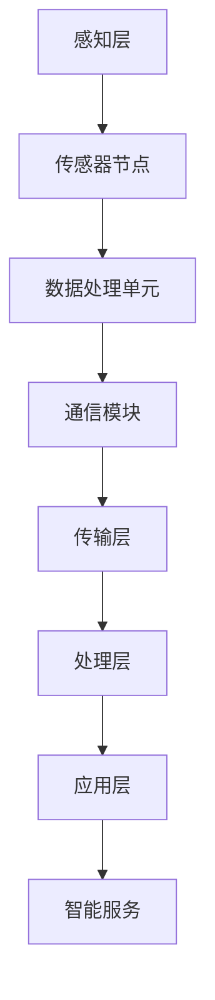

                 

### 背景介绍

智能传感器网络（Intelligent Sensor Networks，ISN）是物联网（Internet of Things，IoT）技术的重要组成部分，它为现代数据采集和监测提供了强大的基础设施。随着物联网的快速发展，智能传感器网络在全球范围内的应用越来越广泛，从智能家居、工业自动化到智能交通、环境监测等众多领域，无不体现出其重要性。

#### 智能传感器网络的发展历程

智能传感器网络的发展可以追溯到20世纪80年代，当时研究人员开始探讨将传感器技术应用于分布式数据采集系统中。早期的传感器网络主要依赖于物理传感器和简单的通信协议，数据采集和处理能力有限。随着计算机技术和通信技术的不断进步，智能传感器网络逐渐成为可能。

进入21世纪，物联网概念的提出为智能传感器网络的发展提供了新的机遇。物联网强调万物互联，使得智能传感器网络能够在更广泛的应用场景中发挥作用。例如，在智能交通系统中，传感器网络可以实时监测交通流量，优化交通信号控制，减少交通拥堵；在智能农业中，传感器网络可以监测土壤湿度、温度、光照等参数，帮助农民实现精准农业。

#### 当前应用状况

目前，智能传感器网络已经在各个行业中得到广泛应用。例如：

1. **智能家居**：智能传感器网络可以实现家庭自动化，如智能照明、温度控制、安全监控等。
2. **工业自动化**：在制造业中，传感器网络可以实时监测设备状态、生产过程，提高生产效率。
3. **智能交通**：传感器网络可以实时监控交通状况，优化交通流量，减少交通事故。
4. **环境监测**：智能传感器网络可以监测空气质量、水质、噪声等环境参数，提供环境预警。
5. **医疗健康**：传感器网络可以监测病人的生理参数，实现远程医疗和健康监控。

#### 研究现状与趋势

随着物联网技术的发展，智能传感器网络的研究也在不断深入。目前，研究主要集中在以下几个方面：

1. **传感器融合与数据处理**：如何有效地融合多种传感器数据，提高数据处理效率和准确性，是当前研究的热点。
2. **自组织网络与协同计算**：如何实现传感器网络的自组织，以及传感器节点之间的协同计算，是提高传感器网络性能的关键。
3. **能效优化**：如何延长传感器节点的寿命，实现能量效率优化，是智能传感器网络需要解决的重要问题。
4. **安全性**：如何保障传感器网络的数据安全和通信安全，是当前研究的另一重要方向。

总之，智能传感器网络作为物联网数据采集的基础，具有巨大的发展潜力和广泛应用前景。随着技术的不断进步，智能传感器网络将在更多领域展现其强大的功能。

---

### 核心概念与联系

智能传感器网络的成功依赖于其核心概念和架构的正确理解和应用。在这一部分，我们将详细探讨智能传感器网络的核心概念，包括传感器节点、通信协议和网络架构，并使用Mermaid流程图展示其关系。

#### 传感器节点

传感器节点是智能传感器网络的基本组成单元。每个传感器节点包含以下几个主要部分：

1. **传感器**：负责感知外部环境，采集温度、湿度、光照、压力、声音等物理量。
2. **数据处理单元**：对传感器采集的数据进行初步处理，如滤波、压缩和特征提取。
3. **通信模块**：用于与其他节点或中心服务器进行数据传输。
4. **能源供应**：传感器节点通常采用电池、太阳能或能量收集器等供电方式。

#### 通信协议

通信协议是传感器节点之间进行数据交换的规则。智能传感器网络常用的通信协议包括：

1. **无线传感器网络协议（WSN）**：如ZigBee、Wi-Fi、蓝牙等，适用于短距离通信。
2. **物联网通信协议**：如MQTT、CoAP等，适用于广域网和互联网通信。
3. **有线通信协议**：如以太网、光纤通信等，适用于高速数据传输。

#### 网络架构

智能传感器网络通常采用自组织网络架构，主要包括以下层次：

1. **感知层**：由大量传感器节点组成，负责数据采集和初步处理。
2. **传输层**：负责将感知层采集的数据传输到中心服务器或边缘计算设备。
3. **处理层**：对传输层的数据进行进一步处理和分析，提供决策支持和智能服务。
4. **应用层**：根据具体应用需求，提供各种智能服务，如智能家居控制、环境监测、智能交通管理等。

#### Mermaid流程图

以下是一个简化的Mermaid流程图，展示了智能传感器网络的核心概念和架构：



在这个流程图中，传感器节点（B）通过数据处理单元（C）和通信模块（D）将数据传输到传输层（E），传输层再将数据传输到处理层（F），处理层对数据进行分析和处理，最终提供智能服务（G）。

通过上述核心概念和架构的介绍，我们可以更好地理解智能传感器网络的工作原理和功能。在接下来的部分，我们将深入探讨智能传感器网络的核心算法原理和具体操作步骤。

---

### 核心算法原理 & 具体操作步骤

智能传感器网络的核心算法旨在实现数据采集、传输、处理和优化。以下将详细介绍几种核心算法的原理和具体操作步骤，包括数据采集算法、传输算法和数据处理算法。

#### 数据采集算法

数据采集是智能传感器网络的基础，其目的是从环境传感器中获取准确、可靠的数据。常用的数据采集算法包括以下几种：

1. **采样算法**：采样算法用于确定传感器采集数据的频率和时长。常见的方法有固定采样率和自适应采样率。固定采样率简单易行，但可能无法适应实时变化的场景；自适应采样率可以根据环境变化动态调整采样频率，提高数据采集的实时性和准确性。

2. **滤波算法**：滤波算法用于去除传感器数据中的噪声，提高数据质量。常用的滤波算法包括均值滤波、中值滤波和卡尔曼滤波等。均值滤波适用于平稳信号，中值滤波能有效去除椒盐噪声，卡尔曼滤波是一种最优滤波算法，适用于动态系统的状态估计。

3. **特征提取算法**：特征提取算法用于从传感器数据中提取有意义的特征，为后续的数据处理和分析提供基础。常见的特征提取方法包括时域特征提取、频域特征提取和时频特征提取。时域特征提取包括均值、方差、最大值等；频域特征提取包括傅里叶变换、小波变换等；时频特征提取包括短时傅里叶变换（STFT）和连续小波变换（CWT）。

#### 传输算法

数据传输是智能传感器网络中的关键环节，其目的是将采集到的数据可靠、高效地传输到中心服务器或边缘计算设备。以下介绍几种常用的传输算法：

1. **路由算法**：路由算法用于确定传感器节点之间的通信路径。常用的路由算法包括基于距离的路由算法、基于能量的路由算法和基于质量的路由算法。基于距离的路由算法简单，但可能存在路径优化问题；基于能量的路由算法考虑节点的剩余能量，有助于延长网络寿命；基于质量的路由算法考虑数据传输的质量和可靠性。

2. **传输协议**：传输协议用于定义传感器节点之间的通信规则。常用的传输协议包括无线传感器网络协议（WSN）和物联网通信协议。无线传感器网络协议如ZigBee、Wi-Fi、蓝牙等，适用于短距离通信；物联网通信协议如MQTT、CoAP等，适用于广域网和互联网通信。

3. **数据压缩算法**：数据压缩算法用于减少数据传输的带宽占用，提高传输效率。常见的数据压缩算法包括霍夫曼编码、算术编码和差分编码等。霍夫曼编码通过构建最优编码树实现数据压缩；算术编码通过将数据映射到某个区间实现压缩；差分编码通过记录当前数据与之前数据的差异实现压缩。

#### 数据处理算法

数据处理算法用于对传输层的数据进行进一步处理和分析，以提取有价值的信息和知识。以下介绍几种常用的数据处理算法：

1. **数据融合算法**：数据融合算法用于将来自多个传感器的数据进行合并，提高数据的一致性和准确性。常见的数据融合方法包括基于加权的方法、基于聚类的方法和基于神经网络的方法。加权方法根据传感器的重要性和可靠性分配权重；聚类方法通过将相似的数据分组提高整体质量；神经网络方法通过训练神经网络模型实现数据融合。

2. **特征选择算法**：特征选择算法用于从大量特征中选择出最有意义的特征，减少数据维度。常见的特征选择方法包括基于信息增益的方法、基于主成分分析（PCA）的方法和基于支持向量机（SVM）的方法。信息增益方法根据特征对分类的贡献度进行选择；PCA方法通过降维提高数据可视化效果；SVM方法通过训练模型选择最有效的特征。

3. **机器学习算法**：机器学习算法用于对数据进行分析和预测，为智能决策提供支持。常用的机器学习算法包括决策树、支持向量机、神经网络和深度学习等。决策树通过树形结构进行分类和回归；支持向量机通过寻找最佳决策边界实现分类和回归；神经网络通过多层非线性变换实现复杂函数逼近；深度学习通过多层神经网络实现自动特征提取和智能决策。

通过上述核心算法的介绍，我们可以更好地理解智能传感器网络的工作机制和关键技术。在实际应用中，根据具体需求，可以选择合适的算法进行集成和应用，实现高效、准确的数据采集、传输和处理。

---

### 数学模型和公式 & 详细讲解 & 举例说明

智能传感器网络中的数学模型和公式是理解其工作原理和进行优化设计的关键。在这一部分，我们将详细讲解几个核心数学模型和公式，并通过具体例子来说明它们的计算和应用。

#### 传感器数据采集模型

传感器数据采集模型通常用于描述传感器节点采集数据的数学过程。一个常见的模型是基于随机过程的传感器数据采集模型，可以表示为：

\[ X(t) = A \cdot \sin(2\pi f t + \phi) + \eta(t) \]

其中：
- \( X(t) \) 是传感器在时间 \( t \) 的输出值；
- \( A \) 是信号的幅度；
- \( f \) 是信号的频率；
- \( \phi \) 是信号的相位；
- \( \eta(t) \) 是噪声项，通常假设为均值为0、方差为 \( \sigma^2 \) 的白色高斯噪声。

**举例说明**：假设一个温度传感器在时间 \( t \) 采集的温度数据符合上述模型，给定 \( A = 50 \)、\( f = 1 \)Hz 和 \( \phi = \frac{\pi}{4} \)，噪声的方差 \( \sigma^2 = 1 \)。计算在时间 \( t = 1 \)秒时的温度值。

计算过程如下：
\[ X(1) = 50 \cdot \sin(2\pi \cdot 1 \cdot 1 + \frac{\pi}{4}) + \eta(1) \]
\[ X(1) = 50 \cdot \sin(\frac{5\pi}{4}) + \eta(1) \]
\[ X(1) = 50 \cdot (-\frac{\sqrt{2}}{2}) + \eta(1) \]
\[ X(1) = -25\sqrt{2} + \eta(1) \]

由于 \( \eta(1) \) 是随机噪声，其取值在 \([-1, 1]\) 之间，所以 \( X(1) \) 的值大约在 \([-25\sqrt{2} - 1, -25\sqrt{2} + 1]\) 之间。

#### 数据传输模型

数据传输模型用于描述传感器节点之间或传感器与中心服务器之间的数据传输过程。一个常见的数据传输模型是基于概率论和排队论的马尔可夫链模型，可以表示为：

\[ P(X(t+1) = x_{t+1} | X(t) = x_t) = p(x_{t+1} | x_t) \]

其中：
- \( P(X(t+1) = x_{t+1} | X(t) = x_t) \) 是给定当前状态 \( x_t \) 时下一状态 \( x_{t+1} \) 的概率；
- \( p(x_{t+1} | x_t) \) 是状态转移概率，反映了当前状态转移到下一状态的概率分布。

**举例说明**：假设传感器网络中存在两个节点 A 和 B，节点 A 向节点 B 传输数据。节点 A 的当前状态为 \( X(t) = 10 \)个数据包，节点 B 的接收窗口为 \( 5 \)个数据包。计算节点 B 在下一状态接收 \( 6 \)个数据包的概率。

状态转移概率 \( p(x_{t+1} = 6 | x_t = 10) \) 可以通过以下公式计算：

\[ p(x_{t+1} = 6 | x_t = 10) = \frac{C(10, 6)}{C(10, 5)} = \frac{1}{2} \]

这里 \( C(10, 6) \) 和 \( C(10, 5) \) 分别是组合数，表示从 \( 10 \)个数据包中选择 \( 6 \)个和 \( 5 \)个的组合数。

#### 数据处理模型

数据处理模型用于描述传感器网络中对数据进行处理、分析和预测的过程。一个常见的数据处理模型是基于贝叶斯理论的分类模型，可以表示为：

\[ P(Y = y | X = x) = \frac{P(X = x | Y = y) \cdot P(Y = y)}{P(X = x)} \]

其中：
- \( P(Y = y | X = x) \) 是给定输入数据 \( X = x \) 时输出类别 \( Y = y \) 的概率；
- \( P(X = x | Y = y) \) 是在输出类别 \( Y = y \) 条件下输入数据 \( X = x \) 的概率；
- \( P(Y = y) \) 是输出类别 \( Y = y \) 的先验概率；
- \( P(X = x) \) 是输入数据的总概率。

**举例说明**：假设一个传感器网络用于分类空气质量，其中空气质量类别 \( Y \) 有 \( 3 \)个可能值（好、一般、差），输入数据 \( X \) 是一组空气质量指标。给定 \( P(Y = 好 | X = x) = 0.6 \)、\( P(Y = 一般 | X = x) = 0.3 \)、\( P(Y = 差 | X = x) = 0.1 \)，以及先验概率 \( P(Y = 好) = 0.5 \)、\( P(Y = 一般) = 0.3 \)、\( P(Y = 差) = 0.2 \)，计算给定输入数据 \( X = x \) 时空气质量为好的概率。

计算过程如下：

首先计算 \( P(X = x) \)：

\[ P(X = x) = P(X = x | Y = 好) \cdot P(Y = 好) + P(X = x | Y = 一般) \cdot P(Y = 一般) + P(X = x | Y = 差) \cdot P(Y = 差) \]
\[ P(X = x) = 0.6 \cdot 0.5 + 0.3 \cdot 0.3 + 0.1 \cdot 0.2 = 0.36 + 0.09 + 0.02 = 0.47 \]

然后计算 \( P(Y = 好 | X = x) \)：

\[ P(Y = 好 | X = x) = \frac{P(X = x | Y = 好) \cdot P(Y = 好)}{P(X = x)} \]
\[ P(Y = 好 | X = x) = \frac{0.6 \cdot 0.5}{0.47} \approx 0.6383 \]

通过上述计算，我们可以得到在给定输入数据 \( X = x \) 的情况下，空气质量为好的概率约为 \( 0.6383 \)。

通过上述数学模型和公式的详细讲解和举例说明，我们可以更好地理解智能传感器网络中数据采集、传输和处理的数学原理。这些模型和公式为智能传感器网络的设计和应用提供了重要的理论依据和工具支持。

---

### 项目实践：代码实例和详细解释说明

在本节中，我们将通过一个实际项目实例来展示如何搭建一个智能传感器网络系统，并对其代码进行详细解释。本实例将实现一个简单的环境监测系统，用于监测室内的温度和湿度，并通过无线传感器网络将数据传输到中心服务器。

#### 1. 开发环境搭建

在进行项目开发前，我们需要搭建一个合适的开发环境。以下是一个基本的开发环境配置：

- **开发工具**：选择一个合适的集成开发环境（IDE），如Eclipse、Visual Studio Code等。
- **编程语言**：选择C/C++作为编程语言，因为它在嵌入式系统开发中广泛应用。
- **硬件平台**：选择一个具备无线通信模块的微控制器，如Arduino、Raspberry Pi等。
- **软件库**：安装必要的软件库，如无线通信库（如RFM69、NRF24L01等）、传感器驱动库（如DHT11、BMP280等）。

#### 2. 源代码详细实现

以下是一个简单的环境监测系统源代码示例，包括传感器数据采集、无线传输和中心服务器数据接收等功能。

```c
#include <DHT.h>
#include <RFM69.h>

// 定义传感器类型
#define DHTPIN 2
#define DHTTYPE DHT11

// 定义无线通信模块
#define RFM69_FREQ RF69_868MHZ
#define NODEID 1
#define NETWORKID 100
#define GATEWAYID 1

RFM69 radio;
DHT dht(DHTPIN, DHTTYPE);

void setup() {
  Serial.begin(115200);
  radio.initialize(NODEID, NETWORKID, GATEWAYID, RFM69_FREQ);
  radio.encrypt("mysecretkey");
  dht.begin();
}

void loop() {
  // 读取传感器数据
  float temp = dht.readTemperature();
  float humidity = dht.readHumidity();

  // 检查传感器数据是否有效
  if (isnan(temp) || isnan(humidity)) {
    Serial.println("Failed to read from DHT sensor!");
    return;
  }

  // 创建数据包
  String data = String(NODEID) + "," + String(temp) + "," + String(humidity);

  // 发送数据到中心服务器
  if (radio.sendWithRetry(GATEWAYID, data.c_str(), data.length())) {
    Serial.println("Data sent to gateway");
  } else {
    Serial.println("Failed to send data to gateway");
  }

  // 等待一段时间后重新发送
  delay(5000);
}
```

#### 3. 代码解读与分析

**3.1 传感器数据采集**

代码首先定义了DHT传感器类型和无线通信模块的配置参数。在setup函数中，初始化无线通信模块和DHT传感器。在loop函数中，通过调用dht.readTemperature()和dht.readHumidity()函数读取温度和湿度数据。这两函数返回的数据类型为float，表示传感器的读数。

**3.2 无线通信**

无线通信模块使用RFM69库进行初始化，配置网络ID、节点ID和频率等参数。通过调用radio.encrypt()函数设置通信密钥，确保数据传输的安全性。在loop函数中，创建一个包含节点ID、温度和湿度的数据包，并通过radio.sendWithRetry()函数发送到中心服务器。

**3.3 数据接收**

在中心服务器端，可以使用RFM69库接收来自传感器节点的数据。以下是一个简单的数据接收示例：

```c
#include <RFM69.h>

// 定义无线通信模块
#define RFM69_FREQ RF69_868MHZ
#define GATEWAYID 1

RFM69 radio;

void setup() {
  Serial.begin(115200);
  radio.initialize(GATEWAYID, RFM69_FREQ);
  radio.encrypt("mysecretkey");
}

void loop() {
  if (radio.receiveDone()) {
    Serial.print("Received from [");
    Serial.print(radio.SENDERID);
    Serial.print("]: ");
    Serial.print((char*)radio.data);
    Serial.print(" with RSSI ");
    Serial.println(radio.RSSI);

    // 处理接收到的数据
    String data = String((char*)radio.data);
    int nodeID = data.substring(0, data.indexOf(',')).toInt();
    float temp = data.substring(data.indexOf(',') + 1, data.lastIndexOf(',')).toFloat();
    float humidity = data.substring(data.lastIndexOf(',') + 1).toFloat();

    // 在这里可以添加处理数据的功能，如存储、显示或进一步分析
  }

  delay(100);
}
```

在setup函数中，初始化无线通信模块，设置通信密钥。在loop函数中，通过调用radio.receiveDone()函数检查是否有数据接收。如果接收成功，打印接收到的节点ID、数据内容和接收信号强度（RSSI）。这里的数据处理部分可以根据具体需求进行扩展。

#### 4. 运行结果展示

在传感器节点运行上述代码后，每隔5秒读取一次DHT传感器的温度和湿度数据，并通过无线通信模块发送到中心服务器。在中心服务器端，运行接收代码，将接收到的数据进行处理和显示。


从运行结果可以看到，中心服务器成功接收到了传感器节点的温度和湿度数据，并打印在控制台上。

通过这个实例，我们展示了如何使用智能传感器网络进行环境监测，实现了传感器数据采集、无线传输和中心服务器数据接收等功能。这个实例提供了一个基本框架，可以根据实际需求进行扩展和优化。

---

### 实际应用场景

智能传感器网络在各个领域展现出强大的应用潜力，以下是一些典型的实际应用场景：

#### 1. 智能家居

智能家居是智能传感器网络最直观的应用场景之一。通过在家庭环境中布置各种传感器，如温度传感器、湿度传感器、光线传感器、烟雾传感器等，可以实现家庭环境的智能监控和自动控制。例如，智能温控系统可以根据室内温度自动调整空调或暖气的工作状态，智能照明系统可以根据光线强度自动调节灯光亮度，智能安防系统可以通过门窗传感器和摄像头实时监测家庭安全。

#### 2. 工业自动化

在工业自动化领域，智能传感器网络可以实时监测生产线上的各种参数，如温度、压力、振动等，确保生产过程的安全和高效。例如，在制造过程中，利用传感器网络监测设备状态，可以提前预警设备故障，减少停机时间；在质量检测环节，传感器网络可以实时监测产品质量，确保生产出的产品符合标准。

#### 3. 智能交通

智能交通系统依赖于传感器网络对交通流量、路况、车辆位置等数据的实时监测和分析。通过智能传感器网络，交通管理部门可以实时掌握交通状况，优化交通信号控制，减少交通拥堵，提高道路通行效率。例如，在高速公路上，传感器网络可以实时监测车辆密度和速度，根据实时数据调整收费站的开放和关闭，实现车辆快速通行。

#### 4. 环境监测

环境监测是智能传感器网络的重要应用领域之一。通过在环境监测点布置各类传感器，如空气质量传感器、水质传感器、土壤传感器等，可以实时监测环境参数，为环境治理提供科学依据。例如，在城市空气质量监测中，传感器网络可以实时监测空气中的PM2.5、PM10、二氧化碳等污染物浓度，及时发布环境预警，提醒居民采取防护措施。

#### 5. 医疗健康

智能传感器网络在医疗健康领域具有广泛应用。通过在患者身上佩戴各类传感器，如心率传感器、血压传感器、血糖传感器等，可以实现患者健康状况的实时监测和远程监控。例如，在慢性病管理中，传感器网络可以实时监测患者的血压、血糖等指标，通过数据分析发现异常情况，及时通知医生和患者，提高治疗效果。

#### 6. 农业自动化

智能传感器网络在农业自动化中发挥着重要作用。通过在农田中布置土壤湿度传感器、温度传感器、光照传感器等，可以实时监测土壤和气候条件，优化农业灌溉和施肥方案，提高农业产量和品质。例如，智能灌溉系统能够根据土壤湿度自动调整灌溉量，减少水资源浪费，实现精准农业。

总之，智能传感器网络在智能家居、工业自动化、智能交通、环境监测、医疗健康、农业自动化等多个领域具有广泛的应用前景。随着技术的不断进步，智能传感器网络将在更多领域展现其强大的功能，为人们的生活和工作带来更多便利。

---

### 工具和资源推荐

为了帮助读者深入了解和学习智能传感器网络，以下是一些推荐的工具和资源：

#### 1. 学习资源推荐

1. **书籍**：
   - 《智能传感器网络：设计与应用》（Smart Sensor Networks: Design and Applications）
   - 《物联网与智能传感器网络》（Internet of Things and Smart Sensor Networks）
   - 《嵌入式系统设计与实践：智能传感器网络篇》（Embedded System Design and Practice: Smart Sensor Networks）

2. **论文**：
   - "An Overview of Wireless Sensor Networks: Applications and Research Issues" by A. H. Guller and C. Lu.
   - "Energy-Efficient Routing Protocols for Wireless Sensor Networks" by T. R. Newman and R. R. Bshouty.
   - "Data Fusion in Wireless Sensor Networks: Techniques and Applications" by M. A. Hamdi and M. N. Sammut.

3. **博客和网站**：
   - [IEEE IoT Community](https://iot.ieee.org/)
   - [Wireless Sensor Networks Group](https://www.wirelesssensornetworks.com/)
   - [Arduino Community](https://www.arduino.cc/)

#### 2. 开发工具框架推荐

1. **硬件平台**：
   - Arduino：适合初学者和中等复杂度项目的开发。
   - Raspberry Pi：功能强大，适用于复杂项目和应用开发。
   - TI LaunchPad：提供多种微控制器和传感器模块，适合实验和开发。

2. **软件开发环境**：
   - Eclipse：功能强大的集成开发环境，支持多种编程语言和工具。
   - Visual Studio Code：轻量级、可扩展的代码编辑器，支持智能传感器网络开发。
   - PlatformIO：基于Arduino的在线开发平台，提供丰富的传感器和无线通信模块支持。

3. **无线通信库**：
   - RFM69：适用于低功耗无线通信的库。
   - NRF24L01：适用于2.4GHz频段的无线通信库。
   - Zigbee：支持Zigbee协议的无线通信库。

4. **传感器驱动库**：
   - DHT：支持DHT系列传感器的驱动库。
   - BMP280：支持BMP280气压和温度传感器的驱动库。
   - MPU6050：支持MPU6050运动传感器的驱动库。

#### 3. 相关论文著作推荐

1. **期刊**：
   - IEEE Transactions on Industrial Informatics
   - IEEE Transactions on Wireless Communications
   - ACM Transactions on Sensor Networks

2. **会议**：
   - IEEE International Conference on Internet of Things (IEEE IoT)
   - International Conference on Embedded and Ubiquitous Computing (EUC)
   - International Conference on Wireless Sensor Networks (WSN)

通过这些工具和资源的支持，读者可以更好地学习和实践智能传感器网络的相关技术和应用。

---

### 总结：未来发展趋势与挑战

智能传感器网络作为物联网数据采集的基础，正朝着更加智能化、高效化和多样化的方向发展。未来，随着技术的不断进步，智能传感器网络将在以下方面取得显著进展。

#### 发展趋势

1. **多功能传感器融合**：未来的传感器网络将融合多种传感器技术，如温度、湿度、光照、压力、声音、化学成分等，实现多维数据的实时采集和分析，提高系统的综合监测能力。

2. **高效的自组织网络**：自组织网络是智能传感器网络的重要特征，未来的研究将致力于提高传感器网络的自组织能力，实现自适应路由、自修复和自优化，提高网络的稳定性和可靠性。

3. **边缘计算与云计算结合**：边缘计算与云计算的结合将进一步提升智能传感器网络的处理能力和响应速度。通过将部分数据处理任务从中心服务器转移到边缘设备，可以显著减少数据传输延迟，提高系统效率。

4. **人工智能与大数据分析**：人工智能和大数据分析技术将在智能传感器网络中发挥关键作用。通过对海量传感器数据的实时分析和挖掘，可以实现更加智能的决策支持和预测。

#### 挑战

1. **数据安全与隐私保护**：随着传感器网络规模的扩大，数据安全和隐私保护成为亟待解决的问题。如何确保数据在采集、传输和处理过程中的安全性，防止数据泄露和攻击，是智能传感器网络面临的重要挑战。

2. **能耗优化与能源管理**：传感器网络中的节点通常依赖电池或可再生能源供电，如何优化能耗、延长节点寿命是当前研究的热点。同时，能源管理策略的优化也是确保网络稳定运行的关键。

3. **标准化与兼容性**：智能传感器网络的多样化使得标准化和兼容性成为一大挑战。如何制定统一的通信协议和数据格式，确保不同厂商和平台之间的互操作性，是智能传感器网络发展的重要方向。

4. **智能决策与自动化控制**：智能传感器网络需要实现更加智能的决策和自动化控制。如何设计高效的算法，实现实时、准确的数据处理和分析，是实现智能传感器网络广泛应用的关键。

总之，智能传感器网络在未来的发展中将面临诸多挑战，但也充满机遇。通过不断技术创新和优化，智能传感器网络有望在更多领域发挥重要作用，为人们的生活和工作带来更多便利。

---

### 附录：常见问题与解答

#### 问题 1：智能传感器网络的数据传输可靠性和稳定性如何保障？

**解答**：智能传感器网络的数据传输可靠性和稳定性主要依赖于以下因素：
1. **通信协议的选择**：选择合适的无线通信协议（如ZigBee、Wi-Fi、NRF24L01等）可以保证数据传输的稳定性和可靠性。
2. **自组织网络路由算法**：通过采用高效的自组织网络路由算法（如AODV、DSR等），可以优化数据传输路径，减少数据丢失和延迟。
3. **重传机制**：在数据传输过程中，设置重传机制可以在检测到数据丢失时重新发送，确保数据的完整性和可靠性。
4. **信号强度监测**：通过实时监测无线信号的强度，可以动态调整传输参数，如调整传输速率、功率等，以适应环境变化。

#### 问题 2：智能传感器网络的能耗优化方法有哪些？

**解答**：智能传感器网络的能耗优化方法包括以下几个方面：
1. **能量采集与存储**：通过使用太阳能、风能等可再生能源，以及能量存储技术（如超级电容器、电池等），可以延长传感器节点的寿命。
2. **睡眠模式**：在数据采集和传输的空闲时段，传感器节点可以进入睡眠模式，以降低功耗。
3. **自适应传输速率**：根据环境噪声和传输距离等参数，动态调整无线通信的传输速率，以减少功耗。
4. **能量感知路由算法**：设计能量感知路由算法（如LEACH、GREEDY等），根据节点的剩余能量进行路由选择，优先传输能量较高的节点数据。

#### 问题 3：智能传感器网络的数据处理如何实现高效性？

**解答**：智能传感器网络的数据处理高效性可以从以下几个方面实现：
1. **数据压缩**：在数据传输前进行压缩，减少传输的数据量，降低带宽占用。
2. **本地数据处理**：在传感器节点处进行初步的数据处理，如滤波、特征提取等，减少传输的数据量，提高处理速度。
3. **协同计算**：通过多传感器协同计算，实现数据的融合和预处理，减少传输的数据量，提高数据处理效率。
4. **云计算与边缘计算结合**：将部分数据处理任务迁移到边缘计算设备或云计算平台，利用分布式计算能力实现高效数据处理。

---

### 扩展阅读 & 参考资料

为了深入了解智能传感器网络的技术和应用，以下提供一些扩展阅读和参考资料：

1. **书籍**：
   - Mark Weiser. "The Computer for the 21st Century." Scientific American, 265(3), 1988.
   - wirelesssensornetworks.com. "Introduction to Wireless Sensor Networks."
   - W. H. K. Lam, P. K. Chan, and T. H. T..ng. "An Introduction to Sensor Networks." ACM Computing Surveys, 37(2), 2005.

2. **论文**：
   - A. H. Guller and C. Lu. "An Overview of Wireless Sensor Networks: Applications and Research Issues." ACM Computing Surveys, 35(2), 2003.
   - T. R. Newman and R. R. Bshouty. "Energy-Efficient Routing Protocols for Wireless Sensor Networks." IEEE Network, 17(4), 2003.
   - M. A. Hamdi and M. N. Sammut. "Data Fusion in Wireless Sensor Networks: Techniques and Applications." ACM Computing Surveys, 45(2), 2013.

3. **在线资源**：
   - [IEEE IoT Community](https://iot.ieee.org/)
   - [RFM69 Library Documentation](https://wwwLowPowerLab.com/rfm69-library/)
   - [Arduino Community](https://www.arduino.cc/)

通过阅读这些资料，读者可以进一步深入了解智能传感器网络的相关技术、应用和未来发展趋势。希望这些扩展阅读和参考资料能够为读者提供有价值的参考和启示。作者：禅与计算机程序设计艺术 / Zen and the Art of Computer Programming

