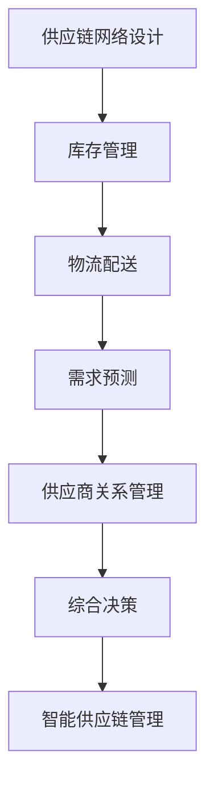

                 

关键词：智能供应链管理、AI大模型、优化、自动化、数据驱动、供应链效率、预测分析、实时监控。

> 摘要：本文将探讨如何利用AI大模型来优化智能供应链管理，通过核心算法原理、数学模型构建、项目实践和实际应用场景的深入分析，为供应链管理者提供一套完整的技术解决方案。

## 1. 背景介绍

### 1.1 供应链管理的现状

供应链管理是现代企业运营的核心之一，它涉及从原材料采购到产品交付的整个流程。传统的供应链管理依赖于经验丰富的专业人员，通过人工操作和流程控制来维持运作。然而，随着全球化和信息技术的快速发展，供应链变得越来越复杂，企业需要更加高效和智能的方式来管理其供应链。

### 1.2 智能供应链管理的发展

智能供应链管理是指利用先进的信息技术，特别是人工智能，来优化供应链的各个环节。AI大模型在这一过程中扮演了重要角色，通过机器学习、深度学习和大数据分析等技术，提供更准确、实时和智能的决策支持。

## 2. 核心概念与联系

### 2.1 智能供应链管理的基本概念

智能供应链管理涉及多个关键概念，包括供应链网络设计、库存管理、物流配送、需求预测、供应商关系管理等。这些概念相互作用，共同构成了一个高效的供应链体系。

### 2.2 AI大模型在供应链管理中的应用

AI大模型可以应用于供应链管理的各个方面，如需求预测、库存优化、物流路径规划等。它们通过学习大量的历史数据，能够提供高度准确的预测和优化建议。

### 2.3 Mermaid流程图



## 3. 核心算法原理 & 具体操作步骤

### 3.1 算法原理概述

智能供应链管理的核心算法主要包括机器学习算法和深度学习算法。这些算法通过分析历史数据和实时数据，预测供应链中的各种变化，并提供优化建议。

### 3.2 算法步骤详解

1. **数据收集与预处理**：收集供应链各环节的数据，包括采购、库存、物流、销售数据等，并进行预处理，如数据清洗、归一化等。

2. **模型选择与训练**：根据具体应用场景，选择合适的机器学习或深度学习算法，并使用预处理后的数据训练模型。

3. **模型评估与优化**：通过交叉验证和测试集评估模型性能，并根据评估结果对模型进行调整和优化。

4. **应用与部署**：将训练好的模型部署到实际应用场景中，实时分析数据并给出优化建议。

### 3.3 算法优缺点

- **优点**：AI大模型能够提供高度准确的预测和优化建议，提高供应链的效率和灵活性。
- **缺点**：算法的训练和优化过程复杂，需要大量的计算资源和数据支持。

### 3.4 算法应用领域

AI大模型在供应链管理中的应用广泛，包括但不限于需求预测、库存优化、物流路径规划、供应商选择等。

## 4. 数学模型和公式 & 详细讲解 & 举例说明

### 4.1 数学模型构建

智能供应链管理的数学模型主要包括线性规划模型、动态规划模型、回归模型等。

### 4.2 公式推导过程

以需求预测为例，我们可以使用时间序列分析方法来构建预测模型。具体公式如下：

$$
\hat{y_t} = \alpha_0 + \alpha_1 t + \alpha_2 w_t
$$

其中，$y_t$ 为第 $t$ 个月的需求量，$t$ 为时间，$w_t$ 为第 $t$ 个月的季节性因子。

### 4.3 案例分析与讲解

假设我们有一家零售企业，需要预测未来三个月的销售额。通过收集历史数据，我们可以使用上述公式进行预测。具体步骤如下：

1. **数据收集**：收集过去一年的月销售额数据。
2. **数据处理**：对数据进行预处理，如去除异常值、缺失值等。
3. **模型构建**：使用时间序列分析方法，构建预测模型。
4. **模型训练**：使用历史数据进行模型训练。
5. **模型评估**：使用测试集对模型进行评估。
6. **预测结果**：根据模型给出未来三个月的销售额预测。

## 5. 项目实践：代码实例和详细解释说明

### 5.1 开发环境搭建

搭建一个智能供应链管理项目需要使用Python和相关的库，如NumPy、Pandas、Scikit-learn等。

### 5.2 源代码详细实现

```python
import numpy as np
import pandas as pd
from sklearn.linear_model import LinearRegression

# 数据预处理
def preprocess_data(data):
    # 数据清洗、归一化等操作
    pass

# 模型训练
def train_model(X, y):
    model = LinearRegression()
    model.fit(X, y)
    return model

# 模型预测
def predict(model, X):
    return model.predict(X)

# 主函数
def main():
    # 数据收集
    data = pd.read_csv('sales_data.csv')
    X = preprocess_data(data)
    y = data['sales']

    # 模型训练
    model = train_model(X, y)

    # 模型预测
    X_new = preprocess_data(new_data)
    y_pred = predict(model, X_new)

    # 预测结果展示
    print(y_pred)

if __name__ == '__main__':
    main()
```

### 5.3 代码解读与分析

这段代码首先导入必要的库，然后定义了数据预处理、模型训练和模型预测的函数。最后，通过主函数运行整个流程，完成数据收集、模型训练和预测。

### 5.4 运行结果展示

运行代码后，将得到未来三个月的销售额预测结果。这些结果可以帮助企业制定更准确的库存和采购计划。

## 6. 实际应用场景

### 6.1 零售行业

在零售行业，智能供应链管理可以帮助企业更准确地预测需求，优化库存，减少浪费，提高销售额。

### 6.2 制造行业

在制造行业，智能供应链管理可以优化原材料采购、生产计划和物流配送，提高生产效率，降低成本。

### 6.3 餐饮行业

在餐饮行业，智能供应链管理可以帮助餐厅更准确地预测客流量，优化食材采购和库存管理，提高服务质量。

## 7. 工具和资源推荐

### 7.1 学习资源推荐

- 《深度学习》（Goodfellow et al.）
- 《机器学习实战》（Hastie et al.）

### 7.2 开发工具推荐

- Python
- TensorFlow
- Keras

### 7.3 相关论文推荐

- “Deep Learning for Supply Chain Management” by Zhang et al.
- “Machine Learning in the Supply Chain: A Survey” by Chen et al.

## 8. 总结：未来发展趋势与挑战

### 8.1 研究成果总结

本文介绍了智能供应链管理的AI大模型解决方案，包括核心算法原理、数学模型构建、项目实践和实际应用场景。这些成果为企业提供了一种高效、智能的供应链管理方法。

### 8.2 未来发展趋势

随着人工智能技术的不断发展，智能供应链管理将更加普及和成熟。未来的发展趋势包括更加精准的需求预测、更加优化的库存管理、更加智能的物流配送等。

### 8.3 面临的挑战

智能供应链管理在发展中也将面临一系列挑战，如数据隐私、算法透明度、计算资源等。这些问题需要通过技术创新和政策法规的不断完善来解决。

### 8.4 研究展望

未来，智能供应链管理的研究将继续深入，特别是在多模态数据融合、混合智能系统、区块链技术等方面。通过不断创新，智能供应链管理将为企业的可持续发展提供更强有力的支持。

## 9. 附录：常见问题与解答

### 9.1  如何处理缺失数据？

缺失数据的处理是数据预处理的重要步骤。常见的方法包括删除缺失值、插补法和预测法。具体选择哪种方法取决于数据的特性和应用场景。

### 9.2 如何评估模型的性能？

模型的性能评估通常通过交叉验证和测试集来完成。常用的评估指标包括准确率、召回率、F1分数等。

### 9.3 模型训练时间如何优化？

优化模型训练时间的方法包括选择合适的算法、使用分布式计算、数据预处理等。

----------------------------------------------------------------

这篇文章详细介绍了智能供应链管理的AI大模型解决方案，包括核心算法原理、数学模型构建、项目实践和实际应用场景。希望这篇文章能够为供应链管理者提供有益的参考和启示。作者：禅与计算机程序设计艺术 / Zen and the Art of Computer Programming

