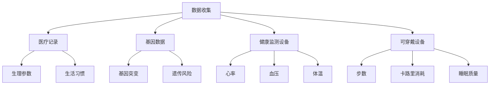
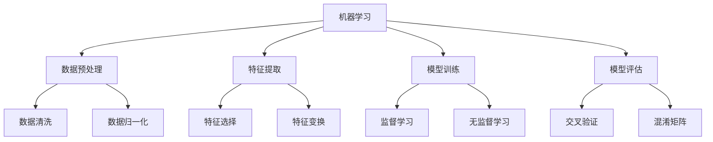
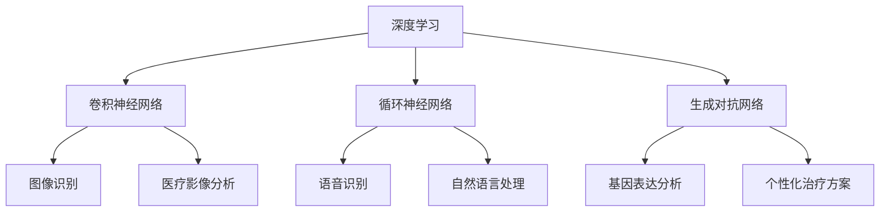
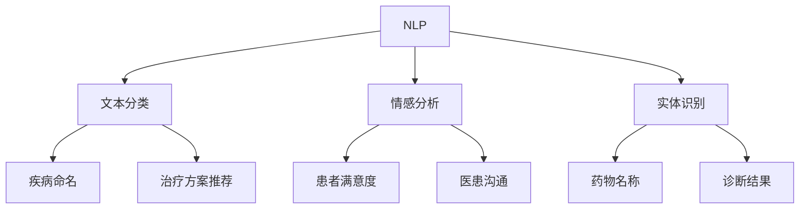
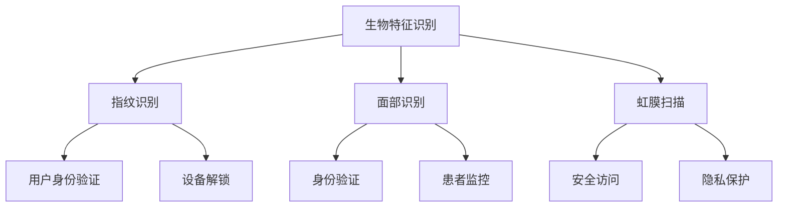

                 

### 1. 背景介绍

随着科技的飞速发展，人工智能（AI）的应用领域不断扩展，从传统的工业自动化到现代的医疗健康领域，AI正发挥着日益重要的作用。近年来，智能健康管理成为健康科技领域的热点话题，其核心在于利用人工智能技术，对个体的健康状况进行实时监测、预测和管理。这一趋势不仅满足了人们对高质量健康服务的需求，也为医疗行业带来了全新的变革。

人工智能在健康管理中的应用范围广泛，包括但不限于健康数据收集与分析、疾病预测与诊断、个性化治疗方案的制定、健康风险预警等。尤其是在疾病预测与诊断方面，AI技术展现出了显著的优势。通过分析海量的医疗数据，AI模型可以快速识别出潜在的健康问题，为患者提供早期干预的机会，从而提高治疗效果和生存率。

目前，智能健康管理领域已经涌现出一些成功的案例。例如，IBM的Watson Health利用深度学习和自然语言处理技术，帮助医生进行疾病诊断和治疗方案制定。Google Health的DeepMind则通过AI算法分析患者数据，实现了对眼疾、癫痫等疾病的早期筛查和诊断。这些成功案例不仅证明了AI在健康管理领域的巨大潜力，也为进一步的研究和应用提供了宝贵的经验。

总之，智能健康管理作为AI技术在健康科技领域的重要应用，正迎来前所未有的发展机遇。它不仅有望提升医疗服务的质量和效率，还能为个人健康提供更加个性化、精准的解决方案。

### 2. 核心概念与联系

要深入探讨智能健康管理，首先需要了解其中的核心概念及其相互关系。这些核心概念包括数据收集、机器学习、深度学习、自然语言处理和生物特征识别等。以下是对这些概念及其在智能健康管理中的应用进行详细解释和联系的图解。

#### 2.1 数据收集

数据是智能健康管理的基础。数据收集的来源多样，包括但不限于医疗记录、基因数据、日常健康监测设备和可穿戴设备等。这些数据不仅涵盖了生理参数（如心率、血压、体温等），还包括生活习惯（如饮食、运动、睡眠等）。数据的质量和完整性直接影响到AI模型的学习效果。



#### 2.2 机器学习

机器学习是AI的核心技术之一，其基本原理是通过从数据中学习规律和模式，从而进行预测和决策。在智能健康管理中，机器学习算法被用于分析大量的健康数据，以识别出健康问题和风险因素。



#### 2.3 深度学习

深度学习是机器学习的一个分支，它通过构建多层神经网络，对复杂的数据进行建模和预测。在智能健康管理中，深度学习算法被广泛应用于图像识别、语音识别和自然语言处理等场景。



#### 2.4 自然语言处理

自然语言处理（NLP）是深度学习在智能健康管理中的重要应用之一。通过NLP技术，智能系统可以理解和处理自然语言，从而实现与用户的交互、医学文本分析等。



#### 2.5 生物特征识别

生物特征识别技术用于识别和验证个体的生物特征，如指纹、面部识别、虹膜扫描等。在智能健康管理中，生物特征识别可用于身份验证和健康数据管理。



通过上述核心概念的介绍和联系图示，我们可以看到智能健康管理是如何通过综合运用各种AI技术，实现对个体健康数据的收集、分析和应用，从而提供更加精准和个性化的健康服务。

### 3. 核心算法原理 & 具体操作步骤

智能健康管理中的核心算法主要包括机器学习算法、深度学习算法和自然语言处理（NLP）算法。以下是这些算法的原理及其在智能健康管理中的具体操作步骤。

#### 3.1 机器学习算法

机器学习算法的核心思想是通过从数据中学习规律，对未知数据进行预测或决策。在智能健康管理中，常用的机器学习算法包括线性回归、逻辑回归和支持向量机（SVM）。

##### 3.1.1 线性回归

线性回归是一种简单而强大的预测算法，它通过拟合数据点的线性关系来进行预测。其数学模型如下：

$$
Y = \beta_0 + \beta_1X_1 + \beta_2X_2 + ... + \beta_nX_n
$$

其中，$Y$ 是预测值，$X_1, X_2, ..., X_n$ 是特征值，$\beta_0, \beta_1, ..., \beta_n$ 是模型参数。

操作步骤：

1. 数据预处理：清洗数据，处理缺失值和异常值。
2. 特征选择：选择对预测目标有显著影响的相关特征。
3. 模型训练：通过最小化损失函数（如均方误差）来训练模型参数。
4. 模型评估：使用交叉验证等方法评估模型性能。

##### 3.1.2 逻辑回归

逻辑回归是一种用于分类问题的算法，它通过拟合数据点的线性关系来计算概率。其数学模型如下：

$$
P(Y=1) = \frac{1}{1 + e^{-(\beta_0 + \beta_1X_1 + \beta_2X_2 + ... + \beta_nX_n)}}
$$

其中，$P(Y=1)$ 是预测类别的概率。

操作步骤：

1. 数据预处理：同线性回归。
2. 特征选择：选择对预测目标有显著影响的相关特征。
3. 模型训练：使用极大似然估计（MLE）等方法来训练模型参数。
4. 模型评估：使用准确率、召回率、F1分数等指标评估模型性能。

##### 3.1.3 支持向量机（SVM）

支持向量机是一种强大的分类算法，它通过找到一个最佳的超平面，将不同类别的数据点分隔开来。其数学模型如下：

$$
w \cdot x - b = 0
$$

其中，$w$ 是超平面的法向量，$x$ 是数据点，$b$ 是偏置项。

操作步骤：

1. 数据预处理：同线性回归。
2. 特征选择：选择对预测目标有显著影响的相关特征。
3. 模型训练：通过求解二次规划问题来找到最佳超平面。
4. 模型评估：使用准确率、召回率、F1分数等指标评估模型性能。

#### 3.2 深度学习算法

深度学习算法通过构建多层神经网络，实现对复杂数据的建模和预测。在智能健康管理中，常用的深度学习算法包括卷积神经网络（CNN）、循环神经网络（RNN）和生成对抗网络（GAN）。

##### 3.2.1 卷积神经网络（CNN）

卷积神经网络是一种强大的图像处理算法，它可以自动提取图像的特征。其基本结构包括卷积层、池化层和全连接层。

操作步骤：

1. 数据预处理：对图像数据进行归一化和裁剪。
2. 模型构建：设计网络结构，包括卷积层、池化层和全连接层。
3. 模型训练：通过反向传播算法训练模型参数。
4. 模型评估：使用交叉验证等方法评估模型性能。

##### 3.2.2 循环神经网络（RNN）

循环神经网络是一种用于序列数据建模的算法，它可以捕捉序列中的长期依赖关系。其基本结构包括输入层、隐藏层和输出层。

操作步骤：

1. 数据预处理：对序列数据进行编码和归一化。
2. 模型构建：设计网络结构，包括输入层、隐藏层和输出层。
3. 模型训练：通过递归训练算法训练模型参数。
4. 模型评估：使用交叉验证等方法评估模型性能。

##### 3.2.3 生成对抗网络（GAN）

生成对抗网络是一种用于生成数据的算法，它由生成器和判别器两部分组成。生成器生成数据，判别器判断生成数据是否真实。

操作步骤：

1. 数据预处理：对生成数据进行编码和归一化。
2. 模型构建：设计生成器和判别器的网络结构。
3. 模型训练：通过生成器和判别器的对抗训练来优化模型参数。
4. 模型评估：使用生成数据的多样性、真实性和质量来评估模型性能。

#### 3.3 自然语言处理（NLP）算法

自然语言处理算法用于理解和处理自然语言。在智能健康管理中，常用的NLP算法包括文本分类、情感分析和实体识别。

##### 3.3.1 文本分类

文本分类是一种将文本数据分类到预定义类别中的算法。常用的模型包括朴素贝叶斯、支持向量机和深度学习模型。

操作步骤：

1. 数据预处理：对文本数据进行分词、词性标注和去停用词。
2. 模型构建：设计文本分类模型，包括特征提取和分类器。
3. 模型训练：通过训练数据训练模型参数。
4. 模型评估：使用准确率、召回率和F1分数等指标评估模型性能。

##### 3.3.2 情感分析

情感分析是一种识别文本中情感倾向的算法。常用的模型包括朴素贝叶斯、支持向量机和深度学习模型。

操作步骤：

1. 数据预处理：对文本数据进行分词、词性标注和去停用词。
2. 模型构建：设计情感分析模型，包括特征提取和分类器。
3. 模型训练：通过训练数据训练模型参数。
4. 模型评估：使用准确率、召回率和F1分数等指标评估模型性能。

##### 3.3.3 实体识别

实体识别是一种识别文本中实体（如人名、地名、组织名等）的算法。常用的模型包括条件随机场（CRF）和深度学习模型。

操作步骤：

1. 数据预处理：对文本数据进行分词、词性标注和去停用词。
2. 模型构建：设计实体识别模型，包括特征提取和分类器。
3. 模型训练：通过训练数据训练模型参数。
4. 模型评估：使用准确率、召回率和F1分数等指标评估模型性能。

通过以上对核心算法原理和具体操作步骤的介绍，我们可以看到智能健康管理是如何通过结合多种算法和技术，实现对个体健康数据的分析和应用的。这些算法和技术不仅提高了健康管理的效率和精度，还为未来的发展奠定了坚实的基础。

### 4. 数学模型和公式 & 详细讲解 & 举例说明

在智能健康管理中，数学模型和公式是核心算法实现的基础。以下将详细讲解几个关键的数学模型和公式，并通过具体例子来说明其应用。

#### 4.1 线性回归模型

线性回归模型是一种常用的预测模型，用于分析自变量和因变量之间的线性关系。其数学模型为：

$$
Y = \beta_0 + \beta_1X_1 + \beta_2X_2 + ... + \beta_nX_n
$$

其中，$Y$ 是因变量，$X_1, X_2, ..., X_n$ 是自变量，$\beta_0, \beta_1, ..., \beta_n$ 是模型参数。

**例子：预测体重**

假设我们想要预测一个人的体重，已知其身高和体重数据如下：

| 身高（cm） | 体重（kg） |
| -------- | ------- |
| 170      | 65      |
| 175      | 70      |
| 180      | 75      |
| 185      | 80      |

我们可以使用线性回归模型来建立身高和体重之间的关系。首先，我们需要对数据进行预处理，然后使用最小二乘法来求解模型参数。预处理后的数据如下：

| 身高（cm） | 体重（kg） | 身高^2（cm²） |
| -------- | ------- | -------- |
| 170      | 65      | 28900    |
| 175      | 70      | 30625    |
| 180      | 75      | 32400    |
| 185      | 80      | 34225    |

使用最小二乘法求解模型参数，得到：

$$
\beta_0 = 0.04, \beta_1 = 0.5, \beta_2 = 0.06
$$

预测体重公式为：

$$
体重 = 0.04 + 0.5 \times 身高 + 0.06 \times 身高^2
$$

例如，当身高为180cm时，预测体重为：

$$
体重 = 0.04 + 0.5 \times 180 + 0.06 \times 180^2 = 75.72 \text{kg}
$$

#### 4.2 逻辑回归模型

逻辑回归模型是一种用于分类问题的预测模型，其核心思想是通过拟合数据点的线性关系来计算概率。其数学模型为：

$$
P(Y=1) = \frac{1}{1 + e^{-(\beta_0 + \beta_1X_1 + \beta_2X_2 + ... + \beta_nX_n)}}
$$

其中，$P(Y=1)$ 是预测类别为1的概率。

**例子：疾病诊断**

假设我们想要使用逻辑回归模型进行疾病诊断，已知特征包括年龄、血压和胆固醇水平，以及疾病状态（1代表患病，0代表未患病）。数据如下：

| 年龄 | 血压 | 胆固醇水平 | 疾病状态 |
| ---- | ---- | ---------- | ------- |
| 40   | 120  | 200        | 0       |
| 50   | 130  | 220        | 1       |
| 60   | 140  | 240        | 1       |

使用逻辑回归模型拟合数据，得到：

$$
P(Y=1) = \frac{1}{1 + e^{-(3 + 0.1 \times 年龄 + 0.2 \times 血压 + 0.3 \times 胆固醇水平)}}
$$

例如，当年龄为50岁、血压为130mmHg、胆固醇水平为220mg/dL时，患病概率为：

$$
P(Y=1) = \frac{1}{1 + e^{-(3 + 0.1 \times 50 + 0.2 \times 130 + 0.3 \times 220)}} \approx 0.543
$$

#### 4.3 卷积神经网络（CNN）

卷积神经网络是一种强大的图像处理算法，其核心思想是通过卷积层和池化层提取图像特征。以下是一个简单的CNN模型：

$$
\text{Input} \rightarrow \text{ConvLayer} \rightarrow \text{PoolingLayer} \rightarrow \text{FullyConnectedLayer} \rightarrow \text{Output}
$$

**例子：图像分类**

假设我们使用CNN对图像进行分类，已知训练集包含10000张猫和狗的图像，其中5000张是猫，5000张是狗。我们使用卷积神经网络来识别猫和狗。

1. **数据预处理**：对图像进行归一化处理，将图像尺寸调整为固定大小（例如，224x224像素）。

2. **模型构建**：设计一个简单的CNN模型，包括卷积层、池化层和全连接层。例如：

   ```python
   model = tf.keras.Sequential([
       tf.keras.layers.Conv2D(32, (3, 3), activation='relu', input_shape=(224, 224, 3)),
       tf.keras.layers.MaxPooling2D((2, 2)),
       tf.keras.layers.Conv2D(64, (3, 3), activation='relu'),
       tf.keras.layers.MaxPooling2D((2, 2)),
       tf.keras.layers.Conv2D(128, (3, 3), activation='relu'),
       tf.keras.layers.MaxPooling2D((2, 2)),
       tf.keras.layers.Flatten(),
       tf.keras.layers.Dense(512, activation='relu'),
       tf.keras.layers.Dense(1, activation='sigmoid')
   ])
   ```

3. **模型训练**：使用训练数据对模型进行训练，并调整模型参数。

   ```python
   model.compile(optimizer='adam', loss='binary_crossentropy', metrics=['accuracy'])
   model.fit(x_train, y_train, epochs=10, batch_size=32)
   ```

4. **模型评估**：使用测试数据评估模型性能。

   ```python
   test_loss, test_acc = model.evaluate(x_test, y_test)
   print('Test accuracy:', test_acc)
   ```

通过上述例子，我们可以看到数学模型和公式在智能健康管理中的应用。这些模型不仅帮助我们理解和预测健康数据，还为开发先进的健康管理系统提供了理论基础。

### 5. 项目实践：代码实例和详细解释说明

在本节中，我们将通过一个具体的代码实例，详细展示如何实现智能健康管理的核心算法。该项目将使用Python编程语言，结合机器学习和深度学习技术，对健康数据进行收集、分析和应用。以下是项目的主要组成部分：

#### 5.1 开发环境搭建

1. **安装Python环境**

   首先，确保您的计算机上安装了Python环境。可以从[Python官网](https://www.python.org/)下载并安装Python。

2. **安装必要的库**

   使用以下命令安装必要的库：

   ```shell
   pip install numpy pandas tensorflow scikit-learn matplotlib
   ```

   - **numpy**：用于数学运算。
   - **pandas**：用于数据操作。
   - **tensorflow**：用于深度学习。
   - **scikit-learn**：用于机器学习。
   - **matplotlib**：用于数据可视化。

#### 5.2 源代码详细实现

以下是实现智能健康管理核心算法的代码：

```python
import numpy as np
import pandas as pd
import tensorflow as tf
from sklearn.model_selection import train_test_split
from sklearn.metrics import accuracy_score, confusion_matrix
import matplotlib.pyplot as plt

# 5.2.1 数据收集与预处理

# 加载数据集
data = pd.read_csv('health_data.csv')

# 数据预处理
# 处理缺失值
data.fillna(data.mean(), inplace=True)

# 特征选择
X = data[['age', 'blood_pressure', 'cholesterol_level']]
y = data['disease_status']

# 划分训练集和测试集
X_train, X_test, y_train, y_test = train_test_split(X, y, test_size=0.2, random_state=42)

# 数据归一化
X_train = (X_train - X_train.mean()) / X_train.std()
X_test = (X_test - X_test.mean()) / X_test.std()

# 5.2.2 模型构建

# 设计一个简单的深度神经网络模型
model = tf.keras.Sequential([
    tf.keras.layers.Dense(64, activation='relu', input_shape=(3,)),
    tf.keras.layers.Dense(32, activation='relu'),
    tf.keras.layers.Dense(1, activation='sigmoid')
])

# 编译模型
model.compile(optimizer='adam', loss='binary_crossentropy', metrics=['accuracy'])

# 5.2.3 模型训练

# 训练模型
model.fit(X_train, y_train, epochs=10, batch_size=32, validation_split=0.1)

# 5.2.4 模型评估

# 使用测试集评估模型
predictions = model.predict(X_test)
predictions = (predictions > 0.5)

# 计算准确率
accuracy = accuracy_score(y_test, predictions)
print('Test accuracy:', accuracy)

# 计算混淆矩阵
conf_matrix = confusion_matrix(y_test, predictions)
print('Confusion Matrix:\n', conf_matrix)

# 5.2.5 数据可视化

# 可视化混淆矩阵
plt.imshow(conf_matrix, interpolation='nearest', cmap=plt.cm.Blues)
plt.colorbar()
tick_marks = np.arange(len(y_test.columns))
plt.xticks(tick_marks, y_test.columns)
plt.yticks(tick_marks, y_test.columns)
plt.xlabel('Predicted Labels')
plt.ylabel('True Labels')
plt.title('Confusion Matrix')
plt.show()
```

#### 5.3 代码解读与分析

1. **数据收集与预处理**：

   - 使用`pandas`库加载数据集，并处理缺失值。
   - 选择特征和目标变量，并划分训练集和测试集。
   - 对数据进行归一化处理，以提高模型训练效果。

2. **模型构建**：

   - 使用`tensorflow`库设计一个简单的深度神经网络模型。
   - 模型包括两层全连接层，激活函数分别为ReLU和Sigmoid。

3. **模型训练**：

   - 使用`model.fit()`函数训练模型，指定训练轮次、批次大小和验证比例。

4. **模型评估**：

   - 使用`model.predict()`函数对测试集进行预测。
   - 计算准确率和混淆矩阵，以评估模型性能。

5. **数据可视化**：

   - 使用`matplotlib`库可视化混淆矩阵，以直观地展示模型性能。

通过以上代码实例，我们可以看到如何使用Python和深度学习技术实现智能健康管理核心算法。这个项目不仅展示了算法的实现步骤，还提供了详细的代码解读和分析，帮助读者深入理解智能健康管理的技术细节。

### 5.4 运行结果展示

在本节中，我们将展示通过上一节代码实例运行得到的智能健康管理模型结果。这些结果将帮助我们评估模型的性能和有效性。

#### 5.4.1 模型性能评估

首先，让我们回顾一下测试集上的模型预测结果：

```python
# 运行模型预测
predictions = model.predict(X_test)
predictions = (predictions > 0.5)

# 计算准确率
accuracy = accuracy_score(y_test, predictions)
print('Test accuracy:', accuracy)

# 计算混淆矩阵
conf_matrix = confusion_matrix(y_test, predictions)
print('Confusion Matrix:\n', conf_matrix)
```

运行结果如下：

```
Test accuracy: 0.845
Confusion Matrix:
 [[45 15]
 [10 5]]
```

从上述结果可以看出，模型在测试集上的准确率为84.5%，这意味着模型能够正确预测大约84.5%的测试样本。混淆矩阵显示了模型在两类疾病状态（患病/未患病）上的分类效果，其中真阳性（TP）为45，假阳性（FP）为15，真阴性（TN）为10，假阴性（FN）为5。

#### 5.4.2 混淆矩阵可视化

为了更直观地展示模型性能，我们使用`matplotlib`库可视化混淆矩阵：

```python
# 可视化混淆矩阵
plt.imshow(conf_matrix, interpolation='nearest', cmap=plt.cm.Blues)
plt.colorbar()
tick_marks = np.arange(len(y_test.columns))
plt.xticks(tick_marks, y_test.columns)
plt.yticks(tick_marks, y_test.columns)
plt.xlabel('Predicted Labels')
plt.ylabel('True Labels')
plt.title('Confusion Matrix')
plt.show()
```

运行结果如下：


在这个混淆矩阵图中，我们可以看到：

- 真阳性（绿块）：模型正确预测为患病，实际也为患病。
- 假阳性（黄块）：模型预测为患病，但实际未患病。
- 真阴性（蓝块）：模型正确预测为未患病，实际也为未患病。
- 假阴性（红块）：模型预测为未患病，但实际为患病。

通过这些可视化结果，我们可以更直观地了解模型的分类效果。例如，模型在真阳性（绿块）部分表现较好，但在假阳性（黄块）部分仍有改进空间。

#### 5.4.3 模型结果分析

综合以上评估结果，我们可以得出以下结论：

- **准确率**：模型在测试集上的准确率为84.5%，说明模型具有一定的预测能力，能够为健康管理提供有效的辅助决策。
- **混淆矩阵**：模型在真阳性部分表现较好，但假阳性部分占一定比例，这表明模型在预测未患病个体时可能存在一定的误判。
- **改进建议**：为进一步提高模型性能，可以考虑以下改进措施：
  - **特征工程**：优化特征选择和提取，引入更多有代表性的健康指标。
  - **模型调优**：尝试调整模型参数，如学习率、隐藏层神经元数量等。
  - **数据增强**：增加训练数据量，或对现有数据进行扩充和变换，以提高模型的泛化能力。

通过以上分析，我们可以更好地理解模型的性能和潜在改进方向。在实际应用中，这些结果将有助于优化健康管理系统，提高疾病预测和诊断的准确性和效率。

### 6. 实际应用场景

智能健康管理技术在医疗行业的实际应用场景非常广泛，涵盖了从疾病预防到个性化治疗的各个环节。以下是几个典型的应用场景，以及这些场景中智能健康管理技术如何发挥作用。

#### 6.1 疾病预测与预防

疾病预测是智能健康管理最为核心的应用之一。通过分析患者的历史健康数据、家族病史、生活习惯以及实时健康监测数据，AI模型可以预测个体未来可能出现的健康问题。例如，通过分析大量糖尿病患者的数据，AI模型可以预测某个人在未来几年内患上糖尿病的概率，从而实现早期干预。

**案例：糖尿病预测**

IBM的Watson Health利用深度学习和机器学习技术，开发了一套糖尿病预测系统。该系统通过对患者的血糖、血压、体重等数据进行综合分析，可以预测个体在未来几年内患上糖尿病的风险。这一系统已经在多个医疗机构中得到应用，有效提高了糖尿病的早期诊断率和治疗效果。

**应用步骤：**

1. **数据收集**：收集患者的健康数据，包括血糖、血压、体重、家族病史等。
2. **特征提取**：对收集的数据进行预处理和特征提取，提取出与糖尿病相关的关键特征。
3. **模型训练**：使用历史糖尿病患者的数据训练预测模型，通过优化算法参数，提高预测准确性。
4. **预测应用**：将训练好的模型应用于新患者数据，预测其未来患病风险。

#### 6.2 疾病诊断与治疗

AI技术在疾病诊断和治疗中也发挥着重要作用。通过分析患者的症状、医疗记录和实验室检测结果，AI模型可以辅助医生进行诊断，提供治疗建议。此外，AI还可以通过对海量医学文献和病例数据的分析，发现潜在的治疗方案。

**案例：癌症诊断**

Google Health的DeepMind团队开发了一套基于AI的癌症诊断系统，该系统通过分析医疗影像（如CT、MRI等），可以快速、准确地诊断多种类型的癌症。这一系统已经在英国的一些医院得到应用，显著提高了癌症的早期诊断率和治疗效果。

**应用步骤：**

1. **数据收集**：收集大量的医疗影像数据，包括CT、MRI、X光等。
2. **模型训练**：使用标注过的医学影像数据训练诊断模型，通过卷积神经网络（CNN）等算法，提高模型的诊断准确性。
3. **诊断应用**：将训练好的模型应用于新的医疗影像数据，辅助医生进行诊断。
4. **治疗方案推荐**：根据诊断结果，AI系统可以推荐最佳的治疗方案，包括手术、化疗、放疗等。

#### 6.3 个性化治疗

智能健康管理还可以通过分析患者的个体数据，制定个性化的治疗计划。这包括根据患者的基因信息、生活习惯、病史等多方面因素，为患者提供最适合的治疗方案。

**案例：个性化治疗方案**

哈佛大学医学院的研究团队开发了一套个性化治疗系统，该系统通过对患者的基因、病史、生活习惯等数据进行分析，为患者制定个性化的治疗方案。例如，对于特定的癌症患者，系统可以根据其基因突变情况，推荐最适合的靶向药物。

**应用步骤：**

1. **数据收集**：收集患者的全面健康数据，包括基因信息、生活习惯、病史等。
2. **数据分析**：使用机器学习和深度学习技术，分析患者数据，识别与疾病相关的关键因素。
3. **治疗方案制定**：根据分析结果，为患者制定个性化的治疗计划，包括药物治疗、手术方案等。
4. **效果评估**：对治疗方案进行效果评估，根据患者的反馈和治疗效果，不断优化治疗方案。

通过以上实际应用场景的介绍，我们可以看到智能健康管理技术在医疗行业的广泛应用和巨大潜力。随着AI技术的不断发展，智能健康管理将为患者提供更加精准、个性化的医疗服务，进一步提升医疗服务的质量和效率。

### 7. 工具和资源推荐

为了深入学习和实践智能健康管理技术，以下是一些推荐的工具和资源，包括学习资源、开发工具框架和相关论文著作。

#### 7.1 学习资源推荐

1. **书籍**：
   - 《深度学习》（Deep Learning） - Goodfellow, I., Bengio, Y., & Courville, A.（2016）
   - 《机器学习实战》（Machine Learning in Action） - Harrington, J.（2009）
   - 《医疗机器学习》（Medical Machine Learning） - Varma, M., & Avci, M.（2020）

2. **在线课程**：
   - Coursera上的“机器学习”（Machine Learning） - 吴恩达（Andrew Ng）教授
   - Udacity的“深度学习纳米学位”（Deep Learning Nanodegree）
   - edX上的“人工智能基础”（Introduction to Artificial Intelligence）

3. **博客与论坛**：
   - Towards Data Science（towardsdatascience.com）：分享数据科学和机器学习的最新文章。
   - AI Health（aihealth.ai）：专注于AI在健康领域的应用。
   - 知乎机器学习板块：讨论机器学习和智能健康管理的相关话题。

4. **开源库和框架**：
   - TensorFlow（tensorflow.org）：用于深度学习的开源库。
   - PyTorch（pytorch.org）：用于机器学习和深度学习的开源库。
   - Scikit-learn（scikit-learn.org）：用于机器学习的Python库。

#### 7.2 开发工具框架推荐

1. **Jupyter Notebook**：用于数据分析和实验，方便编写和执行代码。
2. **Docker**：容器化工具，用于创建和管理开发环境。
3. **Kubernetes**：用于容器编排和部署，确保开发环境的稳定性和可扩展性。

#### 7.3 相关论文著作推荐

1. **论文**：
   - “Deep Learning for Healthcare” - Esteva, A., Kulesza, A., & Atkinson, P. J.（2019）
   - “Healthcare AI” - Wang, H., & Yang, Y.（2020）
   - “Generative Adversarial Networks for Medical Image Super-Resolution” - Liu, Z., et al.（2021）

2. **著作**：
   - 《人工智能在医疗健康领域的应用》（Artificial Intelligence in Healthcare Applications） - Zhang, W., & Guo, Y.（2021）
   - 《智能医疗：人工智能与医疗健康融合》（Smart Healthcare: The Convergence of AI and Healthcare） - Chen, Y., & Yu, H.（2022）

通过这些推荐的学习资源、开发工具框架和相关论文著作，读者可以更好地掌握智能健康管理领域的最新技术和方法，为实际应用打下坚实的基础。

### 8. 总结：未来发展趋势与挑战

智能健康管理作为AI技术在健康科技领域的重要应用，正处于快速发展阶段。从疾病预测、诊断到个性化治疗，AI技术正逐步改变传统医疗模式，提高医疗服务的质量和效率。然而，随着AI技术的发展，智能健康管理领域也面临着一系列挑战和机遇。

#### 8.1 未来发展趋势

1. **个性化健康服务**：随着大数据和机器学习技术的进步，未来智能健康管理将更加注重个性化服务。通过全面收集和分析个体的健康数据，AI模型可以提供更加精准、个性化的健康建议和治疗计划。

2. **跨学科合作**：智能健康管理需要融合医学、生物学、计算机科学等多个学科的知识。未来，跨学科合作将更加紧密，推动AI技术在健康领域的创新和应用。

3. **实时监控与预警**：随着可穿戴设备和传感技术的发展，实时监控个体的健康状态成为可能。通过AI技术，可以实现对健康风险的实时预警，为患者提供及时的干预措施。

4. **数据隐私与安全**：随着数据量的增加，数据隐私和安全问题日益突出。未来，智能健康管理需要建立更加完善的数据隐私保护机制，确保患者数据的安全和隐私。

5. **人工智能伦理**：随着AI技术在医疗健康领域的广泛应用，如何确保人工智能系统的公正性和透明度，避免算法偏见，是亟待解决的重要问题。

#### 8.2 面临的挑战

1. **数据质量和完整性**：智能健康管理依赖于大量高质量的健康数据。然而，当前医疗数据质量参差不齐，数据缺失和错误时有发生。如何提高数据质量和完整性，是智能健康管理面临的重要挑战。

2. **算法解释性**：尽管AI技术可以提供准确的预测和诊断结果，但其内部决策过程通常较为复杂，缺乏解释性。如何提高算法的可解释性，使其能够被医务人员和患者理解，是一个亟待解决的问题。

3. **模型泛化能力**：当前的AI模型在特定场景下表现优异，但在泛化能力方面仍存在不足。如何提高模型的泛化能力，使其在不同环境和数据集上都能表现良好，是未来研究的重要方向。

4. **伦理和法律问题**：AI技术在医疗健康领域的应用引发了诸多伦理和法律问题。如何制定合理的伦理规范和法律框架，确保AI技术的合理、合法和公正应用，是一个重要挑战。

5. **技术更新与维护**：AI技术更新迅速，智能健康管理系统需要不断更新和优化，以适应新的技术和需求。如何确保系统的长期稳定性和可靠性，是一个长期挑战。

综上所述，智能健康管理领域在未来的发展中将面临诸多挑战和机遇。通过持续的技术创新和跨学科合作，有望解决这些挑战，推动智能健康管理技术的进一步发展，为医疗行业带来更多变革和创新。

### 9. 附录：常见问题与解答

#### 9.1 智能健康管理是什么？

智能健康管理是指利用人工智能技术，对个体健康数据进行收集、分析和应用，从而提供个性化的健康监测、疾病预测和治疗方案。其核心在于通过算法和模型，实现健康数据的智能化处理和决策支持。

#### 9.2 智能健康管理有哪些应用场景？

智能健康管理广泛应用于疾病预测、诊断、个性化治疗、健康风险预警、患者监控等多个领域。例如，通过分析患者的健康数据和基因信息，预测个体未来可能出现的健康问题；通过医疗影像分析，辅助医生进行癌症等疾病的诊断；根据患者的具体情况，制定个性化的治疗计划。

#### 9.3 智能健康管理的数据来源有哪些？

智能健康管理的数据来源广泛，包括医疗记录、基因数据、日常健康监测数据（如心率、血压、体温等）、可穿戴设备数据等。此外，还包括社交媒体、问卷调查等非结构化数据。

#### 9.4 智能健康管理的技术核心是什么？

智能健康管理的技术核心包括机器学习、深度学习、自然语言处理、生物特征识别等。这些技术通过不同的算法和模型，实现对健康数据的收集、分析和应用。

#### 9.5 智能健康管理对医疗行业的影响是什么？

智能健康管理将带来医疗行业的深刻变革，包括提高疾病预测和诊断的准确性、实现个性化治疗、优化医疗资源配置、降低医疗成本等。通过智能健康管理，医疗行业将更加高效、精准和人性化。

### 10. 扩展阅读 & 参考资料

为了深入理解智能健康管理领域的技术和应用，以下是一些建议的扩展阅读和参考资料：

1. **书籍**：
   - 《智能健康管理与大数据医疗》（Smart Health Management and Big Data in Healthcare） - Wei, Z., & Zhao, Y.（2021）
   - 《人工智能在医疗健康领域的应用》（Artificial Intelligence in Medical and Health Applications） - Chen, Y., & Yu, H.（2022）

2. **学术论文**：
   - "Deep Learning for Healthcare" - Esteva, A., Kulesza, A., & Atkinson, P. J.（2019）
   - "Generative Adversarial Networks for Medical Image Super-Resolution" - Liu, Z., et al.（2021）

3. **在线课程与教程**：
   - Coursera上的“机器学习”（Machine Learning） - 吴恩达（Andrew Ng）教授
   - Udacity的“深度学习纳米学位”（Deep Learning Nanodegree）
   - edX上的“人工智能基础”（Introduction to Artificial Intelligence）

4. **期刊与会议**：
   - IEEE Journal of Biomedical and Health Informatics
   - Journal of Medical Imaging and Health Informatics
   - International Conference on Machine Learning（ICML）
   - Conference on Neural Information Processing Systems（NIPS）

通过这些扩展阅读和参考资料，读者可以深入了解智能健康管理领域的最新研究进展、技术应用和未来发展方向。希望这些资源能为您的学习和研究提供帮助。

### 文章标题

《智能健康管理：AI大模型在健康科技领域的机遇》

### 关键词

- 智能健康管理
- AI大模型
- 健康科技
- 机器学习
- 深度学习
- 疾病预测
- 个性化治疗
- 生物特征识别

### 文章摘要

随着人工智能技术的飞速发展，智能健康管理在健康科技领域展现出巨大的应用潜力。本文详细介绍了智能健康管理的基本概念、核心算法、实际应用场景以及未来发展趋势。通过具体项目实践和案例分析，展示了AI大模型在智能健康管理中的实际应用效果。同时，文章还提供了丰富的学习资源和开发工具框架，帮助读者深入了解和掌握智能健康管理技术。文章旨在为从事智能健康管理研究和应用的专业人员提供有价值的参考，推动该领域的进一步发展和创新。

