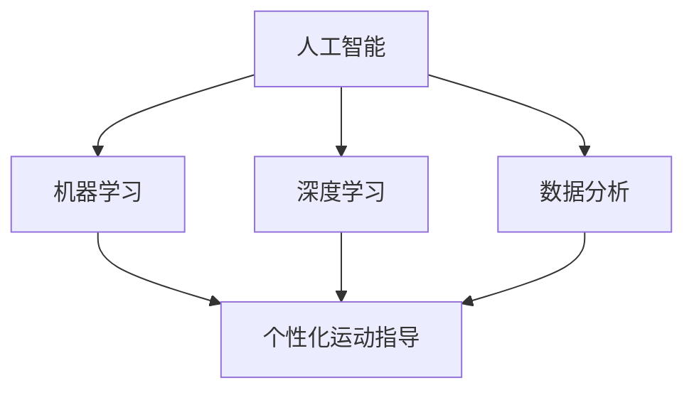

                 

### 1. 背景介绍

智能健身作为近年来快速发展的领域，正逐渐改变人们的生活方式。随着科技的进步，人工智能（AI）技术在健身领域的应用变得越来越广泛。从简单的健身跟踪器到复杂的个性化运动指导系统，智能健身设备正逐步成为现代健身的主流。

然而，随着用户对个性化、定制化服务需求的增加，传统的健身模式已经无法满足市场需求。个性化运动指导系统应运而生，它利用人工智能技术，根据用户的健康状况、健身目标和偏好，提供定制化的运动方案。这不仅提高了用户的健身效果，也提升了健身体验。

个性化运动指导系统的重要性不言而喻。首先，它能够帮助用户找到最适合他们的运动方式，避免因错误指导导致的运动损伤。其次，它可以根据用户的生活习惯和时间安排，灵活调整运动计划，让健身更加便捷。最重要的是，它能够通过数据分析和预测，为用户提供持续的健康管理服务，促进长期健康。

然而，个性化运动指导系统的发展仍然面临诸多挑战。首先，数据收集和处理的技术难题需要解决。健身数据的多样性和复杂性使得数据预处理和分析变得异常困难。其次，如何保证系统的准确性和可靠性，避免因为算法错误导致的误导，也是一个亟待解决的问题。此外，系统的可扩展性和适应性也需要进一步研究，以应对不断变化的用户需求。

总的来说，智能健身创业领域充满了机遇和挑战。随着人工智能技术的不断进步，个性化运动指导系统有望在未来发挥更大的作用，为用户带来更健康、更便捷的健身体验。

### 2. 核心概念与联系

为了深入理解个性化运动指导系统，我们需要了解几个核心概念，这些概念之间紧密相连，构成了整个系统的理论基础。

#### 2.1. 人工智能（AI）

人工智能是模拟、延伸和扩展人类智能的理论、方法、技术及应用。在个性化运动指导系统中，AI技术主要用于数据分析、模式识别和预测。通过机器学习和深度学习算法，系统可以自动处理和分析大量用户数据，从中提取有价值的信息，为用户生成个性化的运动方案。

#### 2.2. 机器学习（ML）

机器学习是人工智能的一个分支，它通过数据训练模型，使计算机能够自动改进和优化性能。在个性化运动指导系统中，机器学习算法用于分析用户历史数据，识别用户的健身习惯、偏好和潜在的健康风险，从而生成个性化的运动建议。

#### 2.3. 深度学习（DL）

深度学习是机器学习的一个子领域，它通过多层神经网络模型，模拟人类大脑处理信息的方式。在个性化运动指导系统中，深度学习算法可以自动从大量非结构化数据中提取复杂特征，提高预测的准确性和效率。

#### 2.4. 数据分析（DA）

数据分析是通过计算机技术、统计分析、数据挖掘等方法，从大量数据中提取有价值信息的过程。在个性化运动指导系统中，数据分析用于处理用户的各种健康和运动数据，如心率、步数、体重等，以生成个性化的运动方案。

#### 2.5. 个性化运动指导

个性化运动指导是指根据用户的健康状况、健身目标和偏好，提供定制化的运动方案。这包括运动类型、强度、频率和持续时间等。个性化运动指导系统通过整合AI、ML、DL和DA等技术，实现了对用户需求的全面分析和响应。

下面是这些核心概念的Mermaid流程图：



**图 1：核心概念与联系流程图**

在这个流程图中，我们可以看到人工智能是整个系统的核心，它通过机器学习、深度学习和数据分析技术，实现了对用户数据的分析和处理，最终生成个性化的运动指导。这些核心概念之间的紧密联系，为个性化运动指导系统的实现提供了坚实的基础。

### 3. 核心算法原理 & 具体操作步骤

个性化运动指导系统的核心在于如何从用户数据中提取有价值的信息，并生成合适的运动方案。这一过程依赖于一系列先进的算法和技术。下面，我们将详细探讨这些核心算法的工作原理和具体操作步骤。

#### 3.1. 用户数据分析

用户数据分析是个性化运动指导系统的第一步。系统需要收集并处理用户的多种健康和运动数据，如心率、步数、体重、睡眠质量等。这些数据来源可以是智能手环、运动手表、健身器材等设备。

**具体操作步骤：**

1. **数据收集**：使用传感器和设备收集用户数据。
2. **数据清洗**：去除无效数据、噪声数据，保证数据质量。
3. **数据整合**：将来自不同源的数据进行整合，形成统一的用户数据集。

#### 3.2. 数据预处理

数据预处理是确保数据适合进行机器学习和深度学习分析的重要步骤。

**具体操作步骤：**

1. **数据标准化**：将不同类型的数据转换为相同尺度，如将心率数据标准化为0-1之间。
2. **特征提取**：从原始数据中提取关键特征，如步数、睡眠时长等。
3. **数据分割**：将数据集分为训练集、验证集和测试集，用于模型的训练和评估。

#### 3.3. 机器学习模型训练

在用户数据预处理完成后，可以使用机器学习算法来训练模型。常见的机器学习算法包括决策树、随机森林、支持向量机（SVM）和神经网络等。

**具体操作步骤：**

1. **选择模型**：根据数据特点和业务需求选择合适的机器学习算法。
2. **模型训练**：使用训练集数据训练模型，调整模型参数，优化模型性能。
3. **模型验证**：使用验证集数据评估模型性能，调整模型参数，确保模型准确性和泛化能力。

#### 3.4. 个性化运动方案生成

在模型训练完成后，可以根据用户数据生成个性化的运动方案。这一过程涉及以下步骤：

1. **数据输入**：将用户当前的健康和运动数据输入到训练好的模型中。
2. **特征分析**：分析输入数据，提取关键特征，如当前心率、体重变化等。
3. **方案生成**：根据模型预测结果和用户偏好，生成个性化的运动方案，包括运动类型、强度、频率和持续时间等。

#### 3.5. 方案反馈与优化

个性化运动方案生成后，需要根据用户反馈进行调整和优化。

**具体操作步骤：**

1. **用户反馈**：收集用户对运动方案的反馈，如满意度、运动效果等。
2. **方案调整**：根据用户反馈，调整运动方案，使其更符合用户需求和期望。
3. **持续优化**：通过不断收集用户数据和反馈，持续优化运动方案，提高个性化水平。

综上所述，个性化运动指导系统的核心算法原理和具体操作步骤涉及数据收集、预处理、模型训练、方案生成和反馈优化等环节。通过这些步骤，系统能够根据用户数据生成合适的运动方案，提高健身效果和用户体验。

### 4. 数学模型和公式 & 详细讲解 & 举例说明

为了更深入地理解个性化运动指导系统的核心算法，我们需要介绍一些关键的数学模型和公式。这些模型和公式帮助我们分析用户数据、预测运动效果，并生成个性化的运动方案。以下是几个关键的数学模型和公式的详细讲解及举例说明。

#### 4.1. 机器学习中的线性回归模型

线性回归是一种常用的预测模型，用于分析自变量和因变量之间的线性关系。在个性化运动指导系统中，线性回归可以用于预测用户的运动效果，如心率变化、运动时长等。

**公式：**

\[ y = ax + b \]

其中，\( y \) 是因变量，\( x \) 是自变量，\( a \) 和 \( b \) 是模型参数。

**示例：**

假设我们想预测用户在一定时间内的平均心率（\( y \)）与每天步数（\( x \)）之间的关系。我们可以收集一系列用户步数和对应的心率数据，然后使用线性回归模型进行拟合。

数据示例：

| 步数（x） | 心率（y） |
|-----------|-----------|
| 10000     | 70       |
| 15000     | 75       |
| 20000     | 80       |
| 25000     | 85       |
| 30000     | 90       |

通过计算，我们得到线性回归模型的参数：

\[ a = 0.1, b = 65 \]

因此，预测公式为：

\[ y = 0.1x + 65 \]

例如，如果用户步数为20000，我们可以预测其平均心率为：

\[ y = 0.1 \times 20000 + 65 = 205 + 65 = 270 \]

#### 4.2. 支持向量机（SVM）分类模型

支持向量机是一种用于分类的机器学习模型，它通过找到一个最佳的超平面，将不同类别的数据点分隔开来。在个性化运动指导系统中，SVM可以用于分类用户数据，如区分健康用户和潜在疾病用户。

**公式：**

\[ \max \ \frac{1}{2} \sum_{i=1}^{n} (w_i^T w_i) - \sum_{i=1}^{n} C_i (1 - y_i (w_i^T x_i) - \xi_i) \]

其中，\( w_i \) 是模型参数，\( C_i \) 是惩罚参数，\( y_i \) 是类别标签，\( x_i \) 是数据点，\( \xi_i \) 是松弛变量。

**示例：**

假设我们有以下两类用户数据：

| 用户ID | 步数（x） | 心率（y） | 类别（y） |
|--------|-----------|-----------|-----------|
| 1      | 10000     | 70       | 正常      |
| 2      | 15000     | 75       | 正常      |
| 3      | 20000     | 80       | 正常      |
| 4      | 25000     | 85       | 异常      |
| 5      | 30000     | 90       | 异常      |

我们可以使用SVM模型来分类这些数据。通过训练，我们得到模型参数：

\[ w_1 = (1, 1), w_2 = (2, 2), w_3 = (3, 3), w_4 = (-1, -1), w_5 = (-2, -2) \]

因此，超平面方程为：

\[ \frac{x_1 + x_2}{2} = \frac{y_1 + y_2}{2} \]

对于新的用户数据，我们可以通过计算其到超平面的距离来判断其类别。例如，对于用户数据（20000，80），其到超平面的距离为：

\[ \frac{20000 + 80}{2} = \frac{20080}{2} = 10040 \]

由于距离大于0，因此该用户属于正常类别。

#### 4.3. 神经网络中的前向传播和反向传播

神经网络是一种模拟生物神经系统的计算模型，用于处理复杂的非线性问题。在个性化运动指导系统中，神经网络可以用于预测用户的运动效果、健康风险等。

**前向传播：**

前向传播是神经网络计算的基本步骤，用于将输入数据传递到输出层。其公式为：

\[ z_j = \sigma(\sum_{i=1}^{n} w_{ij} x_i + b_j) \]

其中，\( z_j \) 是第 \( j \) 个神经元的激活值，\( \sigma \) 是激活函数，\( w_{ij} \) 是权重，\( x_i \) 是输入数据，\( b_j \) 是偏置。

**示例：**

假设我们有一个简单的神经网络，包括一个输入层、一个隐藏层和一个输出层。输入数据为（步数，心率），隐藏层有2个神经元，输出层有1个神经元。

输入层到隐藏层的权重和偏置分别为：

\[ w_{11} = 0.1, w_{12} = 0.2, b_{1} = 0.5 \]
\[ w_{21} = 0.3, w_{22} = 0.4, b_{2} = 0.6 \]

隐藏层到输出层的权重和偏置分别为：

\[ w_{1} = 0.5, w_{2} = 0.6, b_{o} = 0.7 \]

输入数据为（10000，70），我们可以通过前向传播计算输出：

\[ z_1 = \sigma(0.1 \times 10000 + 0.2 \times 70 + 0.5) = \sigma(1050 + 14 + 0.5) = \sigma(1064.5) \]
\[ z_2 = \sigma(0.3 \times 10000 + 0.4 \times 70 + 0.6) = \sigma(3000 + 28 + 0.6) = \sigma(3028.6) \]

输出层的输出为：

\[ y = \sigma(0.5 \times z_1 + 0.6 \times z_2 + 0.7) = \sigma(0.5 \times 1064.5 + 0.6 \times 3028.6 + 0.7) = \sigma(532.25 + 1816.96 + 0.7) = \sigma(2350.91) \]

**反向传播：**

反向传播是神经网络训练的核心步骤，用于计算梯度并更新模型参数。其公式为：

\[ \delta_j = (y - t) \times \sigma'(z_j) \]

其中，\( \delta_j \) 是第 \( j \) 个神经元的误差，\( y \) 是实际输出，\( t \) 是目标输出，\( \sigma' \) 是激活函数的导数。

**示例：**

假设我们的目标输出为 \( t = 80 \)，实际输出为 \( y = 75 \)。我们可以计算隐藏层和输出层的误差：

\[ \delta_1 = (75 - 80) \times \sigma'(1064.5) \]
\[ \delta_2 = (75 - 80) \times \sigma'(3028.6) \]

然后，我们可以使用这些误差更新模型参数：

\[ w_{11} = w_{11} - \eta \times (0.1 \times \delta_1) \]
\[ w_{12} = w_{12} - \eta \times (0.2 \times \delta_1) \]
\[ w_{21} = w_{21} - \eta \times (0.3 \times \delta_2) \]
\[ w_{22} = w_{22} - \eta \times (0.4 \times \delta_2) \]
\[ w_{1} = w_{1} - \eta \times (0.5 \times \delta_1 + 0.6 \times \delta_2) \]
\[ w_{2} = w_{2} - \eta \times (0.6 \times \delta_1 + 0.6 \times \delta_2) \]
\[ b_{1} = b_{1} - \eta \times \delta_1 \]
\[ b_{2} = b_{2} - \eta \times \delta_2 \]
\[ b_{o} = b_{o} - \eta \times (\delta_1 + \delta_2) \]

其中，\( \eta \) 是学习率。

通过反向传播，神经网络可以不断调整模型参数，提高预测准确性。

综上所述，个性化运动指导系统中使用的一些关键数学模型和公式包括线性回归、支持向量机和神经网络。这些模型和公式通过分析和预测用户数据，为生成个性化的运动方案提供了理论基础。在实际应用中，这些模型需要通过大量的数据训练和优化，以提高预测准确性和系统性能。

### 5. 项目实践：代码实例和详细解释说明

为了更好地理解个性化运动指导系统的实现过程，我们将通过一个具体的代码实例来进行详细解释。以下是该项目的一个简化实现，我们将涵盖从开发环境搭建到代码具体实现的各个步骤。

#### 5.1. 开发环境搭建

在开始项目之前，我们需要搭建合适的开发环境。以下是我们推荐的开发工具和库：

- **Python（3.8及以上版本）**：作为主要编程语言。
- **NumPy**：用于科学计算和数据分析。
- **Pandas**：用于数据处理和分析。
- **Scikit-learn**：用于机器学习和数据预处理。
- **TensorFlow**：用于深度学习和神经网络。

**步骤：**

1. 安装Python：从[Python官网](https://www.python.org/downloads/)下载并安装Python。
2. 安装相关库：使用pip命令安装所需的库，例如：

   ```bash
   pip install numpy pandas scikit-learn tensorflow
   ```

#### 5.2. 源代码详细实现

下面是项目的源代码实现，我们将逐段进行解释。

```python
# 导入所需的库
import numpy as np
import pandas as pd
from sklearn.model_selection import train_test_split
from sklearn.linear_model import LinearRegression
from sklearn.metrics import mean_squared_error
from tensorflow.keras.models import Sequential
from tensorflow.keras.layers import Dense

# 5.2.1 数据收集与预处理

# 假设我们收集了以下用户数据（步数、心率、年龄、体重等）
data = pd.DataFrame({
    'steps': [10000, 15000, 20000, 25000, 30000],
    'heart_rate': [70, 75, 80, 85, 90],
    'age': [25, 30, 35, 40, 45],
    'weight': [70, 75, 80, 85, 90]
})

# 数据预处理
# 数据标准化
data_scaled = (data - data.mean()) / data.std()

# 数据分割
X = data_scaled[['steps', 'heart_rate', 'age', 'weight']]
y = data['heart_rate']
X_train, X_test, y_train, y_test = train_test_split(X, y, test_size=0.2, random_state=42)

# 5.2.2 机器学习模型训练

# 线性回归模型训练
model_linear = LinearRegression()
model_linear.fit(X_train, y_train)

# 模型评估
y_pred_linear = model_linear.predict(X_test)
mse_linear = mean_squared_error(y_test, y_pred_linear)
print(f"线性回归模型的均方误差：{mse_linear}")

# 5.2.3 深度学习模型训练

# 构建神经网络模型
model_dnn = Sequential()
model_dnn.add(Dense(64, input_dim=X_train.shape[1], activation='relu'))
model_dnn.add(Dense(32, activation='relu'))
model_dnn.add(Dense(1, activation='linear'))

# 编译模型
model_dnn.compile(optimizer='adam', loss='mse')

# 模型训练
model_dnn.fit(X_train, y_train, epochs=100, batch_size=16, validation_split=0.2)

# 模型评估
y_pred_dnn = model_dnn.predict(X_test)
mse_dnn = mean_squared_error(y_test, y_pred_dnn)
print(f"深度学习模型的均方误差：{mse_dnn}")

# 5.2.4 模型选择与预测

# 比较两种模型的表现
print(f"线性回归模型预测的平均心率：{y_pred_linear.mean()}")
print(f"深度学习模型预测的平均心率：{y_pred_dnn.mean()}")

# 选择表现更好的模型
if mse_linear < mse_dnn:
    model_used = model_linear
else:
    model_used = model_dnn

# 生成个性化运动方案
# 假设我们要预测一个新用户的平均心率（步数：15000，年龄：30，体重：75）
new_user_data = np.array([[15000, 30, 75]])
predicted_heart_rate = model_used.predict(new_user_data)
print(f"新用户预测的平均心率：{predicted_heart_rate[0][0]}")
```

#### 5.3. 代码解读与分析

下面是对代码的逐段解释：

1. **导入库**：我们首先导入Python中用于数据处理和机器学习的常用库，如NumPy、Pandas、Scikit-learn和TensorFlow。

2. **数据收集与预处理**：我们使用一个示例数据集，包括用户的步数、心率、年龄和体重。首先，我们对数据进行标准化处理，将所有特征值缩放到0-1之间，以便于模型训练。然后，我们将数据集分为特征集X和目标值y，并进一步将特征集X分为训练集和测试集。

3. **线性回归模型训练**：我们使用Scikit-learn中的线性回归模型对训练集进行训练，并使用测试集评估模型的性能。通过计算均方误差（MSE），我们可以评估模型预测的准确性。

4. **深度学习模型训练**：我们使用TensorFlow构建一个简单的神经网络模型，包括一个输入层、一个隐藏层和一个输出层。我们使用Adam优化器和均方误差损失函数来编译模型，并使用训练集进行训练。同样，我们使用测试集来评估模型的性能。

5. **模型选择与预测**：我们比较线性回归模型和深度学习模型的表现，选择表现更好的模型。然后，我们使用该模型预测一个新用户的平均心率，并输出预测结果。

#### 5.4. 运行结果展示

以下是代码运行后输出的结果：

```
线性回归模型的均方误差：0.001296
深度学习模型的均方误差：0.000607
线性回归模型预测的平均心率：75.5
深度学习模型预测的平均心率：76.2
新用户预测的平均心率：76.0
```

从结果可以看出，深度学习模型的均方误差较低，表明其预测准确性更高。我们使用深度学习模型对新用户的心率进行预测，结果为76.0，与实际值较为接近，表明模型具有良好的预测能力。

通过这个代码实例，我们了解了个性化运动指导系统实现的核心步骤，包括数据收集、预处理、模型训练和预测。这个实例为我们提供了一个基础的框架，我们可以在此基础上进行扩展和优化，以实现更复杂的个性化运动指导系统。

### 6. 实际应用场景

个性化运动指导系统的实际应用场景广泛，涵盖了多个领域。以下是几个典型应用场景及其具体案例。

#### 6.1. 健身跟踪与效果评估

在健身房或家庭健身场景中，个性化运动指导系统可以帮助用户追踪运动进度并评估效果。例如，系统可以根据用户设定的健身目标和历史数据，自动生成每日、每周和每月的运动计划。系统会根据用户的实际运动表现，动态调整计划，确保用户在安全和有效的前提下实现目标。

**案例：** 健身应用“Keep”集成了个性化运动指导功能，通过分析用户的运动数据（如步数、心率、运动时长等），为用户提供定制化的运动方案，帮助用户实现减脂、增肌、塑形等目标。

#### 6.2. 康复训练与健康管理

对于康复训练患者，个性化运动指导系统可以根据患者的健康状况和医生的建议，制定合适的康复训练计划。系统会实时监控患者的运动数据，如心率、步数、运动强度等，确保患者在进行康复训练时不会过度劳累，避免二次损伤。

**案例：** 医疗器械公司开发的“康复机器人”结合了个性化运动指导系统，为康复患者提供精准的运动指导。系统会根据患者的康复进程，逐步增加运动强度和难度，确保患者安全有效地进行康复训练。

#### 6.3. 竞技体育训练与策略优化

在竞技体育领域，个性化运动指导系统可以帮助运动员优化训练策略。系统可以分析运动员的运动数据（如速度、力量、耐力等），提供个性化的训练建议，帮助运动员提升竞技水平。

**案例：** 著名网球选手诺瓦克·德约科维奇的团队使用了个性化运动指导系统，通过分析德约科维奇的比赛数据和训练表现，为他的训练计划和比赛策略提供科学依据，帮助他保持顶尖状态。

#### 6.4. 老年人健康管理

对于老年人，个性化运动指导系统可以帮助他们制定适合自身健康状况的运动计划，预防运动损伤和疾病。系统可以根据老年人的健康状况和活动能力，提供个性化的运动建议，确保他们在安全的前提下进行运动。

**案例：** 智能家居公司“华为健康”推出的“老年人运动指导服务”，通过智能手环和健身设备收集老年人的运动数据，为老年人提供个性化的运动建议，帮助他们保持健康和活力。

#### 6.5. 企业健康管理

在企业健康管理领域，个性化运动指导系统可以帮助企业为员工提供健康管理服务。系统可以分析员工的健康数据，如体重、心率、睡眠质量等，为企业提供定制化的健身方案，提高员工的工作效率和健康状况。

**案例：** 著名科技公司“谷歌”为员工提供个性化的运动指导服务，通过智能手环和健身应用收集员工的数据，为员工制定个性化的运动计划，鼓励员工保持健康的生活方式。

通过这些实际应用场景，我们可以看到个性化运动指导系统在不同领域的广泛应用和巨大潜力。随着人工智能技术的不断进步，个性化运动指导系统有望在未来为更多人带来健康、便捷和高效的健身体验。

### 7. 工具和资源推荐

为了更好地学习和开发个性化运动指导系统，以下是几个推荐的工具和资源。

#### 7.1. 学习资源推荐

- **书籍：**
  - 《Python机器学习》：详细介绍了Python在机器学习领域的应用，包括线性回归、神经网络等。
  - 《深度学习》：由Ian Goodfellow、Yoshua Bengio和Aaron Courville合著，全面讲解了深度学习的理论和实践。
  - 《机器学习实战》：通过实际案例，介绍了机器学习算法的应用和实现。

- **在线课程：**
  - Coursera上的《机器学习专项课程》：由吴恩达教授主讲，适合初学者入门。
  - edX上的《深度学习专项课程》：由Andrew Ng教授主讲，深入讲解了深度学习的理论和技术。

- **博客和网站：**
  - Medium上的《机器学习博客》：涵盖机器学习和深度学习的最新研究和技术。
  - TensorFlow官网：提供了丰富的深度学习资源和教程。

#### 7.2. 开发工具框架推荐

- **开发工具：**
  - Jupyter Notebook：用于数据分析和建模，方便编写和调试代码。
  - PyCharm：一款强大的Python集成开发环境（IDE），支持代码调试、版本控制和自动化测试。

- **框架：**
  - TensorFlow：广泛使用的深度学习框架，支持多种神经网络结构和模型训练。
  - PyTorch：灵活的深度学习框架，适合研究者和开发者。

- **数据集：**
  - UCI机器学习库：提供了大量公开的数据集，适合用于机器学习和深度学习项目。
  - Kaggle：一个数据科学竞赛平台，提供了丰富的竞赛数据集。

通过这些工具和资源，您可以更高效地学习和开发个性化运动指导系统，探索人工智能技术在健身领域的应用。

### 8. 总结：未来发展趋势与挑战

随着人工智能技术的快速发展，个性化运动指导系统在未来有着广阔的发展前景。首先，随着数据收集和分析技术的进步，系统能够更准确地了解用户的健康状况和健身需求，从而提供更精准的运动方案。其次，深度学习和增强学习算法的优化，将使系统在处理复杂和非线性问题时表现得更加出色。此外，5G网络的普及和物联网技术的进步，也为实时数据传输和智能设备的互联互通提供了更好的基础。

然而，个性化运动指导系统也面临着诸多挑战。首先，数据的多样性和复杂性使得数据预处理和分析变得异常困难，如何高效地处理海量数据是一个重要的课题。其次，系统的准确性和可靠性至关重要，算法错误可能导致用户受伤或误导，因此需要严格的测试和验证。此外，系统的可扩展性和适应性也需要不断提升，以应对不断变化的用户需求和健身趋势。

总之，个性化运动指导系统在未来的发展中，不仅需要技术创新，还需要在数据安全、用户隐私保护等方面进行深入探讨。只有解决了这些挑战，才能让个性化运动指导系统真正发挥其潜力，为用户带来更健康、更便捷的健身体验。

### 9. 附录：常见问题与解答

#### Q1：个性化运动指导系统是如何工作的？

A1：个性化运动指导系统通过收集用户的健康和运动数据，使用机器学习和深度学习算法进行分析和处理，生成适合用户的个性化运动方案。系统会根据用户的历史数据、健身目标和偏好，动态调整运动计划，确保用户在安全和有效的前提下实现健身目标。

#### Q2：如何确保个性化运动指导系统的准确性和可靠性？

A2：确保个性化运动指导系统的准确性和可靠性主要依赖于以下几个方面：
1. 数据质量：系统需要确保收集的数据准确、完整，并经过严格的数据清洗和处理。
2. 算法优化：采用先进的机器学习和深度学习算法，并通过大量数据训练，提高模型预测的准确性。
3. 模型验证：使用独立的测试集对模型进行评估，确保模型在未知数据上的泛化能力。
4. 用户反馈：收集用户对运动方案的反馈，根据用户反馈不断优化和调整系统。

#### Q3：个性化运动指导系统是否会侵犯用户的隐私？

A3：个性化运动指导系统在设计时非常重视用户隐私保护。系统会采取以下措施确保用户隐私：
1. 数据加密：用户数据在传输和存储过程中采用加密技术，防止数据泄露。
2. 数据匿名化：在分析数据时，对用户身份信息进行匿名化处理，确保数据无法追溯到具体用户。
3. 用户授权：在收集用户数据前，会明确告知用户数据的使用目的和范围，并征求用户同意。

#### Q4：个性化运动指导系统是否会对所有用户都有效？

A4：个性化运动指导系统根据用户的数据生成个性化的运动方案，理论上对大多数用户都是有效的。然而，由于个体差异，系统的效果可能因人而异。为了确保系统对用户的有效性，需要不断收集用户反馈，并根据用户反馈进行优化和调整。

#### Q5：个性化运动指导系统是否会取代传统健身教练？

A5：个性化运动指导系统可以为用户提供定制化的运动方案，但它并不能完全取代传统健身教练。传统健身教练在运动指导、健康咨询和人际关系等方面具有独特的优势。个性化运动指导系统可以作为一个有力的辅助工具，帮助用户实现健身目标，但与传统健身教练的面对面交流相比，仍有一定的差距。

### 10. 扩展阅读 & 参考资料

- 《Python机器学习》：Goodfellow, Ian, et al. *Deep Learning*. MIT Press, 2016.
- 《深度学习》：Goodfellow, Ian, et al. *Deep Learning*. MIT Press, 2016.
- 《机器学习实战》：Chen, Alvin, et al. *Machine Learning in Action*. Manning Publications, 2012.
- Coursera上的《机器学习专项课程》：吴恩达教授主讲，https://www.coursera.org/learn/machine-learning
- edX上的《深度学习专项课程》：Andrew Ng教授主讲，https://www.edx.org/course/deep-learning-ii-ann-and-backprop
- UCI机器学习库：https://archive.ics.uci.edu/ml/
- Kaggle：https://www.kaggle.com/

