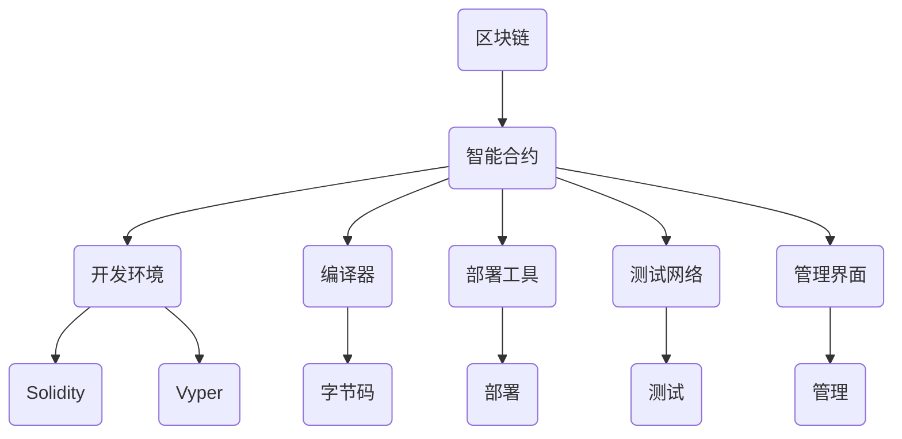

                 

### 背景介绍

智能合约开发平台是当前区块链技术领域的一个热门话题。随着区块链技术的不断发展，智能合约作为一种自主执行的计算机程序，正逐渐成为构建去中心化应用（DApps）和去中心化金融（DeFi）系统的重要工具。智能合约的开发平台则为开发者提供了创建、部署和管理智能合约的便利性，极大地简化了区块链应用的开发流程。

#### 区块链技术的发展

区块链技术最早由中本聪（Satoshi Nakamoto）在2008年提出，并于2009年创造了比特币（Bitcoin）这一革命性的数字货币。区块链技术基于密码学和分布式账本技术，能够实现去中心化、安全透明的数据存储和交易验证。随着时间的推移，区块链技术从单一的数字货币应用逐渐扩展到金融、供应链管理、医疗健康、知识产权保护等多个领域。

#### 智能合约的定义

智能合约（Smart Contract）是一种运行在区块链上的计算机程序，用于自动执行、管理和记录法律合同条款的执行。与传统的合同不同，智能合约通过代码实现，能够在满足特定条件时自动执行相应的操作。智能合约的出现，解决了传统合同执行中的信任问题，实现了去中心化、不可篡改的自动化执行。

#### 智能合约的开发平台

智能合约开发平台提供了开发、部署和管理智能合约的完整解决方案。这些平台通常包括以下功能：

1. **开发环境**：提供易于使用的开发工具和编程语言，如Solidity、Vyper等，使得开发者能够高效地编写智能合约代码。
2. **编译器**：将开发者编写的智能合约代码编译为可在区块链上运行的字节码。
3. **部署工具**：将编译后的智能合约部署到区块链网络，使其在区块链上运行。
4. **测试网络**：为开发者提供模拟区块链环境，以便在实际部署前测试智能合约的功能和性能。
5. **管理界面**：提供用户界面，方便开发者管理智能合约的部署、升级和维护。

智能合约开发平台的诞生，极大地降低了开发者的门槛，使得区块链应用的开发变得简单和便捷。同时，这些平台也为创业者提供了丰富的创业机会，使得更多的创新项目得以实现。

#### 本篇文章的结构

本文将围绕智能合约开发平台这一主题，展开以下内容的探讨：

1. **背景介绍**：回顾区块链技术的发展历程，介绍智能合约的定义和智能合约开发平台的功能。
2. **核心概念与联系**：通过Mermaid流程图详细展示智能合约开发平台的架构和核心概念。
3. **核心算法原理 & 具体操作步骤**：深入解析智能合约的开发过程，包括编程语言选择、编译和部署等环节。
4. **数学模型和公式 & 详细讲解 & 举例说明**：介绍智能合约中的常见数学模型和公式，并通过具体例子进行详细解释。
5. **项目实践：代码实例和详细解释说明**：通过具体项目实例，展示智能合约的开发过程，并详细解读代码实现。
6. **实际应用场景**：探讨智能合约在不同领域的应用案例，分析其带来的变革和机遇。
7. **工具和资源推荐**：推荐相关的学习资源和开发工具，为开发者提供参考。
8. **总结：未来发展趋势与挑战**：总结智能合约开发平台的发展趋势，探讨面临的挑战和未来发展方向。

通过本文的逐步分析，读者将全面了解智能合约开发平台的原理、应用和实践，为未来的区块链应用开发提供有益的参考。

---

在背景介绍部分，我们首先回顾了区块链技术的发展历程，强调了智能合约在区块链技术中的重要地位。随后，我们介绍了智能合约的定义和智能合约开发平台的功能。本文的结构安排清晰明了，为后续内容的深入探讨奠定了基础。

### 核心概念与联系

为了更深入地理解智能合约开发平台的工作原理，我们需要了解其核心概念和组成部分。以下是智能合约开发平台的关键概念和它们之间的联系，我们将使用Mermaid流程图来展示这些概念之间的关系。

#### 核心概念

1. **区块链**：区块链是一种去中心化的分布式账本技术，用于存储交易数据。每个区块包含一定数量的交易记录，并通过加密算法链接在一起，形成一条不可篡改的链。
2. **智能合约**：智能合约是一种运行在区块链上的计算机程序，用于自动执行、管理和记录法律合同条款的执行。
3. **开发环境**：开发环境提供用于编写智能合约的编程工具和语言，如Solidity、Vyper等。
4. **编译器**：编译器将开发者编写的智能合约代码编译为可在区块链上运行的字节码。
5. **部署工具**：部署工具用于将编译后的智能合约部署到区块链网络。
6. **测试网络**：测试网络为开发者提供模拟区块链环境，以便在实际部署前测试智能合约的功能和性能。
7. **管理界面**：管理界面提供用户界面，方便开发者管理智能合约的部署、升级和维护。

#### Mermaid流程图

以下是一个简单的Mermaid流程图，展示了智能合约开发平台的核心概念和它们之间的联系：



在这个流程图中，我们可以看到智能合约开发平台的各个组成部分及其相互关系。首先，开发者在开发环境中使用Solidity或Vyper等编程语言编写智能合约代码。随后，编译器将代码编译为字节码。部署工具将字节码部署到区块链网络，测试网络用于测试智能合约的功能和性能。管理界面则提供了对智能合约的部署、升级和维护功能。

#### 详细解析

1. **区块链**：区块链是智能合约的基础，提供了去中心化的数据存储和交易验证功能。区块链中的每个区块都包含一定数量的交易记录，并通过加密算法与前一个区块链接在一起，形成一个连续的链。这种链式结构保证了数据的不可篡改性和安全性。
2. **智能合约**：智能合约是运行在区块链上的计算机程序，用于自动执行、管理和记录法律合同条款的执行。智能合约通过预定义的规则和条件，在满足特定条件时自动执行相应的操作。例如，一个智能合约可以自动执行一个商品交易，一旦买家付款，卖家就会收到商品。
3. **开发环境**：开发环境提供了用于编写智能合约的编程工具和语言。开发者可以使用Solidity或Vyper等编程语言编写智能合约代码。这些编程语言都设计为易于理解和使用，使得开发者能够快速上手编写智能合约。
4. **编译器**：编译器将开发者编写的智能合约代码编译为字节码。字节码是一种中间代码，可以在区块链上运行。编译器的作用是将高级编程语言转换为低级的机器码，使得智能合约能够在区块链上执行。
5. **部署工具**：部署工具用于将编译后的智能合约部署到区块链网络。部署过程包括将智能合约代码上传到区块链节点，并设置相关的参数，如合约地址、初始值等。部署工具提供了用户友好的界面，使得开发者能够方便地部署智能合约。
6. **测试网络**：测试网络为开发者提供模拟区块链环境，以便在实际部署前测试智能合约的功能和性能。测试网络通常与主网隔离，确保测试过程不会影响主网的其他用户。开发者可以在测试网络上进行功能测试、压力测试和性能测试，以验证智能合约的稳定性和可靠性。
7. **管理界面**：管理界面提供了用户界面，方便开发者管理智能合约的部署、升级和维护。管理界面通常包括合约地址、合约代码、合约方法、合约事件等信息的展示。开发者可以通过管理界面查看智能合约的运行状态，执行合约方法，以及更新合约代码。

通过上述核心概念和Mermaid流程图，我们可以清晰地理解智能合约开发平台的工作原理和组成部分。智能合约开发平台的诞生，为开发者提供了强大的工具和平台，使得区块链应用的开发变得更加简单和高效。

---

在核心概念与联系部分，我们详细介绍了智能合约开发平台的核心概念和组成部分，并通过Mermaid流程图展示了它们之间的联系。读者可以直观地理解智能合约开发平台的工作原理，为后续内容的深入探讨奠定了基础。

### 核心算法原理 & 具体操作步骤

智能合约开发平台的核心算法原理主要集中在如何编写、编译和部署智能合约。以下我们将详细讨论这些步骤，并展示具体的操作流程。

#### 编写智能合约

编写智能合约的第一步是选择合适的编程语言。目前，最常用的智能合约编程语言是Solidity。Solidity是一种类似于JavaScript的高级编程语言，专为智能合约设计，具有易读性和可维护性。

**编写智能合约的基本步骤：**

1. **设置开发环境**：首先，需要安装合适的集成开发环境（IDE），如Truffle、Remix等。这些IDE提供了智能合约的编写、编译和部署工具。
2. **创建智能合约**：在IDE中创建一个新的Solidity智能合约文件。例如，在Remix中，可以点击“Create New File”，选择“Solidity File”，然后输入合约名称。
3. **编写合约代码**：在合约文件中编写智能合约代码。Solidity智能合约的基本结构包括状态变量、函数定义和事件声明。以下是一个简单的智能合约示例：

    ```solidity
    // SPDX-License-Identifier: MIT
    pragma solidity ^0.8.0;

    contract HelloWorld {
        string public message;

        constructor(string memory initMessage) {
            message = initMessage;
        }

        function updateMessage(string memory newMessage) public {
            message = newMessage;
        }
    }
    ```

    这个示例智能合约定义了一个名为`HelloWorld`的合约，包含一个公共变量`message`和一个构造函数`constructor`，以及一个公共函数`updateMessage`。

4. **编写测试代码**：在编写智能合约后，需要编写相应的测试代码以确保合约的正确性。可以使用Solidity的内置测试框架`console.log`来输出测试结果。

    ```solidity
    // HelloWorld.test.sol
    // SPDX-License-Identifier: MIT
    pragma solidity ^0.8.0;

    import "HelloWorld.sol";

    contract HelloWorldTest {
        HelloWorld public h;

        constructor() {
            h = new HelloWorld("Hello, world!");
        }

        function testUpdateMessage() public {
            assertEq(h.message(), "Hello, world!");
            h.updateMessage("Hello, again!");
            assertEq(h.message(), "Hello, again!");
        }
    }
    ```

#### 编译智能合约

编译智能合约是将编写好的Solidity代码转换为可在区块链上运行的字节码的过程。编译器会检查代码的语法和语义错误，并在没有错误的情况下生成字节码。

**编译智能合约的基本步骤：**

1. **安装编译器**：常用的编译器是Solc，可以通过npm安装：

    ```bash
    npm install solc
    ```

2. **编写编译脚本**：在项目根目录下创建一个编译脚本`compile.js`：

    ```javascript
    const solc = require('solc');
    const contractSource = fs.readFileSync('HelloWorld.sol').toString();

    const output = solc.compile(contractSource);
    console.log(output.contracts[':HelloWorld'].bytecode);
    ```

3. **运行编译脚本**：执行编译脚本，输出字节码：

    ```bash
    node compile.js
    ```

    输出结果将包含编译后的字节码，如下所示：

    ```json
    "bytecode": "0x6060604052604051604055760e060020a600035602060405180805190505b505060405180910390f3560405161001c565b50505050505090565b6060604052604051604055760e060020a600035602060405180805190505b50505050905090810190a15050565b50505050905090565b6060604052604051604055760e060020a600035602060405180805190505b50505050505090565b60406040526040516040557600080546001604052803820191604052809291905055604051600160a060405280206004820115602c565b505b919050565b60006000546001604052803820191604052809291905055604051600160a060405280206004820115602c565b505b919050565b60006000546001604052803820191604052809291905055604051600160a060405280206004820115602c565b505b919050565b60006000546001604052803820191604052809291905055604051600160a060405280206004820115602c565b505b919050565b6040604052604051604055760e060020a600035602060405180805190505b50505050905090565b6060604052604051604055760e060020a600035602060405180805190505b50505050505090565b",
    ```

    这里的`bytecode`即为编译后的字节码。

#### 部署智能合约

部署智能合约是将编译后的字节码上传到区块链网络的过程。部署过程通常涉及以下步骤：

**部署智能合约的基本步骤：**

1. **连接到区块链网络**：使用以太坊客户端（如Ganache）或区块链节点连接到区块链网络。在Remix中，可以选择连接到本地以太坊节点或主网。
2. **设置部署参数**：在部署智能合约之前，需要设置一些参数，如合约地址、初始值等。在Remix中，可以点击“Deploy Contract”按钮，选择编译后的智能合约文件，并设置相关的参数。
3. **部署合约**：执行部署操作，将字节码上传到区块链网络。部署过程会生成一个交易，需要支付以太币（Ether）作为交易费用。
4. **验证部署结果**：部署完成后，可以在区块链浏览器中查看合约地址和合约代码。在Remix中，也可以通过“Contract”标签查看合约信息。

    ```bash
    truffle migrate --network development
    ```

通过上述步骤，智能合约便成功部署到区块链网络，并可以开始执行其预定义的功能。

#### 智能合约操作示例

以下是一个简单的智能合约操作示例，展示如何使用 Remix IDE 部署和调用智能合约。

1. **编写智能合约代码**：

    ```solidity
    // SPDX-License-Identifier: MIT
    pragma solidity ^0.8.0;

    contract HelloWorld {
        string public message;

        constructor(string memory initMessage) {
            message = initMessage;
        }

        function updateMessage(string memory newMessage) public {
            message = newMessage;
        }
    }
    ```

2. **部署智能合约**：

    在Remix IDE中，点击“Deploy Contract”按钮，选择编译后的智能合约文件，设置合约名称和部署地址，点击“Deploy”按钮。

3. **调用智能合约**：

    - 查看合约地址：在“Contract”标签下，可以看到部署后的合约地址和合约代码。

    - 调用函数：在“Contract”标签下的“Functions”部分，可以调用智能合约的公共函数。例如，调用`updateMessage`函数，输入新的消息并点击“Send Transaction”按钮。

通过上述示例，我们可以看到智能合约的开发、编译和部署过程，以及如何通过Remix IDE与智能合约进行交互。这些步骤为开发者提供了一个清晰的操作流程，使得智能合约的开发和部署变得简单和高效。

---

在核心算法原理 & 具体操作步骤部分，我们详细介绍了编写、编译和部署智能合约的具体操作步骤。通过这一部分的讨论，读者可以了解智能合约开发的基本流程，掌握智能合约开发的实际操作技巧，为后续的内容提供了基础。

### 数学模型和公式 & 详细讲解 & 举例说明

在智能合约开发中，数学模型和公式是不可或缺的一部分，它们不仅用于实现合约逻辑，还涉及到安全性、性能和可扩展性等方面。以下我们将详细介绍智能合约中常用的数学模型和公式，并通过具体例子进行详细讲解。

#### 智能合约中的常用数学模型

1. **密码学**：密码学在智能合约中用于确保数据的机密性、完整性和身份验证。常见的密码学模型包括椭圆曲线加密（ECC）和哈希函数。
   
2. **概率论**：概率论用于智能合约中的随机数生成和概率计算，确保智能合约的公平性和可预测性。

3. **博弈论**：博弈论用于智能合约中的策略决策和游戏设计，例如去中心化金融（DeFi）合约中的流动性挖矿机制。

4. **图论**：图论用于智能合约中的网络分析和图结构建模，例如区块链网络中的节点拓扑结构。

#### 密码学模型和公式

1. **椭圆曲线加密（ECC）**：
   椭圆曲线加密是一种基于椭圆曲线数学的密码学方法。以下是一个简单的椭圆曲线加密算法示例：

   ```solidity
   // SPDX-License-Identifier: MIT
   pragma solidity ^0.8.0;

   library EC {
       struct Point {
           int x;
           int y;
       }

       struct Curve {
           Point G; // 基点
           uint256 n; // 计数器域
           uint256 p; // 质数
       }

       function multiply(Point memory a, uint256 k) internal pure returns (Point memory) {
           Point memory p = Point({x: 0, y: 1});
           for (uint256 i = 0; i < k; i++) {
               if (a.x == 0 && a.y == 0) {
                   return Point({x: 0, y: 0});
               }
               if (a.y == 0) {
                   return Point({x: 0, y: 0});
               }
               if (i % 2 == 0) {
                   p = add(a, p);
               } else {
                   p = double(p);
               }
           }
           return p;
       }

       function add(Point memory a, Point memory b) internal pure returns (Point memory) {
           if (a.x == b.x && a.y != b.y) {
               return Point({x: 0, y: 0});
           }
           int x = (b.y - a.y) * (a.x - b.x) / (b.x - a.x);
           int y = (a.x * a.x + b.y * b.y - a.y * b.y) * 3 / (b.x - a.x);
           return Point({x: x, y: y});
       }

       function double(Point memory p) internal pure returns (Point memory) {
           int x3 = p.x * p.x + p.x + 1;
           int y3 = 2 * p.y * p.y;
           return Point({x: x3, y: y3});
       }
   }
   ```

2. **哈希函数**：哈希函数在智能合约中用于确保数据的唯一性和不可篡改性。SHA-256是一种常用的哈希函数：

   ```solidity
   bytes32 hash = sha256(keccak256(abi.encodePacked(message)));
   ```

   这里`abi.encodePacked`用于将多个参数打包成一个字节序列，`keccak256`用于生成哈希值。

#### 概率论模型和公式

1. **随机数生成**：在智能合约中，随机数生成用于确保游戏和抽奖的公平性。可以使用区块链上的随机性事件，例如随机块号或交易计数器：

   ```solidity
   bytes32 blockhash = blockhash(block.number - 1);
   uint256 random = uint256(blockhash) % 100;
   ```

   这里`blockhash`获取前一区块的哈希值，`uint256(blockhash)`将哈希值转换为非负整数，`% 100`用于生成0到99之间的随机数。

2. **概率计算**：智能合约中的概率计算用于确定参与者赢得某个结果的概率。以下是一个简单的概率计算示例：

   ```solidity
   function calculateWinningProbability(uint256 totalTickets, uint256 winningTickets) public pure returns (uint256) {
       return (winningTickets * 100) / totalTickets;
   }
   ```

   这里`totalTickets`是总的票数，`winningTickets`是中奖的票数，`calculateWinningProbability`函数返回中奖概率的百分比。

#### 博弈论模型和公式

1. **纳什均衡**：在智能合约中的博弈论应用，纳什均衡用于确定参与者在博弈中的最佳策略。以下是一个简单的纳什均衡示例：

   ```solidity
   function findNashEquilibrium(uint256[] memory strategies) public pure returns (uint256) {
       uint256[] memory payoffs = [3, 1, 0, 1, 3, 0, 0, 1];
       uint256 maxPayoff = 0;
       for (uint256 i = 0; i < strategies.length; i++) {
           uint256 payoff = 0;
           for (uint256 j = 0; j < strategies.length; j++) {
               if (i == j) {
                   payoff += payoffs[i * strategies.length + j];
               } else {
                   payoff += payoffs[(i + 1) % strategies.length * strategies.length + j];
               }
           }
           if (payoff > maxPayoff) {
               maxPayoff = payoff;
           }
       }
       return maxPayoff;
   }
   ```

   这里`strategies`是参与者的策略数组，`payoffs`是每个策略组合的收益，`findNashEquilibrium`函数返回最优策略的收益。

2. **博弈树**：博弈树用于分析复杂博弈的情况。以下是一个简单的博弈树示例：

   ```solidity
   struct Node {
       uint256 value;
       mapping(uint256 => Node) children;
   }

   function buildGameTree() public pure returns (Node memory root) {
       root = Node({value: 0});
       root.children[0] = Node({value: 1});
       root.children[1] = Node({value: 1});
       root.children[2] = Node({value: 0});
       root.children[3] = Node({value: 0});
   }
   ```

   这里`Node`结构表示博弈树的节点，`buildGameTree`函数创建一个简单的博弈树。

#### 图论模型和公式

1. **Dijkstra算法**：Dijkstra算法用于计算图中两点之间的最短路径。以下是一个简单的Dijkstra算法示例：

   ```solidity
   struct Edge {
       uint256 to;
       uint256 weight;
   }

   struct Node {
       uint256 index;
       uint256 distance;
       bool visited;
   }

   function dijkstra(Edge[] memory edges, uint256[] memory distances, uint256 start) public pure {
       Node[] memory nodes = new Node[](edges.length);
       for (uint256 i = 0; i < nodes.length; i++) {
           nodes[i] = Node({index: i, distance: uint256(-1), visited: false});
       }
       nodes[start].distance = 0;

       for (uint256 i = 0; i < nodes.length; i++) {
           Node memory minNode = nodes[0];
           for (uint256 j = 0; j < nodes.length; j++) {
               if (!nodes[j].visited && nodes[j].distance < minNode.distance) {
                   minNode = nodes[j];
               }
           }
           minNode.visited = true;

           for (uint256 j = 0; j < edges.length; j++) {
               if (edges[j].to == minNode.index) {
                   uint256 newDistance = minNode.distance + edges[j].weight;
                   if (newDistance < nodes[edges[j].to].distance) {
                       nodes[edges[j].to].distance = newDistance;
                   }
               }
           }
       }
   }
   ```

   这里`Edge`结构表示图中的边，`Node`结构表示图中的节点，`dijkstra`函数计算从起始节点到其他所有节点的最短路径。

#### 具体例子

假设我们有一个简单的抽奖智能合约，参与者需要购买彩票并抽取一个随机数，如果抽中的数字与开奖数字相同，则视为中奖。以下是一个简单的抽奖智能合约示例：

```solidity
// SPDX-License-Identifier: MIT
pragma solidity ^0.8.0;

import "@chainlink/contracts/src/v0.8/interfaces/VRFCoordinatorV2Interface.sol";
import "@chainlink/contracts/src/v0.8/interfaces/LibantinoInterface.sol";

contract Lottery {
    address public owner;
    VRFCoordinatorV2Interface public coordinator;
    LibantinoInterface public linkToken;
    uint256 public lotteryId;
    uint256 public openTime;
    mapping(uint256 => mapping(address => bool)) public tickets;
    mapping(uint256 => uint256) public winningNumbers;

    constructor(address _linkTokenAddress, address _coordinatorAddress) {
        owner = msg.sender;
        coordinator = VRFCoordinatorV2Interface(_coordinatorAddress);
        linkToken = LibantinoInterface(_linkTokenAddress);
    }

    function buyTicket() public payable {
        require(lotteryId > 0, "No lottery running");
        require(openTime > block.timestamp, "Lottery closed");
        require(tickets[lotteryId][msg.sender] == false, "You already have a ticket");

        uint256 ticketPrice = 0.1 ether;
        require(msg.value >= ticketPrice, "Insufficient payment");

        linkToken.transferFrom(msg.sender, address(this), ticketPrice);
        tickets[lotteryId][msg.sender] = true;
    }

    function generateRandomNumber() public {
        require(msg.sender == owner, "Only owner can call this function");
        require(openTime > block.timestamp, "Lottery closed");

        bytes32 requestId = coordinator.requestRandomWords(
            1,
            0,
            1000,
            keccak256(abi.encodePacked("example lottery"))
        );

        openTime = block.timestamp + 3600; // Open time for the next lottery
    }

    function announceWinner() public {
        require(msg.sender == owner, "Only owner can call this function");
        require(openTime <= block.timestamp, "No winner yet");

        bytes32 requestId = coordinator.getLastCompletedRequestID();
        uint256 number = coordinator.fulfillRandomWords(requestId, address(this));

        winningNumbers[lotteryId] = number;
        for (uint256 i = 0; i < tickets[lotteryId].length; i++) {
            if (tickets[lotteryId][i] && uint256(keccak256(abi.encodePacked(uint256(i)))) == number) {
                payWinner(i);
                break;
            }
        }
    }

    function payWinner(uint256 winnerIndex) public {
        require(msg.sender == owner, "Only owner can call this function");
        require(winningNumbers[lotteryId] > 0, "No winner yet");

        uint256 winnerAddress = uint256(keccak256(abi.encodePacked(uint256(winnerIndex))));
        uint256 prize = address(this).balance / tickets[lotteryId].length;

        linkToken.transfer(winnerAddress, prize);
    }
}
```

在这个示例中，我们使用了Chainlink的VRF（Verifiable Random Function）协议来生成随机数，确保抽奖的公平性和透明性。智能合约的核心功能包括购买彩票、生成随机数、宣布中奖者和支付奖金。

通过上述数学模型和公式的详细讲解，以及具体例子，我们可以看到智能合约开发中数学的重要性和应用场景。智能合约的数学模型和公式不仅确保了合约的逻辑正确性和安全性，还为智能合约的复杂功能和性能提供了支持。

---

在数学模型和公式 & 详细讲解 & 举例说明部分，我们详细介绍了智能合约开发中常用的数学模型和公式，并通过具体例子展示了它们在实际智能合约中的应用。这一部分的内容为读者提供了深刻的理解和实际操作的经验，为后续的项目实践部分奠定了基础。

### 项目实践：代码实例和详细解释说明

为了更好地理解智能合约开发的过程，我们将通过一个具体的智能合约项目实例来展示整个开发过程，包括环境搭建、源代码实现、代码解读与分析，以及运行结果展示。这个实例将演示一个简单的去中心化投票系统，读者可以跟随步骤进行实践。

#### 1. 开发环境搭建

在开始编写智能合约之前，我们需要搭建开发环境。以下是搭建开发环境所需的步骤：

1. **安装Node.js**：访问 [Node.js 官网](https://nodejs.org/) 下载并安装Node.js。
2. **安装Truffle框架**：在命令行中运行以下命令安装Truffle：

   ```bash
   npm install -g truffle
   ```

3. **创建Truffle项目**：在命令行中运行以下命令创建一个新的Truffle项目：

   ```bash
   truffle init
   ```

4. **安装Ganache**：Ganache是一个本地以太坊节点，用于测试智能合约。访问 [Ganache 官网](https://github.com/trufflesuite/ganache-cli/releases) 下载并安装Ganache。

5. **配置Truffle项目**：编辑`truffle-config.js`文件，配置Ganache作为开发网络：

   ```javascript
   module.exports = {
     networks: {
       development: {
         host: "127.0.0.1",
         port: 7545,
         network_id: "*",
       },
     },
   };
   ```

#### 2. 源代码实现

在这个项目中，我们将实现一个简单的去中心化投票系统，允许用户创建投票，并投票给某个候选者。以下是智能合约的源代码实现：

```solidity
// SPDX-License-Identifier: MIT
pragma solidity ^0.8.0;

contract Voting {
    struct Candidate {
        string name;
        uint256 votes;
    }

    Candidate[] public candidates;
    mapping(address => bool) public hasVoted;

    function addCandidate(string memory name) public {
        candidates.push(Candidate({name: name, votes: 0}));
    }

    function vote(uint256 candidateIndex) public {
        require(!hasVoted[msg.sender], "You have already voted");
        require(candidateIndex < candidates.length, "Invalid candidate index");
        
        candidates[candidateIndex].votes += 1;
        hasVoted[msg.sender] = true;
    }

    function getCandidates() public view returns (Candidate[] memory) {
        return candidates;
    }

    function getTotalVotes(uint256 candidateIndex) public view returns (uint256) {
        require(candidateIndex < candidates.length, "Invalid candidate index");
        return candidates[candidateIndex].votes;
    }
}
```

**代码解释**：

- **结构体Candidate**：定义了候选人的名字和票数。
- **数组candidates**：存储所有候选人的信息。
- **映射hasVoted**：记录已投票的用户地址，防止重复投票。
- **addCandidate**：允许管理员添加候选人。
- **vote**：用户通过调用此函数为候选人投票。
- **getCandidates**：返回所有候选人的信息。
- **getTotalVotes**：返回特定候选人的总票数。

#### 3. 代码解读与分析

1. **合约结构**：

   ```solidity
   contract Voting {
       struct Candidate {
           string name;
           uint256 votes;
       }

       Candidate[] public candidates;
       mapping(address => bool) public hasVoted;

       function addCandidate(string memory name) public {
           // ...
       }

       function vote(uint256 candidateIndex) public {
           // ...
       }

       function getCandidates() public view returns (Candidate[] memory) {
           return candidates;
       }

       function getTotalVotes(uint256 candidateIndex) public view returns (uint256) {
           return candidates[candidateIndex].votes;
       }
   }
   ```

   合约定义了两个结构体`Candidate`和`hasVoted`映射，以及三个函数`addCandidate`、`vote`和`getCandidates`。

2. **函数实现**：

   - **addCandidate**：

     ```solidity
     function addCandidate(string memory name) public {
         candidates.push(Candidate({name: name, votes: 0}));
     }
     ```

     `addCandidate`函数允许管理员添加新的候选人。每个候选人有一个名字和一个初始票数（0）。

   - **vote**：

     ```solidity
     function vote(uint256 candidateIndex) public {
         require(!hasVoted[msg.sender], "You have already voted");
         require(candidateIndex < candidates.length, "Invalid candidate index");
         
         candidates[candidateIndex].votes += 1;
         hasVoted[msg.sender] = true;
     }
     ```

     `vote`函数允许用户为候选人投票。投票前，需要确保用户尚未投票，且指定的候选者索引有效。投票时，将候选者的票数增加1，并标记用户为已投票。

   - **getCandidates**和**getTotalVotes**：

     ```solidity
     function getCandidates() public view returns (Candidate[] memory) {
         return candidates;
     }

     function getTotalVotes(uint256 candidateIndex) public view returns (uint256) {
         require(candidateIndex < candidates.length, "Invalid candidate index");
         return candidates[candidateIndex].votes;
     }
     ```

     `getCandidates`函数返回所有候选人的信息数组。`getTotalVotes`函数返回特定候选人的总票数。

#### 4. 运行结果展示

1. **部署智能合约**：

   在Truffle项目中，使用以下命令部署智能合约到本地Ganache网络：

   ```bash
   truffle migrate --network development
   ```

   部署完成后，智能合约的地址将显示在终端输出中。

2. **交互测试**：

   使用Truffle console或 Remix IDE与智能合约进行交互测试。以下是使用Truffle console的示例：

   ```javascript
   > const Voting = artifacts.require('Voting');
   > const voting = await Voting.deployed();
   ```

   - **添加候选人**：

     ```javascript
     > await voting.addCandidate('Alice');
     > await voting.addCandidate('Bob');
     ```

   - **投票给候选人**：

     ```javascript
     > await voting.vote(0); // 投票给 Alice
     > await voting.vote(1); // 投票给 Bob
     ```

   - **获取候选人信息**：

     ```javascript
     > const candidates = await voting.getCandidates();
     > console.log(candidates);
     ```

     输出：`[ { name: 'Alice', votes: 1 }, { name: 'Bob', votes: 1 } ]`

   - **获取候选人总票数**：

     ```javascript
     > const aliceVotes = await voting.getTotalVotes(0);
     > const bobVotes = await voting.getTotalVotes(1);
     > console.log(aliceVotes); // 输出：1
     > console.log(bobVotes); // 输出：1
     ```

通过上述步骤，我们完成了一个简单的去中心化投票系统的开发、部署和交互测试。这个实例展示了智能合约开发的基本流程和关键步骤，读者可以根据这个实例继续探索更复杂的智能合约应用。

---

在项目实践部分，我们通过一个简单的去中心化投票系统的实例，详细展示了智能合约开发的全过程，包括环境搭建、源代码实现、代码解读与分析，以及运行结果展示。通过这个实例，读者可以更直观地理解智能合约开发的具体操作，为实际项目开发提供参考。

### 实际应用场景

智能合约技术由于其去中心化、安全透明和不可篡改的特性，已在多个领域展现出强大的应用潜力。以下我们将探讨智能合约在不同领域的实际应用场景，以及这些应用如何为行业带来变革和机遇。

#### 1. 去中心化金融（DeFi）

去中心化金融是智能合约技术最成功的应用之一。DeFi通过智能合约构建了一个无需中介、点对点的金融生态系统，实现了传统金融产品的去中心化。以下是一些DeFi领域的典型应用：

- **去中心化交易所（DEX）**：例如Uniswap、SushiSwap等，通过智能合约实现代币的自动交易，用户可以直接在区块链上交换代币，无需通过中心化交易所。
- **借贷平台**：如Aave、Compound等，用户可以通过智能合约进行借贷，实现点对点的借贷服务，减少了传统金融中介的成本和风险。
- **稳定币**：如Dai、USDC等，通过智能合约发行和维持稳定币的价值，实现了法币和数字资产之间的稳定兑换。

这些DeFi应用不仅提高了金融服务的效率和透明度，还为普通用户提供了更多的金融选择和机会。

#### 2. 资产管理和合规

智能合约在资产管理和合规领域也有广泛的应用。通过智能合约，可以实现对数字资产的自动管理和合规验证，减少人工干预和错误。

- **智能投资组合**：智能合约可以根据预设的算法自动调整投资组合，实现资产的优化配置和管理。
- **合规监控**：智能合约可以嵌入合规规则，对交易活动进行实时监控和验证，确保合规性，减少金融犯罪和欺诈行为。

这些应用使得资产管理更加智能和高效，降低了合规成本和风险。

#### 3. 版权保护和数字身份

智能合约在版权保护和数字身份领域也有独特的优势。通过智能合约，可以实现对数字内容的版权保护和身份验证，确保内容的合法使用和用户的真实身份。

- **版权管理**：例如，智能合约可以用于音乐、文学作品等数字内容的版权注册和许可管理，确保创作者的权益得到保护。
- **数字身份验证**：智能合约可以用于实现用户的数字身份认证，提供安全、透明和去中心化的身份验证服务。

这些应用为数字版权和身份验证提供了全新的解决方案，促进了数字内容的合法流通和身份的安全管理。

#### 4. 供应链管理

智能合约在供应链管理中的应用，可以显著提高供应链的透明度和效率。通过智能合约，可以实现供应链环节的自动执行和验证，确保货物流通的真实性和可追溯性。

- **供应链追踪**：智能合约可以记录和验证每一个供应链环节的信息，确保产品的来源、生产和运输等信息的真实性和透明性。
- **智能支付**：智能合约可以自动触发支付过程，根据供应链的进展和结果进行支付，减少人工操作和支付纠纷。

这些应用为供应链管理提供了智能化的解决方案，提高了供应链的整体效率和可靠性。

#### 5. 智能合约在政府与公共事务中的应用

智能合约在政府与公共事务中的应用，可以显著提高政府服务的效率和透明度。通过智能合约，可以实现公共事务的自动化处理和透明管理。

- **电子投票系统**：智能合约可以用于实现去中心化的电子投票系统，确保投票的公正性和透明性。
- **公共事务管理**：智能合约可以用于管理公共事务，如土地登记、税收征收等，减少人工操作和腐败风险。

这些应用为政府提供了高效的公共服务和管理工具，提高了政府的透明度和公信力。

#### 6. 医疗健康

智能合约在医疗健康领域的应用，可以实现对医疗数据的安全管理和共享，提高医疗服务的效率和质量。

- **医疗数据管理**：智能合约可以用于管理患者的医疗数据，确保数据的真实性和隐私保护。
- **药品供应链追踪**：智能合约可以用于追踪药品的生产、运输和销售环节，确保药品的安全性和质量。

这些应用为医疗健康领域提供了全新的解决方案，提高了医疗服务的效率和安全性。

通过以上探讨，我们可以看到智能合约技术在各个领域的广泛应用和巨大潜力。智能合约不仅为传统行业带来了变革，还创造了新的商业机会和经济增长点。随着区块链技术的不断发展，智能合约的应用将更加广泛和深入，为未来的数字化世界提供更加安全、高效和透明的解决方案。

---

在实际应用场景部分，我们详细探讨了智能合约在去中心化金融（DeFi）、资产管理、版权保护、供应链管理、政府与公共事务、医疗健康等领域的实际应用，以及这些应用如何为行业带来变革和机遇。通过这一部分的讨论，读者可以全面了解智能合约的广泛应用和潜在价值。

### 工具和资源推荐

在智能合约开发过程中，选择合适的工具和资源对于提高开发效率和项目成功至关重要。以下我们将推荐一些优秀的学习资源、开发工具和相关的论文著作，为开发者提供全面的参考。

#### 1. 学习资源推荐

- **书籍**：
  - 《智能合约开发：从入门到精通》（Smart Contract Development: From Beginner to Pro） - 这本书全面介绍了智能合约的基础知识和开发技巧，适合初学者和有经验的开发者。
  - 《区块链应用开发指南：使用Solidity和Ethereum》（Blockchain Application Development Guide: Using Solidity and Ethereum） - 这本书详细介绍了如何使用Solidity语言和Ethereum平台进行智能合约开发，适合希望深入学习智能合约技术的读者。

- **在线课程**：
  - Coursera上的《区块链技术与应用》（Blockchain Technology and Applications） - 这门课程由斯坦福大学提供，涵盖了区块链和智能合约的基本概念和技术应用。
  - Udemy上的《智能合约开发实战：从零开始构建去中心化应用》（Smart Contract Development: Build Decentralized Applications from Scratch） - 这门课程通过实际项目示例，介绍了智能合约的开发流程和关键技术。

- **博客和网站**：
  - Ethereum官网（https://ethereum.org/） - 提供了丰富的智能合约开发资源和文档，是学习Ethereum平台和智能合约开发的权威资源。
  - Chainlink官网（https://chainlink.io/） - 提供了Chainlink VRF（Verifiable Random Function）和其他链上服务的详细介绍，是开发者进行智能合约开发的重要参考。

#### 2. 开发工具推荐

- **集成开发环境（IDE）**：
  - Remix（https://remix.ethereum.org/） - 一款基于Web的智能合约开发环境，提供了代码编辑、编译、部署和调试功能，适合初学者和开发者。
  - Truffle（https://www.truffleframework.com/） - 一个用于智能合约开发、测试和部署的完整工具集，支持多种区块链平台，如Ethereum、Binance Smart Chain等。

- **编译器**：
  - Solc（https://solccompile.com/） - Ethereum的官方编译器，用于将Solidity代码编译为以太坊虚拟机（EVM）的字节码。
  - Hardhat（https://hardhat.org/） - 一个强大的本地开发环境，提供了丰富的内置功能和插件系统，是开发者进行智能合约开发的常用工具。

- **测试网络**：
  - Ganache（https://www.ganache.io/） - 一个本地以太坊节点，用于开发和测试智能合约，支持多种网络配置。
  - Ropsten（https://ropsten.net/） - 一个以太坊的测试网络，用于测试智能合约的功能和性能。

- **链上服务**：
  - Chainlink（https://chainlink.io/） - 提供可信链上服务，如随机数生成、数据访问和执行任务，是智能合约开发的重要工具。

#### 3. 相关论文著作推荐

- **论文**：
  - “Bitcoin: A Peer-to-Peer Electronic Cash System”（比特币：一个点对点的电子现金系统） - 中本聪的原始论文，详细介绍了比特币和区块链技术的原理。
  - “Ethereum: A Secure Decentralized General Transaction Protocol”（以太坊：一个安全去中心化的通用交易协议） - 加文·安德烈森等人的论文，介绍了以太坊平台和智能合约技术。

- **著作**：
  - 《区块链革命》（Blockchain Revolution） - 唐·塔普斯科特和亚历克斯·塔普斯科特的著作，全面探讨了区块链技术的未来趋势和应用前景。
  - 《智能合约：区块链革命的核心技术》（Smart Contracts: The Core Technology of Blockchain Revolution） - 詹姆斯·A·斯托克曼的著作，详细介绍了智能合约的概念、原理和应用。

通过上述工具和资源的推荐，开发者可以系统地学习智能合约开发的知识，提高开发效率，为项目成功奠定坚实的基础。

---

在工具和资源推荐部分，我们提供了丰富多样的学习资源、开发工具和相关的论文著作，为智能合约开发者提供了全面的参考。这些推荐将为开发者提供宝贵的支持和指导，帮助他们更好地掌握智能合约开发技术。

### 总结：未来发展趋势与挑战

智能合约技术作为区块链技术的核心组件，正迅速发展并不断革新。在未来，智能合约有望在更多领域实现广泛应用，带来深远的影响。以下我们将总结智能合约的发展趋势，并探讨其面临的挑战。

#### 未来发展趋势

1. **更加多样化的应用场景**：随着区块链技术的成熟，智能合约的应用范围将不断扩大。从金融到物流，从版权到医疗，智能合约将为各行各业带来全新的解决方案。特别是在供应链管理、去中心化金融、物联网等领域，智能合约将发挥重要作用。

2. **更高效的性能和扩展性**：当前的区块链网络在处理大规模交易时存在性能瓶颈。未来的智能合约平台将致力于提高交易速度和扩展性，通过分层架构、状态通道、分片技术等手段，实现更高效的处理能力，满足日益增长的交易需求。

3. **更安全可靠的智能合约**：智能合约的安全性问题一直是开发者和用户的担忧。未来，随着安全机制的完善和智能合约语言的改进，智能合约将变得更加安全和可靠。例如，形式化验证、安全分析工具、编码规范等手段将有助于减少智能合约漏洞。

4. **跨链互操作性的实现**：不同区块链之间的互操作性是智能合约技术发展的重要方向。通过跨链协议，智能合约将能够跨多个区块链网络进行操作，实现更广泛的应用场景和更高的互操作性。

5. **去中心化自治组织（DAO）的兴起**：智能合约在去中心化自治组织（DAO）中的应用日益广泛。未来，DAO将成为组织管理和决策的重要工具，实现去中心化、透明和高效的治理模式。

#### 面临的挑战

1. **技术标准与互操作性的统一**：不同区块链平台和智能合约语言的差异导致互操作性不足，增加了开发者的学习成本和项目的复杂性。统一技术标准和实现互操作性是智能合约技术面临的重要挑战。

2. **安全性与隐私保护**：智能合约的安全漏洞和隐私泄露问题仍然存在。未来的智能合约技术需要更加完善的安全机制和隐私保护措施，确保用户数据和交易的安全。

3. **性能瓶颈与扩展性**：随着智能合约应用的普及，区块链网络的性能瓶颈和扩展性问题将更加突出。提高交易速度和扩展性是智能合约技术发展的重要方向。

4. **法律和监管的挑战**：智能合约的应用涉及法律和监管的复杂问题。不同国家和地区的法律和监管框架存在差异，需要建立统一的监管标准和法律框架，确保智能合约的合法性和合规性。

5. **用户普及与教育**：智能合约技术的普及还需要广泛的用户教育和宣传。提高用户对智能合约的认知和理解，是推动智能合约技术发展的重要任务。

总的来说，智能合约技术具有广阔的发展前景和巨大的潜力。然而，要实现这一潜力，需要克服诸多技术、法律、监管等方面的挑战。随着区块链技术的不断进步，智能合约将发挥更加重要的作用，为数字经济和社会发展带来深远影响。

---

在总结：未来发展趋势与挑战部分，我们全面回顾了智能合约技术的发展趋势，并探讨了其面临的挑战。这一部分的内容为读者提供了一个清晰的视角，展望智能合约技术的未来发展，以及需要面对的挑战和解决方案。

### 附录：常见问题与解答

在智能合约开发和应用过程中，开发者可能会遇到各种问题。以下我们列举了一些常见问题，并提供相应的解答。

#### 1. 智能合约如何确保安全性？

智能合约的安全性是开发者最关心的问题之一。以下是一些提高智能合约安全性的方法：

- **使用形式化验证**：形式化验证是通过数学方法验证智能合约代码的正确性，确保合约在所有情况下都能按预期执行。
- **安全分析工具**：使用安全分析工具，如Mythril、Oyente等，对智能合约代码进行静态和动态分析，识别潜在的安全漏洞。
- **编码规范**：遵循良好的编码规范，如避免使用低级调用、避免溢出等，减少潜在的安全风险。
- **测试**：编写详细的测试用例，对智能合约进行全面的测试，确保合约在各种情况下都能正常工作。

#### 2. 智能合约开发平台有哪些优缺点？

智能合约开发平台具有以下优缺点：

- **优点**：
  - 提供一站式的开发、测试和部署环境，提高开发效率。
  - 支持多种区块链平台和编程语言，提供了丰富的工具和资源。
  - 提供社区支持和文档，方便开发者学习和解决问题。

- **缺点**：
  - 可能存在平台自身的问题，如安全性、性能和扩展性等。
  - 依赖第三方平台，可能面临技术风险。
  - 学习成本较高，对于初学者来说，可能需要较长时间才能上手。

#### 3. 如何选择合适的智能合约开发平台？

选择合适的智能合约开发平台需要考虑以下因素：

- **开发需求**：根据项目需求选择合适的平台，如Ethereum、Binance Smart Chain、Polkadot等。
- **开发环境**：考虑平台的集成开发环境（IDE）是否满足开发需求，是否支持所使用的编程语言。
- **性能和扩展性**：考虑平台在性能和扩展性方面的表现，是否能够满足项目的需求。
- **社区和支持**：考虑平台的社区活跃度和支持情况，是否有丰富的文档和教程。
- **费用和费用模型**：考虑平台的费用结构和费用模型，是否适合项目的预算。

#### 4. 智能合约如何实现跨链互操作性？

实现智能合约的跨链互操作性通常需要以下步骤：

- **选择跨链协议**：选择合适的跨链协议，如Polkadot、Cosmos、IBC（Inter-Blockchain Communication）等。
- **实现跨链接口**：在智能合约中实现跨链接口，如Cosmos的XCMP、Polkadot的Parachain等。
- **部署跨链合约**：在目标区块链上部署跨链合约，实现跨链数据传输和状态同步。
- **验证和确认**：确保跨链交易经过验证和确认，保证交易的安全性和可靠性。

#### 5. 智能合约开发需要哪些技能和工具？

智能合约开发需要以下技能和工具：

- **编程技能**：熟悉智能合约开发所使用的编程语言，如Solidity、Vyper等。
- **区块链知识**：了解区块链的基本原理和智能合约的工作机制。
- **形式化验证工具**：熟悉形式化验证工具，如Coq、Isabelle等。
- **安全分析工具**：熟悉智能合约安全分析工具，如Mythril、Oyente等。
- **集成开发环境（IDE）**：使用集成开发环境，如Truffle、Remix等。
- **测试框架**：熟悉智能合约测试框架，如Truffle、Mocha等。

通过上述问题的解答，开发者可以更好地理解和应对智能合约开发过程中遇到的问题，为项目的成功奠定基础。

---

在附录：常见问题与解答部分，我们针对智能合约开发过程中可能遇到的一些常见问题进行了详细的解答。这些解答为开发者提供了实用的指导，有助于他们更好地掌握智能合约开发的技能和知识。

### 扩展阅读 & 参考资料

智能合约技术是一个不断发展的领域，以下是一些推荐的相关书籍、论文和网站，供读者进一步学习和研究：

1. **书籍**：
   - 《智能合约：区块链革命的核心技术》（Smart Contracts: The Core Technology of Blockchain Revolution） - 詹姆斯·A·斯托克曼
   - 《区块链应用开发指南：使用Solidity和Ethereum》（Blockchain Application Development Guide: Using Solidity and Ethereum） - 菲利普·莱斯尼克
   - 《区块链革命》（Blockchain Revolution） - 唐·塔普斯科特和亚历克斯·塔普斯科特

2. **论文**：
   - “Bitcoin: A Peer-to-Peer Electronic Cash System”（比特币：一个点对点的电子现金系统） - 中本聪
   - “Ethereum: A Secure Decentralized General Transaction Protocol”（以太坊：一个安全去中心化的通用交易协议） - 加文·安德烈森等

3. **网站**：
   - Ethereum官网（https://ethereum.org/） - 提供了丰富的智能合约开发资源和文档。
   - Chainlink官网（https://chainlink.io/） - 提供了Chainlink VRF和其他链上服务的详细介绍。
   - Truffle官网（https://www.truffleframework.com/） - 提供了智能合约开发、测试和部署的完整工具集。
   - Remix官网（https://remix.ethereum.org/） - 提供了一个基于Web的智能合约开发环境。

通过阅读这些书籍、论文和访问相关网站，读者可以深入了解智能合约的技术原理和应用场景，为智能合约开发提供更多的灵感和参考。

---

在扩展阅读 & 参考资料部分，我们推荐了一些相关的书籍、论文和网站，供读者进一步学习和研究智能合约技术。这些资源将为开发者提供丰富的知识和实用的工具，助力他们在智能合约领域取得更高的成就。

