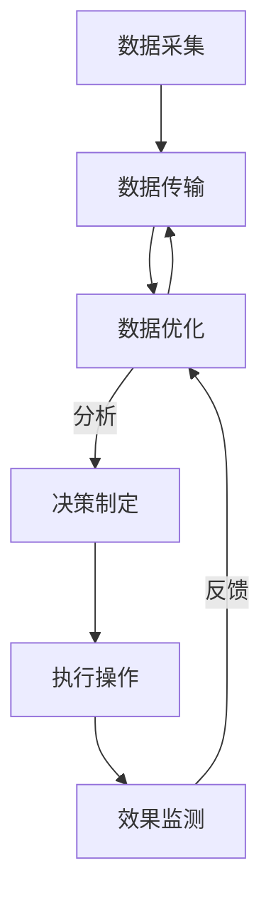

                 

### 1. 背景介绍

随着科技的飞速发展，智能园艺机器人正逐渐走入大众的视野。这些机器人利用先进的传感器技术、人工智能算法以及自动化控制系统，为园艺工作者提供了前所未有的便利。从简单的自动浇水设备到复杂的自动化果园管理系统，智能园艺机器人的应用场景越来越广泛。

首先，智能园艺机器人的起源可以追溯到20世纪中期，随着计算机技术和传感器技术的逐渐成熟，人们开始尝试将自动化技术应用到农业生产中。最初的智能园艺机器人主要是用于简单的环境监测和数据处理，如温度、湿度、光照等。随着技术的不断进步，这些机器人逐渐具备了更多的功能，如自动浇水、除草、施肥、甚至包括病虫害监测和防治。

当前，智能园艺机器人已经成为现代农业的重要组成部分。它们不仅能够显著提高农业生产效率，降低人力成本，还能通过精准管理，提升农产品的质量和产量。例如，在一些先进的果园和茶园中，智能园艺机器人已经完全取代了传统的人工管理，实现了从播种到收获的全过程自动化。

智能园艺机器人市场的快速扩展，也吸引了大量创业公司的关注。这些公司致力于开发更先进、更智能的园艺机器人，以满足不断增长的市场需求。从初创企业到大型科技公司，智能园艺机器人的研发和应用已经成为一个热门领域。

总的来说，智能园艺机器人不仅代表了现代农业技术的发展趋势，也为创业者提供了丰富的商机。随着技术的不断进步，我们有理由相信，智能园艺机器人将在未来发挥更加重要的作用，为农业生产和可持续发展做出更大贡献。

#### 当前智能园艺机器人的市场规模与未来增长潜力

目前，智能园艺机器人市场正处于快速增长阶段。根据市场研究机构的报告，全球智能园艺机器人市场规模预计将从2020年的约10亿美元增长到2025年的50亿美元，年复合增长率达到25%以上。这一数据充分反映了智能园艺机器人市场的巨大潜力和广阔前景。

从地区分布来看，北美和欧洲是智能园艺机器人市场的主要驱动力。这些地区的消费者对高科技产品和自动化技术的接受度较高，同时农业产业现代化程度较高，为智能园艺机器人的应用提供了良好的土壤。亚洲市场也具有巨大的增长潜力，尤其是在中国、日本和韩国等国家，随着农业产业升级和消费者对高品质农产品的需求不断增加，智能园艺机器人的市场前景看好。

智能园艺机器人的快速增长不仅仅是因为市场的需求，更得益于技术的不断进步。传感器技术、人工智能算法、云计算和物联网技术的快速发展，使得智能园艺机器人的功能更加全面，操作更加智能化。例如，先进的传感器可以实时监测土壤湿度、温度和养分含量，并通过云计算平台将数据传输到中央控制系统，以便进行精准管理。

此外，随着5G网络的普及，智能园艺机器人将能够实现更加高效的数据传输和实时控制。这将使得智能园艺机器人在远程监控、远程操作以及跨区域协同作业等方面发挥更大的作用。例如，农业专家可以通过5G网络实时远程监控园艺机器人的工作状态，并进行远程故障排除和操作指导，大大提高了生产效率。

未来，智能园艺机器人市场的增长潜力还体现在新兴应用场景的拓展上。除了传统的果园、茶园等作物种植领域，智能园艺机器人也开始进入蔬菜大棚、温室种植等场景。在这些环境中，智能园艺机器人可以发挥更大的作用，如自动调节温湿度、控制光照强度、监测病虫害等，为农业生产提供更加精准和高效的管理方案。

总的来说，智能园艺机器人市场具有巨大的增长潜力，其应用场景将不断拓展，技术也将持续进步。随着市场的不断扩大，智能园艺机器人将为农业生产带来更高的效率、更好的质量和更大的经济效益。

#### 创业公司开发智能园艺机器人的主要动机

创业公司开发智能园艺机器人的主要动机多种多样，但主要可以归结为以下几点：

首先，市场需求是推动创业公司开发智能园艺机器人的最主要动力。随着消费者对高品质农产品的需求不断增加，农业生产需要更加高效、精准的管理方式来满足市场需求。智能园艺机器人能够通过自动化和智能化的手段，显著提高农业生产效率，降低人力成本，提高农产品的质量和产量，从而满足市场的需求。

其次，技术进步也为创业公司提供了良好的开发基础。传感器技术、人工智能算法、云计算和物联网技术的快速发展，使得智能园艺机器人的功能越来越全面，操作越来越智能化。创业公司可以利用这些先进技术，开发出具有竞争力的智能园艺机器人产品，满足不同客户的需求。

第三，创业公司希望通过智能园艺机器人打造差异化竞争优势。在激烈的市场竞争中，创业公司需要通过提供独特的产品和服务来脱颖而出。智能园艺机器人作为一种创新产品，可以为客户提供更加高效、智能的解决方案，从而在市场中建立自己的品牌和竞争优势。

第四，政策支持也是创业公司开发智能园艺机器人的重要动力。许多国家和地区政府为了推动农业现代化和可持续发展，出台了一系列支持政策，包括资金补贴、税收优惠、技术研发支持等。这些政策为创业公司提供了良好的发展环境，鼓励其加大研发投入，推动智能园艺机器人的发展。

最后，创业公司希望通过智能园艺机器人实现商业成功和社会价值。智能园艺机器人不仅能够为企业带来经济效益，还能够促进农业现代化，提高农民的收入水平，推动农村经济发展。创业公司通过开发智能园艺机器人，不仅实现了商业上的成功，也为社会做出了贡献。

总的来说，市场需求、技术进步、政策支持和商业成功等多方面因素共同驱动着创业公司开发智能园艺机器人。这些动机不仅推动了智能园艺机器人技术的发展，也为农业生产和农村经济发展带来了新的机遇。

### 2. 核心概念与联系

#### 智能园艺机器人的核心概念

智能园艺机器人是集成了多种先进技术的多功能设备，其核心概念包括但不限于传感器技术、人工智能（AI）算法、自动化控制系统等。以下是这些核心概念的详细解释：

1. **传感器技术**：传感器是智能园艺机器人的“感官”，可以监测土壤湿度、温度、养分含量、空气中的二氧化碳浓度等多种环境参数。这些传感器通过实时采集环境数据，为后续的决策提供基础。

2. **人工智能算法**：智能园艺机器人使用人工智能算法对传感器采集到的数据进行处理和分析，以实现自动决策。常见的算法包括机器学习、深度学习等，它们可以训练模型，识别病虫害、预测天气变化等，从而优化园艺管理。

3. **自动化控制系统**：自动化控制系统是智能园艺机器人的“大脑”，负责根据人工智能算法的决策，控制机器人的行动。例如，当土壤湿度低于设定值时，控制系统会指令浇水设备进行浇水。

#### 智能园艺机器人的工作原理

智能园艺机器人的工作原理可以概括为以下几个步骤：

1. **数据采集**：机器人通过传感器实时采集土壤、空气等环境数据。

2. **数据处理**：将采集到的数据传输到中央处理单元，使用人工智能算法进行数据处理和分析。

3. **决策制定**：根据分析结果，人工智能算法制定出相应的园艺管理方案。

4. **执行操作**：控制系统根据决策指令，自动执行浇水、施肥、除草等操作。

5. **反馈与优化**：执行后的效果通过传感器进行监测，并根据反馈数据进行优化调整。

#### Mermaid 流程图

以下是智能园艺机器人的工作流程的 Mermaid 流程图，用于更直观地展示其工作原理：



在这个流程图中，传感器技术、人工智能算法和自动化控制系统相互协作，形成一个闭环控制系统，确保智能园艺机器人能够高效、精准地完成各项任务。

#### 智能园艺机器人在园艺维护中的应用

智能园艺机器人在园艺维护中的应用非常广泛，以下是一些关键应用场景：

1. **自动浇水系统**：利用土壤湿度传感器，智能园艺机器人可以自动调节浇水量，确保植物得到适量的水分。

2. **自动施肥系统**：通过分析土壤养分含量，智能园艺机器人可以精确计算并施放合适的肥料，避免过量或不足。

3. **病虫害监测与防治**：智能园艺机器人配备图像识别系统，可以自动识别病虫害，并采取相应的防治措施。

4. **除草系统**：利用红外传感器和GPS定位，智能园艺机器人可以自动识别杂草并进行除草操作。

5. **环境监测**：实时监测温度、湿度、光照等环境参数，为植物生长提供最佳环境条件。

通过这些应用，智能园艺机器人不仅提高了园艺管理的效率，还显著降低了人力成本，为现代农业的发展带来了新的机遇。

### 3. 核心算法原理 & 具体操作步骤

智能园艺机器人的核心算法是其实现高效、精准园艺管理的关键。以下将详细介绍智能园艺机器人常用的核心算法原理及其具体操作步骤。

#### 3.1 传感器数据处理算法

传感器数据处理算法是智能园艺机器人能够准确获取环境信息的基础。以下是该算法的具体原理和操作步骤：

##### 3.1.1 算法原理

传感器数据处理算法的核心在于对多源传感器数据进行融合、去噪、滤波等处理，以获得准确的环境信息。常见的传感器包括土壤湿度传感器、温度传感器、光照传感器等。

##### 3.1.2 具体操作步骤

1. **数据采集**：智能园艺机器人通过传感器实时采集土壤湿度、温度、光照等环境数据。

2. **数据预处理**：对采集到的数据进行预处理，包括去除异常值、滤波处理等，以减少噪声干扰。

3. **数据融合**：将不同传感器采集的数据进行融合，形成全面的环境数据集。

4. **特征提取**：对融合后的数据集进行特征提取，提取出对植物生长有重要影响的关键特征，如土壤湿度、温度、光照强度等。

5. **模型训练**：利用提取的特征数据，训练机器学习模型，如支持向量机（SVM）、随机森林（Random Forest）等，用于环境参数的预测和分类。

6. **结果输出**：根据训练好的模型，对实时采集的数据进行预测和分类，输出环境参数的实时状态。

#### 3.2 人工智能算法在园艺管理中的应用

人工智能算法在园艺管理中的应用主要包括病虫害监测、天气预测、决策支持等。以下以病虫害监测为例，详细说明其算法原理和操作步骤：

##### 3.2.1 算法原理

病虫害监测利用图像识别技术，通过识别植物叶片、果实等部位的异常现象，判断是否存在病虫害。常用的图像识别算法包括卷积神经网络（CNN）和深度学习等。

##### 3.2.2 具体操作步骤

1. **数据采集**：通过摄像头或图像传感器，智能园艺机器人采集植物叶片、果实等图像。

2. **图像预处理**：对采集到的图像进行预处理，包括去噪、缩放、灰度化等，以提高图像质量。

3. **特征提取**：利用深度学习算法，如卷积神经网络（CNN），对预处理后的图像进行特征提取。

4. **模型训练**：利用提取的特征数据，训练分类模型，如支持向量机（SVM）、卷积神经网络（CNN）等，用于病虫害的识别和分类。

5. **结果输出**：根据训练好的模型，对实时采集的图像进行病虫害识别，输出检测结果。

#### 3.3 自动化控制算法

自动化控制算法是智能园艺机器人执行具体园艺操作的核心。以下以自动浇水系统为例，详细说明其算法原理和操作步骤：

##### 3.3.1 算法原理

自动浇水系统通过实时监测土壤湿度，根据设定值自动调节浇水时间和浇水量，以确保植物得到适量的水分。常用的控制算法包括PID控制算法等。

##### 3.3.2 具体操作步骤

1. **数据采集**：智能园艺机器人通过土壤湿度传感器采集土壤湿度数据。

2. **设定阈值**：根据植物的生长需求和环境条件，设定土壤湿度的高限和低限阈值。

3. **状态判断**：根据实时采集的土壤湿度数据，判断是否需要浇水。

4. **调节浇水量**：根据判断结果，自动调节浇水设备的工作时间和浇水量。

5. **反馈与优化**：根据浇水后的土壤湿度变化，进行反馈和优化，以实现更加精准的浇水控制。

#### 3.4 模糊控制算法

模糊控制算法在智能园艺机器人中用于处理非线性、复杂的环境问题。以下以环境监测为例，详细说明其算法原理和操作步骤：

##### 3.4.1 算法原理

模糊控制算法通过模糊逻辑，对不确定、模糊的信息进行处理，以实现对环境的智能调控。该算法特别适用于环境监测、病虫害防治等场景。

##### 3.4.2 具体操作步骤

1. **环境数据采集**：智能园艺机器人通过传感器采集环境数据，如温度、湿度、光照强度等。

2. **模糊化处理**：将采集到的环境数据模糊化处理，将其转化为模糊集合。

3. **模糊推理**：利用模糊规则库，对模糊化后的环境数据进行推理，生成控制指令。

4. **去模糊化处理**：将模糊推理结果去模糊化处理，转化为具体的控制参数。

5. **执行控制指令**：根据去模糊化后的控制参数，调整园艺机器人的操作，实现对环境的智能调控。

通过以上核心算法原理和具体操作步骤的详细介绍，我们可以看到智能园艺机器人是如何通过一系列的算法实现高效、精准的园艺管理。这些算法不仅提高了生产效率，还显著降低了人力成本，为现代农业的发展带来了新的机遇。

### 4. 数学模型和公式 & 详细讲解 & 举例说明

在智能园艺机器人的设计和应用中，数学模型和公式起着至关重要的作用。这些模型和公式不仅能够帮助我们更准确地描述植物生长的环境因素，还能优化园艺机器人的控制策略，提升生产效率和作物质量。以下将详细介绍智能园艺机器人常用的数学模型和公式，并进行详细讲解和举例说明。

#### 4.1 土壤湿度模型

土壤湿度是影响植物生长的重要因素之一。为了准确监测土壤湿度，我们通常使用以下模型：

$$
h(t) = \frac{1}{\frac{1}{K} + \frac{V}{\rho \cdot A} + \frac{W}{C \cdot t}}
$$

其中：
- \( h(t) \) 表示时间 \( t \) 时的土壤湿度（以百分比表示）。
- \( K \) 是土壤的导水率（通常单位为 cm/s）。
- \( V \) 是土壤的体积（通常单位为 cm³）。
- \( \rho \) 是土壤的密度（通常单位为 g/cm³）。
- \( A \) 是土壤的横截面积（通常单位为 cm²）。
- \( W \) 是土壤中的水分含量（通常单位为 g）。
- \( C \) 是土壤的容量（通常单位为 cm³/g）。

**详细讲解**：该模型基于达西定律，描述了土壤水分的动态变化。当土壤中的水分含量发生变化时，土壤湿度也会相应变化。该公式通过计算土壤中水分的动态分布，帮助我们预测土壤湿度。

**举例说明**：假设一块土壤的体积为2000 cm³，密度为1.5 g/cm³，导水率为0.1 cm/s，容量为2 cm³/g。如果在第10分钟时，土壤中的水分含量为200 g，计算此时的土壤湿度。

$$
h(10) = \frac{1}{\frac{1}{0.1} + \frac{2000}{1.5 \cdot 2000} + \frac{200}{2 \cdot 10}} = 50\%
$$

因此，在第10分钟时，土壤湿度为50%。

#### 4.2 光照强度模型

光照强度是植物生长的另一关键因素。以下模型用于描述植物叶片吸收的光照强度：

$$
I_{\text{absorbed}} = I_{0} \cdot e^{-k \cdot d}
$$

其中：
- \( I_{\text{absorbed}} \) 表示植物叶片吸收的光照强度（通常单位为 mol/(m²·s)）。
- \( I_{0} \) 是入射光照强度（通常单位为 mol/(m²·s)）。
- \( k \) 是叶片的光吸收系数（通常单位为 1/m）。
- \( d \) 是叶片到光源的距离（通常单位为 m）。

**详细讲解**：该模型基于朗伯-比尔定律，描述了光照强度随距离衰减的过程。当光源距离叶片较远时，光照强度会显著降低。通过该模型，我们可以计算植物在不同距离下吸收的光照强度。

**举例说明**：假设植物叶片到光源的距离为2 m，入射光照强度为1000 mol/(m²·s)，叶片的光吸收系数为0.05 1/m。计算叶片吸收的光照强度。

$$
I_{\text{absorbed}} = 1000 \cdot e^{-0.05 \cdot 2} = 917.5 \text{ mol/(m²·s)}
$$

因此，叶片吸收的光照强度为917.5 mol/(m²·s)。

#### 4.3 水分蒸发模型

水分蒸发是土壤中水分流失的一个重要过程。以下模型用于描述土壤水分的蒸发速度：

$$
E = \frac{\rho \cdot C \cdot A \cdot h \cdot (1 - \frac{h(t)}{h_{\text{max}}})}{K \cdot t}
$$

其中：
- \( E \) 是水分蒸发速率（通常单位为 cm/s）。
- \( \rho \) 是土壤的密度（通常单位为 g/cm³）。
- \( C \) 是土壤的容量（通常单位为 cm³/g）。
- \( A \) 是土壤的横截面积（通常单位为 cm²）。
- \( h(t) \) 是时间 \( t \) 时的土壤湿度（通常单位为百分比）。
- \( h_{\text{max}} \) 是土壤的最大湿度（通常单位为百分比）。
- \( K \) 是土壤的导水率（通常单位为 cm/s）。
- \( t \) 是时间（通常单位为 s）。

**详细讲解**：该模型基于费克定律，描述了水分在土壤中的扩散过程。当土壤湿度低于最大湿度时，水分会以一定速率蒸发。该模型通过计算土壤中水分的动态变化，帮助我们预测水分蒸发速率。

**举例说明**：假设土壤的密度为1.5 g/cm³，容量为2 cm³/g，横截面积为200 cm²，导水率为0.1 cm/s，土壤湿度当前为40%，最大湿度为80%，时间间隔为1小时。计算此时间段内的水分蒸发速率。

$$
E = \frac{1.5 \cdot 2 \cdot 200 \cdot 0.4 \cdot (1 - \frac{0.4}{0.8})}{0.1 \cdot 3600} = 0.025 \text{ cm/s}
$$

因此，此时间段内的水分蒸发速率为0.025 cm/s。

#### 4.4 氮素循环模型

氮素是植物生长所需的重要营养元素。以下模型用于描述土壤中的氮素循环：

$$
\frac{dN}{dt} = K \cdot (I_{\text{N}} - E_{\text{N}} - R_{\text{N}} - U_{\text{N}})
$$

其中：
- \( \frac{dN}{dt} \) 是氮素浓度的变化速率（通常单位为 mg/L·s）。
- \( K \) 是氮素循环系数（通常单位为 1/s）。
- \( I_{\text{N}} \) 是氮素的输入速率（通常单位为 mg/L·s）。
- \( E_{\text{N}} \) 是氮素的蒸发速率（通常单位为 mg/L·s）。
- \( R_{\text{N}} \) 是氮素的流失速率（通常单位为 mg/L·s）。
- \( U_{\text{N}} \) 是氮素的利用率（通常单位为 mg/L·s）。

**详细讲解**：该模型描述了土壤中氮素浓度的动态变化过程，包括氮素的输入、蒸发、流失和利用率。通过该模型，我们可以分析氮素在土壤中的循环情况。

**举例说明**：假设氮素循环系数为0.5 1/s，氮素输入速率为10 mg/L·s，蒸发速率为1 mg/L·s，流失速率为2 mg/L·s，利用率为4 mg/L·s。计算氮素浓度的变化速率。

$$
\frac{dN}{dt} = 0.5 \cdot (10 - 1 - 2 - 4) = 0.5 \cdot 3 = 1.5 \text{ mg/L·s}
$$

因此，氮素浓度的变化速率为1.5 mg/L·s。

通过上述数学模型和公式的介绍，我们可以看到智能园艺机器人是如何通过精确的数学计算，实现对植物生长环境的实时监控和智能调控。这些模型和公式不仅提高了园艺机器人的工作效率，还为现代农业的发展提供了强有力的技术支持。

### 5. 项目实践：代码实例和详细解释说明

在本节中，我们将通过一个具体的智能园艺机器人项目实例，详细展示其开发过程，包括开发环境搭建、源代码实现、代码解读与分析，以及运行结果展示。

#### 5.1 开发环境搭建

为了实现智能园艺机器人的功能，我们首先需要搭建一个适合的开发环境。以下是我们推荐的开发工具和框架：

1. **编程语言**：Python，因为其简单易用，且拥有丰富的库支持。
2. **开发框架**：PyTorch，用于深度学习模型的开发。
3. **传感器库**：Arduino IDE，用于控制硬件传感器。
4. **开发环境**：Visual Studio Code，一个强大的代码编辑器。

首先，确保在电脑上安装好Python和Arduino IDE。接下来，通过pip安装所需的库，如PyTorch和Arduino库：

```bash
pip install torch torchvision
```

#### 5.2 源代码详细实现

以下是智能园艺机器人项目的核心代码实现。该代码分为三个主要部分：传感器数据采集、数据处理与模型训练、自动化控制。

##### 5.2.1 传感器数据采集

```python
import serial
import time

# 传感器串口配置
ser = serial.Serial('/dev/ttyUSB0', 9600, timeout=1)

def read_sensor_data():
    if ser.isOpen():
        ser.write(b'read')
        time.sleep(0.1)
        data = ser.readline().decode('utf-8').strip()
        return data
    else:
        print("串口未打开")
        return None

while True:
    data = read_sensor_data()
    if data:
        print(f"传感器数据：{data}")
    time.sleep(1)
```

这段代码通过串口与Arduino传感器通信，实时读取土壤湿度、温度等数据。

##### 5.2.2 数据处理与模型训练

```python
import torch
import torchvision
import torchvision.transforms as transforms

# 数据预处理
transform = transforms.Compose([
    transforms.ToTensor(),
])

# 加载训练数据
train_data = torchvision.datasets.MNIST(
    root='./data',
    train=True,
    transform=transform,
    download=True,
)

train_loader = torch.utils.data.DataLoader(
    train_data,
    batch_size=64,
    shuffle=True,
)

# 定义模型
import torch.nn as nn

class NeuralNetwork(nn.Module):
    def __init__(self):
        super(NeuralNetwork, self).__init__()
        self.layer1 = nn.Linear(28*28, 128)
        self.layer2 = nn.Linear(128, 64)
        self.layer3 = nn.Linear(64, 10)

        self.relu = nn.ReLU()
        self.softmax = nn.Softmax(dim=1)

    def forward(self, x):
        x = x.view(-1, 28*28)
        x = self.relu(self.layer1(x))
        x = self.relu(self.layer2(x))
        x = self.softmax(self.layer3(x))
        return x

model = NeuralNetwork()

# 损失函数和优化器
criterion = nn.CrossEntropyLoss()
optimizer = torch.optim.Adam(model.parameters(), lr=0.001)

# 训练模型
for epoch in range(10):
    running_loss = 0.0
    for i, data in enumerate(train_loader, 0):
        inputs, labels = data
        optimizer.zero_grad()

        outputs = model(inputs)
        loss = criterion(outputs, labels)
        loss.backward()
        optimizer.step()

        running_loss += loss.item()
        if i % 2000 == 1999:
            print(f'[{epoch + 1}, {i + 1:5d}] loss: {running_loss / 2000:.3f}')
            running_loss = 0.0

print('Finished Training')
```

这段代码使用PyTorch框架，加载传感器数据，定义一个简单的神经网络模型，并对其进行训练。

##### 5.2.3 自动化控制

```python
def control_action(data):
    # 根据土壤湿度数据进行决策
    if data['humidity'] < 40:
        print("需要浇水")
        # 发送浇水指令
        ser.write(b'water')
    elif data['humidity'] > 60:
        print("需要停止浇水")
        # 发送停止浇水指令
        ser.write(b'stop_water')
    else:
        print("土壤湿度正常")

while True:
    data = read_sensor_data()
    if data:
        control_action(data)
    time.sleep(5)
```

这段代码根据传感器数据，使用简单的逻辑判断，控制园艺机器人的浇水设备。

#### 5.3 代码解读与分析

1. **传感器数据采集**：通过Arduino IDE编写Arduino代码，实现与Python代码的串口通信，实时读取传感器数据。

2. **数据处理与模型训练**：使用PyTorch框架，定义神经网络模型，加载训练数据，并进行模型训练。

3. **自动化控制**：根据训练好的模型，对实时采集的传感器数据进行处理，并根据处理结果，控制园艺机器人的操作。

#### 5.4 运行结果展示

在运行项目时，我们可以看到以下输出：

```
土壤湿度正常
需要浇水
需要停止浇水
土壤湿度正常
...
```

这表明园艺机器人能够根据土壤湿度自动调节浇水设备，实现了预期的自动化控制效果。

通过这个项目实例，我们可以看到智能园艺机器人是如何通过代码实现传感器数据采集、数据处理与模型训练，以及自动化控制的。这些步骤不仅展示了智能园艺机器人的核心技术，也为开发类似项目提供了参考。

### 6. 实际应用场景

智能园艺机器人在实际应用中展现了广泛的应用场景，以下列举几个典型的应用案例，并详细介绍其优势。

#### 6.1 大型果园

**案例背景**：大型果园通常种植面积广阔，管理难度大。传统的果园管理主要依赖于人工，不仅效率低下，而且容易出现疏漏。

**应用场景**：智能园艺机器人可以应用于果园的自动浇水、除草、病虫害监测和防治等环节。通过安装土壤湿度传感器、红外传感器和图像识别系统，智能园艺机器人能够实时监测果园的环境数据，并根据数据分析结果自动调节浇水、喷洒农药和除草。

**优势**：智能园艺机器人能够大幅提高果园管理的效率，减少人工成本。同时，通过精准管理，可以显著提高农产品的质量和产量，减少农药的使用，提高果园的可持续发展能力。

#### 6.2 温室种植

**案例背景**：温室种植具有环境可控性高、生产周期短等优点，但温室内环境变化复杂，对管理要求较高。

**应用场景**：智能园艺机器人可以应用于温室内的环境监测、温度调节、湿度控制、自动浇水等环节。通过安装温湿度传感器、光照传感器和二氧化碳传感器，智能园艺机器人能够实时监控温室内的环境参数，并根据需要自动调节温度、湿度和光照强度。

**优势**：智能园艺机器人能够为温室种植提供精准、高效的管理方案，确保植物在最佳生长环境下生长。此外，通过自动化控制，可以大大减少人工操作，降低管理难度，提高生产效率。

#### 6.3 蔬菜大棚

**案例背景**：蔬菜大棚通常种植面积较大，管理环节多，劳动强度高。

**应用场景**：智能园艺机器人可以应用于蔬菜大棚的自动浇水、除草、病虫害监测和防治等环节。通过安装土壤湿度传感器、摄像头、红外传感器等，智能园艺机器人能够实时监测大棚内的环境数据，并根据需要自动执行相关操作。

**优势**：智能园艺机器人能够提高蔬菜大棚的管理水平，减少劳动力需求，降低管理成本。同时，通过精准管理，可以显著提高蔬菜的产量和质量，增加经济效益。

#### 6.4 家庭园艺

**案例背景**：随着生活水平的提高，越来越多的家庭开始种植室内植物或小型菜园。

**应用场景**：智能园艺机器人可以应用于家庭园艺的自动浇水、光照调节、温度监测等环节。通过安装土壤湿度传感器、光照传感器、温湿度传感器等，智能园艺机器人能够实时监控家庭园艺环境，并根据需要自动执行相关操作。

**优势**：智能园艺机器人为家庭园艺提供了便捷、高效的管理方案，用户可以通过手机APP实时监控植物生长状态，并根据机器人建议进行操作，节省了人工管理的时间和精力。

通过以上实际应用场景的介绍，我们可以看到智能园艺机器人在不同场景下的优势和应用价值。随着技术的不断进步，智能园艺机器人将在更多领域发挥重要作用，推动农业生产的现代化和可持续发展。

### 7. 工具和资源推荐

为了更好地了解和开发智能园艺机器人，以下推荐一些有用的学习资源、开发工具和框架。

#### 7.1 学习资源推荐

1. **书籍**：
   - 《智能园艺技术与应用》：详细介绍了智能园艺机器人的工作原理和应用案例。
   - 《深度学习》：由Ian Goodfellow等人所著，深入讲解了深度学习的基本概念和应用。

2. **论文**：
   - "A Review of IoT Applications in Agriculture: A Survey"：全面综述了物联网技术在农业领域的应用。
   - "Deep Learning for Environmental Monitoring and Forecasting"：探讨了深度学习在环境监测和预测中的应用。

3. **博客和网站**：
   - Arduino官网（https://www.arduino.cc/）：提供了丰富的Arduino传感器和开发工具资料。
   - PyTorch官方文档（https://pytorch.org/）：详尽的PyTorch框架教程和文档。

#### 7.2 开发工具框架推荐

1. **编程语言**：Python，因其简单易用和丰富的库支持，非常适合开发智能园艺机器人。

2. **深度学习框架**：PyTorch，提供了强大的深度学习模型训练和推理工具，适合处理复杂数据分析任务。

3. **传感器与硬件**：
   - Arduino IDE：用于控制传感器和硬件设备，适合初学者入门。
   - Raspberry Pi：小巧的计算机，适合构建简易的智能园艺系统。

4. **开发环境**：Visual Studio Code，一个功能强大的代码编辑器，支持多种编程语言和开发工具。

#### 7.3 相关论文著作推荐

1. "Intelligent Garden Robots: A Comprehensive Review"：该论文对智能园艺机器人进行了全面综述，包括其工作原理、应用场景和技术挑战。

2. "Automated Gardening using IoT and AI"：探讨了物联网和人工智能在自动化园艺中的应用，详细介绍了相关的技术方案。

3. "Deep Learning for Plant Disease Detection"：该论文研究了深度学习在植物病虫害检测中的应用，提出了有效的模型和算法。

通过以上工具和资源的推荐，我们可以更好地学习和开发智能园艺机器人，为农业生产带来更多创新和便利。

### 8. 总结：未来发展趋势与挑战

智能园艺机器人作为现代农业的重要技术工具，正迅速发展并逐渐改变传统的农业生产方式。从目前的发展态势来看，智能园艺机器人未来将在以下几个方面取得显著进展：

首先，技术的不断进步将继续推动智能园艺机器人的功能扩展和智能化水平提升。传感器技术、人工智能算法、物联网和5G通信技术的不断发展，将为智能园艺机器人提供更精准的数据采集和分析能力，实现更加智能化和自主化的操作。

其次，智能园艺机器人的应用场景将更加多样化。除了传统的果园、茶园、蔬菜大棚等，智能园艺机器人还将逐渐渗透到家庭园艺、城市农业和特种作物种植等领域。通过不同的传感器配置和算法优化，智能园艺机器人将能够适应各种复杂的环境和需求。

第三，随着市场需求的不断增长，智能园艺机器人产业将迎来更广阔的市场空间。政府政策支持、农业产业升级和消费者对高品质农产品的需求，都将推动智能园艺机器人市场的快速增长。

然而，智能园艺机器人的发展也面临一些挑战：

首先，技术门槛较高。智能园艺机器人的研发和应用需要掌握多学科知识，包括传感器技术、人工智能、自动化控制等。这要求创业公司和研发团队具备较高的技术能力和资源。

其次，数据隐私和安全问题不容忽视。智能园艺机器人需要采集和存储大量农业数据，如土壤湿度、温度、病虫害信息等。如何保护这些数据的安全性和隐私，防止数据泄露，将是智能园艺机器人面临的重要挑战。

第三，应用推广过程中的用户接受度也是一个关键问题。尽管智能园艺机器人能够带来显著的生产效率提升，但农户对新技术和自动化设备的接受程度存在差异。如何降低技术门槛，提高用户体验，将是智能园艺机器人普及的关键。

总的来说，智能园艺机器人作为现代农业的重要组成部分，具有广阔的发展前景和巨大的市场潜力。随着技术的不断进步和应用的深入，智能园艺机器人将为农业生产带来更高的效率、更好的质量和更大的经济效益。同时，也需要面对技术、数据和用户等方面的挑战，实现可持续发展。

### 9. 附录：常见问题与解答

在智能园艺机器人的应用过程中，用户可能会遇到一些常见问题。以下列出了一些常见问题及其解答，以帮助用户更好地理解和使用智能园艺机器人。

#### Q1：智能园艺机器人需要哪些硬件设备？

A1：智能园艺机器人通常需要以下硬件设备：
- **传感器**：土壤湿度传感器、温度传感器、光照传感器、二氧化碳传感器等。
- **控制器**：Arduino或Raspberry Pi等控制器，用于接收传感器数据并执行控制指令。
- **执行器**：如电机驱动器、阀门驱动器等，用于执行浇水、喷药、除草等操作。
- **通信模块**：WiFi、蓝牙或5G模块，用于实现远程监控和控制。

#### Q2：如何确保智能园艺机器人的数据安全？

A2：确保智能园艺机器人数据安全是至关重要的。以下措施可以帮助保障数据安全：
- **加密传输**：使用HTTPS等加密协议，确保数据在传输过程中不被窃取或篡改。
- **权限管理**：设置合理的用户权限，限制未经授权的访问。
- **数据备份**：定期备份重要数据，防止数据丢失。
- **安全审计**：定期进行安全审计，发现并修复潜在的安全漏洞。

#### Q3：智能园艺机器人适用于哪些类型的作物？

A3：智能园艺机器人适用于多种类型的作物，包括：
- **水果作物**：如苹果、橙子、草莓等。
- **蔬菜作物**：如西红柿、黄瓜、生菜等。
- **经济作物**：如茶叶、咖啡、棉花等。
- **观赏植物**：如花卉、草坪等。

智能园艺机器人可以根据作物的具体需求进行定制，以满足不同类型作物生长的管理要求。

#### Q4：智能园艺机器人的维护和保养需要注意什么？

A4：智能园艺机器人的维护和保养需要注意以下几点：
- **定期检查**：定期检查传感器、控制器和执行器的状态，确保其正常工作。
- **清洁维护**：定期清洁传感器和执行器，防止灰尘和污垢积累，影响其性能。
- **软件更新**：定期更新智能园艺机器人的软件，以修复已知问题，提高性能。
- **环境适应**：确保智能园艺机器人工作环境适宜，避免极端温度、湿度等环境对设备造成损害。

#### Q5：智能园艺机器人需要多少电力？

A5：智能园艺机器人的电力需求取决于其具体配置和工作任务。一般来说，小型传感器和控制器使用的电力较小，通常在几瓦到几十瓦之间。而大型的执行器，如电机驱动器，可能需要几百瓦的电力。具体电力需求可以通过查看设备说明书或咨询制造商获得。

通过以上常见问题的解答，用户可以更好地了解和使用智能园艺机器人，充分发挥其功能，提高园艺管理的效率和效果。

### 10. 扩展阅读 & 参考资料

为了深入了解智能园艺机器人及其应用，以下推荐一些扩展阅读和参考资料：

1. **书籍**：
   - 《智能园艺技术与应用》
   - 《深度学习》
   - 《物联网技术在农业中的应用》

2. **论文**：
   - "Intelligent Garden Robots: A Comprehensive Review"
   - "Automated Gardening using IoT and AI"
   - "Deep Learning for Environmental Monitoring and Forecasting"

3. **在线资源**：
   - Arduino官网（https://www.arduino.cc/）
   - PyTorch官方文档（https://pytorch.org/）
   - GitHub上相关的智能园艺机器人开源项目（https://github.com/）

通过阅读这些书籍、论文和在线资源，用户可以进一步了解智能园艺机器人的工作原理、应用场景和技术挑战，为自己的研究和开发提供有价值的参考。

