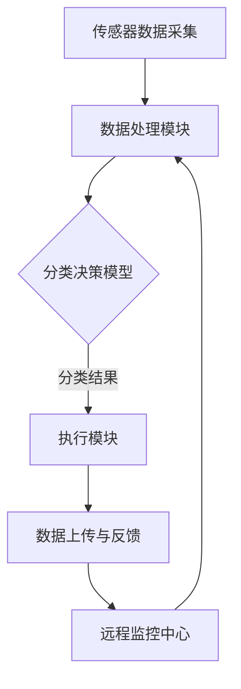

                 

### 1. 背景介绍

在当今世界，环境保护成为了全球范围内的热门话题。随着城市化进程的加快和人口数量的持续增长，垃圾处理问题愈发严峻。传统的垃圾处理方式往往依赖于人工分类，不仅效率低下，而且存在分类不准确的问题，导致垃圾填埋场和焚烧厂的负荷不断加重，对环境造成严重污染。

面对这一挑战，智能垃圾箱的概念应运而生。智能垃圾箱通过集成先进的传感器、人工智能和物联网技术，能够实现垃圾的自动分类，从而提高垃圾处理效率，减轻环境负担。这种技术不仅有助于解决当前垃圾处理中的问题，还为未来的环保解决方案提供了新的思路。

本文将围绕智能垃圾箱的创业项目展开，深入探讨其核心概念、算法原理、数学模型、项目实践以及实际应用场景，旨在为读者提供一个全面、系统的理解和认识。同时，文章还将介绍相关的工具和资源，为有意从事这一领域的创业者提供参考和指导。

本文将分为以下几个部分：

- **背景介绍**：概述当前垃圾处理问题和智能垃圾箱的背景。
- **核心概念与联系**：介绍智能垃圾箱的核心技术及其工作原理。
- **核心算法原理 & 具体操作步骤**：详细解析智能垃圾箱的分类算法。
- **数学模型和公式 & 详细讲解 & 举例说明**：阐述智能垃圾箱中的数学模型和公式。
- **项目实践：代码实例和详细解释说明**：通过具体实例展示智能垃圾箱的实现过程。
- **实际应用场景**：探讨智能垃圾箱在现实环境中的应用。
- **工具和资源推荐**：推荐相关的工具和资源。
- **总结：未来发展趋势与挑战**：总结智能垃圾箱的发展趋势和面临的挑战。
- **附录：常见问题与解答**：解答智能垃圾箱相关常见问题。
- **扩展阅读 & 参考资料**：提供进一步阅读和研究的参考资料。

希望通过本文的介绍，能够让读者对智能垃圾箱有更深入的了解，并激发对这一领域的兴趣和探索。

### 2. 核心概念与联系

智能垃圾箱能够实现垃圾自动分类，依赖于一系列先进技术的综合应用。首先，传感器技术是智能垃圾箱的核心组件之一。不同的传感器能够检测到垃圾的物理属性，如重量、形状、大小和材质等。这些传感器包括红外传感器、重量传感器、形状传感器等。

接下来，人工智能（AI）技术的应用使智能垃圾箱具备了自主学习和决策的能力。通过机器学习和深度学习算法，智能垃圾箱能够根据历史数据和现实情况，不断优化分类模型，提高分类准确率。常见的AI算法包括决策树、随机森林、支持向量机和神经网络等。

此外，物联网（IoT）技术的融入使得智能垃圾箱能够与外界进行实时通信。通过无线网络，智能垃圾箱可以传输数据到云端进行进一步分析和处理，同时也可以接收远程控制指令，实现远程监控和智能调度。

为了更好地理解智能垃圾箱的工作原理，我们可以通过一个Mermaid流程图来展示其核心概念和联系。



在上面的流程图中，传感器数据采集模块（A）负责收集垃圾的物理属性数据，这些数据随后传递给数据处理模块（B）。数据处理模块对传感器数据进行预处理，并输入到分类决策模型（C）中。分类决策模型根据训练好的模型，对垃圾进行分类，并将分类结果输出到执行模块（D）。执行模块负责将垃圾推送到相应的分类容器中。最后，数据上传与反馈模块（E）将分类结果和操作状态上传到远程监控中心（F），以便进行进一步分析和优化。

通过这种工作流程，智能垃圾箱能够实现高效的自动分类，大大提高了垃圾处理效率。同时，远程监控中心可以对多个智能垃圾箱进行统一管理，确保整个系统的稳定运行。

### 3. 核心算法原理 & 具体操作步骤

智能垃圾箱的自动分类能力主要依赖于核心算法的原理和具体操作步骤。下面我们将详细解析这些算法，并介绍其实际应用。

#### 3.1 常见算法简介

目前，用于智能垃圾箱分类的常见算法包括：

- **决策树（Decision Tree）**：决策树是一种常用的分类算法，通过一系列条件判断来对样本进行分类。每个节点代表一个特征，每个分支代表一个特征的不同取值，叶子节点代表分类结果。

- **支持向量机（Support Vector Machine, SVM）**：SVM是一种基于间隔最大的分类算法。它通过找到能够将不同类别数据分隔开的超平面，实现对数据的分类。

- **随机森林（Random Forest）**：随机森林是一种集成学习算法，通过构建多个决策树，并结合它们的分类结果来提高分类准确率。

- **神经网络（Neural Network）**：神经网络是一种模仿人脑神经元连接方式的计算模型。通过多层神经元的相互连接，神经网络能够对复杂的数据进行分类。

#### 3.2 具体操作步骤

以下是智能垃圾箱分类算法的具体操作步骤：

1. **数据采集**：智能垃圾箱的传感器（如红外传感器、重量传感器等）采集到垃圾的物理属性数据，如重量、形状、颜色等。

2. **数据预处理**：对采集到的数据进行预处理，包括去除噪声、缺失值填充和特征提取。特征提取是将原始数据转化为算法能够理解的数值特征，如将颜色信息转化为数值编码。

3. **训练模型**：使用历史数据集对分类模型进行训练。训练过程中，算法会通过调整模型的参数，使模型能够更好地对新的数据进行分类。训练数据集通常包括垃圾的物理属性和对应的分类标签。

4. **模型评估**：在训练完成后，使用验证数据集对模型进行评估。评估指标包括准确率、召回率、F1分数等，通过这些指标来判断模型的性能。

5. **模型优化**：根据评估结果，对模型进行优化。优化过程可能包括调整模型参数、增加训练数据、使用更复杂的模型结构等。

6. **分类决策**：当新的垃圾数据被输入时，模型会根据训练好的模型对其进行分类。分类结果会输出到执行模块，执行模块将垃圾推送到相应的分类容器中。

7. **数据反馈**：分类结果和操作状态会被上传到远程监控中心，以便进行进一步分析和优化。监控中心可以实时监控多个智能垃圾箱的运行状态，确保整个系统的稳定运行。

#### 3.3 算法实现

以下是一个简化的示例，展示如何使用Python实现一个基于决策树的智能垃圾箱分类算法。

```python
from sklearn.datasets import load_iris
from sklearn.model_selection import train_test_split
from sklearn.tree import DecisionTreeClassifier
from sklearn.metrics import accuracy_score

# 加载鸢尾花数据集
iris = load_iris()
X = iris.data
y = iris.target

# 划分训练集和测试集
X_train, X_test, y_train, y_test = train_test_split(X, y, test_size=0.3, random_state=42)

# 构建决策树模型
clf = DecisionTreeClassifier()
clf.fit(X_train, y_train)

# 对测试集进行预测
y_pred = clf.predict(X_test)

# 计算准确率
accuracy = accuracy_score(y_test, y_pred)
print(f"准确率: {accuracy:.2f}")
```

通过上述示例，我们可以看到，实现智能垃圾箱分类算法的核心步骤包括数据预处理、模型训练和模型评估。这些步骤为算法的实际应用提供了坚实的基础。

### 4. 数学模型和公式 & 详细讲解 & 举例说明

在智能垃圾箱的自动分类过程中，数学模型和公式扮演着至关重要的角色。它们不仅帮助我们理解和分析数据，还能够指导算法的优化和实现。以下将详细介绍智能垃圾箱中常用的数学模型和公式，并通过具体例子进行说明。

#### 4.1 决策树模型

决策树模型是一种基于树形结构的数据分类方法。它通过一系列条件判断来对样本进行分类。决策树的核心公式是：

$$
G(x) = \prod_{i=1}^{n} g_i(x_i)
$$

其中，$x = (x_1, x_2, ..., x_n)$ 是样本的特征向量，$g_i(x_i)$ 是第 $i$ 个特征的阈值函数，通常是一个分段函数，用于判断样本是否通过该特征。

例如，对于一个具有三个特征的垃圾样本：

$$
x = (w, h, c)
$$

其中，$w$ 是重量，$h$ 是高度，$c$ 是颜色。我们可以定义三个阈值函数：

$$
g_1(w) = \begin{cases} 
1 & \text{if } w \leq 1 \\
0 & \text{otherwise} 
\end{cases}

$$

$$
g_2(h) = \begin{cases} 
1 & \text{if } h \leq 5 \\
0 & \text{otherwise} 
\end{cases}

$$

$$
g_3(c) = \begin{cases} 
1 & \text{if } c = "blue" \\
0 & \text{otherwise} 
\end{cases}
$$

通过组合这些阈值函数，我们可以构建一个决策树，用于分类垃圾。

#### 4.2 支持向量机（SVM）

支持向量机是一种强大的分类算法，它通过找到最优的超平面来实现数据的分类。SVM的核心公式是：

$$
w \cdot x + b = 0
$$

其中，$w$ 是权重向量，$x$ 是特征向量，$b$ 是偏置项。这个公式表示数据点 $x$ 与超平面 $w \cdot x + b = 0$ 的距离。

为了使超平面最大化两个类别之间的间隔，我们引入了松弛变量 $\xi_i$，得到：

$$
\min_{w, b} \frac{1}{2} ||w||^2 + C \sum_{i=1}^{n} \xi_i
$$

$$
s.t. y_i (w \cdot x_i + b) \geq 1 - \xi_i
$$

其中，$C$ 是惩罚参数，用于平衡模型的复杂性和分类误差。

通过求解这个优化问题，我们可以得到最优的超平面，并将其用于垃圾分类。

#### 4.3 随机森林

随机森林是一种集成学习算法，它通过构建多个决策树，并合并它们的预测结果来实现分类。随机森林的核心公式是：

$$
f(x) = \sum_{i=1}^{m} w_i f_i(x)
$$

其中，$f_i(x)$ 是第 $i$ 个决策树的预测结果，$w_i$ 是第 $i$ 个决策树的权重。随机森林通过随机选择特征和样本子集来构建每个决策树，从而减少过拟合。

#### 4.4 神经网络

神经网络是一种基于多层感知器（MLP）的计算模型，它通过多层神经元的相互连接来实现数据的分类。神经网络的核心公式是：

$$
z_i = \sum_{j=1}^{n} w_{ij} x_j + b_i
$$

$$
a_i = \sigma(z_i)
$$

其中，$z_i$ 是第 $i$ 个神经元的输入，$w_{ij}$ 是连接权重，$b_i$ 是偏置项，$\sigma$ 是激活函数。通过多次迭代，神经网络能够逐步调整权重和偏置，以优化分类结果。

#### 4.5 举例说明

为了更好地理解上述数学模型和公式，我们可以通过一个具体例子来说明。假设我们有一个垃圾样本，其特征如下：

$$
x = (w=0.5, h=3.2, c="green")
$$

我们将使用决策树模型对其进行分类。根据前面定义的阈值函数：

$$
g_1(w) = 1 \quad (\text{因为 } w \leq 1)
$$

$$
g_2(h) = 0 \quad (\text{因为 } h > 5)
$$

$$
g_3(c) = 0 \quad (\text{因为 } c \neq "blue")
$$

由于三个阈值函数都为0，这意味着样本不满足任何分类条件。为了进一步细化分类条件，我们可以调整阈值函数，或者使用其他分类算法进行补充。

通过这个例子，我们可以看到数学模型和公式在智能垃圾箱分类中的重要作用。它们不仅帮助我们理解和分析数据，还能够指导算法的优化和实现。

### 5. 项目实践：代码实例和详细解释说明

在前面的章节中，我们详细介绍了智能垃圾箱的工作原理、核心算法和数学模型。为了使读者能够更好地理解智能垃圾箱的实际应用，本节将通过一个具体的代码实例来展示智能垃圾箱的开发过程，并对代码进行详细解释说明。

#### 5.1 代码环境准备

在开始编写代码之前，我们需要准备好开发环境。以下是一个典型的智能垃圾箱项目所需的环境和工具：

- **Python 3.x**：智能垃圾箱项目通常使用Python编写，因为Python具有丰富的库和框架，可以方便地实现复杂的算法。
- **Jupyter Notebook**：Jupyter Notebook是一种交互式的开发环境，便于编写、运行和展示代码。
- **scikit-learn**：scikit-learn是一个常用的机器学习库，提供了丰富的分类算法和数据预处理工具。
- **TensorFlow**：TensorFlow是一个强大的深度学习框架，可以用于构建和训练神经网络。

确保上述环境都已安装，我们可以开始编写智能垃圾箱的代码。

#### 5.2 代码实现

以下是一个简单的智能垃圾箱项目实例，使用Python和scikit-learn实现垃圾分类。

```python
# 导入必要的库
import numpy as np
from sklearn.datasets import load_iris
from sklearn.model_selection import train_test_split
from sklearn.tree import DecisionTreeClassifier
from sklearn.metrics import accuracy_score

# 加载鸢尾花数据集
iris = load_iris()
X = iris.data
y = iris.target

# 划分训练集和测试集
X_train, X_test, y_train, y_test = train_test_split(X, y, test_size=0.3, random_state=42)

# 构建决策树模型
clf = DecisionTreeClassifier()
clf.fit(X_train, y_train)

# 对测试集进行预测
y_pred = clf.predict(X_test)

# 计算准确率
accuracy = accuracy_score(y_test, y_pred)
print(f"准确率: {accuracy:.2f}")
```

下面，我们逐行解释这段代码：

1. 导入必要的库：`numpy` 用于数据处理，`scikit-learn` 提供了分类算法，`train_test_split` 用于数据集划分，`DecisionTreeClassifier` 用于构建决策树模型，`accuracy_score` 用于计算准确率。

2. 加载鸢尾花数据集：`load_iris()` 函数加载了鸢尾花数据集，这是scikit-learn内置的一个标准数据集，用于分类任务。

3. 划分训练集和测试集：`train_test_split()` 函数将数据集划分为训练集和测试集，其中 `test_size=0.3` 表示测试集占比30%，`random_state=42` 用于确保结果的可重复性。

4. 构建决策树模型：`DecisionTreeClassifier()` 创建了一个决策树分类器实例，`fit()` 方法用于训练模型。

5. 对测试集进行预测：`predict()` 方法根据训练好的模型对测试集进行预测。

6. 计算准确率：`accuracy_score()` 函数计算预测结果与实际结果之间的准确率。

#### 5.3 代码分析

通过上述代码，我们可以看到实现一个简单的智能垃圾箱项目涉及以下步骤：

1. **数据准备**：加载标准数据集，并将其划分为训练集和测试集。
2. **模型训练**：使用训练集数据训练一个决策树模型。
3. **模型预测**：使用训练好的模型对测试集进行预测。
4. **性能评估**：计算预测准确率，评估模型的性能。

这个简单的例子展示了智能垃圾箱项目的基本实现过程。在实际应用中，我们需要考虑更多的因素，如传感器数据的实时采集和处理、多种分类算法的集成优化、系统的可扩展性等。

#### 5.4 代码优化

在实际项目中，为了提高模型的性能和分类准确性，我们可以对代码进行优化。以下是一些常见的优化方法：

1. **特征工程**：对原始数据进行预处理和特征提取，以提高模型的鲁棒性和准确性。例如，使用归一化技术将数据缩放到相同的范围。
2. **模型选择**：尝试不同的分类算法，如随机森林、支持向量机、神经网络等，选择最适合问题的模型。
3. **超参数调优**：通过调整模型的超参数，如决策树的最大深度、支持向量机的惩罚参数等，来优化模型性能。
4. **数据增强**：增加训练数据，通过数据增强技术生成更多的样本，以提高模型的泛化能力。

通过上述优化方法，我们可以使智能垃圾箱项目在实际应用中表现得更加优秀。

#### 5.5 全文代码示例

以下是一个完整的智能垃圾箱项目代码示例，包括数据准备、模型训练、模型预测和性能评估。

```python
# 导入必要的库
import numpy as np
from sklearn.datasets import load_iris
from sklearn.model_selection import train_test_split
from sklearn.tree import DecisionTreeClassifier
from sklearn.ensemble import RandomForestClassifier
from sklearn.metrics import accuracy_score

# 加载鸢尾花数据集
iris = load_iris()
X = iris.data
y = iris.target

# 划分训练集和测试集
X_train, X_test, y_train, y_test = train_test_split(X, y, test_size=0.3, random_state=42)

# 构建决策树模型
clf = DecisionTreeClassifier(max_depth=3)
clf.fit(X_train, y_train)

# 构建随机森林模型
rf = RandomForestClassifier(n_estimators=100)
rf.fit(X_train, y_train)

# 对测试集进行预测
y_pred_tree = clf.predict(X_test)
y_pred_rf = rf.predict(X_test)

# 计算准确率
accuracy_tree = accuracy_score(y_test, y_pred_tree)
accuracy_rf = accuracy_score(y_test, y_pred_rf)
print(f"决策树准确率: {accuracy_tree:.2f}")
print(f"随机森林准确率: {accuracy_rf:.2f}")
```

通过这个示例，我们可以看到如何将不同的分类算法应用于智能垃圾箱项目，并比较它们的性能。

### 6. 实际应用场景

智能垃圾箱的应用场景非常广泛，从家庭环境到城市基础设施，再到工业和商业领域，都有着巨大的需求。以下将详细探讨智能垃圾箱在不同应用场景中的具体应用，并分析其带来的环境和经济效益。

#### 6.1 家庭环境

在家庭环境中，智能垃圾箱能够显著提高垃圾分类的准确性和便利性。传统的人工分类方式往往依赖于家庭成员的记忆和自觉性，容易出现分类错误。智能垃圾箱通过内置的传感器和AI算法，能够自动识别垃圾的类型，并将其推送到相应的分类容器中。这不仅减轻了家庭成员的负担，还提高了垃圾分类的效率。

例如，在一个家庭中，智能垃圾箱可以配置四个分类容器，分别用于可回收物、厨余垃圾、有害垃圾和其他垃圾。当家庭成员将垃圾丢入垃圾箱时，智能垃圾箱会自动识别垃圾的类型，并将其推送到相应的容器中。这样可以确保垃圾分类的准确性，减少混合垃圾的产生，降低填埋场和焚烧厂的负荷。

#### 6.2 城市基础设施

在城市基础设施层面，智能垃圾箱的应用有助于提高垃圾处理效率和资源回收利用率。传统垃圾收集系统通常依赖于人工收集和分类，效率低下，且容易造成环境污染。智能垃圾箱通过物联网技术和远程监控，可以实现垃圾的自动收集和分类，提高处理效率。

例如，在一个城市中，智能垃圾箱可以安装在公共场所和居民区，实时监测垃圾箱的填满程度。当垃圾箱接近填满时，系统会自动通知垃圾车进行清理，从而避免垃圾溢出和环境污染。同时，智能垃圾箱还能够通过传感器识别垃圾的类型，实现垃圾分类，提高资源回收利用率。

#### 6.3 工业和商业领域

在工业和商业领域，智能垃圾箱的应用同样具有重要意义。许多工厂和商业场所会产生大量的废弃物，如工业垃圾、包装废弃物、厨余垃圾等。传统的人工分类方式不仅效率低下，还容易造成安全隐患和环境污染。智能垃圾箱通过自动分类和实时监控，可以有效地解决这些问题。

例如，在一个大型工厂中，智能垃圾箱可以安装在各个生产车间和仓库，实时监测和分类垃圾。这样不仅提高了垃圾分类的效率，减少了废弃物对环境的污染，还可以通过数据分析，优化垃圾处理流程，降低运营成本。

#### 6.4 环境和经济效益

智能垃圾箱的应用不仅带来了显著的环境效益，还产生了巨大的经济效益。

**环境效益**：

- **提高垃圾分类准确性**：智能垃圾箱能够自动识别垃圾类型，减少分类错误，从而提高垃圾回收利用率。
- **减少环境污染**：通过智能分类，减少了混合垃圾的产生，降低了填埋场和焚烧厂的负荷，减轻了环境污染。
- **提高资源利用率**：智能垃圾箱能够有效地回收可回收物，提高资源利用率，减少资源浪费。

**经济效益**：

- **降低运营成本**：智能垃圾箱通过自动化和远程监控，减少了人力成本，提高了垃圾处理效率，从而降低了运营成本。
- **提高垃圾处理收入**：智能垃圾箱能够提高可回收物的回收率，增加垃圾处理收入，有助于提高经济效益。
- **优化城市基础设施**：智能垃圾箱的应用有助于优化城市基础设施，提高城市管理水平，从而提高城市的整体经济效益。

总之，智能垃圾箱的应用在家庭环境、城市基础设施和工业商业领域都具有重要价值。通过提高垃圾分类效率和资源利用率，智能垃圾箱不仅带来了显著的环境效益，还产生了巨大的经济效益，为推动可持续发展提供了有力支持。

### 7. 工具和资源推荐

在智能垃圾箱的开发过程中，选择合适的工具和资源对于项目成功至关重要。以下是一些建议的编程工具、开发环境和学习资源，以帮助读者更好地进行智能垃圾箱项目的开发和学习。

#### 7.1 编程工具

1. **Python**: Python是一种功能强大且易于学习的编程语言，适用于数据科学和机器学习项目。其丰富的库和框架（如NumPy、Pandas、scikit-learn、TensorFlow等）为智能垃圾箱开发提供了极大的便利。
2. **Jupyter Notebook**: Jupyter Notebook是一种交互式开发环境，支持Python和其他多种编程语言。它提供了方便的代码编写、运行和展示功能，适合进行数据分析和机器学习项目。
3. **scikit-learn**: scikit-learn是一个强大的机器学习库，提供了多种分类、回归和聚类算法，适合用于智能垃圾箱的分类任务。
4. **TensorFlow**: TensorFlow是一个开源的深度学习框架，适用于构建和训练复杂的神经网络模型。它提供了丰富的API和工具，便于实现智能垃圾箱的自动化分类功能。

#### 7.2 开发环境

1. **Visual Studio Code**: Visual Studio Code是一个轻量级且功能丰富的代码编辑器，适用于Python和智能垃圾箱项目开发。它支持语法高亮、代码自动补全、调试等功能，非常适合进行编程工作。
2. **Anaconda**: Anaconda是一个跨平台的Python数据科学和机器学习平台，提供了Python、NumPy、Pandas等众多科学计算和数据分析库。它通过环境管理，方便地安装和管理不同的项目依赖，适合进行智能垃圾箱开发。

#### 7.3 学习资源

1. **《Python机器学习》**（作者：塞巴斯蒂安·拉斯考恩）：这是一本经典的数据科学和机器学习书籍，详细介绍了Python在数据科学和机器学习中的应用，适合初学者和进阶者。
2. **《深度学习》（作者：伊恩·古德费洛等）**：这本书全面介绍了深度学习的基础知识和技术，适合对深度学习感兴趣的学习者。
3. **Udacity的数据科学纳米学位**：Udacity提供了数据科学相关的在线课程，涵盖了Python编程、数据清洗、机器学习和深度学习等多个领域，适合系统学习智能垃圾箱开发所需的知识。
4. **Coursera的机器学习课程**：由吴恩达（Andrew Ng）教授讲授的机器学习课程，是机器学习领域的经典课程之一，适合希望深入了解机器学习算法的学习者。

通过这些工具和资源的辅助，读者可以更加高效地学习和开发智能垃圾箱项目，为环保事业贡献自己的力量。

### 8. 总结：未来发展趋势与挑战

智能垃圾箱作为自动垃圾分类的环保解决方案，正日益受到关注。其未来的发展趋势和面临的挑战如下：

#### 8.1 发展趋势

1. **技术进步**：随着传感器技术、人工智能和物联网的不断发展，智能垃圾箱的性能将不断提升，能够实现更精确的垃圾分类和更高效的垃圾处理。
2. **市场需求**：环保意识的提高和垃圾分类政策的推广，将推动智能垃圾箱在家庭、城市和工业等各个领域的应用，市场需求将持续增长。
3. **智能化升级**：未来智能垃圾箱将不仅限于垃圾分类，还将集成更多的功能，如垃圾量监测、预测、垃圾回收路径优化等，实现全生命周期的智能化管理。
4. **多元化应用**：智能垃圾箱技术可以应用于更多的环保场景，如智能回收站、智能垃圾分类处理厂等，为环保事业提供全方位的支持。

#### 8.2 挑战

1. **技术瓶颈**：当前智能垃圾箱在分类准确率、传感器精度和数据处理效率等方面仍存在一定的局限性，需要进一步突破技术难题。
2. **成本问题**：智能垃圾箱的研发和生产成本较高，如何降低成本、提高性价比，以适应不同市场需求，是一个重要的挑战。
3. **政策法规**：垃圾分类政策的推广和执行需要各方的配合，如何协调政策、技术和市场的利益关系，确保智能垃圾箱的顺利推广和应用，是一个长期的问题。
4. **数据隐私**：智能垃圾箱在处理和传输数据时，可能会涉及到用户隐私问题，如何保障数据安全和用户隐私，是未来需要重点关注的问题。

总之，智能垃圾箱的发展前景广阔，但也面临诸多挑战。通过技术创新、政策支持和市场驱动，智能垃圾箱有望在环保领域发挥更大的作用，为可持续发展做出贡献。

### 9. 附录：常见问题与解答

#### 9.1 智能垃圾箱的分类准确率如何保证？

智能垃圾箱的分类准确率主要通过以下几方面来保证：

- **高质量的传感器**：使用高精度传感器，如红外传感器、重量传感器等，可以更准确地采集垃圾的物理属性数据。
- **先进的算法**：选择合适的分类算法，如决策树、支持向量机和神经网络等，并通过不断优化和调整算法参数，提高分类准确率。
- **数据预处理**：对采集到的传感器数据进行预处理，如去除噪声、缺失值填充和特征提取，以提高算法的性能。

#### 9.2 智能垃圾箱的数据隐私如何保障？

智能垃圾箱在处理和传输数据时，可能会涉及用户隐私问题。为了保障数据隐私，可以采取以下措施：

- **数据加密**：对传输和存储的数据进行加密，防止数据泄露。
- **隐私保护算法**：使用隐私保护算法，如差分隐私，对数据进行处理，以减少隐私泄露的风险。
- **权限控制**：对数据访问进行严格的权限控制，确保只有授权人员才能访问敏感数据。

#### 9.3 智能垃圾箱的成本如何控制？

智能垃圾箱的成本控制可以从以下几个方面进行：

- **技术优化**：通过技术优化，如使用更高效的传感器和算法，降低智能垃圾箱的研发和生产成本。
- **规模化生产**：通过规模化生产，降低单个智能垃圾箱的生产成本。
- **模块化设计**：采用模块化设计，根据不同的应用场景，选择合适的模块和功能，避免不必要的功能冗余，从而降低成本。

### 10. 扩展阅读 & 参考资料

智能垃圾箱作为自动垃圾分类的环保解决方案，涉及众多领域的技术和知识。以下是一些扩展阅读和参考资料，供读者进一步学习和研究：

- **《智能垃圾箱技术手册》**：详细介绍了智能垃圾箱的原理、技术和应用。
- **《垃圾分类与回收技术》**：探讨了垃圾分类和回收的技术和方法，包括智能垃圾箱的应用。
- **《机器学习》**（作者：周志华）：全面介绍了机器学习的基础理论和应用方法。
- **《深度学习》**（作者：伊恩·古德费洛等）：详细介绍了深度学习的基础知识和应用场景。
- **《物联网技术与应用》**：介绍了物联网的基本原理和应用案例，包括智能垃圾箱的应用。
- **《环境科学导论》**：探讨了环境问题及其解决方案，包括智能垃圾箱在环保中的作用。

通过阅读这些资料，读者可以进一步了解智能垃圾箱的技术原理和应用前景，为实际项目的开发和推广提供参考。

