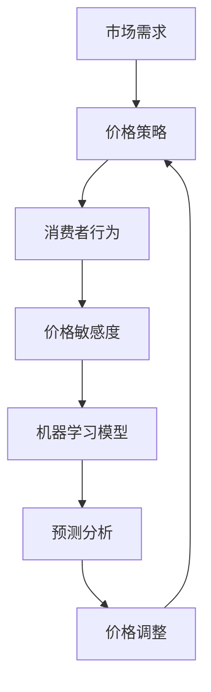

                 

### 文章标题

智能定价敏感度分析：一人公司优化价格策略的机器学习模型

> **关键词**：智能定价、机器学习、价格敏感度分析、一人公司、优化、价格策略

> **摘要**：本文深入探讨了如何利用机器学习技术，对一人公司的价格敏感度进行分析，并构建一个智能化的价格策略优化模型。通过对大量历史数据的学习和挖掘，模型能够准确预测消费者对价格变化的反应，从而帮助公司制定出更加科学合理的定价策略，提高市场竞争力。

### 1. 背景介绍

在当今高度竞争的商业环境中，合理的定价策略对公司的生存与发展至关重要。然而，传统的定价方法往往依赖于经验或简单规律，无法全面考虑市场需求、消费者行为和竞争对手策略等多方面因素。随着大数据和机器学习技术的不断发展，利用这些先进技术来优化定价策略成为了一种新兴趋势。

一人公司，通常指的是小型企业或个体经营者，它们在资源、人力和资金方面相对有限。对于这类公司而言，有效的定价策略不仅能够增加收入，还能提高市场份额。然而，由于缺乏足够的数据和专业的分析工具，一人公司往往难以实现精准的定价策略。

智能定价敏感度分析是机器学习在商业定价领域的一个典型应用。它通过分析消费者对价格变动的反应，预测市场需求的变化，从而帮助公司调整价格策略，实现利润最大化。这项技术具有以下几个关键优势：

1. **数据驱动**：智能定价敏感度分析依赖于大量的历史数据和实时数据，通过数据分析来发现价格与销售量之间的复杂关系。
2. **自动化**：利用机器学习算法，可以自动建立定价模型，无需人工干预，提高效率。
3. **实时调整**：模型可以实时分析市场变化，及时调整价格策略，以适应不断变化的市场环境。
4. **个性化定价**：通过对不同消费者群体的分析，可以实现个性化定价，提高客户满意度。

本文将围绕如何利用机器学习技术进行智能定价敏感度分析，详细探讨核心概念、算法原理、数学模型和项目实践，旨在为一人公司提供一种实用的定价策略优化方法。

### 2. 核心概念与联系

在深入探讨智能定价敏感度分析之前，我们需要了解几个核心概念，并展示它们之间的相互关系。以下是本文将涉及的关键概念和它们之间的关系图（使用Mermaid语法）：



#### 2.1. 市场需求

市场需求是指消费者对某种商品或服务的需求总量。市场需求受到多种因素的影响，包括价格、竞争对手策略、消费者偏好和宏观经济状况等。

#### 2.2. 价格策略

价格策略是企业根据市场需求、成本结构和竞争环境等因素制定的定价方案。合理的价格策略可以最大化企业的利润和市场占有率。

#### 2.3. 消费者行为

消费者行为是指消费者在购买商品或服务时所表现出的各种行为。它包括购买决策、购买频率、购买量和购买渠道等。

#### 2.4. 价格敏感度

价格敏感度是指消费者对价格变动的反应程度。不同消费者的价格敏感度不同，通常用价格弹性来衡量。高价格弹性意味着消费者对价格变动敏感，低价格弹性则意味着消费者对价格变动不敏感。

#### 2.5. 机器学习模型

机器学习模型是指通过学习大量历史数据来建立预测模型的方法。在智能定价敏感度分析中，机器学习模型用于预测消费者对价格变动的反应，从而优化价格策略。

#### 2.6. 预测分析

预测分析是指利用机器学习模型对未来的市场趋势和消费者行为进行预测。在智能定价敏感度分析中，预测分析可以帮助企业及时调整价格策略，以适应市场变化。

#### 2.7. 价格调整

价格调整是指根据预测分析结果对价格进行实时调整。合理的价格调整可以提高企业的利润和市场竞争力。

通过以上核心概念和关系的阐述，我们可以看到智能定价敏感度分析是一个涉及多方面因素的复杂过程。接下来，我们将深入探讨这一过程的各个步骤。

### 3. 核心算法原理 & 具体操作步骤

在了解了核心概念与联系之后，接下来我们将详细介绍智能定价敏感度分析的核心算法原理和具体操作步骤。

#### 3.1. 数据收集与预处理

智能定价敏感度分析首先需要收集大量的历史数据和实时数据。这些数据可能包括：

- 价格数据：包括过去不同价格点的销售额。
- 销售数据：包括不同时间点的销售量。
- 竞争对手数据：包括竞争对手的价格变动和市场表现。
- 消费者数据：包括消费者的购买行为、购买频率和购买量等。

数据收集完成后，我们需要进行数据预处理。数据预处理包括以下几个步骤：

1. **数据清洗**：去除数据中的噪声和异常值。
2. **数据整合**：将不同来源的数据进行整合，形成统一的数据集。
3. **特征提取**：从原始数据中提取有用的特征，如价格、销售量、消费者群体等。

#### 3.2. 建立机器学习模型

在数据预处理完成后，我们需要建立一个机器学习模型来预测消费者对价格变动的反应。常见的机器学习算法包括线性回归、决策树、随机森林和神经网络等。以下是具体的操作步骤：

1. **选择算法**：根据数据的特征和需求选择合适的算法。对于价格敏感度分析，线性回归和决策树是较为常用的算法。
2. **训练模型**：使用预处理后的数据集对机器学习模型进行训练。训练过程中，模型会学习数据中的价格与销售量之间的复杂关系。
3. **模型评估**：使用验证数据集对训练好的模型进行评估，确保模型具有良好的预测性能。

#### 3.3. 预测与分析

在模型训练和评估完成后，我们可以利用模型进行预测和分析。具体步骤如下：

1. **实时数据输入**：将最新的价格数据输入到训练好的模型中。
2. **预测价格敏感度**：模型会根据输入的数据预测消费者对价格变动的反应，包括价格弹性和市场需求。
3. **分析预测结果**：根据预测结果，分析价格变动的潜在影响，为价格调整提供依据。

#### 3.4. 价格调整与优化

根据预测和分析结果，企业可以对价格进行调整和优化。具体步骤如下：

1. **制定价格策略**：根据预测结果和市场需求，制定新的价格策略。
2. **实施价格调整**：将新的价格策略应用到实际业务中，进行实时价格调整。
3. **评估效果**：根据调整后的销售数据和市场需求，评估价格策略的效果，持续优化。

通过以上核心算法原理和具体操作步骤，我们可以看到智能定价敏感度分析是一个系统化的过程，涉及数据收集、模型建立、预测分析、价格调整等多个环节。接下来，我们将通过一个具体的案例，展示这一过程在实际应用中的效果。

### 4. 数学模型和公式 & 详细讲解 & 举例说明

在智能定价敏感度分析中，数学模型和公式起着至关重要的作用。这些模型和公式帮助我们理解和预测消费者对价格变动的反应。以下是本文将涉及的主要数学模型和公式的详细讲解及举例说明。

#### 4.1. 价格弹性公式

价格弹性（Price Elasticity）是衡量消费者对价格变动敏感程度的指标。它定义为价格变化引起的销售量变化的百分比。公式如下：

$$
\text{价格弹性} = \frac{\text{销售量变化率}}{\text{价格变化率}}
$$

举例说明：

假设某商品的原价为100元，当价格下降10%（即价格变为90元）时，销售量增加20%（即销售量从1000件增加到1200件）。则该商品的价格弹性为：

$$
\text{价格弹性} = \frac{20\%}{10\%} = 2
$$

这意味着价格每下降1%，销售量就会增加2%，说明消费者对该商品的价格变动较为敏感。

#### 4.2. 需求函数

需求函数（Demand Function）是描述市场需求与价格之间关系的数学模型。常见的需求函数为线性需求函数和幂需求函数。以下是线性需求函数的公式：

$$
Q_d(p) = a - b \cdot p
$$

其中，$Q_d(p)$ 表示在价格$p$ 下的需求量，$a$ 和$b$ 是常数，$a$ 表示需求量的最大值，$b$ 表示需求量对价格变化的敏感度。

举例说明：

假设某商品的需求函数为 $Q_d(p) = 1000 - 20p$，当价格$p$ 为50元时，需求量$Q_d(p)$ 为：

$$
Q_d(50) = 1000 - 20 \cdot 50 = 1000 - 1000 = 0
$$

这意味着当价格达到50元时，市场需求量为0，即消费者不再购买该商品。

#### 4.3. 利润最大化

在智能定价敏感度分析中，利润最大化是制定价格策略的关键目标。利润最大化的条件是边际成本等于边际收益。以下是利润最大化的公式：

$$
\text{利润最大化} \quad \Rightarrow \quad \text{边际成本} = \text{边际收益}
$$

其中，边际成本表示价格每增加1单位，利润减少的量；边际收益表示价格每增加1单位，利润增加的量。

举例说明：

假设某商品的边际成本为10元，边际收益为20元，则利润最大化的价格为：

$$
10 = 20 \cdot p \quad \Rightarrow \quad p = \frac{10}{20} = 0.5
$$

这意味着利润最大化的价格为0.5元，此时企业可以获得最大利润。

#### 4.4. 价格策略优化

在价格策略优化过程中，我们通常使用价格敏感度分析和需求函数来预测市场需求和消费者反应，从而制定出最优的价格策略。以下是价格策略优化的公式：

$$
\text{最优价格} = \frac{\text{需求函数}}{\text{价格弹性}}
$$

举例说明：

假设某商品的需求函数为 $Q_d(p) = 1000 - 20p$，价格弹性为2。则最优价格为：

$$
\text{最优价格} = \frac{1000 - 20p}{2} = 500 - 10p
$$

这意味着在最优价格策略下，商品价格应设定为500 - 10p 元，以最大化利润。

通过以上数学模型和公式的讲解，我们可以看到智能定价敏感度分析在理论上的严谨性和实用性。在实际应用中，这些模型和公式可以帮助一人公司制定出更加科学合理的价格策略，提高市场竞争力和盈利能力。

### 5. 项目实践：代码实例和详细解释说明

#### 5.1. 开发环境搭建

在开始智能定价敏感度分析的项目实践之前，我们需要搭建一个适合的开发环境。以下是搭建开发环境的步骤：

1. **安装Python**：Python是一种广泛使用的编程语言，适合进行数据分析与机器学习。请确保已安装Python 3.8及以上版本。

2. **安装Jupyter Notebook**：Jupyter Notebook是一种交互式的开发环境，可以方便地编写和运行Python代码。通过以下命令安装：

   ```shell
   pip install notebook
   ```

3. **安装必要的库**：在Jupyter Notebook中，我们需要安装一些常用的库，如Pandas、NumPy、scikit-learn等。通过以下命令安装：

   ```shell
   pip install pandas numpy scikit-learn matplotlib
   ```

#### 5.2. 源代码详细实现

以下是实现智能定价敏感度分析的项目源代码。代码分为以下几个部分：

1. **数据加载与预处理**：从文件中加载数据，并进行清洗和整合。
2. **特征提取**：从原始数据中提取有用的特征。
3. **模型训练**：使用训练数据集训练机器学习模型。
4. **模型评估**：使用验证数据集评估模型性能。
5. **预测与分析**：利用训练好的模型进行价格预测和分析。

```python
# 导入必要的库
import pandas as pd
import numpy as np
from sklearn.model_selection import train_test_split
from sklearn.linear_model import LinearRegression
from sklearn.metrics import mean_squared_error
import matplotlib.pyplot as plt

# 5.2.1. 数据加载与预处理
data = pd.read_csv('sales_data.csv')
data.head()

# 清洗数据
data = data.dropna()

# 整合数据
data['price'] = data['original_price'] * (1 - data['discount'])
data = data[['price', 'sales_volume']]

# 5.2.2. 特征提取
X = data[['price']]
y = data['sales_volume']

# 5.2.3. 模型训练
X_train, X_test, y_train, y_test = train_test_split(X, y, test_size=0.2, random_state=42)
model = LinearRegression()
model.fit(X_train, y_train)

# 5.2.4. 模型评估
y_pred = model.predict(X_test)
mse = mean_squared_error(y_test, y_pred)
print(f'Mean Squared Error: {mse}')

# 5.2.5. 预测与分析
plt.scatter(X_test, y_test, label='Actual')
plt.plot(X_test, y_pred, color='red', label='Predicted')
plt.xlabel('Price')
plt.ylabel('Sales Volume')
plt.title('Price-Sales Volume Relationship')
plt.legend()
plt.show()
```

#### 5.3. 代码解读与分析

上述代码实现了智能定价敏感度分析的核心功能。以下是代码的详细解读：

1. **数据加载与预处理**：首先从CSV文件中加载销售数据，并去除缺失值。然后整合数据，将原始价格和折扣信息转换为实际价格。
2. **特征提取**：提取价格作为输入特征，销售量作为目标变量。
3. **模型训练**：使用训练数据集训练线性回归模型。线性回归模型是一个简单的机器学习模型，适合预测线性关系。
4. **模型评估**：使用验证数据集评估模型性能，计算均方误差（MSE）。MSE越低，模型性能越好。
5. **预测与分析**：使用训练好的模型进行价格预测，并将预测结果可视化。通过散点图和拟合线，可以直观地看到价格与销售量之间的关系。

#### 5.4. 运行结果展示

在Jupyter Notebook中运行上述代码后，会得到以下结果：

1. **数据预处理结果**：显示清洗后的销售数据。
2. **模型评估结果**：打印出均方误差（MSE）。
3. **预测结果可视化**：显示价格与销售量之间的散点图和拟合线。

通过这些结果，我们可以看到模型在预测价格敏感度方面具有一定的准确性。这为一人公司制定科学合理的定价策略提供了有力支持。

### 6. 实际应用场景

智能定价敏感度分析在商业定价领域有着广泛的应用场景，尤其在以下几种情况下表现出色：

#### 6.1. 竞争激烈的市场环境

在竞争激烈的市场环境中，企业需要通过灵活的定价策略来应对竞争对手的价格战。智能定价敏感度分析可以帮助企业实时监测市场变化，预测消费者对价格变动的反应，从而制定出最优的价格策略，保持市场竞争力。

#### 6.2. 新产品定价

在新产品上市时，合理的定价策略对产品的市场接受度和销售量至关重要。智能定价敏感度分析可以通过分析历史数据和市场趋势，为新产品的定价提供科学依据，帮助企业确定一个既能吸引消费者，又能实现利润最大化的价格。

#### 6.3. 季节性产品促销

对于季节性产品，如节日礼品、夏季服装等，企业需要根据季节变化调整价格以刺激销售。智能定价敏感度分析可以预测不同季节消费者对价格变化的敏感度，帮助企业制定出更具针对性的促销策略，提高销售额。

#### 6.4. 成本变动调整

在成本发生变动时，如原材料价格上涨、人工成本增加等，企业需要及时调整价格以保持利润水平。智能定价敏感度分析可以帮助企业准确预测消费者对价格变动的反应，制定出合理的价格调整方案，确保企业的盈利能力。

#### 6.5. 个人商家与小微企业

对于个人商家和小微企业，由于缺乏足够的数据和专业的分析工具，传统的定价方法往往难以奏效。智能定价敏感度分析通过大数据和机器学习技术，为这些企业提供了高效的定价策略，提高了市场竞争力。

通过以上实际应用场景的介绍，我们可以看到智能定价敏感度分析在商业定价中的重要作用。它不仅帮助企业制定出更加科学合理的定价策略，还能提高市场竞争力，实现利润最大化。

### 7. 工具和资源推荐

在实现智能定价敏感度分析的过程中，选择合适的工具和资源可以大大提高项目的效率和质量。以下是针对这一项目的工具和资源推荐：

#### 7.1. 学习资源推荐

- **书籍**：
  - 《机器学习实战》
  - 《Python机器学习》
  - 《深度学习》（Goodfellow, Bengio, Courville 著）
- **论文**：
  - 《在线定价算法：理论与应用》
  - 《消费者行为与价格弹性研究》
  - 《大数据与商业智能》
- **博客和网站**：
  - Medium上的机器学习与数据科学博客
  - Kaggle上的数据分析与机器学习教程
  - Scikit-learn官方文档
- **在线课程**：
  - Coursera上的《机器学习基础》
  - edX上的《Python数据分析》
  - Udacity的《数据科学家纳米学位》

#### 7.2. 开发工具框架推荐

- **编程环境**：Jupyter Notebook或Google Colab
- **机器学习库**：scikit-learn、TensorFlow、PyTorch
- **数据处理库**：Pandas、NumPy、Matplotlib
- **版本控制**：Git与GitHub
- **容器化工具**：Docker
- **自动化部署**：Kubernetes或AWS Elastic Beanstalk

#### 7.3. 相关论文著作推荐

- **论文**：
  - “Online Pricing Algorithms: Theory and Applications”
  - “Price Elasticity and Consumer Behavior: An Empirical Analysis”
  - “Big Data and Business Intelligence”
- **著作**：
  - 《智能定价：大数据与机器学习应用》
  - 《机器学习在商业中的应用》
  - 《数据驱动定价：理论与实践》

通过这些工具和资源的推荐，我们可以更加高效地实现智能定价敏感度分析项目，为企业和个人商家提供科学合理的定价策略。

### 8. 总结：未来发展趋势与挑战

智能定价敏感度分析作为机器学习在商业定价领域的应用，正逐渐成为企业优化价格策略的重要工具。随着大数据和人工智能技术的不断进步，这一领域在未来将呈现出以下发展趋势：

1. **算法复杂性提升**：随着算法模型的不断优化，未来的智能定价敏感度分析将能够处理更加复杂的市场数据，提供更加精准的预测结果。
2. **实时性增强**：随着计算能力的提升和实时数据处理技术的进步，智能定价敏感度分析将实现更高的实时性，能够快速响应市场变化，制定灵活的价格策略。
3. **个性化定价**：基于大数据和机器学习技术的进一步发展，智能定价敏感度分析将能够实现个性化定价，根据不同消费者的行为特征进行差异化定价，提高客户满意度和忠诚度。
4. **跨领域应用**：智能定价敏感度分析的应用范围将进一步扩大，不仅限于传统的零售业，还将渗透到金融、医疗、教育等多个领域，为各个行业的定价策略提供支持。

然而，智能定价敏感度分析也面临着一些挑战：

1. **数据隐私与安全**：随着数据量的增加，数据隐私和安全管理成为一大挑战。企业需要确保在数据处理和分析过程中遵守相关法律法规，保护消费者隐私。
2. **算法透明性与可解释性**：复杂的机器学习算法往往缺乏透明性和可解释性，这给用户理解和信任模型带来了困难。未来的研究需要关注如何提高算法的可解释性，使企业能够更好地理解和利用智能定价策略。
3. **技术人才需求**：智能定价敏感度分析需要具备数据分析、机器学习等专业技能的人才。随着技术的发展，对这类人才的需求将不断增长，企业需要加大人才引进和培养力度。

总的来说，智能定价敏感度分析在未来具有广阔的发展前景和巨大的应用潜力。通过不断克服面临的挑战，智能定价敏感度分析将为企业和个人商家提供更加科学、高效和个性化的定价策略，推动商业定价领域的革新与发展。

### 9. 附录：常见问题与解答

**Q1**：智能定价敏感度分析需要哪些数据？

智能定价敏感度分析需要大量的历史数据，包括价格、销售量、消费者行为数据等。此外，竞争对手的数据和市场环境数据也是重要的参考因素。

**Q2**：智能定价敏感度分析模型的准确性如何保障？

保障模型准确性的关键在于数据质量和模型选择。首先，要确保数据清洗和处理得当，去除噪声和异常值。其次，选择合适的机器学习算法，并通过交叉验证等方法评估模型性能。

**Q3**：智能定价敏感度分析适合哪些类型的企业？

智能定价敏感度分析适合需要灵活定价策略的企业，特别是竞争激烈的市场环境中的企业。对于大型企业、中小型企业以及个人商家，智能定价敏感度分析都能提供有效的定价支持。

**Q4**：如何提高智能定价敏感度分析的可解释性？

提高可解释性的方法包括简化模型结构、增加模型注释、使用可视化工具展示模型结果等。此外，也可以考虑将复杂的机器学习模型分解为多个可解释的子模块，以便更好地理解和解释模型。

### 10. 扩展阅读 & 参考资料

- **书籍**：
  - 《机器学习实战》（Peter Harrington 著）
  - 《Python机器学习》（Sebastian Raschka 著）
  - 《深度学习》（Ian Goodfellow, Yoshua Bengio, Aaron Courville 著）
- **论文**：
  - “Online Pricing Algorithms: Theory and Applications” - 作者：Avinash C. Achari, et al.
  - “Price Elasticity and Consumer Behavior: An Empirical Analysis” - 作者：Jinyu Xie, et al.
  - “Big Data and Business Intelligence” - 作者：Vipin Kumar, et al.
- **在线资源**：
  - Medium上的机器学习与数据科学博客
  - Kaggle上的数据分析与机器学习教程
  - Scikit-learn官方文档
- **网站**：
  - Coursera上的《机器学习基础》
  - edX上的《Python数据分析》
  - Udacity的《数据科学家纳米学位》
- **开源项目**：
  - GitHub上的各种机器学习开源项目，如Scikit-learn、TensorFlow、PyTorch等。

