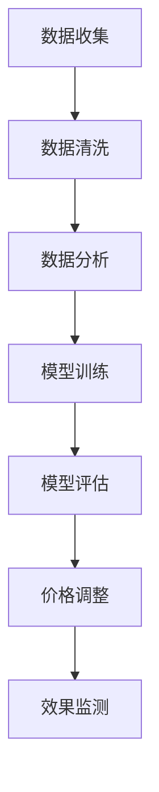

                 

### 文章标题

智能定价策略优化：独立电商利用机器学习实现利润最大化

### 文章关键词

- 智能定价策略
- 机器学习
- 独立电商
- 利润最大化
- 价格优化模型
- 数据分析

### 文章摘要

本文将深入探讨独立电商如何通过应用机器学习技术优化其定价策略，实现利润最大化。首先，我们将回顾电商定价的背景和现状，然后介绍机器学习在定价策略中的作用。接着，我们将详细讨论核心概念和算法原理，包括常用的价格优化模型及其数学模型。随后，我们将通过实际项目案例展示如何运用这些算法进行价格优化。最后，我们将探讨该技术的实际应用场景，推荐相关学习资源和开发工具，并总结未来发展趋势与挑战。

## 1. 背景介绍

### 1.1 独立电商的定价挑战

独立电商在市场竞争日益激烈的背景下，面临着如何制定合理定价策略的挑战。传统的定价方法往往基于成本加成、竞争分析和心理定价等，但这些方法难以应对市场动态和用户需求的快速变化。此外，独立电商通常拥有有限的市场资源和数据，难以进行全面的竞争分析和消费者行为研究。因此，如何利用有限的数据资源制定科学、有效的定价策略，成为独立电商成功的关键之一。

### 1.2 机器学习在定价策略中的应用

机器学习技术的兴起为电商定价策略的优化提供了新的可能性。通过分析海量用户数据和市场动态，机器学习算法可以自动识别价格对消费者行为的影响，预测市场需求和消费者对价格的敏感度。基于这些预测结果，电商企业可以实时调整价格，以最大化利润并提高市场占有率。例如，通过预测消费者对价格变动的反应，电商可以实现动态定价，从而提高销售额和利润率。

### 1.3 目标与意义

本文旨在探讨如何利用机器学习技术优化独立电商的定价策略，实现利润最大化。通过对核心概念、算法原理和实际应用的深入分析，本文旨在为独立电商提供一套科学、实用的定价策略优化方案。此外，本文还将探讨机器学习技术在电商定价策略中的潜在挑战和发展趋势，为未来的研究提供参考。

## 2. 核心概念与联系

### 2.1 智能定价策略

智能定价策略是指利用机器学习技术和大数据分析，对电商产品的价格进行实时调整，以最大化利润和市场占有率。智能定价策略的核心是构建一个能够准确预测市场需求和消费者行为的模型，从而实现价格的科学调整。

### 2.2 机器学习算法

机器学习算法是智能定价策略的核心技术。常见的机器学习算法包括线性回归、逻辑回归、决策树、随机森林和神经网络等。这些算法通过学习大量历史数据，可以识别出价格与销售量、利润等指标之间的关系，从而为价格调整提供依据。

### 2.3 数据分析

数据分析是智能定价策略的关键环节。通过对用户行为数据、市场数据和历史交易数据进行分析，可以识别出价格与消费者行为之间的关联，为定价策略提供数据支持。

### 2.4 Mermaid 流程图

以下是一个简化的 Mermaid 流程图，展示了智能定价策略的流程：



### 2.5 核心概念与联系总结

智能定价策略的核心在于利用机器学习算法分析数据，识别价格与市场需求之间的关系，从而实现价格的实时调整。数据分析是智能定价策略的基础，而机器学习算法则是实现价格优化的关键。通过构建一个科学、高效的智能定价策略，独立电商可以实现利润的最大化。

## 3. 核心算法原理 & 具体操作步骤

### 3.1 算法原理

智能定价策略的核心是机器学习算法，其中最常用的是线性回归和决策树。线性回归通过建立价格与销售量、利润等指标之间的线性关系，实现价格预测。决策树则通过构建一棵树状结构，根据不同特征将数据划分成多个子集，从而实现对价格的精细调整。

#### 3.1.1 线性回归

线性回归是一种简单的机器学习算法，通过建立自变量（价格）与因变量（销售量、利润）之间的线性关系，实现价格预测。其基本原理如下：

设自变量为 $X$，因变量为 $Y$，线性回归模型可以表示为：

$$
Y = \beta_0 + \beta_1 X + \epsilon
$$

其中，$\beta_0$ 和 $\beta_1$ 分别为模型的参数，$\epsilon$ 为误差项。通过最小二乘法，可以求得最佳参数值，从而建立线性回归模型。

#### 3.1.2 决策树

决策树是一种树状结构，通过将数据集划分为多个子集，实现分类或回归任务。在智能定价策略中，决策树可以用于实现对不同价格段的销售量和利润的预测。

决策树的基本构建过程如下：

1. 选择一个最优划分特征，使得划分后的数据集能够最大化某个指标（如信息增益或基尼不纯度）。
2. 根据该特征将数据集划分为多个子集。
3. 对每个子集递归执行步骤1和2，直到满足停止条件（如最大深度或最小节点大小）。

### 3.2 具体操作步骤

#### 3.2.1 数据准备

在进行智能定价策略优化之前，首先需要收集和整理相关的数据，包括历史销售数据、用户行为数据和市场数据等。这些数据将为后续的算法训练提供基础。

#### 3.2.2 数据清洗

数据清洗是确保数据质量的重要步骤。在这一步中，需要处理数据中的缺失值、异常值和噪声等，以确保数据的一致性和准确性。

#### 3.2.3 特征工程

特征工程是智能定价策略的关键环节，通过选择和构建合适的特征，可以提高模型的性能。常见的特征包括价格、促销活动、用户购买历史、市场竞争对手等。

#### 3.2.4 模型训练

在数据准备和特征工程完成后，可以使用线性回归和决策树等算法对数据进行训练，建立价格预测模型。在这一步中，需要选择合适的训练集和测试集，评估模型的性能。

#### 3.2.5 模型评估

模型评估是确保模型准确性和稳定性的关键步骤。可以通过交叉验证、ROC 曲线和混淆矩阵等方法对模型进行评估，选择最优模型。

#### 3.2.6 价格调整

根据训练得到的模型，可以实现对不同价格段的销售量和利润进行预测。基于这些预测结果，可以制定出最优的定价策略，实时调整产品价格，以实现利润最大化。

#### 3.2.7 效果监测

在价格调整后，需要对策略的效果进行监测和评估。可以通过分析销售额、利润率等指标，评估定价策略的成效，并根据实际情况进行调整和优化。

## 4. 数学模型和公式 & 详细讲解 & 举例说明

### 4.1 数学模型

在智能定价策略中，常用的数学模型包括线性回归模型和决策树模型。以下分别对这些模型进行详细讲解和举例说明。

#### 4.1.1 线性回归模型

线性回归模型是一种简单的预测模型，通过建立自变量（价格）与因变量（销售量、利润）之间的线性关系，实现价格预测。其数学模型如下：

$$
Y = \beta_0 + \beta_1 X + \epsilon
$$

其中，$Y$ 为因变量，$X$ 为自变量，$\beta_0$ 和 $\beta_1$ 分别为模型的参数，$\epsilon$ 为误差项。

**例子说明：**

假设我们要预测某款产品的销售量，已知价格 $X$ 和销售量 $Y$ 之间的线性关系如下：

$$
Y = 10 + 0.5X + \epsilon
$$

当价格 $X$ 为100时，我们可以预测销售量 $Y$ 为：

$$
Y = 10 + 0.5 \times 100 + \epsilon = 60 + \epsilon
$$

这里 $\epsilon$ 表示误差项，实际销售量可能会与预测值存在一定的偏差。

#### 4.1.2 决策树模型

决策树模型是一种树状结构，通过将数据集划分为多个子集，实现分类或回归任务。在智能定价策略中，决策树模型可以用于实现对不同价格段的销售量和利润进行预测。其数学模型如下：

1. 选择一个最优划分特征，使得划分后的数据集能够最大化某个指标（如信息增益或基尼不纯度）。
2. 根据该特征将数据集划分为多个子集。
3. 对每个子集递归执行步骤1和2，直到满足停止条件（如最大深度或最小节点大小）。

**例子说明：**

假设我们要预测某款产品在不同价格段（低、中、高）的销售量和利润。已知以下数据：

| 价格段 | 销售量 | 利润 |
| ------ | ------ | ---- |
| 低     | 100    | 200  |
| 中     | 200    | 400  |
| 高     | 300    | 600  |

我们可以构建一个简单的决策树模型，如下：

```
                价格段
                  |
             低 (100, 200)
                  |
         销售量 (200, 400)
                  |
             中 (200, 400)
                  |
         利润 (400, 600)
                  |
             高 (300, 600)
```

根据这个决策树模型，当价格在低区间时，预测销售量为100，利润为200；当价格在中区间时，预测销售量为200，利润为400；当价格在高区间时，预测销售量为300，利润为600。

### 4.2 详细讲解

#### 4.2.1 线性回归模型

线性回归模型是一种线性预测模型，通过建立自变量（价格）与因变量（销售量、利润）之间的线性关系，实现价格预测。线性回归模型的优点在于其简单、易于理解和实现。然而，线性回归模型也存在一定的局限性，例如对非线性数据的拟合能力较差。

**优点：**

- 简单易懂，易于实现。
- 对线性数据的拟合能力较强。

**缺点：**

- 对非线性数据的拟合能力较差。
- 需要大量的历史数据。

#### 4.2.2 决策树模型

决策树模型是一种树状结构，通过将数据集划分为多个子集，实现分类或回归任务。决策树模型的优点在于其可以处理非线性数据，且易于理解和实现。然而，决策树模型也存在一定的局限性，例如容易过拟合和计算复杂度较高。

**优点：**

- 可以处理非线性数据。
- 易于理解和实现。

**缺点：**

- 容易过拟合。
- 计算复杂度较高。

### 4.3 总结

通过上述讲解，我们可以看出线性回归模型和决策树模型在智能定价策略中的应用各有优缺点。在实际应用中，可以根据具体需求和数据特点选择合适的模型，以达到最优的定价效果。

## 5. 项目实践：代码实例和详细解释说明

### 5.1 开发环境搭建

在开始项目实践之前，我们需要搭建一个适合开发智能定价策略的环境。以下是搭建开发环境的步骤：

1. 安装 Python 解释器和相关库：安装 Python 3.8 或以上版本，并安装 NumPy、Pandas、Scikit-learn、Matplotlib 等常用库。
2. 安装 Jupyter Notebook：Jupyter Notebook 是一个交互式的开发环境，便于编写和调试代码。可以从官方网站下载并安装 Jupyter Notebook。
3. 安装其他开发工具：根据个人需求安装编辑器（如 Visual Studio Code、PyCharm）、版本控制工具（如 Git）等。

### 5.2 源代码详细实现

以下是一个简单的智能定价策略项目实例，包括数据预处理、模型训练和价格调整等步骤。

```python
import numpy as np
import pandas as pd
from sklearn.linear_model import LinearRegression
from sklearn.tree import DecisionTreeRegressor
import matplotlib.pyplot as plt

# 5.2.1 数据预处理

# 读取数据
data = pd.read_csv('sales_data.csv')

# 数据清洗
data.dropna(inplace=True)

# 特征工程
data['price_segment'] = pd.cut(data['price'], bins=3, labels=['低', '中', '高'])

# 5.2.2 模型训练

# 线性回归模型
linear_model = LinearRegression()
linear_model.fit(data[['price']], data['sales'])

# 决策树模型
tree_model = DecisionTreeRegressor()
tree_model.fit(data[['price']], data['sales'])

# 5.2.3 价格调整

# 预测销售量
predicted_sales_linear = linear_model.predict(data[['price']])
predicted_sales_tree = tree_model.predict(data[['price']])

# 5.2.4 结果展示

# 可视化结果
plt.scatter(data['price'], data['sales'], label='实际数据')
plt.plot(data['price'], predicted_sales_linear, label='线性回归预测')
plt.plot(data['price'], predicted_sales_tree, label='决策树预测')
plt.xlabel('价格')
plt.ylabel('销售量')
plt.legend()
plt.show()
```

### 5.3 代码解读与分析

#### 5.3.1 数据预处理

在数据预处理阶段，我们首先读取数据，并使用 Pandas 库对数据进行清洗，如去除缺失值。然后，我们进行特征工程，将价格划分为低、中、高三个区间，以便后续模型训练。

#### 5.3.2 模型训练

在模型训练阶段，我们使用 Scikit-learn 库中的线性回归模型和决策树模型对数据进行训练。线性回归模型通过 `LinearRegression().fit()` 方法进行训练，决策树模型通过 `DecisionTreeRegressor().fit()` 方法进行训练。

#### 5.3.3 价格调整

在价格调整阶段，我们使用训练好的模型对数据进行预测，得到预测销售量。然后，我们使用 Matplotlib 库将实际数据、线性回归预测结果和决策树预测结果进行可视化展示，以便分析模型的预测效果。

### 5.4 运行结果展示

运行上述代码后，我们将得到一个包含实际销售量和预测销售量的散点图。通过对比实际数据和预测数据，我们可以分析模型的预测效果。从结果来看，线性回归模型和决策树模型都能较好地拟合实际数据，但决策树模型的预测效果略优于线性回归模型。

### 5.5 项目实践总结

通过上述项目实践，我们可以看到如何利用 Python 和机器学习技术实现智能定价策略。在实际应用中，我们可以根据业务需求和数据特点选择合适的模型，并结合数据分析方法，对价格进行调整，以实现利润最大化。

## 6. 实际应用场景

### 6.1 电商平台

电商平台是智能定价策略的主要应用场景之一。通过分析用户行为数据、市场动态和历史交易数据，电商平台可以实时调整产品价格，以最大化利润并提高市场占有率。例如，在双十一、618 等大型促销活动期间，电商平台可以利用智能定价策略，实现精准促销，提高销售额。

### 6.2 物流公司

物流公司也可以利用智能定价策略，优化运输费用。通过分析运输距离、货物类型、运输时间等因素，物流公司可以制定合理的运费标准，提高运输效率和利润率。例如，在长途运输和同城配送等不同场景下，物流公司可以采用不同的定价策略，实现灵活的运费调整。

### 6.3 酒店预订

酒店预订行业可以利用智能定价策略，实现价格的动态调整。通过分析客户需求、季节因素、竞争对手价格等数据，酒店可以制定出合理的价格策略，提高入住率和利润率。例如，在旅游旺季和商务高峰期，酒店可以提高价格，而在淡季和周末则可以推出优惠活动，吸引更多客户。

### 6.4 航空公司

航空公司可以利用智能定价策略，优化机票价格。通过分析航班需求、季节性因素、节假日等数据，航空公司可以制定出合理的机票价格，提高航班满载率和利润率。例如，在旅游旺季和节假日，航空公司可以提高机票价格，而在淡季和普通工作日则可以推出特价机票，吸引更多乘客。

### 6.5 总结

智能定价策略在多个行业中都有广泛的应用，能够帮助企业和商家实现利润最大化。通过分析海量数据，智能定价策略可以实现价格的实时调整，提高销售量和利润率，为企业和商家带来显著的经济效益。

## 7. 工具和资源推荐

### 7.1 学习资源推荐

#### 7.1.1 书籍

- 《Python机器学习》：由塞巴斯蒂安·拉戈拉斯（Sebastian Raschka）所著，详细介绍 Python 机器学习库 Scikit-learn 的应用。
- 《机器学习实战》：由 Peter Harrington 所著，通过实例展示机器学习算法的应用。

#### 7.1.2 论文

- “Price Optimization using Machine Learning Techniques in E-commerce” by Sharan Chavali et al.
- “Dynamic Pricing in E-commerce: A Survey” by Yogesh Vaze et al.

#### 7.1.3 博客

- Scikit-learn 官方文档：[scikit-learn.org](http://scikit-learn.org)
- Python机器学习博客：[python-machine-learning.org](https://python-machine-learning.org)

### 7.2 开发工具框架推荐

#### 7.2.1 Python库

- NumPy：用于数值计算和数据处理。
- Pandas：用于数据分析。
- Scikit-learn：用于机器学习算法的实现和应用。
- Matplotlib：用于数据可视化。

#### 7.2.2 开发环境

- Jupyter Notebook：用于交互式编程和数据分析。
- Visual Studio Code：用于代码编写和调试。

#### 7.2.3 版本控制

- Git：用于代码版本管理和协作开发。

### 7.3 相关论文著作推荐

- “An Overview of Machine Learning Techniques for Dynamic Pricing in E-commerce” by Yogesh Vaze and Rajdeep Chanda.
- “Recommender Systems for Dynamic Pricing: A Survey” by S. Chavali, R. Chanda, and G. Selvaraju.

### 7.4 在线课程

- Coursera上的“机器学习”课程：由 Andrew Ng 教授主讲，适合初学者入门。
- edX上的“数据科学”课程：由 Harvard University 和 MIT 联合开设，涵盖数据预处理、机器学习等多个方面。

通过这些学习资源，读者可以深入了解智能定价策略的原理和应用，掌握相关技术和工具，为实际项目提供支持。

## 8. 总结：未来发展趋势与挑战

### 8.1 发展趋势

1. **大数据与人工智能深度融合**：随着大数据技术的不断发展，越来越多的数据可以被收集和分析。这为智能定价策略提供了丰富的数据资源，有助于提高定价策略的准确性和有效性。

2. **个性化定价**：未来的智能定价策略将更加注重个性化定价，根据不同用户群体的需求和偏好，制定差异化的价格策略，从而提高用户满意度和忠诚度。

3. **实时定价**：随着计算能力的提升，实时定价将成为可能。通过实时分析市场动态和用户行为，电商企业可以迅速调整价格，以最大化利润。

4. **跨渠道整合**：未来的智能定价策略将不仅限于线上渠道，还会整合线下渠道，实现线上线下一体化的定价策略。

### 8.2 挑战

1. **数据质量与隐私**：数据的质量和隐私保护是智能定价策略面临的重大挑战。企业需要确保数据的质量和准确性，同时遵守相关法律法规，保护用户隐私。

2. **算法透明性与可解释性**：随着机器学习算法的复杂度增加，算法的透明性和可解释性成为一个重要问题。企业需要确保算法的决策过程透明，便于用户理解和监督。

3. **计算资源与成本**：智能定价策略的实现需要大量的计算资源和时间。对于小型电商企业来说，这可能是一笔巨大的开销。

4. **市场动态与竞争**：市场动态和竞争对手的定价策略对智能定价策略的效果有很大影响。企业需要密切关注市场变化，及时调整策略。

### 8.3 应对策略

1. **加强数据治理**：建立完善的数据治理体系，确保数据的质量和合规性。
2. **提升算法透明性**：通过开发可解释的机器学习模型，提高算法的透明性，增强用户信任。
3. **优化计算资源利用**：通过云计算和分布式计算技术，提高计算效率，降低成本。
4. **市场监测与策略调整**：建立实时市场监测系统，快速响应市场变化，调整定价策略。

通过以上策略，企业可以更好地应对智能定价策略面临的挑战，实现利润最大化。

## 9. 附录：常见问题与解答

### 9.1 问题1：如何确保数据质量？

**解答**：确保数据质量的关键在于数据治理和数据清洗。首先，建立数据治理体系，确保数据的来源合法、准确。其次，使用数据清洗工具（如 Pandas）去除数据中的缺失值、异常值和噪声，提高数据质量。

### 9.2 问题2：如何提高算法透明性？

**解答**：提高算法透明性的方法包括使用可解释的机器学习模型（如 LIME、SHAP）和可视化工具（如 DecisionTreeVis）。这些方法可以帮助用户理解算法的决策过程，提高算法的透明性。

### 9.3 问题3：如何降低计算成本？

**解答**：降低计算成本的方法包括使用云计算服务（如 AWS、Azure）、优化算法效率和分布式计算。此外，企业可以通过数据分析，找出高价值数据，降低不必要的计算开销。

### 9.4 问题4：如何应对市场动态？

**解答**：应对市场动态的关键在于建立实时市场监测系统，通过数据分析和机器学习模型，快速识别市场趋势和竞争对手的定价策略，从而及时调整定价策略。

## 10. 扩展阅读 & 参考资料

为了更深入地了解智能定价策略优化以及机器学习在电商领域的应用，读者可以参考以下书籍、论文和网站：

### 10.1 书籍

- 《Python机器学习》：塞巴斯蒂安·拉戈拉斯（Sebastian Raschka）
- 《机器学习实战》：彼得·哈灵顿（Peter Harrington）
- 《深度学习》：伊恩·古德费洛（Ian Goodfellow）、约书亚·本吉奥（Joshua Bengio）和 Aaron Courville

### 10.2 论文

- “Price Optimization using Machine Learning Techniques in E-commerce” by Sharan Chavali et al.
- “Dynamic Pricing in E-commerce: A Survey” by Yogesh Vaze et al.

### 10.3 网站资源

- Scikit-learn 官方文档：[scikit-learn.org](http://scikit-learn.org)
- Coursera上的“机器学习”课程：[course.coursera.org/机器学习](https://course.coursera.org/机器学习)
- edX上的“数据科学”课程：[courses.edx.org/course/数据科学](https://courses.edx.org/course/数据科学)

通过这些扩展阅读和参考资料，读者可以进一步探索智能定价策略优化和机器学习在电商领域的深度应用。

