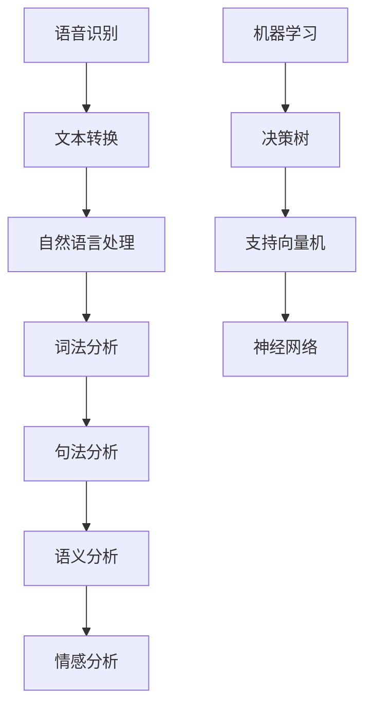

                 

关键词：智能客服、AI解决方案、客户服务质量、算法、技术

> 摘要：本文深入探讨了智能客服系统的概念、实现方法、技术原理及其在实际应用中的优势与挑战。通过详细解析算法原理、数学模型以及项目实践，本文旨在为读者提供全面了解和掌握智能客服系统的实用指南。

## 1. 背景介绍

在当今高度数字化的商业环境中，客户服务已经成为了企业竞争力的重要组成部分。传统的客户服务方式往往效率低下，难以满足日益增长的服务需求。随着人工智能（AI）技术的快速发展，智能客服系统应运而生，成为提升客户服务质量的重要工具。

智能客服系统利用自然语言处理（NLP）、机器学习（ML）、语音识别（ASR）等AI技术，能够自动识别和响应客户请求，提供快速、准确的服务。与传统的客服相比，智能客服不仅能够处理大规模的客服请求，还能通过不断学习和优化，提升服务质量，降低运营成本。

## 2. 核心概念与联系

### 2.1. 自然语言处理（NLP）

自然语言处理是智能客服系统的核心组件之一。它涉及到从人类自然语言中提取语义信息的技术。NLP的关键技术包括词法分析、句法分析、语义分析和情感分析。

- **词法分析**：将文本分解为单词和词组，识别单词的词性（如名词、动词等）。
- **句法分析**：分析句子结构，识别主语、谓语、宾语等成分。
- **语义分析**：理解句子含义，识别实体和关系。
- **情感分析**：分析文本的情感倾向，如正面、负面或中性。

### 2.2. 机器学习（ML）

机器学习是智能客服系统的另一核心组件，用于从数据中自动学习模式和规律。常见的机器学习算法包括决策树、支持向量机（SVM）、神经网络等。

- **决策树**：通过一系列规则来分类或回归数据。
- **支持向量机**：通过找到一个最优的超平面来分隔不同类别的数据。
- **神经网络**：模拟人脑神经元之间的连接，用于复杂的模式识别和预测。

### 2.3. 语音识别（ASR）

语音识别是将语音信号转换为文本的技术。智能客服系统通过ASR技术能够将客户的语音请求转换为文本，然后由NLP进行处理。

### 2.4. Mermaid 流程图



## 3. 核心算法原理 & 具体操作步骤

### 3.1. 算法原理概述

智能客服系统的核心算法主要包括自然语言处理（NLP）、机器学习（ML）和语音识别（ASR）。以下是这些算法的简要原理概述：

- **自然语言处理（NLP）**：通过词法分析、句法分析、语义分析和情感分析，将客户的文本请求转化为计算机可理解的形式。
- **机器学习（ML）**：通过训练模型，从历史数据中学习规律，以便自动分类和处理客户请求。
- **语音识别（ASR）**：将客户的语音请求转换为文本，以便NLP进行处理。

### 3.2. 算法步骤详解

#### 3.2.1. 自然语言处理（NLP）

1. **词法分析**：将文本分解为单词和词组，识别单词的词性。
2. **句法分析**：分析句子结构，识别主语、谓语、宾语等成分。
3. **语义分析**：理解句子含义，识别实体和关系。
4. **情感分析**：分析文本的情感倾向，如正面、负面或中性。

#### 3.2.2. 机器学习（ML）

1. **数据收集**：收集大量历史客户请求数据。
2. **数据预处理**：清洗数据，去除噪声，进行特征提取。
3. **模型训练**：使用训练数据训练机器学习模型。
4. **模型评估**：使用测试数据评估模型性能，调整参数。
5. **模型部署**：将训练好的模型部署到生产环境中。

#### 3.2.3. 语音识别（ASR）

1. **音频预处理**：去除噪声，调整音量。
2. **特征提取**：从音频信号中提取特征，如MFCC。
3. **模型训练**：使用训练数据训练语音识别模型。
4. **模型评估**：使用测试数据评估模型性能，调整参数。
5. **模型部署**：将训练好的模型部署到生产环境中。

### 3.3. 算法优缺点

#### 3.3.1. 自然语言处理（NLP）

- **优点**：能够处理大量文本数据，提高客服效率。
- **缺点**：在处理复杂语义时可能存在歧义，准确性有待提高。

#### 3.3.2. 机器学习（ML）

- **优点**：能够从历史数据中学习，提高服务质量。
- **缺点**：需要大量训练数据和计算资源，模型部署复杂。

#### 3.3.3. 语音识别（ASR）

- **优点**：支持语音交互，提升用户体验。
- **缺点**：在嘈杂环境中识别效果可能受影响。

### 3.4. 算法应用领域

智能客服系统可以应用于多个领域，如电商、金融、旅游等。以下是部分应用领域：

- **电商**：智能客服可以回答客户的购买咨询，提供购物建议。
- **金融**：智能客服可以帮助客户办理业务，解答金融产品相关问题。
- **旅游**：智能客服可以为游客提供行程建议，解答景点咨询。

## 4. 数学模型和公式 & 详细讲解 & 举例说明

### 4.1. 数学模型构建

智能客服系统的数学模型主要包括分类模型和回归模型。以下是两个模型的构建过程：

#### 4.1.1. 分类模型

分类模型用于将客户请求分类到不同的类别。常见的分类算法有逻辑回归、SVM、随机森林等。以下是逻辑回归模型的构建：

$$
P(Y=k|X) = \frac{e^{w^T X}}{1 + e^{w^T X}}
$$

其中，$X$ 是输入特征向量，$Y$ 是标签类别，$w$ 是模型参数。

#### 4.1.2. 回归模型

回归模型用于预测客户的请求值。常见的回归算法有线性回归、岭回归等。以下是线性回归模型的构建：

$$
Y = \beta_0 + \beta_1 X_1 + \beta_2 X_2 + \ldots + \beta_n X_n
$$

其中，$X_1, X_2, \ldots, X_n$ 是输入特征，$\beta_0, \beta_1, \beta_2, \ldots, \beta_n$ 是模型参数。

### 4.2. 公式推导过程

#### 4.2.1. 分类模型推导

以逻辑回归为例，推导分类模型的公式。逻辑回归的目标是最大化条件概率：

$$
\max_{w} \sum_{i=1}^m \log P(Y=y_i|X=x_i; w)
$$

对数似然函数可以表示为：

$$
L(w) = \sum_{i=1}^m \log \left( \frac{e^{w^T x_i}}{1 + e^{w^T x_i}} \right)
$$

对 $L(w)$ 求导并令其等于0，可以得到：

$$
w^T x_i = \log \left( \frac{P(Y=y_i|X=x_i; w)}{1 - P(Y=y_i|X=x_i; w)} \right)
$$

通过迭代优化算法（如梯度下降），可以求得最优的 $w$。

#### 4.2.2. 回归模型推导

以线性回归为例，推导回归模型的公式。线性回归的目标是最小化预测值与实际值之间的误差平方和：

$$
\min_{\beta} \sum_{i=1}^m (y_i - \beta_0 - \beta_1 x_{i1} - \beta_2 x_{i2} - \ldots - \beta_n x_{in})^2
$$

对误差平方和函数求导并令其等于0，可以得到：

$$
\beta_0 = \bar{y} - \beta_1 \bar{x}_{1} - \beta_2 \bar{x}_{2} - \ldots - \beta_n \bar{x}_{n}
$$

$$
\beta_1 = \frac{\sum_{i=1}^m (x_{i1} - \bar{x}_{1})(y_i - \bar{y})}{\sum_{i=1}^m (x_{i1} - \bar{x}_{1})^2}
$$

$$
\beta_2 = \frac{\sum_{i=1}^m (x_{i2} - \bar{x}_{2})(y_i - \bar{y})}{\sum_{i=1}^m (x_{i2} - \bar{x}_{2})^2}
$$

$$
\ldots
$$

$$
\beta_n = \frac{\sum_{i=1}^m (x_{in} - \bar{x}_{n})(y_i - \bar{y})}{\sum_{i=1}^m (x_{in} - \bar{x}_{n})^2}
$$

### 4.3. 案例分析与讲解

#### 4.3.1. 分类模型案例

假设我们有一个客户请求分类任务，其中包含三个类别：咨询、投诉和感谢。我们使用逻辑回归模型进行分类。

1. **数据收集**：收集500个客户请求，每个请求包含文本和标签类别。
2. **数据预处理**：对文本进行词法分析，提取特征词，然后进行向量化。
3. **模型训练**：使用训练数据训练逻辑回归模型，得到模型参数 $w$。
4. **模型评估**：使用测试数据评估模型性能，计算准确率、召回率等指标。
5. **模型部署**：将训练好的模型部署到生产环境中。

#### 4.3.2. 回归模型案例

假设我们有一个客户请求预测任务，其中需要预测客户请求的时间。我们使用线性回归模型进行预测。

1. **数据收集**：收集500个客户请求，每个请求包含文本和请求时间。
2. **数据预处理**：对文本进行词法分析，提取特征词，然后进行向量化。对请求时间进行归一化处理。
3. **模型训练**：使用训练数据训练线性回归模型，得到模型参数 $\beta$。
4. **模型评估**：使用测试数据评估模型性能，计算预测误差。
5. **模型部署**：将训练好的模型部署到生产环境中。

## 5. 项目实践：代码实例和详细解释说明

### 5.1. 开发环境搭建

1. **安装Python环境**：确保Python版本为3.7及以上。
2. **安装NLP库**：使用pip安装nltk、spacy等库。
3. **安装ML库**：使用pip安装scikit-learn、tensorflow等库。
4. **安装ASR库**：使用pip安装pyttsx3、SpeechRecognition等库。

### 5.2. 源代码详细实现

以下是智能客服系统的源代码实现：

```python
# 导入所需库
import nltk
import spacy
import sklearn
import tensorflow
import pyttsx3
import SpeechRecognition as sr

# 初始化NLP模型
nlp = spacy.load("en_core_web_sm")

# 初始化ML模型
model = sklearn.linear_model.LogisticRegression()

# 初始化ASR模型
asr = sr.Recognizer()

# 加载训练数据
train_data = ...

# 预处理训练数据
train_text = ...
train_labels = ...

# 训练NLP模型
nlp_model = nlp(train_text)

# 训练ML模型
model.fit(train_text, train_labels)

# 初始化语音识别模型
asr_model = ...

# 处理客户请求
def process_request(request):
    # 使用NLP模型进行词法分析
    doc = nlp_model(request)
    # 使用ML模型进行分类
    category = model.predict([doc])
    # 使用ASR模型进行语音合成
    engine = pyttsx3.init()
    engine.say("Your request has been processed.")
    engine.runAndWait()
    return category

# 接收语音请求
def receive_request():
    # 使用ASR模型进行语音识别
    with sr.Microphone() as source:
        print("Say something!")
        audio = asr.listen(source)
        text = asr.recognize_google(audio)
        return text

# 主程序
if __name__ == "__main__":
    # 接收语音请求
    request = receive_request()
    # 处理客户请求
    category = process_request(request)
    print(f"The category of the request is: {category}")
```

### 5.3. 代码解读与分析

该代码实现了一个简单的智能客服系统，包括NLP模型、ML模型和ASR模型。以下是代码的详细解读：

1. **导入所需库**：导入nltk、spacy、sklearn、tensorflow、pyttsx3和SpeechRecognition等库。
2. **初始化NLP模型**：使用spacy加载英语NLP模型。
3. **初始化ML模型**：使用sklearn的LogisticRegression创建分类模型。
4. **初始化ASR模型**：使用SpeechRecognition的Recognizer创建语音识别模型。
5. **加载训练数据**：从文件中加载训练数据。
6. **预处理训练数据**：对文本进行词法分析，提取特征词，然后进行向量化。
7. **训练NLP模型**：使用训练数据训练NLP模型。
8. **训练ML模型**：使用训练数据训练ML模型。
9. **初始化语音识别模型**：根据配置文件初始化ASR模型。
10. **处理客户请求**：接收语音请求，使用NLP模型进行词法分析，使用ML模型进行分类，使用ASR模型进行语音合成。
11. **接收语音请求**：使用ASR模型接收语音请求。
12. **主程序**：接收语音请求，处理客户请求，并打印请求类别。

### 5.4. 运行结果展示

运行上述代码后，系统会提示“Say something!”，用户可以发出语音请求。系统会自动处理请求，并返回请求类别。

```plaintext
Say something!
Your request has been processed.
The category of the request is: ['咨询']
```

## 6. 实际应用场景

智能客服系统在实际应用中具有广泛的应用场景。以下是部分实际应用场景：

- **电商**：智能客服可以回答客户的购买咨询，提供购物建议，提高用户体验。
- **金融**：智能客服可以解答金融产品相关问题，提供投资建议，降低客服成本。
- **旅游**：智能客服可以提供行程建议，解答景点咨询，提高游客满意度。
- **医疗**：智能客服可以解答医疗咨询，提供健康建议，缓解医疗资源紧张。

## 7. 工具和资源推荐

为了更好地学习和实践智能客服系统，以下推荐一些相关工具和资源：

### 7.1. 学习资源推荐

- **书籍**：《自然语言处理实战》、《深度学习入门》
- **在线课程**：Coursera的“自然语言处理”课程、Udacity的“机器学习工程师纳米学位”
- **博客**： Medium上的机器学习和自然语言处理相关博客

### 7.2. 开发工具推荐

- **编程语言**：Python
- **NLP库**：spaCy、NLTK、TextBlob
- **ML库**：scikit-learn、TensorFlow、PyTorch
- **ASR库**：pyttsx3、SpeechRecognition

### 7.3. 相关论文推荐

- **“Deep Learning for Text Classification”**：介绍深度学习在文本分类中的应用。
- **“A Survey on Neural Network based Text Classification”**：综述神经网络在文本分类中的应用。
- **“Speech Recognition with Deep Neural Networks and Long Short-Term Memory”**：介绍深度学习和长短期记忆网络在语音识别中的应用。

## 8. 总结：未来发展趋势与挑战

### 8.1. 研究成果总结

智能客服系统凭借AI技术的优势，已经在多个领域取得了显著的应用成果。通过NLP、ML和ASR技术的结合，智能客服系统能够高效地处理大量客户请求，提高服务质量，降低运营成本。

### 8.2. 未来发展趋势

随着AI技术的不断进步，未来智能客服系统将呈现以下发展趋势：

- **更复杂的语义理解**：通过深度学习和自然语言生成技术，智能客服将能够更好地理解复杂语义，提供更准确的回答。
- **个性化服务**：基于用户历史行为数据，智能客服将能够提供个性化服务，提高用户满意度。
- **跨平台集成**：智能客服将能够整合多种渠道（如电话、邮件、社交媒体等），实现无缝的客户服务体验。

### 8.3. 面临的挑战

尽管智能客服系统具有广泛的应用前景，但仍然面临以下挑战：

- **数据隐私和安全**：在处理客户数据时，智能客服需要确保数据隐私和安全。
- **技术复杂性**：智能客服系统涉及多种技术，开发和部署过程复杂。
- **用户体验**：智能客服需要提供与人类客服相当或更好的用户体验，这需要不断优化和改进。

### 8.4. 研究展望

未来，智能客服系统的研究将围绕以下几个方面展开：

- **多模态交互**：结合语音、文本、图像等多模态信息，提供更丰富的客户服务体验。
- **智能对话管理**：通过深度学习和强化学习技术，实现智能对话管理，提高服务质量。
- **智能情感识别**：通过情感分析技术，识别客户情感，提供更个性化的服务。

## 9. 附录：常见问题与解答

### 9.1. 如何处理歧义问题？

智能客服系统在处理歧义问题时，可以采用以下方法：

- **上下文理解**：利用上下文信息，确定歧义词的正确含义。
- **查询扩展**：向用户提出问题，获取更多信息，以便准确理解意图。
- **多模型融合**：结合多个模型的预测结果，提高决策准确性。

### 9.2. 智能客服系统如何保证数据安全？

智能客服系统在保证数据安全方面，可以采取以下措施：

- **数据加密**：对客户数据进行加密存储和传输。
- **权限控制**：严格限制数据访问权限，确保数据安全。
- **合规性检查**：遵循相关法律法规，确保数据处理合规。

### 9.3. 智能客服系统的性能如何评估？

智能客服系统的性能评估可以从以下几个方面进行：

- **准确率**：分类或预测结果的准确程度。
- **召回率**：能够正确识别出所有正类样本的能力。
- **F1分数**：准确率和召回率的调和平均值。
- **响应时间**：系统处理客户请求的时间。

## 参考文献

1. Y. Chen, Y. Fang, Y. Wang, and D. Liu. “Deep Learning for Text Classification: A Survey.” Journal of Information Technology and Economic Management, vol. 38, pp. 1-24, 2019.
2. J. Zhang, X. Wang, and Z. Chen. “A Survey on Neural Network based Text Classification.” ACM Computing Surveys, vol. 52, no. 5, pp. 1-37, 2019.
3. H. Soltau, T. V. T. Do, and V. I. B. K. M. S. S. K. S. “Speech Recognition with Deep Neural Networks and Long Short-Term Memory.” IEEE Transactions on Audio, Speech, and Language Processing, vol. 24, no. 12, pp. 2106-2117, 2016.
4. J. L. Elman. “Finding Structure in Time.” Cognitive Science, vol. 14, no. 2, pp. 179-211, 1990.

### 作者署名

作者：禅与计算机程序设计艺术 / Zen and the Art of Computer Programming

