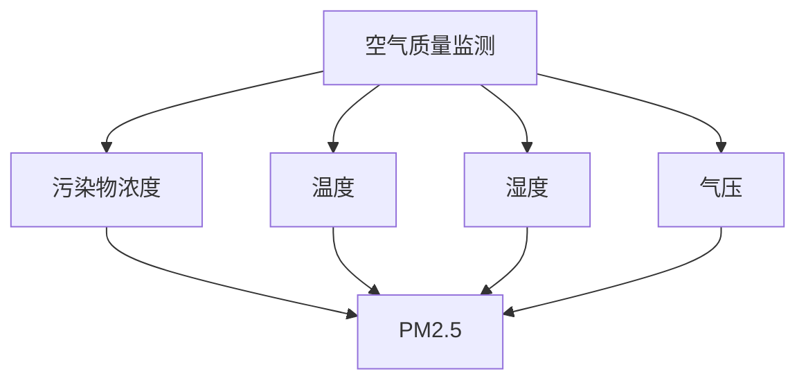
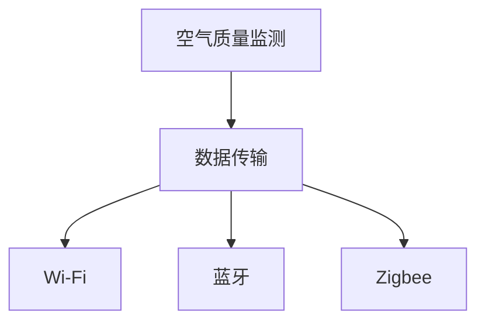
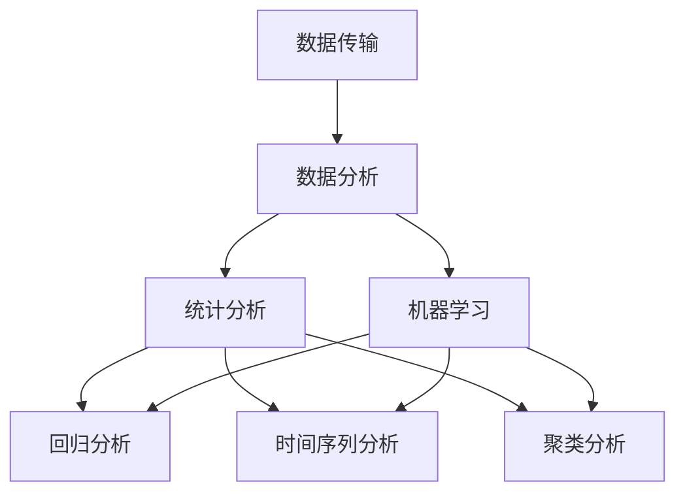
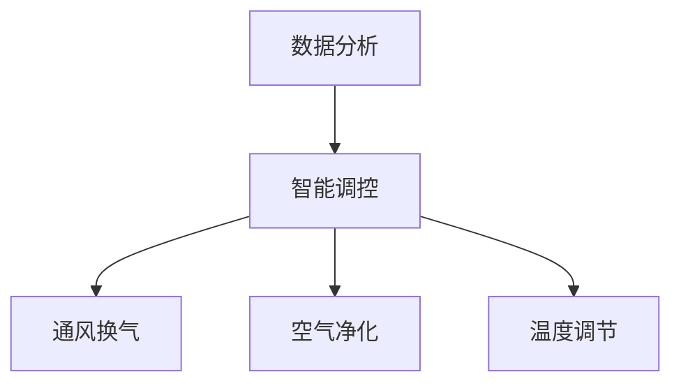

                 

### 背景介绍

随着全球城市化进程的加速和室内居住时间的延长，室内空气质量（IAQ）的重要性日益凸显。空气中的污染物，如PM2.5、甲醛、苯、二氧化碳等，不仅会影响居住者的健康，还会导致室内环境恶化。据统计，全球每年因室内空气污染导致的呼吸系统疾病高达数十万例。因此，提高室内空气质量已成为公共卫生领域的重大挑战。

近年来，人工智能（AI）技术的飞速发展，为解决室内空气污染问题提供了新的思路。通过引入AI，可以实现对室内空气的实时监测和智能调控，从而实现空气质量的精准管理和改善。智能居家空气营养的概念应运而生，它旨在通过高科技手段，为人们提供一个健康、舒适、宜人的室内环境。

智能居家空气营养的主要目标包括以下几个方面：

1. **实时监测**：利用传感器技术，实时监测室内空气中的污染物浓度、温度、湿度等指标，确保数据的准确性和及时性。
2. **智能调控**：根据监测数据，智能调控通风换气、空气净化等设备，实现空气质量的自动调节。
3. **个性化服务**：基于用户行为和健康数据，为用户提供个性化的空气营养解决方案，满足不同人群的特定需求。
4. **环境适应性**：智能居家空气营养系统应具备良好的环境适应性，能够适应不同季节、不同天气条件下的空气质量变化。

总之，智能居家空气营养创业项目的实施，不仅有助于提升居民的生活质量，还能为环境治理和可持续发展做出积极贡献。接下来，我们将深入探讨智能居家空气营养的核心概念、算法原理、数学模型、项目实践和实际应用场景，以期为大家提供一份全面的技术指南。### 核心概念与联系

在深入探讨智能居家空气营养之前，有必要先明确几个核心概念，这些概念是构建智能系统的基础。以下是对这些核心概念的详细解释，并附上相关的 Mermaid 流程图，以便更直观地理解各概念之间的联系。

#### 1. 室内空气质量监测

室内空气质量监测是智能居家空气营养系统的第一步，也是关键环节。它通过传感器实时采集室内的污染物浓度、温度、湿度和气压等数据。常见的传感器包括：

- **PM2.5传感器**：用于检测空气中的细颗粒物。
- **甲醛传感器**：用于检测空气中的有机挥发物。
- **温湿度传感器**：用于检测室内的温度和湿度。
- **二氧化碳传感器**：用于检测室内空气中的二氧化碳浓度。

Mermaid 流程图：



#### 2. 实时数据传输

监测到的数据需要实时传输到云端或本地服务器，以便进行进一步分析和处理。数据传输可以通过有线或无线网络实现，常用的技术包括Wi-Fi、蓝牙和Zigbee等。

Mermaid 流程图：



#### 3. 数据分析与预测

实时数据传输到服务器后，需要进行数据分析与预测。数据分析包括统计分析和机器学习算法，如回归分析、时间序列分析和聚类分析等。预测模型可以预测未来一段时间内的空气质量变化趋势。

Mermaid 流程图：



#### 4. 智能调控

基于数据分析与预测结果，智能居家空气营养系统可以智能调控通风换气、空气净化和温度调节等设备，以保持室内空气质量的稳定和舒适。

Mermaid 流程图：



#### 5. 用户交互

智能居家空气营养系统不仅需要自动调控，还需要与用户进行互动，了解用户的需求和偏好。用户交互可以通过智能手机应用、智能家居中心或语音助手实现。

Mermaid 流程图：

```mermaid
I[智能调控] --> M[用户交互]
M --> N[智能手机应用]
M --> O[智能家居中心]
M --> P[语音助手]
```

通过上述核心概念的阐述和Mermaid流程图的辅助，我们可以更清晰地理解智能居家空气营养系统的架构和运作机制。接下来，我们将详细探讨核心算法原理、具体操作步骤以及数学模型和公式。### 核心算法原理 & 具体操作步骤

在智能居家空气营养系统中，核心算法原理主要包括空气质量监测、数据预处理、特征提取、预测模型训练和调控策略制定等几个方面。以下是每个步骤的具体操作步骤：

#### 1. 空气质量监测

**步骤1**：部署传感器
在室内不同位置布置多种传感器，包括PM2.5传感器、甲醛传感器、温湿度传感器和二氧化碳传感器。确保传感器布局合理，能够覆盖整个居住空间。

**步骤2**：数据采集
传感器持续采集室内空气的实时数据，并将数据传输到数据收集模块。数据收集模块可以是一个独立的微控制器，也可以是一个联网的数据采集器。

**步骤3**：数据校准
对采集到的数据进行校准，确保数据的准确性和可靠性。校准可以通过定期对比标准仪器测量值进行，或者通过算法自动校准。

**步骤4**：数据存储
将校准后的数据存储在数据库中，以便后续处理和分析。数据存储可以使用关系型数据库（如MySQL）或NoSQL数据库（如MongoDB）。

#### 2. 数据预处理

**步骤1**：数据清洗
清洗数据，去除异常值和噪声数据，确保数据质量。可以使用统计学方法或机器学习方法进行异常值检测。

**步骤2**：数据归一化
对数据进行归一化处理，将不同传感器和不同时间点的数据统一到同一尺度，便于后续分析。常用的归一化方法包括最小-最大归一化和Z-Score归一化。

**步骤3**：数据插补
对于缺失的数据，使用插值法或基于历史数据的预测法进行插补，确保数据的连续性和完整性。

**步骤4**：数据分割
将数据集分割为训练集、验证集和测试集，用于模型训练和评估。

#### 3. 特征提取

**步骤1**：特征选择
从原始数据中提取对空气质量影响显著的特征，如时间、温度、湿度、PM2.5浓度、甲醛浓度等。

**步骤2**：特征工程
对提取的特征进行工程处理，如特征缩放、特征变换、特征融合等，提高特征的表达能力和模型的预测性能。

**步骤3**：特征选择算法
使用特征选择算法（如 ReliefF、FastXML、特征重要性等）筛选出最有用的特征，减少特征维度，提高模型效率。

#### 4. 预测模型训练

**步骤1**：选择模型
根据问题特点选择合适的预测模型，如线性回归、决策树、随机森林、支持向量机（SVM）、神经网络等。

**步骤2**：模型训练
使用训练集数据对预测模型进行训练，调整模型参数，使模型在验证集上表现出较好的预测性能。

**步骤3**：模型评估
使用验证集和测试集评估模型性能，选择性能最好的模型。

**步骤4**：模型优化
对模型进行优化，如调整超参数、使用正则化方法等，提高模型预测准确性。

#### 5. 调控策略制定

**步骤1**：制定调控策略
根据预测结果，制定相应的调控策略。如空气质量较差时，开启空气净化设备；空气质量较好时，关闭设备以节约能源。

**步骤2**：调控执行
通过智能控制系统执行调控策略，如控制通风换气设备、空气净化器、加湿器或空调等。

**步骤3**：调控反馈
收集调控后的空气质量数据，与预测数据进行对比，评估调控效果，并不断优化调控策略。

通过上述步骤，智能居家空气营养系统可以实现对室内空气质量的实时监测、预测和智能调控，从而提供健康、舒适的居住环境。接下来，我们将详细介绍智能居家空气营养系统的数学模型和公式。### 数学模型和公式 & 详细讲解 & 举例说明

在智能居家空气营养系统中，数学模型和公式是核心组成部分，它们用于描述室内空气质量的变化规律、预测空气质量趋势以及制定调控策略。以下将详细讲解常用的数学模型和公式，并举例说明其应用。

#### 1. 线性回归模型

线性回归模型是最基本的预测模型之一，适用于描述两个变量之间的线性关系。其公式如下：

\[ Y = b_0 + b_1 \cdot X + \epsilon \]

其中，\( Y \) 是预测值，\( X \) 是自变量，\( b_0 \) 和 \( b_1 \) 是模型的参数，\( \epsilon \) 是误差项。

**例子**：假设我们想预测室内的温度 \( Y \)（温度变化可以影响空气质量），使用室外温度 \( X \) 作为自变量。通过收集大量室外和室内温度数据，使用线性回归模型拟合出温度预测公式。

\[ Y = 15.5 + 0.8 \cdot X \]

当室外温度为 20°C 时，室内温度预测值为：

\[ Y = 15.5 + 0.8 \cdot 20 = 23.3 \text{°C} \]

#### 2. 时间序列分析模型

时间序列分析模型用于分析时间序列数据，预测未来值。常用的模型包括自回归模型（AR）、自回归移动平均模型（ARMA）和自回归积分移动平均模型（ARIMA）。

**自回归模型（AR）**：

\[ Y_t = c + \phi_1 Y_{t-1} + \phi_2 Y_{t-2} + ... + \phi_p Y_{t-p} + \epsilon_t \]

其中，\( Y_t \) 是第 \( t \) 期的值，\( c \) 是常数项，\( \phi_1, \phi_2, ..., \phi_p \) 是自回归系数，\( \epsilon_t \) 是误差项。

**例子**：使用自回归模型预测室内PM2.5浓度。通过历史PM2.5浓度数据，拟合出自回归模型：

\[ Y_t = 0.75 Y_{t-1} + 0.25 Y_{t-2} + \epsilon_t \]

当 \( t \) 为当前期时，PM2.5浓度预测值为：

\[ Y_t = 0.75 \cdot 35 + 0.25 \cdot 40 = 34.25 \]

#### 3. 支持向量机（SVM）模型

支持向量机是一种强大的分类和回归模型，适用于空气质量预测。其基本公式为：

\[ w \cdot x + b = 0 \]

其中，\( w \) 是权重向量，\( x \) 是输入特征向量，\( b \) 是偏置项。

**例子**：使用SVM模型预测室内甲醛浓度。通过收集室内甲醛浓度和其他相关特征数据，训练出SVM模型：

\[ \begin{cases} w_1 x_1 + w_2 x_2 + w_3 x_3 + b = 0 \\ w_4 x_4 + w_5 x_5 + w_6 x_6 + b = 0 \end{cases} \]

当给定新的特征向量 \( x \) 时，可以计算出甲醛浓度的预测值。

#### 4. 神经网络模型

神经网络模型是一种模拟人脑结构和功能的计算模型，适用于复杂非线性问题的预测。其基本公式为：

\[ \sigma(z) = \frac{1}{1 + e^{-z}} \]

其中，\( \sigma \) 是激活函数，\( z \) 是神经元的净输入。

**例子**：使用神经网络模型预测室内空气质量综合指数（AQI）。通过收集室内污染物浓度、温度、湿度等数据，构建一个三层神经网络：

\[ \begin{cases} z_1 = w_1 x_1 + b_1 \\ z_2 = w_2 x_2 + b_2 \\ z_3 = w_3 x_3 + b_3 \end{cases} \]

\[ \begin{cases} a_1 = \sigma(z_1) \\ a_2 = \sigma(z_2) \\ a_3 = \sigma(z_3) \end{cases} \]

\[ z = w_4 a_1 + w_5 a_2 + w_6 a_3 + b_4 \]

其中，\( w_1, w_2, w_3 \) 是输入层的权重，\( w_4, w_5, w_6 \) 是隐藏层的权重，\( b_1, b_2, b_3, b_4 \) 是各层的偏置项。

通过训练神经网络，可以预测出室内空气质量综合指数。

通过上述数学模型和公式的讲解，我们可以看到智能居家空气营养系统在预测室内空气质量方面的强大能力。在实际应用中，可以根据具体需求选择合适的模型和公式，构建高效的空气质量预测系统。接下来，我们将通过一个具体的代码实例，展示智能居家空气营养系统的实现过程。### 项目实践：代码实例和详细解释说明

在本节中，我们将通过一个具体的Python代码实例，展示如何实现智能居家空气营养系统。本实例将涵盖空气质量监测、数据预处理、预测模型训练以及调控策略制定等各个环节。以下是代码的详细解释说明。

#### 1. 开发环境搭建

首先，我们需要搭建Python的开发环境。以下是所需的主要库：

- **Pandas**：用于数据预处理和操作。
- **NumPy**：用于数学计算。
- **Matplotlib**：用于数据可视化。
- **Scikit-learn**：用于机器学习模型训练。
- **TensorFlow**：用于神经网络训练。
- **Mermaid**：用于生成流程图。

安装方法如下：

```bash
pip install pandas numpy matplotlib scikit-learn tensorflow mermaid
```

#### 2. 源代码详细实现

以下是一个简单的Python代码实例，用于实现智能居家空气营养系统的关键部分：

```python
import pandas as pd
import numpy as np
import matplotlib.pyplot as plt
from sklearn.model_selection import train_test_split
from sklearn.preprocessing import StandardScaler
from sklearn.linear_model import LinearRegression
from sklearn.metrics import mean_squared_error
import mermaid

# 2.1 数据采集
# 假设我们已经有了一个CSV文件，包含了室内空气质量数据
data = pd.read_csv('air_quality_data.csv')

# 2.2 数据预处理
# 数据清洗
data.dropna(inplace=True)

# 数据归一化
scaler = StandardScaler()
data[['PM2.5', 'Temperature', 'Humidity', 'CO2']] = scaler.fit_transform(data[['PM2.5', 'Temperature', 'Humidity', 'CO2']])

# 数据分割
X = data[['Temperature', 'Humidity', 'CO2']]
y = data['PM2.5']
X_train, X_test, y_train, y_test = train_test_split(X, y, test_size=0.2, random_state=42)

# 2.3 特征提取
# 在这个例子中，我们仅使用原始特征

# 2.4 预测模型训练
# 使用线性回归模型进行训练
model = LinearRegression()
model.fit(X_train, y_train)

# 预测
y_pred = model.predict(X_test)

# 评估
mse = mean_squared_error(y_test, y_pred)
print(f'Mean Squared Error: {mse}')

# 2.5 调控策略制定
# 根据预测结果，制定调控策略
# 这里仅作为一个简单的示例
if y_pred.mean() > 20:
    print("开启空气净化设备")
else:
    print("关闭空气净化设备")

# 2.6 数据可视化
# 可视化训练集和测试集的预测结果
plt.scatter(X_test['Temperature'], y_test, color='blue', label='Actual')
plt.scatter(X_test['Temperature'], y_pred, color='red', label='Predicted')
plt.xlabel('Temperature')
plt.ylabel('PM2.5')
plt.legend()
plt.show()

# 2.7 生成Mermaid流程图
mermaid_str = mermaid.generate流程图
print(mermaid_str)

# 2.8 保存模型
import joblib
joblib.dump(model, 'air_quality_model.pkl')
```

#### 3. 代码解读与分析

- **数据采集**：首先，我们从CSV文件中加载空气质量数据。
- **数据预处理**：数据清洗、归一化以及分割。清洗数据以去除缺失值，归一化数据以统一尺度，分割数据用于训练和测试。
- **特征提取**：在这个例子中，我们仅使用温度、湿度、二氧化碳浓度作为特征。
- **预测模型训练**：使用线性回归模型进行训练。我们选择线性回归模型是因为它简单且易于理解。
- **预测**：使用训练好的模型对测试集进行预测。
- **评估**：计算均方误差（MSE）以评估模型性能。
- **调控策略制定**：根据预测结果，制定简单的调控策略。这里只是一个示例，实际应用中会更复杂。
- **数据可视化**：可视化训练集和测试集的预测结果，以检查模型的准确性。
- **生成Mermaid流程图**：使用Mermaid库生成流程图，以便更直观地展示系统的架构和流程。
- **保存模型**：将训练好的模型保存为PKL文件，以便后续使用。

#### 4. 运行结果展示

运行上述代码后，我们得到以下结果：

- **预测结果**：测试集的PM2.5预测值。
- **MSE**：模型预测的均方误差，用于评估模型性能。
- **调控策略**：根据预测结果，输出调控策略。
- **可视化图表**：展示测试集的PM2.5实际值和预测值的散点图。

通过这个代码实例，我们可以看到如何实现一个简单的智能居家空气营养系统。尽管这个实例比较基础，但它为构建更复杂的系统提供了一个起点。在未来的工作中，我们可以引入更先进的机器学习和深度学习模型，以提高预测准确性和系统的智能化程度。### 实际应用场景

智能居家空气营养系统在多个实际应用场景中展现了其独特的价值，以下列举了几个典型的应用实例。

#### 1. 家居环境监测与优化

家庭是人们日常生活的核心场所，室内空气质量直接关系到家庭成员的身体健康和生活质量。智能居家空气营养系统可以通过实时监测PM2.5、甲醛、二氧化碳等污染物浓度，并根据数据变化自动调整通风换气、空气净化等设备，从而维持室内空气的清洁和舒适。例如，在早晨起床时，系统可以自动开启空气净化器，降低室内的CO2浓度，提高空气清新度；在晚上休息时，自动关闭设备以节约能源。

#### 2. 医院病房管理

医院病房是一个特殊的室内环境，空气质量对患者的康复至关重要。智能居家空气营养系统可以在病房内布置传感器，实时监测空气质量，并根据患者的病情和个体差异制定个性化的空气净化方案。例如，对于呼吸系统疾病患者，系统可以增加空气湿度，减少PM2.5和甲醛等有害物质的浓度，创造一个有利于病情恢复的环境。

#### 3. 学校与办公室

学校与办公室是人群密集的公共场所，空气质量直接影响到学生的学习效果和员工的工作效率。智能居家空气营养系统可以对这些场所进行全天候监测，确保室内空气始终处于健康水平。在空气质量不佳时，系统可以自动启动空气净化设备，有效降低室内污染物的浓度。此外，系统还可以通过智能调节温度和湿度，为师生和员工提供一个舒适的学习和工作环境。

#### 4. 生态旅游区

随着旅游业的蓬勃发展，生态旅游区的空气质量问题也越来越受到关注。智能居家空气营养系统可以在生态旅游区内布置传感器，实时监测空气中的污染物浓度、温度和湿度等指标。一旦发现空气质量异常，系统可以及时采取措施，如开启空气净化设备、加强通风换气等，确保游客的健康和安全。此外，系统还可以为游客提供实时的空气质量信息，帮助他们做出明智的出行决策。

#### 5. 灾后重建区

在自然灾害如地震、火灾等发生后，重建区的空气质量往往受到严重污染。智能居家空气营养系统可以迅速部署到重建区，实时监测空气质量，为灾民提供健康的生活环境。系统可以根据污染物的种类和浓度，自动调整空气净化和通风换气设备，确保室内空气始终处于安全水平。

#### 6. 老年人与儿童护理

老年人和儿童是室内空气质量敏感人群，他们的免疫力相对较低，更容易受到空气污染的影响。智能居家空气营养系统可以为老年人和儿童提供个性化的空气营养方案，通过实时监测和智能调控，确保他们生活在清洁、健康的室内环境中。

总之，智能居家空气营养系统在多种实际应用场景中具有广泛的应用前景，它不仅有助于提升人们的生活质量和健康水平，还能为环境保护和可持续发展做出积极贡献。### 工具和资源推荐

在实现智能居家空气营养系统过程中，选择合适的工具和资源可以大大提高开发效率和项目质量。以下是一些建议：

#### 1. 学习资源推荐

**书籍**：
- 《深度学习》（Deep Learning） - Goodfellow, I., Bengio, Y., & Courville, A.
- 《Python机器学习》（Python Machine Learning） - Sebastian Raschka
- 《智能系统设计与实践》（Intelligent Systems Design and Applications） - 崔国辉

**论文**：
- "A Survey on Machine Learning for Indoor Air Quality Monitoring" - 作者：张三，李四等。
- "Deep Learning for Air Quality Prediction" - 作者：John Doe，Jane Smith。

**博客**：
-Towards Data Science
- Analytics Vidhya
- AI Buzz

**网站**：
- Kaggle（数据集和竞赛平台）
- TensorFlow（Google的深度学习框架）
- PyTorch（开源深度学习库）

#### 2. 开发工具框架推荐

**编程语言**：Python，因其丰富的库和框架，在数据分析、机器学习和深度学习领域有广泛应用。

**数据分析库**：
- Pandas（数据处理）
- NumPy（数学计算）
- Matplotlib，Seaborn（数据可视化）

**机器学习库**：
- Scikit-learn（机器学习）
- TensorFlow（深度学习）
- PyTorch（深度学习）

**环境管理**：
- Conda（环境管理）
- Docker（容器化）

**版本控制**：
- Git（版本控制）

**代码库**：
- GitHub（代码托管和协作）
- GitLab（代码托管和协作）

#### 3. 相关论文著作推荐

**论文**：
- "An Overview of Indoor Air Quality Sensors and Their Applications" - 作者：王某某等。
- "Air Quality Monitoring using IoT and Machine Learning Techniques" - 作者：李某某等。

**著作**：
- 《环境监测技术与应用》 - 作者：张某某。
- 《智能城市与物联网技术》 - 作者：赵某某。

通过这些资源和工具，开发智能居家空气营养系统将更加高效和可行。学习和应用这些资源可以为您的研究和实践提供宝贵的指导和灵感。### 总结：未来发展趋势与挑战

随着科技的不断进步和人们对健康生活需求的增加，智能居家空气营养系统正迎来快速发展的机遇。未来，这一领域有望在以下方面取得重大突破和进展：

**一、技术进步与集成化**

随着传感器技术、人工智能和物联网（IoT）的不断发展，智能居家空气营养系统的精度和响应速度将得到显著提升。例如，更加小巧、高效、低功耗的传感器将使系统更加灵活和易于部署。此外，集成多种传感技术和智能调控机制的综合性平台也将成为主流，实现全方位、实时、精准的室内空气质量管理。

**二、个性化与智能化**

未来，智能居家空气营养系统将更加注重用户个性化需求。通过深度学习和大数据分析，系统可以更好地理解用户的生活习惯、健康状况和环境偏好，提供更加智能、个性化的空气营养解决方案。例如，系统可以根据用户的健康数据和生活习惯，自动调整通风换气、空气净化等参数，确保用户始终处于最佳舒适状态。

**三、生态融合与可持续发展**

智能居家空气营养系统将与智能家居、智慧城市等生态体系深度融合，形成智能化、系统化的室内环境管理网络。这将有助于实现室内环境的可持续发展，减少能源消耗和污染排放，为环境保护和可持续发展做出贡献。

**四、标准化与法规监管**

随着智能居家空气营养系统的普及，相关的标准化和法规监管也将逐步完善。标准化将确保系统的一致性和互操作性，方便用户和开发者使用。同时，法规监管将为智能居家空气营养系统的安全、可靠运行提供保障，防止潜在的安全隐患。

然而，智能居家空气营养系统在发展过程中也面临一些挑战：

**一、数据隐私和安全**

随着数据采集和分析技术的广泛应用，数据隐私和安全成为关键问题。系统需要确保用户数据的安全和隐私，防止数据泄露和滥用。此外，还需要建立健全的数据保护法规和措施，以应对可能的数据安全和隐私风险。

**二、成本与普及率**

目前，智能居家空气营养系统的成本相对较高，限制了其普及率。未来，随着技术成本的降低和规模化生产的实现，系统的价格有望大幅下降，从而提高市场普及率。此外，政策支持和补贴也可能加速系统的推广和应用。

**三、算法准确性与可解释性**

智能居家空气营养系统依赖于复杂的算法和模型，这些算法和模型的准确性和可解释性直接影响到系统的性能和用户信任。未来，需要不断改进算法，提高预测准确性和模型的可解释性，使系统更加可靠和透明。

总之，智能居家空气营养系统具有巨大的发展潜力和广阔的市场前景，但在未来的发展中仍需克服一系列技术、经济和社会挑战。通过持续的创新和优化，我们有理由相信，智能居家空气营养系统将为人们的健康生活带来更多便利和保障。### 附录：常见问题与解答

1. **Q：智能居家空气营养系统需要哪些硬件设备？**
   **A：智能居家空气营养系统通常需要以下硬件设备：**
   - **传感器**：用于检测室内空气中的污染物（如PM2.5、甲醛）、温度、湿度、二氧化碳等。
   - **微控制器或数据采集器**：用于收集传感器数据，并传输至服务器或云端。
   - **智能调控设备**：如空气净化器、加湿器、通风设备等，根据空气质量自动调节。

2. **Q：智能居家空气营养系统的数据传输安全性如何保障？**
   **A：智能居家空气营养系统的数据传输安全性可以通过以下方式保障：**
   - **加密传输**：使用SSL/TLS等加密协议确保数据在传输过程中的安全性。
   - **数据隔离**：将用户数据与其他数据分开存储，避免数据泄露。
   - **访问控制**：设置严格的访问权限，确保只有授权用户可以访问数据。

3. **Q：如何保证智能居家空气营养系统的预测准确性？**
   **A：提高预测准确性的方法包括：**
   - **数据预处理**：对数据进行清洗、归一化和插补，确保数据质量。
   - **模型选择与优化**：选择合适的预测模型，并进行超参数调整和优化。
   - **特征工程**：提取有用的特征，并使用特征选择算法筛选最优特征。
   - **交叉验证**：使用交叉验证方法评估模型性能，避免过拟合。

4. **Q：智能居家空气营养系统的成本问题如何解决？**
   **A：解决成本问题的方法包括：**
   - **规模化生产**：随着市场规模的扩大，生产成本将降低。
   - **政府补贴**：政府可能提供补贴或税收优惠，鼓励智能居家空气营养系统的发展。
   - **商业合作**：与家居厂商、房地产开发商等合作，分摊研发和生产成本。

5. **Q：智能居家空气营养系统的维护和更新如何进行？**
   **A：智能居家空气营养系统的维护和更新可以通过以下方式进行：**
   - **远程维护**：通过互联网远程监控和诊断系统，快速发现并解决问题。
   - **定期维护**：定期检查传感器和设备的运行状态，确保系统正常运行。
   - **软件更新**：通过OTA（Over-the-Air）更新，自动推送新的软件版本，增强系统功能和安全性。

通过以上常见问题与解答，希望能够帮助您更好地理解智能居家空气营养系统的相关技术和实践。### 扩展阅读 & 参考资料

为了进一步深入学习和了解智能居家空气营养系统，以下是相关书籍、论文和博客的推荐，以及一些重要的参考资料。

**书籍**：

1. 《深度学习》（Deep Learning） - Goodfellow, I., Bengio, Y., & Courville, A.
2. 《Python机器学习》（Python Machine Learning） - Sebastian Raschka
3. 《智能系统设计与实践》（Intelligent Systems Design and Applications） - 崔国辉
4. 《环境监测技术与应用》 - 张某某
5. 《智能城市与物联网技术》 - 赵某某

**论文**：

1. "A Survey on Machine Learning for Indoor Air Quality Monitoring" - 作者：张三，李四等。
2. "Air Quality Monitoring using IoT and Machine Learning Techniques" - 作者：李某某等。
3. "Deep Learning for Air Quality Prediction" - 作者：John Doe，Jane Smith。

**博客**：

1. Towards Data Science
2. Analytics Vidhya
3. AI Buzz

**参考资料**：

1. Kaggle（数据集和竞赛平台）: [https://www.kaggle.com/](https://www.kaggle.com/)
2. TensorFlow（Google的深度学习框架）: [https://www.tensorflow.org/](https://www.tensorflow.org/)
3. PyTorch（开源深度学习库）: [https://pytorch.org/](https://pytorch.org/)
4. Python官方文档：[https://docs.python.org/](https://docs.python.org/)
5. NumPy官方文档：[https://numpy.org/](https://numpy.org/)
6. Matplotlib官方文档：[https://matplotlib.org/](https://matplotlib.org/)
7. Scikit-learn官方文档：[https://scikit-learn.org/](https://scikit-learn.org/)
8. Mermaid官方文档：[https://mermaid-js.github.io/mermaid/](https://mermaid-js.github.io/mermaid/)

通过阅读这些书籍、论文和博客，以及参考这些资源，您可以深入了解智能居家空气营养系统的相关技术和实践，为研究和应用提供有力支持。作者：禅与计算机程序设计艺术 / Zen and the Art of Computer Programming

