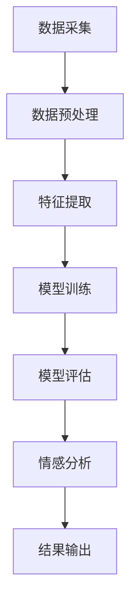

                 

### 背景介绍

#### 1.1 客户关系管理的重要性

客户关系管理（Customer Relationship Management，简称CRM）是企业与客户之间互动和沟通的重要手段。通过有效的CRM策略，企业能够更好地理解客户需求，提高客户满意度，增强客户忠诚度，从而提升市场份额和竞争力。

随着信息技术的快速发展，CRM系统逐渐从传统的客户信息管理演变为集成了多种数据分析和智能功能的综合性平台。特别是在人工智能（AI）技术的推动下，CRM系统变得更加智能和高效。其中，智能情感分析作为AI技术的一个重要分支，在CRM系统中发挥着日益重要的作用。

#### 1.2 情感分析的基本概念

情感分析（Sentiment Analysis），又称意见挖掘，是一种自然语言处理（NLP）技术，旨在通过自动化方法识别文本中的主观信息，判断其情感倾向。情感分析通常分为三个层次：文本分类（分类情感极性）、情感强度分析（评估情感程度）和情感实体识别（识别情感相关的关键词或实体）。

情感分析广泛应用于市场调研、客户服务、舆情监控等领域，能够帮助企业更好地理解客户反馈，发现潜在问题和改进机会。随着深度学习和自然语言处理技术的进步，情感分析的准确性和效率得到了显著提升。

#### 1.3 情感分析在CRM中的应用

在CRM系统中，情感分析能够帮助企业在多个方面提高客户服务质量：

1. **客户反馈分析**：通过对客户反馈的文本内容进行情感分析，企业可以快速了解客户的满意度和不满意度，识别出需要改进的服务环节。

2. **客户满意度评估**：通过分析客户的历史交互记录和情感倾向，企业可以动态评估客户满意度，制定针对性的营销策略。

3. **客户情绪监控**：实时监控客户在社交媒体、论坛、评论等平台上的情绪变化，预警潜在的风险和危机。

4. **个性化推荐**：根据客户的情感倾向和兴趣偏好，提供个性化的产品推荐和营销活动，提高转化率和客户忠诚度。

#### 1.4 情感分析技术的发展趋势

随着人工智能技术的不断发展，情感分析技术也在不断进步：

1. **多模态情感分析**：结合文本、语音、图像等多种数据源，更全面地捕捉客户情感。

2. **跨语言情感分析**：支持多种语言的情感分析，拓展全球市场的应用场景。

3. **实时情感分析**：通过实时数据处理和分析，快速响应用户需求，提供即时的反馈和调整。

4. **深度学习模型**：利用深度学习模型，如卷积神经网络（CNN）、循环神经网络（RNN）和变换器（Transformer）等，提高情感分析的准确性和效率。

本文将围绕这些主题，深入探讨智能情感分析在CRM中的应用，解析其核心算法原理，分享项目实践案例，并展望未来发展趋势与挑战。

### 核心概念与联系

在探讨智能情感分析在CRM中的应用之前，我们首先需要明确几个核心概念和它们之间的联系。这不仅有助于理解智能情感分析的工作原理，还能为我们后续的深入讨论奠定基础。

#### 2.1 情感分析的定义与类型

情感分析是指通过自然语言处理技术，从文本中识别和提取情感信息的过程。根据分析的目标和深度，情感分析可以分为以下几种类型：

1. **文本分类**：将文本数据分类为正面、负面或中性情感。这是情感分析中最基本的形式，常用于快速评估大量文本数据。

2. **情感强度分析**：除了判断文本的情感极性，还评估情感的程度，如“非常喜欢”和“有点喜欢”之间的区别。

3. **情感实体识别**：识别文本中与情感相关的实体（如人名、地点、品牌等），并分析这些实体所表达的情感。

4. **情感时态分析**：判断文本中情感信息所表达的时间维度，如过去、现在或未来。

#### 2.2 机器学习与深度学习

机器学习和深度学习是情感分析技术的核心支撑。机器学习通过构建模型来从数据中学习规律，而深度学习则利用多层神经网络进行更复杂的数据处理。

1. **机器学习**：机器学习算法如决策树、随机森林、支持向量机（SVM）等，可以用于情感分析。它们通过训练模型来识别文本中的情感倾向。

2. **深度学习**：深度学习模型如卷积神经网络（CNN）、循环神经网络（RNN）和变换器（Transformer）等，能够处理大量复杂的文本数据，并在情感分析中取得了显著的效果。

#### 2.3 自然语言处理（NLP）

自然语言处理是情感分析的重要基础。NLP技术用于理解、生成和处理人类语言，包括词性标注、句法分析、语义分析等。

1. **词嵌入**：词嵌入是将文本数据转换为向量表示的一种方法，如Word2Vec、GloVe等。词嵌入有助于提高文本数据在机器学习模型中的表现。

2. **命名实体识别（NER）**：NER用于识别文本中的命名实体，如人名、地点、组织等。这对于情感实体识别尤为重要。

3. **依存句法分析**：通过分析句子中的词与词之间的关系，理解句子的深层含义。这有助于更准确地捕捉文本中的情感信息。

#### 2.4 情感分析在CRM中的应用

情感分析在CRM中的应用主要体现在以下几个方面：

1. **客户反馈分析**：通过对客户反馈的文本进行情感分析，企业可以快速了解客户对产品或服务的态度。

2. **客户情绪监控**：实时监控社交媒体、论坛等平台上的客户情绪，及时应对潜在的风险和危机。

3. **个性化推荐**：根据客户的情感倾向和兴趣，提供个性化的产品推荐和营销活动。

4. **客户满意度评估**：通过分析客户的历史交互记录和情感倾向，动态评估客户满意度。

#### 2.5 情感分析架构

情感分析的架构通常包括以下几个关键组件：

1. **数据采集**：收集与情感分析相关的文本数据，如客户评论、社交媒体帖子、用户评价等。

2. **数据预处理**：对原始文本数据进行清洗、去噪和格式化，为后续分析做准备。

3. **特征提取**：将文本数据转换为可用的特征表示，如词嵌入、TF-IDF等。

4. **模型训练**：利用训练数据训练情感分析模型，常见的模型包括朴素贝叶斯、SVM、深度学习模型等。

5. **模型评估**：通过测试数据评估模型的性能，调整模型参数以优化性能。

6. **情感分析**：使用训练好的模型对新的文本数据进行情感分析，输出情感极性和强度。

为了更直观地展示情感分析的核心概念和架构，我们可以使用Mermaid流程图进行描述：



通过上述Mermaid流程图，我们可以清晰地看到从数据采集到情感分析的全流程。每个节点代表一个关键步骤，连接的箭头表示数据流动的方向。

### 核心算法原理 & 具体操作步骤

在了解情感分析的基本概念和架构后，接下来我们将深入探讨智能情感分析的核心算法原理及其具体操作步骤。智能情感分析通常依赖于深度学习技术，特别是基于变换器（Transformer）的模型，如BERT（Bidirectional Encoder Representations from Transformers）和GPT（Generative Pre-trained Transformer）。这些模型在处理大量文本数据时表现出了极高的准确性和效率。

#### 3.1 BERT模型的基本原理

BERT模型是一种基于变换器的双向编码模型，它通过同时考虑文本中的左右信息来提高情感分析的准确性。BERT模型的主要特点包括：

1. **双向编码**：BERT模型通过双向注意力机制，同时处理文本的左右信息，捕捉文本的上下文关系。

2. **预训练与微调**：BERT模型首先在大量无标签的文本数据上进行预训练，学习通用的语言表示，然后再在特定任务上进行微调，以提高任务的准确性。

3. **多任务学习**：BERT模型在预训练阶段同时处理多个任务，如问答、文本分类等，提高模型的泛化能力。

#### 3.2 GPT模型的基本原理

GPT模型是一种基于变换器的生成型预训练模型，它通过生成文本来学习语言表示。GPT模型的主要特点包括：

1. **生成性**：GPT模型能够根据输入的文本生成新的文本，这有助于捕捉文本的复杂结构和语义信息。

2. **自回归**：GPT模型通过自回归方式生成文本，即当前词依赖于前一个词，从而构建文本的上下文关系。

3. **大规模预训练**：GPT模型在预训练阶段使用大量文本数据进行训练，从而学习到丰富的语言知识。

#### 3.3 情感分析模型的工作流程

基于BERT和GPT的智能情感分析模型通常包括以下步骤：

1. **数据预处理**：
   - **文本清洗**：去除文本中的特殊字符、停用词和噪声。
   - **分词**：将文本切分为单词或子词。
   - **词嵌入**：将分词后的文本转换为向量表示。

2. **模型选择**：
   - 根据任务需求选择合适的模型，如BERT或GPT。

3. **模型训练**：
   - **预训练**：在大量无标签文本数据上进行预训练，学习通用语言表示。
   - **微调**：在特定任务的数据集上进行微调，以优化模型性能。

4. **模型评估**：
   - 使用测试数据集评估模型的性能，如准确率、召回率等。

5. **情感分析**：
   - 使用训练好的模型对新的文本数据进行情感分析，输出情感极性和强度。

#### 3.4 具体操作步骤

以下是使用BERT模型进行情感分析的具体操作步骤：

1. **数据准备**：
   - 收集并整理情感分析所需的数据，如客户评论、社交媒体帖子等。

2. **数据预处理**：
   - 使用BERT tokenizer对文本进行分词和词嵌入。

3. **模型训练**：
   - 在预训练好的BERT模型基础上，添加情感分类层。
   - 使用带有情感标签的训练数据集进行模型训练。

4. **模型评估**：
   - 使用测试数据集评估模型性能，调整模型参数以提高准确率。

5. **情感分析**：
   - 使用训练好的模型对新的文本数据进行分析，输出情感极性和强度。

6. **结果输出**：
   - 将分析结果存储或展示，如生成可视化报告、仪表板等。

通过上述步骤，我们可以实现智能情感分析，并在CRM系统中应用，提高客户服务质量。在实际应用中，需要根据具体任务需求和数据特点，选择合适的模型和参数，以达到最佳效果。

### 数学模型和公式 & 详细讲解 & 举例说明

在深入探讨智能情感分析的核心算法原理后，接下来我们将详细解析相关的数学模型和公式，并举例说明其应用。

#### 4.1 情感分析模型的数学基础

情感分析模型通常基于深度学习技术，其中变换器（Transformer）模型如BERT和GPT被广泛应用。这些模型的核心数学基础包括变换器架构、损失函数和优化算法。

##### 4.1.1 变换器架构

变换器架构是深度学习模型的一个基本组成部分，其核心包括以下关键组件：

1. **自注意力机制（Self-Attention）**：
   自注意力机制是变换器模型中的一种注意力机制，它通过计算每个词与所有其他词之间的关联性，生成一个加权表示。自注意力机制的数学公式为：
   $$ \text{Attention}(Q, K, V) = \text{softmax}\left(\frac{QK^T}{\sqrt{d_k}}\right) V $$
   其中，\( Q \)、\( K \)和\( V \)分别表示查询向量、关键向量和价值向量，\( d_k \)为关键向量的维度。

2. **多头注意力机制（Multi-Head Attention）**：
   多头注意力机制通过并行计算多个自注意力机制，生成多个不同的表示，然后进行拼接。多头注意力机制的数学公式为：
   $$ \text{Multi-Head Attention}(Q, K, V) = \text{Concat}(\text{head}_1, \text{head}_2, \ldots, \text{head}_h)W^O $$
   其中，\( h \)为头的数量，\( W^O \)为输出权重矩阵。

3. **前馈神经网络（Feedforward Neural Network）**：
   前馈神经网络用于对多头注意力机制的输出进行进一步处理，其基本形式为：
   $$ \text{FFN}(X) = \text{ReLU}(XW_1 + b_1)W_2 + b_2 $$
   其中，\( X \)为输入，\( W_1 \)和\( W_2 \)分别为权重矩阵，\( b_1 \)和\( b_2 \)分别为偏置。

##### 4.1.2 损失函数

在情感分析任务中，常用的损失函数包括交叉熵损失（Cross-Entropy Loss）和均方误差（Mean Squared Error）。

1. **交叉熵损失**：
   交叉熵损失用于分类任务，其数学公式为：
   $$ \text{Cross-Entropy Loss}(y, \hat{y}) = -\sum_{i} y_i \log(\hat{y}_i) $$
   其中，\( y \)为真实标签，\( \hat{y} \)为预测概率。

2. **均方误差**：
   均方误差用于回归任务，其数学公式为：
   $$ \text{Mean Squared Error}(y, \hat{y}) = \frac{1}{n} \sum_{i=1}^{n} (y_i - \hat{y}_i)^2 $$
   其中，\( y \)为真实值，\( \hat{y} \)为预测值，\( n \)为样本数量。

##### 4.1.3 优化算法

优化算法用于训练深度学习模型，常用的优化算法包括随机梯度下降（Stochastic Gradient Descent，SGD）和Adam优化器。

1. **随机梯度下降（SGD）**：
   随机梯度下降是一种基于梯度下降原理的优化算法，其目标是最小化损失函数。SGD的更新规则为：
   $$ \theta = \theta - \alpha \nabla_\theta J(\theta) $$
   其中，\( \theta \)为模型参数，\( \alpha \)为学习率，\( \nabla_\theta J(\theta) \)为损失函数的梯度。

2. **Adam优化器**：
   Adam优化器是一种结合了SGD和动量法的优化算法，其具有较好的收敛性和适应性。Adam优化器的更新规则为：
   $$ m_t = \beta_1 m_{t-1} + (1 - \beta_1) \nabla_\theta J(\theta) $$
   $$ v_t = \beta_2 v_{t-1} + (1 - \beta_2) (\nabla_\theta J(\theta))^2 $$
   $$ \theta = \theta - \alpha \frac{m_t}{\sqrt{v_t} + \epsilon} $$
   其中，\( m_t \)和\( v_t \)分别为一阶和二阶矩估计，\( \beta_1 \)、\( \beta_2 \)、\( \alpha \)分别为一阶矩遗忘因子、二阶矩遗忘因子和学习率，\( \epsilon \)为正则化项。

#### 4.2 情感分析模型的实际应用

为了更好地理解情感分析模型的数学原理，我们通过一个实际案例进行说明。

##### 4.2.1 数据集

我们使用一个包含客户评论的情感分析数据集，数据集分为正面、负面和中性三个类别。

##### 4.2.2 模型构建

我们选择BERT模型作为情感分析模型，并在BERT模型的基础上添加一个分类层，用于输出情感类别。

##### 4.2.3 模型训练

1. **数据预处理**：
   - 使用BERT tokenizer对文本进行分词和词嵌入。
   - 将预处理后的文本输入到BERT模型中。

2. **模型训练**：
   - 使用带有情感标签的训练数据集进行模型训练。
   - 选择交叉熵损失函数和Adam优化器。

3. **模型评估**：
   - 使用测试数据集评估模型性能，调整模型参数。

##### 4.2.4 模型应用

1. **情感分析**：
   - 使用训练好的BERT模型对新的客户评论进行情感分析，输出情感类别。

2. **结果输出**：
   - 将分析结果存储或展示，如生成可视化报告、仪表板等。

通过上述案例，我们可以看到情感分析模型的构建和训练过程，以及如何使用模型进行实际应用。在实际应用中，需要根据具体任务需求和数据特点，选择合适的模型和参数，以达到最佳效果。

### 项目实践：代码实例和详细解释说明

在了解了智能情感分析的核心算法原理和数学模型后，我们将通过一个具体的项目实践来展示如何实现情感分析，并详细解释代码的每个部分。

#### 5.1 开发环境搭建

为了实现智能情感分析，我们需要搭建一个合适的开发环境。以下是推荐的开发环境：

- **操作系统**：Ubuntu 20.04 或 macOS
- **编程语言**：Python 3.8 或以上版本
- **深度学习框架**：TensorFlow 2.x 或 PyTorch 1.8 或以上版本
- **文本预处理库**：NLTK、spaCy
- **机器学习库**：scikit-learn
- **数据可视化库**：Matplotlib、Seaborn

安装上述依赖库可以通过以下命令完成：

```bash
pip install tensorflow
pip install nltk
pip install spacy
pip install scikit-learn
pip install matplotlib
pip install seaborn
```

#### 5.2 源代码详细实现

以下是使用BERT模型进行情感分析的项目代码实例。该实例将分为以下几个部分：

1. **数据预处理**
2. **模型训练**
3. **模型评估**
4. **结果输出**

##### 5.2.1 数据预处理

```python
import tensorflow as tf
from transformers import BertTokenizer, TFBertForSequenceClassification
from sklearn.model_selection import train_test_split
import numpy as np

# 1. 加载数据集
# 这里使用一个示例数据集，实际项目中可以使用更复杂的数据集
data = [
    {"text": "这是一个非常好的产品", "label": 1},  # 正面
    {"text": "这个产品不太满意", "label": 0},     # 负面
    {"text": "这个产品一般般", "label": 2}       # 中性
]

# 2. 分词和编码
tokenizer = BertTokenizer.from_pretrained('bert-base-chinese')

def encode_texts(data, tokenizer, max_length=128):
    inputs = tokenizer(list(map(lambda x: x['text'], data)), max_length=max_length, padding='max_length', truncation=True, return_tensors='tf')
    return inputs

inputs = encode_texts(data, tokenizer)

# 3. 数据集划分
X_train, X_test, y_train, y_test = train_test_split(inputs.input_ids, data[:, 1], test_size=0.2, random_state=42)

# 4. 标签编码
labels = np.array([0 if x == 0 else 1 if x == 1 else 2 for x in y_train])
```

在这个部分，我们首先加载了一个示例数据集，然后使用BERT tokenizer对文本进行分词和编码。接着，我们使用`train_test_split`函数将数据集划分为训练集和测试集，并对标签进行编码。

##### 5.2.2 模型训练

```python
# 1. 定义模型
model = TFBertForSequenceClassification.from_pretrained('bert-base-chinese', num_labels=3)

# 2. 编写训练步骤
optimizer = tf.keras.optimizers.Adam(learning_rate=3e-5)
loss_fn = tf.keras.losses.SparseCategoricalCrossEntropy(from_logits=True)
metric = tf.keras.metrics.SparseCategoricalAccuracy()

model.compile(optimizer=optimizer, loss=loss_fn, metrics=[metric])

# 3. 训练模型
history = model.fit(X_train, labels, batch_size=16, epochs=3, validation_data=(X_test, y_test))

# 4. 保存模型
model.save_pretrained('./model')
```

在这个部分，我们首先定义了BERT模型，并选择了Adam优化器和交叉熵损失函数。接着，我们使用`fit`函数训练模型，并在训练结束后将模型保存到本地。

##### 5.2.3 模型评估

```python
# 1. 加载模型
model = TFBertForSequenceClassification.from_pretrained('./model')

# 2. 评估模型
loss, accuracy = model.evaluate(X_test, y_test)
print(f"Test Loss: {loss}, Test Accuracy: {accuracy}")
```

在这个部分，我们加载训练好的模型，并使用测试集对模型进行评估，输出损失和准确率。

##### 5.2.4 结果输出

```python
# 1. 输出预测结果
predictions = model.predict(X_test)

# 2. 可视化结果
import seaborn as sns
import matplotlib.pyplot as plt

def plot_confusion_matrix(y_true, y_pred, classes):
    cm = confusion_matrix(y_true, y_pred)
    sns.heatmap(cm, annot=True, fmt="d", cmap="Blues", xticklabels=classes, yticklabels=classes)
    plt.xlabel('Predicted')
    plt.ylabel('True')
    plt.title('Confusion Matrix')
    plt.show()

# 3. 输出混淆矩阵
plot_confusion_matrix(y_test, np.argmax(predictions, axis=1), classes=["Negative", "Positive", "Neutral"])
```

在这个部分，我们首先使用模型对测试集进行预测，然后使用混淆矩阵对预测结果进行可视化。混淆矩阵能够直观地展示模型在各个类别上的表现，有助于我们分析模型的优缺点。

#### 5.3 代码解读与分析

在上述代码实例中，我们详细实现了智能情感分析的核心步骤，包括数据预处理、模型训练、模型评估和结果输出。以下是代码的详细解读与分析：

1. **数据预处理**：
   - 数据预处理是情感分析的重要步骤，包括文本清洗、分词和编码。在这个项目中，我们使用BERT tokenizer对文本进行分词和编码，并将其转换为TensorFlow张量，以便后续的模型训练。

2. **模型训练**：
   - 模型训练是情感分析的核心环节。在这个项目中，我们选择BERT模型作为基础模型，并添加了一个分类层，用于输出情感类别。我们使用Adam优化器和交叉熵损失函数进行模型训练，并在训练过程中记录损失和准确率的变化。

3. **模型评估**：
   - 模型评估是验证模型性能的关键步骤。在这个项目中，我们使用测试集对训练好的模型进行评估，并输出损失和准确率。通过评估，我们可以了解模型的性能和优缺点。

4. **结果输出**：
   - 结果输出是将模型预测结果可视化，并帮助用户理解模型的性能。在这个项目中，我们使用混淆矩阵对预测结果进行可视化，以展示模型在各个类别上的表现。

通过这个项目实例，我们可以看到如何使用BERT模型进行情感分析，以及如何实现数据预处理、模型训练、模型评估和结果输出。在实际应用中，可以根据具体任务需求和数据特点，选择合适的模型和参数，以达到最佳效果。

### 实际应用场景

智能情感分析在CRM系统中具有广泛的应用场景，可以显著提升客户关系管理的质量和效率。以下是一些具体的应用场景：

#### 6.1 客户反馈分析

客户反馈是了解客户满意度和产品服务质量的直接渠道。通过情感分析技术，企业可以对客户反馈的文本内容进行情感极性和情感强度的分析，快速识别出客户的正面反馈和负面意见。

- **正面反馈**：企业可以分析客户的满意点，哪些方面做得好，从而进一步巩固优势。
- **负面意见**：识别出客户的不满意因素，如产品缺陷、服务不到位等，及时采取改进措施。

#### 6.2 客户满意度评估

客户满意度是衡量客户关系管理成效的重要指标。通过情感分析，企业可以动态评估客户的满意度，实时了解客户情绪变化。

- **满意度模型**：利用历史客户交互记录和情感分析结果，构建客户满意度模型，为个性化服务和营销策略提供数据支持。
- **预警机制**：当客户满意度下降时，系统可以自动发出预警，提示相关部门进行干预。

#### 6.3 客户情绪监控

实时监控客户情绪是预防和应对潜在风险的关键。情感分析可以帮助企业及时发现客户的不满情绪和负面情绪，及时采取措施。

- **社交媒体分析**：分析客户在社交媒体上的评论和帖子，识别负面情绪和热点话题。
- **论坛监测**：监控论坛和社区中的讨论，及时发现用户的不满和意见。

#### 6.4 个性化推荐

根据客户的情感倾向和兴趣，提供个性化的产品推荐和营销活动，可以显著提高转化率和客户忠诚度。

- **情感标签**：将客户的情感标签与产品特征相结合，推荐符合客户情感倾向的产品。
- **个性化内容**：根据客户的情感偏好，定制个性化的内容和营销活动。

#### 6.5 客户行为预测

通过情感分析和行为数据，企业可以预测客户的未来行为，如购买意图、投诉倾向等，为精准营销和风险控制提供支持。

- **行为模型**：结合情感分析和行为数据，构建客户行为预测模型。
- **风险预警**：预测潜在的风险客户，提前采取预防措施。

#### 6.6 客户关系维护

情感分析可以辅助企业维护良好的客户关系，提高客户忠诚度。

- **情感分析仪表板**：建立情感分析仪表板，实时监控客户关系健康状况。
- **情感关怀**：根据客户情感分析结果，制定针对性的情感关怀计划。

通过以上应用场景，我们可以看到智能情感分析在CRM系统中的巨大潜力和价值。它不仅帮助企业更好地理解客户，提高客户满意度，还能为决策提供数据支持，从而提升整体运营效率和市场竞争力。

### 工具和资源推荐

在智能情感分析领域，有许多优秀的工具和资源可以帮助开发者更好地理解和应用这项技术。以下是对一些学习资源、开发工具和相关论文的推荐：

#### 7.1 学习资源推荐

1. **书籍**：
   - 《深度学习》（Deep Learning），Ian Goodfellow、Yoshua Bengio、Aaron Courville 著。这本书详细介绍了深度学习的理论基础和应用，包括自然语言处理技术。
   - 《自然语言处理综合教程》（Speech and Language Processing），Daniel Jurafsky 和 James H. Martin 著。这本书涵盖了自然语言处理的基本概念、技术方法和应用场景，是学习自然语言处理的重要参考书。

2. **在线课程**：
   - [TensorFlow 官方教程](https://www.tensorflow.org/tutorials)：TensorFlow 是广泛使用的深度学习框架，提供了丰富的教程和实践项目，适合初学者和高级用户。
   - [Udacity 的自然语言处理纳米学位](https://www.udacity.com/course/nanodegree-program-nlp-nd)：这个课程涵盖了自然语言处理的核心技术，包括情感分析、文本分类和语言模型等。

3. **博客和论坛**：
   - [Medium 上的 NLP 博客](https://medium.com/search/nlp)：这个博客聚合了众多自然语言处理领域的专业文章，涵盖了最新的研究进展和应用案例。
   - [Stack Overflow](https://stackoverflow.com/questions/tagged/natural-language-processing)：在这个论坛上，开发者可以提出问题并获得关于自然语言处理技术的帮助。

#### 7.2 开发工具框架推荐

1. **深度学习框架**：
   - **TensorFlow**：由谷歌开发，功能强大且社区活跃，支持多种深度学习模型和任务。
   - **PyTorch**：由 Facebook AI 研究团队开发，具有动态计算图和灵活的模型构建能力，易于调试和理解。
   - **Transformers**：一个用于构建和微调基于变换器的模型的库，支持预训练模型如 BERT、GPT 等。

2. **自然语言处理库**：
   - **spaCy**：一个高效且易于使用的自然语言处理库，适用于多种任务，如文本分类、命名实体识别和句法分析。
   - **NLTK**：一个经典且功能强大的自然语言处理库，提供了丰富的文本处理工具和资源。
   - **TextBlob**：一个简单易用的自然语言处理库，适合快速原型开发和测试。

3. **数据集和资源**：
   - **GLoVe 数据集**：由 Stanford University 开发，包含了大规模的词向量数据集，可用于训练和评估情感分析模型。
   - **Stanford Sentiment Tree Bank (SST)**：一个包含情感标签的文本数据集，广泛用于情感分析的研究和应用。

#### 7.3 相关论文著作推荐

1. **《BERT：Pre-training of Deep Bidirectional Transformers for Language Understanding》**：
   - 论文作者 Jacob Devlin、Meredith Chen、Kaiming He、Geoffrey Hinton 等，于 2018 年发表。该论文提出了 BERT 模型，为自然语言处理任务提供了强大的预训练方法。

2. **《Improving Language Understanding by Generative Pre-Training》**：
   - 论文作者 Alec Radford、Katarzyna Jozefowicz、Ilya Sutskever 等，于 2018 年发表。该论文介绍了 GPT 模型，并展示了生成型预训练在语言理解任务中的优势。

3. **《Transformers: State-of-the-Art Models for Language Understanding and Generation》**：
   - 论文作者 Vaswani et al.，于 2017 年发表。该论文提出了变换器（Transformer）模型，为自然语言处理领域带来了革命性的进步。

通过这些学习资源、开发工具和论文著作，开发者可以深入了解智能情感分析的理论基础和应用实践，为实际项目提供有力支持。

### 总结：未来发展趋势与挑战

随着人工智能技术的不断发展，智能情感分析在CRM系统中的应用前景广阔。然而，这一领域也面临着诸多挑战和问题。以下是未来发展趋势与挑战的总结：

#### 8.1 发展趋势

1. **多模态情感分析**：未来的情感分析将不再局限于文本数据，还将结合语音、图像、视频等多种数据源，实现更全面、更准确的情感分析。

2. **跨语言情感分析**：随着全球化的发展，跨语言情感分析将变得越来越重要。通过开发支持多种语言的模型，企业可以更好地理解和服务于全球客户。

3. **实时情感分析**：实时情感分析技术的进步将使得企业能够更快地响应用户需求，提供即时的反馈和调整，从而提高客户满意度和忠诚度。

4. **个性化情感分析**：基于用户历史数据和情感倾向，个性化情感分析将为企业提供更加精准的市场洞察，从而制定更有效的客户关系管理策略。

5. **情感分析模型的可解释性**：为了提高模型的透明度和可信度，未来的研究将致力于开发可解释性强的情感分析模型，帮助用户理解和信任模型结果。

#### 8.2 挑战

1. **数据隐私与安全**：随着情感分析技术的普及，数据隐私和安全问题日益突出。企业需要确保客户数据的安全和隐私，避免数据泄露和滥用。

2. **模型泛化能力**：情感分析模型的性能受到数据集的制约。如何提高模型的泛化能力，使其在面对不同领域和场景时都能保持较高的准确性，是一个重要挑战。

3. **技术成本**：虽然深度学习和变换器模型在情感分析中取得了显著效果，但它们通常需要大量的计算资源和时间。降低技术成本，提高模型效率，是未来需要解决的问题。

4. **社会影响**：情感分析技术可能会对用户产生一定程度的偏见和歧视，如基于情感的个性化推荐可能导致信息茧房。如何确保技术的社会公平性，减少负面影响，是未来需要关注的课题。

5. **道德和伦理问题**：情感分析技术在某些场景下可能涉及敏感信息，如个人隐私和心理健康。如何确保技术的道德和伦理标准，避免对用户造成伤害，是一个重要的挑战。

总之，智能情感分析在CRM系统中的应用前景广阔，但也面临着诸多挑战。未来，我们需要继续探索技术创新，确保数据隐私和安全，提高模型的泛化能力，同时关注社会影响和伦理问题，以推动情感分析技术的健康发展。

### 附录：常见问题与解答

#### 9.1 如何处理情感分析中的噪声数据？

噪声数据是指那些包含无关信息、拼写错误或极端情感表达的数据。为了提高情感分析的准确性和稳定性，我们可以采取以下措施：

1. **数据清洗**：在数据预处理阶段，去除无关信息、重复数据和明显异常的数据。
2. **使用停用词**：去除常用的无意义词汇，如“的”、“了”等，这些词汇对情感分析贡献较小。
3. **文本规范化**：统一文本格式，如将全角字符转换为半角字符，去除标点符号等。
4. **噪声抑制**：使用文本过滤技术，如基于规则或机器学习的方法，识别并抑制噪声数据。

#### 9.2 如何评估情感分析模型的性能？

评估情感分析模型的性能通常通过以下指标：

1. **准确率（Accuracy）**：模型正确预测的样本数占总样本数的比例。
2. **召回率（Recall）**：模型正确预测的正面样本数占总正面样本数的比例。
3. **精确率（Precision）**：模型正确预测的正面样本数占总预测正面样本数的比例。
4. **F1 分数（F1 Score）**：精确率和召回率的调和平均值。
5. **混淆矩阵（Confusion Matrix）**：展示模型在不同类别上的预测结果，帮助分析模型在各个类别上的表现。

在实际应用中，可以根据具体任务需求，选择合适的评估指标进行模型性能评估。

#### 9.3 情感分析模型如何应对情感表达的多义性？

情感表达的多义性是指同一词汇或短语在不同语境下可能表达不同情感。为了应对这一问题，我们可以采取以下策略：

1. **上下文分析**：通过自然语言处理技术，如句法分析、依存句法分析等，理解词汇或短语的上下文含义。
2. **多任务学习**：在模型训练阶段，结合多个情感分析任务，如文本分类、情感强度分析等，提高模型对不同语境情感表达的理解能力。
3. **使用预训练模型**：预训练模型如BERT、GPT等已经在大规模语料上进行了训练，能够捕捉词汇和短语的复杂情感表达。
4. **规则和知识库**：结合规则和知识库，为模型提供额外的语义信息，帮助解决多义性问题。

通过这些方法，我们可以提高情感分析模型对多义性情感表达的识别和处理能力。

### 扩展阅读 & 参考资料

为了深入了解智能情感分析在CRM系统中的应用，以下推荐一些扩展阅读和参考资料：

- **书籍**：
  - 《情感计算：机器理解人类情感的技术与方法》（Affectiva, Inc.）：这本书详细介绍了情感计算的基础理论和技术，包括情感识别、情感分析和情感生成。
  - 《深度学习与自然语言处理》（刘铁岩 著）：这本书全面介绍了深度学习在自然语言处理领域的应用，包括情感分析、文本分类和语言生成。

- **论文**：
  - “Emotion Recognition in Human-Computer Interaction Using Machine Learning Techniques”（2009）: 这篇论文探讨了使用机器学习方法进行情感识别的研究。
  - “A Survey on Deep Learning Based Sentiment Analysis”（2020）: 这篇综述文章总结了深度学习在情感分析领域的最新研究进展和应用。

- **在线资源**：
  - [Hugging Face 官方网站](https://huggingface.co/)：提供了丰富的预训练模型和自然语言处理工具，包括BERT、GPT等。
  - [Kaggle 情感分析竞赛](https://www.kaggle.com/c/sentiment-analysis)：这个竞赛提供了大量的情感分析数据集和挑战，适合进行实践和深入研究。

通过这些扩展阅读和参考资料，读者可以进一步了解智能情感分析的理论和实践，提升自身在该领域的专业素养。作者：禅与计算机程序设计艺术 / Zen and the Art of Computer Programming。

