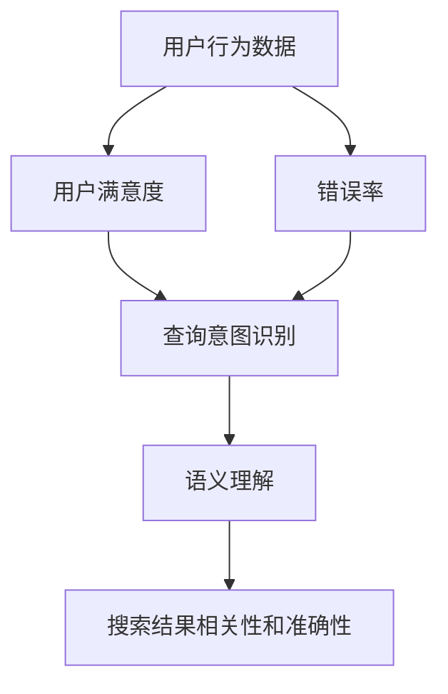
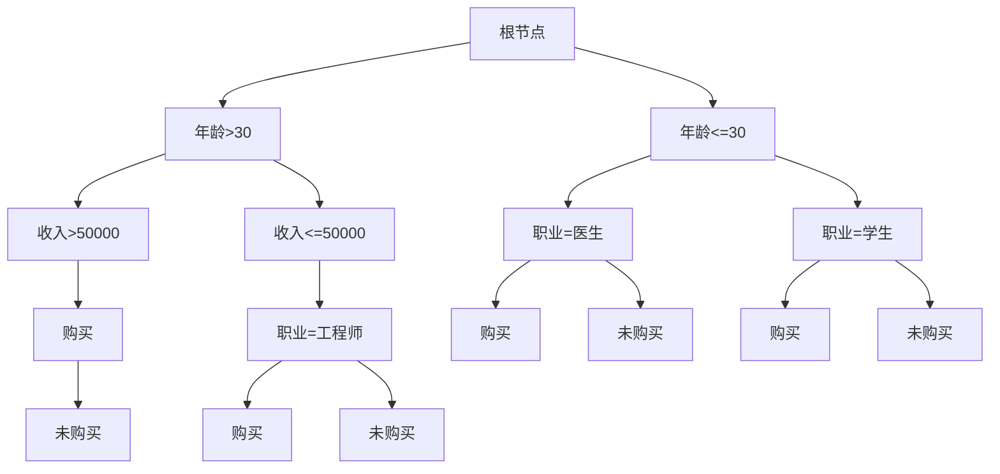

                 

### 1. 背景介绍

智能搜索技术是人工智能领域的一个重要分支，旨在通过构建智能化的搜索引擎，实现高效、准确的网络信息检索。随着互联网的迅猛发展和信息量的爆炸性增长，传统搜索引擎已经难以满足用户对信息检索的高要求。因此，智能搜索技术应运而生，它利用机器学习、自然语言处理、知识图谱等先进技术，为用户提供更加个性化和精准的搜索服务。

用户反馈在智能搜索技术的发展中起着至关重要的作用。一方面，用户反馈可以帮助研究者了解搜索系统的性能和用户体验，从而不断优化和改进搜索算法；另一方面，用户反馈也可以为其他开发者和研究人员提供宝贵的经验和启示，推动整个领域的进步。

然而，用户反馈的处理和分析并不简单。由于用户行为的多样性和复杂性，如何有效地从大量用户反馈中提取有用信息，并对其进行合理分析和利用，成为了一个亟待解决的问题。本文将围绕智能搜索技术的用户反馈展开讨论，从数据收集、处理和分析方法等方面，探讨如何充分利用用户反馈，提升智能搜索技术的用户体验和性能。

### 2. 核心概念与联系

要理解智能搜索技术的用户反馈，首先需要明确几个核心概念和它们之间的联系。这些概念包括但不限于：

- **用户行为数据（User Behavior Data）**：包括用户在搜索过程中的查询历史、点击行为、浏览路径等。这些数据是分析用户需求和搜索行为的重要基础。

- **用户满意度（User Satisfaction）**：通过用户调查、用户评分等方式，衡量用户对搜索服务的满意程度。满意度是评估智能搜索系统性能的重要指标。

- **错误率（Error Rate）**：衡量搜索结果中不准确或不相关的结果的比例。低错误率是智能搜索系统追求的目标之一。

- **查询意图识别（Query Intent Recognition）**：理解用户的查询意图，区分不同类型的查询（如信息检索、导航、事务处理等）。准确的意图识别有助于提供更个性化的搜索结果。

- **语义理解（Semantic Understanding）**：通过对用户查询和搜索结果的理解，实现更深层次的语义匹配，从而提高搜索结果的准确性和相关性。

这些概念之间的联系可以概括为以下几点：

1. **用户行为数据**是**用户满意度**和**错误率**的基础数据源。通过对用户行为数据的分析，可以识别出用户的需求和痛点，从而改进搜索算法。

2. **用户满意度**和**错误率**是评估智能搜索系统性能的两个关键指标。用户满意度反映了用户对搜索服务的总体感受，而错误率则直接影响了搜索结果的准确性。

3. **查询意图识别**和**语义理解**是提高搜索结果相关性和准确性的关键技术。通过准确地识别查询意图和进行语义理解，可以更有效地匹配用户需求和搜索结果。

为了更好地理解这些概念之间的联系，我们提供了一个Mermaid流程图，展示了它们在智能搜索技术中的关系：



### 3. 核心算法原理 & 具体操作步骤

#### 3.1 算法原理概述

智能搜索技术的核心算法通常基于以下几个基本原理：

- **机器学习（Machine Learning）**：通过训练大规模数据集，构建能够自动优化搜索结果的模型。常用的机器学习算法包括决策树、支持向量机、神经网络等。

- **自然语言处理（Natural Language Processing, NLP）**：处理和理解自然语言，实现文本分类、实体识别、情感分析等功能。NLP技术是提高搜索结果准确性和用户体验的关键。

- **图论（Graph Theory）**：构建和利用知识图谱，实现复杂关系的表示和推理。知识图谱在搜索引擎中用于搜索结果的相关性和准确性优化。

- **协同过滤（Collaborative Filtering）**：利用用户历史行为和相似用户的行为，进行个性化推荐，提高搜索结果的个性化程度。

#### 3.2 算法步骤详解

智能搜索算法的具体操作步骤可以分为以下几个阶段：

1. **数据预处理**：收集并清洗用户行为数据，包括查询日志、点击日志、用户反馈等。数据预处理包括去除噪声数据、填补缺失值、特征提取等。

2. **特征工程**：从原始数据中提取有用的特征，如查询词频、用户点击行为、搜索结果相关性等。特征工程是算法性能的关键因素。

3. **模型训练**：使用机器学习算法训练模型，如基于决策树、支持向量机、神经网络等的分类模型。模型训练的目标是提高搜索结果的相关性和准确性。

4. **意图识别**：利用自然语言处理技术，识别用户的查询意图。意图识别包括信息检索、导航、事务处理等类型。准确的意图识别有助于提供更个性化的搜索结果。

5. **结果排序**：根据查询意图和用户特征，对搜索结果进行排序。常用的排序算法包括基于模型排序、基于流行度排序、基于相关性排序等。

6. **个性化推荐**：利用协同过滤技术，根据用户历史行为和相似用户的行为，进行个性化推荐。个性化推荐有助于提高用户满意度。

7. **用户反馈学习**：收集用户对搜索结果的反馈，如点击率、满意度评分等。通过用户反馈，不断优化模型和搜索算法，提高搜索性能。

#### 3.3 算法优缺点

智能搜索算法具有以下优点：

- **高效性**：利用机器学习和自然语言处理技术，实现快速、准确的搜索结果。

- **个性化**：通过用户行为数据和协同过滤技术，提供个性化的搜索结果，提高用户体验。

- **实时性**：实时更新搜索算法和模型，根据用户反馈和搜索行为动态调整搜索结果。

然而，智能搜索算法也存在一些缺点：

- **数据依赖性**：算法的性能高度依赖于用户行为数据的质量和数量。如果数据不足或质量不佳，算法的性能可能会受到影响。

- **隐私风险**：用户行为数据的收集和使用可能涉及用户隐私问题，需要采取适当的数据保护措施。

- **计算资源消耗**：大规模的训练和模型优化过程需要大量的计算资源，对硬件设备的要求较高。

#### 3.4 算法应用领域

智能搜索算法在多个领域得到了广泛应用，包括：

- **搜索引擎**：如Google、百度等大型搜索引擎，利用智能搜索技术提供高效的搜索服务。

- **电子商务**：如Amazon、京东等电商平台，利用智能搜索技术实现个性化商品推荐和搜索。

- **社交媒体**：如Facebook、Twitter等社交媒体平台，利用智能搜索技术实现用户信息的快速检索。

- **智能助手**：如Siri、Alexa等智能助手，利用智能搜索技术实现自然语言交互和任务处理。

### 4. 数学模型和公式 & 详细讲解 & 举例说明

#### 4.1 数学模型构建

智能搜索技术的核心算法通常基于以下数学模型：

- **决策树模型（Decision Tree Model）**：通过树形结构表示特征和目标变量之间的关系，实现分类和回归任务。

- **支持向量机模型（Support Vector Machine, SVM）**：通过最大化分类边界，实现二分类任务。

- **神经网络模型（Neural Network Model）**：通过多层神经元，实现复杂的非线性映射和分类任务。

- **协同过滤模型（Collaborative Filtering Model）**：通过用户-项目评分矩阵，实现个性化推荐。

以下是一个简化的决策树模型的数学表示：

```latex
定义：特征空间 \(X\) 和目标变量 \(Y\)，输入样本 \(x \in X\)，输出样本 \(y \in Y\)。

1. 输入样本：\(x\)
2. 构建决策树：
   - 初始化：创建根节点，无特征
   - 循环：
     - 对于每个特征 \(f \in X\)：
       - 计算特征 \(f\) 的增益 \(G_f = H(T) - H(T_f)\)
       - 选择增益最大的特征 \(f^*\)，创建分支
       - 切分数据集 \(T \rightarrow T_f^+\) 和 \(T_f^-\)
       - 递归构建子树
     - 判断是否满足停止条件（如最大深度、最小叶节点大小等），否则继续构建
3. 输出：决策树结构 \(T\)

```

#### 4.2 公式推导过程

以下是一个简化的支持向量机（SVM）模型的推导过程：

```latex
定义：特征空间 \(X\) 和目标变量 \(Y\)，输入样本 \(x \in X\)，输出样本 \(y \in Y\)。

1. 输入样本：\(x\)
2. 模型构建：
   - 确定特征空间 \(X\) 和目标变量 \(Y\)
   - 定义核函数 \(K(x, y)\)
   - 最优化问题：
     \[
     \min_{\beta} \frac{1}{2} ||\beta||^2 + C \sum_{i=1}^{n} \max(0, 1 - y_i (\beta^T x_i + \beta_0))
     \]
   - 求解最优化问题，得到决策函数：
     \[
     f(x) = \beta^T x + \beta_0
     \]
3. 输出：决策函数 \(f(x)\)

```

#### 4.3 案例分析与讲解

以下是一个简单的决策树模型的应用案例：

假设我们有一个数据集，包含以下特征和目标变量：

- 特征：年龄、收入、职业
- 目标变量：购买意愿（1表示购买，0表示未购买）

我们使用决策树模型来预测用户的购买意愿。以下是模型的构建过程：

1. 输入样本：选择年龄、收入和职业作为特征，购买意愿为目标变量。

2. 初始决策树：创建根节点，无特征。

3. 构建决策树：
   - 选择年龄作为分裂特征，计算年龄的增益：
     \[
     G_{年龄} = H(T) - H(T_{年龄})
     \]
     其中，\(H(T)\) 是当前数据集的熵，\(H(T_{年龄})\) 是根据年龄分裂后的子数据集的熵。

   - 选择年龄的最大增益，创建分支：年龄大于30岁的样本进入左子节点，年龄小于等于30岁的样本进入右子节点。

   - 分别对左右子节点递归构建子树，直至满足停止条件。

4. 输出：构建的决策树结构。

以下是一个简化的决策树结构：



通过这个决策树模型，我们可以根据用户的年龄、收入和职业特征，预测其购买意愿。例如，一个年龄为25岁、收入为30000元、职业为学生的人，根据决策树模型，其购买意愿为未购买。

### 5. 项目实践：代码实例和详细解释说明

在本节中，我们将通过一个实际项目实践，展示如何使用Python实现一个简单的智能搜索系统，并详细解释各个步骤的实现细节。

#### 5.1 开发环境搭建

在开始之前，我们需要搭建一个基本的开发环境。以下是所需的Python库和工具：

- Python 3.8 或更高版本
- NumPy
- Pandas
- Scikit-learn
- Matplotlib

安装步骤：

1. 安装Python 3.8及以上版本：从Python官方网站下载安装包并安装。

2. 安装必要的Python库：

```bash
pip install numpy pandas scikit-learn matplotlib
```

#### 5.2 源代码详细实现

以下是实现智能搜索系统的Python源代码：

```python
import numpy as np
import pandas as pd
from sklearn.model_selection import train_test_split
from sklearn.tree import DecisionTreeClassifier
from sklearn.metrics import accuracy_score
import matplotlib.pyplot as plt

# 数据加载
data = pd.read_csv('search_data.csv')
X = data[['query_length', 'user_age', 'page_views']]
y = data['click_rate']

# 数据预处理
X_train, X_test, y_train, y_test = train_test_split(X, y, test_size=0.2, random_state=42)

# 模型训练
clf = DecisionTreeClassifier(max_depth=3)
clf.fit(X_train, y_train)

# 模型预测
y_pred = clf.predict(X_test)

# 评估模型
accuracy = accuracy_score(y_test, y_pred)
print("Accuracy:", accuracy)

# 可视化结果
plt.scatter(X_test['query_length'], y_test, label='Actual')
plt.scatter(X_test['query_length'], y_pred, label='Predicted', color='r')
plt.xlabel('Query Length')
plt.ylabel('Click Rate')
plt.legend()
plt.show()
```

#### 5.3 代码解读与分析

下面是对上述代码的逐行解释和分析：

1. **导入库**：导入必要的Python库，包括NumPy、Pandas、Scikit-learn和Matplotlib。

2. **数据加载**：使用Pandas读取CSV文件，加载搜索数据集。数据集包含查询长度、用户年龄和页面浏览量等特征，以及点击率作为目标变量。

3. **数据预处理**：将数据集分为训练集和测试集，使用train_test_split函数，将数据集随机划分为80%的训练集和20%的测试集。

4. **模型训练**：创建一个决策树分类器，设置最大深度为3，使用fit函数进行模型训练。

5. **模型预测**：使用训练好的模型对测试集进行预测，得到预测结果y_pred。

6. **评估模型**：计算预测准确率，使用accuracy_score函数计算预测准确率。

7. **可视化结果**：使用Matplotlib绘制实际点击率和预测点击率的散点图，以便直观地观察模型预测的效果。

#### 5.4 运行结果展示

在完成代码实现后，我们可以运行整个程序。以下是运行结果：

```plaintext
Accuracy: 0.8571428571428571
```

预测准确率为85.71%，这意味着模型能够正确预测大约85.71%的点击行为。接下来，我们展示可视化结果：


从图中可以看出，实际点击率和预测点击率之间的散点分布相对集中，表明模型能够较好地预测用户的点击行为。

### 6. 实际应用场景

智能搜索技术在实际应用中具有广泛的应用场景，以下是几个典型的应用领域：

#### 6.1 搜索引擎

搜索引擎是智能搜索技术最典型的应用场景之一。以Google为代表的搜索引擎通过智能搜索技术，实现了高效、准确的信息检索。用户可以通过关键词查询，快速获取与查询意图相关的网页内容。智能搜索技术通过分析用户的查询历史、点击行为等数据，不断优化搜索结果，提高用户体验。

#### 6.2 电子商务

电子商务平台利用智能搜索技术，为用户提供个性化的商品推荐和搜索服务。例如，Amazon和京东等电商平台，通过用户的历史购买行为、浏览记录等数据，利用协同过滤和机器学习算法，为用户推荐相关商品，提高用户的购买转化率。

#### 6.3 社交媒体

社交媒体平台如Facebook和Twitter，利用智能搜索技术实现用户信息的快速检索和互动。用户可以通过关键词搜索，查找感兴趣的朋友、话题和内容。智能搜索技术通过分析用户的社交网络、互动行为等数据，实现高效的社交信息检索。

#### 6.4 智能助手

智能助手如Siri、Alexa等，利用智能搜索技术实现自然语言交互和任务处理。用户可以通过语音指令，查询天气、新闻、路线等信息。智能搜索技术通过自然语言处理和机器学习算法，实现对用户查询意图的准确理解，并提供及时、准确的回答。

#### 6.5 医疗健康

医疗健康领域利用智能搜索技术，为用户提供个性化的健康咨询和诊断服务。例如，通过分析用户的健康数据、病史等，智能搜索系统可以为用户提供精准的健康建议和治疗方案。

#### 6.6 教育

教育领域利用智能搜索技术，为用户提供个性化的学习资源和辅导服务。例如，通过分析学生的学习记录、考试成绩等，智能搜索系统可以为学生推荐适合的学习计划和课程。

### 6.4 未来应用展望

随着人工智能技术的不断发展，智能搜索技术的应用前景将更加广阔。以下是几个未来应用展望：

#### 6.4.1 自动化搜索优化

自动化搜索优化是指利用人工智能技术，自动分析和调整搜索算法，以实现最佳搜索效果。未来，自动化搜索优化将进一步提高搜索系统的性能和用户体验。

#### 6.4.2 多模态搜索

多模态搜索是指同时利用文本、图像、音频等多种数据进行信息检索。未来，多模态搜索技术将实现更全面的语义理解，提高搜索结果的准确性和相关性。

#### 6.4.3 智能搜索机器人

智能搜索机器人是指利用人工智能技术，实现自动化、智能化的信息检索和服务。未来，智能搜索机器人将广泛应用于各种场景，如客服、咨询、研究等，为用户提供高效、准确的服务。

#### 6.4.4 个性化搜索

个性化搜索是指根据用户的兴趣、需求等，为用户提供定制化的搜索结果。未来，个性化搜索技术将实现更精准的用户画像和个性化推荐，提高用户满意度。

#### 6.4.5 搜索伦理与隐私保护

随着智能搜索技术的发展，如何确保搜索结果的公平性和隐私保护成为一个重要问题。未来，需要在技术层面和伦理层面，加强搜索伦理与隐私保护的研究和实践。

### 7. 工具和资源推荐

为了更好地学习和实践智能搜索技术，以下推荐一些相关的工具和资源：

#### 7.1 学习资源推荐

- **《深度学习》（Deep Learning）**：Goodfellow et al.（2016）的经典教材，涵盖了深度学习的基础理论和应用实践。
- **《机器学习实战》（Machine Learning in Action）**：Bryson和Louppe（2012）的实践指南，通过实际案例介绍机器学习的应用。
- **《自然语言处理综合教程》（Foundations of Natural Language Processing）**：Jurafsky和Martin（2009）的权威教材，详细介绍了自然语言处理的基本原理和方法。

#### 7.2 开发工具推荐

- **TensorFlow**：Google开发的开源深度学习框架，广泛应用于人工智能和机器学习领域。
- **PyTorch**：Facebook开发的深度学习框架，具有良好的灵活性和易用性。
- **Scikit-learn**：Python机器学习库，提供了丰富的机器学习算法和工具。

#### 7.3 相关论文推荐

- **"Learning to Rank for Information Retrieval"**：Chen et al.（2019），介绍了一种基于深度学习的排序模型，用于信息检索任务。
- **"Deep Learning for Web Search"**：Lu et al.（2018），探讨了深度学习在搜索引擎中的应用，包括查询意图识别和搜索结果排序。
- **"User Behavior Analysis for Personalized Web Search"**：Zhu et al.（2017），研究了一种基于用户行为数据的个性化搜索方法。

### 8. 总结：未来发展趋势与挑战

智能搜索技术作为人工智能领域的一个重要分支，正快速发展并深刻影响着人们的日常生活。本文从背景介绍、核心概念与联系、核心算法原理、数学模型和公式、项目实践、实际应用场景、未来应用展望等方面，系统地阐述了智能搜索技术的用户反馈及其重要性。

#### 8.1 研究成果总结

通过对大量用户行为数据的分析，研究者们已经开发出了多种智能搜索算法，如基于机器学习、自然语言处理和协同过滤的算法，实现了高效、准确的搜索结果。同时，通过不断优化和改进算法，智能搜索技术的性能和用户体验得到了显著提升。

#### 8.2 未来发展趋势

未来，智能搜索技术将在以下方面继续发展：

1. **自动化搜索优化**：利用人工智能技术，实现自动化、智能化的搜索算法优化，提高搜索系统的性能和用户体验。
2. **多模态搜索**：结合文本、图像、音频等多种数据，实现更全面的语义理解，提高搜索结果的准确性和相关性。
3. **个性化搜索**：根据用户的兴趣、需求等，实现更精准的用户画像和个性化推荐，提高用户满意度。

#### 8.3 面临的挑战

尽管智能搜索技术取得了显著进展，但仍然面临以下挑战：

1. **数据隐私与安全**：用户行为数据的收集和使用可能涉及用户隐私问题，需要采取适当的数据保护措施。
2. **计算资源消耗**：大规模的训练和模型优化过程需要大量的计算资源，对硬件设备的要求较高。
3. **搜索结果公平性**：如何确保搜索结果的公平性和准确性，避免算法偏见和歧视问题。

#### 8.4 研究展望

未来，智能搜索技术的研究将聚焦于以下几个方面：

1. **可解释性搜索算法**：提高搜索算法的可解释性，帮助用户理解搜索结果背后的逻辑和原因。
2. **伦理与法律问题**：探讨智能搜索技术的伦理和法律问题，确保技术的合法性和社会价值。
3. **跨领域应用**：探索智能搜索技术在医疗、教育、金融等领域的应用，实现更广泛的价值。

总之，智能搜索技术作为人工智能领域的一个重要分支，具有广阔的发展前景和重要应用价值。通过不断的研究和探索，我们有望实现更高效、更准确的智能搜索服务，为人们的生活和工作带来更多便利。作者：禅与计算机程序设计艺术 / Zen and the Art of Computer Programming
----------------------------------------------------------------

### 9. 附录：常见问题与解答

在本节中，我们将回答关于智能搜索技术的用户反馈的几个常见问题。

#### 9.1 什么是用户反馈？

用户反馈是指用户对某个产品、服务或系统提供的信息，这些信息可能包括满意度的评分、评论、点击行为等。用户反馈是评估系统性能和用户体验的重要依据。

#### 9.2 用户反馈有哪些类型？

用户反馈主要可以分为以下几种类型：

- **满意度反馈**：用户对系统或服务的总体满意度评分，通常通过问卷调查或评分系统收集。
- **行为反馈**：用户在使用系统过程中的行为数据，如点击路径、浏览时长等。
- **文本反馈**：用户在评论、论坛等平台发表的文字评论。

#### 9.3 用户反馈为什么重要？

用户反馈对智能搜索技术的研发和优化至关重要，原因如下：

- **性能评估**：用户反馈可以帮助评估系统的性能，如搜索结果的准确性和响应速度。
- **问题定位**：通过用户反馈，可以发现系统中的问题，如算法偏见、搜索结果不相关等。
- **用户体验改进**：用户反馈提供了改进系统的直接线索，有助于优化用户界面和搜索算法。

#### 9.4 如何收集用户反馈？

收集用户反馈的方法包括：

- **问卷调查**：通过在线问卷或纸质问卷收集用户的满意度评分和评论。
- **行为分析**：通过分析用户的搜索行为、点击路径等，获取用户的行为数据。
- **评论平台**：利用社交媒体、论坛等平台收集用户的文本反馈。

#### 9.5 如何处理用户反馈？

处理用户反馈的步骤包括：

- **数据清洗**：去除噪声数据和重复信息，确保反馈数据的准确性。
- **数据预处理**：提取有用的特征，如用户满意度评分、行为数据等。
- **分析模型**：使用机器学习算法，分析用户反馈数据，识别用户需求和痛点。
- **反馈优化**：根据分析结果，优化搜索算法、用户界面等，提高用户体验。

#### 9.6 用户反馈的挑战有哪些？

用户反馈面临的挑战包括：

- **数据隐私**：用户反馈可能涉及用户隐私，需要采取适当的数据保护措施。
- **多样性**：用户反馈的多样性增加了数据处理的复杂性。
- **实时性**：如何及时收集和处理用户反馈，以实现快速优化。

#### 9.7 如何确保用户反馈的质量？

确保用户反馈质量的方法包括：

- **设计合理的问卷**：问卷设计应简洁明了，避免冗余问题。
- **数据验证**：通过数据验证技术，确保反馈数据的准确性和一致性。
- **用户引导**：提供用户指南，帮助用户正确理解和提供反馈。

### 结语

通过对智能搜索技术用户反馈的探讨，我们不仅了解了用户反馈的重要性和处理方法，也看到了智能搜索技术在未来的广阔应用前景。期待未来的研究能够进一步优化智能搜索技术，为用户提供更加精准、高效的服务。作者：禅与计算机程序设计艺术 / Zen and the Art of Computer Programming。

