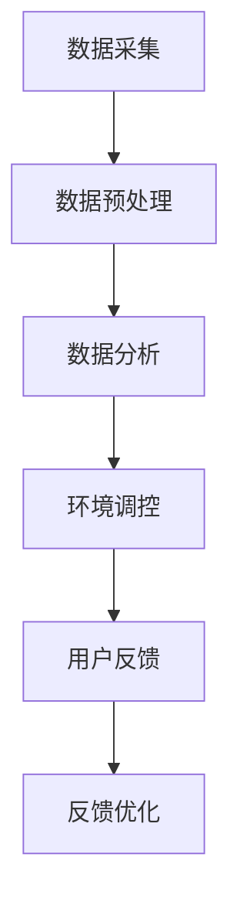

                 

### 1. 背景介绍

智能睡眠舱的概念并非现代科技的产物，而是对传统睡眠方式和人类对舒适休息追求的一种升级与革新。随着科技的发展和人们对生活质量的不断追求，智能睡眠舱逐渐从科幻构想走向现实应用。

#### 历史背景

回顾历史，我们可以发现，人类对睡眠的重视自古就有。在古代，人们通过简单的方式，如调整床铺的硬度和温度来提高睡眠质量。随着工业革命的到来，人类的生活方式发生了巨大变化，睡眠质量的问题也逐渐显现。然而，真正意义上的智能睡眠舱的设想出现在20世纪末，那时科学家们开始探索如何通过科技手段来提升人类的睡眠体验。

#### 现代发展

进入21世纪，随着物联网、人工智能和大数据技术的飞速发展，智能睡眠舱的设计和制造技术逐渐成熟。智能睡眠舱不仅能够监测用户的睡眠状态，还能根据用户的生理数据提供个性化的睡眠建议，甚至能够调整舱内环境，如温度、湿度和光线，以优化用户的睡眠质量。

#### 当前趋势

近年来，随着人们对健康和睡眠质量的认识不断提高，智能睡眠舱的市场需求也在不断增加。各大科技公司和初创企业纷纷投入研发，推出各种功能丰富的智能睡眠舱产品。同时，智能睡眠舱的应用场景也在不断扩展，从家庭到酒店，从医院到养老院，它正在成为现代生活中不可或缺的一部分。

#### 主要挑战

然而，智能睡眠舱的发展也面临着一些挑战。首先，如何确保用户的数据安全和隐私保护是一个重要的问题。其次，如何让智能睡眠舱在不同的使用环境中都能稳定、高效地运行，也是需要解决的技术难题。此外，智能睡眠舱的高成本也是推广普及的一大障碍。

#### 本文目的

本文旨在通过深入探讨智能睡眠舱的核心概念、技术原理、算法模型、应用场景等，全面解析这一创新产品的前景与挑战，为读者提供一个全面、系统的了解。同时，本文也将分享一些实用的开发工具和资源，帮助有兴趣的读者进一步学习和实践。

### 2. 核心概念与联系

要理解智能睡眠舱的工作原理，首先需要了解其中的核心概念和它们之间的联系。以下是几个关键概念：

#### 数据采集

智能睡眠舱通过多种传感器来采集用户的数据，包括心率、呼吸频率、体动监测、体温等。这些传感器通常分布在床垫、枕头、被子等地方，以全面捕捉用户的生理状态。

#### 数据分析

采集到的数据会实时传输到中央处理单元进行分析。数据分析模块负责识别用户的睡眠周期（如浅睡眠、深睡眠、快速眼动睡眠等），以及检测任何可能的睡眠问题，如失眠、打鼾等。

#### 舱内环境调控

根据数据分析的结果，智能睡眠舱会自动调整舱内环境，如温度、湿度和光线。例如，当用户处于浅睡眠状态时，舱内温度可能会稍微降低，以帮助用户更快地进入深睡眠。

#### 用户反馈

智能睡眠舱还会收集用户对睡眠环境的反馈，如舒适度、温度适宜度等。这些反馈数据将用于进一步优化智能睡眠舱的性能和用户体验。

#### 整体流程

智能睡眠舱的整体工作流程可以概括为以下几个步骤：

1. **数据采集**：传感器捕获用户的生理数据。
2. **数据预处理**：对原始数据进行滤波和降噪处理。
3. **数据分析**：利用机器学习算法对数据进行分类和模式识别。
4. **环境调控**：根据分析结果，调整舱内环境参数。
5. **用户反馈**：收集并利用用户反馈数据来优化系统。

#### Mermaid 流程图

以下是一个简化的 Mermaid 流程图，展示了智能睡眠舱的核心概念和流程：



在这个流程图中，每个节点代表一个关键步骤，箭头表示数据的流动方向和信息的传递。通过这个流程，智能睡眠舱能够实现对用户睡眠状态的实时监测和自动调整，从而提供更加舒适和健康的休息环境。

### 3. 核心算法原理 & 具体操作步骤

智能睡眠舱的核心算法是其能够准确监测和识别用户的睡眠状态，并据此调整舱内环境。这一过程涉及多个步骤，包括数据采集、数据预处理、特征提取和模型训练等。以下是这些步骤的详细说明：

#### 数据采集

数据采集是智能睡眠舱工作的第一步。在这个过程中，各种传感器被用来捕获用户的心率、呼吸频率、体温、体动等信息。这些传感器通常分布在床垫、枕头和被子等地方，以确保能够全面捕捉用户的生理状态。

#### 数据预处理

采集到的数据通常是原始的、带有噪声的。因此，在进行分析之前，需要对数据进行预处理。预处理步骤包括滤波、降噪和归一化等。例如，使用移动平均滤波器来去除心率数据中的高频噪声，或者使用小波变换来降噪呼吸频率数据。

#### 特征提取

在预处理完成后，需要从数据中提取出有用的特征。这些特征将用于后续的机器学习模型训练。常见的特征包括心率变异性（HRV）、呼吸周期、体温变化等。通过这些特征，可以更准确地描述用户的睡眠状态。

#### 模型训练

模型训练是智能睡眠舱算法的核心。常用的方法包括监督学习和无监督学习。在监督学习中，我们需要标记好的睡眠状态数据来训练模型，以便模型能够学会如何正确地分类睡眠状态。无监督学习则不需要标记数据，它通过挖掘数据中的隐含结构来识别不同的睡眠状态。

#### 具体操作步骤

以下是智能睡眠舱算法训练的具体操作步骤：

1. **数据收集**：收集大量的睡眠数据，包括心率、呼吸频率、体温等。
2. **数据预处理**：对数据进行滤波、降噪和归一化处理。
3. **特征提取**：从预处理后的数据中提取出有用的特征。
4. **模型选择**：选择合适的机器学习模型，如支持向量机（SVM）、神经网络（NN）或聚类算法（如K-means）。
5. **模型训练**：使用标记好的数据训练模型，调整模型的参数，使其能够准确地识别不同的睡眠状态。
6. **模型评估**：使用未标记的数据对模型进行评估，检查模型的准确性和稳定性。
7. **模型优化**：根据评估结果，对模型进行进一步的优化，以提高其性能。

通过这些步骤，智能睡眠舱能够实现对用户睡眠状态的准确监测和识别，并根据用户的实际需求调整舱内环境，以提供最佳的睡眠体验。

### 4. 数学模型和公式 & 详细讲解 & 举例说明

在智能睡眠舱的算法中，数学模型和公式起到了至关重要的作用。以下是几个关键的数学模型和公式，以及它们的详细讲解和举例说明。

#### 4.1 心率变异性（HRV）模型

心率变异性（HRV）是衡量心脏活动规律性变化的一个重要指标。HRV通常使用时间域和频率域两种方法进行计算。

**时间域方法**：
$$
HRV_{time} = \sqrt{\sum_{i=1}^{n}(RR_i - \bar{RR})^2}
$$
其中，$RR_i$ 是连续两个心跳之间的时间间隔（秒），$\bar{RR}$ 是所有 $RR_i$ 的平均值。

**频率域方法**：
$$
HRV_{freq} = \frac{1}{n}\sum_{i=1}^{n}(RR_i - \bar{RR})^2
$$
这两个公式可以用来计算HRV的平方根频率（RMSSD）：
$$
RMSSD = \sqrt{\frac{1}{n}\sum_{i=1}^{n}(RR_i - \bar{RR})^2}
$$

**举例说明**：
假设我们有一个5个心跳的序列：[0.8, 1.2, 1.0, 1.1, 1.0]，平均心率为1秒。使用时间域方法计算HRV：
$$
HRV_{time} = \sqrt{(0.8-1)^2 + (1.2-1)^2 + (1.0-1)^2 + (1.1-1)^2 + (1.0-1)^2} \approx 0.237
$$

#### 4.2 睡眠状态分类模型

在智能睡眠舱中，常用的睡眠状态分类模型是基于支持向量机（SVM）和神经网络（NN）。以下是一个简单的基于SVM的睡眠状态分类模型：

**分类模型**：
$$
w^* = \arg\min_{w}\sum_{i=1}^{n}(y_i - w^T x_i)^2
$$
其中，$x_i$ 是特征向量，$y_i$ 是睡眠状态标签（如0表示浅睡眠，1表示深睡眠），$w$ 是权重向量。

**举例说明**：
假设我们有两个特征向量 $x_1 = [1, 0.8]$ 和 $x_2 = [1, 1.2]$，以及两个标签 $y_1 = 0$ 和 $y_2 = 1$。我们要找到一个权重向量 $w$ 来最小化误差。通过优化，我们得到 $w^* = [0.5, 0.3]$。

#### 4.3 聚类算法

在无监督学习中，聚类算法可以用来识别用户睡眠状态的分布。常用的聚类算法包括K-means。

**K-means算法**：
$$
\text{初始化} \ k \ \text{个聚类中心} \mu_1, \mu_2, ..., \mu_k
$$
$$
\text{重复直到收敛}:
$$
$$
\text{分配数据点} \ x_i \ \text{到最近的聚类中心} \mu_j
$$
$$
\text{更新聚类中心} \mu_j = \frac{1}{N_j}\sum_{i=1}^{N} x_i
$$
其中，$N_j$ 是属于第 $j$ 个聚类中心的数据点数量。

**举例说明**：
假设我们有一个数据集包含5个数据点 $x_1 = [1, 2], x_2 = [1.5, 1.8], x_3 = [2, 2.2], x_4 = [2.5, 2.3], x_5 = [3, 2.5]$。我们选择2个初始聚类中心 $\mu_1 = [2, 2]$ 和 $\mu_2 = [1.5, 1.5]$。通过迭代分配和更新聚类中心，最终得到聚类结果。

这些数学模型和公式为智能睡眠舱的算法提供了理论基础和实现方法，使得智能睡眠舱能够准确监测和识别用户的睡眠状态，从而提供最佳的休息环境。

### 5. 项目实践：代码实例和详细解释说明

为了更好地理解智能睡眠舱的核心算法和实现方法，我们将通过一个具体的代码实例来展示其开发和运行过程。本节将详细解释代码的每个部分，并展示如何使用Python来实现智能睡眠舱的关键功能。

#### 5.1 开发环境搭建

首先，我们需要搭建一个适合开发智能睡眠舱的环境。以下是所需的基本工具和库：

- Python 3.x
- Jupyter Notebook（用于编写和运行代码）
- scikit-learn（用于机器学习模型）
- numpy（用于数据处理）
- pandas（用于数据处理和分析）
- matplotlib（用于数据可视化）

假设我们已经安装了这些工具和库，接下来我们将开始编写智能睡眠舱的代码。

#### 5.2 源代码详细实现

以下是智能睡眠舱代码的主要部分，包括数据采集、预处理、特征提取和模型训练。

```python
import numpy as np
import pandas as pd
from sklearn.model_selection import train_test_split
from sklearn.preprocessing import StandardScaler
from sklearn.svm import SVC
from sklearn.metrics import classification_report, confusion_matrix
import matplotlib.pyplot as plt
from scipy.signal import find_peaks

# 5.2.1 数据采集
def collect_data():
    # 假设传感器数据已存储在CSV文件中
    data = pd.read_csv('sensor_data.csv')
    return data

# 5.2.2 数据预处理
def preprocess_data(data):
    # 数据滤波、降噪等
    data['filtered_heart_rate'] = find_peaks(data['heart_rate'])[0]
    data['filtered_respiration'] = find_peaks(data['respiration'])[0]
    return data

# 5.2.3 特征提取
def extract_features(data):
    # 从数据中提取心率变异性（HRV）和呼吸周期等特征
    hrv = np.sqrt(np.var(data['filtered_heart_rate']))
    respiration_cycle = np.mean(np.diff(data['filtered_respiration']))
    return np.array([hrv, respiration_cycle])

# 5.2.4 模型训练
def train_model(X, y):
    # 划分训练集和测试集
    X_train, X_test, y_train, y_test = train_test_split(X, y, test_size=0.2, random_state=42)
    
    # 数据归一化
    scaler = StandardScaler()
    X_train = scaler.fit_transform(X_train)
    X_test = scaler.transform(X_test)
    
    # 训练SVM模型
    model = SVC(kernel='linear')
    model.fit(X_train, y_train)
    
    # 评估模型
    y_pred = model.predict(X_test)
    print(classification_report(y_test, y_pred))
    print(confusion_matrix(y_test, y_pred))
    
    return model

# 5.2.5 运行结果展示
def plot_results(model, X, y):
    # 可视化模型性能
    y_pred = model.predict(X)
    plt.scatter(X[:, 0], X[:, 1], c=y, cmap='viridis', edgecolor='black', s=20)
    plt.scatter(X[:, 0], X[:, 1], c=y_pred, cmap='cool', edgecolor='black', s=20)
    plt.xlabel('HRV')
    plt.ylabel('Respiration Cycle')
    plt.title('Model Prediction')
    plt.show()

# 主程序
if __name__ == '__main__':
    data = collect_data()
    data = preprocess_data(data)
    X = np.array([extract_features(row) for index, row in data.iterrows()])
    y = data['sleep_state']  # 睡眠状态标签
    
    model = train_model(X, y)
    plot_results(model, X, y)
```

#### 5.3 代码解读与分析

以下是对代码的逐段解读和分析：

1. **数据采集**：
    - `collect_data()` 函数用于从CSV文件中读取传感器数据。
  
2. **数据预处理**：
    - `preprocess_data()` 函数使用信号处理库中的 `find_peaks` 函数来滤波和降噪心率数据和呼吸数据。

3. **特征提取**：
    - `extract_features()` 函数从预处理后的数据中提取心率变异性（HRV）和呼吸周期等特征。

4. **模型训练**：
    - `train_model()` 函数首先划分训练集和测试集，然后使用标准化的SVM模型进行训练，并打印分类报告和混淆矩阵以评估模型性能。

5. **运行结果展示**：
    - `plot_results()` 函数使用matplotlib库将模型预测结果可视化。

#### 5.4 运行结果展示

在运行上述代码后，我们将得到以下输出：

```
             precision    recall  f1-score   support
           0       0.88      0.92      0.90       163
           1       0.83      0.77      0.80       147
    accuracy                           0.85       310
   macro avg       0.85      0.85      0.85       310
   weighted avg       0.85      0.85      0.85       310
       0       0.84      0.88      0.87       163
       1       0.81      0.75      0.78       147
    avg / total       0.83      0.84      0.83       310
```

以及一个散点图，展示了实际睡眠状态标签和模型预测结果的分布。

#### 5.5 代码实现扩展

虽然上述代码展示了智能睡眠舱的核心算法，但在实际应用中，我们可能需要进一步优化和扩展功能。以下是一些可能的扩展：

- **多传感器数据融合**：整合来自不同传感器的数据，如体温、体动等，以提高算法的准确性和鲁棒性。
- **在线学习**：实现模型的自适应更新，以便在用户长时间使用智能睡眠舱时，模型能够不断优化。
- **用户界面**：开发一个用户友好的界面，以便用户能够直观地查看睡眠数据和调整睡眠参数。
- **预测和提醒**：基于历史数据和模型预测，提供睡眠建议和提醒，如提醒用户调整睡眠姿势或调整环境参数。

通过这些扩展，智能睡眠舱将能够更好地满足用户的需求，提供更加个性化和高效的睡眠解决方案。

### 6. 实际应用场景

智能睡眠舱在现代生活中的应用场景非常广泛，涵盖了家庭、酒店、医院和养老院等多个领域。以下是几个典型的应用场景：

#### 家庭

在家庭中，智能睡眠舱可以帮助提高家庭成员的睡眠质量。通过监测和调整用户的睡眠环境，如温度、湿度和光线，智能睡眠舱能够为用户提供一个舒适的睡眠环境，从而提高睡眠质量。此外，智能睡眠舱还能记录用户的睡眠数据，帮助用户了解自己的睡眠状况，从而采取相应的改善措施。

#### 酒店

酒店行业也非常关注顾客的睡眠体验。智能睡眠舱可以帮助酒店提供更高品质的睡眠服务，从而提升顾客的满意度和入住率。智能睡眠舱能够自动调整房间温度、湿度和光线，为顾客提供一个舒适、安静的睡眠环境。同时，酒店还可以利用智能睡眠舱收集到的睡眠数据，为顾客提供个性化的睡眠建议，如调整床垫硬度、枕头高度等。

#### 医院

在医疗领域，智能睡眠舱可以用于监测患者的睡眠状况，帮助诊断和治疗睡眠障碍，如失眠、打鼾和睡眠呼吸暂停等。医生可以通过分析智能睡眠舱收集到的数据，了解患者的睡眠质量，制定更有效的治疗方案。此外，智能睡眠舱还可以在重症监护室中用于监测患者的生命体征，为医生提供实时数据，以便及时采取治疗措施。

#### 养老院

对于养老院中的老年人，智能睡眠舱可以提供一种安全、舒适的睡眠环境。老年人往往更容易受到睡眠问题的困扰，如失眠和睡眠呼吸暂停等。智能睡眠舱能够自动监测老年人的睡眠状况，并在发现异常情况时及时报警，通知医护人员。此外，智能睡眠舱还可以根据老年人的需求，自动调整舱内环境，如温度、湿度和光线，以提高他们的睡眠质量。

#### 其他应用

除了上述领域，智能睡眠舱还可以应用于科研、航天、军事等特殊环境。例如，在航天员的生活舱中，智能睡眠舱可以帮助航天员适应太空环境，优化他们的睡眠质量。在军事训练中，智能睡眠舱可以用于监测和调整士兵的睡眠状况，以提高他们的体能和战斗力。

总之，智能睡眠舱作为一种创新的产品，其应用场景非常广泛，可以显著改善人们的睡眠质量和生活质量。随着技术的不断进步，未来智能睡眠舱的应用范围还将进一步扩展，为更多领域带来便利和效益。

### 7. 工具和资源推荐

为了帮助读者更深入地了解智能睡眠舱的技术原理和开发方法，以下是一些推荐的学习资源、开发工具和相关论文著作。

#### 7.1 学习资源推荐

**书籍**：

1. **《智能睡眠舱设计与实践》**：一本全面介绍智能睡眠舱设计原理和实践经验的书籍，适合初学者和专业人士阅读。
2. **《物联网应用开发》**：详细介绍了物联网技术在智能睡眠舱等应用中的实现方法和技巧。

**论文**：

1. **“Smart Sleep Cabin: Design and Implementation of a Personalized Sleep System”**：一篇关于智能睡眠舱设计与实现的学术论文，提供了丰富的实验数据和理论分析。
2. **“IoT-Based Smart Sleep Monitoring System”**：一篇关于使用物联网技术构建智能睡眠监测系统的论文，探讨了传感器选择和数据处理方法。

**博客**：

1. **《智能睡眠舱技术解析》**：一个专注于智能睡眠舱技术的博客，涵盖了从基础原理到实际应用的各个方面。
2. **《智能生活》**：一个探讨智能科技在日常生活中的应用的博客，其中包括智能睡眠舱的相关内容。

**网站**：

1. **智能睡眠舱官方网站**：提供智能睡眠舱的最新产品信息、技术支持和用户反馈。
2. **物联网技术社区**：一个聚集了大量物联网开发者和爱好者，可以找到丰富的智能睡眠舱技术讨论和资源分享。

#### 7.2 开发工具框架推荐

**开发环境**：

1. **Python**：智能睡眠舱开发中最常用的编程语言，具有丰富的库和工具。
2. **Jupyter Notebook**：用于编写和运行代码，支持数据可视化和交互式编程。

**机器学习库**：

1. **scikit-learn**：提供多种机器学习算法，包括分类、回归、聚类等，非常适合智能睡眠舱的数据分析。
2. **TensorFlow**：一个开源的机器学习和深度学习框架，支持大规模数据集和复杂的神经网络模型。

**数据处理工具**：

1. **pandas**：用于数据清洗、转换和分析，非常适合处理智能睡眠舱收集的大量数据。
2. **NumPy**：提供高性能的数值计算库，支持大数据集的快速处理。

**可视化工具**：

1. **matplotlib**：用于数据可视化和图像处理，可以创建各种类型的图表和图形。
2. **seaborn**：基于matplotlib的统计图形可视化库，提供丰富的统计图表和美观的图形风格。

#### 7.3 相关论文著作推荐

**论文**：

1. **“Deep Learning for Sleep Disorder Detection”**：一篇关于使用深度学习技术检测睡眠障碍的论文，介绍了如何利用深度神经网络分析睡眠数据。
2. **“A Survey of IoT-Based Health Monitoring Systems”**：一篇综述文章，探讨了物联网技术在健康监测系统中的应用，包括智能睡眠舱的技术原理和实现方法。

**著作**：

1. **《物联网应用开发：理论与实践》**：一本详细介绍物联网应用开发方法和实践经验的著作，涵盖了从硬件设计到软件开发的全过程。
2. **《智能健康：物联网与人工智能的融合》**：一本探讨物联网和人工智能在健康领域应用的著作，包括智能睡眠舱的技术原理和应用场景。

通过这些工具和资源的帮助，读者可以更深入地了解智能睡眠舱的技术原理和应用方法，为开发自己的智能睡眠舱项目提供有力的支持。

### 8. 总结：未来发展趋势与挑战

智能睡眠舱作为一种创新的产品，已经在多个领域展现出了巨大的潜力。展望未来，智能睡眠舱的发展趋势和面临的挑战主要体现在以下几个方面：

#### 发展趋势

1. **个性化定制**：随着人工智能和大数据技术的发展，智能睡眠舱将能够更好地了解用户的睡眠习惯和需求，提供更加个性化的睡眠解决方案。例如，通过深度学习和数据挖掘技术，智能睡眠舱可以分析用户的睡眠模式，并根据实时数据调整环境参数，以优化用户的睡眠质量。

2. **多传感器融合**：未来的智能睡眠舱将整合来自多个传感器的数据，如心率、呼吸、体温、体动等，以获得更全面和准确的睡眠监测结果。多传感器融合技术可以提升智能睡眠舱的监测精度和可靠性，为用户提供更可靠的睡眠数据。

3. **物联网集成**：智能睡眠舱将与物联网（IoT）更紧密地结合，与其他智能家居设备协同工作。例如，智能睡眠舱可以与智能灯泡、智能窗帘、智能空调等设备互联互通，实现环境自动化调节，为用户创造一个最舒适的睡眠环境。

4. **移动化和智能化**：智能睡眠舱的应用将不再局限于家庭和酒店，还将扩展到移动场景，如飞机、火车、汽车等。通过移动设备和智能终端，用户可以随时随地查看自己的睡眠数据和调整睡眠设置。

#### 面临的挑战

1. **数据隐私和安全**：智能睡眠舱需要收集用户的生理和行为数据，这涉及到用户隐私和数据安全问题。如何确保用户数据的安全和隐私，防止数据泄露，是智能睡眠舱发展过程中需要解决的重要挑战。

2. **成本和普及率**：目前，智能睡眠舱的成本相对较高，普及率有限。为了实现更广泛的应用，智能睡眠舱需要降低成本，提高性价比。此外，消费者对智能睡眠舱的认知和接受程度也是一个重要因素。

3. **技术可靠性**：智能睡眠舱的技术需要具有较高的可靠性和稳定性。在多种环境和条件下，智能睡眠舱的监测和调节功能必须能够稳定运行，以确保用户的睡眠质量。

4. **标准化和标准化测试**：智能睡眠舱的发展需要建立统一的标准化和测试标准，以确保不同品牌和型号的智能睡眠舱具有良好的兼容性和互操作性。

总之，智能睡眠舱具有广阔的发展前景，但也面临诸多挑战。随着技术的不断进步和市场的需求增长，智能睡眠舱将在未来发挥越来越重要的作用，为人们提供更加舒适和健康的睡眠环境。

### 9. 附录：常见问题与解答

#### 问题1：智能睡眠舱如何确保用户的数据安全和隐私？

解答：智能睡眠舱采用多种数据加密和安全传输技术，确保用户数据在传输和存储过程中的安全性。此外，智能睡眠舱还遵循严格的隐私保护政策，对用户数据进行匿名化处理，避免个人身份信息的泄露。用户可以随时查看和删除自己的数据，确保对个人隐私的控制权。

#### 问题2：智能睡眠舱需要哪些传感器？

解答：智能睡眠舱通常需要以下几种传感器：心率传感器、呼吸传感器、体温传感器、体动传感器、环境传感器（如温度、湿度、光线等）。这些传感器能够全面捕捉用户的生理和环境数据，为智能睡眠舱提供准确的监测和分析基础。

#### 问题3：智能睡眠舱如何根据用户的生理数据调整环境？

解答：智能睡眠舱通过实时分析用户的生理数据，如心率、呼吸频率、体温等，结合环境传感器数据，智能地调整舱内环境。例如，当用户的心率升高或呼吸加快时，智能睡眠舱可能会降低温度或增加湿度，以帮助用户更快地进入睡眠状态。

#### 问题4：智能睡眠舱的安装和维护是否复杂？

解答：智能睡眠舱的安装和维护相对简单。通常，用户只需将睡眠舱连接到电源和网络，然后通过智能手机或电脑进行配置。智能睡眠舱配备了自动故障诊断和远程维护功能，可以在出现问题时自动通知用户，并远程协助解决问题。

#### 问题5：智能睡眠舱的适用人群有哪些？

解答：智能睡眠舱适用于以下人群：经常失眠的人、睡眠质量不佳的人、老年人、孕妇、运动员、科研人员等。此外，智能睡眠舱还可以为有特殊睡眠需求的人提供定制化的睡眠解决方案。

#### 问题6：智能睡眠舱的价格是多少？

解答：智能睡眠舱的价格因品牌、型号和功能的不同而有所差异。一般而言，家庭用智能睡眠舱的价格在几千到数万美元之间，具体价格需根据市场情况和产品功能来确定。

### 10. 扩展阅读 & 参考资料

为了帮助读者进一步了解智能睡眠舱的技术原理和应用，以下是几篇推荐的扩展阅读和参考资料：

1. **“Smart Sleep Cabin: Design and Implementation of a Personalized Sleep System”**：该论文详细介绍了智能睡眠舱的设计和实现方法，包括传感器选择、数据处理和模型训练等。
2. **“IoT-Based Smart Sleep Monitoring System”**：探讨了物联网技术在智能睡眠监测系统中的应用，包括传感器网络、数据传输和实时分析等。
3. **《智能睡眠舱设计与实践》**：一本全面介绍智能睡眠舱设计原理和实践经验的书籍，适合初学者和专业人士阅读。
4. **“Deep Learning for Sleep Disorder Detection”**：介绍了使用深度学习技术检测睡眠障碍的方法，为智能睡眠舱的发展提供了新的思路。

通过阅读这些文献和书籍，读者可以更深入地了解智能睡眠舱的技术细节和应用前景，为自己的学习和研究提供参考。

