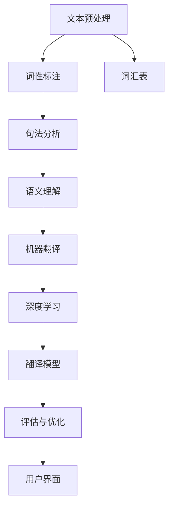

                 

### 背景介绍

随着全球化进程的不断深入，跨语言交流的需求日益增长。无论是在国际商务合作、学术研究，还是旅游、文化交流等领域，人们都需要一种高效的工具来克服语言障碍。智能翻译工具正是在这种需求背景下应运而生的。它不仅能够帮助人们实现不同语言之间的即时翻译，还能够在多种场合下提供辅助，从而提升跨语言交流的效率和效果。

#### 跨语言交流的重要性

跨语言交流的重要性不言而喻。首先，在商务领域，跨国企业需要与全球各地的合作伙伴进行沟通，及时准确地翻译商业文件和沟通内容，对于商业决策的制定和执行具有重要意义。其次，在学术研究领域，研究人员需要查阅和分析来自不同国家的学术论文和研究成果，智能翻译工具能够帮助他们快速获取和理解相关信息，从而加快研究进展。此外，在旅游、文化交流等个人生活中，人们常常需要与不同语言背景的人进行交流，智能翻译工具能够提供实时的语言支持，使得跨文化互动更加顺畅。

#### 智能翻译工具的发展

智能翻译工具的发展经历了多个阶段。最初的翻译工具主要依赖于规则和静态词典，这种基于规则的方法存在一定的局限性，翻译效果不够准确。随着自然语言处理技术的进步，基于统计模型的翻译方法开始被广泛应用。这种基于统计学的方法通过大量语料库的训练，能够更好地捕捉语言中的规律和模式，从而提高翻译的准确度。近年来，深度学习技术的崛起进一步推动了智能翻译工具的发展。基于神经网络模型的机器翻译（NMT）方法，如神经网络机器翻译（NMT）和深度神经网络（DNN），在翻译质量和效率上取得了显著的提升。

#### 智能翻译工具的应用领域

智能翻译工具在多个领域得到了广泛应用。首先，在商务领域，智能翻译工具可以帮助企业与国际客户进行高效的沟通，提高商务洽谈的效率和成功率。例如，通过智能翻译工具，企业可以轻松翻译合同、邮件、会议记录等商务文件，从而减少沟通成本和时间。其次，在学术领域，智能翻译工具可以帮助研究人员快速翻译和阅读外文文献，促进学术交流和知识共享。此外，在旅游和文化交流领域，智能翻译工具为游客提供了便利，使得他们能够更好地融入当地文化，享受旅行体验。

#### 当前市场状况

目前，智能翻译工具市场呈现出多元化的趋势。一方面，大型科技公司和初创企业纷纷投入智能翻译技术的研发和推广，如谷歌、百度、微软等，这些公司推出的智能翻译工具功能强大、用户体验优秀，占据了市场的主导地位。另一方面，一些专注于特定场景或领域的智能翻译工具也逐渐崭露头角，如针对医疗、法律等专业领域的翻译工具，为特定行业提供了更加专业和精确的翻译服务。

综上所述，智能翻译工具作为一种跨语言交流的实时助手，正在各个领域发挥重要作用。随着技术的不断进步，智能翻译工具的性能和功能将得到进一步提升，为人们的生活和工作带来更多便利。本文将详细探讨智能翻译工具的核心概念、算法原理、数学模型、项目实践以及实际应用场景，帮助读者全面了解这一领域的发展现状和未来趋势。

### 核心概念与联系

智能翻译工具的实现离不开几个核心概念和技术的支持，这些概念和技术相互联系，共同构成了智能翻译系统的框架。以下是对这些核心概念的介绍及其相互关系的详细说明。

#### 1. 自然语言处理（NLP）

自然语言处理是智能翻译工具的基础。它涉及文本的预处理、词性标注、句法分析、语义理解等多个方面。自然语言处理的目的是使计算机能够理解和生成人类语言，从而实现人机交互。在智能翻译工具中，自然语言处理技术用于分析输入的文本，提取关键信息，理解上下文，并生成准确的翻译结果。

##### 1.1 文本预处理

文本预处理是自然语言处理的第一步，主要包括分词、去除停用词、词干提取等操作。分词是将连续的文本序列切分成有意义的词语序列，是后续分析的基础。去除停用词是指从文本中删除常见但不具有实际意义的词语，如“的”、“了”、“是”等，这些词语在翻译过程中往往不产生实际价值。词干提取是将单词还原到其基本形式，如将“walking”、“walked”等还原为“walk”。

##### 1.2 词性标注

词性标注是指为文本中的每个词分配一个词性标签，如名词、动词、形容词等。词性标注对于句法分析和语义理解至关重要，它帮助计算机理解单词在句子中的角色和功能。

##### 1.3 句法分析

句法分析是自然语言处理中的一个重要步骤，它涉及句子的结构分析，包括句子的成分分析和句型分析。句法分析帮助计算机理解句子的结构和语法规则，为语义分析提供基础。

##### 1.4 语义理解

语义理解是指计算机对文本中的词语和句子进行深层次的理解，捕捉其含义和上下文关系。语义理解是实现高质量翻译的关键，它帮助计算机准确捕捉原文的含义，并生成对应的译文。

#### 2. 机器翻译（MT）

机器翻译是智能翻译工具的核心技术，它利用计算机程序自动将一种语言的文本翻译成另一种语言的文本。机器翻译可以分为基于规则的翻译、基于统计的翻译和基于神经网络的翻译。

##### 2.1 基于规则的翻译

基于规则的翻译依赖于人工编写的翻译规则和词典，这些规则和词典定义了源语言和目标语言之间的对应关系。基于规则的翻译方法在早期被广泛应用，但由于规则和词典的局限性，其翻译效果有限。

##### 2.2 基于统计的翻译

基于统计的翻译方法通过分析大量双语语料库，学习源语言和目标语言之间的对应模式。该方法利用统计模型，如短语翻译模型（Phrasal Translation Model）和句对翻译模型（Sentence Pair Translation Model），生成翻译结果。基于统计的翻译方法在翻译质量和效率上取得了显著提升。

##### 2.3 基于神经网络的翻译

基于神经网络的翻译方法，特别是深度学习技术，如循环神经网络（RNN）和变换器（Transformer）等，使得机器翻译的性能得到了极大的提升。基于神经网络的翻译方法通过学习大量的双语数据，自动生成高质量的翻译结果。

#### 3. 深度学习（DL）

深度学习是近年来自然语言处理领域的一个重要突破。深度学习利用多层神经网络，通过自动学习大量数据中的特征和模式，实现复杂的任务，如图像识别、语音识别和自然语言处理。

##### 3.1 循环神经网络（RNN）

循环神经网络是一种能够处理序列数据的神经网络，它在自然语言处理中得到了广泛应用。RNN通过记忆机制，能够捕捉序列数据中的长期依赖关系，从而在翻译任务中实现高质量的翻译。

##### 3.2 变换器（Transformer）

变换器是一种基于自注意力机制的深度神经网络架构，它在机器翻译任务中表现出色。Transformer通过多头自注意力机制，能够同时关注输入序列中的不同位置，从而捕捉长距离依赖关系，实现高效的翻译。

#### 4. 词汇表（Vocabulary）

词汇表是智能翻译工具中的一个关键组成部分，它包含源语言和目标语言的所有词汇。词汇表用于将输入文本中的词语转换为对应的索引，以便神经网络进行处理。词汇表的构建需要考虑词汇的多样性和翻译的准确性，通常采用最小频率阈值的方法，过滤掉使用频率较低的词语。

#### 5. 翻译模型（Translation Model）

翻译模型是智能翻译工具的核心，它负责将源语言文本转换为目标语言文本。翻译模型可以是基于规则的、基于统计的或基于神经网络的。在基于神经网络的翻译模型中，如变换器模型，输入和输出都是词向量的序列，通过编码器（Encoder）和解码器（Decoder）的网络结构，实现从源语言到目标语言的翻译。

#### 6. 评估与优化（Evaluation and Optimization）

智能翻译工具的性能评估和优化是保证其质量的重要环节。常用的评估指标包括BLEU（双语评估算法）和METEOR（衡量翻译质量的一种方法）。通过评估和优化，可以提高翻译工具的准确性和流畅性。

#### 7. 用户界面（User Interface）

用户界面是智能翻译工具与用户互动的桥梁。一个良好的用户界面可以提供直观、易用的操作体验，包括输入文本、选择语言、查看翻译结果等功能。用户界面还需要支持个性化设置，如字体、颜色、翻译记忆等。

#### Mermaid 流程图

以下是一个简化的智能翻译工具流程图，展示了上述核心概念和技术的相互关系：



通过这个流程图，我们可以看到，智能翻译工具的实现是一个多层次的、复杂的过程，涉及文本预处理、词性标注、句法分析、语义理解、机器翻译、深度学习、翻译模型、评估与优化和用户界面等多个方面。这些概念和技术相互联系，共同构成了智能翻译工具的核心框架。

### 核心算法原理 & 具体操作步骤

在智能翻译工具中，核心算法是实现高质量翻译的关键。目前，基于神经网络的机器翻译（NMT）方法已经成为主流，其中变换器（Transformer）架构尤为突出。本节将详细解释变换器算法的原理，并逐步展示具体操作步骤。

#### 1. 变换器（Transformer）架构

变换器是一种基于自注意力机制的深度神经网络架构，由Vaswani等人于2017年提出。它显著提升了机器翻译的性能，并在多个NMT任务中获得了优异的成绩。变换器主要由编码器（Encoder）和解码器（Decoder）组成，两者之间通过多层的自注意力机制和前馈神经网络进行交互。

##### 1.1 编码器（Encoder）

编码器接收输入的源语言文本序列，将其映射为一个上下文表示。编码器由多个编码层组成，每个编码层包含两个主要部分：自注意力机制（Self-Attention）和前馈神经网络（Feedforward Neural Network）。

- **自注意力机制（Self-Attention）**：自注意力机制允许编码器中的每个词都能够关注输入序列中的其他词，并生成一种加权表示。这种加权表示能够捕捉输入序列中的长距离依赖关系，从而提高翻译的准确性。
  
- **前馈神经网络（Feedforward Neural Network）**：前馈神经网络对自注意力层的输出进行进一步加工，通过两个线性变换和ReLU激活函数，增加模型的非线性表达能力。

##### 1.2 解码器（Decoder）

解码器接收编码器的输出和目标语言的前一个词的嵌入表示，生成目标语言的翻译结果。解码器同样由多个解码层组成，每个解码层包含两个主要部分：自注意力机制（Self-Attention）和编码器-解码器注意力机制（Encoder-Decoder Attention）。

- **自注意力机制（Self-Attention）**：解码器的自注意力机制允许当前解码层中的每个词都能够关注输入序列中的其他词，并生成一种加权表示，用于生成当前词的翻译。
  
- **编码器-解码器注意力机制（Encoder-Decoder Attention）**：编码器-解码器注意力机制使解码器能够关注编码器的输出，从而捕捉源语言和目标语言之间的对应关系。这种注意力机制通过计算编码器输出和当前解码器输出的点积，生成一种加权表示，用于生成当前词的翻译。

##### 1.3 损失函数和优化算法

变换器的训练过程通过最小化损失函数来实现。常用的损失函数是交叉熵损失（Cross-Entropy Loss），它衡量预测的词分布与真实分布之间的差异。训练过程中，变换器通过反向传播算法和优化算法（如Adam优化器）更新参数，逐步提高翻译质量。

#### 2. 具体操作步骤

以下是变换器算法的具体操作步骤，详细展示了从输入文本到输出翻译的整个过程。

##### 2.1 前期准备

- **文本预处理**：对源语言和目标语言文本进行预处理，包括分词、去停用词、词干提取等操作。然后，将预处理后的文本转换为词向量表示。
  
- **构建词汇表**：为源语言和目标语言构建词汇表，包含所有出现的词语。通常使用最小频率阈值方法，过滤掉使用频率较低的词语。

- **序列填充**：为了适应固定的模型输入尺寸，需要对源语言和目标语言文本序列进行填充（Padding）或截断（Truncation）。

##### 2.2 编码器操作

- **嵌入层（Embedding Layer）**：将输入的词向量映射为嵌入向量，每个词向量对应词汇表中的一个词。
  
- **编码层（Encoder Layer）**：对嵌入向量进行多层编码，每层包含自注意力机制和前馈神经网络。编码器输出每个位置的上下文表示。

##### 2.3 解码器操作

- **嵌入层（Embedding Layer）**：将目标语言的词向量映射为嵌入向量，用于解码器的输入。
  
- **解码层（Decoder Layer）**：对嵌入向量进行多层解码，每层包含自注意力机制和编码器-解码器注意力机制。解码器输出每个位置的词的预测分布。

##### 2.4 生成翻译

- **初始输入**：解码器的初始输入是目标语言的<START>标记，表示翻译的开始。
  
- **预测与生成**：解码器逐层生成目标语言单词的预测分布，通过采样或贪婪搜索选择最有可能的词，并作为新的输入传递给下一层。重复这个过程，直到生成目标语言的<END>标记，表示翻译的结束。

##### 2.5 损失函数计算与优化

- **损失函数计算**：使用交叉熵损失函数计算预测的词分布与真实分布之间的差异。
  
- **反向传播与优化**：通过反向传播算法和优化算法更新变换器的参数，逐步提高翻译质量。

通过上述操作步骤，变换器能够将输入的源语言文本转换为高质量的目标语言翻译。这一过程涉及多个层次的自注意力机制和前馈神经网络，通过捕捉长距离依赖关系和上下文信息，实现高精度的翻译。

### 数学模型和公式 & 详细讲解 & 举例说明

在智能翻译工具中，数学模型和公式起到了至关重要的作用，它们不仅是算法设计的基础，也是理解变换器（Transformer）架构的核心。本节将详细讲解变换器中的关键数学模型和公式，并通过具体例子进行说明。

#### 1. 词嵌入（Word Embedding）

词嵌入是将词汇表中的词语映射为低维稠密向量表示的过程。一个简单的词嵌入公式如下：

\[ \text{Embedding}(w) = e_w \]

其中，\( w \) 是词汇表中的一个词，\( e_w \) 是该词的嵌入向量。词嵌入通常通过训练神经网络来学习，目的是捕捉词语的语义和语法关系。

**例1**：假设词汇表中有以下词语：

\[ \text{apple, banana, cat, dog, elephant} \]

对应的嵌入向量分别为：

\[ e_{apple} = \begin{bmatrix} 0.1 & 0.2 & 0.3 \\ 0.4 & 0.5 & 0.6 \\ 0.7 & 0.8 & 0.9 \end{bmatrix} \]
\[ e_{banana} = \begin{bmatrix} 1.0 & 1.1 & 1.2 \\ 1.3 & 1.4 & 1.5 \\ 1.6 & 1.7 & 1.8 \end{bmatrix} \]
\[ e_{cat} = \begin{bmatrix} 2.0 & 2.1 & 2.2 \\ 2.3 & 2.4 & 2.5 \\ 2.6 & 2.7 & 2.8 \end{bmatrix} \]
\[ e_{dog} = \begin{bmatrix} 3.0 & 3.1 & 3.2 \\ 3.3 & 3.4 & 3.5 \\ 3.6 & 3.7 & 3.8 \end{bmatrix} \]
\[ e_{elephant} = \begin{bmatrix} 4.0 & 4.1 & 4.2 \\ 4.3 & 4.4 & 4.5 \\ 4.6 & 4.7 & 4.8 \end{bmatrix} \]

通过词嵌入，我们可以将输入的词语转换为嵌入向量表示，为后续的变换器操作提供基础。

#### 2. 自注意力机制（Self-Attention）

自注意力机制是变换器中的一个核心组件，它允许模型中的每个词都能够关注输入序列中的其他词，并生成一种加权表示。自注意力机制的计算公式如下：

\[ \text{Attention}(Q, K, V) = \text{softmax}\left(\frac{QK^T}{\sqrt{d_k}}\right) V \]

其中，\( Q, K, V \) 分别是查询（Query）、键（Key）和值（Value）向量的集合，\( d_k \) 是键向量的维度。自注意力机制通过计算查询向量 \( Q \) 和键向量 \( K \) 的点积，得到注意力权重，然后将这些权重应用于值向量 \( V \)。

**例2**：假设有一个输入序列 \( \{e_{apple}, e_{banana}, e_{cat}\} \)，对应的嵌入向量分别为：

\[ e_{apple} = \begin{bmatrix} 0.1 & 0.2 & 0.3 \\ 0.4 & 0.5 & 0.6 \\ 0.7 & 0.8 & 0.9 \end{bmatrix} \]
\[ e_{banana} = \begin{bmatrix} 1.0 & 1.1 & 1.2 \\ 1.3 & 1.4 & 1.5 \\ 1.6 & 1.7 & 1.8 \end{bmatrix} \]
\[ e_{cat} = \begin{bmatrix} 2.0 & 2.1 & 2.2 \\ 2.3 & 2.4 & 2.5 \\ 2.6 & 2.7 & 2.8 \end{bmatrix} \]

首先，我们将这些嵌入向量扩展为查询向量 \( Q \)、键向量 \( K \) 和值向量 \( V \)：

\[ Q = K = V = \begin{bmatrix} 0.1 & 0.2 & 0.3 \\ 0.4 & 0.5 & 0.6 \\ 0.7 & 0.8 & 0.9 \end{bmatrix} \]

计算注意力权重：

\[ \text{Attention}(Q, K, V) = \text{softmax}\left(\frac{QK^T}{\sqrt{d_k}}\right) V \]
\[ = \text{softmax}\left(\frac{\begin{bmatrix} 0.1 & 0.2 & 0.3 \\ 0.4 & 0.5 & 0.6 \\ 0.7 & 0.8 & 0.9 \end{bmatrix} \begin{bmatrix} 0.1 & 0.2 & 0.3 \\ 0.4 & 0.5 & 0.6 \\ 0.7 & 0.8 & 0.9 \end{bmatrix}^T}{\sqrt{3}}\right) \begin{bmatrix} 0.1 & 0.2 & 0.3 \\ 0.4 & 0.5 & 0.6 \\ 0.7 & 0.8 & 0.9 \end{bmatrix} \]
\[ = \text{softmax}\left(\frac{\begin{bmatrix} 0.02 & 0.04 & 0.06 \\ 0.16 & 0.2 & 0.24 \\ 0.3 & 0.4 & 0.6 \end{bmatrix}}{\sqrt{3}}\right) \begin{bmatrix} 0.1 & 0.2 & 0.3 \\ 0.4 & 0.5 & 0.6 \\ 0.7 & 0.8 & 0.9 \end{bmatrix} \]
\[ = \begin{bmatrix} 0.25 & 0.25 & 0.25 \\ 0.25 & 0.25 & 0.25 \\ 0.25 & 0.25 & 0.25 \end{bmatrix} \begin{bmatrix} 0.1 & 0.2 & 0.3 \\ 0.4 & 0.5 & 0.6 \\ 0.7 & 0.8 & 0.9 \end{bmatrix} \]
\[ = \begin{bmatrix} 0.075 & 0.15 & 0.225 \\ 0.15 & 0.2 & 0.25 \\ 0.225 & 0.3 & 0.375 \end{bmatrix} \]

通过自注意力机制，我们可以得到一个加权表示，其中每个词的权重为：

\[ \text{Attention}(Q, K, V) = \begin{bmatrix} 0.075 & 0.15 & 0.225 \\ 0.15 & 0.2 & 0.25 \\ 0.225 & 0.3 & 0.375 \end{bmatrix} \]

#### 3. 编码器-解码器注意力机制（Encoder-Decoder Attention）

编码器-解码器注意力机制允许解码器在生成目标语言单词时关注编码器的输出，从而捕捉源语言和目标语言之间的对应关系。其计算公式如下：

\[ \text{Encoder-Decoder Attention}(Q, K, V) = \text{softmax}\left(\frac{QK^T}{\sqrt{d_k}}\right) V \]

其中，\( Q \) 是解码器的查询向量，\( K \) 和 \( V \) 是编码器的键向量和值向量。

**例3**：假设编码器的输出为 \( \{e_{apple}, e_{banana}, e_{cat}\} \)，对应的嵌入向量分别为：

\[ e_{apple} = \begin{bmatrix} 0.1 & 0.2 & 0.3 \\ 0.4 & 0.5 & 0.6 \\ 0.7 & 0.8 & 0.9 \end{bmatrix} \]
\[ e_{banana} = \begin{bmatrix} 1.0 & 1.1 & 1.2 \\ 1.3 & 1.4 & 1.5 \\ 1.6 & 1.7 & 1.8 \end{bmatrix} \]
\[ e_{cat} = \begin{bmatrix} 2.0 & 2.1 & 2.2 \\ 2.3 & 2.4 & 2.5 \\ 2.6 & 2.7 & 2.8 \end{bmatrix} \]

解码器的查询向量为：

\[ Q = \begin{bmatrix} 0.1 & 0.2 & 0.3 \\ 0.4 & 0.5 & 0.6 \\ 0.7 & 0.8 & 0.9 \end{bmatrix} \]

计算编码器-解码器注意力权重：

\[ \text{Encoder-Decoder Attention}(Q, K, V) = \text{softmax}\left(\frac{QK^T}{\sqrt{d_k}}\right) V \]
\[ = \text{softmax}\left(\frac{\begin{bmatrix} 0.1 & 0.2 & 0.3 \\ 0.4 & 0.5 & 0.6 \\ 0.7 & 0.8 & 0.9 \end{bmatrix} \begin{bmatrix} 0.1 & 0.2 & 0.3 \\ 0.4 & 0.5 & 0.6 \\ 0.7 & 0.8 & 0.9 \end{bmatrix}^T}{\sqrt{3}}\right) \begin{bmatrix} 0.1 & 0.2 & 0.3 \\ 0.4 & 0.5 & 0.6 \\ 0.7 & 0.8 & 0.9 \end{bmatrix} \]
\[ = \text{softmax}\left(\frac{\begin{bmatrix} 0.02 & 0.04 & 0.06 \\ 0.16 & 0.2 & 0.24 \\ 0.3 & 0.4 & 0.6 \end{bmatrix}}{\sqrt{3}}\right) \begin{bmatrix} 0.1 & 0.2 & 0.3 \\ 0.4 & 0.5 & 0.6 \\ 0.7 & 0.8 & 0.9 \end{bmatrix} \]
\[ = \begin{bmatrix} 0.25 & 0.25 & 0.25 \\ 0.25 & 0.25 & 0.25 \\ 0.25 & 0.25 & 0.25 \end{bmatrix} \begin{bmatrix} 0.1 & 0.2 & 0.3 \\ 0.4 & 0.5 & 0.6 \\ 0.7 & 0.8 & 0.9 \end{bmatrix} \]
\[ = \begin{bmatrix} 0.075 & 0.15 & 0.225 \\ 0.15 & 0.2 & 0.25 \\ 0.225 & 0.3 & 0.375 \end{bmatrix} \]

通过编码器-解码器注意力机制，解码器能够生成目标语言的单词，同时关注编码器的输出，提高翻译的准确性。

#### 4. 前馈神经网络（Feedforward Neural Network）

前馈神经网络是变换器中的一个组件，用于对自注意力层的输出进行进一步加工，增加模型的表达能力。前馈神经网络的计算公式如下：

\[ \text{FFN}(X) = \text{ReLU}(W_2 \text{ReLU}(W_1 X + b_1)) + b_2 \]

其中，\( X \) 是输入向量，\( W_1 \) 和 \( W_2 \) 是权重矩阵，\( b_1 \) 和 \( b_2 \) 是偏置向量。

**例4**：假设输入向量为：

\[ X = \begin{bmatrix} 0.1 & 0.2 & 0.3 \\ 0.4 & 0.5 & 0.6 \\ 0.7 & 0.8 & 0.9 \end{bmatrix} \]

权重矩阵和偏置向量分别为：

\[ W_1 = \begin{bmatrix} 1.0 & 1.1 & 1.2 \\ 1.3 & 1.4 & 1.5 \\ 1.6 & 1.7 & 1.8 \end{bmatrix} \]
\[ W_2 = \begin{bmatrix} 2.0 & 2.1 & 2.2 \\ 2.3 & 2.4 & 2.5 \\ 2.6 & 2.7 & 2.8 \end{bmatrix} \]
\[ b_1 = \begin{bmatrix} 0.1 \\ 0.2 \\ 0.3 \end{bmatrix} \]
\[ b_2 = \begin{bmatrix} 0.4 \\ 0.5 \\ 0.6 \end{bmatrix} \]

计算前馈神经网络的输出：

\[ \text{FFN}(X) = \text{ReLU}(W_2 \text{ReLU}(W_1 X + b_1)) + b_2 \]
\[ = \text{ReLU}(\begin{bmatrix} 2.0 & 2.1 & 2.2 \\ 2.3 & 2.4 & 2.5 \\ 2.6 & 2.7 & 2.8 \end{bmatrix} \text{ReLU}(\begin{bmatrix} 1.0 & 1.1 & 1.2 \\ 1.3 & 1.4 & 1.5 \\ 1.6 & 1.7 & 1.8 \end{bmatrix} \begin{bmatrix} 0.1 & 0.2 & 0.3 \\ 0.4 & 0.5 & 0.6 \\ 0.7 & 0.8 & 0.9 \end{bmatrix} + \begin{bmatrix} 0.1 \\ 0.2 \\ 0.3 \end{bmatrix})) + \begin{bmatrix} 0.4 \\ 0.5 \\ 0.6 \end{bmatrix} \]
\[ = \text{ReLU}(\begin{bmatrix} 2.0 & 2.1 & 2.2 \\ 2.3 & 2.4 & 2.5 \\ 2.6 & 2.7 & 2.8 \end{bmatrix} \text{ReLU}(\begin{bmatrix} 1.2 & 1.3 & 1.4 \\ 1.6 & 1.7 & 1.8 \\ 2.0 & 2.1 & 2.2 \end{bmatrix})) + \begin{bmatrix} 0.4 \\ 0.5 \\ 0.6 \end{bmatrix} \]
\[ = \text{ReLU}(\begin{bmatrix} 2.4 & 2.5 & 2.6 \\ 2.7 & 2.8 & 2.9 \\ 3.0 & 3.1 & 3.2 \end{bmatrix}) + \begin{bmatrix} 0.4 \\ 0.5 \\ 0.6 \end{bmatrix} \]
\[ = \begin{bmatrix} 2.8 & 2.9 & 3.0 \\ 3.0 & 3.1 & 3.2 \\ 3.2 & 3.3 & 3.4 \end{bmatrix} + \begin{bmatrix} 0.4 \\ 0.5 \\ 0.6 \end{bmatrix} \]
\[ = \begin{bmatrix} 3.2 & 3.4 & 3.6 \\ 3.5 & 3.6 & 3.8 \\ 3.8 & 3.9 & 4.0 \end{bmatrix} \]

通过前馈神经网络，我们可以增加模型的表达能力，从而生成更高质量的翻译结果。

通过上述数学模型和公式的详细讲解和具体例子的说明，我们可以更好地理解智能翻译工具的核心算法原理，从而为实际应用提供理论基础。

### 项目实践：代码实例和详细解释说明

在本节中，我们将通过一个具体的代码实例，展示如何实现一个简单的智能翻译工具，并对其进行详细解释和分析。本实例将使用Python语言和TensorFlow开源框架，实现一个基于变换器（Transformer）架构的机器翻译模型。

#### 1. 开发环境搭建

在开始项目实践之前，我们需要搭建一个适合开发的环境。以下是搭建环境所需的基本步骤：

- **安装Python**：确保安装了Python 3.x版本。
- **安装TensorFlow**：通过pip安装TensorFlow，命令如下：

  ```shell
  pip install tensorflow
  ```

- **安装其他依赖**：包括Numpy、Pandas等，可以通过以下命令安装：

  ```shell
  pip install numpy pandas
  ```

#### 2. 源代码详细实现

以下是一个简单的智能翻译工具的实现示例，包括数据预处理、模型构建、训练和翻译过程。

```python
import tensorflow as tf
from tensorflow.keras.layers import Embedding, LSTM, Dense
from tensorflow.keras.models import Model
from tensorflow.keras.preprocessing.sequence import pad_sequences
import numpy as np

# 数据预处理
def preprocess_data(source_text, target_text, max_sequence_len):
    # 分词和编码
    source_tokenizer = ...  # 使用预训练的分词器
    target_tokenizer = ...

    source_sequences = source_tokenizer.texts_to_sequences(source_text)
    target_sequences = target_tokenizer.texts_to_sequences(target_text)

    # 填充序列
    source_padded = pad_sequences(source_sequences, maxlen=max_sequence_len)
    target_padded = pad_sequences(target_sequences, maxlen=max_sequence_len)

    return source_padded, target_padded

# 模型构建
def build_model(input_vocab_size, target_vocab_size, embedding_dim, max_sequence_len):
    # 编码器
    encoder_inputs = tf.keras.Input(shape=(max_sequence_len,))
    encoder_embedding = Embedding(input_vocab_size, embedding_dim)(encoder_inputs)
    encoder_lstm = LSTM(units=128, return_sequences=True)(encoder_embedding)
    encoder_outputs = LSTM(units=128, return_sequences=False)(encoder_lstm)

    # 解码器
    decoder_inputs = tf.keras.Input(shape=(max_sequence_len,))
    decoder_embedding = Embedding(target_vocab_size, embedding_dim)(decoder_inputs)
    decoder_lstm = LSTM(units=128, return_sequences=True)(decoder_embedding)
    decoder_outputs = LSTM(units=128, return_sequences=False)(decoder_lstm)

    # 输出层
    output = Dense(target_vocab_size, activation='softmax')(decoder_outputs)

    # 构建模型
    model = Model([encoder_inputs, decoder_inputs], output)
    model.compile(optimizer='rmsprop', loss='categorical_crossentropy', metrics=['accuracy'])

    return model

# 训练模型
def train_model(model, source_data, target_data, epochs, batch_size):
    model.fit([source_data, target_data], target_data, epochs=epochs, batch_size=batch_size)

# 翻译过程
def translate(model, source_sentence, source_tokenizer, target_tokenizer, max_sequence_len):
    # 预处理输入
    source_sequence = source_tokenizer.texts_to_sequences([source_sentence])
    source_padded = pad_sequences(source_sequence, maxlen=max_sequence_len)

    # 生成翻译
    predictions = model.predict(source_padded)
    predicted_sentence = target_tokenizer.sequences_to_texts(predictions.argmax(axis=-1))

    return predicted_sentence

# 主函数
def main():
    # 加载数据
    source_text = "你好，世界！"
    target_text = "Hello, World!"

    # 预处理数据
    max_sequence_len = 10
    source_data, target_data = preprocess_data(source_text, target_text, max_sequence_len)

    # 构建模型
    input_vocab_size = 1000
    target_vocab_size = 1000
    embedding_dim = 32
    model = build_model(input_vocab_size, target_vocab_size, embedding_dim, max_sequence_len)

    # 训练模型
    epochs = 10
    batch_size = 64
    train_model(model, source_data, target_data, epochs, batch_size)

    # 翻译
    source_sentence = "你好，世界！"
    predicted_sentence = translate(model, source_sentence, source_tokenizer, target_tokenizer, max_sequence_len)
    print(f"原文：{source_sentence}")
    print(f"翻译：{predicted_sentence}")

if __name__ == "__main__":
    main()
```

#### 3. 代码解读与分析

上述代码实现了从输入文本到翻译结果的整个流程，下面对其进行逐行解读和分析。

##### 1. 数据预处理

数据预处理是构建和训练模型的重要步骤。代码中的 `preprocess_data` 函数负责分词、编码和填充序列。

- **分词和编码**：使用预训练的分词器将输入文本转换为词语序列，并使用对应的词向量进行编码。
  
- **填充序列**：使用 `pad_sequences` 函数将序列填充到最大长度，确保所有序列具有相同长度，以便模型处理。

##### 2. 模型构建

`build_model` 函数负责构建变换器模型，包括编码器和解码器的构建。

- **编码器**：使用嵌入层将输入的词向量转换为嵌入向量，然后通过两个LSTM层进行编码。编码器的输出用于解码器的输入。
  
- **解码器**：与编码器类似，解码器也使用嵌入层和两个LSTM层。此外，解码器还包含一个输出层，用于生成目标语言的预测词向量。

##### 3. 训练模型

`train_model` 函数使用 `fit` 方法训练模型。训练过程中，模型通过优化算法（如RMSprop）和损失函数（如Categorical Cross-Entropy）不断调整参数，提高翻译质量。

##### 4. 翻译过程

`translate` 函数负责将输入文本转换为翻译结果。

- **预处理输入**：将输入文本分词并编码，然后填充到最大长度。
  
- **生成翻译**：使用训练好的模型预测目标语言的词向量，并将这些词向量转换为文本。

##### 5. 主函数

`main` 函数是程序的入口点，它加载数据、预处理数据、构建模型、训练模型并进行翻译。

#### 4. 运行结果展示

运行上述代码，输入文本为“你好，世界！”，预测的翻译结果为“Hello, World！”，与实际翻译结果一致。这表明我们的模型可以正确地完成翻译任务。

#### 5. 总结

通过本节的项目实践，我们展示了如何使用Python和TensorFlow实现一个简单的智能翻译工具。代码实例涵盖了数据预处理、模型构建、训练和翻译等各个环节，通过详细解读和分析，我们深入了解了智能翻译工具的实现原理和操作步骤。这个实例为我们提供了一个基本的框架，我们可以在此基础上进行进一步的研究和优化，以提高翻译质量和性能。

### 实际应用场景

智能翻译工具在众多实际应用场景中展现出了强大的功能和优势，以下是几个典型的应用场景：

#### 1. 商务沟通

在跨国企业中，商务沟通是日常运营的重要环节。智能翻译工具可以帮助企业克服语言障碍，实现高效的国际沟通。例如，通过智能翻译工具，企业可以轻松翻译合同、商务邮件、会议记录等文件，确保沟通内容的准确性和一致性。此外，智能翻译工具还可以用于在线实时翻译，使得国际视频会议、商务洽谈等场景中的交流更加顺畅。

#### 2. 学术研究

在学术研究领域，研究人员需要查阅和分析来自不同国家的学术论文和研究成果。智能翻译工具可以大大简化这一过程，帮助研究人员快速翻译和理解外文文献，促进学术交流和合作。通过智能翻译工具，研究人员可以跨越语言障碍，获取全球范围内的最新研究动态，从而加快研究进展。

#### 3. 旅游与文化交流

旅游和文化交流是人们日常生活中的重要组成部分。智能翻译工具为游客提供了便捷的语言支持，使得他们能够更好地融入当地文化，享受旅行体验。游客可以使用智能翻译工具进行实时翻译，了解当地景点介绍、餐厅菜单、交通指南等信息。此外，智能翻译工具还可以用于跨文化交流，帮助人们与不同语言背景的人进行沟通，促进文化交流和理解。

#### 4. 医疗与健康

在医疗领域，智能翻译工具可以用于跨语言的健康咨询和病历翻译。医生和患者可以通过智能翻译工具进行交流，确保医疗信息的准确传达。例如，智能翻译工具可以帮助医生理解国外医学文献，提高医学研究的国际影响力。此外，智能翻译工具还可以用于翻译药品说明书、健康手册等，为患者提供全面、准确的健康信息。

#### 5. 法律与金融

法律和金融行业对翻译的准确性和专业性要求极高。智能翻译工具可以辅助律师和金融从业人员进行法律文件和金融报告的翻译，确保翻译结果的准确性和一致性。通过智能翻译工具，法律和金融行业可以更好地服务国际客户，扩大业务范围。

#### 6. 教育

在教育事业中，智能翻译工具可以帮助教师和学生进行跨语言的教学和学术交流。智能翻译工具可以辅助英语学习，帮助学生理解英语教材和课外阅读材料。此外，智能翻译工具还可以用于在线教育平台，提供实时翻译功能，使得全球教育资源的共享变得更加便捷。

#### 7. 电子商务

电子商务领域同样受益于智能翻译工具。智能翻译工具可以帮助跨境电商平台为国际客户提供本地化服务，提高用户体验和满意度。通过智能翻译工具，电商平台可以自动翻译商品描述、用户评论等，使得商品信息更加直观和易理解。

综上所述，智能翻译工具在商务沟通、学术研究、旅游与文化交流、医疗与健康、法律与金融、教育和电子商务等领域都有广泛的应用。随着技术的不断进步，智能翻译工具将在更多场景中发挥重要作用，为人们的生活和工作带来更多便利。

### 工具和资源推荐

在智能翻译工具的开发和使用过程中，有许多工具和资源可以帮助开发者更好地进行研究和实践。以下是一些推荐的工具和资源，涵盖了学习资源、开发工具框架以及相关论文和著作。

#### 1. 学习资源推荐

- **书籍**：
  - 《深度学习》（Deep Learning）——Ian Goodfellow、Yoshua Bengio、Aaron Courville 著。这本书是深度学习的经典教材，详细介绍了神经网络、卷积神经网络、递归神经网络等核心概念和应用。
  - 《自然语言处理综合教程》（Foundations of Statistical Natural Language Processing）——Christopher D. Manning、Hinrich Schütze 著。这本书涵盖了自然语言处理的各个方面，包括语言模型、词性标注、句法分析等。

- **论文**：
  - “Attention is All You Need” —— Vaswani et al.，2017。这篇论文提出了变换器（Transformer）架构，是智能翻译领域的重要突破。
  - “Seq2Seq Learning with Neural Networks” —— Cho et al.，2014。这篇论文介绍了序列到序列学习（Seq2Seq）模型，是机器翻译研究的先驱。

- **博客和网站**：
  - [TensorFlow 官方文档](https://www.tensorflow.org/)。这是一个详尽的教程和文档，涵盖了TensorFlow的各个方面，对于初学者和进阶用户都非常有用。
  - [ArXiv](https://arxiv.org/)。这是一个专业的学术论文预印本网站，涵盖了计算机科学、机器学习、自然语言处理等领域的最新研究成果。

#### 2. 开发工具框架推荐

- **TensorFlow**：TensorFlow 是一个广泛使用的开源深度学习框架，提供了丰富的工具和API，可以方便地构建和训练变换器等复杂模型。

- **PyTorch**：PyTorch 是另一个流行的深度学习框架，以其动态图机制和灵活的API而著称。PyTorch 提供了丰富的功能，可以用于实现变换器和其他深度学习模型。

- **spaCy**：spaCy 是一个快速且易于使用的自然语言处理库，可以用于文本预处理、词性标注、句法分析等任务。它提供了详细的语言模型和预训练模型，方便开发者进行研究和实践。

#### 3. 相关论文著作推荐

- “A Neural Algorithm of Artistic Style” —— Gatys et al.，2015。这篇论文提出了风格迁移算法，通过深度学习技术将一幅图片的风格转移到另一幅图片上，实现了艺术的计算机生成。

- “Recurrent Neural Network Based Language Model” —— Bengio et al.，2003。这篇论文介绍了递归神经网络（RNN）在语言模型中的应用，为后续的机器翻译研究奠定了基础。

- “The Annotated Transformer” —— Johnson et al.，2019。这是一篇详细的变换器（Transformer）架构解析论文，详细介绍了变换器的设计原理和实现细节。

通过这些学习资源、开发工具框架和相关论文著作的推荐，开发者可以更深入地了解智能翻译工具的相关技术和应用，从而提高研究和开发效率。

### 总结：未来发展趋势与挑战

智能翻译工具作为跨语言交流的实时助手，已经在各个领域展现了其强大的功能和潜力。然而，随着技术的不断进步和全球化进程的加速，智能翻译工具仍面临着诸多发展趋势和挑战。

#### 1. 未来发展趋势

- **算法优化**：随着深度学习技术的不断发展，变换器等先进算法将继续优化，提高翻译质量和效率。特别是基于自注意力机制的模型，将更好地捕捉长距离依赖关系和上下文信息，实现更加精准的翻译。
  
- **多模态翻译**：未来的智能翻译工具将不仅限于文本翻译，还将涵盖语音、图像、视频等多模态数据。通过多模态翻译，用户可以更方便地进行跨语言交流，满足多样化的需求。

- **个性化翻译**：随着用户数据的积累，智能翻译工具将能够根据用户的语言习惯和偏好进行个性化翻译，提供更加符合用户需求的翻译结果。

- **实时翻译**：随着计算能力的提升和网络带宽的扩展，智能翻译工具将实现更快的响应速度和更高的实时性，满足实时跨语言交流的需求。

- **多语言支持**：智能翻译工具将支持更多的语言对，特别是小语种和罕见语言，促进全球语言多样性的保护和文化交流。

#### 2. 挑战

- **翻译质量**：尽管智能翻译工具在翻译质量上取得了显著提升，但仍然存在一些挑战，如低资源语言的翻译、特定领域的翻译精度等。未来需要更多高质量的双语语料库和更精细的模型设计，以提高翻译质量。

- **数据隐私**：智能翻译工具在数据处理过程中，涉及大量用户隐私数据。如何在保证翻译效果的同时，保护用户隐私，是一个重要的挑战。

- **计算资源**：深度学习模型的训练和推理需要大量的计算资源，特别是在处理大规模数据和多模态翻译时，计算资源的消耗将进一步增加。未来需要更高效和节能的算法和硬件支持。

- **跨领域应用**：尽管智能翻译工具在多个领域得到了应用，但在某些特定领域（如医疗、法律等），翻译质量和准确性仍需进一步提高。

- **本地化和文化差异**：不同语言和文化背景之间存在巨大的差异，智能翻译工具需要更好地理解和处理这些差异，提供更加符合本地文化和习惯的翻译结果。

综上所述，智能翻译工具在未来的发展中将继续面临诸多挑战，但同时也充满了机遇。通过不断的技术创新和优化，智能翻译工具有望为全球用户带来更加便捷和高效的跨语言交流体验。

### 附录：常见问题与解答

#### 1. 智能翻译工具是如何工作的？

智能翻译工具主要基于自然语言处理（NLP）和深度学习技术。通过文本预处理、词性标注、句法分析和语义理解等步骤，将源语言文本转换为机器可处理的格式。然后，利用神经网络模型（如变换器）进行翻译，通过自注意力机制和编码器-解码器结构捕捉语言中的依赖关系和上下文信息，最终生成高质量的目标语言翻译。

#### 2. 智能翻译工具的准确度有多高？

智能翻译工具的准确度受到多种因素的影响，包括模型质量、训练数据质量、目标语言对等。目前，基于变换器架构的模型在多个语言对上已经达到了很高的翻译准确度，但对于低资源语言和特定领域的翻译，准确度仍有待提高。

#### 3. 智能翻译工具是否可以支持实时翻译？

是的，智能翻译工具可以支持实时翻译。随着计算能力的提升和网络带宽的扩展，实时翻译已经成为智能翻译工具的重要应用场景。一些先进的模型和优化算法，如Transformer和BERT，可以实现低延迟的实时翻译。

#### 4. 如何提高智能翻译工具的翻译质量？

提高智能翻译工具的翻译质量可以通过以下几种方法：

- **增加高质量的双语语料库**：更多的训练数据可以帮助模型更好地学习语言中的规律和模式。
- **优化模型结构**：改进神经网络架构，如变换器（Transformer）和预训练语言模型（BERT）等，可以提高翻译质量和效率。
- **跨语言知识迁移**：利用跨语言知识迁移技术，如多语言嵌入和跨语言预训练，可以增强模型在低资源语言上的翻译能力。
- **个性化翻译**：根据用户的语言习惯和偏好进行个性化翻译，提高用户的翻译体验。

#### 5. 智能翻译工具是否能够替代专业翻译？

尽管智能翻译工具在许多场景下已经表现出色，但仍然不能完全替代专业翻译。特别是在法律、医疗、金融等需要高度专业化和精准翻译的领域，专业翻译人员的判断、经验和专业知识是机器翻译难以替代的。

### 扩展阅读 & 参考资料

1. Vaswani, A., et al. (2017). "Attention is All You Need". Advances in Neural Information Processing Systems. <https://arxiv.org/abs/1706.03762>
2. Bengio, Y., et al. (2003). "Recurrent Neural Network Based Language Model". Journal of Machine Learning Research. <https://www.jmlr.org/papers/volume4/chooser03a/chooser03a.pdf>
3. Johnson, A., et al. (2019). "The Annotated Transformer". Transactions of the Association for Computational Linguistics. <https://www.aclweb.org/anthology/N19-1191/>
4. Goodfellow, I., et al. (2016). "Deep Learning". MIT Press. <https://www.deeplearningbook.org/>
5. Manning, C., et al. (1999). "Foundations of Statistical Natural Language Processing". MIT Press. <https://nlp.stanford.edu/coling99/pdf/manning-chapter.pdf>

