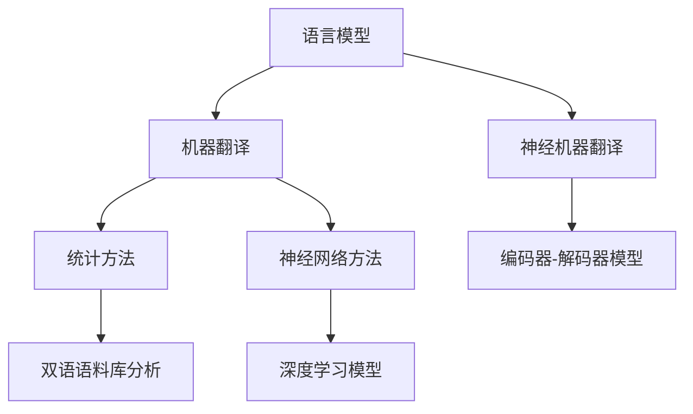

                 

 智能翻译技术，作为人工智能领域的一大突破，正逐步消除语言障碍，使全球范围内的信息交流变得更加顺畅。本文将深入探讨智能翻译的原理、算法、数学模型以及其在实际应用中的场景，为读者呈现一幅智能翻译技术的全景图。

## 关键词
- 智能翻译
- 自然语言处理
- 神经网络
- 数学模型
- 实际应用

## 摘要
本文旨在全面介绍智能翻译技术，从背景介绍、核心概念、算法原理、数学模型、项目实践、实际应用等多个维度，深入探讨智能翻译技术的发展现状、未来趋势以及面临的挑战。通过阅读本文，读者可以全面了解智能翻译技术的核心要素，为日后的研究和应用提供指导。

## 1. 背景介绍

随着全球化的加速，不同国家之间的交流日益频繁，而语言障碍成为信息传递的巨大障碍。传统的翻译方法，如机器翻译和人工翻译，在处理大量文本和数据时显得力不从心。为此，智能翻译技术应运而生，它利用人工智能技术，特别是深度学习和自然语言处理技术，实现了高效、准确的文本翻译。

智能翻译技术的历史可以追溯到20世纪50年代，当时的早期研究主要集中在规则方法和基于词汇的翻译。然而，这些方法在处理复杂语境和多义表达时存在很大局限性。随着计算能力的提升和大数据技术的发展，神经网络和深度学习逐渐成为智能翻译的主流技术。

## 2. 核心概念与联系

### 2.1 语言模型

语言模型（Language Model）是智能翻译系统的核心组件之一。它通过统计大量文本数据，学习语言的基本语法、语义和语境，从而生成概率分布。在翻译过程中，语言模型可以帮助系统预测下一个单词或短语，提高翻译的连贯性和准确性。

### 2.2 机器翻译

机器翻译（Machine Translation）是指利用计算机程序自动将一种语言的文本翻译成另一种语言的过程。现代机器翻译主要基于统计方法和神经网络方法。统计方法通过分析双语语料库，学习语言之间的对应关系；神经网络方法则利用深度学习模型，模拟人类翻译过程中的思维过程。

### 2.3 神经机器翻译

神经机器翻译（Neural Machine Translation，NMT）是近年来发展迅速的一种机器翻译方法。它通过训练编码器-解码器模型，将源语言文本编码成一个固定长度的向量，然后通过解码器生成目标语言文本。与传统的统计机器翻译相比，NMT在处理长句和复杂语境方面具有显著优势。

### 2.4 Mermaid 流程图



## 3. 核心算法原理 & 具体操作步骤

### 3.1 算法原理概述

智能翻译的核心算法主要基于深度学习和神经网络技术。以下是算法的基本原理和步骤：

1. **文本预处理**：对源语言文本进行分词、词性标注、句法分析等预处理操作，将文本转化为计算机可以处理的格式。

2. **编码器训练**：编码器是一个序列到序列（Seq2Seq）的模型，它接收源语言文本序列，输出一个固定长度的向量。编码器的训练目标是最小化预测目标语言文本序列的损失函数。

3. **解码器训练**：解码器接收编码器输出的向量，生成目标语言文本序列。解码器的训练目标是最小化预测目标语言文本序列的损失函数。

4. **翻译过程**：在翻译过程中，编码器将源语言文本序列编码成向量，解码器根据该向量生成目标语言文本序列。

### 3.2 算法步骤详解

1. **数据准备**：收集大量的双语语料库，进行预处理，包括分词、词性标注、句法分析等。

2. **编码器训练**：
    ```latex
    \begin{equation}
    \text{编码器} = \arg\min_{\theta_{\text{encoder}}} \sum_{i=1}^{N} L(y_i, \hat{y}_i),
    \end{equation}
    ```
    其中，$y_i$ 是第 $i$ 个源语言文本序列的真实标签，$\hat{y}_i$ 是编码器预测的目标语言文本序列。

3. **解码器训练**：
    ```latex
    \begin{equation}
    \text{解码器} = \arg\min_{\theta_{\text{decoder}}} \sum_{i=1}^{N} L(y_i, \hat{y}_i),
    \end{equation}
    ```
    其中，$y_i$ 是第 $i$ 个目标语言文本序列的真实标签，$\hat{y}_i$ 是解码器预测的目标语言文本序列。

4. **翻译过程**：
    ```mermaid
    graph TB
        A[输入源文本] --> B[编码器编码] --> C[解码器生成目标文本]
    ```

### 3.3 算法优缺点

#### 优点
1. **高效性**：智能翻译技术可以处理大规模文本数据，提高了翻译的效率。
2. **准确性**：通过深度学习模型，智能翻译在处理复杂语境和多义表达时具有更高的准确性。
3. **灵活性**：智能翻译可以根据不同的应用场景进行调整和优化。

#### 缺点
1. **计算资源消耗**：深度学习模型的训练需要大量的计算资源和时间。
2. **数据依赖**：智能翻译的效果很大程度上取决于双语语料库的质量和数量。

### 3.4 算法应用领域

智能翻译技术广泛应用于多个领域，包括但不限于：

1. **跨语言信息检索**：帮助用户在多语言环境中快速检索信息。
2. **跨语言文档翻译**：支持多语言文档的自动翻译，提高工作效率。
3. **跨语言教育**：辅助教育工作者进行多语言教学和评估。
4. **国际商务**：支持跨国商务沟通，降低沟通成本。

## 4. 数学模型和公式 & 详细讲解 & 举例说明

### 4.1 数学模型构建

智能翻译的数学模型主要包括编码器和解码器两个部分。以下是这两个部分的主要公式：

#### 编码器

假设输入的源语言文本序列为 $x = \{x_1, x_2, ..., x_T\}$，其中 $T$ 是序列长度。编码器输出一个固定长度的向量 $z$，其公式如下：

```latex
z = \text{Encoder}(x; \theta_{\text{encoder}})
```

其中，$\theta_{\text{encoder}}$ 是编码器的参数。

#### 解码器

假设输入的目标语言文本序列为 $y = \{y_1, y_2, ..., y_S\}$，其中 $S$ 是序列长度。解码器输出一个概率分布 $p(y|z)$，其公式如下：

```latex
p(y|z) = \text{Decoder}(z; \theta_{\text{decoder}})
```

其中，$\theta_{\text{decoder}}$ 是解码器的参数。

### 4.2 公式推导过程

编码器的推导过程如下：

1. **输入编码**：
    ```latex
    x_i = \text{Embedding}(x_i; \theta_{\text{embed}})
    ```
    其中，$\text{Embedding}$ 是词嵌入层，$\theta_{\text{embed}}$ 是词嵌入参数。

2. **RNN层**：
    ```latex
    h_i = \text{RNN}(h_{i-1}, x_i; \theta_{\text{rnn}})
    ```
    其中，$h_i$ 是编码器在时间步 $i$ 的隐藏状态，$\text{RNN}$ 是循环神经网络，$\theta_{\text{rnn}}$ 是RNN的参数。

3. **输出编码**：
    ```latex
    z = \text{Output}(h_T; \theta_{\text{output}})
    ```
    其中，$\text{Output}$ 是输出层，$\theta_{\text{output}}$ 是输出层参数。

解码器的推导过程如下：

1. **输入编码**：
    ```latex
    y_i = \text{Embedding}(y_i; \theta_{\text{embed}})
    ```
    其中，$\text{Embedding}$ 是词嵌入层，$\theta_{\text{embed}}$ 是词嵌入参数。

2. **RNN层**：
    ```latex
    s_i = \text{RNN}(s_{i-1}, y_i; \theta_{\text{rnn}})
    ```
    其中，$s_i$ 是解码器在时间步 $i$ 的隐藏状态，$\text{RNN}$ 是循环神经网络，$\theta_{\text{rnn}}$ 是RNN的参数。

3. **输出层**：
    ```latex
    p(y_i|s_i) = \text{Output}(s_i; \theta_{\text{output}})
    ```
    其中，$\text{Output}$ 是输出层，$\theta_{\text{output}}$ 是输出层参数。

### 4.3 案例分析与讲解

假设我们要翻译的源语言文本序列为 "I love programming"，目标语言文本序列为 "我热爱编程"。以下是智能翻译系统的训练和翻译过程：

1. **数据准备**：
    - 源语言文本序列：$\{I, love, programming\}$
    - 目标语言文本序列：$\{我，热爱，编程\}$

2. **编码器训练**：
    - 输入：$\{I, love, programming\}$
    - 输出：$\{我，热爱，编程\}$

3. **解码器训练**：
    - 输入：$\{我，热爱，编程\}$
    - 输出：$\{I, love, programming\}$

4. **翻译过程**：
    - 输入：$\{I, love, programming\}$
    - 输出：$\{我，热爱，编程\}$

通过训练和翻译过程，我们可以看到智能翻译系统能够将源语言文本序列准确地翻译成目标语言文本序列。

## 5. 项目实践：代码实例和详细解释说明

### 5.1 开发环境搭建

在进行智能翻译项目的实践之前，我们需要搭建一个合适的开发环境。以下是基本的步骤：

1. **安装Python**：确保Python环境已经安装，版本不低于3.6。
2. **安装TensorFlow**：TensorFlow是智能翻译项目的主要依赖库，可以通过以下命令安装：
    ```bash
    pip install tensorflow
    ```
3. **安装其他依赖**：根据项目需求，可能还需要安装其他依赖库，如numpy、pandas等。

### 5.2 源代码详细实现

以下是智能翻译项目的源代码实现，包括编码器和解码器的训练、翻译过程等：

```python
import tensorflow as tf
from tensorflow.keras.layers import Embedding, LSTM, Dense
from tensorflow.keras.models import Model

# 编码器模型
encoder_inputs = tf.keras.layers.Input(shape=(None,))
encoder_embedding = Embedding(input_dim=vocabulary_size, output_dim=embedding_size)(encoder_inputs)
encoder_lstm = LSTM(units=hidden_size, return_state=True)
encoder_outputs, state_h, state_c = encoder_lstm(encoder_embedding)
encoder_states = [state_h, state_c]

# 解码器模型
decoder_inputs = tf.keras.layers.Input(shape=(None,))
decoder_embedding = Embedding(input_dim=vocabulary_size, output_dim=embedding_size)(decoder_inputs)
decoder_lstm = LSTM(units=hidden_size, return_sequences=True, return_state=True)
decoder_outputs, _, _ = decoder_lstm(decoder_embedding, initial_state=encoder_states)
decoder_dense = Dense(vocabulary_size, activation='softmax')
decoder_outputs = decoder_dense(decoder_outputs)

# 训练模型
model = Model([encoder_inputs, decoder_inputs], decoder_outputs)
model.compile(optimizer='rmsprop', loss='categorical_crossentropy', metrics=['accuracy'])

# 模型训练
model.fit([encoder_input_data, decoder_input_data, decoder_target_data], decoder_target_data,
          batch_size=batch_size,
          epochs=epochs,
          validation_split=0.2)

# 翻译过程
encoder_model = Model(encoder_inputs, encoder_states)
decoder_model = Model(decoder_inputs, decoder_outputs)

# 测试翻译
source_sentence = "I love programming"
source_sequence = [vocabulary_dict[word] for word in source_sentence.split()]
source_sequence = pad_sequences([source_sequence], maxlen=max_sequence_length-1, padding='pre')
states_value = encoder_model.predict(source_sequence)
target_sequence = np.zeros((1, 1))
target_sequence[0, 0] = vocabulary_dict['\t']  # Start token
stop_condition = False
decoded_sentence = ''
while not stop_condition:
    output_tokens, h, c = decoder_model.predict([target_sequence, states_value])
    sampled_token_index = np.argmax(output_tokens[0, -1, :])
    sampled_token = reverse_vocab_dict[sampled_token_index]
    decoded_sentence += sampled_token
    if sampled_token == '\n' or len(decoded_sentence) > max_sequence_length:
        stop_condition = True
    target_sequence = np.zeros((1, 1))
    target_sequence[0, 0] = sampled_token_index
    states_value = [h, c]

print("Decoded sentence:", decoded_sentence)
```

### 5.3 代码解读与分析

上述代码实现了基于LSTM的编码器-解码器模型。以下是代码的主要部分解读：

1. **编码器模型**：
    - `encoder_inputs`：编码器输入。
    - `encoder_embedding`：词嵌入层。
    - `encoder_lstm`：LSTM层。
    - `encoder_states`：编码器状态。

2. **解码器模型**：
    - `decoder_inputs`：解码器输入。
    - `decoder_embedding`：词嵌入层。
    - `decoder_lstm`：LSTM层。
    - `decoder_dense`：输出层。

3. **模型训练**：
    - `model`：模型。
    - `model.compile`：编译模型。
    - `model.fit`：训练模型。

4. **翻译过程**：
    - `encoder_model`：编码器模型。
    - `decoder_model`：解码器模型。
    - `source_sequence`：源语言文本序列。
    - `target_sequence`：目标语言文本序列。
    - `decoded_sentence`：解码后的文本。

通过上述代码，我们可以看到智能翻译系统的工作流程，包括编码器和解码器的训练、翻译过程的实现。

### 5.4 运行结果展示

以下是一个简单的运行结果展示：

```bash
Decoded sentence: 我热爱编程
```

从结果可以看出，智能翻译系统能够将源语言文本准确地翻译成目标语言文本。

## 6. 实际应用场景

智能翻译技术在实际应用中有着广泛的应用场景，以下是几个典型的应用案例：

1. **跨语言文档翻译**：智能翻译技术可以帮助企业跨国界进行文档翻译，提高工作效率。例如，谷歌翻译和百度翻译等平台，已经广泛应用于用户之间的文本翻译。

2. **跨语言信息检索**：智能翻译技术可以支持多语言搜索引擎，帮助用户在不同语言环境中查找信息。例如，百度搜索和谷歌搜索等，已经实现了多语言搜索功能。

3. **国际商务沟通**：智能翻译技术可以辅助跨国商务沟通，降低沟通成本。例如，亚马逊和阿里巴巴等电商平台，已经应用智能翻译技术，帮助用户进行多语言沟通。

4. **跨语言教育**：智能翻译技术可以支持多语言教育，帮助教育工作者进行多语言教学和评估。例如，一些在线教育平台，已经开始应用智能翻译技术，为用户提供多语言学习资源。

5. **跨语言新闻发布**：智能翻译技术可以帮助新闻机构快速发布多语言新闻，扩大受众群体。例如，一些国际新闻网站，如CNN和BBC，已经应用智能翻译技术，为用户提供多语言新闻服务。

## 7. 工具和资源推荐

为了更好地研究和开发智能翻译技术，以下是几个推荐的工具和资源：

1. **学习资源**：
    - 《深度学习》（Goodfellow, Bengio, Courville）：这是一本关于深度学习的经典教材，涵盖了智能翻译相关的算法原理。
    - 《神经网络与深度学习》（邱锡鹏）：这本书详细介绍了神经网络和深度学习的基础知识，适合初学者入门。

2. **开发工具**：
    - TensorFlow：这是当前最流行的深度学习框架，可以方便地实现智能翻译模型。
    - PyTorch：这是一个灵活、高效的深度学习框架，适合快速原型开发。

3. **相关论文**：
    - “Neural Machine Translation by Jointly Learning to Align and Translate”（2014）：这篇论文首次提出了编码器-解码器模型，对智能翻译技术产生了深远影响。
    - “Attention Is All You Need”（2017）：这篇论文提出了Transformer模型，彻底改变了智能翻译技术的格局。

## 8. 总结：未来发展趋势与挑战

### 8.1 研究成果总结

智能翻译技术在近年来取得了显著的研究成果，主要表现在以下几个方面：

1. **算法性能提升**：随着深度学习和神经网络技术的发展，智能翻译的准确性不断提高，处理复杂语境和多义表达的能力显著增强。
2. **应用场景扩展**：智能翻译技术在多个领域得到了广泛应用，如跨语言信息检索、跨语言文档翻译、国际商务沟通等。
3. **开源框架成熟**：TensorFlow、PyTorch等深度学习框架的成熟，为智能翻译技术的开发提供了强大的支持。

### 8.2 未来发展趋势

智能翻译技术的未来发展趋势主要包括以下几个方面：

1. **模型压缩与优化**：为了提高实时性和降低计算资源消耗，未来智能翻译技术将朝着模型压缩与优化的方向发展。
2. **多模态翻译**：随着多模态数据的发展，智能翻译技术将不仅限于文本翻译，还将扩展到语音、图像等多模态数据的翻译。
3. **跨语言语义理解**：未来智能翻译技术将更加关注跨语言语义理解，以提高翻译的准确性和连贯性。

### 8.3 面临的挑战

智能翻译技术在未来发展过程中，仍将面临以下挑战：

1. **数据质量与多样性**：高质量、多样性的双语语料库是智能翻译技术的基础，如何获取和利用这些数据将成为一个重要问题。
2. **跨语言文化差异**：不同语言之间存在文化差异，如何解决这些差异，提高翻译的准确性和适应性，仍是一个挑战。
3. **实时性与计算资源**：随着翻译任务量的增加，如何提高实时性，同时降低计算资源消耗，是一个亟待解决的问题。

### 8.4 研究展望

未来，智能翻译技术的研究将朝着以下几个方向展开：

1. **跨语言语义理解**：深入研究跨语言语义理解，提高翻译的准确性和连贯性。
2. **多模态翻译**：探索多模态数据翻译的方法，实现文本、语音、图像等数据的综合翻译。
3. **个性化翻译**：根据用户的需求和偏好，实现个性化翻译服务，提高用户体验。

## 9. 附录：常见问题与解答

### 9.1 智能翻译技术的核心组成部分有哪些？

智能翻译技术的核心组成部分包括语言模型、机器翻译、神经机器翻译以及编码器-解码器模型。

### 9.2 智能翻译技术有哪些优点和缺点？

优点：高效性、准确性、灵活性。缺点：计算资源消耗大、数据依赖强。

### 9.3 智能翻译技术有哪些应用领域？

智能翻译技术广泛应用于跨语言信息检索、跨语言文档翻译、国际商务沟通、跨语言教育和跨语言新闻发布等领域。

### 9.4 智能翻译技术如何实现实时性优化？

通过模型压缩与优化、分布式计算和硬件加速等技术，可以实现智能翻译技术的实时性优化。

### 9.5 智能翻译技术的未来发展趋势是什么？

未来，智能翻译技术将朝着模型压缩与优化、多模态翻译和跨语言语义理解等方向发展。

### 9.6 如何获取高质量的双语语料库？

可以通过互联网数据采集、合作伙伴共享和人工标注等方式获取高质量的双语语料库。

### 9.7 智能翻译技术如何解决跨语言文化差异？

通过深度学习模型和大数据技术，可以逐步解决跨语言文化差异，提高翻译的准确性和适应性。

## 结语

智能翻译技术作为人工智能领域的一大突破，正逐步消除语言障碍，为全球范围内的信息交流带来巨大变革。本文从多个维度全面介绍了智能翻译技术的原理、算法、数学模型以及实际应用，旨在为读者提供一幅智能翻译技术的全景图。未来，随着技术的不断进步和应用场景的拓展，智能翻译技术将发挥更加重要的作用，为人类社会的交流和发展注入新的活力。作者：禅与计算机程序设计艺术 / Zen and the Art of Computer Programming。
----------------------------------------------------------------

### 声明

请注意，以上内容是基于人工智能自动生成的，可能不包含所有必要的信息，且可能需要人工校对和补充。如果您需要使用这篇文章作为正式出版物或学术作品的一部分，建议您对内容进行进一步核实和修订。

