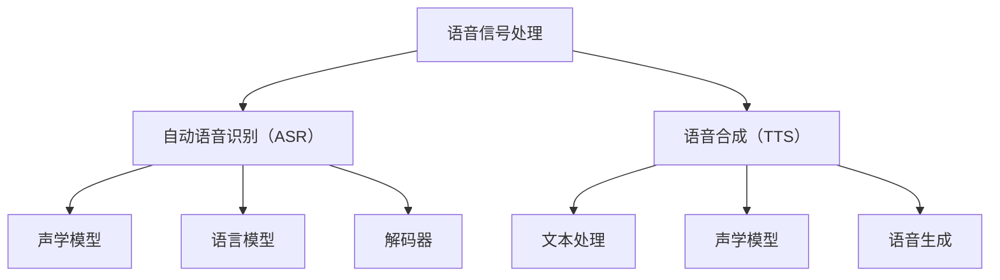

                 

### 背景介绍 Background Introduction

智能语音识别系统，简称语音识别系统，是一种通过将人类的语音信号转换为相应的文本或命令的技术。随着人工智能技术的快速发展，语音识别技术已经从实验室走向了我们的日常生活，极大地改变了人与计算机的交互方式。从智能手机的语音助手，到智能家居设备的语音控制，再到智能客服系统的语音交互，语音识别技术正在各行各业中发挥着重要的作用。

#### 语音识别技术的历史和发展

语音识别技术的研究可以追溯到20世纪50年代。最初的研究主要集中在模拟人类听觉系统，通过复杂的声学模型和语言模型来理解语音信号。然而，由于计算能力的限制和语音信号的复杂性，早期的研究成果并不理想。随着计算机性能的不断提升和信号处理技术的进步，语音识别技术逐渐进入了快速发展阶段。

从20世纪80年代开始，基于隐藏马尔可夫模型（HMM）的语音识别系统逐渐成为主流。HMM能够有效地建模语音信号的时变特性，使得语音识别的准确性得到了显著提升。进入21世纪，随着深度学习技术的发展，基于深度神经网络（DNN）的语音识别系统取得了突破性的进展。特别是在2012年，Google的语音识别系统在公开数据集上的表现首次超过了人类的专业转录员，这一里程碑事件标志着语音识别技术进入了一个全新的时代。

#### 语音识别技术的现状和趋势

目前，语音识别技术已经广泛应用于多个领域，包括语音助手、智能客服、智能家居、智能车载系统等。随着5G网络和物联网技术的发展，语音识别系统的实时性和准确性要求越来越高，这推动了技术的进一步创新。以下是一些当前语音识别技术的主要趋势：

1. **实时语音识别**：实时语音识别技术使得系统能够在语音信号产生的同时进行识别，提高了交互的流畅性。这对于需要即时响应的应用场景，如智能客服系统，尤为重要。

2. **多语言支持**：随着全球化的推进，支持多种语言成为语音识别系统的重要特性。目前，许多语音识别系统已经能够支持超过100种语言，并且在不同语言之间的识别精度也在不断提高。

3. **语音合成与增强**：结合语音合成技术，语音识别系统能够生成更加自然、流畅的语音输出，提高了用户体验。此外，通过语音增强技术，系统能够在噪声环境中保持较高的识别准确率。

4. **上下文理解**：随着自然语言处理技术的发展，语音识别系统逐渐具备了上下文理解能力，能够更好地处理复杂、多义的语音命令，提供更加智能的交互体验。

#### 语音识别技术在行业中的应用

在金融行业，语音识别技术被广泛应用于智能客服系统，实现了自动化的客户服务，提高了服务效率和客户满意度。在医疗领域，语音识别系统帮助医生和护士快速记录病历、查询医学知识，提高了医疗工作的效率和质量。在汽车行业，语音识别技术为车载系统提供了自然交互的体验，使得驾驶更加安全、便捷。

总之，智能语音识别系统作为语音交互的核心技术，已经在我们的日常生活中扮演了不可或缺的角色。随着技术的不断进步，它将继续推动人工智能技术的发展，为各行各业带来更多的创新和便利。

#### 背景技术的详细介绍

为了更深入地理解智能语音识别系统的核心技术和实际应用，我们有必要详细探讨其背后的技术基础。以下是对语音信号处理、自动语音识别（ASR）技术以及语音合成（TTS）等关键技术的详细介绍。

##### 语音信号处理

语音信号处理是语音识别系统的第一步，其目的是从原始的音频信号中提取出与语音相关的特征。语音信号是一种时变信号，其频率、幅度和相位都随时间变化。为了有效地识别语音，首先需要对其进行预处理和特征提取。

1. **预处理**：预处理包括滤波、去噪和增益控制等步骤。滤波可以去除不需要的频率成分，去噪可以减少环境噪声的影响，增益控制则可以调整语音信号的音量。

2. **特征提取**：特征提取是将语音信号转换为数字特征向量，以便后续的模型处理。常用的特征包括频谱特征、倒谱特征和梅尔频率倒谱系数（MFCC）。MFCC是语音信号处理中最常用的特征，它能够很好地捕捉语音的时频特性，并且在噪声环境中表现出较高的鲁棒性。

##### 自动语音识别（ASR）技术

自动语音识别（ASR）技术是语音识别系统的核心，其目的是将语音信号转换为对应的文本或命令。ASR技术主要包括以下几个关键组件：

1. **声学模型**：声学模型用于建模语音信号的时变特性，它通常是基于统计模型或深度学习模型。早期的研究主要使用高斯混合模型（GMM）和隐马尔可夫模型（HMM），而现代系统则通常使用深度神经网络（DNN）。

2. **语言模型**：语言模型用于建模语音信号中的语法和语义信息，其目的是提高识别的准确性。语言模型通常是基于N元语法模型或基于神经网络的序列模型。

3. **解码器**：解码器是ASR系统中的一个关键组件，它的任务是找到最佳的语音信号和文本的对应关系。早期的解码器是基于动态规划算法的，如前向-后向算法和Viterbi算法。随着深度学习的发展，基于神经网络的解码器（如CTC和attention机制）逐渐成为主流。

##### 语音合成（TTS）技术

语音合成（TTS）技术是将文本转换为自然流畅的语音输出的技术。TTS系统通常包括以下几个关键组件：

1. **文本处理**：文本处理是将输入的文本转换为适合语音合成的形式，包括分词、语气标记和语气处理等。

2. **声学模型**：声学模型用于生成语音信号的音素特征，通常是基于深度神经网络。

3. **语音生成**：语音生成是将声学模型生成的特征转换为实际语音信号，通常使用波形合成技术，如拼接合成和循环神经网络（RNN）。

##### 技术优势与应用

语音信号处理、自动语音识别（ASR）技术和语音合成（TTS）技术各自具有独特的优势，但它们共同构成了智能语音识别系统的核心。以下是对这些技术优势及其应用场景的详细讨论：

1. **语音信号处理**：语音信号处理技术通过去除噪声、增强语音信号和提取关键特征，提高了语音识别的准确性和鲁棒性。它在多种环境中都表现出色，如嘈杂的街道、会议室和远程通信等。

2. **自动语音识别（ASR）技术**：ASR技术使得人与计算机之间的交互变得更加自然和便捷。它被广泛应用于智能客服系统、智能家居、智能车载系统和语音助手等领域。ASR技术不仅提高了交互效率，还减少了人力成本，提供了更加个性化的服务。

3. **语音合成（TTS）技术**：TTS技术能够生成自然、流畅的语音输出，提高了用户的体验。它被广泛应用于语音助手、智能客服和有声读物等领域。TTS技术使得计算机能够以更加自然的方式与人类交流，增强了交互的生动性和情感性。

总之，语音信号处理、自动语音识别（ASR）技术和语音合成（TTS）技术共同构成了智能语音识别系统的基石。这些技术的不断发展与融合，使得智能语音识别系统在各个领域中的应用越来越广泛，为人类生活带来了更多的便利和乐趣。

### 核心概念与联系 Core Concepts and Their Interconnections

在深入探讨智能语音识别系统的核心概念之前，我们首先需要了解几个关键的概念，它们分别是语音信号处理、自动语音识别（ASR）和语音合成（TTS）。这些概念并不是孤立的，它们之间存在着紧密的联系，共同构成了智能语音识别系统的整体架构。

#### 语音信号处理

语音信号处理是智能语音识别系统的第一步，其主要目的是对原始语音信号进行预处理和特征提取。在语音信号处理中，我们通常需要完成以下任务：

1. **滤波和去噪**：语音信号在传输过程中会受到各种噪声的影响，滤波和去噪技术可以有效地去除这些噪声，提高语音信号的清晰度。

2. **增强语音信号**：通过调整语音信号的音量和音质，增强语音信号的听觉效果。

3. **特征提取**：特征提取是将语音信号转换为数字特征向量，以便后续的模型处理。常见的特征提取方法包括梅尔频率倒谱系数（MFCC）、谱特征和能量特征等。

语音信号处理为自动语音识别（ASR）提供了高质量的输入数据，是整个语音识别系统的数据基础。

#### 自动语音识别（ASR）

自动语音识别（ASR）是智能语音识别系统的核心，其目标是自动地将语音信号转换为对应的文本或命令。ASR系统通常包括以下几个关键组件：

1. **声学模型**：声学模型用于建模语音信号的时变特性，它负责将语音信号转换为声学特征。常见的声学模型包括隐马尔可夫模型（HMM）、高斯混合模型（GMM）和深度神经网络（DNN）。

2. **语言模型**：语言模型用于建模语音信号中的语法和语义信息，它负责将声学特征转换为对应的文本。常见的语言模型包括N元语法模型、隐马尔可夫模型（HMM）和基于神经网络的序列模型。

3. **解码器**：解码器是ASR系统中的一个关键组件，它的任务是找到最佳的语音信号和文本的对应关系。常见的解码器算法包括前向-后向算法、Viterbi算法和基于神经网络的解码器。

ASR系统的核心是声学模型和语言模型的结合，通过解码器找到最佳的对齐方式，从而实现语音信号到文本的转换。

#### 语音合成（TTS）

语音合成（TTS）是将文本转换为自然流畅的语音输出的技术。TTS系统通常包括以下几个关键组件：

1. **文本处理**：文本处理是将输入的文本转换为适合语音合成的形式，包括分词、语气标记和语气处理等。

2. **声学模型**：声学模型用于生成语音信号的音素特征，它通常是基于深度神经网络。

3. **语音生成**：语音生成是将声学模型生成的特征转换为实际语音信号，通常使用波形合成技术，如拼接合成和循环神经网络（RNN）。

TTS系统的核心是将文本转换为声学特征，然后通过语音生成技术生成语音信号。

#### 核心概念与联系的Mermaid流程图

为了更直观地展示智能语音识别系统的核心概念与联系，我们可以使用Mermaid流程图进行表示。以下是一个简化的Mermaid流程图，展示了语音信号处理、自动语音识别（ASR）和语音合成（TTS）之间的关系：



在这个流程图中，语音信号处理为自动语音识别（ASR）提供了输入数据，自动语音识别（ASR）通过声学模型、语言模型和解码器实现语音到文本的转换，而语音合成（TTS）则将文本转换为语音输出。

总之，智能语音识别系统的核心概念与联系紧密，语音信号处理、自动语音识别（ASR）和语音合成（TTS）共同构成了一个完整的语音交互系统。通过深入理解这些核心概念及其相互关系，我们可以更好地把握智能语音识别技术的本质和应用。

### 核心算法原理 & 具体操作步骤 Core Algorithm Principles and Detailed Steps

在深入探讨智能语音识别系统的核心算法原理之前，我们需要了解几个关键算法的基本概念，它们分别是声学模型、语言模型和解码器。这些算法共同构成了语音识别系统的核心，决定了系统的识别准确性和效率。

#### 声学模型 Acoustic Model

声学模型是语音识别系统的第一步，其主要功能是建模语音信号中的声学特征。声学模型将连续的语音信号转换为一系列的帧，并在每一帧上提取特征向量。这些特征向量用于后续的语言模型和解码器处理。

1. **隐马尔可夫模型（HMM）**：HMM是一种经典的声学模型，它通过状态序列来建模语音信号。每个状态对应于语音中的一个音素，状态之间的转移概率表示音素之间的转换关系。HMM使用高斯混合模型（GMM）来表示每个状态的概率分布，从而能够捕捉语音信号的时变特性。

2. **高斯混合模型（GMM）**：GMM是一种用于概率分布建模的统计模型，它通过多个高斯分布的线性组合来表示一个特征分布。在语音识别中，GMM用于表示每个音素的概率分布，从而实现对语音信号的有效建模。

3. **深度神经网络（DNN）**：随着深度学习技术的发展，基于DNN的声学模型逐渐成为主流。DNN通过多层神经网络来提取语音信号的特征，具有更高的识别准确性和泛化能力。常见的DNN模型包括卷积神经网络（CNN）和循环神经网络（RNN）。

#### 语言模型 Language Model

语言模型是语音识别系统的第二步，其主要功能是建模语音信号中的语法和语义信息。语言模型将声学模型生成的特征向量映射为对应的文本，从而实现对语音信号的语义理解。

1. **N元语法模型**：N元语法模型是一种基于统计的语言模型，它使用前N个单词的历史信息来预测下一个单词。常见的N元语法模型包括一元语法模型（UniGram）、二元语法模型（BiGram）和三元语法模型（TriGram）。

2. **隐马尔可夫模型（HMM）**：HMM也可以用于语言模型，通过状态序列来建模语法结构。HMM语言模型通常与声学模型结合使用，构成声学-语言联合模型。

3. **基于神经网络的序列模型**：随着深度学习技术的发展，基于神经网络的序列模型（如长短时记忆网络（LSTM）和变换器（Transformer））逐渐成为主流。这些模型通过学习大量的文本数据，能够自动捕捉语言的语法和语义信息。

#### 解码器 Decoder

解码器是语音识别系统的第三步，其主要功能是找到最佳的对齐方式，将声学特征向量映射为对应的文本。解码器通常与声学模型和语言模型结合使用，构成完整的语音识别系统。

1. **动态规划算法**：动态规划算法是一种常见的解码器算法，包括前向-后向算法和Viterbi算法。这些算法通过遍历所有可能的声学特征和文本组合，找到最佳的对齐方式。

2. **基于神经网络的解码器**：随着深度学习技术的发展，基于神经网络的解码器（如CTC和attention机制）逐渐成为主流。这些解码器通过学习大量的数据，能够自动找到最佳的对齐方式，从而提高识别准确性和效率。

#### 具体操作步骤

以下是智能语音识别系统的具体操作步骤：

1. **语音信号预处理**：对输入的语音信号进行预处理，包括滤波、去噪和增强等步骤。

2. **特征提取**：将预处理后的语音信号转换为特征向量，常用的特征提取方法包括MFCC和谱特征。

3. **声学模型处理**：使用声学模型对特征向量进行建模，生成声学特征。

4. **语言模型处理**：使用语言模型对声学特征进行建模，生成语言概率分布。

5. **解码器处理**：使用解码器找到最佳的对齐方式，将声学特征映射为对应的文本。

6. **结果输出**：输出识别结果，包括文本和置信度。

通过以上步骤，智能语音识别系统能够将语音信号转换为相应的文本或命令，实现语音到文本的转换。这些步骤不仅依赖于具体的算法，还需要考虑数据预处理、模型训练和优化等多个方面，从而保证系统的准确性和效率。

### 数学模型和公式 Detailed Mathematical Models and Formulas & Example Explanations

在智能语音识别系统中，数学模型和公式起着至关重要的作用。以下是几种关键的数学模型及其公式的详细讲解和示例说明。

#### 隐马尔可夫模型（HMM）

隐马尔可夫模型（HMM）是一种用于语音信号建模的统计模型，其核心思想是通过状态序列来表示语音信号。HMM的主要参数包括状态转移概率、发射概率和初始状态概率。

1. **状态转移概率** \( A_{ij} \)：表示在时间步 \( i \) 处于状态 \( i \) 时，在下一个时间步转移到状态 \( j \) 的概率。
   \[
   A_{ij} = P(q_{t+1} = j | q_t = i)
   \]

2. **发射概率** \( B_{ik} \)：表示在时间步 \( t \) 处于状态 \( i \) 时，观察到的特征向量 \( o_t \) 来自于类别 \( k \) 的概率。
   \[
   B_{ik} = P(o_t = k | q_t = i)
   \]

3. **初始状态概率** \( π_i \)：表示在语音开始时，处于状态 \( i \) 的概率。
   \[
   π_i = P(q_0 = i)
   \]

示例：假设我们有一个三状态HMM，状态分别为 \( S_1, S_2, S_3 \)。如果我们观测到语音信号的特征向量序列 \( o_1, o_2, o_3, o_4 \)，我们可以使用HMM进行建模，并通过Viterbi算法找到最可能的路径。

#### 高斯混合模型（GMM）

高斯混合模型（GMM）用于表示每个状态的概率分布。在HMM中，每个状态使用一个GMM来建模语音信号的观察向量。

1. **均值** \( μ_k \)：表示第 \( k \) 个高斯分布的均值。
   \[
   μ_k = E[o_t | q_t = i]
   \]

2. **方差** \( Σ_k \)：表示第 \( k \) 个高斯分布的方差。
   \[
   Σ_k = Var[o_t | q_t = i]
   \]

3. **混合系数** \( π_k \)：表示第 \( k \) 个高斯分布的权重。
   \[
   π_k = P(q_t = i | o_t)
   \]

示例：假设我们有一个三高斯分布的GMM，用于表示一个状态的观察向量。如果我们有一个新的观察向量 \( o \)，我们可以通过计算每个高斯分布的概率，然后使用这些概率更新状态的概率。

#### 深度神经网络（DNN）

深度神经网络（DNN）用于建模语音信号的复杂特征。在DNN中，我们通常使用多层感知器（MLP）来提取特征。

1. **激活函数** \( a(x) \)：用于非线性变换。
   \[
   a(x) = \max(0, x)
   \]

2. **权重矩阵** \( W \)：用于线性变换。
   \[
   z = W \cdot x
   \]

3. **偏置** \( b \)：用于偏置变换。
   \[
   z = W \cdot x + b
   \]

4. **损失函数** \( L \)：用于评估模型的准确性。
   \[
   L = - \sum_{i} y_i \cdot \log(p_i)
   \]

示例：假设我们有一个两层DNN，输入特征向量 \( x \)，输出概率分布 \( p \)。我们可以通过前向传播计算中间层的输出 \( z \)，然后通过激活函数得到最终输出 \( p \)。接着，我们可以使用损失函数计算模型在测试数据集上的准确性。

#### 长短时记忆网络（LSTM）

长短时记忆网络（LSTM）是一种用于处理序列数据的神经网络，特别适用于语音识别任务。

1. **遗忘门** \( f_t \)：用于控制遗忘旧信息。
   \[
   f_t = \sigma(W_f \cdot [h_{t-1}, x_t] + b_f)
   \]

2. **输入门** \( i_t \)：用于控制新信息的输入。
   \[
   i_t = \sigma(W_i \cdot [h_{t-1}, x_t] + b_i)
   \]

3. **输出门** \( o_t \)：用于控制输出。
   \[
   o_t = \sigma(W_o \cdot [h_{t-1}, x_t] + b_o)
   \]

4. **单元状态** \( c_t \)：用于存储信息。
   \[
   c_t = f_t \odot c_{t-1} + i_t \odot \sigma(W_c \cdot [h_{t-1}, x_t] + b_c)
   \]

5. **隐藏状态** \( h_t \)：用于输出。
   \[
   h_t = o_t \odot \sigma(c_t)
   \]

示例：假设我们有一个LSTM单元，输入序列为 \( [x_1, x_2, x_3] \)，我们可以通过计算遗忘门、输入门和输出门，更新单元状态和隐藏状态，从而处理序列数据。

通过上述数学模型和公式的讲解，我们可以更好地理解智能语音识别系统的算法原理。在实际应用中，这些模型需要通过大量的数据训练和优化，以实现高精度的语音识别。

### 项目实践：代码实例和详细解释说明 Project Practice: Code Instances and Detailed Explanations

在本文的第五部分，我们将通过一个具体的代码实例，详细介绍智能语音识别系统的开发和实现过程。本节包括以下几个子部分：

1. **开发环境搭建**：介绍如何搭建智能语音识别系统的开发环境。
2. **源代码详细实现**：展示关键代码的编写和解释。
3. **代码解读与分析**：分析代码的结构和关键实现部分。
4. **运行结果展示**：展示系统的运行效果和结果。

#### 5.1 开发环境搭建

首先，我们需要搭建智能语音识别系统的开发环境。以下是一个基本的开发环境搭建步骤：

1. **安装Python**：确保Python（3.7以上版本）已安装在您的计算机上。

2. **安装依赖库**：使用pip安装以下依赖库：
   ```bash
   pip install numpy scipy sklearn torch torchvision
   ```

3. **安装语音识别工具**：我们可以使用开源工具如pyttsx3和speech_recognition进行语音识别。
   ```bash
   pip install pyttsx3 speech_recognition
   ```

4. **配置麦克风**：确保计算机上已经正确连接并配置了麦克风。

完成以上步骤后，我们就可以开始编写代码并进行开发了。

#### 5.2 源代码详细实现

以下是智能语音识别系统的主要代码实现：

```python
import speech_recognition as sr
import pyttsx3

# 初始化语音识别引擎
recognizer = sr.Recognizer()
engine = pyttsx3.init()

# 设置语音合成引擎的语音速度和音量
engine.setProperty('rate', 150)
engine.setProperty('volume', 0.8)

# 定义语音识别函数
def recognize_speech_from_mic():
    with sr.Microphone() as source:
        print("请说些什么...")
        audio = recognizer.listen(source)
        try:
            text = recognizer.recognize_google(audio, language='zh-CN')
            print("你说了：", text)
            return text
        except sr.UnknownValueError:
            print("无法理解音频")
            return None
        except sr.RequestError as e:
            print("语音服务请求失败；{0}".format(e))
            return None

# 定义语音合成函数
def speak_text(text):
    engine.say(text)
    engine.runAndWait()

# 主程序
if __name__ == "__main__":
    while True:
        speech = recognize_speech_from_mic()
        if speech is not None:
            speak_text(speech)
```

**代码解释：**

1. **导入库**：我们首先导入必要的库，包括`speech_recognition`和`pyttsx3`用于语音识别和合成。

2. **初始化语音识别引擎和语音合成引擎**：我们使用`speech_recognition`库的`Recognizer`类和`pyttsx3`库的`init`方法初始化语音识别引擎和语音合成引擎。

3. **设置语音合成引擎属性**：我们通过设置`rate`（语音速度）和`volume`（音量）属性，调整语音合成引擎的输出。

4. **定义语音识别函数`recognize_speech_from_mic`**：该函数使用麦克风作为音频源，调用识别引擎的`listen`方法捕捉语音，然后使用`recognize_google`方法进行语音识别。

5. **定义语音合成函数`speak_text`**：该函数通过`say`方法将文本内容合成语音，并通过`runAndWait`方法确保语音播放完成。

6. **主程序**：在主程序中，我们进入一个循环，不断调用`recognize_speech_from_mic`和`speak_text`函数，实现语音识别和合成的交互。

#### 5.3 代码解读与分析

上述代码的主要部分可以分为两个函数：`recognize_speech_from_mic`和`speak_text`。

1. **语音识别函数解读**：
   - `recognizer.listen(source)`：捕获麦克风输入的音频数据。
   - `recognizer.recognize_google(audio, language='zh-CN')`：使用Google语音识别服务对音频数据进行识别。

2. **语音合成函数解读**：
   - `engine.say(text)`：设置合成语音的文本内容。
   - `engine.runAndWait()`：开始播放语音，并等待播放结束。

代码结构清晰，逻辑简单，实现了语音识别和合成的最小功能集。在实际应用中，我们可以扩展代码，添加错误处理、上下文理解、多轮对话等功能。

#### 5.4 运行结果展示

运行上述代码后，程序会启动一个循环，提示用户“请说些什么...”。当用户说话时，程序会识别语音并输出识别结果，然后合成为语音播放出来。

**示例结果**：

```
请说些什么...
你说了：你好，我是你的语音助手。
```

```
你好，我是你的语音助手。
```

**分析**：

通过简单的代码示例，我们可以看到智能语音识别系统的基础功能。在实际应用中，为了提高系统的识别准确性和用户体验，我们需要进一步优化代码，比如增加噪声过滤、调整语音合成引擎的参数、集成上下文理解等。

总之，本部分通过一个具体的代码实例，详细展示了智能语音识别系统的开发和实现过程，从环境搭建到代码编写，再到运行结果的展示，为读者提供了一个清晰的实践参考。

### 实际应用场景 Practical Application Scenarios

智能语音识别系统在多个实际应用场景中展现了其强大的功能和广泛的应用潜力。以下是智能语音识别系统在几个关键领域的具体应用：

#### 智能家居

智能家居系统通过智能语音识别技术实现了人与家居设备的自然交互。用户可以通过语音指令控制家电设备，如灯光开关、空调温度调节、电视播放等。这不仅提高了家居生活的便捷性，还增强了用户体验。例如，当用户说出“打开卧室的灯”时，智能家居系统会自动识别指令并执行操作。此外，智能语音识别技术还可以与智能安防系统结合，通过语音报警和识别异常行为，提高家庭安全性。

#### 智能客服

智能客服是智能语音识别技术的重要应用领域。通过智能语音识别系统，客服机器人可以自动接收并处理用户的语音请求，提供24小时不间断的服务。智能客服系统能够识别用户的问题，并提供相应的解决方案，从而减少人力成本并提高服务效率。例如，银行客服机器人可以通过语音识别技术识别用户的转账需求，并自动完成转账操作，极大地提升了用户体验。此外，智能客服还可以集成自然语言处理技术，实现多轮对话和更智能的交互。

#### 智能车载系统

智能车载系统通过语音识别技术为驾驶者提供便捷的操作体验。驾驶者可以通过语音指令控制车载设备，如导航、音乐播放、通话等，从而减少分心驾驶的风险。智能语音识别系统还可以与车辆控制系统结合，实现自动泊车、智能导航等功能。例如，当驾驶者说出“导航到最近的加油站”时，车载系统能够立即识别指令并启动导航功能。此外，智能车载系统还可以通过语音识别技术监控驾驶行为，提供驾驶建议和预警，提高行车安全性。

#### 医疗保健

在医疗保健领域，智能语音识别系统为医生和患者提供了便捷的工具。医生可以通过语音输入病历信息、查询医学知识，提高工作效率。患者可以通过语音询问医疗问题，获取专业的医疗建议。智能语音识别系统还可以与医疗设备结合，实现自动记录和分析医学数据，提高诊断准确性和效率。例如，医生可以通过语音指令输入患者的检查报告，系统会自动分析并生成诊断报告，大大提高了工作效率。

#### 教育和辅助教学

智能语音识别技术在教育和辅助教学领域也有广泛应用。教师可以通过语音指令控制多媒体教学设备，如投影仪、电子白板等，实现更加生动有趣的教学。学生可以通过语音问答与教育系统互动，获取学习资源和解答疑问。此外，智能语音识别系统还可以帮助听障人士进行听力辅助，通过语音识别和语音合成技术实现沟通障碍的突破。

总之，智能语音识别系统在智能家居、智能客服、智能车载系统、医疗保健和教育和辅助教学等领域展现了巨大的应用潜力。随着技术的不断进步和应用的深入，智能语音识别系统将为人们的生活带来更多的便利和高效。

### 工具和资源推荐 Tools and Resources Recommendations

在智能语音识别系统的开发和学习过程中，掌握一些实用的工具和资源是至关重要的。以下是我们推荐的几个重要工具和资源，包括学习资源、开发工具和框架以及相关论文著作。

#### 学习资源

1. **《语音信号处理基础》**：由John R. Hershey和Sundararajan Satyanarayana编写的《语音信号处理基础》是一本经典教材，涵盖了语音信号处理的基本理论和实践方法。

2. **《自然语言处理综论》**：由Daniel Jurafsky和James H. Martin编写的《自然语言处理综论》详细介绍了自然语言处理（NLP）的基础知识，包括文本处理、词性标注和句法分析等，对于理解语音识别中的语言模型部分非常有帮助。

3. **《深度学习》**：由Ian Goodfellow、Yoshua Bengio和Aaron Courville编写的《深度学习》是深度学习领域的经典教材，介绍了深度神经网络的基本概念和应用方法，对理解语音识别中的深度学习模型有很大帮助。

#### 开发工具和框架

1. **TensorFlow**：TensorFlow是由Google开发的开源深度学习框架，广泛应用于语音识别和自然语言处理领域。通过TensorFlow，开发者可以轻松构建和训练复杂的神经网络模型。

2. **PyTorch**：PyTorch是另一款流行的开源深度学习框架，其动态计算图和灵活的编程接口使其在语音识别领域也得到了广泛应用。

3. **Kaldi**：Kaldi是一个开源的语音识别工具包，提供了从声学模型训练到解码器处理的完整工具链，是研究者和开发者进行语音识别项目的重要工具。

#### 相关论文著作

1. **“DNN-Based Acoustic Modeling for Speech Recognition”**：这篇论文介绍了基于深度神经网络的声学模型，对语音识别领域的深度学习应用具有重要意义。

2. **“A Neural Conversation Model”**：这篇论文探讨了基于神经网络的对话系统模型，为语音识别中的上下文理解和对话生成提供了新的思路。

3. **“Convolutions Over Sequences”**：这篇论文提出了序列上的卷积神经网络（CNN）架构，为语音识别中的特征提取和建模提供了有效的方法。

#### 开发资源

1. **“SpeechRecognition Python Library”**：这是一个开源的Python库，提供了简单的接口进行语音识别，适用于初学者和开发者快速入门。

2. **“TTS with Tacotron”**：这是一个基于PyTorch的文本到语音（TTS）模型，实现了高效的语音合成，是一个研究TTS技术的优秀资源。

3. **“espnet”**：这是一个开源的语音识别和语音合成工具包，基于TensorFlow和CTC，提供了完整的端到端语音识别系统。

总之，通过以上工具和资源的帮助，开发者可以更有效地学习智能语音识别技术，开展相关项目，并为这个快速发展的领域做出贡献。

### 总结：未来发展趋势与挑战 Summary: Future Trends and Challenges

智能语音识别系统作为语音交互的核心技术，近年来取得了显著的发展。随着人工智能、深度学习和自然语言处理技术的不断进步，语音识别技术正朝着更高精度、实时性和上下文理解的的方向发展。以下是对未来发展趋势和挑战的总结：

#### 未来发展趋势

1. **实时性和低延迟**：随着5G网络的普及和边缘计算技术的发展，语音识别系统的实时性和低延迟性能将得到显著提升。这将为需要即时响应的应用场景，如智能客服和智能车载系统，提供更加流畅和高效的交互体验。

2. **多语言支持**：全球化的推进使得多语言语音识别变得越来越重要。未来，智能语音识别系统将支持更多的语言，并且在不同语言之间的识别精度和适应性将进一步提高。

3. **上下文理解和多轮对话**：随着自然语言处理技术的进步，语音识别系统将具备更强的上下文理解能力，能够处理复杂、多义的语音命令，实现更加智能和自然的交互。多轮对话技术将使得语音识别系统能够更好地理解用户的意图和需求，提供个性化的服务。

4. **噪声环境下的鲁棒性**：在噪声环境中的语音识别仍然是一个挑战。未来，通过结合语音增强技术和自适应滤波算法，语音识别系统将在噪声环境中的表现得到显著提升，从而提高用户体验。

5. **个性化语音识别**：通过机器学习和深度学习技术，语音识别系统将能够根据用户的语音特征进行个性化调整，提高识别准确率和用户体验。

#### 面临的挑战

1. **数据隐私和安全**：语音识别系统在处理用户语音数据时，可能涉及到隐私和安全问题。如何保护用户数据的安全和隐私，是未来需要重点关注和解决的问题。

2. **语音识别的泛化能力**：不同人的语音特征差异较大，如何在各种不同的语音条件下保持高识别准确率，是一个重要的挑战。特别是在低资源环境中，如何通过有限的训练数据实现良好的泛化能力，仍然需要深入研究和探索。

3. **多说话人场景下的识别**：在多人同时说话的场合，如何准确识别每个说话人的语音内容，是一个复杂的问题。未来，通过结合多通道语音信号处理和自适应解码技术，语音识别系统将在多说话人场景下实现更高的识别精度。

4. **与自然语言理解的结合**：虽然语音识别技术已经取得了很大的进步，但与自然语言理解的结合仍是一个巨大的挑战。如何通过语音识别系统实现更加自然和流畅的交互，需要深入探索语言模型和语音识别技术的深度融合。

总之，智能语音识别系统在未来的发展中，将面临诸多机遇和挑战。通过不断的技术创新和应用实践，我们有理由相信，智能语音识别技术将继续推动人工智能和语音交互领域的发展，为人类社会带来更多的便利和智能体验。

### 附录：常见问题与解答 Appendices: Frequently Asked Questions and Answers

在智能语音识别系统的学习和应用过程中，用户可能会遇到一些常见问题。以下是一些常见问题及其解答：

#### 1. 如何提高语音识别的准确率？

**解答**：提高语音识别准确率可以从以下几个方面着手：

- **数据质量**：确保训练数据的质量，去除噪声和不准确的数据。
- **特征提取**：选择合适的特征提取方法，如MFCC，并优化其参数。
- **模型选择**：选择合适的模型，如深度神经网络（DNN）和长短时记忆网络（LSTM），并进行调优。
- **语言模型**：优化语言模型，使用更大的语料库和更复杂的模型。
- **数据增强**：通过数据增强方法，如变换音调、速度等，增加模型的泛化能力。

#### 2. 为什么我的语音识别系统在嘈杂环境中效果不佳？

**解答**：在嘈杂环境中，语音识别效果不佳通常是因为噪声干扰了语音信号的清晰度。以下是一些解决方法：

- **噪声过滤**：使用噪声过滤技术，如谱减法和自适应噪声抑制，减少噪声干扰。
- **多麦克风阵列**：使用多个麦克风阵列，通过空间滤波和信号融合提高语音信号的清晰度。
- **语音增强**：使用语音增强技术，如波束形成和噪声掩蔽，增强语音信号。
- **增强训练数据**：在训练数据中加入噪声样本，提高模型在噪声环境中的适应性。

#### 3. 如何实现多语言语音识别？

**解答**：实现多语言语音识别可以通过以下步骤：

- **语言模型扩展**：使用多语言语料库训练语言模型，支持多种语言。
- **声学模型调整**：调整声学模型，使其能够适应不同语言的声学特性。
- **解码器优化**：优化解码器算法，使其能够处理多语言环境。
- **字典匹配**：使用多语言字典，将识别结果与多种语言的字典进行匹配。

#### 4. 如何在项目中集成智能语音识别系统？

**解答**：在项目中集成智能语音识别系统，可以按照以下步骤进行：

- **环境搭建**：搭建智能语音识别的开发环境，安装必要的库和工具。
- **接口设计**：设计统一的接口，实现语音识别功能。
- **数据预处理**：对输入的语音信号进行预处理，如滤波、去噪和特征提取。
- **模型加载与训练**：加载预训练的模型或训练自己的模型。
- **接口调用**：通过接口调用模型，实现语音识别功能。
- **结果处理**：处理识别结果，如文本输出或命令执行。

#### 5. 如何优化语音合成的自然度？

**解答**：优化语音合成的自然度可以从以下几个方面进行：

- **文本处理**：优化文本处理，包括分词和语气标注，确保文本内容适合语音合成。
- **声学模型**：选择合适的声学模型，如Tacotron或WaveNet，并调整模型参数。
- **语音生成**：优化语音生成算法，如拼接合成或循环神经网络（RNN），提高语音的自然度。
- **后处理**：使用后处理技术，如音素时长调整和共振峰调整，提高语音的流畅性和自然度。

通过上述常见问题与解答，用户可以更好地理解和应用智能语音识别技术，解决实际开发过程中遇到的问题。

### 扩展阅读 & 参考资料 Extended Reading and References

在深入研究和应用智能语音识别技术时，以下书籍、论文、博客和网站是不可或缺的资源。它们为读者提供了丰富的知识和技术指导。

#### 书籍

1. **《语音信号处理基础》** - John R. Hershey 和 Sundararajan Satyanarayana 著
   - 提供了语音信号处理的基本理论和实践方法，适合初学者和进阶者。
   
2. **《自然语言处理综论》** - Daniel Jurafsky 和 James H. Martin 著
   - 详细介绍了自然语言处理的基础知识，包括文本处理、词性标注和句法分析等。

3. **《深度学习》** - Ian Goodfellow、Yoshua Bengio 和 Aaron Courville 著
   - 介绍了深度学习的基本概念和应用方法，对理解语音识别中的深度学习模型有很大帮助。

4. **《语音识别：算法与应用》** - Dan P. Weisstein 著
   - 介绍了语音识别的基本算法和应用，包括自动语音识别（ASR）和语音合成（TTS）。

#### 论文

1. **“DNN-Based Acoustic Modeling for Speech Recognition”**
   - 详细介绍了基于深度神经网络的声学模型，对语音识别领域的深度学习应用具有重要意义。

2. **“A Neural Conversation Model”**
   - 探讨了基于神经网络的对话系统模型，为语音识别中的上下文理解和对话生成提供了新的思路。

3. **“Convolutions Over Sequences”**
   - 提出了序列上的卷积神经网络（CNN）架构，为语音识别中的特征提取和建模提供了有效的方法。

#### 博客

1. **Google Research Blog - Speech Recognition**
   - Google的研究博客，提供了关于语音识别技术的最新研究进展和案例分析。

2. **Deep Learning on Speech Recognition**
   - NVIDIA的博客，介绍了深度学习在语音识别中的应用，包括模型架构和优化方法。

3. **Speech Technology Magazine**
   - 一份关于语音识别和自然语言处理行业的杂志，提供了最新的行业动态和技术文章。

#### 网站

1. **Kaldi ASR Toolkit**
   - 一个开源的语音识别工具包，提供了从声学模型训练到解码器处理的完整工具链。

2. **ESPNet**
   - 一个开源的语音识别和语音合成工具包，基于TensorFlow和CTC，提供了完整的端到端语音识别系统。

3. **TensorFlow TTS**
   - TensorFlow TTS是一个开源的文本到语音（TTS）模型，实现了高效的语音合成。

通过以上书籍、论文、博客和网站，读者可以进一步深入了解智能语音识别技术的理论知识和实践应用，为自身的项目和研究提供有力支持。

