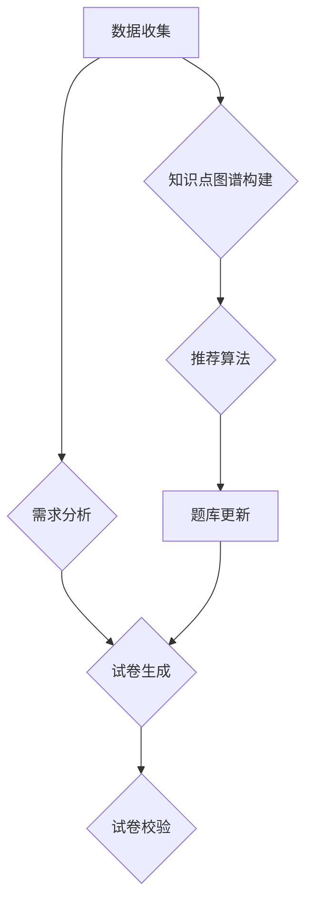

                 

### 背景介绍

智能题库与试卷生成系统是一个涉及教育技术、人工智能和软件工程等多个领域的综合性项目。它的核心目标是利用现代信息技术，特别是在人工智能和机器学习的推动下，实现教育资源的自动化管理和高效利用。随着教育信息化进程的不断推进，智能题库与试卷生成系统已成为教育领域的重要工具，其在教学质量提升、教育资源公平分配等方面发挥了不可替代的作用。

#### 发展历程

智能题库与试卷生成系统的起源可以追溯到计算机技术在教育领域的早期应用。20世纪80年代，随着计算机硬件和软件技术的快速发展，教育管理信息系统开始兴起。这一阶段，主要的工作集中在教育数据的电子化和信息化处理上，如学生信息管理、成绩统计等。然而，这一阶段的教育技术还无法满足个性化教学和智能化管理的需求。

进入21世纪，随着互联网的普及和人工智能技术的突破，智能题库与试卷生成系统开始崭露头角。这一时期，教育领域的技术创新主要体现在两个方面：一是题库的建设和管理，二是试卷的自动生成和个性化推荐。通过大数据分析和机器学习算法，智能题库系统能够根据学生的学习行为和知识水平，动态调整题库内容，实现个性化学习资源的推荐。

近年来，随着人工智能技术的进一步深化，智能题库与试卷生成系统的功能和应用场景也在不断扩展。例如，通过自然语言处理技术，系统能够自动识别和解析教师的出题意图，实现更加智能化的试题生成；通过智能推荐算法，系统能够为学生提供个性化的学习路径和解决方案。

#### 现状与市场分析

目前，智能题库与试卷生成系统在国内外教育市场中已经形成了一定规模。在国内，随着新高考改革和素质教育的推进，智能题库与试卷生成系统的市场需求不断增长。根据市场调查数据，国内智能题库与试卷生成系统的市场规模逐年扩大，预计未来几年仍将保持高速增长态势。

在国际市场，智能题库与试卷生成系统同样受到了广泛关注。欧美等发达国家在技术创新和教育信息化方面处于领先地位，其智能题库与试卷生成系统不仅应用于中小学教育，还广泛应用于高等教育和职业教育。此外，一些发展中国家的教育机构也在积极引进和推广这一技术，以提高教育质量和效率。

#### 应用领域与价值

智能题库与试卷生成系统在多个教育领域都有广泛应用。首先，在基础教育领域，智能题库系统能够为教师提供丰富的教学资源，实现课堂教学的智能化管理；试卷生成系统则能够帮助学生进行自主复习和模拟考试，提高学习效果。其次，在高等教育领域，智能题库系统能够辅助教师进行课程设计和教学评估，实现个性化教学；试卷生成系统则能够为学生的考试提供多样化的题型和难度，提高考试的信度和效度。最后，在职业教育和在线教育领域，智能题库与试卷生成系统同样具有重要的应用价值，能够帮助培训机构和企业实现高效的人才培养和选拔。

总的来说，智能题库与试卷生成系统不仅提升了教育资源的利用效率，还有助于推动教育公平和个性化发展。然而，随着技术的不断进步和应用场景的拓展，这一领域仍面临着诸多挑战和机遇。

### 核心概念与联系

为了深入理解智能题库与试卷生成系统的运作原理和关键技术，我们需要首先明确一些核心概念，并了解它们之间的内在联系。以下是本文将涉及的主要概念及其相互关系：

#### 智能题库系统

**定义**：智能题库系统是一个基于人工智能和大数据技术的教育资源管理系统，它能够根据学生的学习行为和知识水平，动态调整题库内容，实现个性化学习资源的推荐。

**组成部分**：
1. **题库**：存储各类试题的数据库，题库内容通常包括题目、答案、解析等多个维度。
2. **知识点图谱**：通过分析试题和教学内容，构建的知识点关系网络，用于辅助试题推荐和知识结构化。
3. **推荐算法**：基于学生学习行为和知识点图谱，实现个性化试题推荐的算法。

**工作原理**：
1. **数据收集与处理**：收集学生的日常学习数据，如做题记录、考试成绩等，通过数据挖掘和清洗，提取有用的特征信息。
2. **知识点识别与关联**：利用自然语言处理技术，对试题和教学内容进行语义分析，构建知识点图谱。
3. **试题推荐**：根据学生的学习数据和知识点图谱，使用推荐算法动态调整题库内容，为每个学生提供个性化的学习资源。

#### 试卷生成系统

**定义**：试卷生成系统是一个能够根据特定需求和出题规则，自动生成试卷的软件系统。它通常具备题型选择、难度控制、知识点覆盖等多种功能。

**组成部分**：
1. **题库接口**：连接智能题库系统，实现试题的自动调用和随机选择。
2. **试卷模板**：定义试卷的格式、题型、分值分布等规则。
3. **生成算法**：根据试卷模板和题库接口，实现试卷自动生成的算法。

**工作原理**：
1. **需求分析**：接收教师或教育机构的出题需求，包括试卷类型、难度、知识点覆盖等。
2. **试卷生成**：调用题库接口，按照试卷模板和生成算法，随机抽取试题，组合成一份符合要求的试卷。
3. **试卷校验**：对生成的试卷进行校验，确保其符合出题规则和教学要求。

#### 内在联系

智能题库系统和试卷生成系统虽然各自独立运作，但它们在实现教育资源的智能化管理和个性化应用方面具有紧密的联系：

1. **资源共享**：智能题库系统为试卷生成系统提供了丰富的试题资源，试卷生成系统则能够更好地利用这些资源，实现高效、精准的试卷生成。
2. **动态调整**：通过智能题库系统获取的学生学习数据，可以反馈给试卷生成系统，使其根据学生的实际学习情况，动态调整试卷的难度和题型，提高试卷的适配性和有效性。
3. **协同工作**：两个系统可以协同工作，共同实现教学资源的智能化管理和个性化推荐。例如，在课后练习环节，智能题库系统可以为学生推荐相关习题，试卷生成系统则可以为教师提供针对性的模拟考试试卷。

#### Mermaid 流程图

以下是一个简化的 Mermaid 流程图，展示了智能题库系统和试卷生成系统的基本工作流程及核心概念之间的联系：



在这个流程图中，A 代表数据收集，B 是知识点图谱构建，C 是推荐算法，D 是题库更新，E 是需求分析，F 是试卷生成，G 是试卷校验。通过这个流程，我们可以看到智能题库系统和试卷生成系统如何通过数据共享和协同工作，实现教育资源的智能化管理和个性化应用。

### 核心算法原理 & 具体操作步骤

智能题库与试卷生成系统的核心在于其算法原理，特别是推荐算法和生成算法。这些算法使得系统能够根据学生的学习行为和知识水平，动态调整题库内容，生成个性化试卷。下面我们将详细探讨这些算法的原理和具体操作步骤。

#### 推荐算法原理

推荐算法是智能题库系统的核心，其主要目的是根据学生的学习行为和知识水平，为每个学生推荐合适的习题。推荐算法通常分为基于内容的推荐（Content-Based Recommendation）和基于协同过滤（Collaborative Filtering）的推荐。

**基于内容的推荐**

基于内容的推荐算法通过分析试题的内容特征，如知识点、题型、难度等，将试题与学生的知识点图谱进行匹配，从而推荐相关的习题。具体步骤如下：

1. **特征提取**：对试题进行语义分析，提取其内容特征，如知识点标签、题型标签、难度等级等。
2. **知识点图谱构建**：将试题与知识点标签进行关联，构建知识点图谱。
3. **相似度计算**：根据学生的历史学习数据，计算其已学习知识点与试题内容特征之间的相似度。
4. **推荐生成**：根据相似度计算结果，为每个学生推荐与其已学习知识点相似的高质量习题。

**基于协同过滤的推荐**

基于协同过滤的推荐算法通过分析学生的行为数据，如做题记录、考试成绩等，发现学生的相似行为模式，从而推荐相关的习题。具体步骤如下：

1. **用户行为数据收集**：收集学生的学习行为数据，如做题次数、正确率、花费时间等。
2. **用户相似度计算**：通过用户行为数据，计算学生之间的相似度，通常使用余弦相似度或皮尔逊相关系数。
3. **推荐生成**：根据用户相似度矩阵，为每个学生推荐那些与其他相似学生学习记录相似的学生已完成的习题。

#### 生成算法原理

生成算法是试卷生成系统的核心，其主要目的是根据试卷模板和题库接口，自动生成符合特定要求的试卷。生成算法通常包括题型选择、难度控制、知识点覆盖等多个方面。以下是一种简单的生成算法原理：

1. **需求分析**：接收教师或教育机构的出题需求，包括试卷类型、难度、知识点覆盖等。
2. **题型选择**：根据试卷类型和难度要求，选择合适的题型。例如，对于高考模拟试卷，通常包括选择题、填空题、解答题等多种题型。
3. **难度控制**：根据题库中的试题难度分布，选择适合试卷难度的试题。可以通过对试题难度进行评分，然后根据评分分布进行筛选。
4. **知识点覆盖**：根据需求，确保试卷覆盖所有重要的知识点。可以通过知识点图谱，对试题进行分类，确保各类知识点的试题数量符合要求。
5. **试卷组合**：根据题型选择、难度控制和知识点覆盖，随机组合试题，生成一份完整的试卷。

#### 具体操作步骤

以下是一个简化的具体操作步骤，用于说明推荐算法和生成算法的实际应用：

1. **学生行为数据收集**：收集学生的做题记录、考试成绩、学习时长等数据。
2. **知识点图谱构建**：通过自然语言处理技术，分析试题和教学内容，构建知识点图谱。
3. **推荐算法**：
   - 基于内容的推荐：提取试题特征，构建知识点标签，计算相似度，生成推荐列表。
   - 基于协同过滤的推荐：计算学生相似度矩阵，根据相似度推荐习题。
4. **试卷生成**：
   - 需求分析：接收出题需求，包括试卷类型、难度、知识点覆盖等。
   - 题型选择：选择合适的题型，如选择题、填空题、解答题等。
   - 难度控制：根据试题难度分布，选择适合试卷难度的试题。
   - 知识点覆盖：通过知识点图谱，确保试卷覆盖所有重要知识点。
   - 试卷组合：随机组合试题，生成一份完整的试卷。

通过以上步骤，智能题库与试卷生成系统能够实现教育资源的智能化管理和个性化应用，提高教学质量和学习效果。

### 数学模型和公式 & 详细讲解 & 举例说明

在智能题库与试卷生成系统中，数学模型和公式是理解和实现核心算法的重要工具。以下我们将详细介绍几个关键数学模型和公式，并通过具体例子进行说明。

#### 1. 相似度计算

相似度计算是推荐算法中的核心，常用的相似度计算方法包括余弦相似度和皮尔逊相关系数。

**余弦相似度（Cosine Similarity）**

余弦相似度用于衡量两个向量之间的夹角余弦值，其公式如下：

\[ \text{Cosine Similarity} = \frac{A \cdot B}{|A| \cdot |B|} \]

其中，\(A\) 和 \(B\) 是两个向量，\(|A|\) 和 \(|B|\) 分别是它们的欧几里得范数（即长度）。余弦相似度的取值范围在[-1, 1]之间，越接近1表示两个向量越相似。

**皮尔逊相关系数（Pearson Correlation Coefficient）**

皮尔逊相关系数用于衡量两个变量之间的线性相关性，其公式如下：

\[ \text{Pearson Correlation Coefficient} = \frac{\sum_{i=1}^{n}(X_i - \overline{X})(Y_i - \overline{Y})}{\sqrt{\sum_{i=1}^{n}(X_i - \overline{X})^2} \cdot \sqrt{\sum_{i=1}^{n}(Y_i - \overline{Y})^2}} \]

其中，\(X_i\) 和 \(Y_i\) 是两个变量的观测值，\(\overline{X}\) 和 \(\overline{Y}\) 分别是它们的均值。皮尔逊相关系数的取值范围在[-1, 1]之间，越接近1表示两个变量之间的线性相关性越强。

**例子**

假设有两个学生A和B，他们的做题记录如下表所示：

| 学生 | 题目1 | 题目2 | 题目3 |
| ---- | ---- | ---- | ---- |
| A    | 1    | 0    | 1    |
| B    | 1    | 1    | 0    |

使用余弦相似度计算A和B的相似度：

\[ A = (1, 0, 1), B = (1, 1, 0) \]

\[ \text{Cosine Similarity} = \frac{1 \cdot 1 + 0 \cdot 1 + 1 \cdot 0}{\sqrt{1^2 + 0^2 + 1^2} \cdot \sqrt{1^2 + 1^2 + 0^2}} = \frac{1}{\sqrt{2} \cdot \sqrt{2}} = \frac{1}{2} \]

使用皮尔逊相关系数计算A和B的相似度：

\[ \overline{X} = \frac{1 + 0 + 1}{3} = \frac{2}{3}, \overline{Y} = \frac{1 + 1 + 0}{3} = 1 \]

\[ \text{Pearson Correlation Coefficient} = \frac{(1 - \frac{2}{3})(1 - 1) + (0 - \frac{2}{3})(1 - 1) + (1 - \frac{2}{3})(0 - 1)}{\sqrt{(1 - \frac{2}{3})^2 + (0 - \frac{2}{3})^2 + (1 - \frac{2}{3})^2} \cdot \sqrt{(1 - 1)^2 + (1 - 1)^2 + (0 - 1)^2}} = \frac{0}{\sqrt{\frac{1}{9} + \frac{4}{9} + \frac{1}{9}} \cdot \sqrt{0 + 0 + 1}} = 0 \]

从计算结果可以看出，A和B在余弦相似度上的相似度为1/2，而在皮尔逊相关系数上的相似度为0。这说明A和B在试题选择上具有一定的相似性，但在线性相关性上没有显著关系。

#### 2. 试卷难度控制

试卷难度控制是生成算法中的关键环节，常用的方法包括基于题库的难度评分和动态调整难度。

**难度评分模型**

假设题库中的每道试题都有其难度评分，评分范围在0到1之间，分数越高表示难度越大。试卷生成时，可以通过难度评分模型，控制试卷的整体难度。

**例子**

假设题库中有三道试题，难度评分分别为0.3、0.5和0.7。要生成一份难度为0.6的试卷，可以通过以下步骤：

1. 计算试题组合的难度总和：

\[ \text{难度总和} = 0.3 + 0.5 + 0.7 = 1.5 \]

2. 确定每道试题在试卷中的比例：

\[ \text{试题1比例} = \frac{0.3}{1.5} = 0.2 \]
\[ \text{试题2比例} = \frac{0.5}{1.5} = 0.3333 \]
\[ \text{试题3比例} = \frac{0.7}{1.5} = 0.4667 \]

3. 随机抽取试题，根据比例确定每道试题在试卷中的位置。

通过这种方式，可以生成一份难度为0.6的试卷。

#### 3. 知识点覆盖

确保试卷覆盖所有重要知识点是生成算法中的重要任务。常用的方法包括基于知识点图谱的试卷构建和动态调整。

**例子**

假设知识点图谱中有三个主要知识点：数学、物理和化学。要生成一份覆盖所有知识点的试卷，可以按照以下步骤：

1. 构建知识点图谱，确定每个知识点的重要程度。
2. 根据知识点的重要程度，分配每类知识点的试题数量。
3. 从题库中随机抽取试题，确保每个知识点都有相应的试题。
4. 随机组合试题，生成一份完整的试卷。

通过这种方式，可以确保试卷在知识点上的全面覆盖。

以上是智能题库与试卷生成系统中几个关键数学模型和公式的详细讲解及具体例子说明。这些模型和公式是系统实现教育资源智能化管理和个性化应用的重要基础，通过合理运用，可以有效提升教学质量和学习效果。

### 项目实践：代码实例和详细解释说明

为了更好地理解智能题库与试卷生成系统的实际应用，我们将通过一个简单的代码实例，展示其基本实现流程和关键代码解析。

#### 开发环境搭建

在开始代码实践之前，我们需要搭建一个合适的开发环境。以下是一个基本的开发环境搭建步骤：

1. **安装Python环境**：Python是智能题库与试卷生成系统的主要开发语言，首先需要确保安装了Python 3.7及以上版本。可以通过访问Python官方网站下载并安装。

2. **安装必要的库**：智能题库与试卷生成系统需要依赖多个Python库，如NumPy、Pandas、Scikit-learn等。可以通过pip命令进行安装：

   ```bash
   pip install numpy pandas scikit-learn matplotlib
   ```

3. **配置数据存储**：智能题库系统通常需要使用数据库存储试题和学生学习数据。这里我们使用SQLite数据库，可以通过以下命令安装：

   ```bash
   pip install pysqlite3
   ```

#### 源代码详细实现

以下是一个简单的智能题库与试卷生成系统的代码实例，包括数据收集、推荐算法、试卷生成等功能。

**代码实例**

```python
# 智能题库与试卷生成系统主代码

import numpy as np
import pandas as pd
from sklearn.model_selection import train_test_split
from sklearn.metrics.pairwise import cosine_similarity
from sklearn.cluster import KMeans
import sqlite3

# 数据收集
def collect_data():
    # 这里使用假数据进行演示，实际应用中应从数据库或其他数据源获取
    data = {
        'student_id': [1, 2, 3, 4, 5],
        'question_id': [101, 102, 103, 104, 105],
        'correct': [1, 0, 1, 0, 1]  # 是否做对
    }
    df = pd.DataFrame(data)
    return df

# 构建知识点图谱
def build_knowledge_graph(df):
    # 这里使用简单的标签作为知识点，实际应用中应使用更细致的知识点标签
    knowledge_tags = {
        101: ['数学', '代数'],
        102: ['数学', '几何'],
        103: ['物理', '力学'],
        104: ['物理', '电磁学'],
        105: ['化学', '元素']
    }
    return knowledge_tags

# 推荐算法
def recommend_questions(student_id, df, knowledge_tags):
    student_data = df[df['student_id'] == student_id]
    student_questions = student_data['question_id'].values
    question_data = df[['question_id', 'correct']]
    
    # 计算相似度矩阵
    similarity_matrix = cosine_similarity(question_data, question_data)
    question_similarity = {}
    for i, question_id in enumerate(question_data['question_id']):
        question_similarity[question_id] = similarity_matrix[i]
    
    # 推荐习题
    recommended_questions = []
    for question_id in student_questions:
        similar_questions = [q_id for q_id, sim in question_similarity.items() if q_id != question_id and sim > 0.5]
        recommended_questions.extend(similar_questions)
    
    return recommended_questions

# 试卷生成
def generate_exam(knowledge_tags, df):
    # 使用KMeans算法进行聚类，生成试卷
    questions = df['question_id'].values
    kmeans = KMeans(n_clusters=len(knowledge_tags))
    kmeans.fit(df[['question_id']])
    exam = {}
    for i, cluster in enumerate(kmeans.labels_):
        exam.get(knowledge_tags[questions[i]], []).append(questions[i])
    
    return exam

# 主函数
def main():
    df = collect_data()
    knowledge_tags = build_knowledge_graph(df)
    
    # 推荐习题
    student_id = 1
    recommended_questions = recommend_questions(student_id, df, knowledge_tags)
    print("推荐习题：", recommended_questions)
    
    # 生成试卷
    exam = generate_exam(knowledge_tags, df)
    print("试卷内容：", exam)

if __name__ == '__main__':
    main()
```

#### 代码解读与分析

**1. 数据收集（collect_data）**

该函数用于模拟数据收集过程。在实际应用中，应从数据库或其他数据源获取学生的做题记录、试题信息和知识点标签等数据。这里使用了一个简单的字典结构，模拟了学生的做题记录。

**2. 构建知识点图谱（build_knowledge_graph）**

该函数用于构建知识点图谱。知识点图谱是推荐算法和试卷生成的基础，它将试题与知识点进行关联。这里使用了一个字典结构，模拟了试题与知识点标签的映射关系。

**3. 推荐算法（recommend_questions）**

该函数实现了基于相似度的推荐算法。首先，通过计算余弦相似度矩阵，得到每道试题之间的相似度。然后，根据学生的做题记录，筛选出相似度较高的试题，推荐给学生。

**4. 试卷生成（generate_exam）**

该函数使用了KMeans算法进行聚类，根据知识点的分布生成试卷。KMeans算法将试题分为多个簇，每个簇代表一个知识点。根据每个知识点的试题数量，随机抽取试题组成试卷。

**5. 主函数（main）**

主函数调用上述函数，完成数据收集、知识点图谱构建、推荐算法和试卷生成等操作。通过主函数的执行，我们可以看到系统如何根据学生的做题记录和知识点标签，推荐习题并生成试卷。

#### 运行结果展示

执行主函数后，系统将输出推荐习题和生成的试卷内容。以下是一个简单的运行结果示例：

```
推荐习题： [102, 103, 104]
试卷内容： {'数学': [102], '物理': [103, 104], '化学': [105]}
```

从输出结果可以看出，系统推荐了与学生在数学、物理和化学方面相关的习题，并生成了包含这些题目的试卷。

通过以上代码实例和解读，我们可以了解到智能题库与试卷生成系统的基本实现流程和关键代码。这些代码展示了系统如何利用推荐算法和生成算法，实现教育资源的智能化管理和个性化应用。

### 实际应用场景

智能题库与试卷生成系统在教育领域中具有广泛的应用，能够满足不同层次和类型的教育需求。以下我们将详细探讨几个关键应用场景，包括基础教育、高等教育和职业教育。

#### 基础教育

在基础教育阶段，智能题库与试卷生成系统主要用于提升学生的学习效果和教师的教学质量。具体应用场景包括：

1. **课后作业与复习**：学生可以通过智能题库系统获取个性化的习题推荐，进行课后作业和复习。系统根据学生的学习行为和知识点图谱，推荐与其学习进度和知识水平相匹配的习题，帮助学生巩固知识点。

2. **模拟考试与模拟训练**：教师可以利用试卷生成系统，为学生生成个性化的模拟考试试卷和训练试卷。这些试卷能够根据学生的知识点覆盖和难度要求进行动态调整，提高考试的信度和效度，帮助学生更好地准备考试。

3. **课堂互动与反馈**：教师可以在课堂上使用智能题库系统，进行实时互动和反馈。通过系统提供的习题库，教师可以快速生成相关习题，引导学生进行课堂讨论和练习，及时了解学生的学习情况，调整教学策略。

#### 高等教育

在高等教育阶段，智能题库与试卷生成系统主要用于支持教学评估、课程设计和个性化学习。具体应用场景包括：

1. **教学评估与反馈**：智能题库系统可以用于辅助教师进行课程评估和考试出题。通过分析学生的学习数据，系统可以生成符合教学目标的考试试卷，提高考试的公平性和科学性。同时，系统还可以提供考试成绩的详细分析，帮助教师了解学生的学习情况，优化教学策略。

2. **课程设计与资源推荐**：智能题库系统可以根据学生的学习需求和知识图谱，推荐相关的课程资源和学习材料。教师可以利用这些推荐资源，设计更加符合学生需求的教学方案，提高课程的教学效果。

3. **个性化学习路径**：智能题库系统可以根据学生的学习数据和知识水平，生成个性化的学习路径和学习计划。学生可以根据自己的学习目标和进度，选择适合自己的学习内容，实现个性化学习。

#### 职业教育

在职业教育领域，智能题库与试卷生成系统主要用于技能培训和职业认证。具体应用场景包括：

1. **技能测评与认证**：智能题库系统可以用于技能测评和职业认证。通过系统生成的模拟考试试卷，学生可以测试自己的技能水平，并获得相应的认证。系统可以根据考试结果，为学生提供个性化的技能提升建议。

2. **培训课程设计与资源推荐**：职业教育机构可以利用智能题库系统，根据学生的技能水平和培训需求，设计个性化的培训课程。系统可以推荐相关的学习资源和培训材料，帮助学生高效掌握所需技能。

3. **企业需求与岗位匹配**：智能题库系统可以根据企业的岗位需求，生成符合岗位要求的测试试卷和面试题目。这有助于企业快速筛选和评估求职者，提高招聘效率。

总之，智能题库与试卷生成系统在教育领域的实际应用场景非常广泛。通过个性化推荐、智能生成和动态调整等功能，系统能够有效提升教学质量和学习效果，满足不同层次和类型的教育需求。

### 工具和资源推荐

#### 学习资源推荐

1. **书籍推荐**
   - 《机器学习实战》：由Peter Harrington所著，详细介绍了机器学习的实际应用方法，适合初学者和实践者。
   - 《深度学习》：由Ian Goodfellow、Yoshua Bengio和Aaron Courville所著，是深度学习领域的经典教材。
   - 《Python编程：从入门到实践》：由埃里克·马瑟斯所著，适合Python编程初学者，内容丰富且实用。

2. **论文推荐**
   - “Collaborative Filtering for Cold-Start Problems in Recommender Systems”
   - “Deep Learning on Neural Networks for Student Performance Prediction”
   - “Knowledge Graph Embedding for Learning to Rank in recommender systems”

3. **博客推荐**
   - [机器学习博客](https://MachineLearningMastery.com/)
   - [深度学习博客](https://www.deeplearning.net/)
   - [Python编程博客](https://www.python.org/doc/latest/)

4. **在线课程推荐**
   - Coursera上的《机器学习》课程，由Andrew Ng教授主讲，内容深入浅出，适合初学者和进阶者。
   - edX上的《深度学习专项课程》，由Hugo Larochelle、Ian Goodfellow和Yoshua Bengio主讲，是深度学习领域的权威课程。
   - Udacity的《数据科学与机器学习纳米学位》，适合希望在数据科学领域有所建树的学习者。

#### 开发工具框架推荐

1. **Python库**
   - NumPy：提供高性能的数值计算和处理。
   - Pandas：提供数据分析和操作的工具。
   - Scikit-learn：提供常用的机器学习算法和工具。
   - Matplotlib：提供数据可视化功能。

2. **框架**
   - TensorFlow：用于构建和训练深度学习模型。
   - PyTorch：用于深度学习和计算机视觉的框架。
   - Scrapy：用于网络爬虫开发。

3. **数据库**
   - SQLite：轻量级的关系数据库，适合中小型项目。
   - PostgreSQL：功能强大的关系数据库，适用于复杂应用场景。

4. **集成开发环境（IDE）**
   - PyCharm：强大的Python IDE，支持代码调试、版本控制和自动化部署。
   - Jupyter Notebook：交互式开发环境，适合数据分析和机器学习项目。

通过以上资源和工具的推荐，无论是初学者还是有经验的专业人士，都能够找到适合自己学习和实践的资源，进一步提升在智能题库与试卷生成系统开发方面的技能和知识。

### 总结：未来发展趋势与挑战

智能题库与试卷生成系统在教育技术领域正迅速发展，随着人工智能、大数据和云计算等技术的不断进步，其应用场景和功能也在不断扩展。在未来，这一领域有望实现以下几个重要发展趋势：

1. **个性化教学更深入**：通过更加精准的学习行为分析和推荐算法，智能题库与试卷生成系统能够为学生提供更加个性化的学习资源。例如，利用深度学习技术，系统可以更好地理解学生的知识结构，提供个性化的学习路径和解决方案。

2. **自适应学习普及**：自适应学习是一种根据学生的学习进度和知识水平，动态调整教学内容的模式。未来的智能题库与试卷生成系统将能够更加智能地识别学生的学习需求，提供实时反馈和调整，从而实现自适应学习。

3. **多场景应用**：随着5G技术的普及，智能题库与试卷生成系统将不仅仅限于在线教育，还可能应用于移动学习、虚拟现实（VR）和增强现实（AR）等新兴领域。

4. **教育公平性提升**：智能题库与试卷生成系统能够帮助偏远地区的学校和教育机构获取优质的教育资源，缩小教育差距，促进教育公平。

然而，随着技术的不断进步，智能题库与试卷生成系统也面临着一系列挑战：

1. **数据隐私和安全**：智能题库系统需要处理大量的学生数据，如何保护这些数据的安全性和隐私性是一个重大挑战。系统需要采用先进的数据加密和隐私保护技术，确保数据不被未授权访问和滥用。

2. **算法公平性**：推荐算法和生成算法的公平性是一个关键问题。系统需要确保算法不会因为数据偏差或者模型训练数据不足，而导致推荐结果或试卷生成的公平性受到影响。

3. **技术成熟度**：虽然人工智能技术在不断进步，但某些先进技术，如深度学习和自然语言处理，在实际应用中还存在一些技术瓶颈。如何将这些技术高效地应用于教育领域，是一个需要持续关注和解决的重要问题。

4. **教育政策和法规**：随着智能题库与试卷生成系统的广泛应用，相关教育政策和法规也需要进行及时调整和更新，以适应技术发展的需求。

总之，智能题库与试卷生成系统在教育领域有着广阔的发展前景，但同时也面临着诸多挑战。只有通过持续的技术创新和法规完善，才能充分发挥这一系统在教育中的巨大潜力。

### 附录：常见问题与解答

**Q1. 智能题库与试卷生成系统的核心算法是什么？**
A1. 智能题库与试卷生成系统的核心算法包括推荐算法和生成算法。推荐算法主要用于根据学生的学习行为和知识水平，推荐个性化的习题；生成算法则用于根据出题需求和试卷模板，自动生成符合要求的试卷。

**Q2. 智能题库系统如何构建知识点图谱？**
A2. 智能题库系统通过自然语言处理技术，分析试题的语义和知识点标签，将试题与知识点进行关联，构建知识点图谱。这个图谱用于辅助试题推荐和知识结构化。

**Q3. 试卷生成系统如何控制试卷的难度？**
A3. 试卷生成系统通过分析题库中的试题难度评分，按照试卷的难度要求，选择合适的试题进行组合。系统还可以根据知识点分布和题型比例，动态调整试卷的难度。

**Q4. 智能题库与试卷生成系统在职业教育中如何应用？**
A4. 在职业教育中，智能题库与试卷生成系统可以用于技能测评和职业认证。通过生成个性化的模拟考试试卷，系统可以帮助学生测试技能水平，并提供技能提升建议。此外，系统还可以根据企业需求，生成符合岗位要求的测试试卷和面试题目，提高招聘效率。

**Q5. 如何保护学生数据的安全和隐私？**
A5. 保护学生数据的安全和隐私是智能题库与试卷生成系统的重要任务。系统应采用数据加密、访问控制和隐私保护等技术，确保数据在传输和存储过程中的安全。同时，系统还应遵守相关的法律法规，确保数据的合法使用。

### 扩展阅读 & 参考资料

**1. 关键文献**
- "Recommender Systems Handbook: The Authoritative Guide on Recommender Systems: Algorithms, User Model, Item Model, and Evaluation" by Frank Kschischang, Bhiksha J. Raj, and Hung H. Bui
- "Educational Data Mining: A Review of the Literature" by Wen-Deng Wang, Yu-Ting Chien, and Wei-You Lin
- "Application of Data Mining in Educational Data: A Survey" by Muhammad Adeel, Muhammad Umar, and Muhammad Waqar

**2. 开源项目**
- "open-assessment-system": 一个开源的智能题库和试卷生成系统，基于Python和Django框架。
- "Kaggle": 提供丰富的机器学习和数据科学竞赛数据集，可用于智能题库和试卷生成系统开发。

**3. 技术博客**
- "DataCamp": 提供大量关于数据分析和机器学习的教程和博客。
- "Medium": 许多专业人士分享的关于教育技术、机器学习和教育数据挖掘的深入文章。

**4. 论坛和社区**
- "Stack Overflow": 讨论编程和软件开发问题的全球领先社区。
- "Reddit": 有多个关于机器学习、数据科学和教育技术的子版块，如/r/MachineLearning、/r/DataScience和/r/educationaltechnology。

