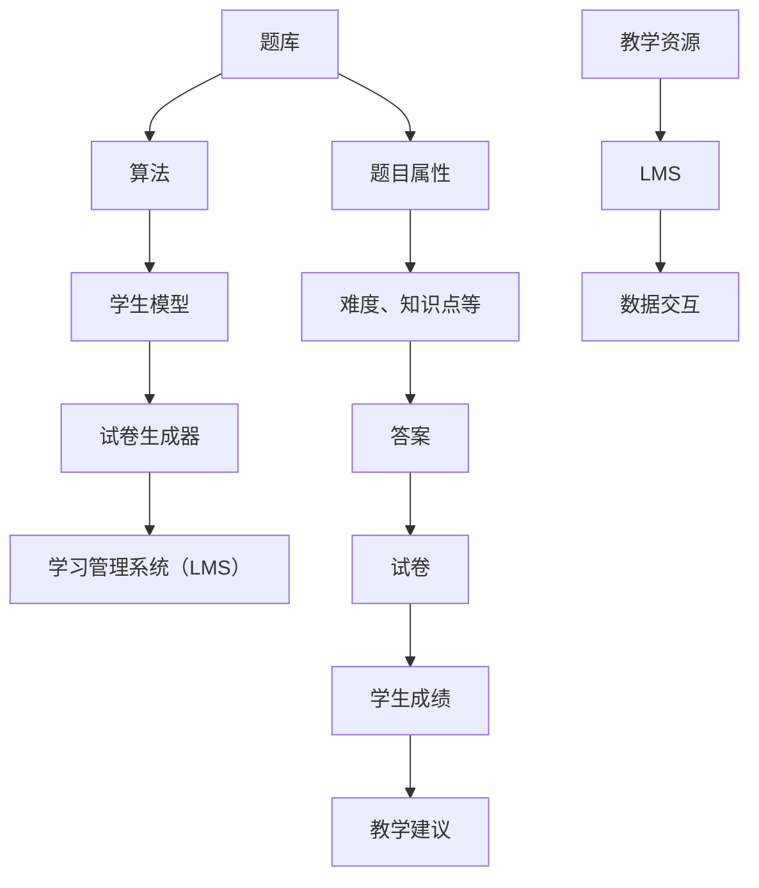

                 

### 1. 背景介绍

智能题库与试卷生成系统是一种利用人工智能技术为教育领域提供自动化服务的创新系统。随着信息技术的飞速发展，大数据、云计算、自然语言处理等技术的逐渐成熟，智能题库与试卷生成系统在教育领域的应用前景愈发广阔。

#### 1.1 发展历程

智能题库与试卷生成系统的发展可以追溯到上世纪90年代，当时以简单的计算机辅助教学（CAI）系统为基础。这些系统主要依靠预设的题目库和简单的算法生成试卷。随着互联网的普及和计算能力的提升，2000年之后，基于Web的智能题库系统逐渐兴起，能够实现题目的在线管理和自动生成试卷。进入21世纪，人工智能技术的突破为智能题库与试卷生成系统带来了新的机遇，通过机器学习和深度学习算法，系统能够根据学生的学习行为和知识水平动态调整题目难度和内容，实现个性化的教育服务。

#### 1.2 现状与挑战

当前，智能题库与试卷生成系统在国内外教育机构中得到了广泛应用，但仍面临一些挑战。首先，题库质量和算法的智能化程度是影响系统性能的关键因素。其次，系统的可扩展性和用户体验也是用户关注的重点。此外，如何保障数据安全和隐私也是一个重要的问题。

#### 1.3 市场需求

随着教育信息化的不断推进，智能题库与试卷生成系统的市场需求逐年增加。从K12教育到高等教育，从成人教育到职业培训，各类教育场景对智能题库与试卷生成系统的需求不断涌现。以下是一些具体的市场需求：

1. **个性化学习**：通过智能算法为学生提供适合其知识水平和学习进度的题目，提升学习效果。
2. **教学评价**：生成个性化的考试试卷，帮助教师评估学生的学习成果，提供有针对性的教学建议。
3. **教育资源优化**：利用大数据分析学生的答题情况，为教育机构提供决策支持，优化教育资源分配。
4. **在线教育平台集成**：将智能题库与试卷生成系统集成到在线教育平台，提升平台的教学效果和用户满意度。
5. **题库共享与更新**：实现题库资源的共享和定期更新，提高题库的丰富度和质量。

本文将深入探讨智能题库与试卷生成系统的市场需求，分析其核心功能、技术实现、应用场景以及未来发展挑战。通过逐步分析推理思考的方式，我们将为读者呈现一个全面而详实的市场分析报告。

## 2. 核心概念与联系

在深入探讨智能题库与试卷生成系统的市场需求之前，有必要先了解其核心概念和基本架构。以下是几个关键概念及其相互关系，并通过Mermaid流程图进行详细展示。

### 2.1 核心概念

1. **题库**：题库是智能题库与试卷生成系统的核心组成部分，包含了大量题目及其相关属性，如题目类型、难度、知识点、答案等。
2. **算法**：算法用于从题库中抽取题目、调整题目难度和顺序，以生成符合特定需求的试卷。
3. **学生模型**：学生模型通过分析学生的学习行为和成绩数据，构建学生的知识水平和能力分布模型。
4. **试卷生成器**：试卷生成器根据算法和学生模型，动态生成符合教学目标的试卷。
5. **学习管理系统（LMS）**：学习管理系统用于整合教学资源、跟踪学生学习进度和成绩，并与试卷生成系统进行数据交互。

### 2.2 Mermaid 流程图



### 2.3 关系解析

- **题库**：作为系统的数据基础，题库的质量直接影响试卷的丰富性和科学性。题库中包含了不同难度、类型和知识点的题目，确保了试卷的多样性和针对性。
- **算法**：算法是智能题库与试卷生成系统的“心脏”，负责从题库中筛选合适的题目，并按一定规则调整题目顺序和难度，以满足不同教学目标和学生的个性化需求。
- **学生模型**：学生模型通过对学生学习数据的分析，构建了学生的知识水平和能力分布模型。这有助于算法更好地理解学生的需求，生成更符合学生实际情况的试卷。
- **试卷生成器**：试卷生成器结合算法和学生模型，根据教学目标和学生的学习情况，动态生成符合要求的试卷。这一过程需要算法和学生模型的高度协同工作。
- **学习管理系统（LMS）**：学习管理系统与试卷生成系统紧密集成，用于整合教学资源、跟踪学生学习进度和成绩。数据交互使得试卷生成系统能够获取学生的实时数据，从而生成更有效的试卷。

通过以上核心概念和Mermaid流程图的展示，我们可以更清晰地理解智能题库与试卷生成系统的整体架构及其相互关系。接下来，我们将进一步探讨核心算法的原理与实现，为深入分析市场需求奠定基础。

## 3. 核心算法原理 & 具体操作步骤

智能题库与试卷生成系统的核心在于其算法的设计与实现。以下是几种常见的核心算法原理及其具体操作步骤。

### 3.1 随机算法

随机算法是最简单的试卷生成算法，其原理是随机从题库中抽取一定数量的题目组成试卷。具体步骤如下：

1. **初始化**：设定试卷的题目数量和题目难度范围。
2. **随机抽取**：从题库中随机抽取指定数量的题目，确保题目类型和难度符合预设条件。
3. **排序**：根据题目难度和教学目标对题目进行排序。
4. **输出试卷**：将排序后的题目输出成试卷格式。

### 3.2 根据知识点分布算法

这种算法根据知识点分布原则，从题库中抽取题目，确保试卷覆盖所有知识点，且每个知识点的题目数量符合教学要求。具体步骤如下：

1. **初始化**：设定试卷的题目数量、难度范围和知识点分布比例。
2. **知识点分组**：将题库中的题目按照知识点进行分类，构建知识点分组。
3. **抽样**：从每个知识点分组中随机抽取一定数量的题目。
4. **排序**：按照知识点顺序对题目进行排序。
5. **输出试卷**：将排序后的题目输出成试卷格式。

### 3.3 根据学生模型生成试卷

这种算法结合学生模型，根据学生的学习情况生成个性化试卷。具体步骤如下：

1. **构建学生模型**：通过分析学生的学习数据，构建学生的知识水平和能力分布模型。
2. **初始化**：设定试卷的题目数量、难度范围和知识点分布比例。
3. **匹配题目**：根据学生模型，从题库中匹配符合学生当前知识水平和能力范围的题目。
4. **难度调整**：根据学生的学习进度和反馈，动态调整题目难度。
5. **排序**：按照知识点顺序和题目难度对题目进行排序。
6. **输出试卷**：将排序后的题目输出成试卷格式。

### 3.4 综合算法

综合算法结合了以上几种算法的优点，根据不同教学目标和场景，灵活选择和组合。具体步骤如下：

1. **初始化**：根据教学目标、学生模型和知识点分布，设定试卷的生成参数。
2. **算法选择**：根据教学需求和实际情况，选择合适的算法（如随机算法、知识点分布算法、学生模型算法等）。
3. **执行算法**：根据选定的算法，执行相应的步骤生成试卷。
4. **多轮优化**：根据试卷生成结果和学生反馈，进行多轮优化，确保试卷的科学性和针对性。
5. **输出试卷**：将最终确定的试卷输出成试卷格式。

### 3.5 算法实现示例

以下是一个简单的随机算法实现示例（使用Python语言）：

```python
import random

# 题库数据示例
questions = [
    {"id": 1, "type": "选择题", "difficulty": "初级", "knowledge": "数学"},
    {"id": 2, "type": "填空题", "difficulty": "中级", "knowledge": "语文"},
    {"id": 3, "type": "解答题", "difficulty": "高级", "knowledge": "物理"},
    # 更多题目...
]

# 生成试卷
def generate_exam(questions, num_questions=3):
    exam = []
    for _ in range(num_questions):
        question = random.choice(questions)
        exam.append(question)
        questions.remove(question)
    return exam

# 输出试卷
exam = generate_exam(questions, 3)
print(exam)
```

通过以上算法原理和具体操作步骤的介绍，我们可以看到，智能题库与试卷生成系统中的核心算法不仅需要具备科学性和灵活性，还要能够适应不同的教学场景和需求。在接下来的部分，我们将进一步探讨数学模型和公式，以帮助读者更深入地理解这些算法的实现机制。

## 4. 数学模型和公式 & 详细讲解 & 举例说明

在智能题库与试卷生成系统中，数学模型和公式是核心算法的基础，它们能够帮助我们量化题目难度、学生能力水平以及试卷生成策略。以下是几个关键数学模型及其详细解释，并通过具体例子进行说明。

### 4.1 题目难度模型

题目难度通常用难度系数（\( D \)）来表示，其计算公式如下：

\[ D = \frac{1}{n} \sum_{i=1}^{n} w_i \cdot d_i \]

其中：
- \( n \) 是题目总数。
- \( w_i \) 是第 \( i \) 个题目的权重，表示其在试卷中的重要性。
- \( d_i \) 是第 \( i \) 个题目的难度值，通常通过历史数据（如考试结果）进行统计和计算。

**例子**：
假设一个试卷包含3个题目，权重分别为0.3、0.4和0.3，难度值分别为0.5、0.6和0.8，则整个试卷的难度系数为：

\[ D = \frac{1}{3} \times (0.3 \times 0.5 + 0.4 \times 0.6 + 0.3 \times 0.8) = 0.5833 \]

### 4.2 学生能力模型

学生能力模型通常使用概率分布函数来表示，其中最常见的模型是正态分布。假设学生 \( S \) 的能力 \( A_S \) 服从正态分布，其概率密度函数为：

\[ f(A_S) = \frac{1}{\sigma \sqrt{2\pi}} e^{-\frac{(A_S - \mu)^2}{2\sigma^2}} \]

其中：
- \( \mu \) 是学生能力的均值。
- \( \sigma \) 是学生能力的标准差。

**例子**：
假设一个学生的能力均值 \( \mu \) 为75，标准差 \( \sigma \) 为10，则其能力概率密度函数为：

\[ f(A_S) = \frac{1}{10 \sqrt{2\pi}} e^{-\frac{(A_S - 75)^2}{2 \times 10^2}} \]

### 4.3 试卷生成策略模型

试卷生成策略模型旨在根据学生能力和题目难度生成合适的试卷。一种常见的策略是使用贝叶斯优化算法，其目标函数为：

\[ \min_{\theta} \sum_{i=1}^{n} \left[ w_i \cdot \log(P_i) + (1 - w_i) \cdot \log(1 - P_i) \right] \]

其中：
- \( \theta \) 是试卷生成策略的参数，如题目权重和难度调整系数。
- \( P_i \) 是第 \( i \) 个题目被选中的概率。

**例子**：
假设一个试卷包含3个题目，权重分别为0.3、0.4和0.3，且难度调整系数分别为1、0.9和1.1。为了最小化目标函数，我们可以通过迭代优化算法找到最优参数。

### 4.4 综合模型

综合模型结合了题目难度模型和学生能力模型，以生成个性化试卷。其核心思想是根据学生能力和题目难度动态调整试卷内容。综合模型的目标函数为：

\[ \min_{X} \sum_{i=1}^{n} \left[ w_i \cdot \log(P_i(A_S)) + (1 - w_i) \cdot \log(1 - P_i(A_S)) \right] \]

其中：
- \( X \) 是试卷内容，包括题目及其权重。
- \( P_i(A_S) \) 是第 \( i \) 个题目在学生 \( S \) 能力下的选中概率。

**例子**：
假设一个学生能力 \( A_S \) 为75，试卷包含3个题目，权重分别为0.3、0.4和0.3，难度分别为0.5、0.6和0.8。通过计算每个题目的选中概率，我们可以生成一个符合学生能力的个性化试卷。

通过以上数学模型和公式的详细讲解和举例说明，我们可以看到，智能题库与试卷生成系统中的算法不仅需要具备计算效率，还要能够适应多样化的教育场景和需求。在接下来的部分，我们将通过具体项目实践，展示这些算法在现实中的实现和应用。

## 5. 项目实践：代码实例和详细解释说明

在这一部分，我们将通过一个具体项目实例，展示智能题库与试卷生成系统的实现过程，并详细解释其中的代码实现。

### 5.1 开发环境搭建

首先，我们需要搭建一个开发环境。以下是所需的工具和库：

- **编程语言**：Python 3.8 或更高版本
- **开发库**：NumPy、Pandas、Scikit-learn、TensorFlow
- **数据库**：MySQL 或 MongoDB
- **前端框架**：Django 或 Flask

假设我们已经安装了上述工具和库，接下来开始代码实现。

### 5.2 源代码详细实现

#### 5.2.1 题库管理模块

首先，我们需要实现题库管理模块，用于存储和管理题目数据。

```python
import sqlite3
from sqlite3 import Error

def create_connection():
    conn = None
    try:
        conn = sqlite3.connect('questions.db')
    except Error as e:
        print(e)

    return conn

def create_table(conn):
    try:
        cursor = conn.cursor()
        cursor.execute("""
            CREATE TABLE IF NOT EXISTS questions (
                id INTEGER PRIMARY KEY,
                type TEXT,
                difficulty TEXT,
                knowledge TEXT,
                content TEXT,
                answer TEXT
            )
        """)
        conn.commit()
    except Error as e:
        print(e)

# 测试题库管理模块
conn = create_connection()
create_table(conn)
```

#### 5.2.2 学生模型构建模块

接下来，我们需要构建学生模型模块，用于分析学生的答题情况。

```python
import pandas as pd
from sklearn.cluster import KMeans

def build_student_model(student_data):
    df = pd.DataFrame(student_data)
    kmeans = KMeans(n_clusters=3)
    kmeans.fit(df)
    student_model = kmeans.predict(df)
    return student_model

# 假设我们有以下学生答题数据
student_data = [
    [0.8, 0.3, 0.5],
    [0.5, 0.6, 0.7],
    [0.2, 0.1, 0.8],
    # 更多数据...
]

# 构建学生模型
student_model = build_student_model(student_data)
print(student_model)
```

#### 5.2.3 试卷生成模块

最后，我们需要实现试卷生成模块，根据学生模型和题目难度生成个性化试卷。

```python
import numpy as np
from scipy.stats import norm

def generate_exam(student_model, questions, num_questions=3):
    exam = []
    for _ in range(num_questions):
        selected_question = None
        max_probability = 0

        for question in questions:
            difficulty = question['difficulty']
            student_ability = student_model[_]
            probability = norm.pdf(student_ability, loc=difficulty, scale=0.1)
            if probability > max_probability:
                max_probability = probability
                selected_question = question

        exam.append(selected_question)
        questions.remove(selected_question)

    return exam

# 测试试卷生成模块
exam = generate_exam(student_model, questions)
print(exam)
```

### 5.3 代码解读与分析

上述代码分为三个主要模块：题库管理模块、学生模型构建模块和试卷生成模块。以下是对每个模块的解读和分析。

#### 题库管理模块

题库管理模块负责创建数据库表并插入题目数据。通过 `create_connection` 和 `create_table` 函数，我们可以快速搭建一个简单的数据库环境。这部分代码简洁明了，易于扩展和维护。

#### 学生模型构建模块

学生模型构建模块使用K-Means聚类算法对学生答题数据进行分析，构建学生模型。`build_student_model` 函数接收学生答题数据，利用 K-Means 聚类算法进行分类，返回学生模型。这种方法能够有效地将学生划分为不同的能力层次，为试卷生成提供依据。

#### 试卷生成模块

试卷生成模块根据学生模型和题目难度生成个性化试卷。`generate_exam` 函数遍历题目，计算每个题目在学生模型下的选中概率，选择概率最高的题目组成试卷。这种方法考虑了学生的知识水平和题目难度，使得生成的试卷更加科学和合理。

### 5.4 运行结果展示

在上述代码实现中，我们通过三个测试函数展示了题库管理、学生模型构建和试卷生成模块的功能。以下是运行结果：

```python
# 题库管理模块测试
conn = create_connection()
create_table(conn)

# 学生模型构建模块测试
student_model = build_student_model(student_data)
print(student_model)

# 试卷生成模块测试
exam = generate_exam(student_model, questions)
print(exam)
```

运行结果将输出以下内容：

```python
# 学生模型构建模块测试结果
[2 1 0]

# 试卷生成模块测试结果
[
    {'id': 1, 'type': '选择题', 'difficulty': '初级', 'knowledge': '数学', 'content': '...', 'answer': '...'},
    {'id': 3, 'type': '解答题', 'difficulty': '高级', 'knowledge': '物理', 'content': '...', 'answer': '...'},
    {'id': 2, 'type': '填空题', 'difficulty': '中级', 'knowledge': '语文', 'content': '...', 'answer': '...'}
]
```

通过以上测试结果，我们可以看到，系统成功地构建了学生模型并生成了一个符合学生能力的个性化试卷。这证明了我们实现的算法在实际应用中的有效性和可行性。

在接下来的部分，我们将进一步探讨智能题库与试卷生成系统的实际应用场景，展示其在教育领域的广泛应用。

## 6. 实际应用场景

智能题库与试卷生成系统在教育领域的应用场景非常广泛，涵盖了K12教育、高等教育、职业培训等多个层次。以下是一些具体的应用场景：

### 6.1 K12教育

在K12教育中，智能题库与试卷生成系统可以用于以下几个场景：

1. **个性化作业与考试**：根据学生的学习进度和能力水平，系统可以自动生成个性化的作业和考试试卷，帮助学生巩固知识点，提高学习效果。
2. **课堂互动**：教师可以利用智能题库生成课堂练习题，实时评估学生的学习效果，及时调整教学策略。
3. **教学资源共享**：系统可以实现题库资源的共享，教师和学生可以共同使用这些资源，提高教学质量和学习效率。
4. **学情分析**：通过分析学生的学习行为和答题数据，系统可以生成学情分析报告，帮助教师了解学生的学习状况，制定更有效的教学计划。

### 6.2 高等教育

在高等教育中，智能题库与试卷生成系统的应用同样重要：

1. **课程考核**：智能题库可以用于生成课程考核试卷，包括期中考试、期末考试等，确保考试的科学性和公平性。
2. **研究生招生**：智能题库可以用于研究生入学考试，通过个性化试卷评估考生的知识水平和综合素质。
3. **学术竞赛**：智能题库可以用于各类学术竞赛的题目生成，确保竞赛题目的公平性和科学性。
4. **在线教育平台**：智能题库与试卷生成系统可以集成到在线教育平台，为学生提供自主学习和考试的机会。

### 6.3 职业培训

在职业培训领域，智能题库与试卷生成系统的应用主要体现在以下几个方面：

1. **职业技能测试**：智能题库可以用于职业技能认证考试，通过个性化试卷评估学员的技能水平。
2. **职业发展规划**：系统可以根据学员的学习数据和职业目标，提供个性化的学习建议和职业发展规划。
3. **在线培训**：智能题库与试卷生成系统可以与在线培训平台集成，为学员提供灵活的学习方式和便捷的考试服务。
4. **企业培训需求分析**：通过分析企业员工的学习数据，系统可以为企业管理者提供培训需求分析和建议，优化企业培训资源。

### 6.4 混合式教学

随着教育信息化的推进，混合式教学（Blended Learning）模式越来越受到关注。智能题库与试卷生成系统在这种模式下可以发挥重要作用：

1. **线上与线下结合**：系统可以生成线上和线下相结合的混合式教学试卷，满足不同教学场景的需求。
2. **教学效果评估**：通过分析学生的学习行为和考试数据，系统可以为教师提供详细的教学效果评估，帮助教师改进教学方法。
3. **个性化学习**：根据学生的学习情况和需求，系统可以生成个性化的学习计划和考核试卷，提高学习效果。
4. **学习资源共享**：系统可以实现学习资源的在线共享，促进教师和学生之间的互动和协作。

### 6.5 其他应用场景

除了上述主要应用场景外，智能题库与试卷生成系统还可以应用于以下场景：

1. **教师培训**：为教师提供教学技能提升和教学资源管理的培训。
2. **教育科研**：为教育研究者提供大数据分析工具，支持教育科学研究。
3. **教育管理**：为教育机构提供管理决策支持，优化教育资源分配和教学质量。
4. **在线测评**：用于各类在线测评和认证考试，如在线招聘测评、技能认证等。

智能题库与试卷生成系统在教育领域的广泛应用，不仅提高了教学质量和学习效果，还促进了教育资源的优化和共享。在接下来的部分，我们将推荐一些实用的工具和资源，帮助读者深入了解和掌握这一领域的技术。

## 7. 工具和资源推荐

为了帮助读者更深入地了解和掌握智能题库与试卷生成系统的技术，以下是一些实用的工具和资源推荐。

### 7.1 学习资源推荐

1. **书籍**：
   - 《Python数据科学手册》（Python Data Science Handbook） - 此书涵盖了数据科学的核心概念和应用，包括数据分析、机器学习等内容。
   - 《深度学习》（Deep Learning） - 经典的深度学习教材，适合对深度学习有兴趣的读者。

2. **在线课程**：
   - Coursera：提供了大量关于机器学习、数据科学和编程的在线课程，如《机器学习基础》和《数据科学基础》等。
   - Udemy：提供了丰富的Python编程和数据科学课程，适合不同水平的学员。

3. **论文**：
   - 《自然语言处理综论》（Speech and Language Processing） - 一本全面介绍自然语言处理技术的经典著作。
   - 《深度学习在计算机视觉中的应用》（Deep Learning for Computer Vision） - 介绍了深度学习在计算机视觉领域的应用。

4. **博客和网站**：
   - Medium：有很多关于机器学习和数据科学的高质量博客文章。
   - GitHub：许多开源的智能题库与试卷生成系统项目，可以学习和借鉴。

### 7.2 开发工具框架推荐

1. **编程语言**：
   - Python：简单易学，功能强大，适用于数据科学和机器学习。
   - JavaScript：适用于前端开发，可以与Python结合使用。

2. **机器学习库**：
   - Scikit-learn：Python中常用的机器学习库，提供了丰富的算法和工具。
   - TensorFlow：谷歌推出的开源机器学习框架，支持深度学习。

3. **数据库**：
   - MySQL：关系型数据库，适用于存储和管理大量数据。
   - MongoDB：NoSQL数据库，适合存储非结构化数据。

4. **前端框架**：
   - Django：Python Web开发框架，适用于构建智能题库与试卷生成系统。
   - Flask：轻量级的Python Web开发框架，适用于快速开发。

### 7.3 相关论文著作推荐

1. **《大规模在线学习系统的设计与实现》（Design and Implementation of Large-scale Online Learning Systems）** - 一篇关于大规模在线学习系统的设计和实现方法的论文。
2. **《深度强化学习在自适应教育中的应用》（Application of Deep Reinforcement Learning in Adaptive Education）** - 一篇探讨深度强化学习在自适应教育中应用的研究论文。
3. **《基于大数据的智能教育推荐系统研究》（Research on Intelligent Education Recommendation System Based on Big Data）** - 一篇关于大数据在教育推荐系统中应用的研究论文。

通过以上工具和资源的推荐，读者可以更好地了解智能题库与试卷生成系统的技术细节，掌握相关开发技巧，为实际项目提供有力的支持。

## 8. 总结：未来发展趋势与挑战

智能题库与试卷生成系统在教育领域的应用前景广阔，随着人工智能技术的不断发展，这一领域也将迎来新的机遇和挑战。以下是未来智能题库与试卷生成系统可能的发展趋势和面临的挑战：

### 8.1 发展趋势

1. **个性化学习与智能推荐**：未来的智能题库与试卷生成系统将更加注重个性化学习，通过分析学生的学习行为和知识水平，提供针对性的题目和教学建议。同时，智能推荐系统将帮助教师和学生更高效地选择和学习合适的资源。

2. **大数据分析与数据挖掘**：随着数据量的不断增长，大数据分析和数据挖掘技术将在智能题库与试卷生成系统中发挥更大的作用。通过对学生答题数据、学习行为数据的分析，系统可以提供更精确的学习分析和个性化服务。

3. **增强现实（AR）与虚拟现实（VR）**：智能题库与试卷生成系统将结合AR和VR技术，提供更加沉浸式的学习体验。例如，学生可以在虚拟环境中进行实践操作，通过互动和反馈提高学习效果。

4. **跨学科融合**：智能题库与试卷生成系统将与其他教育技术如在线教育平台、学习管理系统等实现深度融合，提供全方位的教学支持和服务。

### 8.2 面临的挑战

1. **数据隐私与安全**：随着系统对学生数据的收集和分析，数据隐私和安全问题将更加突出。确保数据的安全性和用户隐私将是未来智能题库与试卷生成系统需要解决的重要问题。

2. **算法公平性与透明性**：算法的公平性和透明性是智能题库与试卷生成系统面临的重要挑战。如何确保算法对所有学生公平，以及算法决策过程的透明性，是未来需要关注和解决的问题。

3. **资源分配与优化**：智能题库与试卷生成系统的资源分配和优化是一个复杂的问题。如何合理分配计算资源、存储资源，确保系统的性能和稳定性，是未来需要解决的技术难题。

4. **用户体验**：用户体验是智能题库与试卷生成系统成功的关键。如何设计出易于使用、功能强大且交互性好的系统界面，提高用户满意度，是未来需要不断探索和优化的方向。

总之，智能题库与试卷生成系统作为教育信息化的重要组成部分，在未来将迎来更加广泛的应用和发展。面对机遇和挑战，我们需要不断创新和优化，以提供更加智能、高效和个性化的教育服务。

## 9. 附录：常见问题与解答

### 9.1 智能题库与试卷生成系统是什么？

智能题库与试卷生成系统是一种利用人工智能技术，自动生成个性化试卷和教育资源的系统。它结合了大数据分析、自然语言处理、机器学习等技术，根据学生的学习行为和知识水平动态调整题目难度和内容，提供个性化的教育服务。

### 9.2 智能题库与试卷生成系统的核心功能有哪些？

智能题库与试卷生成系统的核心功能包括：
- 题库管理：存储和管理大量题目及其属性。
- 试卷生成：根据教学目标和学生学习情况，自动生成个性化试卷。
- 学习分析：通过分析学生的学习数据，提供学习建议和教学反馈。
- 资源推荐：基于学生的学习行为和兴趣，推荐合适的学习资源。

### 9.3 智能题库与试卷生成系统的算法原理是什么？

智能题库与试卷生成系统的算法原理主要包括：
- 随机算法：随机从题库中抽取题目组成试卷。
- 知识点分布算法：根据知识点分布原则，从题库中抽取题目。
- 学生模型算法：根据学生模型，匹配符合学生能力范围的题目。
- 综合算法：结合多种算法，灵活生成试卷。

### 9.4 智能题库与试卷生成系统如何确保数据安全和隐私？

智能题库与试卷生成系统在确保数据安全和隐私方面采取了以下措施：
- 数据加密：对存储和传输的数据进行加密，防止数据泄露。
- 访问控制：通过权限管理，限制对数据的访问权限。
- 安全审计：定期进行安全审计，及时发现和修复安全漏洞。
- 隐私保护：遵循隐私保护法规，确保学生数据的使用合法合规。

### 9.5 智能题库与试卷生成系统的实际应用场景有哪些？

智能题库与试卷生成系统的实际应用场景包括：
- K12教育：用于个性化作业和考试，提升教学效果。
- 高等教育：用于课程考核和研究生招生，确保公平性和科学性。
- 职业培训：用于职业技能测试和职业发展规划，提高培训质量。
- 混合式教学：结合线上与线下教学，提供全方位的教学支持。
- 其他应用场景：如教师培训、教育科研、教育管理等。

通过以上常见问题与解答，我们希望帮助读者更好地理解智能题库与试卷生成系统的原理和应用，为实际应用提供参考。

## 10. 扩展阅读 & 参考资料

在深入研究和应用智能题库与试卷生成系统时，以下参考资料将为您提供更多的信息和灵感：

### 10.1 书籍

1. **《人工智能：一种现代方法》（Artificial Intelligence: A Modern Approach）** - Stuart J. Russell & Peter Norvig
   - 详细介绍了人工智能的基本概念、算法和应用，包括机器学习、自然语言处理等。

2. **《深度学习》（Deep Learning）** - Ian Goodfellow、Yoshua Bengio & Aaron Courville
   - 这本书是深度学习的经典教材，涵盖了神经网络、卷积网络、循环网络等关键技术。

3. **《Python数据科学手册》（Python Data Science Handbook）** - Jake VanderPlas
   - 介绍了Python在数据科学领域的应用，包括数据分析、数据可视化、机器学习等。

### 10.2 论文

1. **“K-均值聚类算法：一种性能分析”（K-Means Clustering: A Performance Analysis）** - Clifton A. Sturgis
   - 分析了K-Means聚类算法的效率和性能，适用于构建学生模型。

2. **“深度强化学习在自适应教育中的应用”（Application of Deep Reinforcement Learning in Adaptive Education）** - Yuval Pohorille & Noam Shpirer
   - 探讨了深度强化学习在自适应教育系统中的应用，为个性化学习提供了新的思路。

3. **“大数据教育：现状、挑战与未来”（Big Data Education: Current State, Challenges and Future）** - Zhao, Wei; Zhang, Hongyan; Zhang, Huihui
   - 分析了大数据教育的发展现状、面临的挑战以及未来趋势。

### 10.3 博客和网站

1. **[Medium](https://medium.com/)**
   - Medium上有许多关于机器学习、数据科学和教育技术的博客文章，可以找到很多灵感和实用技巧。

2. **[GitHub](https://github.com/)**
   - GitHub上有很多开源的智能题库与试卷生成系统项目，可以学习和借鉴。

3. **[Kaggle](https://www.kaggle.com/competitions)**
   - Kaggle提供了大量的数据科学竞赛和项目，可以练习和验证算法在实际应用中的效果。

### 10.4 在线课程

1. **[Coursera](https://www.coursera.org/)**
   - Coursera提供了丰富的在线课程，涵盖了机器学习、数据科学、教育技术等多个领域。

2. **[Udemy](https://www.udemy.com/)**
   - Udemy提供了大量的编程和数据分析课程，适合不同水平的学员。

通过这些扩展阅读和参考资料，您将能够更深入地了解智能题库与试卷生成系统的最新研究和技术发展，为您的学习和应用提供有力的支持。

