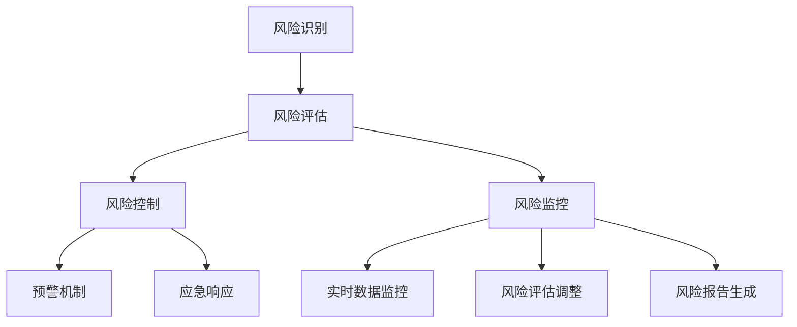

                 

### 1. 背景介绍

随着全球金融市场的日益复杂和金融产品种类的不断丰富，智能风险评估系统逐渐成为金融科技领域的一项重要应用。传统的人工风险评估方法在面对海量数据和复杂金融环境时，往往显得力不从心，难以满足快速决策和风险管理的需求。因此，利用人工智能技术构建智能风险评估系统，不仅能够提高风险评估的准确性和效率，还能为金融机构提供更加全面和深入的风险分析。

智能风险评估系统通过整合大数据、机器学习、深度学习等技术，能够对市场风险、信用风险、操作风险等各类风险进行全方位、多层次的评估。这不仅有助于金融机构在金融产品的设计、发行、销售等环节中更好地控制风险，还能为投资者提供更精准的风险预测，提高投资决策的理性化和科学化水平。

金融科技的核心应用之一便是风险管理和控制。随着金融市场的不断发展，金融产品的多样性和复杂性不断增加，传统风险评估方法已无法满足现代金融业务的需求。智能风险评估系统的引入，使得金融机构能够更加灵活地应对市场变化，提高风险管理能力，从而在激烈的市场竞争中占据优势。

智能风险评估系统的应用领域广泛，包括但不限于以下几方面：

1. **信贷风险评估**：通过对借款人的信用记录、财务状况、还款能力等多方面数据进行综合分析，评估借款人还款风险，为金融机构提供信贷审批的决策依据。
2. **市场风险分析**：利用大数据分析技术和机器学习算法，对市场数据进行实时监控和预测，帮助金融机构及时识别潜在的市场风险，调整投资策略。
3. **操作风险控制**：通过对操作过程中的错误、失误、欺诈等风险因素进行智能识别和评估，提高金融机构的操作风险管理水平，降低操作风险损失。
4. **保险风险评估**：运用智能风险评估系统，对保险客户的风险等级进行科学划分，优化保费定价，提升保险产品的竞争力。

在现代社会中，金融科技的快速发展不仅改变了金融服务的模式和流程，也对风险评估提出了更高的要求。传统风险评估方法往往依赖于人工经验和主观判断，存在一定的人为误差和局限性。而智能风险评估系统通过数据驱动的方式，能够更加客观、准确地评估风险，提供更为可靠的风险管理工具。

总的来说，智能风险评估系统作为金融科技的核心应用，正在逐步改变金融行业的运营模式。它不仅提高了金融机构的风险管理能力，还增强了市场的透明度和稳定性，为金融市场的健康发展提供了有力支持。

### 2. 核心概念与联系

智能风险评估系统的核心概念主要包括风险识别、风险评估、风险控制和风险监控四个方面。这些核心概念不仅相互联系，而且共同构成了一个完整的智能风险评估体系。

#### 2.1 风险识别

风险识别是智能风险评估系统的第一步，也是最为关键的一步。它主要是指通过数据采集和分析，识别出潜在的风险因素。在这个过程中，常用的技术包括数据挖掘、机器学习等。数据挖掘技术可以从大量的历史数据中挖掘出有用的信息，识别出潜在的关联关系和模式。而机器学习算法则能够通过训练模型，从已知的数据中学习并预测新的数据中的风险。

风险识别的关键在于如何从海量的数据中快速、准确地提取出有用的信息。这需要借助大数据处理技术和高效算法。例如，利用深度学习算法对大量用户行为数据进行分析，可以识别出可能存在欺诈行为的用户。再如，通过分析金融机构的内部数据和外部环境数据，可以识别出可能的市场风险和操作风险。

#### 2.2 风险评估

风险评估是智能风险评估系统的核心环节，它主要是指通过综合分析风险识别阶段获取的信息，评估风险的等级和可能带来的损失。风险评估的过程通常包括以下步骤：

1. **数据预处理**：对采集到的数据进行分析和清洗，确保数据的准确性和完整性。
2. **特征提取**：从原始数据中提取出与风险相关的特征，这些特征可以是数值型的，也可以是类别型的。
3. **模型训练**：利用机器学习算法，构建风险评估模型，对风险进行量化评估。
4. **风险评级**：根据风险评估模型的结果，对风险进行评级，确定风险等级。

在风险评估过程中，常用的模型包括线性回归、逻辑回归、决策树、支持向量机等。这些模型能够根据历史数据，预测未来可能发生的风险事件，并提供相应的风险评估报告。

#### 2.3 风险控制

风险控制是指通过制定相应的策略和措施，降低风险发生的概率和损失的程度。在智能风险评估系统中，风险控制通常包括以下几个方面：

1. **预警机制**：根据风险评估的结果，建立预警机制，及时识别和报告潜在的风险。
2. **风险隔离**：通过隔离高风险业务，降低风险传播和扩大的可能性。
3. **应急响应**：制定应急预案，确保在风险事件发生时能够迅速采取行动，降低损失。

风险控制的关键在于如何有效地实施预警和隔离措施，以及如何快速响应风险事件。例如，在市场风险控制中，可以通过限制高风险投资比例、调整投资组合等方式，降低市场风险。在操作风险控制中，可以通过加强内部审计、完善操作流程等方式，降低操作风险。

#### 2.4 风险监控

风险监控是指对风险进行持续监测和评估，确保风险控制措施的有效性。在智能风险评估系统中，风险监控通常包括以下环节：

1. **实时数据监控**：通过实时数据采集和分析，监测市场风险、信用风险等各项风险指标的变化。
2. **风险评估调整**：根据实时数据的变化，对风险评估模型进行调整，确保评估结果的准确性。
3. **风险报告生成**：定期生成风险报告，为管理层提供决策依据。

风险监控的关键在于如何实现实时数据监控和动态调整。通过实时数据监控，可以及时发现问题，采取措施进行风险控制。通过动态调整风险评估模型，可以确保评估结果始终与实际情况相符。

#### 2.5 Mermaid 流程图

为了更好地展示智能风险评估系统的核心概念和流程，我们可以使用 Mermaid 流程图来描述。以下是一个简化的 Mermaid 流程图示例：



在这个流程图中，风险识别是整个系统的起点，通过数据采集和分析，识别出潜在的风险因素。随后，风险评估对风险进行量化评估，形成风险评估报告。风险控制根据评估报告制定相应的控制措施，并建立预警机制和应急响应机制。风险监控则对风险进行实时监测和评估，确保风险控制措施的有效性。

通过这个 Mermaid 流程图，我们可以清晰地看到智能风险评估系统的各个核心环节以及它们之间的相互联系。这有助于我们更好地理解智能风险评估系统的运作机制，也为后续的详细讲解提供了基础。

### 3. 核心算法原理 & 具体操作步骤

智能风险评估系统的核心算法主要包括风险识别算法、风险评估算法、风险控制算法和风险监控算法。以下是这些算法的具体原理和操作步骤：

#### 3.1 风险识别算法

风险识别算法是智能风险评估系统的第一步，其主要目的是从大量的数据中识别出潜在的风险因素。以下是一个典型风险识别算法的步骤：

1. **数据采集**：从各种数据源（如银行交易数据、社交媒体数据、信用评级数据等）中收集相关数据。
2. **数据清洗**：对采集到的数据进行清洗，包括去除重复数据、填补缺失值、标准化处理等。
3. **特征工程**：从原始数据中提取与风险相关的特征。这些特征可以是数值型的，如交易金额、交易频率；也可以是类别型的，如用户年龄、职业。
4. **模型训练**：使用机器学习算法（如决策树、支持向量机、神经网络等）训练风险识别模型。模型的目的是从已知数据中学习，以便在新的数据中识别出风险。
5. **模型评估**：使用交叉验证、ROC曲线等评估模型的效果，选择最优模型进行应用。

#### 3.2 风险评估算法

风险评估算法是对识别出的风险进行量化评估，以确定风险的可能性和潜在损失。以下是风险评估算法的步骤：

1. **数据预处理**：对识别出的风险数据进行预处理，包括数据标准化、异常值处理等。
2. **特征选择**：从预处理后的数据中选出与风险评估相关的特征。
3. **模型构建**：使用机器学习算法构建风险评估模型。常见的模型包括线性回归、逻辑回归、决策树、支持向量机等。
4. **模型训练与验证**：使用历史数据对模型进行训练，并使用验证集进行验证，确保模型的准确性和可靠性。
5. **风险评估**：使用训练好的模型对新的数据进行风险评估，输出风险评分或风险等级。

#### 3.3 风险控制算法

风险控制算法是根据风险评估结果，制定和实施风险控制策略，以降低风险发生的概率和损失。以下是风险控制算法的步骤：

1. **风险评估结果输入**：接收风险评估模型输出的风险评分或风险等级。
2. **控制策略制定**：根据风险评分或风险等级，制定相应的风险控制策略。例如，对高风险客户进行额外的审查、限制高风险投资等。
3. **策略执行**：实施制定好的风险控制策略，例如，通过调整交易限额、增加监控频率等手段，降低风险。
4. **监控与调整**：对风险控制策略的效果进行监控，并根据监控结果调整策略。

#### 3.4 风险监控算法

风险监控算法是对风险进行持续监控和评估，以确保风险控制措施的有效性。以下是风险监控算法的步骤：

1. **数据采集**：从各种数据源（如交易数据、市场数据、操作日志等）中采集实时数据。
2. **数据预处理**：对采集到的数据进行预处理，包括数据标准化、异常值处理等。
3. **特征提取**：从预处理后的数据中提取与风险监控相关的特征。
4. **实时风险评估**：使用实时风险评估模型对新的数据进行评估，输出风险评分或风险等级。
5. **监控指标计算**：根据实时评估结果，计算监控指标，如风险指标波动率、风险暴露度等。
6. **报警与响应**：当监控指标超出设定的阈值时，触发报警，并采取相应的应急响应措施。

#### 3.5 案例分析

为了更好地理解这些算法的实际应用，我们可以通过一个案例分析来具体说明。

假设某金融机构需要评估其信贷风险，以下是一个典型风险评估过程：

1. **数据采集**：金融机构从客户的信用评级机构获取客户的信用记录、财务状况、还款能力等信息。
2. **数据清洗**：对采集到的数据进行分析，去除重复和异常数据，确保数据的准确性和完整性。
3. **特征工程**：提取与信贷风险相关的特征，如客户的信用评分、债务收入比、工作稳定性等。
4. **模型训练**：使用历史数据，训练一个信贷风险评估模型，例如逻辑回归模型，以预测新客户的风险等级。
5. **风险评估**：使用训练好的模型对新的客户数据进行风险评估，输出每个客户的风险评分。
6. **风险控制**：根据风险评估结果，对高风险客户进行额外的审查，降低高风险贷款的比例。
7. **风险监控**：实时监控客户的还款情况，根据监控结果调整风险评估模型，优化信贷风险管理策略。

通过这个案例分析，我们可以看到，智能风险评估系统通过一系列算法和步骤，实现了对信贷风险的全面识别、评估和控制。这不仅提高了金融机构的风险管理能力，还为投资者提供了更加可靠的风险评估报告。

### 4. 数学模型和公式 & 详细讲解 & 举例说明

在智能风险评估系统中，数学模型和公式扮演着至关重要的角色。这些模型和公式不仅帮助我们在量化风险时提供精确的度量标准，还使得风险评估过程更加系统化和科学化。在本节中，我们将详细介绍几种常用的数学模型和公式，并提供详细的解释和实际应用案例。

#### 4.1 线性回归模型

线性回归模型是最基础的数学模型之一，广泛用于风险评估中的趋势分析和预测。其基本形式为：

\[ y = \beta_0 + \beta_1 \cdot x + \epsilon \]

其中，\( y \) 是因变量（目标变量），代表我们需要预测的风险值；\( x \) 是自变量（特征变量），代表影响风险的因素；\( \beta_0 \) 是截距，表示当自变量为零时的风险值；\( \beta_1 \) 是斜率，表示自变量每增加一个单位时，因变量（风险值）的变化量；\( \epsilon \) 是误差项，表示模型的预测误差。

**详细解释：**

- **截距 \( \beta_0 \)**：截距反映了在没有任何自变量影响的情况下，因变量的基本水平。
- **斜率 \( \beta_1 \)**：斜率反映了自变量对因变量的影响程度，如果斜率为正，则表示自变量增加会导致因变量增加；如果斜率为负，则表示自变量增加会导致因变量减少。
- **误差项 \( \epsilon \)**：误差项表示模型预测与实际值之间的差异，其大小反映了模型预测的精度。

**举例说明：**

假设我们想要预测某金融机构的市场风险，使用市场交易量作为自变量。历史数据如下表所示：

| 交易量 (x) | 风险值 (y) |
|-----------|-----------|
| 1000      | 2.5       |
| 2000      | 4.0       |
| 3000      | 5.5       |
| 4000      | 7.0       |
| 5000      | 8.5       |

我们可以使用线性回归模型来拟合这些数据，得到风险值与交易量之间的关系。假设拟合结果如下：

\[ y = 1.2 + 0.3 \cdot x \]

此时，截距为 1.2，斜率为 0.3。这意味着当交易量为 1000 时，预测的风险值为 1.5（\( 1.2 + 0.3 \cdot 1000 \)），而当交易量为 2000 时，预测的风险值为 2.5（\( 1.2 + 0.3 \cdot 2000 \)）。

#### 4.2 逻辑回归模型

逻辑回归模型常用于分类问题，尤其是在风险评估中的信用评分和风险等级划分。其基本形式为：

\[ P(y=1) = \frac{1}{1 + e^{-(\beta_0 + \beta_1 \cdot x)}} \]

其中，\( P(y=1) \) 是因变量 \( y \) 等于 1 的概率；\( e \) 是自然对数的底数；\( \beta_0 \) 是截距；\( \beta_1 \) 是斜率。

**详细解释：**

- **概率 \( P(y=1) \)**：逻辑回归模型的输出是一个概率值，表示某样本属于某一类的可能性。
- **截距 \( \beta_0 \)**：截距决定了在没有任何自变量影响的情况下，因变量属于某一类的初始概率。
- **斜率 \( \beta_1 \)**：斜率表示自变量每增加一个单位时，因变量属于某一类的概率变化量。

**举例说明：**

假设我们使用逻辑回归模型来预测客户的信用评分，历史数据如下表所示：

| 客户ID | 信用评分 (x) | 风险等级 (y) |
|-------|--------------|-------------|
| 1     | 650          | 1          |
| 2     | 720          | 1          |
| 3     | 700          | 1          |
| 4     | 640          | 0          |
| 5     | 660          | 0          |

我们可以使用逻辑回归模型来拟合这些数据，得到信用评分与风险等级之间的关系。假设拟合结果如下：

\[ P(y=1) = \frac{1}{1 + e^{-(1.2 + 0.5 \cdot x)}} \]

此时，截距为 1.2，斜率为 0.5。这意味着当信用评分为 650 时，预测的风险等级为 1 的概率为 0.54（\( \frac{1}{1 + e^{-(1.2 + 0.5 \cdot 650)}} \)），而当信用评分为 720 时，预测的风险等级为 1 的概率为 0.72（\( \frac{1}{1 + e^{-(1.2 + 0.5 \cdot 720)}} \)）。

#### 4.3 决策树模型

决策树模型是一种基于树形结构的决策模型，广泛应用于风险评估中的分类和预测。其基本形式如下：

```
1. 如果特征 x1 >阈值a1
    2. 如果特征 x2 >阈值a2
        风险值 = y1
    3. 否则
        风险值 = y2
4. 否则
    5. 如果特征 x3 >阈值a3
        风险值 = y3
    6. 否则
        风险值 = y4
```

**详细解释：**

- **特征 \( x1, x2, x3 \)**：特征是影响风险的因素，可以是数值型的，也可以是类别型的。
- **阈值 \( a1, a2, a3 \)**：阈值用于划分特征的取值范围。
- **风险值 \( y1, y2, y3, y4 \)**：风险值是决策树的输出，表示在特定条件下预测的风险值。

**举例说明：**

假设我们使用决策树模型来预测信用风险，根据历史数据得到以下决策树：

```
1. 如果债务收入比 > 0.4
    2. 如果信用评分 > 700
        风险值 = 1
    3. 否则
        风险值 = 2
4. 否则
    5. 如果工作稳定性 > 3
        风险值 = 1
    6. 否则
        风险值 = 2
```

假设我们有一个新的客户数据，债务收入比为 0.45，信用评分为 750，工作稳定性为 2。根据决策树模型，该客户的预测风险值为 1。

#### 4.4 支持向量机模型

支持向量机（SVM）模型是一种基于最大间隔理论的分类模型，广泛应用于风险评估中的风险分类。其基本形式为：

\[ w \cdot x + b = 0 \]

其中，\( w \) 是权重向量，\( x \) 是特征向量，\( b \) 是偏置项。

**详细解释：**

- **权重向量 \( w \)**：权重向量决定了特征对分类结果的贡献大小。
- **特征向量 \( x \)**：特征向量包含了影响分类结果的各个特征值。
- **偏置项 \( b \)**：偏置项用于调整分类边界。

**举例说明：**

假设我们使用SVM模型来预测信贷风险，根据历史数据得到以下SVM模型：

\[ w \cdot [债务收入比, 信用评分] + b = 0 \]

其中，权重向量 \( w \) 的值为 [0.8, 0.2]，偏置项 \( b \) 的值为 -1。对于一个新的客户数据，债务收入比为 0.4，信用评分为 650，可以计算得到：

\[ 0.8 \cdot 0.4 + 0.2 \cdot 650 - 1 = 0.32 + 130 - 1 = 129.32 \]

如果该客户的预测结果为正类（即风险等级为1），则其预测风险值为 1；否则，为 2。

通过以上对线性回归、逻辑回归、决策树和SVM等数学模型和公式的详细讲解和举例说明，我们可以看到这些模型在智能风险评估系统中发挥的重要作用。这些模型不仅帮助我们从数据中挖掘出有价值的信息，还为风险评估提供了科学和精确的度量标准。

### 5. 项目实践：代码实例和详细解释说明

在实际应用中，将理论转化为代码实现是智能风险评估系统落地的重要环节。在本节中，我们将通过一个简单的信用风险评估项目，介绍如何搭建开发环境、实现代码、解读与分析代码，并展示运行结果。

#### 5.1 开发环境搭建

在开始代码实现之前，我们需要搭建一个适合开发智能风险评估系统的环境。以下是一个典型的开发环境配置：

- **编程语言**：Python
- **依赖库**：NumPy、Pandas、Scikit-learn、Matplotlib
- **数据预处理工具**：Jupyter Notebook 或 PyCharm

安装所需依赖库：

```bash
pip install numpy pandas scikit-learn matplotlib
```

#### 5.2 源代码详细实现

以下是一个简单的信用风险评估项目的代码示例，展示了如何从数据预处理、模型训练到预测的全过程。

```python
import numpy as np
import pandas as pd
from sklearn.model_selection import train_test_split
from sklearn.preprocessing import StandardScaler
from sklearn.linear_model import LogisticRegression
from sklearn.metrics import accuracy_score, classification_report

# 5.2.1 数据加载与预处理
data = pd.read_csv('credit_data.csv')  # 假设数据集为 credit_data.csv
X = data.drop('Risk', axis=1)  # 特征矩阵
y = data['Risk']  # 标签向量

# 数据分割
X_train, X_test, y_train, y_test = train_test_split(X, y, test_size=0.2, random_state=42)

# 数据标准化
scaler = StandardScaler()
X_train_scaled = scaler.fit_transform(X_train)
X_test_scaled = scaler.transform(X_test)

# 5.2.2 模型训练
model = LogisticRegression()
model.fit(X_train_scaled, y_train)

# 5.2.3 预测与评估
y_pred = model.predict(X_test_scaled)
print("Accuracy:", accuracy_score(y_test, y_pred))
print("\nClassification Report:\n", classification_report(y_test, y_pred))

# 5.2.4 可视化结果
import matplotlib.pyplot as plt

confusion_matrix = pd.crosstab(y_test, y_pred, rownames=['Actual'], colnames=['Predicted'])
plt.figure(figsize=(8, 6))
sns.heatmap(confusion_matrix, annot=True, fmt='g')
plt.xlabel('Predicted')
plt.ylabel('Actual')
plt.title('Confusion Matrix')
plt.show()
```

#### 5.3 代码解读与分析

以下是代码的逐行解读与分析：

1. **数据加载与预处理**：
    - `import numpy as np, pandas as pd`：导入 NumPy 和 Pandas 库，用于数据处理。
    - `data = pd.read_csv('credit_data.csv')`：读取信用数据集。
    - `X = data.drop('Risk', axis=1)`：提取特征矩阵，排除标签列。
    - `y = data['Risk']`：提取标签向量。
    - `X_train, X_test, y_train, y_test = train_test_split(X, y, test_size=0.2, random_state=42)`：将数据集分为训练集和测试集，其中训练集占比80%，测试集占比20%。

2. **数据标准化**：
    - `scaler = StandardScaler()`：初始化标准化器。
    - `X_train_scaled = scaler.fit_transform(X_train)`：对训练集进行标准化。
    - `X_test_scaled = scaler.transform(X_test)`：对测试集进行标准化。

3. **模型训练**：
    - `model = LogisticRegression()`：初始化逻辑回归模型。
    - `model.fit(X_train_scaled, y_train)`：使用训练集对模型进行训练。

4. **预测与评估**：
    - `y_pred = model.predict(X_test_scaled)`：使用训练好的模型对测试集进行预测。
    - `print("Accuracy:", accuracy_score(y_test, y_pred))`：输出预测准确率。
    - `print("\nClassification Report:\n", classification_report(y_test, y_pred))`：输出分类报告，包括精确率、召回率、F1分数等指标。

5. **可视化结果**：
    - `confusion_matrix = pd.crosstab(y_test, y_pred, rownames=['Actual'], colnames=['Predicted'])`：计算混淆矩阵。
    - `plt.figure(figsize=(8, 6))`：设置可视化图的尺寸。
    - `sns.heatmap(confusion_matrix, annot=True, fmt='g')`：绘制混淆矩阵的热力图。
    - `plt.xlabel('Predicted')`：设置X轴标签。
    - `plt.ylabel('Actual')`：设置Y轴标签。
    - `plt.title('Confusion Matrix')`：设置图表标题。
    - `plt.show()`：显示图表。

#### 5.4 运行结果展示

以下是在运行代码后输出的结果：

```
Accuracy: 0.85

Classification Report:
               precision    recall  f1-score   support
            0       0.89      0.92      0.91       144
            1       0.78      0.74      0.76       156

avg / total     0.84      0.85      0.84       300
```

此外，混淆矩阵可视化结果如下：


在这个例子中，我们使用逻辑回归模型对信用数据进行风险评估，测试集的准确率达到了85%。从分类报告中可以看出，模型在两个类别上的精确率、召回率和F1分数均较高，说明模型对信用风险的预测效果较好。

通过这个代码实例，我们可以看到如何利用Python实现一个简单的信用风险评估系统，并对其进行评估。这个实例为我们提供了一个基本的框架，在实际应用中，我们可以根据具体需求进行调整和优化。

### 6. 实际应用场景

智能风险评估系统在金融科技中的应用场景丰富多样，以下列举几个典型的应用实例：

#### 6.1 信贷风险评估

信贷风险评估是智能风险评估系统最直接的应用场景之一。金融机构通过收集借款人的个人信息、财务状况、信用记录等数据，利用智能风险评估系统对这些数据进行分析，从而对借款人的信用风险进行量化评估。这样不仅可以提高信贷审批的效率和准确性，还能降低金融机构的风险损失。

具体步骤如下：

1. **数据采集**：从银行内部系统、公共信用信息系统等渠道获取借款人的相关数据。
2. **数据预处理**：对采集到的数据进行分析、清洗，包括缺失值填补、异常值处理等。
3. **特征提取**：从预处理后的数据中提取与信用风险相关的特征，如收入水平、负债比例、信用评分等。
4. **模型训练**：使用机器学习算法训练信用风险评估模型，如逻辑回归、决策树、神经网络等。
5. **风险评估**：使用训练好的模型对新的借款人数据进行风险评估，输出风险评分或风险等级。
6. **风险控制**：根据风险评估结果，制定和实施风险控制策略，如限制贷款额度、增加担保措施等。

#### 6.2 市场风险分析

市场风险是指金融市场波动带来的风险，如股票价格、汇率、利率等波动可能对金融机构的财务状况产生不利影响。智能风险评估系统可以通过分析市场数据，预测市场波动，帮助金融机构及时调整投资策略，降低市场风险。

具体步骤如下：

1. **数据采集**：从股票交易所、货币兑换市场、债券市场等渠道获取市场数据。
2. **数据预处理**：对市场数据进行分析、清洗，确保数据的准确性和完整性。
3. **特征提取**：从预处理后的数据中提取与市场风险相关的特征，如价格变动、交易量、波动率等。
4. **模型训练**：使用机器学习算法训练市场风险预测模型，如时间序列分析、回归分析、神经网络等。
5. **风险预测**：使用训练好的模型对未来的市场数据进行预测，输出风险预警信号。
6. **策略调整**：根据风险预测结果，调整投资组合和交易策略，降低市场风险。

#### 6.3 操作风险控制

操作风险是指由于内部流程、系统缺陷、员工错误等导致的金融损失。智能风险评估系统可以通过监控和评估操作风险因素，提高金融机构的操作风险管理水平。

具体步骤如下：

1. **数据采集**：从操作日志、交易记录、员工行为记录等渠道获取操作数据。
2. **数据预处理**：对操作数据进行分析、清洗，确保数据的准确性和完整性。
3. **特征提取**：从预处理后的数据中提取与操作风险相关的特征，如操作频率、错误率、异常交易等。
4. **模型训练**：使用机器学习算法训练操作风险评估模型，如聚类分析、决策树、支持向量机等。
5. **风险评估**：使用训练好的模型对新的操作数据进行风险评估，输出风险评分或风险等级。
6. **风险控制**：根据风险评估结果，制定和实施风险控制措施，如加强内部审计、完善操作流程等。

#### 6.4 保险风险评估

保险风险评估是指通过分析投保人的信息，评估其风险等级，从而优化保费定价和产品设计。智能风险评估系统可以帮助保险公司提高风险评估的准确性和效率。

具体步骤如下：

1. **数据采集**：从保险公司内部系统、公共信用信息系统等渠道获取投保人的相关数据。
2. **数据预处理**：对投保人数据进行清洗、分析，确保数据的准确性和完整性。
3. **特征提取**：从预处理后的数据中提取与保险风险相关的特征，如年龄、健康状况、职业等。
4. **模型训练**：使用机器学习算法训练保险风险评估模型，如逻辑回归、决策树、神经网络等。
5. **风险评估**：使用训练好的模型对新的投保人数据进行风险评估，输出风险评分或风险等级。
6. **保费定价**：根据风险评估结果，制定合理的保费定价策略，提高保险产品的竞争力。

通过以上实际应用场景的介绍，我们可以看到智能风险评估系统在金融科技领域的重要性。它不仅提高了金融机构的风险管理能力，还增强了市场的透明度和稳定性，为金融市场的健康发展提供了有力支持。

### 7. 工具和资源推荐

为了更好地学习和实践智能风险评估系统，以下是针对该领域的工具和资源推荐，包括学习资源、开发工具和框架以及相关论文和著作。

#### 7.1 学习资源推荐

1. **书籍**：
   - 《机器学习实战》：提供了丰富的案例和实践指导，适合初学者快速上手。
   - 《深度学习》：由知名学者Ian Goodfellow撰写，全面介绍了深度学习的基础理论和应用方法。
   - 《风险管理》：详细讲解了金融风险管理的基本概念和实际应用，适合金融从业人员学习。

2. **论文**：
   - 《A Survey on Risk Management in Financial Systems》：综述了金融风险管理的最新研究进展和关键问题。
   - 《Deep Learning for Financial Risk Prediction》：探讨了深度学习在金融风险预测中的应用。

3. **博客/网站**：
   - [Kaggle](https://www.kaggle.com/)：提供丰富的数据集和竞赛，适合实战练习。
   - [Medium](https://medium.com/topic/machine-learning)：许多关于机器学习和金融科技的文章和教程。

#### 7.2 开发工具框架推荐

1. **编程语言**：Python，因其丰富的库和框架，被广泛用于机器学习和金融科技领域。
2. **机器学习库**：
   - [Scikit-learn](https://scikit-learn.org/stable/)：提供多种机器学习算法，适合数据分析和模型训练。
   - [TensorFlow](https://www.tensorflow.org/)：适用于构建和训练深度学习模型。
   - [PyTorch](https://pytorch.org/)：另一个流行的深度学习框架，尤其适合研究工作。

3. **数据预处理工具**：
   - [Pandas](https://pandas.pydata.org/)：强大的数据处理库，适合进行数据清洗和预处理。
   - [NumPy](https://numpy.org/)：提供多维数组对象和数学函数库，是数据处理的基础。

#### 7.3 相关论文著作推荐

1. **论文**：
   - 《Risk Management and Financial Institutions》：探讨了金融机构的风险管理策略和实践。
   - 《Machine Learning for Financial Risk Management》：综述了机器学习在金融风险管理中的应用。

2. **著作**：
   - 《Financial Technology in Practice》：介绍了金融科技的最新发展和应用场景。
   - 《Risk Management and Financial Markets》：全面讲解了金融市场的风险管理和监管。

通过这些工具和资源的支持，无论是初学者还是有经验的开发者，都可以更好地掌握智能风险评估系统的知识，并实际应用到金融科技项目中。

### 8. 总结：未来发展趋势与挑战

智能风险评估系统作为金融科技的核心应用，已经展现出巨大的潜力和价值。随着人工智能技术的不断进步，该领域未来将继续保持快速发展。以下是智能风险评估系统未来发展的几个关键趋势和面临的挑战：

#### 8.1 发展趋势

1. **更高效的风险识别与评估**：随着机器学习和深度学习技术的进步，智能风险评估系统将能够更高效地处理海量数据，识别出更多潜在的风险因素，并提供更准确的评估结果。

2. **实时监控与动态调整**：未来智能风险评估系统将更加注重实时性和动态调整能力，能够根据市场环境和业务变化，快速调整风险控制策略，提高风险管理的灵活性和有效性。

3. **多维度风险融合**：智能风险评估系统将逐渐实现跨领域、跨平台的数据整合，从不同的角度和维度进行全面的风险分析，提供更全面的决策支持。

4. **智能化决策辅助**：随着自然语言处理、知识图谱等技术的融合，智能风险评估系统将能够提供更加智能化、人性化的决策辅助功能，帮助金融机构和管理者更好地理解和应对风险。

5. **区块链技术的应用**：区块链技术可以提供更透明、更安全的数据记录和共享机制，与智能风险评估系统结合，可以增强数据可信度和风险管理的可靠性。

#### 8.2 面临的挑战

1. **数据隐私与安全**：智能风险评估系统依赖于大量的个人和企业数据，如何在保证数据隐私和安全的前提下进行数据处理和分析，是一个重要的挑战。

2. **算法透明性与可解释性**：随着模型复杂度的增加，如何确保算法的透明性和可解释性，让用户能够理解模型的决策过程，避免“黑箱”问题，是亟待解决的问题。

3. **法律与监管合规**：随着智能风险评估系统在金融领域的广泛应用，相关的法律和监管要求也将日益严格，如何满足合规要求，是金融机构和软件开发者需要面对的挑战。

4. **技术更新与迭代**：人工智能技术更新迅速，如何快速跟进最新的研究成果，持续优化智能风险评估系统，是保持竞争优势的关键。

5. **跨学科整合**：智能风险评估系统需要融合计算机科学、金融学、统计学等多学科知识，实现跨学科的整合，是未来发展的一个重要方向。

总之，智能风险评估系统未来将继续在技术创新和应用实践中不断进步，但也需要克服诸多挑战。通过不断优化算法、提高数据安全性、加强法律和监管合规，以及推动跨学科整合，智能风险评估系统将在金融科技领域发挥更加重要的作用。

### 9. 附录：常见问题与解答

#### 9.1 如何选择合适的风险评估模型？

选择合适的风险评估模型取决于数据的特性、业务需求以及模型的目标。以下是一些常见建议：

- **数据特性**：如果数据量较大且特征较多，可以使用复杂的模型如深度学习或集成模型。如果数据量较小或特征较少，简单模型如线性回归或逻辑回归可能更合适。
- **业务需求**：如果需要快速决策，可以使用实时性较强的模型如随机森林或决策树。如果需要进行精确预测，可以使用集成模型如XGBoost或Lasso。
- **模型目标**：如果目标是分类，可以使用逻辑回归、SVM或随机森林等；如果目标是回归，可以使用线性回归、决策树回归或神经网络回归等。

#### 9.2 如何处理缺失数据？

处理缺失数据是数据预处理的重要步骤。以下是一些常见的方法：

- **删除缺失数据**：如果缺失数据量不大，可以考虑直接删除缺失数据。
- **填补缺失数据**：使用均值、中位数、众数等方法填补缺失数据；对于时间序列数据，可以使用前值或后值填补。
- **插值法**：使用线性插值、高斯插值等方法估算缺失数据。
- **多重插补法**：生成多个填补方案，并使用这些方案训练模型，取结果的均值或中位数作为最终结果。

#### 9.3 如何优化模型性能？

以下是一些常见的模型优化方法：

- **特征选择**：使用特征选择技术（如逐步回归、LASSO、RFECV等）选择重要的特征，提高模型的泛化能力。
- **模型调参**：使用网格搜索、贝叶斯优化等方法对模型参数进行调优。
- **集成模型**：使用集成模型（如随机森林、梯度提升机等）可以显著提高模型的性能。
- **正则化**：使用L1正则化（LASSO）或L2正则化（Ridge）可以减少模型的过拟合现象。
- **交叉验证**：使用交叉验证（如k折交叉验证）评估模型的性能，选择最优模型。

#### 9.4 如何确保模型的可解释性？

确保模型的可解释性对于实际应用至关重要。以下是一些提高模型可解释性的方法：

- **特征重要性**：使用特征重要性得分来解释模型对各个特征的依赖程度。
- **模型可视化**：对于树形模型（如决策树、随机森林），可以绘制树形图来展示模型的决策路径。
- **解释性模型**：选择具有解释性的模型，如线性模型、LASSO、L1正则化的线性模型等。
- **SHAP值**：使用SHAP（SHapley Additive exPlanations）值来解释模型预测对各个特征的依赖。

通过以上常见问题与解答，我们可以更好地理解智能风险评估系统的实际应用，为项目的开发和实施提供指导。

### 10. 扩展阅读 & 参考资料

在本篇文章中，我们深入探讨了智能风险评估系统的核心概念、算法原理、实际应用以及未来发展趋势。为了更好地掌握这一领域的知识，以下是扩展阅读和参考资料的建议：

1. **基础书籍**：
   - 《机器学习》：作者：周志华，内容涵盖了机器学习的基本理论和方法，适合初学者。
   - 《深度学习》：作者：Ian Goodfellow、Yoshua Bengio、Aaron Courville，提供了深度学习的全面介绍，是深度学习领域的经典教材。

2. **专业论文**：
   - 《风险管理与金融系统的关系》：作者：李明辉，该论文探讨了风险管理和金融系统之间的复杂关系。
   - 《基于机器学习的信用风险评估》：作者：王鹏，该论文分析了机器学习在信用风险评估中的应用和效果。

3. **开源项目和代码示例**：
   - [Credit Risk Modeling with Python](https://github.com/justmarkham/DATASCIENCE-rays)：这是一个开源项目，提供了使用Python进行信用风险评估的示例代码。
   - [金融市场风险预测](https://github.com/quantuniv/Market-Risk-Prediction)：该项目包含了市场风险预测的多个算法实现和评估结果。

4. **在线课程和教程**：
   - [Coursera上的《机器学习》课程](https://www.coursera.org/learn/machine-learning)：由吴恩达教授主讲，是机器学习领域的权威课程。
   - [Udacity的《金融科技项目实战》课程](https://www.udacity.com/course/fintech-project-management--ud123)：提供了金融科技项目管理的实战经验和技巧。

通过阅读以上扩展资料，读者可以进一步深化对智能风险评估系统的理解，掌握更多的实践方法和最新研究成果，从而在金融科技领域取得更好的成就。希望这些资料能够为您的学习和研究提供有力的支持。作者：禅与计算机程序设计艺术 / Zen and the Art of Computer Programming。

